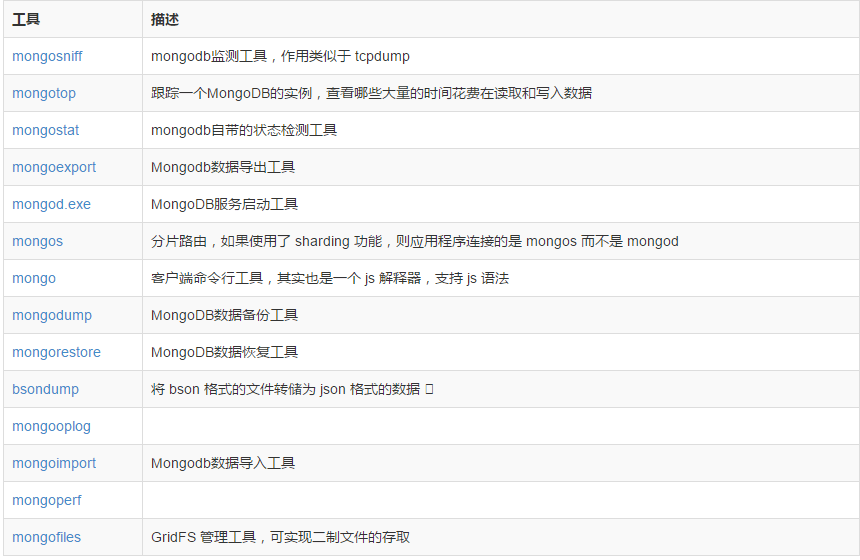
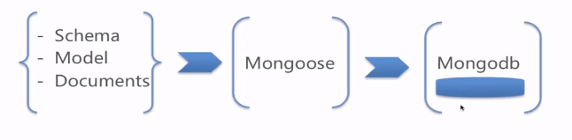

## MongoDB 数据库

MongoDB 和 Node.js 特别般配，因为 Mongodb 是基于文档的非关系型数据库，属于 NoSQL 数据库，还包括 Redis 等。文档是按 BSON（JSON 的轻量化二进制格式）存储的，增删改查等管理数据库的命令和 JavaScript 语法很像

MongoDB 是一个基于分布式文件存储的数据库。由 C++ 语言编写，旨在为 WEB 应用提供可扩展的高性能数据存储解决方案。MongoDB 使用集合（collection）和文档（document）来描述和存储数据，集合（collection）就相当于表，文档（document）相当于行，字段相当于列，不像 MySQL 之类的关系型数据库，表结构是固定的，比如某一行由若干列组成，行行都一样，而 MongoDB 不同，一个集合里的多个文档可以有不同的结构，更灵活一些

MongoDB 有自己很鲜明的特色，总结起来有以下 4 条

1、没有表结构的限制

传统 SQL 数据库中，对每张表都需要定义表结构。如果有新的存储需求，往往需要添加新的字段，更改表结构。在一些场景下，会显得很不方便，而对于 MongoDB，这不再是问题。因为它没有表结构这个概念，在使用一张表之前，不需要对这张表进行任何初始化操作。MongoDB 的这种特性对快捷开发和多变的业务需求是很合适的

2、完全的索引支持

有些 NoSQL 数据库，比如 redis，它是内存数据库，速度很快。但是，做为键值数据库，只支持一种按键查询的方式。灵活性、使用范围和易用性都受到影响；再比如 hbase，写入速度很快。但是，同样查询受限，它只支持单索引，二级索引需要自己实现

而 MongoDB 支持单键索引、多键索引、全文索引和地理位置索引。所以 MongoDB 是功能非常完善的 NoSQL 数据库，也被称为最接近关系数据库的非关系数据库

3、良好的数据安全性和方便的规模扩展

MongoDB 使用复制集做多副本存储，以保证数据的安全性。同时，MongoDB 内置的分片技术可以很方便地进行数据规模的扩展。分片技术是很新颖的一个特性，它包含了自动数据接口，动态扩容和缩容等一系列在其他数据库中需要大量人工操作的工作，同时提供了对数据库的统一访问入口，不需要在应用层再进行分发，显著减少了人工成本

4、完善的文档支持和驱动支持

在 conf 文件夹下新建 mongod.conf 文件，在这个文件中将设置 mongodb 启动的配置参数:

dbpath = data  
logpath = log/mongod.log

```bash
# 启动服务器
mongod -f conf/mongod.conf
# 关闭服务器
mongod --shutdown
# 切换到admin数据库
use admin

# 创建管理员账户，并赋予userAdminAnyDatabase角色
db.createUser({user: "admin",pwd: "123456",roles: [ { role: "userAdminAnyDatabase", db: "admin" } ]})
# 创建超级用户
db.createUser({user: "root",pwd: "123456",roles: [ { role: "root", db: "admin" } ]})

# 验证权限
db.auth('admin','123456')

# 命令来关闭服务
db.shutdownServer()

# 查看数据库
show dbs

# 查看集合
show collections

# 删除当前所选数据库
db.dropDatabase()
```

## Mongoose

Mongoose 是在 node.js 异步环境下对 mongodb 进行便捷操作的对象模型工具。Mongoose 是 NodeJS 的驱动，不能作为其他语言的驱动。Mongoose 有两个特点

1、通过关系型数据库的思想来设计非关系型数据库

2、基于 mongodb 驱动，简化操作

Mongooose 中，有三个比较重要的概念，分别是 Schema、Model、Entity。它们的关系是：Schema 生成 Model，Model 创造 Document，Model 和 Document 都可对数据库操作造成影响，但 Model 比 Document 更具操作性

Schema 用于定义数据库的结构。类似创建表时的数据定义(不仅仅可以定义文档的结构和属性，还可以定义文档的实例方法、静态模型方法、复合索引等)，每个 Schema 会映射到 mongodb 中的一个 collection，Schema 不具备操作数据库的能力

Model 是由 Schema 编译而成的构造器，具有抽象属性和行为，可以对数据库进行增删查改。Model 的每一个实例（instance）就是一个文档 document

Document 是由 Model 创建的实体，它的操作也会影响数据库


## 链接数据库

确保提前已经安装好 mongoDB 数据库，并且服务已经启动成功。

```js
var mongoose = require("mongoose");
mongoose.Promise = global.Promise;

// 数据库配置选项
var options = {
  db: { native_parser: true }, //数据库设置
  server: { poolSize: 5 }, //服务器设置
  replset: { rs_name: "myReplicaSetName" }, //副本集设置
  auth: true, //鉴权开启，需要输入用户名和密码
  user: "myUserName", //用户名
  pass: "myPassword", //密码
  mongos: true, //连接多个数据库,需要设置多个url以,隔开
};

// 链接MongoDB
mongoose.connect("mongodb://localhost/chenjunhua", options, error => {
  if (err) {
    console.log("连接失败");
  } else {
    console.log("连接成功");
  }
});

//测试是否链接成功
mongoose.connection
  .once("open", () => {
    console.log("数据库链接成功");
  })
  .on("error", error => {
    console.log("链接失败：", error);
  });

// 断开连接
mongoose.disconnect(() => console.log("连接断开"));
```

## 创建数据库

models.js:

```js
//集合collections 数据模型model
const mongoose = require("mongoose");

//获取规范类
const Schema = mongoose.Schema;

//规范数据格式
const MarioCharSchema = new Schema({
  name: String,
  weight: Number,
  date: Date,
  buffer: Buffer,
  boolean: Boolean,
  mixed: Mixed,
  objectId: ObjectId,
  array: Array,
  comments: [{ body: String, date: Date }],
  dateDefault: {
    type: Date,
    default: Date.now, //默认值
    validate(name) {
      return name.length > 4;
    }, // 自定义匹配
    required: true, //数据必须填写
    min: 10, //最小值(只适用于数字)
    max: 100, //最大值(只适用于数字)
    match: /[a-z]/, //正则匹配(只适用于字符串)
    enum: ["a", "b", "c"], //枚举匹配(只适用于字符串)
  },
  meta: {
    votes: Number,
    favs: Number,
  },
});

// 在Schema定义后添加其他字段，可以使用add()方法
MarioCharSchema.add({ color: String });

// 通过methods 给document自定义方法
MarioCharSchema.methods.findSimilarSizes = function (cb) {
  return this.model("zhangjinxi").find({ size: this.size }, cb);
};

// 通过Schema对象的statics属性给 Model 添加静态方法
MarioCharSchema.statics.findByName = function (name, cb) {
  return this.find({ name: new RegExp(name, "i") }, cb);
};

// 通过schema对象的query属性，给model添加查询方法
MarioCharSchema.query.byName = function (name) {
  return this.find({ name: new RegExp(name) });
};

//根据指定schema创建model：zhangjinxi
const marioModel = mongoose.model("zhangjinxi", MarioCharSchema);

// 调用schema 的自定义方法
marioModel.findByName("doc1", function (err, docs) {
  console.log(docs);
});

module.exports = {
  marioModel,
};
```

## 使用数据库

```js
// mocha测试库
const mocha = require("mocha");

// assert断言库
const assert = require("assert");

// 引入创建的 model：zhangjinxi
const { marioModel } = require("./models.js");

describe("测试数据库的增删改查功能", () => {
  it("添加数据:通过对Model使用new方法", () => {
    // 实例化出文档document对象
    let documentObject = new marioModel({
      name: "chenjunhua",
      weight: 22,
      date: new Date(),
      buffer: new Buffer(),
      boolean: true,
      mixed: Mixed,
      objectId: ObjectId,
      array: Array,
      comments: [{ body: String, date: Date }],
      dateDefault: { type: Date, default: Date.now },
      meta: { votes: Number, favs: Number },
    });

    // 将document对象保存到数据库的集合中
    documentObject.save().then(result => {
      assert(result.name === 'chenjunhua')
    });
    // 调用自定义方法
    documentObject.findSimilarSizes(function (err, docs) {
      docs.forEach(function (item, index, arr) {
        console.log(item.name);
      });
    });
  });

  it("添加数据:Model.create(doc(s), [callback])", () => {
    marioModel.create({ name: "zhang" }, { name: "jinxi" }, (err, doc1, doc2) =>
      console.log(doc1, doc2)
    );
  });

  it("添加数据:Model.insertMany(doc(s), [options], [callback])", () => {
    marioModel.insertMany([{ name: "zhang" }, { name: "jinxi" }], (err, docs) =>
      console.log(docs)
    );
  });

  it("删除数据", () => {
    // model.remove(conditions, [callback])
    // document.remove([callback])
    // Model.findOneAndRemove(conditions, [options], [callback])
    // Model.findByIdAndRemove(id, [options], [callback])
    marioModel.findOneAndRemove({ name: "zhangjinxi" }).then(result => {
      console.log(result, "result");
    });
  });

  it("获取数据", () => {
    // Model.find(conditions, [projection], [options], [callback])
    // Model.findById(id, [projection], [options], [callback])
    // Model.findOne([conditions], [projection], [options], [callback])
    marioModel.find({$where:"this.name == this.defaultName"}).then(result => {
      console.log(result, "result");
    });

    // 查询age>20的记录，只输出name字段
    marioModel
      .findOne({ age: { $gt: 20 } }, { name: 1, _id: 0 }, (err, doc) =>
        console.log(doc)
      )
      .then(result => {
        console.log(result.name);
        done();
      });

    // 调用schema上自定义的方法byName()。exec(callback[err,docs])
    marioModel
      .find({$where:"obj.x == obj.y"}).
      .byName("huo")
      .exec(function (err, docs) {
        console.log(docs);
      });
  });

  it("更改数据", () => {
    let options = {
      safe (boolean),// 默认为true。安全模式。
  　　upsert (boolean),//默认为false。如果不存在则创建新记录。
  　　multi (boolean),//默认为false。是否更新多个查询记录。
  　　runValidators,//如果值为true，执行Validation验证。
  　　setDefaultsOnInsert,//如果upsert选项为true，在新建时插入文档定义的默认值。
  　　strict (boolean),//以strict模式进行更新。
  　　overwrite (boolean),//默认为false。禁用update-only模式，允许覆盖记录。
    }

// Model.update(conditions, doc, [options], [callback])
// Model.updateOne(conditions, doc, [options], [callback])
// Model.updateMany(conditions, doc, [options], [callback])
// model.find() + document.save()
// model.findOne() + document.save()
// Model.findOneAndUpdate([conditions], [update], [options], [callback])
// Model.findByIdAndUpdate([conditions], [update], [options], [callback])
    marioModel
      .findOneAndUpdate({$where:function(){
        return obj.x !== obj.y;
      }},{age:30})
      .then(result => {
        console.log(result, "result");
      });
  });
});
```

## 查询条件

```bash
$where  使用任意的JavaScript作为查询的一部分

$or　　　　或关系
$nor　　　 或关系取反

$gt　　　　大于
$gte　　　 大于等于
$lt　　　　小于
$lte　　　 小于等于
$ne　　　　不等于

$in　　　　在多个值范围内
$nin　　　 不在多个值范围内
$all　　　 匹配数组中多个值

$regex　　 正则，用于模糊查询
$size　　　匹配数组大小
$mod　　　　取模运算
$near　　　 邻域查询，查询附近的位置（基于LBS）
$exists　　 字段是否存在
$elemMatch　匹配数组内的元素

$within　　　范围查询（基于LBS）
$box　　　　 范围查询，矩形范围（基于LBS）
$center　　　范围醒询，圆形范围（基于LBS）
$centerSphere　范围查询，球形范围（基于LBS）
$maxDistance　范围查询，距离（基于LBS）

$slice　　　　查询字段集合中的元素（比如从第几个之后，第N到第M个元素

# 工具函数：
sort() 排序
skip() 跳过
limit() 限制数量
select() 显示字段
exec() 执行
count() 计数
distinct() 去重

model
.find()
.skip(1)
.limit(2)
.sort("-age")
.select({name:1, age:1, _id:0})
.select("name age -_id")
.distinct('x',function(err,distinct){
    console.log(distinct);
})
.count(function(err,count){
    console.log(count);//4
})
.exec(function(err,docs){
    console.log(docs);
});
```

## 前后钩子函数

前后钩子即 pre()和 post()方法，又称为中间件，是在执行某些操作时可以执行的函数。中间件在 schema 上指定，类似于静态方法或实例方法等。可以在数据库执行下列操作时，设置前后钩子

```js
init;
validate;
save;
remove;
count;
find;
findOne;
findOneAndRemove;
findOneAndUpdate;
insertMany;
update;

var schema = new mongoose.Schema({
  age: Number,
  name: String,
  x: Number,
  y: Number,
});

schema.pre("find", function (next) {
  console.log("我是pre方法1");
  next();
});
schema.pre("find", function (next) {
  console.log("我是pre方法2");
  next();
});
schema.post("find", function (docs) {
  console.log("我是post方法1");
});
schema.post("find", function (docs) {
  console.log("我是post方法2");
});

var temp = mongoose.model("temp", schema);
temp.find(function (err, docs) {
  console.log(docs[0]);
});

/*
我是pre方法1
我是pre方法2
{ _id: 5972ed35e66,name: 'jinxi',age: 27,x: 1,y: 2 }
我是post方法1
我是post方法2
*/
```
