## 连接 MySQL

格式： mysql -h 主机地址 -u 用户名 －p 用户密码

```bash
#连接本机
mysql -uroot -proot
#连接远程
mysql -h10.0.0.10 -uroot -proot


mysql> use test;
mysql> source /home/test/database.sql;
```

## 数据类型

数据类型是指列、存储过程参数、表达式和局部变量的数据特征，它决定了数据的存储格式，代表了不同的信息类型。mysql 中的数据类型主要包括整型、浮点型、日期时间型和字符型

关键字 UNSIGNED 表示无符号值。数据库并没有布尔类型 BOOLEAN，如果声明类型为 BOOLEAN，则会被转换为 TINYINT 类型，true 转换为 1，false 转换为 0

字符型：VARCHAR(number)、LONGTEXT

整型：
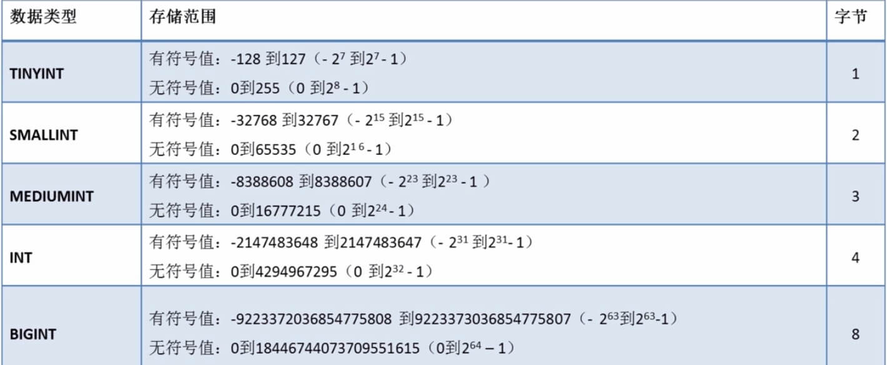
浮点型：
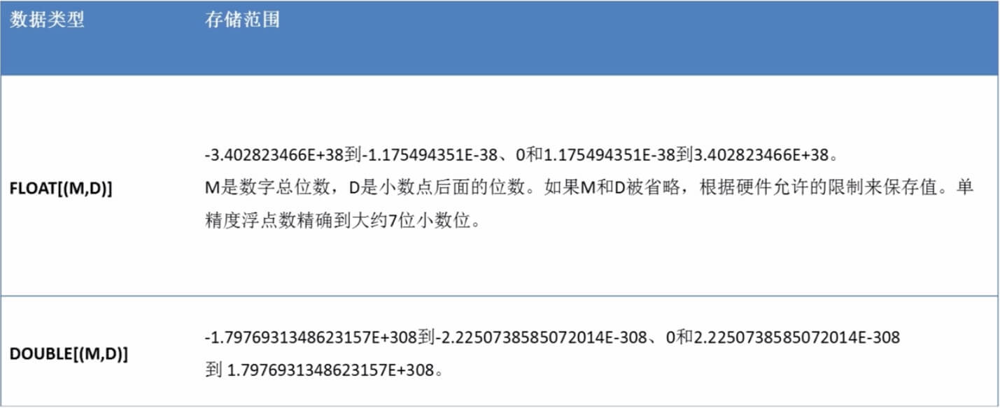
日期时间：
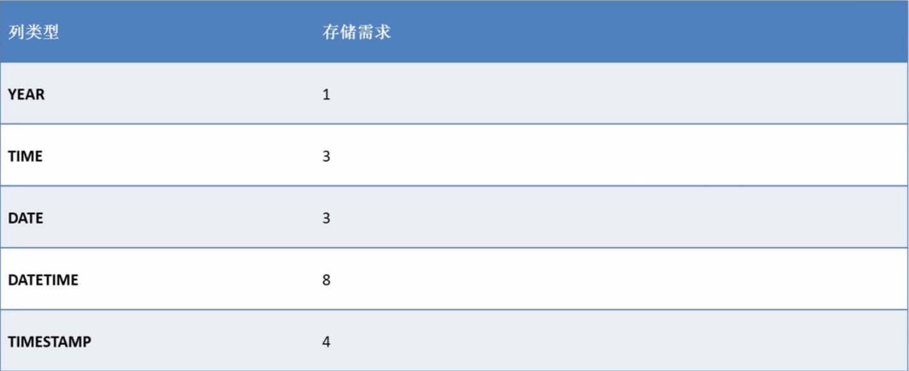

## SQL 函数

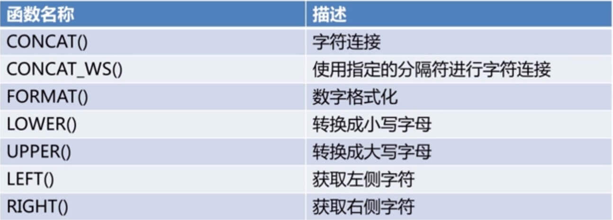
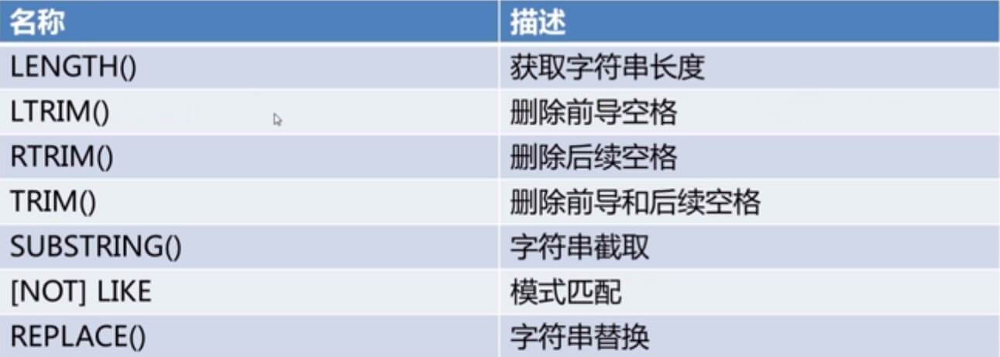
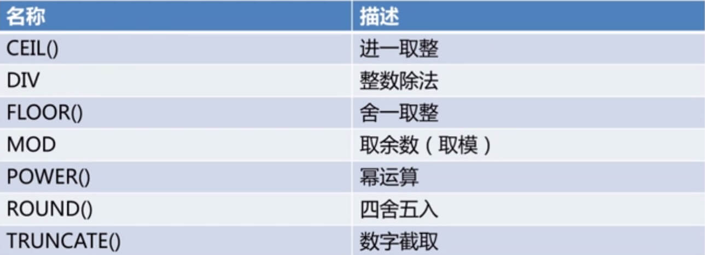
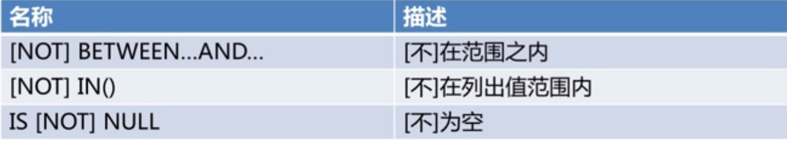
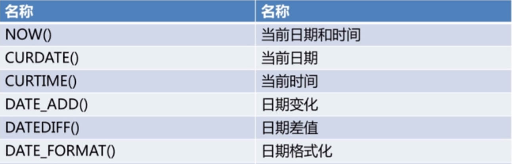
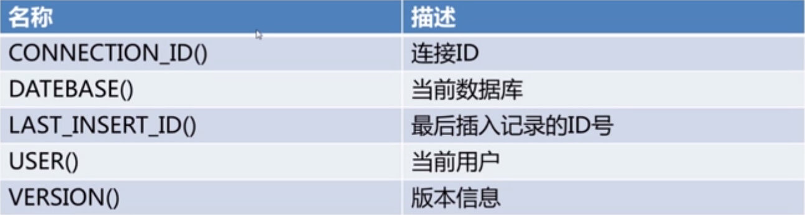
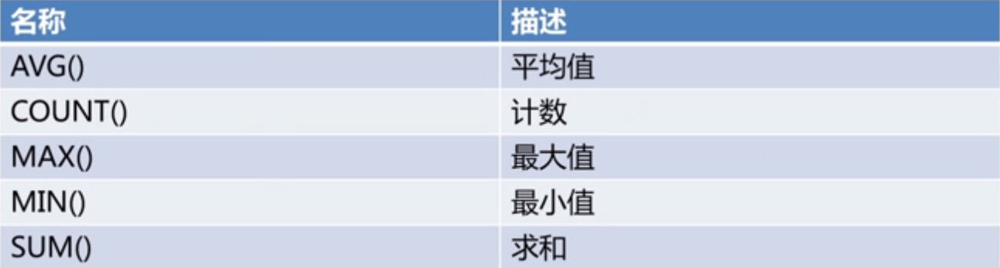
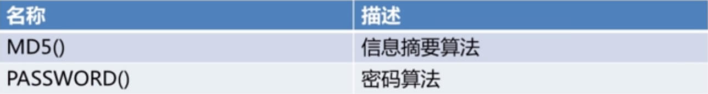

```sql
SELECT COUNT(num) FROM users
```

## 导入导出

mysqldump -u[用户名] -h[ip] -p[密码] -P[端口号] 数据库名 表名 >导出的文件名.sql

```sql
-- 导出education数据库里面的users表的表数据和表结构
mysqldump -uroot -h127.0.0.1 -proot -P3306 education users>d:/user.sql
```

## SQL 语法

SQL 是一门用于访问和处理数据库的 ANSI 的标准计算机语言。

RDBMS 指的是关系型数据库管理系统，RDBMS 是 SQL 的基础，同样也是所有现代数据库系统的基础，比如 Oracle、MySQL 和 Access。RDBMS 中的数据存储在被称为表(tables)的数据库对象中。表是相关的数据项的集合，它由列和行组成

```sql
-- SQL语法规范：
-- 1、关键字与函数名称全部大写
-- 2、数据库名称、表名称、字段名称全部小写
-- 3、SQL语句必须以分号结尾
SELECT VERSION();         显示当前服务器版本
SELECT NOW();             显示当前日期时间
SELECT USER();            显示当前用户

-- 创建数据库
CREATE {DATABASE | SCHEMA} [IF NOT EXISTS] db_name [DEFAULT] CHARACTER SET [=] charset_name

CREATE SCHEMA `myblog`;

-- 查看数据库列表
SHOW {DATABASES | SCHEMAS} [LIKE 'pattern' | WHERE expr]
SHOW TABLES;

-- 修改数据库
ALTER {DATABASE | SCHEMA} [db_name] [DEFAULT] CHARACTER SET [=] charset_name

-- 删除数据库
DROP {DATABASE | SCHEMA} [IF EXISTS] db_name

-- 创建数据表
CREATE TABLE [IF NOT EXISTS] table_name(column_name data_type,...)

-- 创建users表 id自增并设为primaryKey username唯一
CREATE TABLE `myblog`.`users` (
	`id` INT NOT NULL AUTO_INCREMENT,
	`username` VARCHAR(20) NOT NULL UNIQUE KEY,
	`password` VARCHAR(32) NOT NULL,
	`realname` VARCHAR(10) NOT NULL,
  `state` INT NOT NULL DEFAULT 1,
	PRIMARY KEY (`id`));

-- 创建blogs表 FOREIGN KEY：保持数据一致性和完整性，实现一对一或一对多的关系
CREATE TABLE `myblog`.`blogs` (
	`id` INT NOT NULL AUTO_INCREMENT FOREIGN KEY,
	`title` VARCHAR(50) NOT NULL,
	`content` LONGTEXT NOT NULL,
	`createtime` BIGINT(20) NOT NULL DEFAULT 0,
	`author` VARCHAR(20) NOT NULL,
	PRIMARY KEY (`id`));

-- 表列操作 ADD：添加列
ALTER TABLE tableName ADD[COLUMN] (col_name column_definition,...);
-- DROP ：删除列
ALTER TABLE tb1_name DROP col1_name, DROP col2_name, ...


-- 选择数据库
use myblog

-- 查看数据表
SHOW TABLES [FROM db_name] [LIKE 'pattern' | WHERE expr]
SHOW COLUMNS FORM blogs

-- 新增数据
INSERT [INTO] tbl_name [(col_name,...)] VALUES(VAL,...)

INSERT INTO users(username, `password`, realname) VALUES('ww', '123', 'wuwu');
INSERT INTO users(username, `password`, realname) VALUES('cc', '123', 'chenchen');

-- 查询数据 条件查询 模糊查询 结果排序
SELECT * FROM users;
SELECT id, username FROM users;
SELECT * FROM users WHERE state=1;
SELECT * FROM users WHERE username='dd';
SELECT * FROM users WHERE username='dd' and `password`='123';
SELECT * FROM users WHERE username='dd' or `password`='123';
SELECT * FROM users WHERE username LIKE '%d%';
SELECT * FROM users ORDER BY id;
SELECT * FROM users ORDER BY id DESC;
SELECT * FROM blogs WHERE author='dd' ORDER BY createtime DESC;
SELECT * FROM blogs WHERE title LIKE '%����%' ORDER BY createtime DESC;

-- 更新指定条件的数据
UPDATE users set realname='didi2' WHERE username='dd';
UPDATE users set state=0 WHERE username='test';

-- 删除指定条件的数据
DELETE FROM users WHERE username='dd3';
DELETE FROM users WHERE id=6;

-- 插入/新增数据
INSERT INTO blogs(title, content, createtime, author) VALUES ('标题1', '内容1', '1618037480417', 'dd');
```

## 连接失败

```bash
# 进入 MySQL 安装目录 bin
$ cd /d  D:\Program Files\MySQL\MySQL Server 8.0\bin
# or
$ docker exec -it mysql-dd /bin/bash

# 登录root用户
$ mysql -u root -p;

# 查看mysql
$ use mysql;

# 查看当前主机配置信息为
$ select host from user where user='root';

# 注生产环境不可这样配置,应配置账号权限
# 设置为通配符%
$ update user set host = '%' where user ='root';

# 刷新MySQL的系统权限相关表
$ flush privileges;
```
