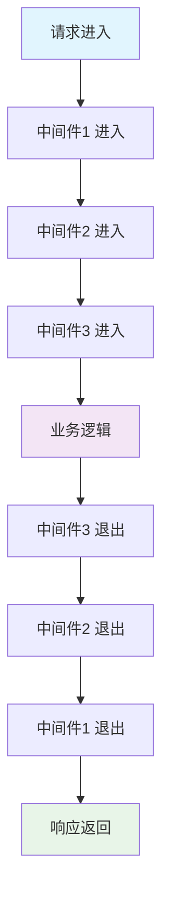

# 🌈 Koa.js 现代化框架详解

> Koa.js 是由 Express 原班人马打造的新一代 Node.js Web 框架，致力于成为更小、更富有表现力、更健壮的 Web 应用和 API 开发基石。它利用 async/await 函数，丢弃回调函数，并增强了错误处理机制。

## 🎯 Koa.js 概述

### 📊 核心特性

| 特性 | 描述 | 优势 |
|------|------|------|
| **Async/Await** | 默认异步解决方案 | 🚀 摆脱回调地狱 |
| **洋葱模型** | 中间件执行模式 | 🔄 灵活的请求处理 |
| **Context 对象** | 封装请求响应 | 🎯 简化 API 设计 |
| **轻量级** | 极简的核心库 | 📦 高度可定制 |
| **现代化** | ES6+ 语法支持 | 💪 更好的开发体验 |

### 🏗️ Koa vs Express 对比

| 特性 | Koa | Express |
|------|-----|---------|
| **核心设计** | 洋葱模型 | 线性中间件 |
| **异步处理** | async/await | 回调函数 |
| **错误处理** | try/catch | error-first 回调 |
| **中间件** | 二次执行 | 单次执行 |
| **生态系统** | 新兴社区 | 成熟生态 |
| **学习曲线** | 中等 | 简单 |

### 🔄 洋葱模型图解



## 🚀 快速开始

### 📦 项目初始化

```bash
# 创建项目目录
mkdir koa-app
cd koa-app

# 初始化项目
npm init -y

# 安装 Koa
npm install koa

# 安装常用中间件
npm install koa-router koa-bodyparser koa-static koa-cors koa-logger

# 安装开发依赖
npm install --save-dev nodemon

# 安装类型定义（可选）
npm install --save-dev @types/koa @types/koa-router
```

### 📁 项目结构

```
koa-app/
├── 📁 src/
│   ├── 📁 controllers/        # 控制器
│   │   ├── 📄 home.js
│   │   └── 📄 user.js
│   ├── 📁 middleware/         # 中间件
│   │   ├── 📄 auth.js
│   │   ├── 📄 error.js
│   │   └── 📄 logger.js
│   ├── 📁 routes/             # 路由
│   │   ├── 📄 index.js
│   │   └── 📄 user.js
│   ├── 📁 services/           # 服务层
│   │   └── 📄 user.js
│   └── 📄 app.js              # 应用入口
├── 📁 public/                 # 静态资源
├── 📁 config/                 # 配置文件
├── 📄 package.json
└── 📄 README.md
```

### ⚙️ package.json 配置

```json
{
  "name": "koa-app",
  "version": "1.0.0",
  "description": "Koa.js 现代化 Web 应用",
  "main": "src/app.js",
  "scripts": {
    "start": "node src/app.js",
    "dev": "nodemon src/app.js",
    "test": "jest",
    "lint": "eslint src/"
  },
  "dependencies": {
    "koa": "^2.14.2",
    "koa-router": "^12.0.0",
    "koa-bodyparser": "^4.4.0",
    "koa-static": "^5.0.0",
    "koa-cors": "^0.0.16",
    "koa-logger": "^3.2.1"
  },
  "devDependencies": {
    "nodemon": "^3.0.1",
    "jest": "^29.5.0",
    "eslint": "^8.45.0"
  },
  "engines": {
    "node": ">=14.0.0"
  }
}
```

## 🎮 基础应用

### 🏠 简单的 Koa 应用

```javascript
// src/app.js
const Koa = require('koa')
const app = new Koa()

// 基础中间件
app.use(async (ctx, next) => {
  console.log('🚀 请求开始:', ctx.method, ctx.url)
  const start = Date.now()
  
  await next()
  
  const ms = Date.now() - start
  console.log('⏱️ 请求耗时:', ms + 'ms')
})

// 响应中间件
app.use(async ctx => {
  ctx.body = {
    message: 'Hello Koa.js!',
    timestamp: new Date().toISOString(),
    url: ctx.url
  }
})

const PORT = process.env.PORT || 3000
app.listen(PORT, () => {
  console.log(`🌟 服务器运行在 http://localhost:${PORT}`)
})
```

### 🔧 配置选项

```javascript
// src/app.js
const Koa = require('koa')

// 应用配置选项
const appOptions = {
  // 环境变量，默认是 NODE_ENV 或 "development"
  env: process.env.NODE_ENV || 'development',
  
  // 签名的 cookie 密钥数组
  keys: ['secret-key-1', 'secret-key-2'],
  
  // 当真正的代理头字段将被信任时
  proxy: true,
  
  // 代理 ip 消息头，默认为 X-Forwarded-For
  proxyIpHeader: 'X-Forwarded-For',
  
  // 从代理 ip 消息头读取的最大 ips，默认为 0 (无限)
  maxIpsCount: 0,
  
  // 子域名偏移量，默认为 2
  subdomainOffset: 2
}

const app = new Koa(appOptions)

// 全局错误处理
app.on('error', (err, ctx) => {
  console.error('🚨 应用错误:', err)
  console.error('📍 错误上下文:', ctx.url, ctx.method)
})

module.exports = app
```

## 🎨 Context 对象详解

### 📝 Request 对象

```javascript
app.use(async (ctx, next) => {
  // Request 对象属性
  const requestInfo = {
    // 基本信息
    method: ctx.request.method,          // HTTP 方法
    url: ctx.request.url,                // 请求 URL
    origin: ctx.request.origin,          // 协议 + 主机
    href: ctx.request.href,              // 完整 URL
    path: ctx.request.path,              // 路径部分
    query: ctx.request.query,            // 查询参数对象
    querystring: ctx.request.querystring, // 查询字符串
    search: ctx.request.search,          // 包含 ? 的查询字符串
    
    // 头信息
    headers: ctx.request.headers,        // 请求头对象
    header: ctx.request.header,          // 请求头对象（别名）
    
    // 网络信息
    host: ctx.request.host,              // 主机名:端口
    hostname: ctx.request.hostname,      // 主机名
    protocol: ctx.request.protocol,      // 协议
    secure: ctx.request.secure,          // 是否 HTTPS
    ip: ctx.request.ip,                  // 客户端 IP
    ips: ctx.request.ips,                // 代理 IP 数组
    
    // 内容信息
    type: ctx.request.type,              // Content-Type
    charset: ctx.request.charset,        // 字符集
    length: ctx.request.length,          // Content-Length
    
    // 子域名
    subdomains: ctx.request.subdomains,  // 子域名数组
    
    // 检查方法
    fresh: ctx.request.fresh,            // 缓存是否新鲜
    stale: ctx.request.stale,            // 缓存是否过期
    idempotent: ctx.request.idempotent   // 是否幂等请求
  }
  
  console.log('📥 请求信息:', requestInfo)
  
  // 请求方法
  ctx.request.get('User-Agent')          // 获取请求头
  ctx.request.is('json')                 // 检查内容类型
  ctx.request.accepts(['json', 'html'])  // 内容协商
  ctx.request.acceptsEncodings(['gzip']) // 编码协商
  ctx.request.acceptsCharsets(['utf-8']) // 字符集协商
  ctx.request.acceptsLanguages(['en'])   // 语言协商
  
  await next()
})
```

### 📤 Response 对象

```javascript
app.use(async (ctx, next) => {
  // Response 对象属性
  ctx.response.status = 200                    // 状态码
  ctx.response.message = 'OK'                  // 状态消息
  ctx.response.body = { data: 'Hello World' }  // 响应体
  ctx.response.type = 'application/json'       // 内容类型
  ctx.response.length = 1024                   // 内容长度
  ctx.response.lastModified = new Date()       // 最后修改时间
  ctx.response.etag = 'W/"123456789"'          // ETag
  
  // 响应头操作
  ctx.response.set('X-Custom-Header', 'value') // 设置单个头
  ctx.response.set({                           // 设置多个头
    'X-Request-Id': '123',
    'X-Response-Time': '100ms'
  })
  ctx.response.append('Set-Cookie', 'name=value') // 追加头
  ctx.response.remove('X-Powered-By')             // 删除头
  
  // 检查方法
  ctx.response.has('Content-Type')             // 检查头是否存在
  ctx.response.get('Content-Type')             // 获取头值
  
  // 重定向
  ctx.response.redirect('/new-path')           // 302 重定向
  ctx.response.redirect('/new-path', 301)      // 301 重定向
  
  // 下载文件
  ctx.response.attachment('filename.txt')      // 设置下载文件名
  
  // 状态检查
  console.log('📤 响应状态:', {
    headerSent: ctx.response.headerSent,       // 是否已发送头
    writable: ctx.response.writable            // 是否可写
  })
  
  await next()
})
```

### 🍪 Cookie 操作

```javascript
app.use(async (ctx, next) => {
  // 设置 Cookie
  ctx.cookies.set('username', 'john', {
    domain: '.example.com',      // 域名
    path: '/',                   // 路径
    maxAge: 24 * 60 * 60 * 1000, // 过期时间（毫秒）
    expires: new Date('2024-12-31'), // 过期日期
    secure: true,                // 仅 HTTPS
    httpOnly: true,              // 仅 HTTP（不可被 JS 访问）
    sameSite: 'strict',          // 同站策略
    signed: true,                // 是否签名
    overwrite: true              // 是否覆盖同名 Cookie
  })
  
  // 获取 Cookie
  const username = ctx.cookies.get('username')
  const signedValue = ctx.cookies.get('signed-cookie', { signed: true })
  
  // 删除 Cookie
  ctx.cookies.set('username', null)
  ctx.cookies.set('username', '', { expires: new Date(0) })
  
  console.log('🍪 Cookie 操作:', { username, signedValue })
  
  await next()
})
```

### 📊 State 对象

```javascript
// 推荐的命名空间，用于在中间件间传递信息
app.use(async (ctx, next) => {
  // 设置状态数据
  ctx.state.user = {
    id: 1,
    name: 'John Doe',
    role: 'admin'
  }
  
  ctx.state.startTime = Date.now()
  ctx.state.requestId = Math.random().toString(36).substr(2, 9)
  
  await next()
})

app.use(async (ctx, next) => {
  // 在其他中间件中使用状态数据
  const { user, startTime, requestId } = ctx.state
  
  console.log('📊 状态数据:', {
    user: user?.name,
    duration: Date.now() - startTime,
    requestId
  })
  
  await next()
})
```

## 🗺️ 路由系统

### 📍 基础路由

```javascript
// src/routes/index.js
const Router = require('koa-router')
const router = new Router()

// 设置路由前缀
router.prefix('/api')

// 基础路由
router.get('/', async (ctx, next) => {
  ctx.body = {
    message: 'Welcome to Koa API',
    version: '1.0.0',
    timestamp: new Date().toISOString()
  }
})

// 参数路由
router.get('/users/:id', async (ctx, next) => {
  const { id } = ctx.params
  const { name } = ctx.query
  
  ctx.body = {
    userId: id,
    userName: name,
    message: `Hello ${name || 'User'}`
  }
})

// 多个路由处理函数
router.get('/protected', 
  async (ctx, next) => {
    // 认证中间件
    const token = ctx.get('Authorization')
    if (!token) {
      ctx.throw(401, '未授权访问')
    }
    ctx.state.authenticated = true
    await next()
  },
  async (ctx, next) => {
    // 业务逻辑
    ctx.body = {
      message: '受保护的资源',
      authenticated: ctx.state.authenticated
    }
  }
)

module.exports = router
```

### 🔄 RESTful 路由

```javascript
// src/routes/user.js
const Router = require('koa-router')
const router = new Router()

// 用户相关路由
router.prefix('/users')

// GET /users - 获取用户列表
router.get('/', async (ctx, next) => {
  const { page = 1, limit = 10 } = ctx.query
  
  try {
    const users = await ctx.service.user.getUsers({
      page: parseInt(page),
      limit: parseInt(limit)
    })
    
    ctx.body = {
      code: 200,
      data: users,
      message: '获取用户列表成功'
    }
  } catch (error) {
    ctx.throw(500, '获取用户列表失败')
  }
})

// POST /users - 创建用户
router.post('/', async (ctx, next) => {
  const { name, email, password } = ctx.request.body
  
  try {
    const user = await ctx.service.user.createUser({
      name,
      email,
      password
    })
    
    ctx.status = 201
    ctx.body = {
      code: 201,
      data: user,
      message: '创建用户成功'
    }
  } catch (error) {
    ctx.throw(400, error.message)
  }
})

// GET /users/:id - 获取单个用户
router.get('/:id', async (ctx, next) => {
  const { id } = ctx.params
  
  try {
    const user = await ctx.service.user.getUserById(id)
    if (!user) {
      ctx.throw(404, '用户不存在')
    }
    
    ctx.body = {
      code: 200,
      data: user,
      message: '获取用户成功'
    }
  } catch (error) {
    ctx.throw(error.status || 500, error.message)
  }
})

// PUT /users/:id - 更新用户
router.put('/:id', async (ctx, next) => {
  const { id } = ctx.params
  const updateData = ctx.request.body
  
  try {
    const user = await ctx.service.user.updateUser(id, updateData)
    ctx.body = {
      code: 200,
      data: user,
      message: '更新用户成功'
    }
  } catch (error) {
    ctx.throw(error.status || 500, error.message)
  }
})

// DELETE /users/:id - 删除用户
router.delete('/:id', async (ctx, next) => {
  const { id } = ctx.params
  
  try {
    await ctx.service.user.deleteUser(id)
    ctx.body = {
      code: 200,
      message: '删除用户成功'
    }
  } catch (error) {
    ctx.throw(error.status || 500, error.message)
  }
})

module.exports = router
```

## 🔧 中间件系统

### 🛡️ 错误处理中间件

```javascript
// src/middleware/error.js
const errorHandler = () => {
  return async (ctx, next) => {
    try {
      await next()
    } catch (err) {
      // 设置状态码
      ctx.status = err.status || err.statusCode || 500
      
      // 错误响应
      const error = {
        code: ctx.status,
        message: err.message || '内部服务器错误',
        ...(ctx.app.env === 'development' && { 
          stack: err.stack,
          details: err.details 
        })
      }
      
      ctx.body = error
      
      // 记录错误日志
      if (ctx.status >= 500) {
        ctx.app.emit('error', err, ctx)
      }
      
      console.error('🚨 错误详情:', {
        url: ctx.url,
        method: ctx.method,
        status: ctx.status,
        message: err.message,
        stack: err.stack
      })
    }
  }
}

module.exports = errorHandler
```

### 📊 日志中间件

```javascript
// src/middleware/logger.js
const logger = () => {
  return async (ctx, next) => {
    const start = Date.now()
    const { method, url, ip } = ctx
    
    console.log(`📥 ${method} ${url} - ${ip}`)
    
    try {
      await next()
    } catch (error) {
      console.error(`❌ ${method} ${url} - ${error.message}`)
      throw error
    } finally {
      const duration = Date.now() - start
      const { status, length } = ctx.response
      
      console.log(`📤 ${method} ${url} - ${status} ${length || 0}bytes - ${duration}ms`)
    }
  }
}

module.exports = logger
```

### 🔐 认证中间件

```javascript
// src/middleware/auth.js
const jwt = require('jsonwebtoken')

const auth = (options = {}) => {
  const { secret = 'default-secret', unless = [] } = options
  
  return async (ctx, next) => {
    // 检查是否为例外路径
    if (unless.some(path => ctx.path.startsWith(path))) {
      return await next()
    }
    
    const token = ctx.get('Authorization')?.replace('Bearer ', '')
    
    if (!token) {
      ctx.throw(401, '缺少认证令牌')
    }
    
    try {
      const payload = jwt.verify(token, secret)
      ctx.state.user = payload
      await next()
    } catch (error) {
      ctx.throw(401, '无效的认证令牌')
    }
  }
}

module.exports = auth
```

### 🚦 限流中间件

```javascript
// src/middleware/rateLimit.js
const rateLimit = (options = {}) => {
  const { 
    max = 100,           // 最大请求数
    duration = 60000,    // 时间窗口（毫秒）
    keyGenerator = (ctx) => ctx.ip  // 生成键的函数
  } = options
  
  const store = new Map()
  
  return async (ctx, next) => {
    const key = keyGenerator(ctx)
    const now = Date.now()
    
    // 清理过期记录
    for (const [k, v] of store.entries()) {
      if (now - v.reset > duration) {
        store.delete(k)
      }
    }
    
    // 获取当前计数
    const record = store.get(key) || { count: 0, reset: now }
    
    if (now - record.reset > duration) {
      record.count = 0
      record.reset = now
    }
    
    record.count++
    store.set(key, record)
    
    // 设置响应头
    ctx.set('X-RateLimit-Limit', max)
    ctx.set('X-RateLimit-Remaining', Math.max(0, max - record.count))
    ctx.set('X-RateLimit-Reset', new Date(record.reset + duration))
    
    if (record.count > max) {
      ctx.throw(429, '请求过于频繁')
    }
    
    await next()
  }
}

module.exports = rateLimit
```

## 🎯 完整应用示例

### 🏗️ 应用构建

```javascript
// src/app.js
const Koa = require('koa')
const Router = require('koa-router')
const bodyParser = require('koa-bodyparser')
const cors = require('koa-cors')
const koaStatic = require('koa-static')
const path = require('path')

// 导入中间件
const errorHandler = require('./middleware/error')
const logger = require('./middleware/logger')
const auth = require('./middleware/auth')
const rateLimit = require('./middleware/rateLimit')

// 导入路由
const indexRouter = require('./routes/index')
const userRouter = require('./routes/user')

const app = new Koa()

// 应用配置
app.keys = ['koa-secret-key']
app.proxy = true

// 全局中间件
app.use(errorHandler())
app.use(logger())
app.use(rateLimit({ max: 100, duration: 60000 }))
app.use(cors())
app.use(bodyParser())
app.use(koaStatic(path.join(__dirname, '../public')))

// 认证中间件（排除某些路径）
app.use(auth({ 
  secret: process.env.JWT_SECRET || 'jwt-secret',
  unless: ['/api/auth', '/api/public']
}))

// 路由中间件
app.use(indexRouter.routes())
app.use(indexRouter.allowedMethods())
app.use(userRouter.routes())
app.use(userRouter.allowedMethods())

// 404 处理
app.use(async (ctx, next) => {
  ctx.throw(404, '页面未找到')
})

// 错误事件监听
app.on('error', (err, ctx) => {
  console.error('🚨 应用错误:', err)
})

const PORT = process.env.PORT || 3000
app.listen(PORT, () => {
  console.log(`🌟 Koa 应用运行在 http://localhost:${PORT}`)
})

module.exports = app
```

### 🔧 服务层示例

```javascript
// src/services/user.js
class UserService {
  constructor() {
    this.users = [
      { id: 1, name: 'John Doe', email: 'john@example.com' },
      { id: 2, name: 'Jane Smith', email: 'jane@example.com' }
    ]
  }
  
  async getUsers({ page = 1, limit = 10 } = {}) {
    const start = (page - 1) * limit
    const end = start + limit
    
    return {
      data: this.users.slice(start, end),
      pagination: {
        page,
        limit,
        total: this.users.length,
        pages: Math.ceil(this.users.length / limit)
      }
    }
  }
  
  async getUserById(id) {
    return this.users.find(user => user.id === parseInt(id))
  }
  
  async createUser(userData) {
    const newUser = {
      id: this.users.length + 1,
      ...userData,
      createdAt: new Date().toISOString()
    }
    
    this.users.push(newUser)
    return newUser
  }
  
  async updateUser(id, updateData) {
    const userIndex = this.users.findIndex(user => user.id === parseInt(id))
    
    if (userIndex === -1) {
      throw new Error('用户不存在')
    }
    
    this.users[userIndex] = {
      ...this.users[userIndex],
      ...updateData,
      updatedAt: new Date().toISOString()
    }
    
    return this.users[userIndex]
  }
  
  async deleteUser(id) {
    const userIndex = this.users.findIndex(user => user.id === parseInt(id))
    
    if (userIndex === -1) {
      throw new Error('用户不存在')
    }
    
    this.users.splice(userIndex, 1)
    return true
  }
}

module.exports = new UserService()
```

## 🧪 测试

### 📝 单元测试

```javascript
// test/app.test.js
const request = require('supertest')
const app = require('../src/app')

describe('Koa App', () => {
  test('GET / 应该返回欢迎信息', async () => {
    const response = await request(app.callback())
      .get('/api/')
      .expect(200)
    
    expect(response.body.message).toBe('Welcome to Koa API')
  })
  
  test('GET /users 应该返回用户列表', async () => {
    const response = await request(app.callback())
      .get('/api/users')
      .expect(200)
    
    expect(response.body.code).toBe(200)
    expect(Array.isArray(response.body.data.data)).toBe(true)
  })
  
  test('POST /users 应该创建新用户', async () => {
    const newUser = {
      name: 'Test User',
      email: 'test@example.com'
    }
    
    const response = await request(app.callback())
      .post('/api/users')
      .send(newUser)
      .expect(201)
    
    expect(response.body.code).toBe(201)
    expect(response.body.data.name).toBe(newUser.name)
  })
})
```

### 🔍 中间件测试

```javascript
// test/middleware/auth.test.js
const request = require('supertest')
const Koa = require('koa')
const auth = require('../../src/middleware/auth')

describe('Auth Middleware', () => {
  let app
  
  beforeEach(() => {
    app = new Koa()
    app.use(auth({ secret: 'test-secret', unless: ['/public'] }))
    app.use(async (ctx) => {
      ctx.body = { success: true }
    })
  })
  
  test('应该拒绝没有 token 的请求', async () => {
    await request(app.callback())
      .get('/protected')
      .expect(401)
  })
  
  test('应该允许访问例外路径', async () => {
    await request(app.callback())
      .get('/public')
      .expect(200)
  })
})
```

## 💡 最佳实践

### 🎯 项目结构建议

::: tip 💡 开发建议

1. **模块化设计**：合理拆分路由、中间件和服务
2. **错误处理**：统一的错误处理机制
3. **日志记录**：详细的请求和错误日志
4. **安全考虑**：认证、授权、输入验证
5. **性能优化**：缓存、压缩、静态资源处理
6. **测试覆盖**：单元测试和集成测试

:::

### 📊 性能优化

```javascript
// 使用缓存中间件
const LRU = require('lru-cache')
const cache = new LRU({ max: 100, maxAge: 1000 * 60 * 5 })

const cacheMiddleware = (options = {}) => {
  return async (ctx, next) => {
    const key = ctx.url
    const cached = cache.get(key)
    
    if (cached) {
      ctx.body = cached
      return
    }
    
    await next()
    
    if (ctx.status === 200 && ctx.body) {
      cache.set(key, ctx.body)
    }
  }
}

// 使用压缩中间件
const compress = require('koa-compress')
app.use(compress({
  filter: (content_type) => {
    return /text/i.test(content_type)
  },
  threshold: 2048,
  flush: require('zlib').constants.Z_SYNC_FLUSH
}))
```

### 🔒 安全配置

```javascript
// 安全头中间件
const helmet = require('koa-helmet')
app.use(helmet())

// CSRF 保护
const csrf = require('koa-csrf')
app.use(csrf())

// 输入验证
const Joi = require('joi')

const validate = (schema) => {
  return async (ctx, next) => {
    try {
      const validated = await schema.validateAsync(ctx.request.body)
      ctx.request.body = validated
      await next()
    } catch (error) {
      ctx.throw(400, error.details[0].message)
    }
  }
}

// 使用验证
const userSchema = Joi.object({
  name: Joi.string().required(),
  email: Joi.string().email().required(),
  age: Joi.number().integer().min(0).max(120)
})

router.post('/users', validate(userSchema), async (ctx) => {
  // 处理验证后的数据
})
```

## 🔗 相关资源

- [Koa.js 官方文档](https://koajs.com/)
- [Koa.js GitHub 仓库](https://github.com/koajs/koa)
- [中间件生态系统](https://github.com/koajs/koa/wiki)
- [最佳实践指南](https://github.com/koajs/koa/blob/master/docs/guide.md)

---

::: warning 🚨 注意事项
- 确保 Node.js 版本 >= 14.0.0
- 合理使用 async/await 避免回调地狱
- 注意中间件的执行顺序
- 生产环境配置适当的错误处理和日志
- 使用 try/catch 处理异步操作中的错误
:::
