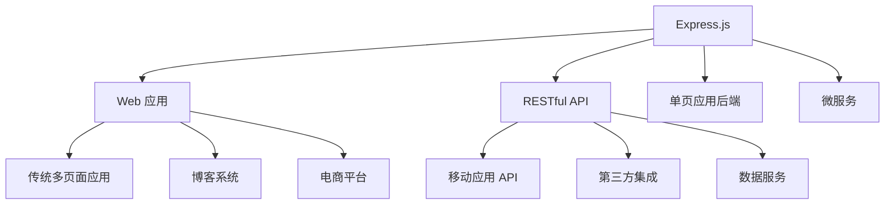

# 🚀 Express.js 完全指南

> Express.js 是 Node.js 最流行的 Web 框架，以其极简、灵活和高性能著称。它提供了强大的功能集合来构建各种 Web 应用和 API。

## 🎯 Express 概述

### 📊 核心特性

| 特性 | 描述 | 优势 |
|------|------|------|
| **极简设计** | 最小化的核心功能 | 🎯 轻量级，易于学习 |
| **灵活路由** | 强大的路由系统 | 🛣️ 支持各种路由模式 |
| **中间件架构** | 可扩展的中间件系统 | 🔧 功能模块化 |
| **模板引擎** | 支持多种模板引擎 | 🎨 灵活的视图渲染 |
| **高性能** | 基于 Node.js 的异步架构 | ⚡ 快速响应 |

### 🏗️ Express 应用场景



### 🎯 Express vs 其他框架

| 框架 | 特点 | 适用场景 | 学习难度 |
|------|------|----------|----------|
| **Express** | 极简、灵活 | 🌟 中小型应用、API | ⭐⭐ 简单 |
| **Koa** | 现代化、轻量 | 🎯 需要更好异步支持 | ⭐⭐⭐ 中等 |
| **Fastify** | 高性能 | 🚀 高并发应用 | ⭐⭐⭐ 中等 |
| **NestJS** | 企业级、装饰器 | 🏢 大型企业应用 | ⭐⭐⭐⭐ 复杂 |

## 📦 安装和初始化

### 🚀 基础安装

```bash
# 创建项目目录
mkdir my-express-app
cd my-express-app

# 初始化项目
npm init -y

# 安装 Express
npm install express

# 安装开发依赖
npm install --save-dev nodemon

# 安装常用中间件
npm install cors helmet morgan body-parser cookie-parser express-session
```

### 🛠️ 使用脚手架工具

```bash
# 全局安装 Express 生成器
npm install -g express-generator

# 生成项目骨架（使用 EJS 模板）
express --view=ejs my-app

# 生成项目骨架（使用 Pug 模板）
express --view=pug my-app

# 进入项目目录并安装依赖
cd my-app
npm install

# 启动应用
npm start
```

### 📁 项目结构

```
my-express-app/
├── 📁 bin/
│   └── 📄 www                 # 启动脚本
├── 📁 public/                 # 静态文件目录
│   ├── 📁 images/
│   ├── 📁 javascripts/
│   └── 📁 stylesheets/
│       └── 📄 style.css
├── 📁 routes/                 # 路由文件
│   ├── 📄 index.js
│   └── 📄 users.js
├── 📁 views/                  # 模板文件
│   ├── 📄 error.pug
│   ├── 📄 index.pug
│   └── 📄 layout.pug
├── 📁 middleware/             # 自定义中间件
├── 📁 models/                 # 数据模型
├── 📁 controllers/            # 控制器
├── 📄 app.js                  # 应用主文件
├── 📄 package.json
└── 📄 .env                    # 环境变量
```

### ⚙️ package.json 配置

```json
{
  "name": "my-express-app",
  "version": "1.0.0",
  "description": "Express.js 应用示例",
  "main": "app.js",
  "scripts": {
    "start": "node app.js",
    "dev": "nodemon app.js",
    "test": "jest",
    "lint": "eslint ."
  },
  "dependencies": {
    "express": "^4.18.2",
    "cors": "^2.8.5",
    "helmet": "^7.0.0",
    "morgan": "^1.10.0",
    "body-parser": "^1.20.2",
    "cookie-parser": "^1.4.6",
    "express-session": "^1.17.3"
  },
  "devDependencies": {
    "nodemon": "^3.0.1",
    "jest": "^29.5.0",
    "eslint": "^8.45.0"
  }
}
```

## 使用 Express

```js
// 用于连接 mongooseDB 数据库
const mongoose = require("mongoose");
// 连接mongooseDB数据库
mongoose
  .connect("mongodb://todo-database:27017/", { useNewUrlParser: true })
  .then(() => console.log(`Mongodb Connected`))
  .catch(error => console.log(error));

// 从req.body中解析参数：内部使用JSON编码处理，url编码处理以及对于文件的上传处理
const bodyParse = require("body-parser");
// req.cookies
var cookieParser = require("cookie-parser");
// 保存登录信息。 当客户访问其他页面时，可以判断客户的登录状态
var session = require("express-session");
// 保存文件时自动刷新页面
const livereload = require("livereload");
// 连接livereload
const connectLiveReload = require("connect-livereload");
// 生成app
const app = require("express")();
// moment时间日期格式化包
const moment = require("moment");
const path = require("path");

// mysql 数据库的使用
var mysql = require("mysql");
var connection = mysql.createConnection({
  host: "localhost",
  user: "dbuser",
  password: "s3kreee7",
});
connection.connect();
connection.query("SELECT 1 + 1 AS solution", function (err, rows, fields) {
  if (err) throw err;
  console.log("The solution is: ", rows[0].solution);
});
connection.end();

// 定义路由器
const router = express.Router();

// 定义mongooseDB 数据库
const Todo = mongoose.model(
  "todos",
  new mongoose.Schema({
    // 定义数据库Schema
    task: {
      type: String,
      required: true,
    },
    created_at: {
      type: Date,
      default: Date.now(),
    },
  })
);
// 定义首页路由 匹配get方法
router.get("/", async (req, res) => {
  res.download(); //提示下载文件。
  res.end(); //终结响应处理流程。
  res.json(); //发送一个 JSON 格式的响应。
  res.jsonp(); //发送一个支持 JSONP 的 JSON 格式的响应。
  res.redirect(); //重定向请求。
  res.render(); //渲染视图模板。
  res.send(); //发送各种类型的响应。
  res.sendFile(); //以八位字节流的形式发送文件。
  //设置响应状态代码，并将其以字符串形式作为响应体的一部分发送
  res.sendStatus();

  // mongooseDB 查找数据
  const todos = await Todo.find();
  // 使用渲染引擎，渲染todos模板，并传递变量给模板
  res.render("todos", {
    tasks: Object.keys(todos).length > 0 ? todos : {},
  });
});

// 定义首页路由 匹配post方法
router.post("/", (req, res, next) => {
  const newTask = new Todo({ task: req.body.task });
  newTask
    .save()
    .then(task => res.redirect("/"))
    .catch(err => console.log(err));
  // 交给下一个中间件处理
  next();
});

// 使用动态路由参数，重定向到首页
router.post("/todo/:todoId", async (req, res) => {
  const taskKey = req.body._key;
  // 查找并删除指定_id的数据
  const err = await Todo.findOneAndRemove({ _id: taskKey });
  res.redirect("/");
});

// liveReloadServer服务器实例
const liveReloadServer = livereload.createServer();
liveReloadServer.server.once("connection", () => {
  setTimeout(() => liveReloadServer.refresh("/"), 100);
});

// 设置ejs&jade&pug模板引擎
app.set("view engine", "ejs");
app.set("view engine", "jade");
app.set("view engine", "pug");

// 设置模板文件的目录，默认 views
app.set("views", "./views");

// 使用中间件
app.use(router);
app.use(connectLiveReload());
app.use(bodyParse.urlencoded({ extended: false }));
// 注册全局变量
app.locals.moment = moment;


//匹配路由/detail 返回list.html 文件，状态码设置200
server.use("/detail", (req, res) => {
  res.status(200).sendFile(path.join(__dirname, "static", "list.html"));
});

//express.static 内置中间件函数设置静态目录，默认页面index.html
server.use(express.static(path.join(__dirname, "static")));

//没有匹配到路由，返回错误页面给前端
server.use("*", (req, res) => {
  res.status(200).sendFile(path.join(__dirname, "static", "404.html"));
});

// 监听3000端口，启动服务器
server.listen(3000, err => {
  if (err) {
    console.log("监听失败");
    throw err;
  }
  console.log("服务器已经启动，在3000端口");
});
```
