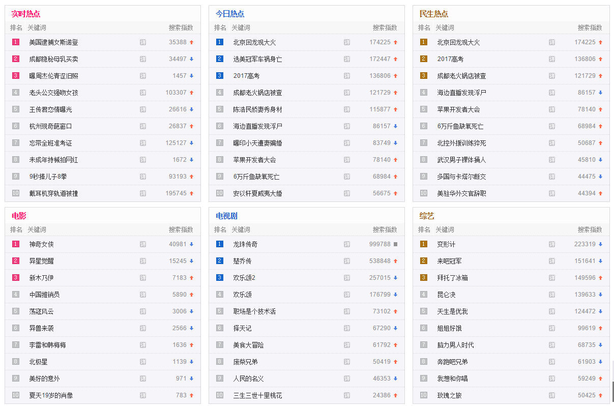

# 🕷️ Node.js 网络爬虫实战

网络爬虫是自动化抓取网页数据的程序。本章将介绍如何使用 Node.js 构建一个简单而有效的网络爬虫。

::: tip 🎯 项目目标
爬取 hao123 网页中的热点数据，包括：
- 实时热点、今日热点、民生热点
- 电影、电视剧、综艺排行榜
:::

## 📚 技术栈

### 核心模块

| 模块 | 用途 | 说明 |
|------|------|------|
| **http** | 网络请求 | Node.js 内置 HTTP 模块 |
| **cheerio** | HTML 解析 | 服务器端的 jQuery 实现 |

### 安装依赖

```bash
npm install cheerio
```

## 🔧 实现步骤

### 1. 项目结构

```
crawler/
├── index.js          # 主程序
├── package.json      # 项目配置
└── README.md         # 说明文档
```

### 2. 核心代码实现

```javascript
const http = require('http');
const cheerio = require('cheerio');

/**
 * 网络爬虫主类
 */
class WebCrawler {
  constructor() {
    this.targetUrl = 'http://tuijian.hao123.com/hotrank';
    this.result = {};
  }

  /**
   * 启动爬虫
   */
  async start() {
    try {
      console.log('🚀 开始爬取数据...');
      await this.fetchData();
      console.log('✅ 数据爬取完成');
      this.displayResult();
    } catch (error) {
      console.error('❌ 爬取失败:', error.message);
    }
  }

  /**
   * 获取网页数据
   */
  fetchData() {
    return new Promise((resolve, reject) => {
      http.get(this.targetUrl, (res) => {
        let data = '';
        
        // 监听数据接收
        res.on('data', (chunk) => {
          data += chunk;
        });
        
        // 数据接收完成
        res.on('end', () => {
          try {
            this.parseData(data);
            resolve();
          } catch (error) {
            reject(error);
          }
        });
        
        // 处理请求错误
        res.on('error', (error) => {
          reject(error);
        });
      }).on('error', (error) => {
        reject(error);
      });
    });
  }

  /**
   * 解析网页数据
   * @param {string} html - 网页HTML内容
   */
  parseData(html) {
    const $ = cheerio.load(html);
    
    // 查找热点榜单容器
    const rankingContainers = $('.top-wrap');
    
    // 遍历每个榜单
    rankingContainers.each((index, container) => {
      const $container = $(container);
      
      // 获取榜单标题
      const title = $container.find('h2').text().trim();
      if (!title) return;
      
      // 获取榜单项目
      const items = $container.find('.point-bd .point-title');
      const itemList = [];
      
      items.each((itemIndex, item) => {
        const itemText = $(item).text().trim();
        if (itemText) {
          itemList.push(itemText);
        }
      });
      
      // 保存到结果中
      this.result[title] = itemList;
    });
  }

  /**
   * 显示爬取结果
   */
  displayResult() {
    console.log('\n📊 爬取结果：');
    console.log('='.repeat(50));
    
    Object.entries(this.result).forEach(([category, items]) => {
      console.log(`\n🏷️  ${category}:`);
      items.forEach((item, index) => {
        console.log(`  ${index + 1}. ${item}`);
      });
    });
    
    console.log('\n' + '='.repeat(50));
    console.log(`✨ 共爬取 ${Object.keys(this.result).length} 个分类`);
  }
}

// 启动爬虫
const crawler = new WebCrawler();
crawler.start();
```

### 3. 简化版本

如果你喜欢更简洁的代码，这里是原始的函数式实现：

```javascript
const http = require('http');
const cheerio = require('cheerio');

// 利用 http.get() 抓取页面源代码
http.get('http://tuijian.hao123.com/hotrank', function(res) {
  let data = '';
  
  res.on('data', function(chunk) {
    data += chunk;
  });
  
  res.on('end', function() {
    filterData(data);
  });
});

// 处理数据
function filterData(data) {
  // 保存各部分搜索量前10的名称
  const result = {};
  
  // 将页面源代码转换为 $ 对象
  const $ = cheerio.load(data);
  
  // 查找6个榜单所在的div
  const containers = $('.top-wrap');
  
  containers.each(function(index, item) {
    // 查找榜单名
    const title = $(item).find('h2').text();
    
    // 查找每个标题的外层div
    const titleElements = $(item).find('.point-bd').find('.point-title');
    
    // 初始化结果数组
    const categoryResult = result[title] = [];
    
    // 保存标题到相应榜单的数组中
    titleElements.each(function(_index, _item) {
      categoryResult.push($(_item).text());
    });
  });
  
  console.log(result);
}
```

## 📸 预期结果



### 输出格式

```json
{
  "实时热点": [
    "美国逮捕女斯诺登",
    "成都隐秘母乳买卖",
    "曝周杰伦青涩旧照",
    "老头公交强吻女孩",
    "王传君恋情曝光",
    "杭州现奇葩窗口",
    "忘带全班准考证",
    "未成年持械拍网红",
    "9秒揍儿子8拳",
    "戴耳机穿轨道被撞"
  ],
  "今日热点": [
    "北京回龙观大火",
    "选美冠军车祸身亡",
    "2017高考",
    "成都老火锅店被查",
    "陈浩民娇妻秀身材",
    "海边直播发现浮尸",
    "曝印小天遭妻骗婚",
    "苹果开发者大会",
    "6万斤鱼缺氧死亡",
    "安以轩夏威夷大婚"
  ],
  "民生热点": [
    "北京回龙观大火",
    "2017高考",
    "成都老火锅店被查",
    "海边直播发现浮尸",
    "苹果开发者大会",
    "6万斤鱼缺氧死亡",
    "北控外援训练猝死",
    "武汉男子裸体捅人",
    "多国与卡塔尔断交",
    "美驻华外交官辞职"
  ],
  "电影": [
    "神奇女侠",
    "异星觉醒",
    "新木乃伊",
    "中国推销员",
    "荡寇风云",
    "异兽来袭",
    "李雷和韩梅梅",
    "北极星",
    "美好的意外",
    "夏天19岁的肖像"
  ],
  "电视剧": [
    "龙珠传奇",
    "楚乔传",
    "欢乐颂2",
    "欢乐颂",
    "职场是个技术活",
    "择天记",
    "美食大冒险",
    "废柴兄弟",
    "人民的名义",
    "三生三世十里桃花"
  ],
  "综艺": [
    "变形计",
    "来吧冠军",
    "拜托了冰箱",
    "昆仑决",
    "天生是优我",
    "姐姐好饿",
    "脑力男人时代",
    "奔跑吧兄弟",
    "我想和你唱",
    "玫瑰之旅"
  ]
}
```

## 🔧 功能扩展

### 1. 添加错误处理

```javascript
class WebCrawler {
  async fetchData() {
    return new Promise((resolve, reject) => {
      const request = http.get(this.targetUrl, (res) => {
        // 检查状态码
        if (res.statusCode !== 200) {
          reject(new Error(`HTTP ${res.statusCode}: ${res.statusMessage}`));
          return;
        }
        
        let data = '';
        res.on('data', (chunk) => data += chunk);
        res.on('end', () => {
          try {
            this.parseData(data);
            resolve();
          } catch (error) {
            reject(error);
          }
        });
      });
      
      // 设置超时
      request.setTimeout(10000, () => {
        request.abort();
        reject(new Error('请求超时'));
      });
      
      request.on('error', reject);
    });
  }
}
```

### 2. 添加数据存储

```javascript
const fs = require('fs');

class WebCrawler {
  /**
   * 保存结果到文件
   */
  saveToFile() {
    const filename = `hotrank_${new Date().toISOString().slice(0, 10)}.json`;
    const content = JSON.stringify(this.result, null, 2);
    
    fs.writeFileSync(filename, content, 'utf8');
    console.log(`📁 数据已保存到: ${filename}`);
  }
}
```

### 3. 添加定时任务

```javascript
const cron = require('node-cron');

// 每小时执行一次
cron.schedule('0 * * * *', () => {
  console.log('🕐 定时任务启动');
  const crawler = new WebCrawler();
  crawler.start();
});
```

## ⚠️ 注意事项

### 1. 法律和道德考量

- 遵守网站的 `robots.txt` 协议
- 不要对服务器造成过大负担
- 遵守相关法律法规

### 2. 技术考量

- 添加适当的延迟，避免被封IP
- 处理反爬虫措施
- 考虑使用代理池

### 3. 错误处理

```javascript
// 添加重试机制
async fetchWithRetry(url, maxRetries = 3) {
  for (let i = 0; i < maxRetries; i++) {
    try {
      return await this.fetchData(url);
    } catch (error) {
      if (i === maxRetries - 1) throw error;
      console.log(`重试 ${i + 1}/${maxRetries}...`);
      await new Promise(resolve => setTimeout(resolve, 1000));
    }
  }
}
```

## 🎯 最佳实践

1. **添加用户代理**
   ```javascript
   const options = {
     headers: {
       'User-Agent': 'Mozilla/5.0 (Windows NT 10.0; Win64; x64) AppleWebKit/537.36'
     }
   };
   ```

2. **控制请求频率**
   ```javascript
   const delay = ms => new Promise(resolve => setTimeout(resolve, ms));
   await delay(1000); // 延迟1秒
   ```

3. **数据清洗**
   ```javascript
   const cleanText = (text) => {
     return text.trim().replace(/\s+/g, ' ');
   };
   ```

---

::: tip 🔗 相关资源
- [Cheerio 官方文档](https://cheerio.js.org/)
- [Node.js HTTP 模块](https://nodejs.org/api/http.html)
- [爬虫伦理指南](https://www.scraperapi.com/web-scraping-ethics/)
:::
