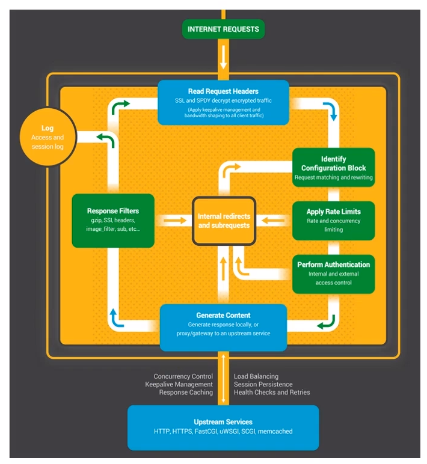
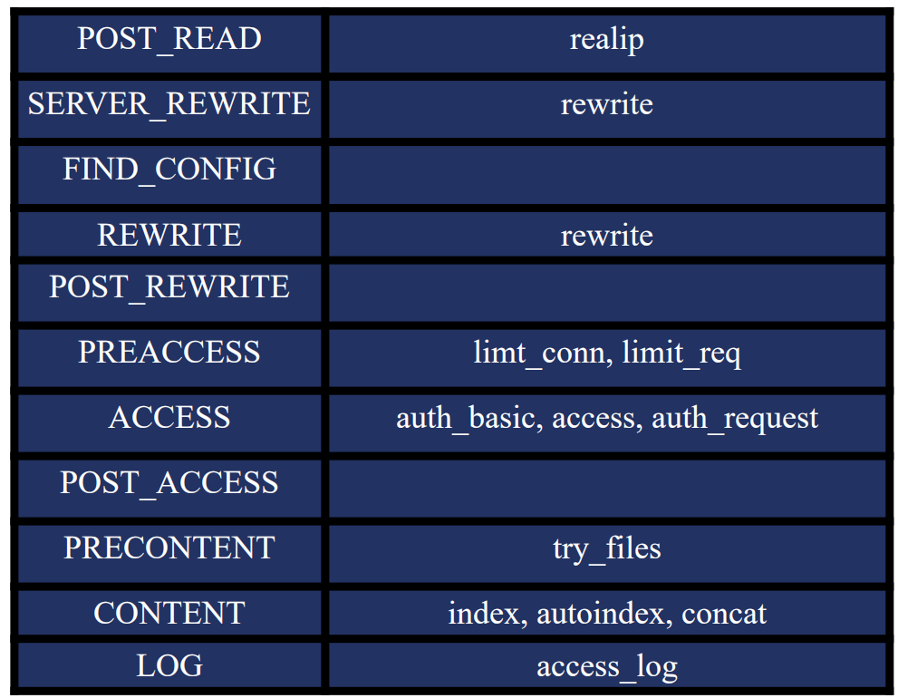
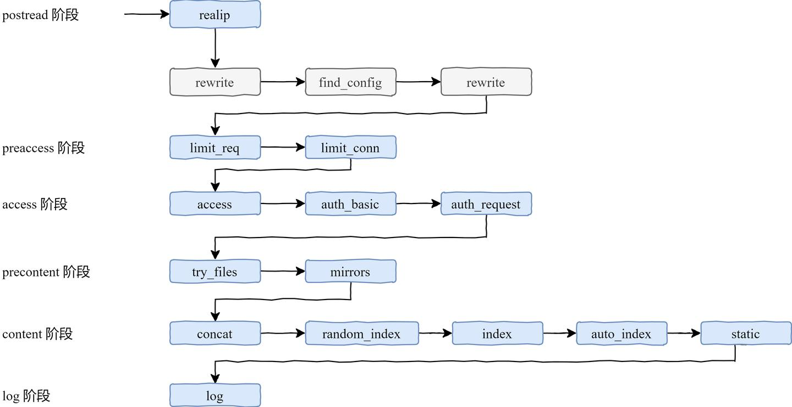
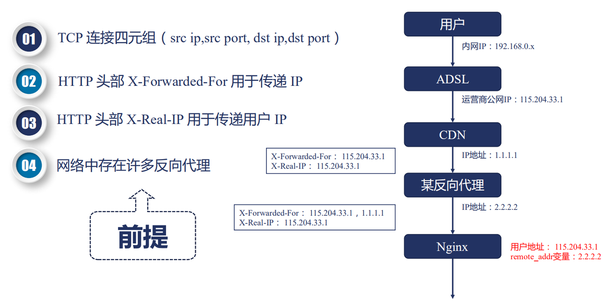
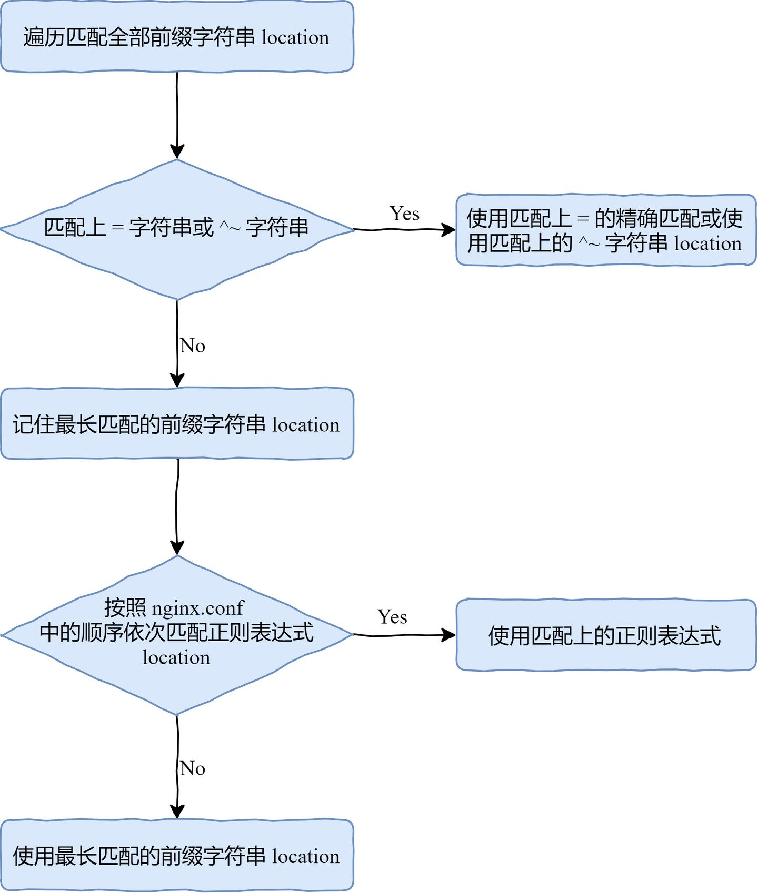

## Nginx 服务器介绍

Nginx 是一款轻量级的 Web 服务器/反向代理服务器及电子邮件（IMAP/POP3）代理服务器，在 BSD-like 协议下发行。其特点是占有内存少，并发能力强，事实上 nginx 的并发能力在同类型的网页服务器中表现较好。Nginx 代码完全用 C 语言从头写成，已经移植到许多体系结构和操作系统

Nginx 作为负载均衡服务：Nginx 既可以在内部直接支持 Rails 和 PHP 程序对外进行服务，也可以支持作为 HTTP 代理服务对外进行服务。Nginx 采用 C 进行编写，不论是系统资源开销还是 CPU 使用效率都比 Perlbal 要好很多。

- 处理静态文件，索引文件以及自动索引;打开文件描述符缓冲。
- 无缓存的反向代理加速，简单的负载均衡和容错。
- FastCGI，简单的负载均衡和容错。
- 模块化的结构。包括 gzipping, byte ranges, chunked responses,以及 SSI-filter 等 filter。如果由 FastCG 或其它代理服务器处理单页中存在的多个 SSI，则这项处理可以并行运行，而不需要相互等待。
- 支持 SSL 和 TLSSNI。

## Nginx 服务器处理请求过程



- Read Request Headers：解析请求头。
- Identify Configuration Block：识别由哪一个 location 进行处理，匹配 URL。
- Apply Rate Limits：判断是否限速。例如可能这个请求并发的连接数太多超过了限制，或者 QPS 太高。
- Perform Authentication：连接控制，验证请求。例如可能根据 Referrer 头部做一些防盗链的设置，或者验证用户的权限。
- Generate Content：生成返回给用户的响应。为了生成这个响应，做反向代理的时候可能会和上游服务（Upstream Services）进行通信，然后这个过程中还可能会有些子请求或者重定向，那么还会走一下这个过程（Internal redirects and subrequests）。
- Response Filters：过滤返回给用户的响应。比如压缩响应，或者对图片进行处理。
- Log：记录日志。

## 处理请求 11 个阶段



- POST_READ：在 read 完请求的头部之后，在没有对头部做任何处理之前，想要获取到一些原始的值，就应该在这个阶段进行处理。这里面会涉及到一个 realip 模块。
- SERVER_REWRITE：和下面的 REWRITE 阶段一样，都只有一个模块叫 rewrite 模块，一般没有第三方模块会处理这个阶段。
- FIND_CONFIG：做 location 的匹配，暂时没有模块会用到。
- REWRITE：对 URL 做一些处理。
- POST_WRITE：处于 REWRITE 之后，也是暂时没有模块会在这个阶段出现。

接下来是确认用户访问权限的三个模块：

- PREACCESS：是在 ACCESS 之前要做一些工作，例如并发连接和 QPS 需要进行限制，涉及到两个模块：limt_conn 和 limit_req
- ACCESS：核心要解决的是用户能不能访问的问题，例如 auth_basic 是用户名和密码，access 是用户访问 IP，auth_request 根据第三方服务返回是否可以去访问。
- POST_ACCESS：是在 ACCESS 之后会做一些事情，同样暂时没有模块会用到。

最后的三个阶段处理响应和日志：

- PRECONTENT：在处理 CONTENT 之前会做一些事情，例如会把子请求发送给第三方的服务去处理，try_files 模块也是在这个阶段中。

- CONTENT：这个阶段涉及到的模块就非常多了，例如 index, autoindex, concat 等都是在这个阶段生效的。

- LOG：记录日志 access_log 模块。

以上的这些阶段都是严格按照顺序进行处理的，当然，每个阶段中各个 HTTP 模块的处理顺序也很重要，如果某个模块不把请求向下传递，后面的模块是接收不到请求的。而且每个阶段中的模块也不一定所有都要执行一遍

整个 11 个阶段所涉及到的模块和先后顺序如下图所示：


## postread 阶段

这个阶段刚刚获取到了请求的头部，还没有进行任何处理，我们可以拿到一些原始的信息。例如，拿到用户的真实 IP 地址

HTTP 协议中，有两个头部可以用来获取用户 IP：

- X-Forwardex-For 是用来传递 IP 的，这个头部会把经过的节点 IP 都记录下来
- X-Real-IP：可以记录用户真实的 IP 地址，只能有一个。非标准的，nginx 服务器支持
  例如 binary_remote_addr、remote_addr 这样的变量，其值就是真实的 IP，这样做连接限制也就是 limit_conn 模块才有意义，这也说明了，limit_conn 模块只能在 preaccess 阶段，而不能在 postread 阶段生效。

### realip 模块

定义如何从头部获取用户 IP 地址。默认不会编译进 Nginx，需要通过 --with-http_realip_module 启用功能。如果还想要使用原来的 TCP 连接中的地址和端口，需要通过这两个变量保存 realip_remote_addr 和
realip_remote_port

```bash
#指定可信的地址，只有从该地址建立的连接，获取的 realip 才是可信的
Syntax: set_real_ip_from address | CIDR | unix:;
Default: —
Context: http, server, location
#指定从哪个头部取真实的 IP 地址，默认从 X-Real-IP 中取，如果设置从 X-Forwarded-For 中取，会先从最后一个 IP 开始取
Syntax: real_ip_header field | X-Real-IP | X-Forwarded-For | proxy_protocol;
Default: real_ip_header X-Real-IP;
Context: http, server, location
#环回地址，默认关闭，打开的时候，如果 X-Forwarded-For 最后一个地址与客户端地址相同，会过滤掉该地址
Syntax: real_ip_recursive on | off;
Default: real_ip_recursive off;
Context: http, server, location
```

```bash
# 在 example 目录下建立 realip.conf，set_real_ip_from 可以设置为自己的本机 IP
server {
    server_name ziyang.realip.com;#定义服务器域名
    listen 80; #定义服务器的端口号
    root html/; #服务器根目录

    error_page 404 /404.html notice; #定义错误页面
    error_page 500 502 503 504 /50x.html;

    set_real_ip_from 192.168.0.108; #指定可信地址
    #real_ip_header X-Real-IP;
    real_ip_header X-Forwarded-For;#从哪个字段获取realip
    # real_ip_recursive on;
    real_ip_recursive off;#是否启用环回地址

    rewrite_log on;#启动复写时的日志记录

    location / {
        error_page 404 = @fallback;
        return 200 "Client real ip: $remote_addr\n";
    }
    location /first {
        rewrite /first(.*) /second$1 last;
        return 200 'first!\n';
    }
    location /redirect3 {
        rewrite /redirect3(.*) http://rewrite.ziyang.com$1;
    }
    if ($http_user_agent ~ MSIE) { # 与变量 http_user_agent 匹配
      rewrite ^(.*)$ /msie/$1 break;
    }
}
```

## rewrite 阶段

首先 rewrite 阶段分为两个，一个是 server_rewrite 阶段，一个是 rewrite，这两个阶段都涉及到一个 rewrite 模块，而在 rewrite 模块中，有一个 return 指令，遇到该指令就不会再向下执行，直接返回响应。

### rewrite 模块

它的功能主要有下面几点：

- 将 regex 指定的 URL 替换成 replacement 这个新的 URL
  可以使用正则表达式及变量提取
- 当 replacement 以 http:// 或者 https:// 或者 $schema 开头，则直接返回 302 重定向
- 替换后的 URL 根据 flag 指定的方式进行处理
  - last：用 replacement 这个 URL 进行新的 location 匹配
  - break：break 指令停止当前脚本指令的执行，继续执行下面的指令
  - redirect：返回 302 重定向
  - permanent：返回 301 重定向

那么 if 指令的条件表达式包含规则如下：

- 检查变量为空或者值是否为 0
- 将变量与字符串做匹配，使用 = 或 !=
- 将变量与正则表达式做匹配
- 大小写敏感，~ 或者 !~
- 大小写不敏感，_ 或者 !_
- 检查文件是否存在，使用 -f 或者 !-f
- 检查目录是否存在，使用 -d 或者 !-d
- 检查文件、目录、软链接是否存在，使用 -e 或者 !-e
- 检查是否为可执行文件，使用 -x 或者 !-x

```bash
# code:状态码 text:返回的内容 URL:直接返回URL
Syntax: return code [text];
        return code URL;
        return URL;
Default: —
Context: server, location, if

#rewrite 指令用于修改用户传入 Nginx 的 URL。
Syntax: rewrite regex replacement [flag];
Default: —
Context: server, location, if

#rewrite 行为记录日志
Syntax: rewrite_log on | off;
Default: rewrite_log off;
Context: http, server, location, if

#if 指令也是在 rewrite 阶段生效的，它的语法如下所示：
Syntax: if (condition) { ... }
Default: —
Context: server, location

#定义错误页面，优先级高于return指令。外层的return指令优先级较高
Syntax: error_page code ... [=[response]] uri;
Default: —
Context: http, server, location, if in location
```

## find_config 阶段

当经过 rewrite 模块，匹配到 URL 之后，就会进入 find_config 阶段，开始寻找 URL 对应的 location 配置。

location 的匹配规则是仅匹配 URI，忽略参数，有下面三种大的情况：

- 前缀字符串
  - 常规匹配
  - =：精确匹配
  - ^~：以~开头，优先级正则表达式匹配
- 正则表达式
  - ~：大小写敏感的正则匹配
  - ~\*：大小写不敏感
- 用户内部跳转的命名 location
  - @

location 匹配算法：


```bash

Syntax: location [ = | ~ | ~* | ^~ ] uri { ... }
        location @name { ... }
Default: —
Context: server, location

#加入 URL 中有两个重复的 /，那么会合并
Syntax: merge_slashes on | off;
Default: merge_slashes on;
Context: http, server

server {
    listen 80;
    server_name location.ziyang.com;
    error_log  logs/error.log  debug;
    root html/;
    default_type text/plain;
    merge_slashes off;

    location ~ /Test1/$ {  #大小写敏感
        return 200 'first regular expressions match!\n';
    }
    location ~* /Test1/(\w+)$ {  #大小写不敏感
        return 200 'longest regular expressions match!\n';
    }
    location ^~ /Test1/ {  #以/Text1/开头，优先级高于正则
        return 200 'stop regular expressions match!\n';
    }
    location /Test1/Test2 { #包含
        return 200 'longest prefix string match!\n';
    }
    location /Test1 { #包含
        return 200 'prefix string match!\n';
    }
    location = /Test1 { #精确相等
        return 200 'exact match!\n';
    }
}
```

## preaccess 阶段

如何限制每个客户端的并发连接数？如何限制访问频率

### limit_conn 模块

限制每个客户端的并发连接数

- 生效阶段：NGX_HTTP_PREACCESS_PHASE 阶段
- 模块：http_limit_conn_module
- 默认编译进 Nginx，通过 --without-http_limit_conn_module 禁用
- 生效范围
  - 全部 worker 进程（基于共享内存）
  - 进入 preaccess 阶段前不生效
  - 限制的有效性取决于 key 的设计：依赖 postread 阶段的 realip 模块取到真实 IP

### limit_req 模块

如何限制访问频率

- 生效阶段：NGX_HTTP_PREACCESS_PHASE 阶段
- 模块：http_limit_req_module
- 默认编译进 Nginx，通过 --without-http_limit_req_module 禁用
- 生效算法：leaky bucket 算法。漏桶算法的原理是，先定义一个桶的大小，所有进入桶内的请求都会以恒定的速率被处理，如果请求太多超出了桶的容量，那么就会立刻返回错误。
- 生效范围
  - 全部 worker 进程（基于共享内存）
  - 进入 preaccess 阶段前不生效

```bash
#定义共享内存（包括大小），以及 key 关键字
Syntax: limit_conn_zone key zone=name:size;
Default: —
Context: http

#限制并发连接数
Syntax: limit_conn zone number;
Default: —
Context: http, server, location

#限制发生时的日志级别
Syntax: limit_conn_log_level info | notice | warn | error;
Default: limit_conn_log_level error;
Context: http, server, location

#限制发生时向客户端返回的错误码
Syntax: limit_conn_status code;
Default: limit_conn_status 503;
Context: http, server, location


#定义共享内存（包括大小），以及 key 关键字和限制速率
Syntax: limit_req_zone key zone=name:size rate=rate ;
Default: —
Context: http

#限制限制访问频率。如果设置了nodelay，超过请求会立刻返回错误
Syntax: limit_req zone=name [burst=number] [nodelay];
Default: —
Context: http, server, location

#限制发生时的日志级别
Syntax: limit_req_log_level info | notice | warn | error;
Default: limit_req_log_level error;
Context: http, server, location

#限制发生时向客户端返回的错误码
Syntax: limit_req_status code;
Default: limit_req_status 503;
Context: http, server, location


limit_conn_zone $binary_remote_addr zone=addr:10m;
limit_req_zone $binary_remote_addr zone=one:10m rate=2r/m;

server {
    listen 80;
    server_name limit.ziyang.com;
    root html/;
    error_log logs/myerror.log info;
    location /{
        limit_conn_status 500;
        limit_conn_log_level  warn;
        limit_conn addr 1;

        limit_rate 50;
        limit_req zone=one burst=3 nodelay;
        limit_req zone=one;
    }
}
```

## access 阶段

经过 preaccess 阶段对用户的限流之后，就到了 access 阶段

### access 模块

- 生效阶段：NGX_HTTP_ACCESS_PHASE 阶段
- 模块：http_access_module
- 默认编译进 Nginx，通过 --without-http_access_module 禁用
- 生效范围：进入 access 阶段前不生效

### auth_basic 模块

auth_basic 模块是用作用户认证的，当开启了这个模块之后，通过浏览器访问网站时，就会返回一个 401 Unauthorized，当然这个 401 用户不会看见，浏览器会弹出一个对话框要求输入用户名和密码。

- 基于 HTTP Basic Authutication 协议进行用户密码的认证
- 默认编译进 Nginx
  - --without-http_auth_basic_module
  - disable ngx_http_auth_basic_module

```bash
#允许访问
Syntax: allow address | CIDR | unix: | all;
Default: —
Context: http, server, location, limit_except
#禁止访问
Syntax: deny address | CIDR | unix: | all;
Default: —
Context: http, server, location, limit_except

#需要basic认证
Syntax: auth_basic string | off;
Default: auth_basic off;
Context: http, server, location, limit_except
#认证的文件，保存着账户密码。。。
Syntax: auth_basic_user_file file;
Default: —
Context: http, server, location, limit_except

#向上游服务转发请求
Syntax: auth_request uri | off;
Default: auth_request off;
Context: http, server, location

Syntax: auth_request_set $variable value;
Default: —
Context: http, server, location

#限制所有 access 阶段模块的 satisfy 指令
Syntax: satisfy all | any; #满足全部或者任意一条
Default: satisfy all;
Context: http, server, location

server {
    server_name access.ziyang.com;
    listen 80;
    error_log  logs/error.log  debug;
    default_type text/plain;

    location / {
        deny 192.168.1.1;
        allow 192.168.1.0/24;
        allow 10.1.1.0/16;
        allow 2001:0db8::/32; #允许访问
        deny all; #拒绝访问
    }
    location /auth_basic {
        satisfy any; #满足一条即可
        auth_basic "test auth_basic"; #需要认证
        auth_basic_user_file example/auth.pass;
        deny all; #各个模块执行顺序和指令的顺序无关
    }
    # / 路径下会将请求转发到另外一个服务
    location / {
        auth_request /test_auth;#转发给上游认证服务器，等待认证
    }
    # 服务返回 2xx，那么鉴权成功，如果返回 401 或 403 则鉴权失败
    location = /test_auth {
        proxy_pass http://127.0.0.1:8090/auth_upstream;#转发请求
        proxy_pass_request_body off;
        proxy_set_header Content-Length "";
        proxy_set_header X-Original-URI $request_uri;
    }
}
```

### auth_request 模块

- 功能：向上游的服务转发请求，若上游服务返回的响应码是 2xx，则继续执行，若上游服务返回的响应码是 2xx，则继续执行，若上游服务返回的是 401 或者 403，则将响应返回给客户端
- 原理：收到请求后，生成子请求，通过反向代理技术把请求传递给上游服务
- 默认未编译进 Nginx，需要通过 --with-http_auth_request_module 编译进去

## precontent 阶段

这个阶段只有 try_files 这一个指令。

### try_files 模块

- 模块：ngx_http_try_files_module 模块
- 依次试图访问多个 URL 对应的文件（由 root 或者 alias 指令指定），当文件存在时，直接返回文件内容，如果所有文件都不存在，则按照最后一个 URL 结果或者 code 返回

```bash
Syntax: try_files file ... uri;
        try_files file ... =code;
Default: —
Context: server, location

server {
    server_name tryfiles.ziyang.com;
    listen 80;
    error_log  logs/myerror.log  info;
    root html/;
    default_type text/plain;
    location /first {
        try_files /system/maintenance.html
            $uri $uri/index.html $uri.html
            @lasturl;
    }
    location @lasturl {
        return 200 'lasturl!\n';
    }
    location /second {
        try_files $uri $uri/index.html $uri.html =404;
    }
}
```

### mirror 模块

mirror 模块可以实时拷贝流量，这对于需要同时访问多个环境的请求是非常有用的。

- 模块：ngx_http_mirror_module 模块，默认编译进 Nginx
  - 通过 --without-http_mirror_module 移除模块
- 功能：处理请求时，生成子请求访问其他服务，对子请求的返回值不做处理

```bash
#映射到其他服务
Syntax: mirror uri | off;
Default: mirror off;
Context: http, server, location
#是否处理子请求返回值
Syntax: mirror_request_body on | off;
Default: mirror_request_body on;
Context: http, server, location

server {
    server_name mirror.ziyang.com;
    listen 8001;
    error_log logs/error_log debug;
    location / {
        mirror /mirror;
        mirror_request_body off;
    }
    location = /mirror {
        internal;
        proxy_pass http://127.0.0.1:10020$request_uri;
        proxy_pass_request_body off;
        proxy_set_header Content-Length "";
        proxy_set_header X-Original-URI $request_uri;
    }
}
```

## content 阶段

### static 模块

先来一下 root 和 alias 这两个指令，这两个指令都是用来映射文件路径的。

- 功能：将 URL 映射为文件路径，以返回静态文件内容
- 差别：root 会将完整 URL 映射进文件路径中，alias 只会将 location 后的 URL 映射到文件路径

```bash
#path就是文件路径，不添加publicPath
Syntax: alias path;
Default: —
Context: location

# 项目根目录，类似publicPath
Syntax: root path;
Default: root html;
Context: http, server, location, if in location

#静态文件返回时的 Content-Type
Syntax: types { ... }
Default: types { text/html html; image/gif gif; image/jpeg jpg; }
Context: http, server, location

#默认的文件类型
Syntax: default_type mime-type;
Default: default_type text/plain;
Context: http, server, location

Syntax: types_hash_bucket_size size;
Default: types_hash_bucket_size 64;
Context: http, server, location

Syntax: types_hash_max_size size;
Default: types_hash_max_size 1024;
Context: http, server, location

#未找到文件时的错误日志
Syntax: log_not_found on | off;
Default: log_not_found on;
Context: http, server, location

# 重定向时，响应头的location字符，是否显示域名
Syntax: server_name_in_redirect on | off;
Default: server_name_in_redirect off;
Context: http, server, location
# 重定向时是否显示端口
Syntax: port_in_redirect on | off;
Default: port_in_redirect on;
Context: http, server, location
# 该指令决定是否填充域名，也就是返回绝对路径
Syntax: absolute_redirect on | off;
Default: absolute_redirect on;
Context: http, server, location

server {
    server_name static.ziyang.com;
    listen 80;
    server_name_in_redirect on;
    port_in_redirect on;
    absolute_redirect off;

    error_log  logs/myerror.log  info;
    location /root {
        root html; #访问/html/root
    }
    location /alias {
        alias html; #访问/alias
    }
    location ~ /root/(\w+\.txt) {
        root html/first/$1;
    }
    location ~ /alias/(\w+\.txt) {
        alias html/first/$1;
    }
    #变量：$request_filename，访问文件的完整路径
    #变量：$document_root 文件目录
    #变量：$realpath_root 请求的真实路径，没有转化之前
    location  /RealPath/ {
        alias html/realpath/;
        return 200 '$request_filename:$document_root:$realpath_root\n';
    }
}
```

### index 模块

这个模块，当我们访问以 / 结尾的目录时，会去找 root 或 alias 指令的文件夹下的 index.html，如果有这个文件，就会把文件内容返回，也可以指定其他文件。

- 模块：ngx_http_index_module
- 功能：指定 / 结尾的目录访问时，返回 index 文件内容
- 先于 autoindex 模块执行

### autoindex 模块

模块：ngx_http_autoindex_module，默认编译进 Nginx，使用 --without-http_autoindex_module 取消

功能：当 URL 以 / 结尾时，尝试以 html/xml/json/jsonp 等格式返回 root/alias 中指向目录的目录结构

```bash
# /结尾时的默认文件名
Syntax: index file ...;
Default: index index.html;
Context: http, server, location

# 开启或关闭。/结尾时的默认文件扩展名
Syntax: autoindex on | off;
Default: autoindex off;
Context: http, server, location
# 当以 HTML 格式输出时，控制是否转换为 KB/MB/GB
Syntax: autoindex_exact_size on | off;
Default: autoindex_exact_size on;
Context: http, server, location
# 控制以哪种格式输出
Syntax: autoindex_format html | xml | json | jsonp;
Default: autoindex_format html;
Context: http, server, location
# 控制是否以本地时间格式显示还是 UTC 格式
Syntax: autoindex_localtime on | off;
Default: autoindex_localtime off;
Context: http, server, location


server {
    server_name autoindex.ziyang.com;
    listen 8080;
    location / {
        alias html/;
        autoindex on;#开启配置默认扩展名
        index b.html;#修改默认文件为b.html
        autoindex_exact_size on;# 文件大小以Kb/Mb/Gb显示
        autoindex_format html;#默认扩展名为 .html
        autoindex_localtime on;#以本地时间格式显示
    }
}
```

## log 阶段

记录请求访问日志的 log 模块。

- 功能：将 HTTP 请求相关信息记录到日志
- 模块：ngx_http_log_module，无法禁用

```bash
#配置日志格式
Syntax: log_format name [escape=default|json|none] string ...;
Default: log_format combined "...";
Context: http

#默认的 combined 日志格式：
log_format combined '$remote_addr - $remote_user [$time_local] '
'"$request" $status $body_bytes_sent ' '"$http_referer"
"$http_user_agent"';

#配置日志文件路径
Syntax: access_log path [format [buffer=size] [gzip[=level]] [flush=time] [if=condition]];
access_log off;
Default: access_log logs/access.log combined;
Context: http, server, location, if in location, limit_except

#对日志文件名包含变量时的优化
Syntax: open_log_file_cache max=N [inactive=time] [min_uses=N] [valid=time];
open_log_file_cache off;
Default: open_log_file_cache off;
Context: http, server, location
```

- max：缓存内的最大文件句柄数，超出后用 LRU 算法淘汰
- inactive：文件访问完后在这段时间内不会被关闭。默认 10 秒
- min_uses：在 inactive 时间内使用次数超过 min_uses 才会继续存在内存中。默认 1
- valid：超出 valid 时间后，将对缓存的日志文件检查是否存在。默认 60 秒
- off：关闭缓存功能

## Nginx 配置

```bash
# nginx.conf

#user  nobody;
worker_processes  1;

#error_log  logs/error.log;
#error_log  logs/error.log  notice;
#error_log  logs/error.log  info;

#pid        logs/nginx.pid;


events {
    worker_connections  1024;
}


http {
    include       mime.types;
    default_type  application/octet-stream;

    #log_format  main  '$remote_addr - $remote_user [$time_local] "$request" '
    #                  '$status $body_bytes_sent "$http_referer" '
    #                  '"$http_user_agent" "$http_x_forwarded_for"';

    #access_log  logs/access.log  main;

    sendfile        on;
    #tcp_nopush     on;

    #keepalive_timeout  0;
    keepalive_timeout  65;

    #gzip  on;

    server {
        listen       8080;
        server_name  localhost;

        #charset koi8-r;

        #access_log  logs/host.access.log  main;

        location / {
            root   html/static;
            index  index.html index.htm;
            try_files $uri $uri/ /index.html;
            error_page 404 /index.html;
        }

        error_page  404              /404.html;
        error_page   500 502 503 504  /50x.html;

        location = /50x.html {
            root   html;
        }
    }

    server {
        listen       10001;
        server_name  localhost;

        location / {
            root   html/vueDist;
            index  index.html index.htm;
            try_files $uri $uri/ /index.html;
            error_page 404 /index.html;
            add_header 'Access-Control-Allow-Origin' '*';
            add_header 'Access-Control-Allow-Credentials' 'true';
            add_header 'Access-Control-Allow-Methods' 'GET, POST, OPTIONS';
            add_header 'Access-Control-Allow-Headers' 'DNT,X-CustomHeader,Keep-Alive,User-Agent,X-Requested-With,If-Modified-Since,Cache-Control,Content-Type';
        }

        error_page  404              /404.html;
        error_page   500 502 503 504  /50x.html;

        location = /50x.html {
            root   html;
        }
    }
}
```
