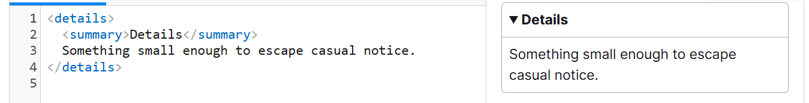

# HTML

HTML（HyperText Markup Language，超文本标记语言）是一种用来告知浏览器如何组织页面的标记语言。HTML 由一系列的元素组成，这些元素可以用来包围或标记不同部分的内容，使其以某种方式呈现或者工作。

## meta 元素

> 元数据就是描述数据的数据。

> 许多 `<meta>` 特性已经不再使用。例如，keyword` <meta>` 元素（`<meta name="keywords" content="fill, in, your, keywords, here">`，为搜索引擎提供关键词，用于确定该页面与不同搜索词的相关性）已经被搜索引擎忽略了，因为作弊者填充了大量关键词到 keyword，错误地引导搜索结果。

```html
<!-- 声明文档使用的字符编码 -->
<meta charset="utf-8" />
<!-- 优先使用 IE 最新版本和 Chrome -->
<meta http-equiv="X-UA-Compatible" content="IE=edge,chrome=1" />
<!-- 页面描述 -->
<meta name="description" content="不超过150个字符" />
<!-- 页面关键词 -->
<meta name="keywords" content="" />
<!-- 网页作者 -->
<meta name="author" content="name, email@gmail.com" />
<!-- 搜索引擎抓取 -->
<meta name="robots" content="index,follow" />
<!-- 为移动设备添加 viewport -->
<meta
  name="viewport"
  content="width=device-width, initial-scale=1, maximum-scale=3, minimum-scale=1, user-scalable=no" />

<!-- iOS 设备 begin -->
<meta name="apple-mobile-web-app-title" content="标题" />
<!-- 添加到主屏后的标题（iOS 6 新增） -->
<meta name="apple-mobile-web-app-capable" content="yes" />
<!-- 是否启用 WebApp 全屏模式，删除苹果默认的工具栏和菜单栏 -->
<meta
  name="apple-itunes-app"
  content="app-id=myAppStoreID, affiliate-data=myAffiliateData, app-argument=myURL" />
<!-- 添加智能 App 广告条 Smart App Banner（iOS 6+ Safari） -->
<meta name="apple-mobile-web-app-status-bar-style" content="black" />
<!-- 设置苹果工具栏颜色 -->
<meta name="format-detection" content="telphone=no, email=no" />

<!-- 启用360浏览器的极速模式(webkit) -->
<meta name="renderer" content="webkit" />
<!-- 避免IE使用兼容模式 -->
<meta http-equiv="X-UA-Compatible" content="IE=edge" />
<!-- 不让百度转码 -->
<meta http-equiv="Cache-Control" content="no-siteapp" />
<!-- 针对手持设备优化，主要是针对一些老的不识别viewport的浏览器，比如黑莓 -->
<meta name="HandheldFriendly" content="true" />

<!-- 微软的老式浏览器 -->
<meta name="MobileOptimized" content="320" />
<!-- uc强制竖屏 -->
<meta name="screen-orientation" content="portrait" />
<!-- QQ强制竖屏 -->
<meta name="x5-orientation" content="portrait" />
<!-- UC强制全屏 -->
<meta name="full-screen" content="yes" />
<!-- QQ强制全屏 -->
<meta name="x5-fullscreen" content="true" />
<!-- UC应用模式 -->
<meta name="browsermode" content="application" />
<!-- QQ应用模式 -->
<meta name="x5-page-mode" content="app" />
<!-- windows phone 点击无高光 -->
<meta name="msapplication-tap-highlight" content="no" />

<!-- 设置页面不缓存 -->
<meta http-equiv="pragma" content="no-cache" />
<meta http-equiv="cache-control" content="no-cache" />
<meta http-equiv="expires" content="0″>

<!-- 含有高分辨率 Retina 显示屏的 iPad Pro：-->
<link
  rel="apple-touch-icon"
  sizes="167x167"
  href="/apple-touch-icon-167x167.png" />
<!-- 三倍分辨率的 iPhone：-->
<link
  rel="apple-touch-icon"
  sizes="180x180"
  href="/apple-touch-icon-180x180.png" />
<!-- 没有 Retina 的 iPad、iPad mini 等：-->
<link
  rel="apple-touch-icon"
  sizes="152x152"
  href="/apple-touch-icon-152x152.png" />
<!-- 二倍分辨率的 iPhone 和其他设备：-->
<link rel="apple-touch-icon" href="/apple-touch-icon-120x120.png" />
<!-- 基本图标 -->
<link rel="icon" href="/favicon.ico" />
```

## 文档语言

HTML 设置文档的语言，会被搜索引擎更有效地索引

- 在特定于语言的结果中正确显示
- 对于使用屏幕阅读器的视障人士友好（例如，法语和英语中都有“six”这个单词，但是发音却完全不同）。

```html
<!--为文档设置语言-->
<html lang="zh-CN">
  <!--文档分段设置不同的语言-->
  <p>Japanese example: <span lang="ja">ご飯が熱い。</span>.</p>
</html>
```

## HTML 标签

- blockquote 块级引用
- q 行内引用
- abbr 缩略语
- address 包含联系方式
- sup 上标
- sub 下表
- code 标记计算机通用代码
- pre 用于保留空白字符
- var 用于标记具体变量名
- kbd 标记键盘输入
- samp 标记计算机程序的输出
- time 标记时间
  - `<time datetime="2016-01-20">2016 年 1 月 20 日</time>`
- br 换行
- hr 水平分割线
- figure 代表一段独立的内容，内容为图像、插图、图表、代码片段等
- figcaption 定义 figure 元素的标题
- col 定义一列或多列 有作为没有定义 span 属性的 `<colgroup>` 元素的子元素才有效。
- colgroup 包含 col
- data 将一个指定内容和机器可读的翻译联系在一起。`<data value='12'>中国</data>`
- datalist 包含了一组 `<option>` 元素，这些元素表示其他表单控件可选值。
- details 仅在被切换成展开状态时，它才会显示内含的信息
- summary 为 details 提供概要和标签
  - 
- fieldset 对表单中的控制元素进行分组（也包括 label 元素）。
- legend 表示其父元素 `<fieldset>` 内容的标题。
- hgroup 代表文档标题和与标题相关联的内容，它将一个 `<h1>–<h6> 元素与一个或多个 <p> 元素组合在一起。`

```html
<hgroup>
  <h1>Frankenstein</h1>
  <p>Or: The Modern Prometheus</p>
</hgroup>
```

- map `<area>` 元素一起使用来定义一个图像映射（一个可点击的链接区域.，例如地图）。
- menu HTML 规范中被描述为 `<ul>` 的语义替代
- meter 已知范围内的标量值或分数值。
  ```html
  <meter id="fuel" min="0" max="100" low="33" high="66" optimum="80" value="50">
    at 50/100
  </meter>
  ```
- optgroup 为`<select>` 元素中的选项创建分组
- output 表示计算或用户操作的结果
- progress 显示一项任务的完成进度
  - `<progress id="file" max="100" value="70">70%</progress>
`
- search 执行搜索和过滤功能的容器
- slot web 组件内部的占位符，类似 vue 中 slot
- small 代表旁注和小字印刷（如版权和法律文本），与其样式的呈现方式无关。默认情况下，它以比其中的文本小一号的字体大小呈现
- template 是一种用于保存客户端内容机制，该内容在加载页面时不会呈现，但随后可以 (原文为 may be) 在运行时使用 JavaScript 实例化。将模板视为一个可存储在文档中以便后续使用的内容片段。虽然解析器在加载页面时确实会处理 `<template>` 元素的内容，但这样做只是为了确保这些内容有效；但元素内容不会被渲染。
- track 被当作媒体元素—`<audio>` 和` <video>`的子元素来使用。它允许指定时序文本字幕（或者基于时间的数据），例如自动处理字幕。字幕格式有 WebVTT 格式（.vtt 格式文件）— Web 视频文本字幕格式，以及指时序文本标记语言（TTML）格式。track 给媒体元素添加的数据的类型在 kind 属性中设置，属性值可以是 subtitles, captions, descriptions, chapters 或 metadata。该元素指向当用户请求额外的数据时浏览器公开的包含定时文本的源文件。一个 media 元素的任意两个 track 子元素不能有相同的 kind, srclang, 和 label 属性。

## audio 和 video

audio 和 video 元素的使用方式几乎完全一致。区别：audio 不支持 width/height/poster 属性，因为没有视觉部件

html 中引入视频

```html
<video
  controls
  width="400"
  height="400"
  autoplay
  loop
  muted
  preload="auto"
  poster="poster.png">
  <source src="rabbit320.mp4" type="video/mp4" />
  <source src="rabbit320.webm" type="video/webm" />
  <track kind="subtitles" src="subtitles_es.vtt" srclang="es" label="Spanish" />
  <track
    default
    kind="captions"
    srclang="en"
    src="/media/examples/friday.vtt" />
  <p>你的浏览器不支持此视频。可点击<a href="rabbit320.mp4">此链接</a>观看</p>
</video>
```

属性解释：

- controls 是否显示视频控件
- autoplay 自动播放
- loop 循环播放
- muted 静音模式
- preload 这个属性被用来缓冲较大的文件，有三个值可选：
  - none 不缓冲文件
  - auto 页面加载后缓存媒体文件
  - metadata 仅缓冲文件的元数据
- poster 视频播放前的默认海报
- width 视频容器的宽
- height 视频容器的高

> 无论宽高如何，视频都会保持它原始的长宽比——也叫做纵横比。

source 标签引入视频资源，可以设置多个，视频源匹配从上到下首先支持的视频格式。type 属性是可选的，浏览器会通过检查这个属性，来跳过那些不支持的格式。如果没有 type 属性，浏览器会尝试加载每一个文件，直到找到一个能正确播放的格式，会消耗掉大量的时间和资源。

track 元素可以引入视频字幕文件，一般 webVTT 文件格式。包含了众多带有一些元数据的字符串 ： cue，描述这个字符串将会在视频中显示的时间、样式、定位信息。

- srclang ：告诉浏览器是用什么语言来编写的 subtitles。
- label： 帮助读者在查找时识别语言
- kind 属性代表数据的类型:

> 一个 media 元素的任意两个 track 子元素不能有相同的 kind, srclang, 和 label 属性。

- subtitles 外语材料的翻译字幕，来帮助那些听不懂音频中说的什么的人理解音频当中的内容。
- captions 同步翻译对白，或是描述一些有重要信息的声音，来帮助那些不能听音频的人理解音频中的内容。
- chapters 介绍章节，比如电影、书籍等。
- metadata 描述视频的元数据，比如作者、版权信息、视频的标题等。
- description 介绍视频内容，比如视频中包含的场景、人物、事件等。
- timedtext 同步文本

一个典型的 web VTT 文件如下：

```txt
WEBVTT

1
00:00:22.230 --> 00:00:24.606
第一段字幕

2
00:00:30.739 --> 00:00:34.074
第二段字幕
```

## iframe 嵌入网页

属性：

- border 配置边框
- src 指向要嵌入的文档的 URL。
- width & heigth 宽高
- allowfullscreen 是否通过调用 `<iframe>` 的 requestFullscreen() 方法激活全屏模式。被 allow="fullscreen"替代
- allow 配置权限策略(受限 api 在源上的访问性)
  - none 禁用
  - self 同源下可以使用
  - allowlist 默认值，iframe 文件必须和 src 同源

```html
<!--任何源都阻止地理位置信息的访问-->
<iframe src="https://example.com" allow="geolocation 'none'"></iframe>
```

- sandbox 控制在 `<iframe>` 中的内容的限制。值为空会应用所有限制，也可以为空格分隔的标记以解除特定的限制。例如：控制是否可以提交表单、运行 js 等
  - allow-forms 允许嵌入浏览器的上下文提交表单
  - allow-modals 允许打开模态窗口
  - allow-orientaton-lock 允许锁定屏幕方向
  - allow-popups 允许弹窗
  - allow-popups-to-escape-sandox 允许打开不继承沙箱的窗口
  - allow-same-origin 将嵌入的上下文是为同源
  - allow-scripts 允许运行脚本
  - allow-storage-access-by-user-activation 允许经过用户同意后使用 Storage Access API
  - allow-top-navigation 允许导航到顶级上下文
  - allow-top-avigaton-by-user-activation 允许经过用户同意后导航到顶级上下文
  - allow-downloads-without-user-activation 不经过用户同意也可以下载文件

> 最好在主内容完成加载后，再使用 JavaScript 设置 iframe 的 src 属性，以减少页面加载时间

## embed 和 object 元素

```html
<object data="mypdf.pdf" type="application/pdf" width="800" height="1200">
  不支持 PDF
</object>

<!--等同于object 区别是embed使用src引入文件-->
<embed src="mypdf.pdf" type="application/pdf" width="800" height="1200">
  不支持 PDF
</embed>
```

## SVG 是什么

SVG 是用于描述矢量图形的 XML 标记。提供了许多不同的元素来定义图形的形状和效果。

- 创建基本图形的元素，如 `<circle>` 和 `<rect>`，复杂一些的元素如 `<path>` 和 `<polygon>`。
- 更高级的特性包括 `<feColorMatrix>`（使用变换矩阵转换颜色）
- `<animate>`（矢量图形的动画部分）
- `<mask>`（在图像上层应用蒙版）

创建一个圆和一个矩形：

```html
<svg
  version="1.1"
  baseProfile="full"
  width="300"
  height="200"
  xmlns="http://www.w3.org/2000/svg">
  <rect width="100%" height="100%" fill="black" />
  <circle cx="150" cy="100" r="90" fill="blue" />
</svg>
```

矢量图像中的文本可以访问，有利于 SEO。也可以很好的适应样式/脚本，因为图像的每个组件都是可以通过 CSS 或者通过 Javascript 设置样式。
