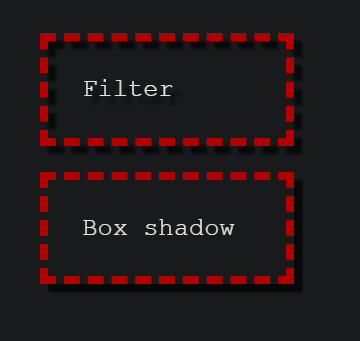
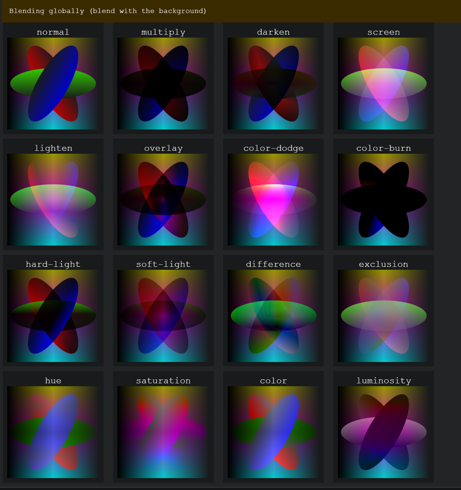

# CSS 基础

## CSS简介

层叠样式表（Cascading Style Sheets，缩写为 CSS）是一种样式表语言，用来描述 HTML 或 XML（包括如 SVG、MathML 或 XHTML 之类的 XML 分支语言）文档的呈现方式。CSS 描述了在屏幕、纸质、音频等其他媒体上的元素应该如何被渲染的问题。CSS 是开放 Web 的核心语言之一，并根据 W3C 规范在 Web 浏览器中进行了标准化。

## background-attachment 背景附加 
>指定背景滚动方式
   1. fixed：背景固定到视口上。始终保持再屏幕上相同的位置。
   2. scroll：固定到页面上。跟随页面滚动，如果滚动了元素内容，背景不会滚动
   3. local：固定到元素上。滚动该元素时，背景会随之滚动。
## background-clip 背景裁剪
> 设置元素的背景（背景图片或颜色）是否延伸到边框、内边距盒子、内容盒子下面。
```css
/* Keyword values */
background-clip: border-box;
background-clip: padding-box;
background-clip: content-box;
background-clip: text;
```
   1. border-box 背景延伸至边框外沿（但是在边框下层）。
   2. padding-box 背景延伸至内边距（padding）外沿。不会绘制到边框处。
   3. content-box 背景被裁剪至内容区（content box）外沿。
   4. text 背景被裁剪成文字的前景色。
设置为border-box时：

设置为text时：有非常炫酷的效果

## background  简写属性
   1. background:background-color background-image background-positon/background-size background-repeat;
  
  ```css
   background:red center center / 400px 200px no-repeat
  ```
## writing-mode 
>书写模式 指文本的排列方向是横向还是纵向的，配置总结：行内轴-块轴
   1. horizontal-tb:块流向从上至下。对应的文本方向是横向的。默认值
   2. vertical-rl: 块流向从右向左。对应的文本方向是纵向的。
   3. vertical-lr: 块流向从左向右。对应的文本方向是纵向的。
   4. sideways-rl
   5. sideways-lr


### 块轴和行内轴
如果我们用逻辑属性而不是物理属性来思考，就不能使用从左到右、从上到下的方式观察世界，我们需要一个新的参考点：块轴与行内轴。理解它们是非常重要的，如果开始用块轴与行内轴的方式来看待布局，在网格布局中使用到的术语就变得非常有意义了。


### 逻辑属性和逻辑值 

> 当处于纵向书写模式之下时，我们希望盒子可以像横向模式下一样得到拓宽。此时不能使用width和height了。

>以下是逻辑属性

1. inline-size  内联尺寸：内联维度的尺寸。映射到width，
2. block-size  块级尺寸：块级维度的尺寸。映射到height
3. margin-top : margin-block-start
4. padding-left : padding-inline-start
5. border-bottom: border-block-end
  
>以下是逻辑值

1. top : block-start
2. right : inline-end
3. bottom : block-end
4. left : inline-start

## overflow-wrap

> CSS 属性 overflow-wrap 应用于行级元素，用来设置浏览器是否应该在一个本来不能断开的字符串中插入换行符，以防止文本溢出其行向盒。

1. normal 行只能在正常的单词断点（例如两个单词之间的空格）处换行。
2. anywhere 为防止溢出，如果行中没有其他可接受的断点，则不可断的字符串（如长词或 URL）可能会在任何时候换行。在断点处不会插入连字符。在计算最小内容内在大小时，会考虑由单词换行引入的软换行机会。
3. break-word  与 anywhere 值相同，如果行中没有其他可接受的断点，则允许在任意点将通常不可断的单词换行，但在计算最小内容内在大小时不考虑断字引入的软换行机会。

## word-break

> CSS 属性 word-break 指定了怎样在单词内断行。

1. normal 使用默认的断行规则。默认不打破单词。
2. break-all 对于 non-CJK (CJK 指中文/日文/韩文) 文本，可在任意字符间断行
3. keep-all CJK文本不断行。Non-CJK 文本表现同 normal。
4. break-word 已废弃

## filter 滤镜

> CSS filter 属性将模糊或颜色偏移等图形效果应用于元素。滤镜通常用于调整图像、背景和边框的渲染。

基本上，滤镜可以应用在任何元素上，块元素（block）或者行内元素（inline）——你只需要使用filter属性，并且给他一个特定的过滤函数的值。有些可用的滤镜选项和其他 CSS 特性做的事情十分相似，然而滤镜真正出色的地方在于，它们作用于盒（box）内内容（content）的确切形状，而不仅仅将盒子本身作为一个大的块，这看起来会更棒，例如：***drop-shadow()***

drop-shadow()的工作方式以及产生的效果和 box-shadow 或text-shadow十分相似，参数也一样，但效果更精细。

```css
.box-shadow {
  filter: drop-shadow(5px 5px 1px rgba(0, 0, 0, 0.7));
  box-shadow: 5px 5px 1px rgba(0, 0, 0, 0.7);
}
```
drop-shadow 滤镜跟随着文本和 border dashes 的确切形状。而盒阴影（box-shadow）仅仅跟随着盒的四方。



filter属性配置：
```css

/* URL 引入滤镜元素*/
filter: url("filters.svg#filter-id");

/* <filter-function> 值 */

/**将高斯模糊应用于输入图像。 */
filter: blur(5px);

/**将线性乘法器应用于输入图像，以调整其亮度。值为 0% 将创建全黑图像；值为 100% 会使输入保持不变，其他值是该效果的线性乘数。如果值大于 100% 将使图像更加明亮。 */
filter: brightness(0.4);

/**调整输入图像的对比度。值是 0% 将使图像变灰；值是 100%，则无影响；若值超过 100% 将增强对比度。 */
filter: contrast(200%);

/**使用 <shadow> 参数沿图像的轮廓生成阴影效果。阴影语法类似于 <box-shadow>（在 CSS 背景和边框模块中定义），但不允许使用 inset 关键字以及 spread 参数。与所有 filter 属性值一样，任何在 drop-shadow() 后的滤镜同样会应用在阴影上。 */
filter: drop-shadow(16px 16px 20px blue);

/**将图像转换为灰度图。值为 100% 则完全转为灰度图像，若为初始值 0% 则图像无变化。值在 0% 到 100% 之间，则是该效果的线性乘数。 */
filter: grayscale(50%);

/**应用色相旋转。<angle> 值设定图像会被调整的色环角度值。值为 0deg，则图像无变化。 */
filter: hue-rotate(90deg);

/**反转输入图像。值为 100% 则图像完全反转，值为 0% 则图像无变化。值在 0% 和 100% 之间，则是该效果的线性乘数。 */
filter: invert(75%);

/**应用透明度。值为 0% 则使图像完全透明，值为 100% 则图像无变化。 */
filter: opacity(25%);

/**改变图像饱和度。值为 0% 则是完全不饱和，值为 100% 则图像无变化。超过 100% 则增加饱和度。 */
filter: saturate(30%);

/**将图像转换为深褐色。值为 100% 则完全是深褐色的，值为 0% 图像无变化。 */
filter: sepia(60%);

/* 多个滤镜 如果任何函数的参数无效，则该函数返回 none*/
filter: contrast(175%) brightness(3%);
filter: drop-shadow(3px 3px red) sepia(100%) drop-shadow(-3px -3px blue);
/**为一个元素后面区域添加图形效果（如模糊或颜色偏移）。因为它适用于元素背后的所有元素，为了看到效果，必须使元素或其背景至少部分透明。 */
backdrop-filter: drop-shadow(3px 3px red) sepia(100%) drop-shadow(-3px -3px blue);

/* 不使用滤镜 */
filter: none;
```
函数的值如果接受百分比值（如 34%），那么该函数也接受小数值（如 0.34）。

```css
filter: grayscale(0.4) blur(5px);
```
输出结果：


## object-fit

> object-fit CSS 属性指定可替换元素(无法控制元素内部布局的元素)（例如：`` 或 `<video>`）的内容应该如何适应到其使用高度和宽度确定的框.不可继承

- fill 完全填充容器，img可能会变形
- contain 包含img，保持img缩放比的最大尺寸
- cover 完全覆盖容器，保持img缩放比的最小尺寸
- none  保持其原有的尺寸。
- scale-down 尺寸与 none 或 contain 中的一个相同，取决于它们两个之间谁得到的对象尺寸会更小一些。

## object-position

> CSS 属性 object-position 规定了可替换元素的内容，在内容框中的位置。可替换元素的内容框中未被对象所覆盖的部分，则会显示该元素的背景。

- object-positon:50% 50%;
- object-positon:right top;
- object-position: bottom 10px right 20px; /* 边缘偏移值 */

## 混合模式
CSS 混合模式允许我们为元素添加一个混合模式，以当两个元素重叠时，指定一个混合的效果——最终每个像素所展示的颜色将会是原来像素中颜色和其下面一层相组合之后的结果

- background-blend-mode：CSS 属性定义该元素的背景图片，以及背景色如何混合。混合模式应该按background-image CSS 属性同样的顺序定义。如果混合模式数量与背景图像的数量不相等，它会被截取至相等的数量。

```css
/* 单值 */
background-blend-mode: screen;

/* 双值，一个值对应一个背景 */
background-blend-mode: darken, luminosity;
```
- mix-blend-mode:描述了元素的内容应该与元素的直系父元素的内容和元素的背景如何混合。
```css
/*是否独立混合 Without isolation, the background color will be taken into account */
isolation: isolate; 

/* 关键字值 和background-blend-mode参数一样 */
mix-blend-mode: normal;
mix-blend-mode: multiply;
mix-blend-mode: screen;
mix-blend-mode: overlay;
mix-blend-mode: darken;
mix-blend-mode: lighten;
mix-blend-mode: color-dodge;
mix-blend-mode: color-burn;
mix-blend-mode: hard-light;
mix-blend-mode: soft-light;
mix-blend-mode: difference;
mix-blend-mode: exclusion;
mix-blend-mode: hue;
mix-blend-mode: saturation;
mix-blend-mode: color;
mix-blend-mode: luminosity;
mix-blend-mode: plus-darker;
mix-blend-mode: plus-lighter;
```



## CSS 命名规范BEM

BEM 即块级元素修饰符（Block Element Modifier）。命名方式为Block__Element--Modifier
- Block，一个块，例如一个按钮、菜单或者标志，就是独立的实体
- Element，一个元素就像一个列表项或者标题一样，被绑定到它所在的块
- Modifier，修饰字符是标记到一个块或者元素的标识，能够改变样式或者行为。

例如：
```html
<form class="form">
  <input class="form__input" type="text" />
  <input class="form__submit form__submit--disabled" type="submit" />
</form>

```

## text-transform
> 转换字体
- none 防止任何转换
- uppercase 转为大写
- lowercase 转为小写
- capitalize 转化所有单词让其首字母大写
- full-width 将所有字形转换成全角，即固定宽度的正方形，类似于等宽字体，允许拉丁字符和亚洲语言字形（如中文，日文，韩文）对齐。
## text-decoration
>设置/取消字体上的文本装饰 (你将主要使用此方法在设置链接时取消设置链接上的默认下划线。) 可用值为：
- none 取消任何文本装饰
- underline 下划线
- overline 上划线
- line-through 删除线

text-decoration属于简写形式，构成：
- text-decoration-line 类型
- text-decoration-color 颜色
- text-decoration-style 线的样式
  - solid 实线
  - double 双实线
  - dotted 点划线
  - dashed 虚线
  - wavy 波浪线
  - node 不划线
- text-decoration-thickness 线的厚度
  - auto 浏览器自己决定厚度
  - from-font 使用字体文件的厚度，如果没有则有浏览器决定
  - length值 将文本装饰线的厚度设置为一个 `<length>` 类型的值，覆盖掉字体文件建议的值或浏览器默认的值。
  - percentage值 设置为当前字体，1em的百分比
  
```css
/**可以同时使用多个装饰 */
text-decoraton:underline overline;
/**同时设置删除线、红色、波浪线 */
text-decoration:line-through red wavy;
```
## text-overflow

>用于确定如何提示用户存在隐藏的溢出内容。其形式可以是裁剪、显示一个省略号`...`或显示一个自定义字符串。

>`text-overflow` 属性可能被赋予一个或者两个值。如果赋一个值，指的行末溢出行为。如果赋两个值，第一个值指定行左端溢出行为，第二个值指定行右端溢出行为。

- clip 默认值。这个关键字会在内容区域的极限处截断文本，因此可能会在单词的中间发生截断。如果你的目标浏览器支持 text-overflow: ''，为了能在两个单词过渡处截断，你可以使用一个空字符串值（''）作为 text-overflow 属性的值。
- ellipsis 这个关键字会用一个省略号（'…'、U+2026 HORIZONTAL ELLIPSIS）来表示被截断的文本。这个省略号被添加在内容区域中，因此会减少显示的文本。如果空间太小以至于连省略号都容纳不下，那么这个省略号也会被截断。
- string字符 用来表示被截断的文本。字符串内容将被添加在内容区域中，所以会减少显示出的文本。如果空间太小以至于连字符串本身都容纳不下，那么这个字符串也会被截断
- fade 这个关键字将会截断行内溢出文本并在完全透明的行边缘添加一个淡出特效。
- `fade(<lengt>|<percentage)` 这个函数将会截断行内溢出文本并在完全透明的行边缘添加一个淡出特效。 参数决定淡出特效的距离。`<percentage>` 以行宽而定。小于 0 的值视为 0。大于行宽的值视为行宽

## white-space
>white-space-collapse 和 text-wrap 简写值。如何处理元素内的空白字符。这个属性指定了两件事：
1. white-space-collapse：空白字符是否合并，以及如何合并。
2. text-wrap：是否换行，以及如何换行。  

属性值：
- normal 连续的空白符会被合并。源码中的换行符会被当作空白符来处理。并根据填充行框盒子的需要来换行。
- nowrap 和 normal 一样合并空白符，但阻止源码中的文本换行
- pre 连续的空白符会被保留。仅在遇到换行符或 `<br>` 元素时才会换行。
- pre-wrap 连续的空白符会被保留。在遇到换行符或 `<br>` 元素时，或者根据填充行框盒子的需要换行。
- pre-line 连续的空白符会被合并。在遇到换行符或 `<br>` 元素时，或者根据填充行框盒子的需要换行。
- break-spaces 与 pre-wrap 的行为相同，除了：
  - 任何保留的空白序列总是占用空间，包括行末的。
  - 每个保留的空白字符后（包括空白字符之间）都可以被截断。
  - 这样保留的空间占用空间而不会挂起，从而影响盒子的固有尺寸（min-content 尺寸和 max-content 尺寸）。
```css
/* 单个关键字值 */
white-space: normal;
white-space: nowrap;
white-space: pre;
white-space: pre-wrap;
white-space: pre-line;
white-space: break-spaces;

/* white-space-collapse 和 text-wrap 简写值 */
white-space: collapse balance;
white-space: preserve nowrap;
```
## min-content & max-content 属性值
1. min-content
> 表示内容的最小固有尺寸。对于文本内容而言，这意味着内容会利用所有软换行的机会，变得尽可能的小。
2. max-content
> 表示内容的最大固有尺寸。对于文本内容，这意味着即使内容会导致溢出，它也不会换行
```css
/**根据内容调整grid列的大小，第一列尽可能少占空间，第二列尽可能多占空间，第三列占据剩下全部空间 */
grid-template-columns: min-content max-content 1fr;
```
## text-orientation
>设定行中字符的方向。但它仅影响纵向模式（当 writing-mode 的值不是horizontal-tb）下的文本。此属性在控制使用竖排文字的语言的显示上很有作用，也可以用来构建垂直的表格头。
- mixed 默认值。顺时针旋转水平书写的字符 90°，将垂直书写的文字自然布局。
- upright 将水平书写的字符自然布局（直排），包括垂直书写的文字（as well as the glyphs for vertical scripts）。注意这个关键字会导致所有字符被视为从左到右，也就是 direction 被强制设为 ltr。
- sideways 所有字符被布局为与水平方式一样，但是整行文本被顺时针旋转 90°。
```css
p {
  writing-mode: vertical-rl;
  text-orientation: upright;
}
```

## list-style
>配置列表项符号的样式，为简写属性，三个属性合成
- list-style-type:定义列表项符号，可以借助插件实现更多可选项
  - none 不显示列表项符号
  - `<string>` 可被解析为特殊符号:list-style-type: "\1F44D";竖起大拇指
  - disc 实心圆点，默认值
  - circle 空心圆点
  - square 实心方块
  - disclosure-closed 向右的实心三角
  - disclosure-open 向下的实心三角
  - decimal 十进制阿拉伯数字
  - lower-alpha 小写字母 abc
  - upper-alpha 大写字母
  - cjk-decimal 中日韩十进制数
  - decimal-leading-zero 十进制，不足十用0填充
  - lower-roman 小写罗马数字
  - upper-roman 大写罗马数字
  - lower-greek 小写希腊数字
  - simp-chinese-informal 简写中文非正式：三十三
  - simp-chinese-formal 简写中文正式：叁拾叁
  - 。。。。
- list-style-image:自定义列表项符号：list-style-image: url(star.svg);
- list-style-position:列表项符号的位置
  - inside 出现在列表项内测
  - outside 默认，外侧
```css
/**属性值可以任意顺序排列，你可以设置一个，两个或者所有三个值（不包括的属性使用的默认值是 disc、none 和 outside） */
list-style: square url(example.png) inside;
```
## 设置滚动条
1. scrollbar-width 显示滚动条时设置滚动条的最大宽度。
   1. auto 系统默认滚动条宽度
   2. thin 系统提供的瘦滚动条宽度，比默认窄
   3. none 不显示滚动条，但元素依然可以滚动
2. scrollbar-color 设置滚动条轨道（track）和滑块（thumb）的颜色。
3. scrollbar-gutter 位于border内边缘和padding外边缘之间，滚动条会出现子这里。如果没有滚动条，gutter会渲染为padding的延伸。
   1. auto 初始值。内容溢出会出现scrollbar。
   2. stable。一直出现滚动条，
   3. both-edges 如果在框的一个行内开始/结束边缘上出现gutter，则另一个也将出现在相反的边缘上。
```css
/* 关键字值 */
scrollbar-color: auto;

/* <color> 值 */
scrollbar-color: rebeccapurple green; /* 两个有效的颜色。
第一个应用于滚动条的滑块，第二个应用于轨道。 */

scrollbar-width:thin;


/* 全局值 */
scrollbar-color: inherit;
scrollbar-color: initial;
scrollbar-color: revert;
scrollbar-color: revert-layer;
scrollbar-color: unset;
```
## inherit、initial、unset

- inherit 继承 使子元素属性和父元素相同。

- initial 初始值 设置为该属性的初始值。

- revert 恢复到浏览器默认样式 

- revert-layer 恢复到上一级联层的值

- unset 属性可继承就是 inherit，否则和 initial 一样

```html
<ul>
  <li>Default <a href="#">link</a> color</li>
  <li class="my-class-1">Inherit the <a href="#">link</a> color</li>
  <li class="my-class-2">Reset the <a href="#">link</a> color</li>
  <li class="my-class-3">Unset the <a href="#">link</a> color</li>
</ul>

<style>
body {
  /** color属于可继承属性，a标签的默认样式覆盖了继承的color值，显示默认的蓝色 */
  color: green;
}
/**属性设置为inherit，开启了继承，则继承父容器的颜色，即green */
.my-class-1 a {
  color: inherit;
}
/**属性设置为initial，即使用初始值，初始值默认白色 */
.my-class-2 a {
  color: initial;
}
/**设置unset，即属性如果是可继承属性，就是inherit。否则为initail。 */
.my-class-3 a {
  color: unset;
}
</style>
```
输出结果为：


## all属性

重设所有属性值。CSS 的简写属性 all 可以用于同时将这些继承值中的一个应用于（几乎）所有属性。它的值可以是其中任意一个（inherit、initial、unset 或 revert）。这是一种撤销对样式所做更改的简便方法，以便回到之前已知的起点。

```css
/**使用all属性，撤销所有设置。blockquote继承可继承的属性，其余设为initial初始值 */
blockquote {
  background-color: orange;
  border: 2px solid blue;
  all:unset;
}
```
## CSS 样式优先级

内联样式，即 style 属性内的样式声明，优先于所有普通的样式，无论其优先级如何。即无论选择器中有多少个 ID，它总是比其他任何优先级的权重都要高。

有一个特殊的 CSS 可以用来覆盖所有上面所有优先级计算，不过需要很小心的使用——!important。用于修改特定属性的值，能够覆盖普通规则的层叠。

同优先级的，书写顺序在后面的优先级高，会覆盖前面的。


总结，在统一级联层时：!importent > 内联样式 > id > class > tag

```css
@layer layer1 layer2;

```

不同级联层时： 匿名级联层 > layer2 > layer1