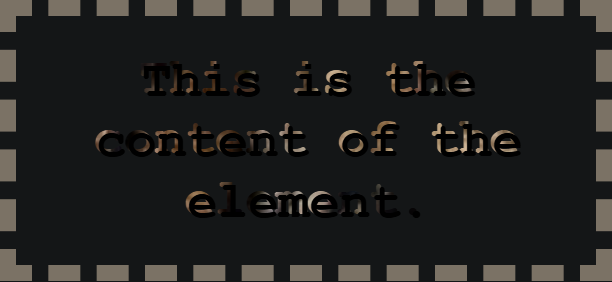

# CSS 基础

层叠样式表（Cascading Style Sheets，缩写为 CSS）是一种样式表语言，用来描述 HTML 或 XML（包括如 SVG、MathML 或 XHTML 之类的 XML 分支语言）文档的呈现方式。CSS 描述了在屏幕、纸质、音频等其他媒体上的元素应该如何被渲染的问题。CSS 是开放 Web 的核心语言之一，并根据 W3C 规范在 Web 浏览器中进行了标准化。

**CSS 样式优先级**

内联样式，即 style 属性内的样式声明，优先于所有普通的样式，无论其优先级如何。即无论选择器中有多少个 ID，它总是比其他任何优先级的权重都要高。

有一个特殊的 CSS 可以用来覆盖所有上面所有优先级计算，不过需要很小心的使用——!important。用于修改特定属性的值，能够覆盖普通规则的层叠。

同优先级的，书写顺序在后面的优先级高，会覆盖前面的。

总结，在统一级联层时：!importent > 内联样式 > id > class > tag

```css
@layer layer1 layer2;
```

不同级联层时： 匿名级联层 > layer2 > layer1

## CSS 嵌套

CSS 嵌套类似于 Sass 预处理器，不同是，它是被浏览器直接解析的，而不是先经由 CSS 预处理器的预编译。而且在 CSS 嵌套中，& 嵌套选择器的优先级类似于 :is() 函数；它的优先级由它所关联的选择器列表当中优先级最高的选择器决定。

> &:嵌套选择器，类似 Sass 嵌套里的&，代表父级。也可以嵌套关系选择器。

```css
.myClass {
  display: grid;
  /**使用嵌套选择器 */
  &:hover {
    background: red;
  }

  /**嵌套和组合关系选择器 */
  &.b {
    /** 等价于.myClass.b */
  }

  /**嵌套关系选择器 等价于 & + p */
  + p {
    color: white;
    background-color: black;
  }

  /**& 嵌套选择器也可以添加到一个选择器的后方，来反转上下文 */
  .bar & {
    /* .bar .myClass 的样式 */
  }

  /**这种拼接，会被解析为element.myClass */
  element& {
  }

  /**%在选择器中是无效的。这个选择器下的规则都将被忽略*/
  & %invalid {
    /* %invalid 的无效样式，全部被忽略 */
  }

  /**CSS 不支持这种拼接 */
  &__child-element {
  }

  /**可以嵌套媒体查询，也可以嵌套 */
  @media (orientation: landscape) {
    grid-auto-flow: column;
    @media (min-width: 1024px) {
      max-inline-size: 1024px;
    }
  }

  /**可以嵌套级联层 */
  @layer base {
    /**这里等价于@layer base .myClass */
    block-size: 100%;
    @layer support {
      /**这里等价于@layer base.support .myClass .bar */
      & .bar {
        min-block-size: 100%;
      }
    }
  }
}
```

## CSS 坐标系

CSS 对象模型使用四种标准坐标系。如下图：


1. 屏幕坐标系 screen ：原点是用户屏幕空间的左上角。该坐标系中的每个点都代表一个逻辑像素，因此每个坐标轴上的值都以整数递增或递减。如果文档中包含的窗口被移动，或者用户的屏幕几何形状发生变化（通过改变显示分辨率或在系统中添加或删除显示器），文档中给定点的位置就会发生变化。

mouse 事件和 touch 事件使用屏幕坐标系的属性：

- screenX
- screenY

2. 页面坐标系 page：给出了一个像素相对于整个渲染文档左上角的位置。这意味着用户在文档中横向或纵向滚动元素后，除非元素通过布局变化移动，否则文档中元素的某一点将保持相同的坐标。

mouse 事件和 touch 事件使用屏幕坐标系的属性：

- pageX
- pageY

3. 视口坐标系 window：视口或浏览上下文的左上角为原点。这就是呈现文档的整个视图区域。

窗口的左上角始终是 (0，0)，与文档内容或任何滚动无关。换句话说，滚动文档会改变文档中给定位置的视口坐标。

mouse 事件和 touch 事件使用屏幕坐标系的属性：

- clientX
- clientY

4. 偏移坐标系 offset：被检查元素或发生事件的元素的左上角。

mouse 事件和 touch 事件使用屏幕坐标系的属性：

- offsetX
- offsetY

## background 背景

- background-attachment 指定背景滚动方式

  - fixed：背景固定到视口上。始终保持再屏幕上相同的位置。
  - scroll：固定到页面上。跟随页面滚动，如果滚动了元素内容，背景不会滚动
  - local：固定到元素上。滚动该元素时，背景会随之滚动。

- background-clip 背景裁剪，是否延伸到边框、内边距盒子、内容盒子下面。

```css
/* Keyword values */
background-clip: border-box;
background-clip: padding-box;
background-clip: content-box;
background-clip: text;
```

1.  border-box 背景延伸至边框外沿（但是在边框下层）。
2.  padding-box 背景延伸至内边距（padding）外沿。不会绘制到边框处。
3.  content-box 背景被裁剪至内容区（content box）外沿。
4.  text 背景被裁剪成文字的前景色。
    设置为 border-box 时：
    
    设置为 text 时：有非常炫酷的效果
    

- background 简写属性

```css
background: background-color background-image background-positon/background-size
  background-repeat;
background: red center center / 400px 200px no-repeat;
```

## writing-mode

> 书写模式：定义块轴与行内轴的排列方向。配置总结：行内轴-块轴

1.  horizontal-tb:行内流水平，块流向从上至下。默认值
2.  vertical-rl: 行内流纵向，块流向从右向左。
3.  vertical-lr: 行内流纵向，块流向从左向右。

> 当处于纵向书写模式之下时，我们希望盒子可以像横向模式下一样得到拓宽。此时不能使用 width 和 height 了。需要使用逻辑属性和逻辑值。

逻辑属性

1. inline-size 内联尺寸：内联维度的尺寸。映射到 width，
2. block-size 块级尺寸：块级维度的尺寸。映射到 height
3. margin-top : margin-block-start
4. padding-left : padding-inline-start
5. border-bottom: border-block-end

逻辑值

1. top : block-start
2. right : inline-end
3. bottom : block-end
4. left : inline-start

## filter 滤镜

通常用于调整图像、背景和边框的渲染。应用在任何元素上，作用于盒（box）内内容（content）的确切形状，而不仅仅将盒子本身作为一个大的块，这看起来会更棒，例如：**_drop-shadow()_** 其工作方式以及产生的效果和 box-shadow 或 text-shadow 十分相似，参数也一样，但效果更精细。

```css
.box-shadow {
  filter: drop-shadow(5px 5px 1px rgba(0, 0, 0, 0.7));
  box-shadow: 5px 5px 1px rgba(0, 0, 0, 0.7);
}
```


drop-shadow 滤镜跟随着文本和 border dashes 的确切形状。而盒阴影（box-shadow）仅仅跟随着盒的四方。

```css
/* filter 属性配置：如果任何函数的参数无效，则该函数返回 none */
filter: blur(5px) brightness(0.4) contrast(200%) drop-shadow(16px 16px 20px blue)

/* URL 引入滤镜元素*/
filter: url("filters.svg#filter-id");

/* <filter-function> 值 */

/**将高斯模糊应用于输入图像。 */
filter: blur(5px);

/**调整亮度。 */
filter: brightness(0.4);

/**调整输入图像的对比度。*/
filter: contrast(200%);

/**沿图像的轮廓生成阴影效果。不允许使用 inset 关键字以及 spread 参数。*/
filter: drop-shadow(16px 16px 20px blue);

/**将图像转换为灰度图。 */
filter: grayscale(50%);

/**应用色相旋转。<angle> 值设定图像会被调整的色环角度值。值为 0deg，则图像无变化。 */
filter: hue-rotate(90deg);

/**反转输入图像。也可以用小数 */
filter: invert(75%);

/**应用透明度。 */
filter: opacity(25%);

/**改变图像饱和度。 */
filter: saturate(30%);

/**将图像转换为深褐色。 */
filter: sepia(60%);

/**为元素后面区域添加滤镜。适用于元素背后的所有元素 */
backdrop-filter: drop-shadow(3px 3px red) sepia(100%) drop-shadow(-3px -3px blue);

/* 不使用滤镜 */
filter: none;
```

blur 模糊效果：


## object-fit

> 指定可替换元素(无法控制元素内部布局的元素)（例如：`` 或 `<video>`）的内容，应该如何适应高度和宽度确定的框.不可继承

- fill 完全填充容器，img 可能会变形
- contain 包含 img，保持 img 缩放比的最大尺寸
- cover 完全覆盖容器，保持 img 缩放比的最小尺寸
- none 保持其原有的尺寸。
- scale-down 尺寸与 none 或 contain 中的一个相同，取决于它们两个之间谁得到的对象尺寸会更小一些。

**object-position**:规定可替换元素在框中的位置。内容框中未被对象所覆盖的部分，则会显示该元素的背景。

- object-positon:50% 50%;
- object-positon:right top;
- object-position: bottom 10px right 20px; 边缘偏移值

## 混合模式

- background-blend-mode：定义该元素内容与背景如何混合。混合模式应该按 background-image CSS 属性同样的顺序定义。如果混合模式数量与背景图像的数量不相等，它会被截取至相等的数量。

```css
/* 单值 */
background-blend-mode: screen;

/* 双值，一个值对应一个背景 */
background-blend-mode: darken, luminosity;
```

- mix-blend-mode:元素的内容应该与背景、父元素的内容和背景如何混合。

```css
/*是否独立混合 。没有 isolation 背景颜色将被考虑在内 */
isolation: isolate;

/* 关键字值 和background-blend-mode参数一样 */
mix-blend-mode: normal;
mix-blend-mode: multiply;
mix-blend-mode: screen;
mix-blend-mode: overlay;
mix-blend-mode: darken;
mix-blend-mode: lighten;
mix-blend-mode: color-dodge;
mix-blend-mode: color-burn;
mix-blend-mode: hard-light;
mix-blend-mode: soft-light;
mix-blend-mode: difference;
mix-blend-mode: exclusion;
mix-blend-mode: hue;
mix-blend-mode: saturation;
mix-blend-mode: color;
mix-blend-mode: luminosity;
mix-blend-mode: plus-darker;
mix-blend-mode: plus-lighter;
```


## text 属性

1. text-transform：转换字体

- none 防止任何转换
- uppercase 转为大写
- lowercase 转为小写
- capitalize 转化所有单词让其首字母大写
- full-width 将所有字形转换成全角，即固定宽度的正方形，类似于等宽字体，允许拉丁字符和亚洲语言字形（如中文，日文，韩文）对齐。

2. text-decoration：设置/取消字体上的文本装饰 ，可用值为：

- none 取消任何文本装饰
- underline 下划线
- overline 上划线
- line-through 删除线

text-decoration 属于简写形式，构成：

- text-decoration-line 类型
- text-decoration-color 颜色
- text-decoration-style 线的样式
  - solid 实线
  - double 双实线
  - dotted 点划线
  - dashed 虚线
  - wavy 波浪线
  - node 不划线

3. text-decoration-thickness：设置线的厚度：

- auto 浏览器自己决定厚度
- from-font 使用字体文件的厚度，如果没有则有浏览器决定
- length 值 将文本装饰线的厚度设置为一个 `<length>` 类型的值，覆盖掉字体文件建议的值或浏览器默认的值。
- percentage 值 设置为当前字体，1em 的百分比

```css
/**可以同时使用多个装饰 */
text-decoraton: underline overline;
/**同时设置删除线、红色、波浪线 */
text-decoration: line-through red wavy;
```

- text-underline-offset 设置文本装饰下划线的偏移距离。

```css
/* 单个关键字 */
text-underline-offset: auto;

/* length */
text-underline-offset: 0.1em;
text-underline-offset: 3px;

/* percentage */
text-underline-offset: 20%;
```

4. text-overflow：用于确定如何提示用户存在隐藏的溢出内容。其形式可以是裁剪、显示一个省略号`...`或显示一个自定义字符串。

> `text-overflow` 属性可能被赋予一个或者两个值。如果赋一个值，指的行末溢出行为。如果赋两个值，第一个值指定行左端溢出行为，第二个值指定行右端溢出行为。

- clip 默认值。截断文本，可能会在单词的中间发生截断。
- ellipsis 用一个省略号表示被截断的文本。这个省略号被添加在内容区域中
- string 用字符表示被截断的文本。字符串内容将被添加在内容区域中
- fade 截断行内溢出文本并在完全透明的行边缘添加一个淡出特效。
- `fade(<lengt>|<percentage)` 参数决定淡出特效的距离。`<percentage>` 以行宽而定。小于 0 的值视为 0。大于行宽的值视为行宽

5. text-orientation ：行内字符的方向。但它仅影响纵向模式（当 writing-mode 的值不是 horizontal-tb）下的文本。

- mixed 默认值。顺时针旋转水平书写的字符 90°，将垂直书写的文字自然布局。
- upright 将水平书写的字符自然布局（直排），包括垂直书写的文字（as well as the glyphs for vertical scripts）。注意这个关键字会导致所有字符被视为从左到右，也就是 direction 被强制设为 ltr。
- sideways 所有字符被布局为与水平方式一样，但是整行文本被顺时针旋转 90°。

```css
p {
  writing-mode: vertical-rl;
  text-orientation: upright;
}
```

6. white-space：如何处理元素内的空白字符。简写形式：
   1. white-space-collapse：空白字符是否合并，以及如何合并。
   2. text-wrap：是否换行，以及如何换行。属性值：
      - normal 连续的空白符会被合并。源码中的换行符会被当作空白符来处理。
      - nowrap 和 normal 一样合并空白符，但阻止源码中的文本换行
      - pre 连续的空白符会被保留。仅在遇到换行符或 `<br>` 元素时才会换行。
      - pre-wrap 连续的空白符会被保留。在遇到换行符或 `<br>` 元素时，或者根据填充行框盒子的需要换行。
      - pre-line 连续的空白符会被合并。在遇到换行符或 `<br>` 元素时，或者根据填充行框盒子的需要换行。
      - break-spaces 与 pre-wrap 的行为相同，除了：
        - 任何保留的空白序列总是占用空间，包括行末的。
        - 每个保留的空白字符后（包括空白字符之间）都可以被截断。
        - 这样保留的空间占用空间而不会挂起，从而影响盒子的固有尺寸（min-content 尺寸和 max-content 尺寸）。

```css
/* 单个关键字值 */
white-space: normal;
white-space: nowrap;
white-space: pre;
white-space: pre-wrap;
white-space: pre-line;
white-space: break-spaces;

/* white-space-collapse 和 text-wrap 简写值 */
white-space: collapse balance;
white-space: preserve nowrap;
```

7. text-align-last：最后一行在被强制换行之前的对齐规则。

```css
/* 关键字值 */
text-align-last: auto;
text-align-last: start;
text-align-last: end;
text-align-last: left;
text-align-last: right;
text-align-last: center;
text-align-last: justify;
```

8. text-emphasis：强调标记应用到除去空格和控制字符的文本。是 text-emphasis-style 和 text-emphasis-color 的简写属性。

- text-emphasis-style
  - none 没有强调标记。
  - filled 形状填充为纯色。如果 filled 和 open 都未被设置，这是默认设置
  - open 形状为空心。和 filled 一样，可以组合其他选项使用
  - dot 显示小圆点作为标记。填充圆点是 '•'（U+2022），空心圆点是 '◦'（U+25E6）。
  - circle 显示大圆圈作为标记。填充圆圈是 '●'（U+25CF），空心圆圈是 '○'（U+25CB）。在水平书写模式下，如果没有指定其他形状，则默认为此形状。
  - double-circle 显示双重圆圈作为标记。填充双重圆圈是 '◉'（U+25C9），空心双重圆圈是 '◎'（U+25CE）。
  - triangle 显示三角形作为标记。填充三角形是 '▲'（U+25B2），空心三角形是 '△'（U+25B3）。
  - sesame 显示芝麻点形状作为标记。填充芝麻点是 '﹅'（U+FE45），空心芝麻点是 '﹆'（U+FE46）。在垂直书写模式下，如果没有指定其他形状，则默认为此形状。
  - `<string>` 将指定的字符串作为标记显示。不应指定多于一个字符的 `<string>`。用户代理（UA）可能会截断或忽略超过一个字素簇的字符串。
  - `<color>` 指定用作强调色的颜色。如果未定义，该值默认为 currentcolor。

```css
/* 初始值 */
text-emphasis: none; /* 没有强调标记 */

/* <string> 值 */
text-emphasis: "x";
text-emphasis: "点";
text-emphasis: "\25B2";
text-emphasis: "*" #555;
text-emphasis: "foo"; /* 不应使用。它可能被计算或渲染为仅“f” */

/* 关键字值 */
text-emphasis: filled;
text-emphasis: open;
text-emphasis: filled sesame;
text-emphasis: open sesame;

/* 关键字值与色彩值结合 */
text-emphasis: filled sesame #555;
```

9. text-emphasis-position 设置强调标记的位置。强调标记（如注音字符）在没有足够空间时，会自动增加行高。

- over 在水平书写模式下，在文本上方绘制标记。
- under 在水平书写模式下，在文本下方绘制标记。
- right 在垂直书写模式下，在文本右侧绘制标记。
- left 在垂直书写模式下，在文本左侧绘制标记。

```css
text-emphasis-position =
  [ over | under ]   &&
  [ right | left ]?

/* 初始值 */
text-emphasis-position: over right;

/* 关键字值 */
text-emphasis-position: over left;
text-emphasis-position: under right;
text-emphasis-position: under left;

text-emphasis-position: left over;
text-emphasis-position: right under;
text-emphasis-position: left under;
```

10. text-justify 设置 text-align:justify 时的齐行方法。

- none 表示关闭掉齐行的设置。
- auto 默认值，浏览器自行决定
- inter-word 通过在文本中的单词之间添加空间来实现行对齐（这将会改变 word-spacing 的值）
- inter-character 通过在文本中的字符之间添加空间来实现行对齐（这将会改变 letter-spacing 的值）

11. overflow-wrap：如何在不能断开的字符串中插入换行符

- normal 行只能在正常的单词断点（例如两个单词之间的空格）处换行。
- anywhere 不可断的字符串（如长词或 URL）可能会在任何时候换行。
- break-word 与 anywhere 值相同，但在计算最小内容内在大小时，不考虑断字引入的软换行机会。

12. word-break：怎样在单词内断行。
1. normal 使用默认的断行规则。默认不打破单词。
1. break-all 对于 non-CJK (CJK 指中文/日文/韩文) 文本，可在任意字符间断行
1. keep-all CJK 文本不断行。Non-CJK 文本表现同 normal。
1. break-word 已废弃

1. hyphens 连字符：告知浏览器在换行时如何使用连字符连接单词。

> 连字规则具有语言特定性。在 HTML 中，语言由 lang 属性决定

- none 只会在空白符处换行。
- manual 只有当单词内存在建议换行点时，才会在该位置断开单词并使用连字符换行
- auto 浏览器根据语言自主决定。必须使用 HTML 属性 lang 指定语言，以确保自动断词在你选择的语言中得到应用。

## list-style

> 配置列表项符号的样式，为简写属性，三个属性合成

- list-style-type:定义列表项符号，可以借助插件实现更多可选项
  - none 不显示列表项符号
  - `<string>` 可被解析为特殊符号:list-style-type: "\1F44D";竖起大拇指
  - disc 实心圆点，默认值
  - circle 空心圆点
  - square 实心方块
  - disclosure-closed 向右的实心三角
  - disclosure-open 向下的实心三角
  - decimal 十进制阿拉伯数字
  - lower-alpha 小写字母 abc
  - upper-alpha 大写字母
  - cjk-decimal 中日韩十进制数
  - decimal-leading-zero 十进制，不足十用 0 填充
  - lower-roman 小写罗马数字
  - upper-roman 大写罗马数字
  - lower-greek 小写希腊数字
  - simp-chinese-informal 简写中文非正式：三十三
  - simp-chinese-formal 简写中文正式：叁拾叁
  - 。。。。
- list-style-image:自定义列表项符号：list-style-image: url(star.svg);
- list-style-position:列表项符号的位置
  - inside 出现在列表项内测
  - outside 默认，外侧

```css
/**属性值可以任意顺序排列，你可以设置一个，两个或者所有三个值（不包括的属性使用的默认值是 disc、none 和 outside） */
list-style: square url(example.png) inside;
```

## 设置滚动条

滚动条是和元素的 overflow 属性相关的，只有 overflow 为 auto 并且内容超出或者为 scroll 时，才会出现滚动条。无论什么浏览器，滚动条都在 HTML 元素上，因为 body 默认有 8px 的 margin，如果滚动条来自 body，应该与页面有 8px 的间距，实际上并没有，所以滚动条来自 HTML。滚动条会占用浏览器的可用宽度。（一个元素的 clientHeight 不包含滚动条）。

> 滚动条位于 border 内边缘和 padding 外边缘之间

1. scrollbar-width 显示滚动条时设置滚动条的最大宽度。
   1. auto 系统默认滚动条宽度
   2. thin 系统提供的瘦滚动条宽度，比默认窄
   3. none 不显示滚动条，但元素依然可以滚动
2. scrollbar-color 设置滚动条轨道（track）和滑块（thumb）的颜色。
3. scrollbar-gutter 如果没有滚动条，gutter 会渲染为 padding 的延伸。
   1. auto 初始值。内容溢出会出现 scrollbar。
   2. stable。一直出现滚动条，
   3. both-edges 如果在框的一个行内开始/结束边缘上出现 gutter，则另一个也将出现在相反的边缘上。

```css
/* 关键字值 */
scrollbar-color: auto;

/* <color> 值 ：一个应用于滚动条的滑块，第二个应用于轨道。 */
scrollbar-color: rebeccapurple green;

scrollbar-width: thin;

/* webkit内核的浏览器支持滚动条自定义样式 */
：：webkit-scrollbar 滚动条整体部分
：：webkit-scrollbar-track 外层轨道
：：webkit-scrollbar-track-piece 内层轨道
：：webkit-scrollbar-thumb 滚动滑块
：：webkit-scrollbar-button 两端按钮
：：webkit-scrollbar-corner 边角
/* 相关伪类 */
：horizontal  适用于任何水平方向上的滚动条
：vertical  适用于任何垂直方向上的滚动条
：no-button  表示轨道结束的位置没有按钮
：corner-present  表示滚动条的角落是都存在
：window-inactive 适用于所有滚动条，表示包含滚动条的区域，焦点不在该窗口的时候
：：webkit-scrollbar-track-piece:start   滚动条上半边或者左半边
：：webkit-scrollbar-thumb：window-inactive  当焦点不在当前区域滚动条滑块的状态
：：webkit-scrollbar-button：horizontal 水平滚动条按钮的状态
```

当滚动条设置宽高，单位为百分比时，是相对视口大小来说的。滚动条的层叠关系依次往上为 scrollbar，track，track-piece，button，corner，thumb。

## inherit、initial、unset、revert、all

- inherit 继承 使子元素属性和父元素相同。

- initial 初始值 设置为该属性的初始值。

- revert 恢复到浏览器默认样式

- revert-layer 恢复到上一级联层的值

- unset 属性可继承就是 inherit，否则和 initial 一样

```html
<ul>
  <li>Default <a href="#">link</a> color</li>
  <li class="my-class-1">Inherit the <a href="#">link</a> color</li>
  <li class="my-class-2">Reset the <a href="#">link</a> color</li>
  <li class="my-class-3">Unset the <a href="#">link</a> color</li>
</ul>

<style>
  body {
    /** color属于可继承属性，a标签的默认样式覆盖了继承的color值，显示默认的蓝色 */
    color: green;
  }
  /**属性设置为inherit，开启了继承，则继承父容器的颜色，即green */
  .my-class-1 a {
    color: inherit;
  }
  /**属性设置为initial，即使用初始值，初始值默认白色 */
  .my-class-2 a {
    color: initial;
  }
  /**设置unset，即属性如果是可继承属性，就是inherit。否则为initail。 */
  .my-class-3 a {
    color: unset;
  }
</style>
```

输出结果为：


**all 属性** : 重设所有属性值。这是一种撤销对样式所做更改的简便方法，以便回到之前已知的起点。

```css
/**使用all属性，撤销所有设置。blockquote继承可继承的属性，其余设为initial初始值 */
blockquote {
  background-color: orange;
  border: 2px solid blue;
  all: unset;
}
```

## box-decoration-break

当元素跨多行、多列或多页时，元素片段的装饰效果应如何呈现。

- slice 元素被按照盒子被切割前的原始样式渲染，之后，针对每个行/列/页面将此假设框渲染成片段
- clone 每个框片段与指定的边框、填充和边距独立呈现。

## color-scheme

操作系统颜色方案的常见选择为“亮色”和“暗色”，或“日间模式”和“夜间模式”。当用户选择其中一种颜色方案时，操作系统会对用户界面进行调整，包括表单控件、滚动条和 CSS 系统颜色的使用值。

- normal 表示元素未指定任何配色方案，因此应使用浏览器的默认配色方案呈现。
- light 表示可以使用操作系统亮色配色方案渲染元素。
- dark
- only 禁止用户代理覆盖元素的颜色方案。

```css
/**只能是亮色，用户无法配置 */
color-scheme: only light;

/**整个页面上 */
:root {
  /**有用户配置决定 */
  color-scheme: light dart;
}
```

## contain

元素及其内容尽可能独立于文档树的其余部分。局限使 DOM 的一部分得以被隔离，将布局、样式、绘制、尺寸其任意组合

- none 元素照常渲染，不应用局限。
- size 在行向和块向上应用尺寸局限。元素尺寸可无视子元素单独计算。
- inline-size 只应用行向尺寸局限。
- layout 局限内部布局。元素内外布局互不影响。
- style 局限样式。计数器和引号的作用域被限制
- paint 局限绘制，不会绘制超出元素的内容。
- strict 应用所有局限规则。此值等价于 contain: size layout paint style。
- content 应用除 size 外的所有局限规则。此值等价于 contain: layout paint style。

元素尺寸局限时的尺寸配置：

- contain-intrinsic-height 用于布局的元素高度。
- contain-intrinsic-width 用于布局的元素宽度。
- contain-intrinsic-size 用于布局的元素尺寸。

```css
contain = none|strict|content|
  [ [ size | inline-size ] || layout || style || paint ]

/* 关键词值 */
contain-intrinsic-width: none;

/* auto <length> 当有子元素超出contain元素时，为auto；否则为指定的 <length>。*/
contain-intrinsic-size: auto 300px;

/* auto 宽度 | auto 高度 */
contain-intrinsic-size: auto 300px auto 4rem;
```

## 光标配置

- cursor 光标类型，在鼠标指针悬停在元素上时显示相应样式。

  - none 不显示指针
  - auto 浏览器根据当前内容决定指针样式
  - default 默认指针，通常是箭头。
  - help 禁止用户代理覆盖元素的颜色方案。
  - pointer 悬浮于连接上时，通常为手
  - progress 程序后台繁忙，用户仍可交互
  - wait 程序后台繁忙，用户不可交互
  - cell 指示单元格可被选中
  - crosshair 交叉指针，通常指示位图中的框选
  - text 指示文字可被选中
  - vertical-text 指示垂直文字可被选中
  - alias 复制或快捷方式将要被创建
  - copy
  - move
  - no-drop
  - not-allowed
  - grab 可被抓取，手
  - all-scroll
  - col-resize
  - zoom-in
  - zoon-out
  - ......

- caret-color 光标颜色: auto 默认颜色 | color 值

## direction

文本、表格列和水平溢出的方向。

> 文本方向通常在文档中定义（例如，使用 HTML 的 dir 属性 属性）

设置块级元素文本的基本方向，也可以设置由通过 unicode-bidi 属性创建的嵌入元素的方向。direction 和 unicode-bidi 属性是唯二不受 all 简写属性影响的属性。

```css
/* 关键字值 */
direction: ltr; /**对于从左到右书写的语言，应设置为 ltr */
direction: rtl; /**对于从右到左书写的语言，应设置为 rtl */
```

unicode-bidi 和 direction 属性一起，决定如何处理文档中的双书写方向文本。Web 设计者与其他类似的人员不应覆盖此属性。

- normal 对双向算法，此元素不提供额外的嵌入级别。对于内联元素，隐式的重新排序在元素的边界上起作用。
- embed 对于内联元素，该值会为双向算法打开一个额外的嵌入级别。嵌入级别的方向是由 direction 属性给出的。
- bidi-override 对于内联元素，该值会创建一个覆盖；对于块容器元素，该值将为不在另一个块容器元素内的内联级别的后代创建一个覆盖。这意味着在元素内部，根据 direction 属性，重新排序是严格按照顺序排列的；双向算法的隐式部分被忽略。
- isolate 这个关键字表示计算元素容器的方向时，不考虑这个元素的内容。因此，这个元素就从它的兄弟姐妹中分离出来了。当应用它的双向分辨算法的时候，它的容器元素将其视为一个或多个 U+FFFC Object Replacement Character，即像 image 一样。
- isolate-override 这个关键字将 isolate 关键字的隔离行为应用于周围的内容，并将 bidi-override 关键字的覆盖行为应用于内部内容。
- plaintext 这个关键字在计算元素方向的时候，不考虑父元素的双向状态，也不考虑 direction 属性的值。它是使用 Unicode 双向算法的 P2 和 P3 规则计算的。 这个值允许按照 Unicode 双向算法显示已经格式化的数据。

```css
unicode-bidi = isolate-override|plaintext .bible-quote {
  direction: rtl;
  unicode-bidi: embed;
}
```

## empty-cells

定义了用户端 user agent(浏览器) 应该怎么来渲染表格` <table>` 中没有可见内容的单元格的边框和背景。

只有当 border-collapse 属性值是 separate 时，才会生效。

- show 边框和背景正常渲染。与普通元素一样。
- hide 边框和背景被隐藏。

## forced-color-adjust

允许用户将某些元素从强制颜色模式中移除，这些值的控制权将交还给 CSS。仅用于进行支持用户颜色和对比度需求的更改。

- auto 在强制颜色模式下，元素的颜色由用户代理调整。这是默认值。
- none 在强制颜色模式下，用户代理不会自动调整元素的颜色

```css
forced-color-adjust =auto|none|preserve-parent-color
```

## image-orientation|image-rendering

image-orientation:修正某些图片的预设方向。属性值会被四舍五入到 90 度的整数倍

- from-image 根据图片的 EXIF 数据来旋转图片，EXIF 中有一个控制图片旋转度的属性。
- `<angle>` 图片旋转值 `<angle>` , 会被自动四舍五入到 90deg (0.25turn) 的整数倍。
- flip 对图片进行水平翻转，先进行第二个参数执行的旋转，再进行此次翻转。

image-rendering:设置图像缩放算法。它适用于元素本身，适用于元素其他属性中的图像，也应用于子元素。

- auto Gecko 使用双线性（bilinear）算法进行重新采样（高质量）。
- smooth 最大化图像客观观感的算法来缩放图像。
- high-quality 与 smooth 相同，但更倾向于高质量的缩放。
- crisp-edges 有效保留对比度和图像中的边缘的算法。适用于像素艺术作品

## isolation

元素是否必须创建一个新的层叠上下文。与 mix-blend-mode 和 z-index 结合使用时尤其有用。

```css
/* 关键字值 */
isolation: auto; 只有当某个属性需要时，才会创建一个新的层叠上下文。
isolation: isolate; 必须创建新的层叠上下文
```

## mask

允许使用者通过遮罩或者裁切特定区域的图片的方式，来隐藏一个元素的部分或者全部可见区域。

```css
mask: none;

/* 使用位图来做遮罩 */
mask: url(mask.png);
/* svg元素作为亮度遮罩 */
mask: url(masks.svg#star) luminance;
/* 使用 SVG 图形作为遮罩并设定它的位置：离上 40px，左 20px和大小：长宽都是 50px  */
mask: url(masks.svg#star) 40px 20px/50px 50px;

/**水平方向重复平铺 */
mask: url(masks.svg#star) repeat-x;

/**position扩展到stroke-box */
mask: url(masks.svg#star) stroke-box;

/**使用不重叠的部分于背景相结合 */
mask: url(masks.svg#star) exclude;
```

简写对应的每个属性：

- mask-image
- mask-mode 指示由 mask-image 指向的遮罩被视为亮度或阿尔法遮罩。
  - alpha 使用 mask 图像的透明度作为遮罩。
  - luminance 亮度值用作遮罩。
  - match-source 匹配 mask-image 的资源类型
    - `<mask-source>`类型 ：亮度值会被作为遮罩
    - `<image>`类型 ：alpha 值作为遮罩。
- mask-repeat 定义了遮罩图片是否重复显示多个副本，以及如何重复。
  - repeat-x
  - repeat-y
  - repeat
  - space
  - round
  - no-repeat
- mask-position 遮罩的偏移位置
- mask-clip 遮罩的覆盖区域，像 border-box content-box 等
- mask-origin 遮罩的位置原点
- mask-size 遮罩的大小
- mask-composite

`mask-border`：创建一个紧贴元素边框边缘的 mask。简写属性有：

- mask-border-source 该属性为源图像
- mask-border-slice 将源图像切割后的区域的尺寸，最多可指定四个值
- mask-border-width 边框 mask 的宽度。最多可指定四个值
- mask-border-outset 边框 mask 距离元素外边界的距离。最多可指定四个值。
- mask-border-repeat 定义如何调整源图像的边缘区域以适应边框 mask 的尺寸。
  - stretch 拉伸源图像的边缘区域以填充每个边界之间的间隙。
  - repeat 源图像的边缘区域被平铺（重复）以填充每个边界之间的间隙，可以裁剪平铺图形以达到合适的贴合效果。
  - round 源图像的边缘区域被平铺（重复）以填充每个边界之间的间隙，可以拉伸平铺图形以实现适当的贴合。
  - space 源图像的边缘区域被平铺（重复）以填充每个边框之间的间隙。平铺图形之间将分配额外的空间，以实现适当的贴合。
- mask-border-mode 定义是否将源图片设置为明亮度 mask，或者透明度 mask.

## outline

轮廓的简写属性 ，例如:

- outline-width
- outline-style
- outline-color

border 和 outline 很类似，但有如下区别：

- outline 不占据空间，绘制于元素内容周围。
- outline 通常是矩形，但也可以是非矩形的。

> outline-offset 设置轮廓与元素边缘或边框之间的间距。

```css
/* 样式 */
outline: solid;

/* 样式 | 颜色 */
outline: dashed #f66;

/* 宽度 | 样式 */
outline: thick inset;

/* 宽度 | 样式 | 颜色 */
outline: 3px solid green;

/* <length> 值 */
outline-offset: 3px;
outline-offset: 0.2em;
```

## inset

对应于 top、right、bottom 和 left 的简写属性。其与 margin 简写属性具有相同的多值语法。

```css
/* 关键词值 */
inset: auto;

/* 长度值 */
inset: 10px; /* 应用于所有边 */
inset: 4px 8px; /* 上下 | 左右 */
inset: 5px 15px 10px; /* 上 | 左右 | 下 */
inset: 2.4em 3em 3em 3em; /* 上 | 右 | 下 | 左 */

/* 包含块的宽度（左或右）或高度（上或下）的百分比 */
inset: 10% 5% 5% 5%;
```

## scroll-behavior

当用户手动导航或者 CSSOM scrolling API 触发滚动操作时，指定滚动行为

- auto 立即滚动。
- smooth 使用预定义的时间函数，来实现平稳的滚动

`overscroll-behavior` 是 overscroll-behavior-x 和 overscroll-behavior-y 属性的合并写法，控制浏览器过度滚动时的表现

默认情况下，当触及页面顶部或者底部时，移动端浏览器倾向于提供一种“触底”效果，甚至进行页面刷新。使用 overscroll-behavior 来去除不需要的滚动链、禁止下拉刷新效果。

- auto 默认效果
- contain 滚动边界行为不变（“触底”效果或者刷新），但是临近的滚动区域不会被滚动链影响，比如对话框后方的页面不会滚动。
- none 临近滚动区域不受到滚动链影响，而且默认的滚动到边界的表现也被阻止。

```css
overscroll-behavior =
  [ contain | none | auto ]{1,2}
```

**滚动吸附**:定义吸附位置。滚动容器的滚动口在完成滚动操作后可能会停在或“吸附到”这些位置。  

1. scroll-snap-type 配置滚动方向，以及是否必须吸附到某个点上
   1. 滚动方向：x、y或者逻辑对应关系block、inline。
   2. 是否必须吸附：mandatory强制必须吸附，proximity就近吸附。
2. scroll-padding 滚动容器的吸附偏移（可能有固定的头部，需要一直显示）

3. scroll-snap-align 配给子元素，内容应该吸附到容器的位置 ，可以定义两值，分别是块轴和行内轴的对齐方式
   1. start 吸附到容器开头
   2. end 结尾
   3. center 子容器内居中
   4. none 此盒在此轴上未定义吸附位置。
4. scroll-snap-stop 配给子元素。吸附到而不能越过某个子元素
   1. normal 在滚动元素到滚动容器的可见视口时，滚动容器可“越过”吸附位置。
   2. always 滚动容器不得“越过”吸附位置，必须吸附至此元素的第一个吸附位置。
5. scroll-margin 子元素的吸附外边距

```css
.scroller {
  height: 300px;
  overflow-y: scroll;
  scroll-snap-type: y mandatory;
  scroll-padding: 80px;
  
}

.scroller section {
  scroll-snap-align: start;
  scroll-snap-stop: always;
  scroll-margin:40px;
}
```
## quotes

quotes CSS 属性用于设置引号的样式。

- none 不展示引号。
- auto 基于设置语言，用适当的引号
- `<[<string> <string>]+>` 一组或者多组 `<string>` 的值对应 open-quote and close-quote. 第一对表示引号的外层，第二对表示第一个嵌套层，下一对表示第三层，依此类推。

```css

quotes =
  auto                    |
  none                    |
  match-parent            |
  [ <string> <string> ]+

quotes: "«" "»";
quotes: "«" "»" "‹" "›";

q {
  quotes: '"' '"' "'" "'";
}
q::before {
  content: open-quote;
}
q:after {
  content: close-quote;
}

```

## rotate & scale & thanslate

单独设置 transform 的属性。

```css
rotate =
  none                                    |
  <angle>                                 |
  [ x | y | z | <number>{3} ] && <angle>

scale: none;
/* 三个值 */
scale: 2 0.5 2;
translate: 50% 105px 5rem;

/* Angle value */
rotate: 90deg;
rotate: 0.25turn;
rotate: 1.57rad;

/* x, y, or z axis name plus angle */
rotate: x 90deg;
rotate: y 0.25turn;
rotate: z 1.57rad;

/* Vector plus angle value */
rotate: 1 1 1 90deg;
```

## tab-size

自定义制表符（U+0009）的宽度。

```css
/* <integer> 值 */
tab-size: 4;
tab-size: 0;

/* <length> 值 */
tab-size: 10px;
tab-size: 2em;
```

## touch-action

设置触摸屏用户如何操纵元素的区域 (例如，浏览器内置的缩放功能)。

- auto 由浏览器来决定进行哪些操作，比如对 viewport 进行平滑、缩放等。
- none 不进行任何操作。
- pan-x 启用单指水平平移手势。可以与 pan-y、pan-up、pan-down 和／或 pinch-zoom 组合使用。
- pan-y 启用单指垂直平移手势。可以与 pan-x 、pan-left、pan-right 和／或 pinch-zoom 组合使用。
- manipulation 浏览器只允许进行滚动和持续缩放操作。
- pinch-zoom 启用多手指平移和缩放页面。这可以与任何平移值组合。
- pan-left,pan-right,pan-up,pan-down 启用以指定方向滚动开始的单指手势。一旦滚动开始，方向可能仍然相反。请注意，滚动“向上”（pan-up）意味着用户正在将其手指向下拖动到屏幕表面上，同样 pan-left 表示用户将其手指向右拖动。多个方向可以组合，除非有更简单的表示（例如，“pan-left pan-right”无效，因为“pan-x”更简单，而“pan-left pan-down”有效）。

## user-select

控制用户是否可以选择文本。

- none 元素及其子元素的文本不可选中。请注意，Selection 对象可以包含这些元素。
- text 用户可以选择文本。
- all 当双击子元素或者上下文时，包含该子元素的最顶层元素也会被选中。
- contain 允许在元素内选择；但是，选区将被限制在该元素的边界之内。
- auto 取值具体如下：
  - 在 ::before 和 ::after 伪元素上，采用的属性值是 none
  - 如果元素是可编辑元素，则采用的属性值是 contain
  - 此元素的父元素的 user-select 采用的属性值为 all|none，则该元素采用的属性值也为 all|none
  - 否则，采用的属性值为 text

## will-change

告知浏览器该元素将会有哪些变化，在元素属性真正发生变化之前，做好对应的优化准备工作。

> will-change 应该被视为最后的应对手段，用于解决现有的性能问题。不应该被用来预测性能问题。

- auto 没有指定哪些属性会变化
- scroll-position 将改变滚动条的位置或者使之产生动画。
- contents 将改变元素内容，或者使它们产生动画
- 其他属性。 将对特定属性进行动画或更改。如果给定的属性是一个缩写，它表示对缩写展开的所有属性的期望。

```css
.sidebar {
  /* 关键字值 */
  will-change: auto;
  will-change: scroll-position;
  will-change: contents;
  will-change: transform;
  will-change: opacity;
  /**可以同时指定多个将要变化的属性 */
  will-change: left, top;
}
```

## zoom

控制元素的缩放倍率。可以用 transform：scale()代替。

- normal 正常模式渲染。
- reset 不缩放。用 unset 代替。
- number 值 缩放倍数
- percentage 缩放百分比

```css
zoom: normal;
zoom: unset;
zoom: 200%;
zoom: 0.7;
```

## content-visibility

控制元素是否渲染其内容，以及施加一组强局限，使浏览器在不需要时，可以省略布局和渲染工作。

- visible 默认值。元素内容照常布局和渲染。
- hidden 元素跳过布局和渲染。
- auto 元素启用布局局限、样式局限和绘制局限。与 hidden 不同的是，被跳过的内容必须仍可照常被查找和 tab 键顺序导航等用户代理特性访问，且必须照常可获得焦点或被选中。在其渲染工作开始或不再被跳过时将触发 contentvisibilityautostatechange 事件

```css
section {
  /**控制元素绘制内容，可见时渲染 */
  content-visibility: auto;
  /** 高度和宽度添加了 500px 的默认尺寸*/
  contain-intrinsic-size: auto 500px;
}
```

## shape-outside

定义一个形状，它需要很多参数共同定义而成，这些参数被定义在 `<basic-shape>` 数据类型中。

- `inset( <shape-arg>{1,4} [round <border-radius>]? )` 一个插进的长方形。
  - 前四个参数分别代表了插进的长方形与相关盒模型的上，右，下与左边界的偏移量
  - 可选参数`<border-radius>`用于定义插进长方形顶点的圆弧角度，
- `circle( [<shape-radius>]? [at <position>]? )` 使用一个半径和一个位置定义一个圆形。

  - `<shape-radius>` 参数代表了 r， 即圆形的半径，不接受负数作为该参数的值
  - `<position>` 参数定义了圆心的位置。省缺值为盒模型的中心。

- `ellipse( [<shape-radius>{2}]? [at <position>]? )` 使用两个半径和一个位置定义一个椭圆。
- `polygon( [<fill-rule>,]? [<shape-arg> <shape-arg>]# )` 定义多边形

  - `<fill-rule>` 填充规则，即如何填充该多边形。可选 nonzero（非零环绕规则，默认）和 evenodd（奇偶规则）
  - 每一对在列表中的参数都代表了多边形顶点的坐标，xi 与 yi，i 代表顶点的编号，即，第 i 个顶点。

- `path( [<fill-rule>,]? <string>)` 使用一个 SVG fill-rule 和 SVG 路径定义来定义一个形状。
  - 可选的 `<fill-rule>` 填充规则。可选 nonzero（非零环绕规则，默认）和 evenodd（奇偶规则）
  - 参数 `<string>` 是用引号包含的 SVG Path 字符串

```css
<shape-arg> = <length> | <percentage>
<shape-radius> = <length> | <percentage> | closest-side | farthest-side
```

创建形状的一个简单方法是使用 Box 参数。类似 box-sizing 参数：

- margin-box
- border-box
- padding-box
- content-box

> shape-margin 属性在 shape-outside 周围加上 margin。

> shape-image-threshold 属性用于设定图像透明度的阈值并用来创建形状。

```css
.shape {
  background-color: rebeccapurple;
  height: 150px;
  width: 150px;
  padding: 20px;
  margin: 20px;
  /**使用shape-outside属性必须是float元素 */
  float: left;

  /** 形状外的部分不在占据空间，但仍然会显示内容*/
  shape-outside: circle(50%) content-box;

  /**截取内容区域，截取之外的部分不可见，但会占据空间 ,参数和shape-outside一致*/
  clip-path: circle(50%) content-box;

  /**shape-outside周围加上5px的margin */
  shape-margin: 5px;

  /** 0.4的阈值作为分界，创建shape-outsite的边界。*/
  shape-image-threshold: 0.4;

  /** 渐变作为形状 */
  shape-outside: linear-gradient(
    45deg,
    rebeccapurple,
    transparent 80%,
    transparent
  );
}
```
