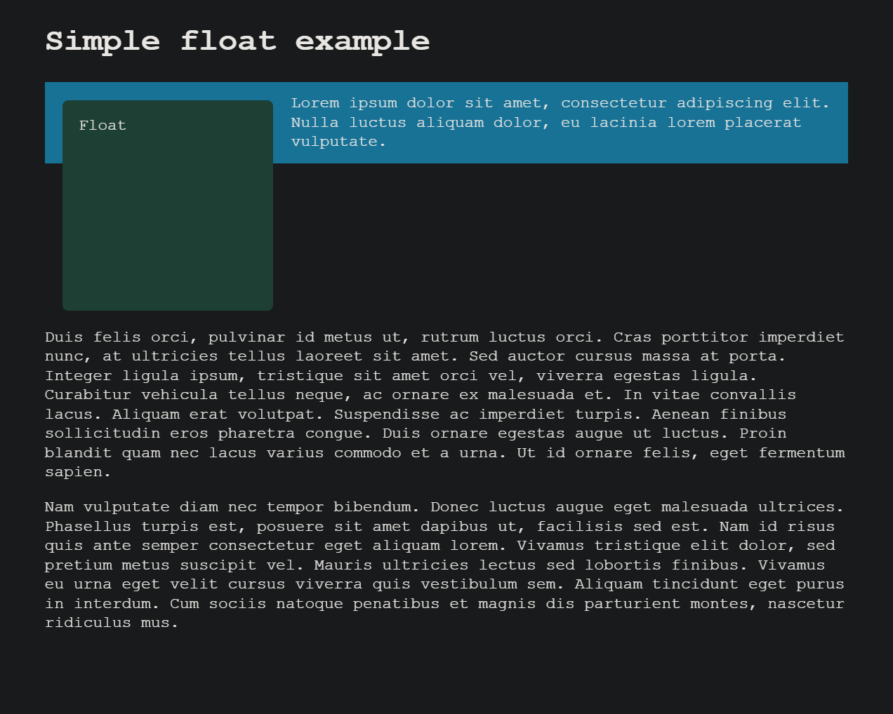
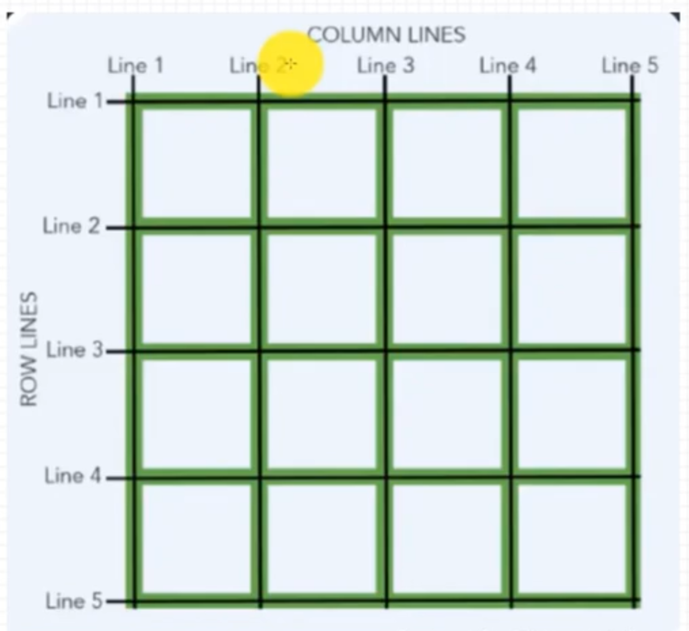

## 常用布局方式

- 正常布局流：不对页面进行任何布局控制时，浏览器默认的 HTML 布局方式
- 盒模型
- float 浮动
- position 定位
- flex 弹性盒
- grid 网格
- multicol 多列布局
- table 表格

每种技术都有它们的用途，各有优缺点，相互辅助。通过理解各个布局方法的设计理念，你能够找到构建你想要的网页需要的布局方案

### 元素垂直居中

> text-align 只对文本或 display：inline 或者 inline-block 的子元素有效，vertical-align 只能定义在 display：为 inline 或者 inline-block 的元素（table-cell 也算是 inline-block）。对于 display：inline 元素，设置 padding 和 margin 的上下无效，左右有效，border 都有效。

```html
<div class="nav">
  <div class="zhangjinxi2"><span>222222222222222</span></div>
</div>
```

1. 容器 display 为 inline

这种一般都是对文字的居中对齐，水平方向上 text-aligin：center，垂直方向上，vertical-align:middle 或者使 line-height === height,

2. 容器和子元素都为 block 或者 inline-block

- 父子宽高都固定

  - 利用盒模型的 margin 和 padding 实现，
  - 利用 position 定位的 left 和 top 实现。

- 父子至少有一个不固定

  - 利用 flex，这个是最简单的方式了
    ```less
    .nav {
      display: flex;
      justify-content: center;
      align-items: center;
    }
    ```
  - 利用 grid 布局
    ```less
    .nav {
      display: grid;
      .zhangjinxi2 {
        justify-self: center;
        align-self: center;
      }
    }
    ```
  - 利用 position+transform 定位
    ```less
    .nav {
      position: relative;
      .zhangjinxi2 {
        position: absolute;
        top: 50%;
        left: 50%;
        transform: translate(-50%, -50%);
      }
    }
    ```
  - 利用 position+margin:auto 定位

    ```less
    .nav {
      position: relative;
      .zhangjinxi2 {
        position: absolute;
        top: 0;
        left: 0;
        right: 0;
        bottom: 0;
        margin: auto;
      }
    }
    ```

    

### 三列布局

```html
<div class="nav">
  <div class="zhangjinxi">111</div>
  <div class="zhangjinxi2">222</div>
  <div class="zhangjinxi3">33333</div>
</div>
```

1.  圣杯布局 利用 float + margin-left 实现

```less
.nav {
  .zhangjinxi {
    width: 100%;
    float: left;
    box-sizing: border-box;
    padding: 0 200px;
  }
  .zhangjinxi2 {
    width: 200px;
    float: left;
    margin-left: -100%;
  }
  .zhangjinxi3 {
    width: 200px;
    float: left;
    margin-left: -200px;
  }
}
```

2. 双飞翼布局 利用 position 实现

```less
.nav {
  position: relative;
  .zhangjinxi {
    width: 100%;
    box-sizing: border-box;
    padding: 0 200px;
  }
  .zhangjinxi2 {
    position: absolute;
    width: 200px;
    top: 0;
  }
  .zhangjinxi3 {
    position: absolute;
    width: 200px;
    top: 0;
    right: 0;
  }
}
```

3. flex 布局

> 两端设置 flex-basis 为固定宽度，中间元素设置 flex-grow:1 占满剩余宽度

```less
.nav {
  display: flex;
  .zhangjinxi,
  .zhangjinxi3 {
    flex-basis: 200px;
  }
  .zhangjinxi2 {
    flex-grow: 1;
  }
}
```

4. grid 布局 最简单

> fr:剩余空间占据的份数

```less
.nav {
  display: grid;
  grid-template-columns: 200px 1fr 200px;
}
```


## 响应式设计概念

响应式网页设计的概念（responsive web design，RWD），RWD 指的是允许 Web 页面适应不同屏幕宽度因素等，进行布局和外观的调整的一系列实践。弹性盒、网格和多栏布局都可以建立可伸缩的响应式组件，使用更方便。

### 媒体查询

媒体查询（Media queries）非常实用，尤其是当你想要根据设备的大致类型（如打印设备与带屏幕的设备）或者特定的特征和设备参数（例如屏幕分辨率和浏览器视窗宽度）来修改网站或应用程序时。

媒体查询，以及样式改变时的点，被叫做断点（breakpoints）

**_移动优先设计_**：使用媒体查询时的一种通用方式是，为窄屏设备（例如移动设备）创建一个简单的单栏布局，然后检查是否是大些的屏幕，在有足够容纳的屏幕宽度的时候，开始采用一种多栏的布局。

```css
/**@media也可以判断屏幕分辨率等其他条件 */
/**在屏幕尺寸大于800px时，应用此样式。800px称为为断点 */
@media screen and (min-width: 800px) {
  .container {
    margin: 1em 2em;
  }
}
```

### 灵活网格

flex formatting context 灵活格式化上下文。 flex 弹性盒子、grid 容器、mulcols 多列布局容器：将其子元素布局为灵活项，子元素则为块级格式化上下文。

1. 早年间：使用 float + 百分比数字实现
2. 现代布局技术
   1. multicol 多列布局
   ```css
   /**三列布局，占满整个屏幕 */
   column-count: 3;
   /**列宽最小10em，尽可能占用更多的列，不足一列的，平均分配剩余空间 */
   column-width: 10em;
   ```
   2. flex 弹性盒布局
      1. 初始的行为是，弹性的物件将参照容器里面的空间的大小，缩小和分布物件之间的空间
      2. 通过 flex-grow、flex-shrink 指定如何分配剩余空间。
   3. grid 网格布局：fr 单位许可了跨网格轨道可用空间的分布
      ```css
      .container {
        display: grid;
        grid-template-columns: 1fr 1fr 1fr;
      }
      ```

### 响应式图像

> 为什么我们不用 CSS 或 JavaScript 来实现？

当浏览器开始加载页面时，它会在主解析器开始加载和解释页面的 CSS 和 JavaScript 之前，预先下载（预加载）所有图像。这种机制通常有助于减少页面加载时间，但对于响应式图像并不有用，因此需要实现类似 srcset 的解决方案。例如，你不能加载 `` 元素，然后使用 JavaScript 检测视口宽度，再然后根据需要动态更改源图像为较小的图像。这时，原始图像已经被加载，如果仍加载小图像，则在响应式图像方面甚至更糟糕。

实现方式：

1. 配置图像的 max-width 属性

```css
img {
  /**设置宽度最大为100%，不会超过父容器的大小 */
  max-width: 100%;
}
```

手机和桌面屏幕大小不同，应用同样的图片，对移动端来说浪费带宽，尺寸也不匹配。

2. 使用了`<picture>`元素和`` srcset 和 sizes 特性

```html

```

- **_srcset_**: 图片集合以及每个图片的大小，多个图片用逗号隔开，每个设置要写：
  - 文件 url
  - 一个空格
  - 图片的固有宽度。这里以 w 为单位，而非 px。图片的固有尺寸是它的真实大小
- **_sizes_**： 媒体条件（例如屏幕宽度）并且指明当某些媒体条件为真时，什么样的图片尺寸是最佳选择
  - 一个媒体条件，例如：(max-width: 600px)
  - 一个空格
  - 当媒体条件为真时，图像将填充的插槽的宽度（480px）

有了这些属性后，浏览器就会：

1. 查看屏幕尺寸、像素密度、缩放级别、屏幕方向和网络速度。
2. 找出 sizes 列表中第一个为真的媒体条件。
3. 查看该媒体条件对一个的插槽大小。
4. 加载 srcset 列表中与插槽大小相同的图片，如果没有，则加载第一个大于所选插槽大小的图片。

这样就实现了，不同尺寸的屏幕，应用不同的图片

3. picture 元素

> 就像 `<video>` 和 `<audio>` 一样，`<picture>` 元素是包含多个 `<source>` 元素的容器，它提供了多个不同的资源供浏览器选择，然后还有至关重要的 `` 元素。

```html
<picture>
  <source media="(max-width: 799px)" srcset="elva-480w-close-portrait.jpg" />
  <source media="(min-width: 800px)" srcset="elva-800w.jpg" />
  
</picture>
```

必须紧贴着 `</picture>` 前面提供一个`` 元素以及它的 src 和 alt 属性，否则不会有图片显示。当媒体条件都不为真的时候它会显示默认图片；如果浏览器不支持` <picture>` 元素，它可以作为后备方案.借助这样的代码我们能够在宽屏和窄屏上都能显示合适的图片

### 图片适配分辨率

> 使用 srcset 结合 x 描述符（一种更简单的语法），而不用 sizes，来让浏览器选择合适分辨率的图片。

```html


<picture>
  <source
    srcset="
      elva-fairy-320w.jpg,
      elva-fairy-480w.jpg 1.5x,
      elva-fairy-640w.jpg 2x
    " />
  
</picture>
```

### 响应式排版

> 只用 viewport (vw)单位设定文本,文本总是随着视口的大小改变大小，用户失去了放缩任何使用 vw 单位的文本的能力。

解决方法:使用了 calc()，将 vw 单位加到了使用固定大小（例如 em 或者 rem）的值组，那么文本仍然是可放缩的。基本来说，是 vw 加在了放缩后的值上。

```css
h1 {
  font-size: calc(1.5rem + 3vw);
}
```

### 视口元标签

```html
<meta name="viewport" content="width=device-width,initial-scale=1" />
```

和视口元标签一起，可以使用的属性

1. width 设定视口的宽度，也可以设置为特殊值 device-width，即 100vw
2. height 设定视口的高度，也可以设置为特殊值 device-height，即 100vh，
3. initial-scale：页面的初始缩放倍数。
4. minimum-scale：最小缩放级别
5. maximum-scale：最大缩放级别
6. user-scalable：是否可缩放。有效值为 0、1、yes 或 no。设置为 0，将阻止缩放
7. interactive-widget 指定交互式 UI 组件（如虚拟键盘）对页面视口的影响。
   1. resizes-visual 可视视口会被交互式组件调整大小。默认值
   2. resizes-content 视口会被交互式组件调整大小。
   3. overlays-content 视口和可视视口都不会被交互式组件调整大小。

应该避免使用 minimum-scale、maximum-scale，尤其是将 user-scalable 设为 no。用户应该有权力尽可能大或小地进行缩放，阻止这种做法会引起访问性问题。

## float 浮动

浮动元素会被移出正常文档流，块级元素会移动位置，占据浮动元素的空间，即上下重叠。但行内元素不会有重叠现象，会避开浮动元素，这是文字环绕的原因。

> 给块级元素设置 clear：both；后，就不会占据浮动元素原来的空间与浮动元素上下重叠了，也就不会改变页面布局，即清除浮动。



**float 浮动带来的问题**

1. 浮动后，其他块级元素会移动位置，来占据浮动元素原来的空间，导致布局改变
2. 浮动后，不在占据空间，可能导致父容器高度塌陷

**清除浮动的方式**

- 子元素后添加一个新的元素，例如 div 元素，添加样式 clear：both；
- 使用伪元素，添加样式 clear：both；

```css
.parent::after {
  display: block;
  content: "必须要有content属性";
  height: 0;
  clear: both;
}
```

- 触发父元素成为 BFC 块级格式化上下文

## position 定位

1. static 静态定位，默认。将元素放入它在文档布局流中的正常位置
2. relative 相对定位。与静态定位非常相似，占据在正常的文档流中，但可以设置 top、left、right、bottom 来移动位置，相对于原来的位置移动。
3. absolute 绝对定位。完全脱离文档流，绝对定位元素相对于最近的非 static 祖先元素定位。当这样的祖先元素不存在时，则相对于 ICB（initial containing block，初始包含块，有着和浏览器视口一样的尺寸，并且`<html>`元素也被包含在这个容器里面）。简单来说，算是根据浏览器视口来定位。
4. fixed 固定定位。固定元素则是相对于浏览器视口
5. sticky 粘性定位。粘性定位可以被认为是相对定位 relative 和固定定位 fixed 的混合。元素在跨越特定阈值前为相对定位，之后为固定定位。

设置 position 属性后，以下元素才会生效：

- left
- right
- top
- bottom
- z-index

## BFC 块级格式化上下文

Block Formatting Context，是页面一个隔离的容器，是一块独立的渲染区域，与外界互不影响。内部的元素从上到下排列，上下相邻的子元素会发生 margin 重叠。BFC 的作用：

- 可以用来清除浮动（内部元素会参与高度计算）
- 防止被浮动元素覆盖（不会与浮动元素区域重叠）
- 防止外边距 margin 重叠（不同 BFC 不会发生 margin 重叠）。
  **触发 BFC 的条件：**

- float 不为 none
- position 为 absolute | fixed
- overflow 不为 visible
- display 属性为 inline-block，table-\*，flow-root
- contain 属性为 layout、content 或者 strict
- flex items 或者 grid items
- colmun-span 属性为 all
- 设置 contain 属性，进行内容限制的容器
- html 根元素

> flow-root 关键字的意义是，创建的内容本质上类似于一个新的根元素（如 `<html>`所做），并确定这个新的上下文如何创建及其流布局如何实现。

## 行内格式化上下文

inline formatting contexts，存在于其他格式上下文中，可以将其视为段落的上下文。段落创建了一个内联格式上下文，其中在文本中使用诸如 `<strong>、<a>`或 `<span>` 元素等内容。

盒模型不完全适用于行内格式化上下文。水平 margin 和 padding 适用，垂直 margin 和 padding 不适用。

## flex 布局

> 设置容器内子元素在主轴和交叉轴上如何排列
> 

### flex 容器属性

> 设置 flex 属性后，float,clear,vertical-align 属性将失效

- display:flex;
- flex-direction ：row | row-reverse | column | column-reverse ; 主轴方向
- flex-wrap : wrap | nowrap | wrap-reserve ; 换行方式
- flex-flow : flex-direction || flex-wrap ; 简写形式
- justify-content : flex-start | flex-end | center | space-between | space-around ; 主轴排列方式
- align-items : flex-start | flex-end | center | baseline | stretch ; 交叉轴排列方式
- align-content ：flex-start |flex-end | center | space-between | space-around | stretch ; 多个主轴线，在交叉轴排列方式

### flex item 属性

> 当某个 item 不按照默认规则显示时，需要单独对 item 配置

- order : n ; 整数值，item 的排序索引
- flex-basis : 像素 | 百分比 | auto ; 配置 item 应该占据的主轴空间，默认为 width
- flex-grow : n ; item 占据剩余空间的份数，默认 0，不占据
- flex-shrink : n ;item 缩放份数，默认 1，按比例缩放
- flex : flex-grow || flex-shrink || flex-basis ; 简写形式，默认 0 1 auto
- align-self : auto | flex-start | flex-end | center | baseline | stretch ; item 在交叉轴上排列方式

## 多列布局

创建类似报纸的排版方式。创建的列无法单独的设定样式。不存在让单独某一列比其他列更大的方法，同样无法为某一特定的列设置独特的背景色、文本颜色。

通过给一个元素添加 column-count 或 column-width，该元素变成了多列容器，或简称为 multicol 容器。

- column-count 列数：由浏览器计算出每一列分配多少空间。
- column-width 列宽：根据指定的宽度尽可能多的创建列；任何剩余的空间之后会被现有的列平分。
- columns: 2 200px; column-count 和 column-width 的简写形式
- column-gap 改变列间间隙。接受任何长度单位
- column-rule 在列间加入一条分割线,与 border 属性类似，是简写形式，接收同样的参数

  - column-rule-width
  - column-rule-style
  - column-rule-color
  - `column-rule: 4px dotted rgb(79, 185, 227);`
  - 这条分割线本身并不占用宽度。它置于用 column-gap 创建的间隙内。如果需要更多空间，你需要增加 column-gap 的值。

- column-span none|all;设置为 all 时，可以让一个元素跨越所有的列。
- column-fill 控制元素内容分成列时的平衡方式。
  - auto 按顺序填充列。内容只占用其所需的空间，可能导致某些列保持空白。
  - balance 内容平均分配到各列,在片段式上下文中，如 CSS 分页媒体，只有最后一个片段是平衡的。
  - balance-all 内容平均分配到各列。在片段式上下文中，如 CSS 分页媒体，所有片段都是平衡的。

**控制内容拆分和折断**
break-inside 属性设给需要控制的子元素。来控制 multicol 和多页媒体中的内容拆分、折断。设置生成的盒子内部的页面、栏或区域应有的中断行为。如果没有生成盒子，则该属性将被忽略。

```css
/* 关键字值 */

/**允许（但不强制）在主框中插入任何中断（页、栏或区域）。 */
break-inside: auto;
/**避免在主框中插入任何中断（页、栏或区域） */
break-inside: avoid;
/**避免主框中的任何页中断。 */
break-inside: avoid-page;
/**避免主框中的任何栏中断。 */
break-inside: avoid-column;
/**避免主框中的任何区域中断。 */
break-inside: avoid-region;
```

每一个可能的中断点（换句话说，元素的边界）受三个属性的影响。前一个元素 break-after 的值、后一个元素 break-before 的值，以及包含元素 break-inside 的值。

- break-before 控制元素前换行
- break-inside 控制元素内换行
- break-after 控制元素后换行

会应用以下规则来确定是否必须产生中断点：

1. 如果这三个中断属性的值有一个是强制中断值（always、left、right、page、column 或 region），则该属性具有优先权。如果其中有多个这样的中断，则使用流中最后出现的元素的值。因此，break-before 值优先于 break-after 值，而后者又优先于 break-inside 值。
2. 如果三个相关值中的任何一个是避免中断值（avoid、avoid-page、avoid-region 或 avoid-column），则不在该点应用此类中断。

## grid 网格布局

网格是由一系列水平及垂直的线构成的一种布局模式。一个网格通常具有许多的列（column）与行（row），以及行与行、列与列之间的间隙，这个间隙一般被称为沟槽（gutter）。


> 网格线



### grid 常用属性和方法

> fr fraction 片段。是一个自适应单位，用于分配剩余空间，会根据各自数字按比例分配
> minmax(100px,200px) 函数来创建范围尺寸,可以接受任何长度值，也接受 auto 值。

> repeat(3,100px) 创建重复的网格轨道，重复次数、轨道尺寸。[col1-start] 100px [col1-end] 5px [col2-start] 100px,用来自定义网格线名称，用[]包裹。

> auto-fill 自动填充。应用 repeat 函数中，repeat(auto-fill,minmax(200px,1fr))，代表需要重复的次数会自动填充，尽可能占满屏幕。用来做响应式布局很方便

> auto 自动。允许网格轨道基于内容的尺寸拉伸或挤压。一行代码轻松实现两端固定中间自适应布局 grid-template-columns:100px auto 100px;

> min-content 表示内容的最小固有尺寸。对于文本内容而言，这意味着内容会利用所有软换行的机会，变得尽可能的小。

> max-content 表示内容的最大固有尺寸。对于文本内容，这意味着即使内容会导致溢出，它也不会换行

> fit-content 相当于 fit-content(stretch)，盒子会使用可用空间，介于 min-content 和 max-content 之间，根据内容有浏览器自动调整可用尺寸。

### grid 容器

> 当设置了网格布局后，column,float,clear,vertical-align 将失效

> `以下设置的都是单元格的大小，并非item的大小，切记切记。当item设置了大小，并且小于单元格时，可以设置item在单元格内水平和垂直方向的排列方式，justify-items\align-items`

- display : grid(块级 block) | line-grid(行内块 inline-block) | subgrid(继承父元素的行和列的大小) ;

- grid-template-columns : 40px 50px;列数和每列宽度。不超过 grid item 的个数
- grid-template-rows ：45px 50px; 行数和每行高度。超过显示的列数，超过的部分将失效；
- grid-template-areas : '单元格 1 单元格 2 单元格 3'; 该属性用来定义网格区域，和单元格相对应，指定各个单元格的名称。使用规则如下：

  - 需要填满网格的每个格子
  - 对于某个横跨多个格子的元素，重复写上那个元素 grid-area 属性定义的区域名字
  - 所有名字只能出现在一个连续的区域，不能在不同的位置出现
  - 一个连续的区域必须是一个矩形
  - 使用.符号，让一个格子留空

- grid-row-gap:20px; 行间距
- grid-column-gap:30px; 列间距
- grid-gap :grid-row-gap grid-column-gap ;两个属性的缩写
- gap: 20px; 等于 grid-gap ，不使用前缀为了方便不同的布局方法中都能起作用。

- grid-auto-flow:row|column dense; 调整排列方向，默认 row：横向排列。追加 dense 关键字：没有缺口的紧凑布局。

- justify-content:start|center|end|stretch|space-around|space-between|space-evenly;网格在容器水平方向上的位置
- align-content:start|center|end|stretch|space-around|space-between|space-evenly;网格在容器垂直方向上的位置
- place-content:justify-conent align-content;简写

- justify-items:start|center|end|stretch;`item` 在单元格内的水平对齐方式
- align-items：start|center|end|stretch;`item` 在单元格内的垂直对齐方式
- place-items:justify-items align-items;简写形式

```css
/* 值为关键词 */
grid-template: none;

/* 为 grid-template-rows / grid-template-columns 简写属性 */
grid-template: 100px 1fr / 50px 1fr;
grid-template: auto 1fr / auto 1fr auto;
grid-template: [linename] 100px / [columnname1] 30% [columnname2] 70%;
grid-template: fit-content(100px) / fit-content(40%);

/* 为 grid-template-areas grid-template-rows / grid-template-columns */
grid-template:
  "a a a"
  "b b b";

grid-template:
  "a a a" 20%
  "b b b" auto;
```

### grid item

> 下列数字都是指的网格线，并不是单元格，切记切记。都是用于合并单元格

- grid-row-start: 2;
- grid-row-end: 4|span 2; 结束网格线序号为 4|或者跨越两个尺度。
- grid-column-start: 1;
- grid-column-end: 3;
- grid-row：1/3; grid-row-start/grid-row-end
- grid-column：1/3 ; 是 grid-column-start/grid-column-end 的简写。
- grid-area : 2/2/3/4 | 单元格名称; grid-row-start/grid-column-start/grid-row-end/grid-column-end。也可以指定单元格名称，把该元素放到单元格名称对应的位置。需要 grid-template-areas 定义好每个单元格的名称

- order:3; 排序

### 隐式网格

> 显式网格是我们用 grid-template-columns 或 grid-template-rows 属性创建的。而隐式网格则是当有内容被放到网格外时才会生成的

隐式网格就是为了放显式网格放不下的元素，浏览器根据已经定义的显式网格自动生成的网格部分。隐式网格中生成的行/列大小是参数默认是 auto ，大小会根据放入的内容自动调整。手动设定隐式网格轨道的大小:

- grid-auto-rows
- grid-auto-columns

```css
.container {
  display: grid;
  /* 显示网格 */
  grid-template-columns: repeat(3, 1fr);

  /** 设置隐式网格的宽度minmax(100px, auto);*/
  grid-auto-rows: minmax(100px, auto);

  /**按轨道列表设置。 */
  grid-auto-rows: 100px 200px;
  grid-auto-columns: 300px 100px;

  grid-gap: 20px;
}
```

### 命名网格线

通过网格线序号来定义 area 不够直观，可以通过给网格线起名。在选择名字时，一个区可以把区域周围的线都用 -start 和 -end 作为后缀，容易理解。如下：

```cs
.wrapper {
  display: grid;
  grid-template-columns: [main-start] 1fr [content-start] 1fr [content-end] 1fr [main-end];
  grid-template-rows: [main-start] 100px [content-start] 100px [content-end] 100px [main-end];
  /** 使用 repeat() 定义多个同名网格线*/
  grid-template-columns: repeat(12, [col-start] 1fr);
}
.thing {
  grid-area: content;
  /**通过网格线名称，定义网格区域area */
  grid-column: col-start / col-start 5;
  /**此处也可以使用 span 关键字。比如下一个项目的位置从名为 col-start 的第 7 条线开始，跨越 3 条线。 */
  grid-column: col-start 7 / span 3;

  // repeat 语法不仅可用于重复的单一轨道尺寸，也可以用于轨道列表
  /**在一个名为 col1-start 的 1fr 窄轨道之后，跟着是一个名为 col2-start 的 3fr 宽轨道。 */
  grid-template-columns: repeat(4, [col1-start] 1fr [col2-start] 3fr);
  /**创建了四条 1fr 的轨道，每条轨道都有开始名和结束名。 */
  grid-template-columns: repeat(4, [col-start] 1fr [col-end]);
}
```
