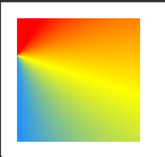
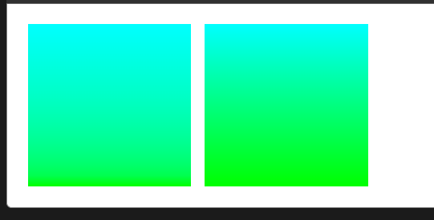

## CSS 变形

CSS 提供的形变功能不仅可以平移元素，还能做很多其他的事情，比如旋转、缩放、翻转等，让页面的动画与交互看起来更加自然。

- 变形元素：进行 transform3D 变形的元素，主要是 transform、transform-origin、backface-visibility 设置
- 被透视元素：被观察者观察的元素，一般是变形元素的父级元素，主要是 perspective、perspective-origin 设置

涉及到的属性主要是：

- transform ：变形配置
- transform-origin：变形原点，默认中心点就是元素的正中心，通过该属性改变元素在 XYZ 轴的中心点
- transform-style：变形风格，允许变形元素及其子元素在 3D 空间中呈现。有两个值 flat 默认是表示 2D 平面，perspective-3d 表示 3D 空间。当设置了 overflow 非 visible 或 clip 非 auto 时，transform-style：perspective-3d 失效。
- perspective：透视距离，指观察者沿着平行于 Z 轴的视线到屏幕之间的距离，简称视距。值远大，表示距离越远，看来就越小。设置透视 perspective 属性的元素就是透视元素。设置在变形元素的父级元素上
- perspective-origin：透视原点，观察者的位置。两个值，分别是 X 轴距离原点的偏移量和 Y 轴原点的偏移量，可以用关键字 left、right 和 center 表示，也可以 ongoing 数值和百分比表示，当用单个关键字表示时，另一个表示默认 center。这个属性必须定义在设置 perspective 的元素上,基点默认值是 50% 50%即 center
- backface-visibility：背面是否可见,visible 和 hidden。如果一个元素覆盖在另一个元素上，不仅仅正面覆盖，背面也是覆盖的

## 2D 变形

1. translate 平移 : transform: translate(0, 100px);
   1. translate(x,y)
   2. translateX(x)
   3. translateY(y)
2. scale 缩放
   1. scale():第一个参数对应 X 轴，第二个参数对应 Y 轴。如果第二个参数未提供，则默认取第一个参数的值.scale 还能设负数，负数会先将元素反转再缩放
   2. scaleX():指定对象 X 轴的（水平方向）缩放
   3. scaleY():指定对象 Y 轴的（垂直方向）缩放
3. rotate 旋转,旋转函数绕某个轴或者 3D 空间某个向量旋转。rotate X，rotate Y，rotateZ，rotate 都只接收一个值。
   1. rotateX
   2. rotateY
   3. rotateZ
   4. rotate = rotateY
4. skew 倾斜。第一个参数对应 X 轴，第二个参数对应 Y 轴。如果第二个参数未提供，则默认值为 0
   1. skew
   2. skewX
   3. skewY
5. matrix 变换矩阵

## 3D 变形

在 2D 平面基础上多出一个 z 轴，称之为三维立体。

- rotateX()
- rotateY()
- rotateZ()
- rotate3d（X，Y，Z，Ndeg）:变形元素沿着（0,0,0）和（X,Y,Z）这两个点构成的直线为轴，进行旋转 Ndeg。

- perspective（）：透视函数 ，应用于变形元素本身，参数只能是长度值，并且只能是正数。例如 perspective（100px）
- translate3d(tx,ty,tz) 其中 tz 的 Z 轴长度只能为 px 值，不能为%百分比
- translateZ
- scale3d(x,y,z)
- scaleZ() 仅当元素有深度时，这两个函数才有效果
- matrix3d() 3D 变形中和 2D 变形一样也有一个 3D 矩阵功能函数 matrix3d

## 线性渐变

```css
linear-gradient(direction,color1 position1,color2 position2,....)
```

**direction:渐变方向**。两种表示方式

1. 关键字描述：inear-gradient(to bottom,red,blue); 这是默认方向，从上到下
   1. top
   2. bottom
   3. left
   4. right
2. 角度表示 : linear-gradient（80deg，yellow 50%，black 50%，blue）：中间有明显过渡线的效果
   - deg:角度
   - red：弧度
   - trun:圈数
   - grad:百分度，400grad 表示 360deg

**color:渐变颜色**

1.  颜色可以用任何模式表示，位置可以用百分比或者数数值表示
2.  如果渐变只有两种颜色，且第一个颜色的位置为 n%，第二个颜色的位置为 m%，则浏览器会 0%~n%的范围设置为第一个颜色，m%~100%设置为后一个颜色，中间才是两个颜色的过渡，如果没有指定位置，会均匀过渡。

**position:渐变位置**

可以省略，浏览器默认把第一个颜色的位置设为 0%，最后一个位置设为 100%

## 重复线性渐变

只有首尾两颜色位置不在 0%和 100%时，才会有重复渐变效果

```css
repeating-linear-gradient(blue 20%， green 50%);
repeating-linear-gradient(transparent, #4d9f0c 40px);

repeating-linear-gradient(0.25turn, transparent, #3f87a6 20px);
/* 从左到右重复五次的渐变，从红色开始，然后变绿，再变回红色 */
repeating-linear-gradient(to right, red 0%, green 10%, red 20%);
```

## 径向渐变

```css
radial-gradient（shape,size,blue 20%，green 50%）；
radial-gradient(farthest-corner at 40px 40px,#f35 0%,#43e 100%);
/* 在容器中心的渐变，从红色开始，变成蓝色，最后变成绿色 */
radial-gradient(circle at center, red 0, blue, green 100%)

radial-gradient(closest-side, #3f87a6, #ebf8e1, #f69d3c);

radial-gradient(ellipse 50% 50px, #e66465, transparent),
radial-gradient(ellipse at bottom, #4d9f0c, transparent);
```

1. position: 控制椭圆的圆心,可以用关键字和数值，百分比以及单个关键字，表示圆心
   1. top
   2. botton
   3. left
   4. right
   5. center
   6. 20px 30px
2. shape:控制形状。
   1. circle：圆形
   2. ellipse：椭圆形
3. size：定义渐变半径的大小
   1. farthest-side:半径从圆心到最远边，默认值
   2. farthest-corner 半径从圆心到最远角
   3. closest-side:半径从圆心到最近边
   4. closest-corner:半径从圆心到最近角
   5. 也可以用两个值分别表示水平直径和垂直直径
   6. 对于圆，尺寸可以用 `<length> `提供，这就是圆的尺寸。
      当位置处于 100%的色标没有占满渐变区域时，浏览器默认会使用最后一个颜色铺满渐变区域。

## 重复径向渐变

```css
repeating-radial-gradient(circle at center, red, yellow 10%, green 15%);

/* 接近容器左上角的ellipse椭圆形渐变，
   由红色开始，改变为绿色，然后再变回红色，
   在中心和右下角之之间重复五次，
   在中心和左上角之间只重复一次 */
repeating-radial-gradient(ellipse farthest-corner at 20% 20%, red 0, green, red 20%);
```

## 锥形渐变

conic-gradient() CSS 函数创建包含颜色围绕中心点旋转（而不是从中心点辐射）产生的渐变的图像。锥形渐变的例子包括了饼图和色轮，但是也可以用于创建棋盘格和其他有趣的效果。

锥形渐变的语法和径向渐变的语法类似，但是色标是围绕渐变弧（圆的圆周）进行的，而不是从渐变中心出现的渐变线上，并且色标是百分比或度数：绝对长度无效。

在径向渐变中，颜色从椭圆中心的位置在各个方向上向外过渡。在锥形渐变中，颜色围绕圆的中心在圆周上旋转过渡，从顶部开始，顺时针进行。类似于径向渐变，你可以设置渐变的中心。类似于线性渐变，你可以改变渐变的角度。

```css
.conic-gradient {
  /**和径向渐变类似，你可以使用关键词、百分比或者绝对长度，以及关键字“at”来设置锥形渐变的中心位置。 */
  background: conic-gradient(at 0% 30%, red 10%, yellow 30%, #1e90ff 50%);

  /**
  默认情况下，你指定的不同色标是围绕着圆均等分布的。你可以在开始时使用“from”关键字以及一个角度或者长度以指定锥形渐变的起始点，然后你可以在后面包括角度或者长度以指定不同的位置。 */
  .conic-gradient {
    background: conic-gradient(from 45deg, red, orange 50%, yellow 85%, green);
  }
}
```

输出图像：



## 控制渐变过程

默认情况下，渐变在两个相邻的色标之间都是均匀推进的，两个色标之间的中点是颜色值的中点。你可以控制两个色标之间的插值，或者过程，方法是添加一个颜色提示位置。在这个例子中，颜色在渐变过程的 20% 而不是 50% 的位置到达黄绿色和青色之间的中点。第二个例子没有提示，因此可以通过对比看出颜色提示的效果。

```css
.colorhint-gradient {
  background: linear-gradient(to top, lime, 20%, cyan);
}
.regular-progression {
  background: linear-gradient(to top, lime, cyan);
}
```

输出结果：


> 渐变可以叠加和堆叠

参考：https://developer.mozilla.org/zh-CN/docs/Web/CSS/CSS_images/Using_CSS_gradients
