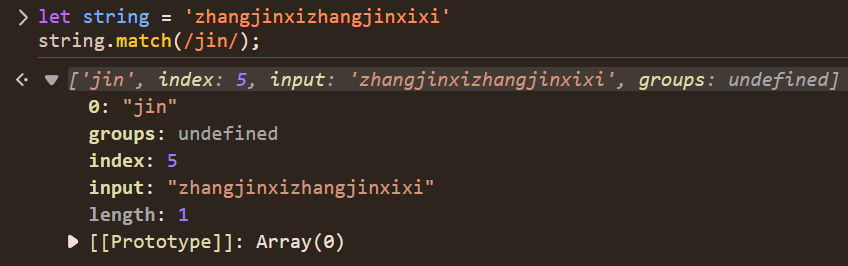
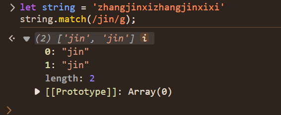

## RegExp 正则表达式

RegExp 用于创建正则表达式对象，该对象用于文本与一个模式匹配

```js
/** 可以使用字面量、构造函数和工厂方法来创建正则表达式
 * @pattern 正则表达式的文本，也可以是另一个 RegExp 对象或文字
 * @flags 添加的标志的字符串
 *  g:全局匹配
 *  i:忽略大小写
 *  m:多行匹配
 *  y:粘性匹配，从lastIndex后开始匹配
 *  s:点号匹配所有字符，也可以匹配新行
 *  d:包含每个捕获组子字符串开始和结束的索引
 *  u:开启Unicode匹配模式
 *  v:u的升级版本
 */

/pattern/flags
new RegExp(pattern[, flags])
RegExp(pattern[, flags])
```

### 实例属性和方法：

- dotAll 是否启用 s 修饰符，匹配任意单个字符
- flags 返回当前正则表达式的所有标志。
- global
- multiline
- ignoreCase
- sticky
- unicode
- hasIndices 是否启用 d 修饰符
- lastIndex 开启 g/y 匹配时，保存上次匹配成功后的位置。
- unicodeSets 是否启用 v 修饰符

```js
const str1 = "foo bar foo";

const regex1 = /foo/dg;
console.log(regex1.hasIndices); // Output: true
console.log(regex1.exec(str1).indices[0]); // Output: Array [0, 3]
console.log(regex1.exec(str1).indices[0]); // Output: Array [8, 11]

const regex2 = /foo/;
console.log(regex2.hasIndices); // Output: false
console.log(regex2.exec(str1).indices); // Output: undefined
```

- test() ：与指定的字符串是否匹配(类似于 String.prototype.search() 方法），差别在于 test 返回一个布尔值，而 search 返回索引（如果找到）或者 -1（如果没找到)。如果正则表达式设置了全局标志，test() 的执行会改变正则表达式 lastIndex 属性。连续的执行 test()方法，后续的执行将会从 lastIndex 处开始匹配字符串，(exec() 同样改变正则本身的 lastIndex 属性值).

```js
const str = "table football";

const regex = new RegExp("foo*");
const globalRegex = new RegExp("foo*", "g");

console.log(regex.test(str));
// Expected output: true

console.log(globalRegex.lastIndex);
// Expected output: 0

console.log(globalRegex.test(str));
// Expected output: true

console.log(globalRegex.lastIndex);
// Expected output: 9

console.log(globalRegex.test(str));
// Expected output: false
```

- exec() ：返回一个结果数组或 null(类似于 String.prototype.match() 方法)。当正则表达式设置 g 标志位时，可以多次执行 exec 方法来查找同一个字符串中的成功匹配。下一次查找将从正则表达式的 lastIndex 属性指定的位置开始。

```js
const regex1 = RegExp("foo*", "g");
const str1 = "table football, foosball";
let array1;

while ((array1 = regex1.exec(str1)) !== null) {
  console.log(`Found ${array1[0]}. Next starts at ${regex1.lastIndex}.`);
  // Expected output: "Found foo. Next starts at 9."
  // Expected output: "Found foo. Next starts at 19."
}
```

- toString()：正则的字符串表示，会合并 flags：

```js
myExp = new RegExp("a+b+c", "gi");
console.log(myExp.toString()); // /a+b+c/gi
```

### 断言

断言（assertion）是一种结构，用于测试字符串在指定位置是否满足特定条件，但不消耗字符。断言不能使用量词。

- 前瞻断言 `(?=variant)` :后面紧跟 variant
- 前瞻否定断言 `(?!variant)`：后面不能是 variant
- 后瞻断言 `(?<=variant)`：前面紧跟 variant
- 后瞻否定断言 `(?<!variant)`：前面不能时 variant
- 输入边界断言`^ $`：正则开始、结束
- 单词边界断言`\b \B`：单词边界、非边界

### 原子

原子（atom）是正则表达式的最基本单位。每个原子消耗字符串中的一个或多个字符，要么匹配失败，要么允许模式继续匹配下一个原子。

- 反向应用`\1 \2`：匹配先前匹配的、用捕获组捕获的子模式。
- 字符类`[...] [^...]`：匹配字符集中的任何字符。启用 v 标志后，还可用于匹配长度有限的字符串
- 字符类转义`\d \D \w \W \s \S`：匹配预定义字符集中的任何字符
- 字符转义`\n \u{...}`：匹配可能无法方便地以字面形式表示的字符。
- 字面字符`a b c`：匹配特定字符。
- 捕获组`(variant)`：匹配子模式并保存匹配信息。
- 具名捕获组`(?<name>...)`：匹配子模式并保存匹配信息。以后可以用自定义名称而不是模式中的索引来识别该组。
- 具名反向引用`\k<name>`：匹配先前匹配的子模式，并使用已命名的捕获组进行捕获。
- 非捕获分组`(?:...)`：匹配子模式，但不记忆匹配信息。
- Unicode 字符类转义`p{...} \P{...}`：匹配 Unicode 属性指定的字符集。启用 v 标志后，也可用于匹配长度有限的字符串。
- 通配符`.`：匹配除行结束符外的任何字符，除非设置了 s 标志。
- 逻辑或`|`：匹配由 | 字符分隔的一组备选字符中的任意一个。
- 量词`? + * {n} {n,} {n,m}`：匹配除行结束符外的任何字符，除非设置了 s 标志。
  > 默认情况下，量词是贪婪的，这意味着它们会尝试尽可能多地匹配，直到达到最大值或无法继续匹配为止。你可以在量词后面添加 ?，使其成为非贪婪量词。

```js
/a*/.exec("aaa"); // ['aaa']；整个输入被消耗
/a*?/.exec("aaa"); // ['']；可以不消耗任何字符，但仍能成功匹配
/^a*?$/.exec("aaa"); // ['aaa']；不可能消耗更少的字符而仍然匹配成功
/a*?$/.exec("aaa"); // ['aaa']；在第一个字符处已经匹配成功，因此该正则表达式不会尝试从第二个字符处开始匹配

/**[ab]+ 首先贪婪地匹配了 "abb"，但 [abc]c 无法匹配模式的其余部分（"c"），因此量词被简化为只匹配 "ab" */
/[ab]+[abc]c/.exec("abbc"); // ['abbc'] 如果无法与模式的其余部分匹配，贪婪量词可能会尝试较少的重复。

const sentence = "A ticket to 大阪 costs ¥2000 👌.";

console.log(sentence.match(/\p{Emoji_Presentation}/gu));
// Expected output: Array ["👌"]

console.log(sentence.match(/\P{Script_Extensions=Latin}+/gu));
// Expected output: Array [" ", " ", " 大阪 ", " ¥2000 👌."]

console.log(sentence.match(/\p{Sc}|\p{P}/gu));
// Expected output: Array ["¥", "."]
```

### 转义序列

在正则表达式中，转义序列是指任何一种由 \ 后跟一个或多个字符组成的语法。根据 \ 后面的字符的不同，它们的作用也大相径庭。下面列出了所有有效的“转义序列”：
|转义序列|含义|
|-------|----|
|\b|单词边界|
|\B|非单词边界|
|\s|空白字符|
|\S|非空白字符|
|\d|0——9 数字|
|\D|非数字|
|\w|字母数字下划线|
|\W|非字母数字下划线|
|\p|代表具有指定 Unicode 属性的字符，{Unicode 属性和/或值}|
|\P|不具有指定 Unicode 类型的 Unicode 字符类转义|
|\c|控制字符的字符转义，后跟从 A 到 Z 或从 a 到 z 的字母|
|\f|分页符|
|\k|具名反向应用，后跟 <量词>|
|\n|换行符|
|\r|回车符|
|\t|水平制表符|
|\v|垂直制表符|
|\x|后跟 2 个十六进制数字，表示具有给定值的字符的字符转义|
|\q|仅在 v 模式字符类中有效；表示要按字面匹配的字符串，后跟{一个字符串}|

## string 的正则方法

本质上，会把参数解析为正则对象，然后调用正则的对应方法。例如 String 的 match(value)方法。会把 value 包装成正则对象，然后调用正则对象的对应属性：`Reg[Symbol.match](string)`

### match()

> 匹配失败时返回 null

```js
let string = "zhangjinxi";
string.match(String | Reg);
```

> 当 reg 没有 g 修饰符时，只匹配第一个匹配项以及其捕获分组，返回[match,index,input]，match 匹配项和捕获分组，index 匹配项的索引，input 原字符串，group 捕获分组；index 和 input 不计入数组长度，如下：
> 

> 有 g 修饰符时，只有 match，没有 input 和 index，捕获组会被忽略，如下：
> 

### matchAll()

返回一个迭代器，该迭代器包含了检索字符串与正则表达式进行匹配的所有结果（包括捕获组）。如果没有 matchAll() 方法，仍然可以使用带有 g 标志的正则表达式调用 regexp.exec() 来在循环中获取所有匹配结果：

```js
const regexp = /t(e)(st(\d?))/g;
const str = "test1test2";
// matchAll
console.log([...str.matchAll(regexp)]);
[
  ["test1", "e", "st1", "1"],
  ["test2", "e", "st2", "2"],
];
// match
console.log([...str.match(regexp)]);
["test1", "test2"];
// match 不带g修饰符
console.log([...str.match(regexp)]);
["test1", "e", "st1", "1"];
```

> 当 reg 没有 g 修饰符时，只匹配第一个匹配项，返回[match,index,input]，match 匹配项，index 匹配项的索引，input 原字符串，group 捕获分组；index 和 input 不计入数组长度，如下：
> 

> 有 g 修饰符时，只有 match，没有 input 和 index，如下：
> 

### search()

> 忽视 g 修饰符，返回结果和 string.indexOf()方法一样

```js
let string = "zhangjinxi";
string.search(string | reg);
```

### split()

> 字符串分割成数组，size 为保留的数组的长度

```js
let string = "zhangjinxi";
string.split(string | reg, size);
```

### replace()

> Reg 不添加 g，默认匹配第一个。

```js
// 函数的用法，前面的参数时匹配到的分组，后面两个分别是匹配项在字符串的位置和原字符串，返回要替换成的字符串。
string.replace(string|reg,string|function(match1,match2...,position,originString));
```

如下图：


> 下面是两个小技巧

- 日期格式化

> $n代表匹配到的第n个分组 $&最近一次匹配项，$`匹配项之前的文本,$'匹配项之后的文本


- 找出连续重复最多的字符和个数

```js
let maxLength = 0;
let maxValue = "";
"aabbbcccc".replace(/(\w)\1+/g, function (match, pos, origin) {
  if (match.length > maxLength) {
    maxLength = match.length;
    maxValue = match;
  }
});
console.log(maxLength, maxValue); // 4 'c'
```

如下图：


