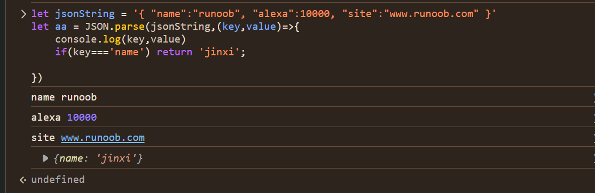

## JSON 简介

- JSON: JavaScript Object Notation(JavaScript 对象表示法)
- JSON 是存储和交换文本信息的语法，类似 XML。
- JSON 比 XML 更小、更快，更易解析。
- JSON 易于人阅读和编写。
- C、Python、C++、Java、PHP、Go 等编程语言都支持 JSON。

## JSON.parse()

将 JSON 字符串数据转换为 JavaScript 对象。

```js
let jsonString = '{ "name":"runoob", "alexa":10000, "site":"www.runoob.com" }';
/**
 * @jsonString :要转成对象的json字串
 * @callback : 选填，可以对键值对进行操作转换和过滤操作，当callback返回undefind时，会过滤这个字段。
 */
JSON.parse(jsonString, callback(key, value));
```

运行结果如图：



### JSON.stringify()

将 JavaScript 对象转换为字符串。不过 JSON.stringify 存在一些问题：

- 转换值如果有 toJSON() 方法，那么由 toJson() 定义什么值将被序列化
- 非数组对象的属性不能保证以特定的顺序出现在序列化后的字符串中
- 布尔值、数字、字符串的包装对象在序列化过程中会自动转换成对应的原始值
- undefined、任意的函数以及 symbol 值，在序列化过程中会被忽略（出现在非数组对象的属性值中时）或者被转换成 null（出现在数组中时）;函数、undefined 被单独转换时，会返回 undefined，如 JSON.stringify(function(){}) or JSON.stringify(undefined)
- 所有以 symbol 为属性键的属性都会被完全忽略掉，即便 replacer 参数中强制指定包含了它们
- Date 日期调用了 toJSON() 将其转换为了 string 字符串（同 Date.toISOString()），因此会被当做字符串处理
- NaN 和 Infinity 格式的数值及 null 都会被当做 null
- 其他类型的对象，包括 Map/Set/WeakMap/WeakSet，仅会序列化可枚举的属性

```js
let object = { name: "runoob", alexa: 10000, site: "www.runoob.com" };
/**
1. object ：将要转成为json字符串的对象
2. replacer ：需要转为JSON的key组成的数组，可以为输出的值做过滤和排序
3. callback ：返回值会替换原来的value值，如果返回undefined，输出结果会过滤掉该项
4. space 缩进空格数(最多10个)。也可以使用非数字，如：\t --等代替空格。 */
JSON.stringify(object, replacer | callback(key, value), space);
```


## JSON.rowJSON(jsonText)

将 JSON 字符串转换为 raw JSON

```js
console.log(JSON.rawJSON('"hello world"'));

{
  rawJSON: '"hello world"';
}
```

## JSON.isRowJSON(obj)

判断是否 JSON.rawJSON()返回的对象

```js
JSON.isRawJSON(JSON.rawJSON('"hello world"')); // true
```

## 保存 JSON 中的函数

```js
const stringify = obj => {
  try {
    // 函数转成字符串，并添加标志位FUNCTION_FLAG
    return JSON.stringify(obj, (k, v) => {
      if (typeof v === "function") {
        return `FUNCTION_FLAG ${v}`;
      } else {
        return v;
      }
    });
  } catch (error) {
    console.log(error);
    return "出错了";
  }
};

const parse = jsonStr => {
  try {
    // 函数字符串去除标志位，并转成函数
    return JSON.parse(jsonStr, (key, value) => {
      if (value && typeof value === "string") {
        return value.indexOf("FUNCTION_FLAG") > -1 ? new Function(`return ${value.replace("FUNCTION_FLAG", "")}`)() : value;
      }
      return value;
    });
  } catch (error) {
    console.log(error);
    return "出错了";
  }
};

// 测试代码
let obj = {
  arr: [1, 2, "11", "22"],
  fn: function filterNumber() {
    return this.arr.filter(item => {
      return typeof item === "number";
    });
  },
};

let str = stringify(obj);
let result = parse(str);
console.log(result.fn()); // [1,2]
```
