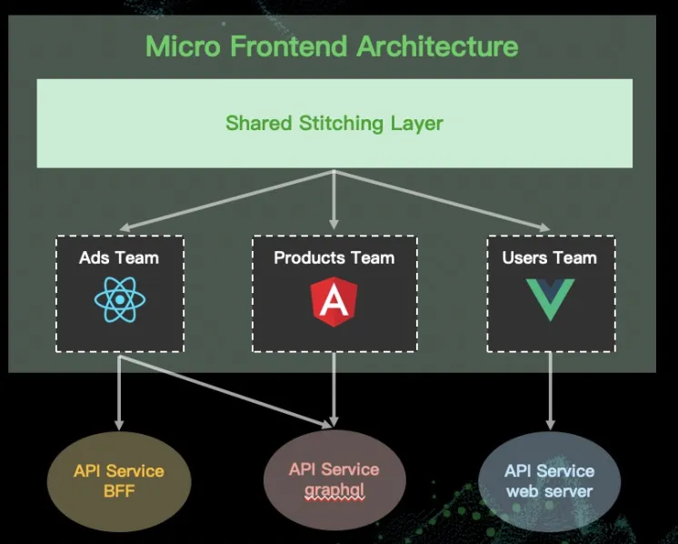

## Vitepress 简介

🎉 💯 VitePress 是一个静态站点生成器 (SSG)，专为构建快速、以内容为中心的站点而设计。简而言之，VitePress 获取用 Markdown 编写的内容，对其应用主题，并生成可以轻松部署到任何地方的静态 HTML 页面。[官方网站](https://vitejs.cn/vitepress/guide/what-is-vitepress)：https://vitejs.cn/vitepress/guide/what-is-vitepress

### 使用场景

- 文档。 VitePress 附带一个专为技术文档设计的默认主题。Vue.js 官方文档也是基于 VitePress 的。但是为了可以在不同的翻译文档之间切换，它自定义了自己的主题。
- 博客、档案盒营销网站。VitePress 支持完全的自定义主题，具有标准 Vite + Vue 应用程序的开发体验。基于 Vite 构建还意味着可以直接利用其生态系统中丰富的 Vite 插件。此外，VitePress 提供了灵活的 API 来加载数据 (本地或远程)，也可以动态生成路由。只要可以在构建时确定数据，就可以使用它来构建几乎任何东西。

### 开发体验

- Vite 驱动：即时服务器启动，始终反应编辑变化，无需重新加载页面。
- 内置 markdown 扩展：表格、语法高亮...应有尽有，提供了许多用于处理代码的高级功能，使其真正成为技术文档的理想选择。
- Vue 增强的 markdown：每个 markdown 页面都是 Vue 单文件组件，这要归功于 Vue 模板与 HTML 的 100%语法兼容性。可以使用 Vue 模板语法或者导入的 Vue 组件在静态内容中嵌入交互性。

### 性能

与许多传统的 SSG 不同，每次导航都会导致页面完全重新加载，VitePress 生成的站点在初次访问时提供静态 HTMl，但他变成了单页应用程序进行站点内的后续导航。这种模式为性能提供了最佳平衡。

- 快速的初始加载
  对任何页面的初次访问都将会是静态的、预呈现的 HTML，以实现极快的加载速度和最佳的 SEO。然后页面加载一个 JavaScript bundle，将页面变成 Vue SPA (这被称为“激活”)。与 SPA 激活缓慢的常见假设不同，由于 Vue 3 良好的原始性能和编译优化，这个过程实际上非常快。在 PageSpeed Insights 上，典型的 VitePress 站点即使在网络速度较慢的低端移动设备上也能获得近乎完美的性能分数。

- 加载完成后可以快速切换：更重要的是，SPA 模型在首次加载后能够提升用户体验。用户在站点内导航时，不会再触发整个页面的刷新。而是通过获取并动态更新页面的内容来实现切换。VitePress 还会自动预加载视口范围内链接对应的页面片段。这样一来，大部分情况下，用户在加载完成后就能立即浏览新页面。

- 高效的交互：为了能够嵌入静态 Markdown 中的动态 Vue 部分，每个 Markdown 页面都被处理为 Vue 组件并编译成 JavaScript。这听起来可能效率低下，但 Vue 编译器足够聪明，可以将静态和动态部分分开，从而最大限度地减少激活成本和有效负载大小。对于初始的页面加载，静态部分会自动从 JavaScript 有效负载中删除，并在激活期间跳过。

## 路由配置

### 基于文件的路由

VitePress 使用基于文件的路由，这意味着生成的 HTML 页面是从源 Markdown 文件的目录结构映射而来的。例如，给定以下目录结构：

```ts
.
├─ guide
│  ├─ getting-started.md
│  └─ index.md
├─ index.md
└─ prologue.md
```

生成的 HTML 页面：

```
index.md                  -->  /index.html (可以通过 / 访问)
prologue.md               -->  /prologue.html
guide/index.md            -->  /guide/index.html (可以通过 /guide/ 访问)
guide/getting-started.md  -->  /guide/getting-started.html
```

生成的 HTML 可以托管在任何支持静态文件的 Web 服务器上。

### 根目录

当从命令行运行 vitepress dev 或 vitepress build 时，VitePress 将使用当前工作目录作为项目根目录。要将子目录指定为根目录，需要将相对路径传递给命令。例如，如果 VitePress 项目位于 ./docs，应该运行 vitepress dev docs：

```ts
.
├─ docs                    # 项目根目录
│  ├─ .vitepress           # 配置目录
│  ├─ getting-started.md
│  └─ index.md
└─ ...
```

这将导致以下源代码到 HTML 的映射：

```
docs/index.md            -->  /index.html (可以通过 / 访问)
docs/getting-started.md  -->  /getting-started.html
```

### 源目录

源目录是 Markdown 源文件所在的位置。默认情况下，它与项目根目录相同。但是，可以通过 srcDir 配置选项对其进行配置。

srcDir 选项是相对于项目根目录解析的。例如，对于 srcDir: 'src'，文件结构将如下所示：

```
.                          # 项目根目录
├─ .vitepress              # 配置目录
└─ src                     # 源目录
   ├─ getting-started.md
   └─ index.md
```

生成的源代码到 HTML 的映射：

```
src/index.md            -->  /index.html (可以通过 / 访问)
src/getting-started.md  -->  /getting-started.html
```

### 页面链接

在页面之间链接时，可以使用绝对路径和相对路径。请注意，虽然 .md 和 .html 扩展名都可以使用，但最佳做法是省略文件扩展名，以便 VitePress 可以根据配置生成最终的 URL。

```md
<!-- Do -->

[Getting Started](./getting-started)
[Getting Started](../guide/getting-started)

<!-- Don't -->

[Getting Started](./getting-started.md)
[Getting Started](./getting-started.html)
```

### 链接到非 VitePress 页面

如果想链接到站点中不是由 VitePress 生成的页面，需要使用完整的 URL（在新选项卡中打开）或明确指定 target：

```md
[Link to pure.html](http://baidu.com){target="\_self"}
```

### 动态路由参数

可以使用单个 Markdown 文件和动态数据生成许多页面。例如，可以创建一个 packages/[pkg].md 文件，为项目中的每个包生成相应的页面。这里，[pkg] 段是一个路由参数，用于区分每个页面。

Markdown 路由文件可以通过 $params 全局属性访问 Vue 表达式中的当前页面参数：

```md
- package name: {{ $params.pkg }}
- version: {{ $params.version }}
```

还可以通过 useData 运行时 API 访问当前页面的参数。这在 Markdown 文件和 Vue 组件中都可用：

```vue
<script setup>
import { useData } from "vitepress";

// params 是一个 Vue ref
const { params } = useData();

console.log(params.value);
</script>
```

### 渲染原始内容

传递给页面的参数将在客户端 JavaScript payload 中序列化，因此应该避免在参数中传递大量数据，例如从远程 CMS 获取的原始 Markdown 或 HTML 内容。

相反，可以使用每个路径对象上的 content 属性将此类内容传递到每个页面：

```js
export default {
  async paths() {
    const posts = await (await fetch("https://my-cms.com/blog-posts")).json();

    return posts.map(post => {
      return {
        params: { id: post.id },
        content: post.content, // 原始 Markdown 或 HTML
      };
    });
  },
};
```

然后，使用以下特殊语法将内容呈现为 Markdown 文件本身的一部分：

```js
<!-- @content -->
```

## markdown 语法

### 标题

```md
# 标题一

## 标题二

### 标题三

#### 标题四

##### 标题五

###### 标题六 最多 6 层标题
```

### 列表

#### 无序列表

```md
- 列表项 1
- 列表项 2
- 列表项 3

* 列表项 1
* 列表项 2
* 列表项 3
```

- 列表项 1
- 列表项 2
- 列表项 3

* 列表项 1
* 列表项 2
* 列表项 3

#### 有序列表

```md
1. item1
2. item2
3. item3
```

1. item1
2. item2
3. item3

### 文字效果

- `**加粗Ctrl + B**` **加粗 Ctrl + B**
- `*斜体Ctrl + I*` _斜体 Ctrl + I_ 或者 `_斜体Ctrl + I_` _斜体 Ctrl + I_
- `***加粗&斜体***` **_加粗&斜体_** 或 `**_加粗&斜体_**` **_加粗&斜体_**

- `~~删除线 ~~` ~~删除线 ~~
- \`\<style\>原样输出\` `<style>原样输出`

### 引用

```md
> 区块引用
>
> > 区块嵌套
```

> 区块引用
>
> > 区块嵌套

### 分割线

```md
---
```

分割线效果：

---

### 缩进

```md
&nbsp;&nbsp;段首缩进 空格+回车换行

&emsp;&emsp;段首缩进 空格+回车换行

&emsp;&emsp;段首缩进

> 段首缩进
```

&nbsp;&nbsp;段首缩进 空格+回车换行

&emsp;&emsp;段首缩进 空格+回车换行

&emsp;&emsp;段首缩进

> 段首缩进

### 链接

```md
[百度首页](http://baidu.com)
```

[百度首页](http://baidu.com)

### 图片

```md

```


### 数学公式

1. 行内公式

```md
$E=mc^2$
```

$E=mc^2$

2. 居中公式块

```md
$$
\sum_{i=0}^n i^2=\frac{(n^2+n)(2n+1)}{6} \tag{1}
$$
```

$$
\sum_{i=0}^n i^2=\frac{(n^2+n)(2n+1)}{6} \tag{1}
$$

3. 上标和下标

```md
$$
x_i^3+y_i^3=z_i^3
$$
```

$$
x_i^3+y_i^3=z_i^3
$$

4. 括号

```md
$$
\{[(x_1+x_2)^2-(y_1-y_2)^4]\times w\}
\times (z_1^2-z_2^2) \tag{3}
$$

$\lg 10^3$
$\log_2 10$
$\ln (\pi+2)$

$$
\sin(x+y)+\cos(y+z)+\tan(z+x)+\arcsin(x+y+z) \tag{7}
$$
```

$$
\{[(x_1+x_2)^2-(y_1-y_2)^4]\times w\}
\times (z_1^2-z_2^2) \tag{3}
$$

$\lg 10^3$
$\log_2 10$
$\ln (\pi+2)$

$$
\sin(x+y)+\cos(y+z)+\tan(z+x)+\arcsin(x+y+z) \tag{7}
$$

5. 累加、累乘、并集和交集

```md
$$
Y_i=\sum_{i=0}^{n} X_i \tag{5}
$$

$$
\sum_{i=1}^n \frac{1}{i^2} \quad and
\quad \prod_{i=1}^n \frac{1}{i^2} \quad
and \quad \bigcup_{i=1}^{2} \Bbb{R}
\quad and \quad \bigcap_{i=1}^3 X_i \tag{6}
$$
```

$$
Y_i=\sum_{i=0}^{n} X_i \tag{5}
$$

$$
\sum_{i=1}^n \frac{1}{i^2} \quad and
\quad \prod_{i=1}^n \frac{1}{i^2} \quad
and \quad \bigcup_{i=1}^{2} \Bbb{R}
\quad and \quad \bigcap_{i=1}^3 X_i \tag{6}
$$

### 表格

```md
| 默认左侧对齐  |   两端对齐    | 靠右对齐 |
| ------------- | :-----------: | -------: |
| col 3 is      | right-aligned |    $1600 |
| col 2 is      |   centered    |      $12 |
| zebra stripes |   are neat    |       $1 |
```

| 默认左侧对齐  |   两端对齐    | 靠右对齐 |
| ------------- | :-----------: | -------: |
| col 3 is      | right-aligned |    $1600 |
| col 2 is      |   centered    |      $12 |
| zebra stripes |   are neat    |       $1 |

### Emoji 🎉

```md
🎉 💯 :tada: :100:
```

🎉 💯 :tada: :100:

### 自定义容器

自定义容器可以通过它们的类型、标题和内容来定义。

> markdown 插件赋予 markdown 的功能

```md
::: info
This is an info box.
:::

::: tip
This is a tip.
:::

::: warning
This is a warning.
:::

::: danger
This is a dangerous warning.
:::

::: details 点我查看代码，这是自定义标题
This is a details block.
:::
```

编译后输出样式为：
::: info
This is an info box.
:::

::: tip
This is a tip.
:::

::: warning
This is a warning.
:::

::: danger
This is a dangerous warning.
:::

::: details
This is a details block.
:::

## 代码效果

### 代码高亮

<pre>
```js{1,4,6-8}
export default { // Highlighted
  data () {
    return {
      msg: `Highlighted!
      This line isn't highlighted,
      but this and the next 2 are.`,
      motd: 'VitePress is awesome',
      lorem: 'ipsum',
    }
  }
}
```
</pre>

```js{1,4,6-8}
export default { // Highlighted
  data () {
    return {
      msg: `Highlighted!
      This line isn't highlighted,
      but this and the next 2 are.`,
      motd: 'VitePress is awesome',
      lorem: 'ipsum',
    }
  }
}
```

### 代码块行样式

<pre>
```js
export default { // Highlighted
  data () {
    return {
      msg: `Highlighted!
      This line isn't highlighted,
      but this and the next 2 are.`,
      motd: 'VitePress is awesome',// [!code highlight]
      lorem: 'ipsum',// [!code focus]
      q: 'ipsum',// [!code --]
      w: 'ipsum',// [!code ++]
      r: 'ipsum',
      msg: 'Error', // [!code error]
      msg: 'Warning' // [!code warning]
    }
  }
}
```
</pre>

```js
export default {
  // Highlighted
  data() {
    return {
      msg: `Highlighted!
      This line isn't highlighted,
      but this and the next 2 are.`,
      motd: "VitePress is awesome", // [!code highlight]
      lorem: "ipsum", // [!code focus]
      q: "ipsum", // [!code --]
      w: "ipsum", // [!code ++]
      r: "ipsum",
      msg: "Error", // [!code error]
      msg: "Warning", // [!code warning]
    };
  },
};
```

### 启用和禁用行号

<pre>
```ts:line-numbers=2 {1}
// 行号已启用，并从 2 开始
const line3 = 'This is line 3'
const line4 = 'This is line 4'
```
</pre>

```ts:line-numbers=2 {1}
// 行号已启用，并从 2 开始
const line3 = 'This is line 3'
const line4 = 'This is line 4'
```

### 导入代码片段

```txt
// @为源目录 #snippet代码指定部分 2为需要高亮的行数
<<< @/home.md{20}
```

<<< @/home.md{20}

### 包含 markdown 文件



以下为导入的 markdown 文件输出的结果：

<!--@include: @/home.md{3,10}-->

### 代码组

::: code-group

```js [index.js]
/**
 * @type {import('vitepress').UserConfig}
 */
const config = {
  // ...
};

export default config;
```

```ts [config.ts]
import type { UserConfig } from "vitepress";

const config: UserConfig = {
  // ...
};

export default config;
```

:::

## 在 Markdown 使用 Vue

::: tip
VitePress 带有内置的 Markdown 扩展。这里为提示 tip。获取页首定义的 title 变量 ：{{ $frontmatter.title }}
:::

在 VitePress 中，每个 Markdown 文件都被编译成 HTML，而且将其作为 Vue 单文件组件处理。这意味着可以在 Markdown 中使用任何 Vue 功能，包括动态模板、使用 Vue 组件或通过添加 `<script>` 标签为页面的 Vue 组件添加逻辑。

值得注意的是，VitePress 利用 Vue 的编译器自动检测和优化 Markdown 内容的纯静态部分。在客户端激活期间也会跳过它们。

>在 Markdown 中使用`<style scoped>` 需要为当前页面的每个元素添加特殊属性，这将显著增加页面的大小。当我们需要局部范围的样式时 `<style module>` 是首选。

```md
<script setup>
// 可以引入外部数据
import { data } from '/example.data.js'
//可以访问 VitePress 的运行时 API，例如 useData 辅助函数，它提供了当前页面的元数据：
import { useData } from 'vitepress'
import { ref } from 'vue'
const { page } = useData()
const count = ref(1000)
</script>

<pre>导入定义的数据：{{ data }}</pre>

<pre>useData()获取的page数据：{{ page }}</pre>

<pre :class="$style.button" >ref(1000)数据: {{ count }}</pre>

<button :class="$style.button" @click="count++">点击：count++</button>

<!-- 使用CSS module -->
<style module>
.button {
  color: red;
  font-weight: bold;
}
</style>
<!-- 使用CSS预处理器 -->
<style lang="scss">
.title {
  font-size: 20px
}
</style>
```
<script setup>
import { data } from '/example.data.js'
import { useData } from 'vitepress'
import { ref } from 'vue'
const { page } = useData()
const count = ref(1000)
</script>

<pre>导入定义的数据：{{ data }}</pre>

<pre>useData()获取的page数据：{{ page }}</pre>

<pre :class="$style.button">ref(1000)数据: {{ count }}</pre>

<button :class="$style.button" @click="count++">点击：count++</button>
<!-- <CustomComponent /> -->

<!-- 使用CSS module -->
<style module>
.button {
  color: red;
  font-weight: bold;
}
</style>

如果一个组件要在大多数页面上使用，可以通过自定义 Vue 实例来全局注册它们。

> 确保自定义组件的名称包含连字符或采用 PascalCase。否则，它将被视为内联元素并包裹在 `<p>` 标签内，这将导致激活不匹配，因为 `<p>` 不允许将块元素放置在其中。

VitePress 内置支持 CSS 预处理器：.scss、.sass、.less、.styl 和 .
stylus 文件。无需为它们安装 Vite 专用插件，但必须安装相应的预处理器

### 使用 teleport 传递组件内容

VitePress 目前只有使用 teleport 传送到 body 的 SSG 支持。对于其他地方，可以将它们包裹在内置的 `<ClientOnly>` 组件中，或者通过 postRender 钩子将 teleport 标签注入到最终页面 HTML 中的正确位置。

```js
<ClientOnly>
  <Teleport to="#modal">
    <div></div>
  </Teleport>
</ClientOnly>
```

国际化参考：https://vitejs.cn/vitepress/guide/i18n
