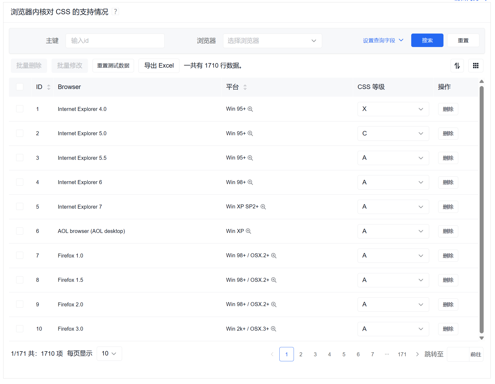
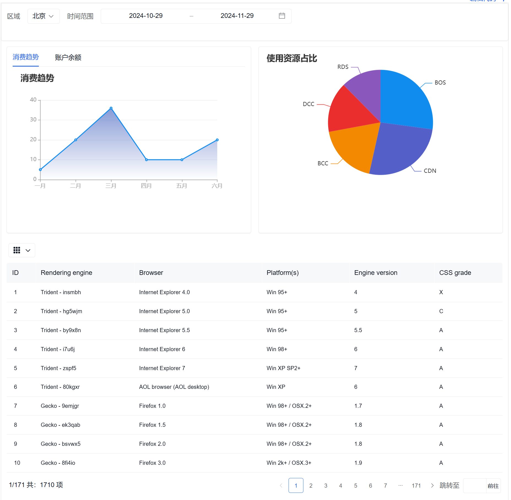

## 百度 amis 低代码

amis 是一个低代码前端框架，它使用 JSON 配置来生成页面，可以减少页面开发工作量，极大提升效率。  
参考：https://aisuda.bce.baidu.com/amis/zh-CN/docs/concepts/linkage

为了实现用最简单方式来生成大部分页面，amis 的解决方案是基于 JSON 来配置，它的独特好处是：

- 不需要懂前端
- 不受技术更新的影响
- 可以使用可视化页面编辑器来制作页面：一般前端可视化编辑器只能用来做静态原型，而 amis 可视化编辑器做出的页面是可以直接上线的。

amis 的其它亮点：

- 提供完整的界面解决方案：其它 UI 框架必须使用 JavaScript 来组装业务逻辑，而 amis 只需 JSON 配置就能完成完整功能开发，包括数据获取、表单提交及验证等功能，做出来的页面不需要经过二次开发就能直接上线；
- 大量的内置组件：其它 UI 框架大部分都只有最通用的组件，如果遇到一些稍微不常用的组件就得自己找第三方，而这些第三方组件往往在展现和交互上不一致，整合起来效果不好，而 amis 则内置大量组件，包括了富文本编辑器、代码编辑器、diff、条件组合、实时日志等业务组件，绝大部分中后台页面开发只需要了解 amis 就足够了；
- 支持扩展：除了低代码模式，还可以通过 自定义组件 来扩充组件，实际上 amis 可以当成普通 UI 库来使用，实现 90% 低代码，10% 代码开发的混合模式，既提升了效率，又不失灵活性；
- 容器支持无线嵌套：可以通过嵌套来满足各种布局及展现需求；
- 经历长时间的实战考验：amis 在百度内部得到了广泛使用，在 6 年多的时间里创建了 5 万页面，从内容审核到机器管理，从数据分析到模型训练，amis 满足了各种各样的页面需求，最复杂的页面有超过 1 万行 JSON 配置。

JSON 配置使得 amis 更适合做有大量常见 UI 组件的页面，但对于面向普通客户（toC）的页面，往往追求个性化的视觉效果，这种情况下用 amis 就不合适，实际上绝大部分前端 UI 组件库也都不适合，只能定制开发。

有些复杂的前端功能，比如 可视化编辑器，其中有大量定制的拖拽操作，这种需要依赖原生 DOM 实现的功能无法使用 amis。
但对于某些交互固定的领域，比如图连线，amis 后续会有专门的组件来实现。

一个普通的页面大致这个样子：

对应的 json 数据如下：

```json
{
  "title": "浏览器内核对 CSS 的支持情况",
  "remark": "嘿，不保证数据准确性",
  "type": "page", // 组件类型：也是渲染器类型
  "body": {
    "type": "crud", // 组件类型
    "draggable": true, // 是否可拖动排序
    "syncLocation": false,//是否过滤条件参数同步到地址栏
    "api": "/amis/api/mock2/sample",//初始化数据api
    "keepItemSelectionOnPageChange": true,//分页时是否保留用户的选择
    //是否根据列元素的searchable属性，自动生成查询条件表单
    "autoGenerateFilter": true,
    "bulkActions": [  // 配置工具栏左侧的批量操作
      {
        "type": "button", //组件类型button
        "label": "批量删除", // 组件显示文案
        "data": { // 组件绑定的数据
          "a": "1",
          "b": "2",
          "c": {
            "e": "3",
            "f": "4",
            "g": "5"
        },
        "actionType": "ajax", // 动作类型：进行Ajax请求
        //请求接口，可以是对象形式，可以获取其他name的参数
        "api": "delete:/amis/api/mock2/sample/${ids|raw}",
        "api": {
          "url": "/amis/api/mock2/form/saveForm",
          "method": "post",
          "data": {
            "name": "${name}",
            "email": "${email}",
            "&": "${c}",
            "描述：":"可以获取json中其他name的变量，&映射data数据c"
          }
        },
        "confirmText": "确定要批量删除?" // 确认文本
      },
      {
        "type": "button",
        "label": "批量修改",
        "actionType": "dialog", //动作类型：需要弹窗
        "dialog": {
          "title": "批量编辑",
          "name": "sample-bulk-edit",
          "body": {
            "type": "form",
            "api": "/amis/api/mock2/sample/bulkUpdate2",
            "body": [
              {
                "type": "hidden",
                "name": "ids"
              },
              {
                "type": "input-text",
                "name": "engine",
                "label": "Engine"
              }
            ]
          }
        }
      }
    ],
    // 快速编辑后用来批量保存的api
    "quickSaveApi": "/amis/api/mock2/sample/bulkUpdate",
    // 快速编辑配置成及时保存时的api
    "quickSaveItemApi": "/amis/api/mock2/sample/$id",
    "headerToolbar": [ // 配置顶部工具栏
      "bulkActions",
      {
        "type": "button",
        "label": "重置测试数据",
        "actionType": "ajax",
        "size": "sm", // 组件大小
        "api": "/amis/api/mock2/sample/reset"
      },
      "export-excel",
      {
        "type": "tpl", // 组件类型：导出模板
        "tpl": "一共有 ${count} 行数据。",
        "className": "v-middle"
      },
      {
        "type": "columns-toggler", // 控制列的按钮
        "align": "right",//对齐方式
        "draggable": true
      },
      {
        "type": "drag-toggler", // 进行排序的按钮
        "align": "right"
      }
    ],
    "footerToolbar": [ // 配置底部工具栏
      "statistics", // 显示数据统计
      "switch-per-page", // 显示切换每页大小的组件
      "pagination" // 显示分页组件
    ],
    "columns": [ // 表格列的配置
      {
        "name": "id", // 对应数据字段
        "label": "ID", // 显示文案
        "width": 20, // 列的宽度
        "sortable": true, //是否可排序
        "type": "text", //组件类型——渲染器类型
        "searchable": { // 可根据此字段进行搜索
          "type": "input-text",
          "name": "id",
          "label": "主键",
          "placeholder": "输入id"
        }
      },
      {
        "name": "browser",
        "label": "Browser",
        "searchable": {
          "type": "select",
          "name": "browser",
          "label": "浏览器",
          "placeholder": "选择浏览器",
          "options": [ // 配置搜索选项
            {
              "label": "Internet Explorer ",
              "value": "ie"
            },
            {
              "label": "AOL browser",
              "value": "aol"
            },
            {
              "label": "Firefox",
              "value": "firefox"
            }
          ]
        }
      },
      {
        "name": "platform",
        "label": "平台",
        "popOver": { // 显示popover弹窗
          "trigger": "hover", // 触发方式：hover
          "body": {
            "type": "tpl",
            "tpl": "就是为了演示有个叫 popOver 的功能"
          }
        },
        "sortable": true,
        "type": "text"
      },
      {
        "name": "grade",
        "label": "CSS 等级",
        "type": "select",
        "options": [
          "A",
          "B",
          "C",
          "D",
          "X"
        ]
      },
      {
        "type": "operation", // 配置最后一列的操作按钮
        "label": "操作",
        "width": 100,
        "buttons": [
          {
            "type": "button",
            "actionType": "ajax",
            "label": "删除",
            "confirmText": "您确认要删除?",
            "api": "delete:/amis/api/mock2/sample/$id"
          }
        ]
      }
    ]
  }
}
```

另一个例子：

json 为：

```json
{
  "type": "page",
  "toolbar": [
    {
      "type": "form",
      "panelClassName": "mb-0",
      "title": "",
      "body": [
        {
          "type": "select", //select组件
          "label": "区域",
          "name": "businessLineId",
          "selectFirst": true, // 默认选中第一个
          "mode": "inline", //内容区的展示模式
          "options": ["北京", "上海"],
          "checkAll": false // 多选条件下，是否可全选
        },
        {
          "label": "时间范围",
          "type": "input-date-range", //时间范围选择器
          "name": "dateRange",
          "inline": true,
          //支持相对值。-2mins： 2分钟前 +2days：2天后。可用单位： `min`、`hour`、`day`、`week`、`month`、`year`。所有单位支持复数形式。
          "value": "-1month,+0month",
          "inputFormat": "YYYY-MM-DD", //显示的时间格式
          "format": "YYYY-MM-DD", //提交的时间格式
          "closeOnSelect": true,
          "clearable": false
        }
      ],
      "actions": [], //按钮集合，会固定在底部显示
      "mode": "inline",
      "target": "mainPage",
      "submitOnChange": true,
      "submitOnInit": true
    }
  ],
  "body": [
    {
      "type": "grid",
      "columns": [
        {
          "type": "panel",
          "className": "h-full",
          "body": {
            "type": "tabs",
            "tabs": [
              {
                "title": "消费趋势",
                "tab": [
                  {
                    "type": "chart", //chart图表组件，默认Echarts图表库
                    "config": {
                      // 图表配置
                      "title": {
                        "text": "消费趋势"
                      },
                      "tooltip": {},
                      "xAxis": {
                        "type": "category",
                        "boundaryGap": false,
                        "data": ["一月", "二月", "三月", "四月", "五月", "六月"]
                      },
                      "yAxis": {},
                      "series": [
                        {
                          "name": "销量",
                          "type": "line",
                          "areaStyle": {
                            "color": {
                              "type": "linear",
                              "x": 0,
                              "y": 0,
                              "x2": 0,
                              "y2": 1,
                              "colorStops": [
                                {
                                  "offset": 0,
                                  "color": "rgba(84, 112, 197, 1)"
                                },
                                {
                                  "offset": 1,
                                  "color": "rgba(84, 112, 197, 0)"
                                }
                              ],
                              "global": false
                            }
                          },
                          "data": [5, 20, 36, 10, 10, 20]
                        }
                      ]
                    }
                  }
                ]
              },
              { "title": "账户余额", "tab": "0" }
            ]
          }
        },
        {
          "type": "panel",
          "className": "h-full",
          "body": [
            {
              "type": "chart",
              "config": {
                "title": { "text": "使用资源占比" },
                "series": [
                  {
                    "type": "pie",
                    "data": [
                      { "name": "BOS", "value": 70 },
                      { "name": "CDN", "value": 68 },
                      { "name": "BCC", "value": 48 },
                      { "name": "DCC", "value": 40 },
                      { "name": "RDS", "value": 32 }
                    ]
                  }
                ]
              }
            }
          ]
        }
      ]
    },
    {
      "type": "crud",
      "className": "m-t-sm",
      "api": "/amis/api/mock2/sample",
      "columns": [
        { "name": "id", "label": "ID" },
        { "name": "engine", "label": "Rendering engine" },
        { "name": "browser", "label": "Browser" },
        { "name": "platform", "label": "Platform(s)" },
        { "name": "version", "label": "Engine version" },
        { "name": "grade", "label": "CSS grade" }
      ]
    }
  ]
}
```

## Amis 的使用

amis 有两种使用方法：

- JS SDK，可以用在任意页面中
- React，可以用在 React 项目中

SDK 版本适合对前端或 React 不了解的开发者，它不依赖 npm 及 webpack，可以像 Vue/jQuery 那样外链代码就能使用。

```html
<!-- 引入CSS样式文件 -->
<head>
  <link rel="stylesheet" href="sdk.css" />
</head>

<body>
  <!-- 配置挂载点 -->
  <div id="root" class="app-wrapper"></div>

  <!-- 引入Amis SDK -->
  <script src="sdk.js"></script>

  <script type="text/javascript">
          (function () {
            let amis = amisRequire('amis/embed');

      // 通过替换下面这个配置来生成不同页面
      let amisJSON = {
        type: 'page',
        title: '表单页面',
        body: {
          type: 'form',
          name:'formname',
          mode: 'horizontal',
          api: '/saveForm',
          body: [
            {
              label: 'Name',
              type: 'input-text',
              name: 'name'
            },
            {
              label: 'Email',
              type: 'input-email',
              name: 'email'
            }
          ]
        }
      };

      // 这里是初始 props，一般不用传。
      let initProps= {
        locale: 'en-US' // props 中可以设置语言，默认是中文
      }

        // 下面是一些可选的外部控制函数
      let config= {
        // 在 sdk 中可以不传，用来实现 ajax 请求，但在 npm 中这是必须提供的
        fetcher: (url, method, data,responseType, config,headers) => {},
        // 全局 api 请求适配器，也可以针对某个特定接口单独处理。
        requestAdaptor(api) {
          // 支持异步，可以通过 api.mockResponse 来设置返回结果，跳过真正的请求发送
          // 此功能自定义 fetcher 的话会失效
          // api.context 中包含发送请求前的上下文信息
          return api;
        }
        // 全局 api 适配器。 也可以针对某个特定接口单独处理。
        responseAdaptor(api, payload, query, request, response) {
          return payload;
        }
        // 用来接管页面跳转，比如用 location.href 或 window.open，或者自己实现 amis 配置更新
        jumpTo: (to: string, action?: Action, ctx?: object)  => { location.href = to; },
        // 用来实现地址栏更新
        updateLocation: (to, replace) => {},
        //设置阻止路由跳转的钩子函数，用来实现 form 未保存提前离开时出现确认框。
        blockRouting:(fn: (nextLocation:any) => void | string) => () => void,
        // 用来判断是否目标地址当前地址。
        isCurrentUrl: url => boolean,
        // 用来配置弹窗等组件的挂载位置
        getModalContainer: () => document.getElementsByTagName('body')[0],
        // 可以通过它懒加载自定义组件
        loadRenderer:(schema: any, path: string) => Promise<Function>,
        // Form 表单验证失败时在 notify 消息提示中是否隐藏详细信息
        hideValidateFailedDetail: boolean,
        // 用来实现复制到剪切板
        copy: (contents: string, options?: {silent: boolean, format?: string})=>{},
        // 用来实现通知
        notify: (type, msg) => {},
        // 用来实现提示
        alert: content => {},
        // 用来实现确认框。
        confirm: content => {},
        // 主题，默认是 default，还可以设置成 cxd 或 dark，但记得引用它们的 css，比如 sdk 目录下的 cxd.css
        theme: 'cxd'
        // 用来实现用户行为跟踪，详细请查看左侧高级中的说明
        tracker: (eventTracker) => {},
        // 开发时使用 localhost 地址，而线上使用 xxx.com.
        replaceText: {
          HOST: 'http://localhost'
        },
        // Toast提示弹出位置，默认为'top-center'
        toastPosition: 'top-right' | 'top-center' | 'top-left' | 'bottom-center' | 'bottom-left' | 'bottom-right' | 'center'
      }

      /**
       * 生成页面并挂载到指定dom
       * schemeJSON
       * initProps
       * config
       * @return 可以获取到 amis 渲染的内部信息
       */
      let amisScoped = amis.embed('#root', amisJSON,initProps,config);


    //来获取到所有表单的值，需要注意 page 和 form 都需要有 name 属性。
    amisScoped.getComponentByName('page.formname').getValues()

    //修改表单中的值。
    amisScoped.getComponentByName('page.formname').setValues({'name1': 'othername'})

    //调用 amis 中的通用动作和目标组件的动作
    amisScoped.doAction(actions, ctx)
    //依次执行了toast提示、ajax请求、dialog弹窗、给目标组件赋值动作
    amisScoped.doAction(
      [
        {
          actionType: 'toast',
          args: {
            msg: '${amisUser.name}, ${myName}'
          }
        },
        {
          actionType: 'ajax',
          api: {
            url: '/amis/api/mock2/form/saveForm',
            method: 'post'
          }
        },
        {
          actionType: 'dialog',
          dialog: {
            type: 'dialog',
            title: '弹窗',
            body: [
              {
                type: 'tpl',
                tpl: '<p>对，你打开了弹窗</p>',
                inline: false
              }
            ]
          }
        },
        {
          actionType: 'setValue',
          componentId: 'name',
          args: {
            value: '${myName}'
          }
        }
      ],
      {
        myName: 'amis'
      }
    );

    // updateProps 方法来更新下发到 amis 的属性
    //  udpateSchema 方法来更新更新内容配置。
    amisScoped.updateProps(
      {
        // 新的属性对象
      } /*, () => {} 更新回调 */
    );

    //单页应用，在离开当前页面的时候通常需要销毁实例
    amisScoped.unmount();

    // 可以基于 SDK 版本封装成 component 供 vue 使用，具体请参考示例：https://github.com/aisuda/vue2-amis-demo
          })();
  </script>
</body>
```
