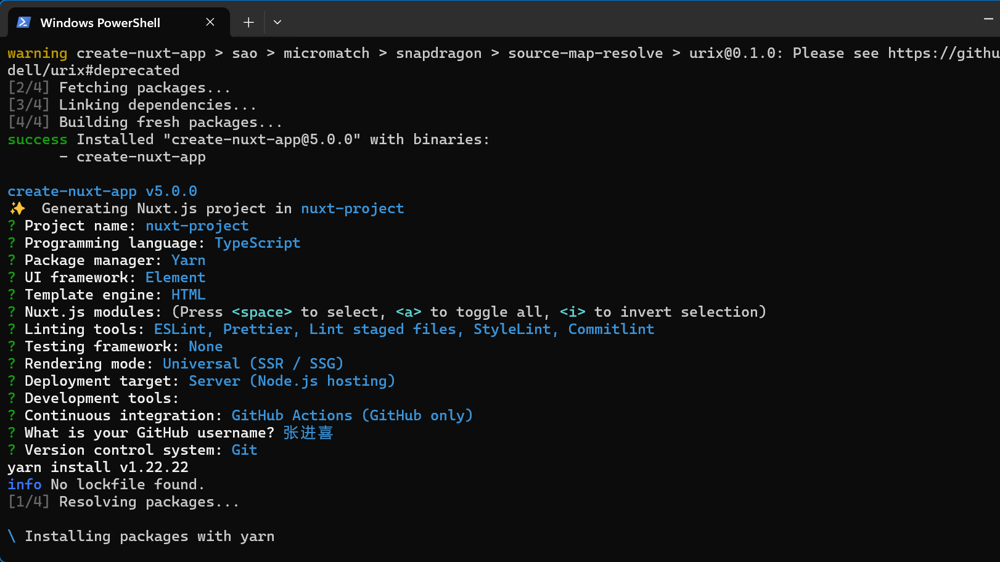

## Nuxt 简介

Nuxt.js 是一个基于 Vue.js 的通用应用框架。

通过对客户端/服务端基础架构的抽象组织，Nuxt.js 主要关注的是应用的 UI 渲染。

Nuxt.js 预设了利用 Vue.js 开发服务端渲染的应用所需要的各种配置。

`nuxt generate` 命令，为基于 Vue.js 的应用提供生成对应的静态站点的功能。

- 基于 Vue.js
- 自动代码分层
- 服务端渲染
- 强大的路由功能，支持异步数据
- 静态文件服务
- ES2015+ 语法支持
- 打包和压缩 JS 和 CSS
- HTML 头部标签管理
- 本地开发支持热加载
- 集成 ESLint
- 支持各种样式预处理器： SASS、LESS、 Stylus 等等
- 支持 HTTP/2 推送

参考：https://ezdoc.cn/docs/nuxtjs/getting-started/installation

## 自动化和预置

Nuxt 使用已约定的和预置的目录结构来自动执行重复性任务，并允许开发人员专注于推送功能。 配置文件仍然可以自定义和覆盖其默认行为。

- 基于文件的路由： 根据 pages/ 目录 的结构定义路由。 这可以更轻松地组织您的应用程序并避免手动路由配置的需要。
- 代码拆分： Nuxt 自动将您的代码拆分为更小的块，这有助于减少应用程序的初始加载时间。
- 开箱即用的服务器端渲染： Nuxt 带有内置的 SSR 功能，因此您不必自己设置单独的服务器。
- 自动导入： 在各自的目录中编写 Vue 可组合项和组件，并使用它们而无需导入它们，并具有 tree-shaking 和优化的 JS 包的优势。
- 数据获取实用程序： Nuxt 提供可组合项来处理与 SSR 兼容的数据获取以及不同的策略。
- 零配置 TypeScript 支持： 编写类型安全代码
- 配置的构建工具： 我们默认使用 Vite 来支持开发中的热模块替换 (HMR)，并将您的代码用于生产，并内置最佳实践。

Nuxt 负责这些并提供前端和后端功能，因此您可以专注于重要的事情：创建您的 Web 应用程序。初始化 Nuxt 项目：


## Nuxt 目录结构

- `.nuxt` 开发目录，生成的 Vue 应用程序目录
- `.output` 输出目录，构建生产应用程序时创建 .output/ 目录
- `assets` 资源目录
- `public` 静态资源目录
- `components` 组件目录
- `composables` 自动导入 Vue 可组合项
- `content` 内容模块，解析 .md、.yml、.csv 和 .json 文件，创建一个基于文件的 CMS
- `layouts` 布局目录，将通用 UI 或代码模式提取到可重用的布局组件
  - 通过将 `<NuxtLayout >` 添加到 app.vue 来使用布局
  - 或者将 layout 属性设置为页面元数据的一部分
  - 或者通过手动指定 它作为`<NuxtLayout>` 的道具
  - `<NuxtLayout :name="layout"><NuxtPage /></NuxtLayout>`
  - setPageLayout('custom')动态改变布局
- `middleware` 中间件目录，导航到特定路由之前提取要运行的代码。
  - 后缀为.global 是全局中间件，每次路由变化自动执行。
- `modules` 模块目录，存放任何本地模块，启动前加载它们
- `node_modules` npm 模块目录
- `pages` 页面目录，Nuxt 提供了基于文件的路由机制
  - 使用 Vue Router 技术来创建 Web 应用程序中的路由
  - 默认有效扩展名为 .vue、.js、 .jsx、.mjs、.ts 或 .tsx
  - Nuxt 要求每个页面必须只有一个根元素，以便进行路由切换时能够成功地进行过渡效果
  - 将任何内容放在方括号内，它将变成一个 动态路由 参数。pages/user-[group]/[id].vue
  - 参数是可选，则必须将其括在双方括号中 pages/user/[[id]].vue
  - 捕获全部路由：pages/[...slug].vue，匹配任意数量的 URL 片段
  - 可以通过$route 或者 useRoute() 获取动态路由参数
  - 通过 definePageMeta()定义路由页面元数据
  - 导航连接：`<NuxtLink to="/">Home page</NuxtLink>`
  - 编程式导航：`navigateTo({path: '/search',query: {}})`
- `plugins` 插件目录，创建 Vue 应用程序时加载它们
  - 只有 plugins/ 目录(或任何子目录中的索引文件)的顶层文件将被注册为插件
  - 使用 .server 或 .client 后缀来仅在服务器端或客户端加载插件
- `server`服务器端目录，注册 API。
  - ~/server/api 其路由中自动以 /api 为前缀
  - ~/server/routes 不带 /api 前缀的服务器路由
  - ~/server/middleware 服务器中间件
  - 每个文件都应该导出一个用 defineEventHandler() 定义的默认函数。
  - 处理程序可以直接返回 JSON 数据、Promise 或使用 event.node.res.end() 发送响应。
  - ~/server/plugins 注册为 Nitro 插件
  - ~/server/utils 服务器实用程序
  - 支持路由参数：例如 /api/hello/[name].ts 并通过 event.context.params 访问。
  - server/api/test.get.ts，句柄文件名可以加上 .get、.post、.put、.delete 等后缀，以匹配请求的 [HTTP 方法]
  - await readBody(event) 获取 body 参数
  - getQuery(event) 获取 query
  - setResponseStatus(event, 202)返回指定状态码
  - parseCookies(event)获取 cookies
  - sendRedirect(event, '/path/redirect/to', 302)重定向
- `utils`工具目录，自动导入辅助函数和其他实用程序
- `.env`环境变量文件
- `.nuxtignore` Nuxt 在构建阶段忽略项目根目录中的文件
- `app.vue` 应用程序主页面
- `app.config.ts` app 配置文件，公开应用程序中的响应式配置
- `nuxt.config.ts` Nuxt 配置文件
- `package.json`项目包文件
- `.nuxt/tsconfig.json`Nuxt 会生成一个 .nuxt/tsconfig.json 文件，其中包含合理的默认值和您的别名。

## 服务器引擎

Nuxt 服务器引擎 Nitro 解锁了新的全栈功能。

- 对 Node.js、浏览器、服务工作者等的跨平台支持。
- 开箱即用的无服务器支持。
- API 路由支持。
- 自动代码分割和异步加载块。
- 静态+无服务器站点的混合模式。
- 具有热模块重新加载的开发服务器。

在开发中，它使用 Rollup 和 Node.js worker 来实现服务器代码和上下文隔离。 它还通过读取 server/api/ 中的文件和 server/middleware/ 中的服务器中间件来生成服务器 API。

在生产环境中，Nitro 将您的应用程序和服务器构建到一个通用的.output 目录中。 这个输出很轻：缩小并从任何 Node.js 模块(polyfills 除外)中删除。 您可以在任何支持 JavaScript 的系统上部署此输出，包括 Node.js、无服务器、Workers、边缘端渲染或纯静态。

## Nuxt 配置

nuxt.config.ts 文件位于 Nuxt 项目的根目录下，可以覆盖或扩展应用程序的行为。

```ts
export default defineNuxtConfig({
  // 关闭服务端渲染，也就不会预渲染路由了
  ssr: false,
  //扩展默认文件、配置等
  extends: [
    "../base", // 从本地层扩展
    "@my-themes/awesome", // 从已安装的 npm 包扩展
    "github:my-themes/awesome#v1", // 从 git 存储库扩展
  ],
  // 配置全局app
  app: {
    head: {
      //自定义整个应用程序的头部
      charset: "utf-8",
      viewport: "width=device-width, initial-scale=1",
    },
    //启用页面过渡以对所有 页面 应用自动过渡
    pageTransition: {
      name: "page",
      mode: "out-in",
      //JavaScript 动画库提供了完美的用例
      onBeforeEnter: el => {
        console.log("Before enter...");
      },
      onEnter: (el, done) => {},
      onAfterEnter: el => {},
    },
    // 启用布局过渡以对所有 布局 应用自动过渡
    layoutTransition: { name: "layout", mode: "out-in" },
  },
  // 启用某实验性功能
  experimental: {
    //  附带 View Transitions API 的实验性api
    viewTransition: true,
  },
  $production: {
    // 配置根据路由，进行不同渲染模式
    routeRules: {
      "/**": {
        isr: true, // 静态页面按需生成，在后台重新生效
        static: true, // 静态页面按需生成一次
        headers: { "cache-control": "s-maxage=0" }, // 设置自定义标头匹配路径
        ssr: false, // 使用 SPA 渲染这些路线
        cors: true, // 添加 cors 标头
        redirect: "/new-page", // 添加重定向标头
        reditect: { to: "/new-page", statusCode: 302 },
      },
    },
  },
  $development: {
    //
  },
  // 向应用程序的其余部分公开环境变量等值。
  runtimeConfig: {
    // 仅在服务器端可用的私钥
    apiSecret: "123",
    // public 中的密钥也暴露在客户端
    public: {
      apiBase: "/api",
    },
  },
  nitro: {
    // 手动预渲染：构建期间获取和预渲染的路由
    prerender: {
      routes: ["/user/1", "/user/2"],
    },
    // 通过预设和最少的配置进行部署
    preset: "node-server",
  },
  //包含到应用程序的所有页面中
  css: ["~/assets/css/main.css"],
  postcss: {},
  vue: {
    defineModel: true, //启用实验功能
    propsDestructure: true,
  },
  vite: {
    vue: {
      customElement: true,
    },
    vueJsx: {
      mergeProps: true,
    },
    css: {
      preprocessorOptions: {
        scss: {
          // 引入全局样式文件
          additionalData: '@use "@/assets/_colors.scss" as *;',
        },
      },
    },
  },
  webpack: {
    loaders: {
      vue: {
        hotReload: true,
      },
    },
  },
  typescript: {},
});

// vue文件中，获取变量
const runtimeConfig = useRuntimeConfig();
```

## 应用配置

位于源目录(默认情况下项目的根目录)中的 app.config.ts 文件用于公开可在构建时确定的公共变量。 与 runtimeConfig 选项相反，这些不能使用环境变量覆盖。

```ts
export default defineAppConfig({
  title: "Hello Nuxt",
  theme: {
    dark: true,
    colors: {
      primary: "#ff0000",
    },
  },
});

// vue 文件中，获取应用配置
const appConfig = useAppConfig();
```

## SEO 优化和元标记

通过强大的头部配置、可组合项和组件改进您的 Nuxt 应用程序的 SEO。

### 入口文件

根目录的 app.vue 文件。里面的配置对所有页面生效：

> 没有暴露 main.js 文件，已经在内部执行。app.vue 根组件相当于入口文件了。

```vue
<script setup lang="ts">
// 使用静态导入来实现服务器端兼容性
import "~/assets/css/first.css";
// 注意：动态导入与服务器端不兼容
import("~/assets/css/first.css");

// 以下是用于 useHead、app.head 和组件的非响应式类型
interface MetaObject {
  title?: string;
  titleTemplate?: string | ((title?: string) => string);
  templateParams?: Record<string, string | Record<string, string>>;
  base?: Base;
  link?: Link[];
  meta?: Meta[];
  style?: Style[];
  script?: Script[];
  noscript?: Noscript[];
  htmlAttrs?: HtmlAttributes;
  bodyAttrs?: BodyAttributes;
}
const description = ref("My amazing site.");
// 以编程和响应式管理头部标签 useHead(obj:MetaObject)
useHead({
  title: "My App",
  // 作为字符串，其中 %s 被标题替换
  titleTemplate: "%s - Site Title",
  // 动态标题title模板：作为一个函数，参数为当前页面title
  titleTemplate: titleChunk => {
    return titleChunk ? `${titleChunk} - Site Title` : "Site Title";
  },
  meta: [{ name: "description", content: description }],
  bodyAttrs: {
    class: "test",
  },
  link: [
    {
      rel: "preconnect",
      href: "https://fonts.googleapis.com",
    },
    {
      rel: "stylesheet",
      href: "https://fonts.googleapis.com/css2?family=Roboto&display=swap",
      crossorigin: "",
    },
  ],
  script: [
    { innerHTML: "console.log('Hello world')" },
    {
      src: "https://third-party-script.com",
      // 附加到 <body> 标签的位置 'head' | 'bodyClose' | 'bodyOpen'
      tagPosition: "bodyClose",
    },
  ],
});

// 将站点的 SEO 元标记定义为具有完整 TypeScript 支持的平面对象。
useServerSeoMeta({
  title: "网站标题",
  ogTitle: "网站标题",
  description: "这是我的神奇网站，让我告诉您所有相关信息。",
  ogDescription: "这是我的神奇网站，让我告诉您所有相关信息。",
  ogImage: "https://example.com/image.png",
  twitterCard: "summary_large_image",
});

// 使用响应式的title:在Nuxt中，支持对所有属性使用响应式(Reactivity)机制，包括计算属性(computed)、getter以及响应式对象(reactive)。
const title = ref("网站标题");
useSeoMeta({
  title,
  description: () => `description: ${title.value}`,
});
</script>

<template>
  <!-- Nuxt 提供<Title>, <Base>, <NoScript>, <Style>, <Meta>, <Link>, <Body>, <Html> 和 <Head> 组件，以便您可以直接与组件模板中的元数据进行交互。为了和原生HTML原生区分，需要大写开头。 -->
  <div>
    <Head>
      <Title>{{ title }}</Title>
      <Meta name="description" :content="title" />
      <!-- <Style type="text/css" children="body {color: green; }" /> -->
      <Link rel="preconnect" href="https://fonts.googleapis.com" />
      <Link
        rel="stylesheet"
        href="https://fonts.googleapis.com/css2?family=Roboto&display=swap"
        crossorigin="" />
    </Head>

    <ClientOnly fallback-tag="span" fallback="Loading comments...">
      ClientOnly 组件仅在客户端呈现其插槽
      <!-- #fallback: 指定要在服务器端显示的内容。 -->
      <template #fallback>
        <!-- @ssr-error：当某个子组件在服务端渲染期间触发了错误 -->
        <NuxtClientFallback @ssr-error="logSomeError"> </NuxtClientFallback>
      </template>
    </ClientOnly>

    <nav>
      <ul>
        <!-- 导航到：pages/about.vue -->
        <li><NuxtLink to="/about"></NuxtLink></li>
        <!-- 导航到：pages/posts/[id].vue -->
        <li><NuxtLink to="/posts/1">路由动态参数</NuxtLink></li>
      </ul>
    </nav>

    <!-- /* 布局和页面出口 */ -->
    <NuxtLayout>
      <!-- 直接将 transition-props 作为组件 props 传递，以激活全局过渡。 -->
      <NuxtPage :transition="{ name: 'bounce', mode: 'out-in' }" />
      <!-- 加载指示器：组件在页面导航上显示一个进度条。 -->
      <NuxtLoadingIndicator />

      <!-- 错误边界：用于处理JavaScript错误的组件或技术 -->
      <NuxtErrorBoundary @error="logSomeError">
        <!-- #error：指定在出现错误时显示的回退内容。 -->
        <template #error="{ error }">
          <p>An error occurred: {{ error }}</p>
        </template>
      </NuxtErrorBoundary>

      <!-- Nuxt 目前仅支持传送到body的 SSR，客户端支持使用<ClientOnly>包装器的其他目标。 -->
      <Teleport to="body">
        <div v-if="open" class="modal">
          <p>Hello from the modal!</p>
          <button @click="open = false">Close</button>
        </div>
      </Teleport>
    </NuxtLayout>
  </div>
</template>

<style lang="scss">
@use "~/assets/scss/main.scss";
@import url("~/assets/css/common.css");

/* 页面之间添加过渡 */
.page-enter-active,
.page-leave-active {
  transition: all 0.4s;
}
.page-enter-from,
.page-leave-to {
  opacity: 0;
  filter: blur(1rem);
}

/* 布局间过渡效果 */
.layout-enter-active,
.layout-leave-active {
  transition: all 0.4s;
}
.layout-enter-from,
.layout-leave-to {
  filter: grayscale(1);
}
</style>
```

### 页面路由文件

pages/ 目录中，您可以使用 definePageMeta 和 useHead 来根据当前路由设置元数据。`pages/posts/[id].vue` ：

```vue
<script setup>
definePageMeta({
  title: "Some Page", //设置当前页面标题
  layout: "orange", // 当前页面应用哪个布局，默认default布局
  //由middleware/auth.ts路由中间件处理当前路由
  middleware: "auth",
  // 也可以内联middleware
  middleware(to, from) {
    // 使用条件逻辑应用动态 transition
    to.meta.pageTransition.name =
      +to.params.id > +from.params.id ? "slide-left" : "slide-right";
  },

  //路由验证：返回一个布尔值来确定这是否是要使用此页面呈现的有效路由
  validate: async route => {
    // 检查id是否由数字组成
    return /^\d+$/.test(route.params.id);
  },
  //为页面设置不同的过渡
  pageTransition: {
    name: "rotate",
  },
  // 自定义页面的布局使用的过渡
  layoutTransition: {
    name: "slide-in",
  },
});

// 获取当前路由对象，拿到路由参数
const route = useRoute();

// 当访问 /posts/1 时，route.params.id 将为 1
console.log(route.params.id);
</script>

<template>
  <h1>#{{ $route.params.id }}</h1>
</template>

<style>
/* 定义页面过渡效果 */
.slide-left-enter-active,
.slide-left-leave-active,
.slide-right-enter-active,
.slide-right-leave-active {
  transition: all 0.2s;
}
.slide-left-enter-from {
  opacity: 0;
  transform: translate(50px, 0);
}
.slide-left-leave-to {
  opacity: 0;
  transform: translate(-50px, 0);
}
.slide-right-enter-from {
  opacity: 0;
  transform: translate(-50px, 0);
}
.slide-right-leave-to {
  opacity: 0;
  transform: translate(50px, 0);
}
</style>
```

### 路由中间件

middleware/目录中。middleware/auth.ts 路由中间件处理路由：

```ts
export default defineNuxtRouteMiddleware((to, from) => {
  // isAuthenticated() 是验证用户是否通过身份验证的示例方法
  if (isAuthenticated() === false) return navigateTo("/login");
});
```

### 布局文件

layouts/目录中。默认布局文件 layouts/default.vue：

```vue
<script setup>
// 获取页面路由元数据
const route = useRoute();

useHead({
  meta: [{ property: "og:title", content: `App Name - ${route.meta.title}` }],
});
</script>

<template>
  <div>
    <pre>default layout</pre>
    <!-- 布局出口 -->
    <slot />
  </div>
</template>

<style scoped>
div {
  background-color: lightgreen;
}
</style>
```

## 数据获取

Nuxt 附带两个可组合项和一个内置库，用于在浏览器或服务器环境中执行数据获取： useFetch、useAsyncData 和 $fetch 。

它们一起使用，可确保跨环境兼容性和高效缓存，并避免重复的网络调用。

useFetch 是在 Nuxt 中执行 API 调用的最直接的方法。

如果需要更细粒度的控制，可以单独使用 useAsyncData 和$fetch。

useAsyncData 和 useFetch 返回相同的对象类型并接受一组通用选项。它们可以帮助您控制可组合项的行为，例如导航阻止、缓存或执行

### useFetch

useFetch 是执行数据获取的最直接的方法。 它是 useAsyncData 可组合项和$fetch 实用程序的包装器。app.vue:

```vue
<script setup>
const id = ref(1);
let options = {
  // useLazyFetch 和 useLazyAsyncData 作为执行相同操作的便捷方法
  lazy: true,
  server: false, // 服务端不可用
  //选择您想要从可组合项返回的字段
  pick: ["title", "description"],
  // 通过函数pick需要的数据
  transform: posts => {
    return posts.map(post => ({
      title: post.title,
      description: post.description,
    }));
  },
  /* 改变id会触发重新获取 */
  watch: [id],
};

const {
  pending, // 设置lazy:true，可以获取pending状态
  data: posts, // 获取过滤后的数据
  error,
  execute, // refresh是execute的别名，手动获取或刷新数据的函数
  refresh,
} = await useFetch("/api/posts", options);
</script>

<template>
  <div v-if="pending">Loading ...</div>
  <div v-else>
    <button @click="refresh">Refresh data</button>
    <div v-for="post in posts">
      <h1>{{ post.title }} 仅仅pick [title,description]</h1>
      <p>{{ post.description }}</p>
    </div>
  </div>
</template>
```

### $fetch

ofetch 库构建在 fetch API 之上，并为其添加了方便的功能：

- 在浏览器、节点或工作环境中以相同的方式工作
- 自动响应解析
- 错误处理
- 自动重试
- 拦截器

当我们在浏览器中调用 $fetch 时，像 cookie 这样的用户标头将被直接发送到 API。 但在服务器端渲染期间，由于“$fetch”请求在服务器“内部”发生，因此它不包含用户的浏览器 cookie，也不传递来自 fetch 响应的 cookie。

```js
//还可以通过$fetch别名在整个应用程序中使用：
const users = await $fetch("/api/users").catch(error => error.data);
```

### useAsyncData

useFetch 接收 URL 并获取该数据，而 useAsyncData 可能有更复杂的逻辑 。 useFetch(url) 几乎等同于 useAsyncData(url, () => $fetch(url))

在某些情况下，使用 useFetch 可组合项并不合适，例如，当 CMS 或第三方提供自己的查询层时。 在这种情况下，您可以使用 useAsyncData 来包装您的调用，并仍然保留可组合项提供的好处：

```js
const { data, error } = await useAsyncData("users", () =>
  myGetFunction("users")
);
```

### 获取客户端 headers

使用 useRequestHeaders 从服务器端访问 cookie 并将其代理到 API。

```vue
<script setup>
const headers = useRequestHeaders(["cookie"]);
const { data } = await useFetch("/api/me", { headers });
</script>
```

### 服务端设置 headers

需要自己处理这个问题。

```ts
import { H3Event, appendResponseHeader } from "h3";

export async function fetchWithCookie(event: H3Event, url: string) {
  const res = await $fetch.raw(url);
  const cookies = (res.headers.get("set-cookie") || "").split(",");
  for (const cookie of cookies)
    appendResponseHeader(event, "set-cookie", cookie);

  return res._data;
}

// 该可组合项会自动将 cookie 传递给客户端
const event = useRequestEvent();
const result = await fetchWithCookie(event, "/api/with-cookie");
onMounted(() => console.log(document.cookie));
```

### 选项 API 支持

Nuxt 3 提供了一种在选项 API 中执行 asyncData 获取的方法。 您必须将组件定义包装在 defineNuxtComponent 中才能正常工作。

```vue
<script>
export default defineNuxtComponent({
  /* 使用 fetchKey 选项提供唯一的密钥 */
  fetchKey: "hello",
  async asyncData() {
    return {
      hello: await $fetch("/api/hello"),
    };
  },
});
</script>
```

### 数据序列化

从 server 目录获取数据时，使用 JSON.stringify 对响应进行序列化。 然而，由于序列化仅限于 JavaScript 基元类型，Nuxt 会尽力转换 $fetch 和 useFetch 的返回类型以匹配实际值。

server/目录下定义接口：server/api/foo.ts：

```ts
export default defineEventHandler(() => {
  // return new Date();
  return {
    createdAt: new Date(),
    // server/api/bar.ts。自定义序列化器函数 toJSON()
    toJSON() {
      return {
        createdAt: {
          year: this.createdAt.getFullYear(),
          month: this.createdAt.getMonth(),
          day: this.createdAt.getDate(),
        },
      };
    },
  };
});
```

app.vue 入口文件使用 api

```vue
<script setup lang="ts">
// data隐式调用toJSON方法。“data”的类型也被推断为字符串
const { data } = await useFetch("/api/foo");

// 添加自定义序列化器后，才会返回正确的对象类型
const { data } = await useFetch("/api/bar");
</script>
```

## 状态管理

Nuxt 提供了强大的状态管理库和可组合的 useState 来创建响应式和 SSR 友好的共享状态。也可以集成其他状态库，例如 pinia

useState 是 SSR 友好的 ref 替代品。 它的值将在服务器端渲染后(在客户端水合作用期间)保留，并使用唯一密钥在所有组件之间共享。

useState 仅在 setup 或 Lifecycle Hooks 期间有效.中的数据将被序列化为 JSON，所以不包含任何无法序列化的内容，例如类、函数或符号。

app.vue 中。使用 useState('counter') 的任何其他组件共享相同的反应状态

```vue
<script setup>
const counter = useState("counter", () => Math.random() * 1000);
</script>

<template>
  <div>
    Counter: {{ counter }}
    <button @click="counter++">+</button>
    <button @click="counter--">-</button>
  </div>
</template>
```

### 共享状态

通过使用自动导入的可组合项，我们可以定义全局类型安全状态并将它们导入整个应用程序

composables/states.ts：

```ts
export const useCounter = () => useState<number>("counter", () => 0);
export const useColor = () => useState<string>("color", () => "pink");
```

app.vue

```vue
<script setup>
const color = useColor(); // 获取自动导入的useColor()
</script>

<template>
  <p>Current color: {{ color }}</p>
</template>
```

## 错误处理

Nuxt 3 是一个全栈框架，这意味着在不同的上下文中可能会发生无法预防的用户运行时错误的多种来源：

- Vue 渲染生命周期错误(SSR+SPA)
- API 或 Nitro 服务器生命周期中的错误
- 服务器和客户端启动错误(SSR + SPA)
- 下载 JS chunks 出错

### Vue 渲染生命周期中的错误(SSR+SPA)

您可以使用 onErrorCaptured 挂钩 Vue 错误。

此外，Nuxt 提供了一个 vue:error 挂钩，如果任何错误传播到顶层，该挂钩将被调用。

如果您使用的是错误报告框架，则可以通过 vueApp.config.errorHandler 提供全局处理程序。 它会接收所有 Vue 错误，即使它们已被处理。

```js
export default defineNuxtPlugin(nuxtApp => {
  nuxtApp.vueApp.config.errorHandler = (error, context) => {
    // ...
  };
});
```

### 服务端和客户端启动错误(SSR+SPA)

如果在启动 Nuxt 应用程序时出现任何错误，Nuxt 将调用 app:error 挂钩。这包括：

- 运行 Nuxt 插件
- 处理 app:created 和 app:beforeMount 钩子
- 将你的 Vue 应用渲染为 HTML(在服务器上)
- 安装应用程序(在客户端)，尽管您应该使用 onErrorCaptured 或 vue:error
- 处理 app:mounted 钩子

### API 或 Nitro 服务器生命周期中的错误

目前无法为这些错误定义服务器端处理程序，但可以呈现错误页面

### 下载 JS 块时出错

由于网络连接失败或新部署(这会使旧的散列 JS 块 URL 无效)，您可能会遇到块加载错误。 Nuxt 通过在路由导航期间无法加载块时执行硬重新加载来提供对处理块加载错误的内置支持。

您可以通过将 experimental.emitRouteChunkError 设置为 false(以完全禁用对这些错误的挂钩)或设置为 manual(如果您想自己处理它们)来更改此行为

### 渲染错误页面

当 Nuxt 遇到致命错误时，无论是在服务器生命周期期间，还是在呈现 Vue 应用程序(SSR 和 SPA)时，它都会呈现 JSON 响应(如果使用 Accept: application/json 标头请求)或 HTML 错误页。

通过在源目录中添加 ~/error.vue 以及 app.vue 来自定义此错误页面。error.vue:

```vue
<script setup>
//页面只有一个 prop - error
const props = defineProps({
  error: Object,
});

//进入错误页面后。删除错误页面，并重定向到想导航到“安全”页面
const handleError = () => clearError({ redirect: "/" });
</script>

<template>
  <button @click="handleError">清除错误</button>
</template>
```

### 错误辅助方法

```ts
//此函数将返回正在处理的全局 Nuxt 错误。
function useError (): Ref<Error | { url, statusCode, statusMessage, message, description, data }>

//创建带有附加元数据的错误对象
function createError (err: { cause, data, message, name, stack, statusCode, statusMessage, fatal }): Error

//触发一个全屏错误页面，您可以使用 clearError 清除该页面
function showError (err: string | Error | { statusCode, statusMessage }): Error

//清除当前处理的 Nuxt 错误。 它还需要一个可选的重定向路径
function clearError (options?: { redirect?: string }): Promise<void>

<script setup>
const route = useRoute()
const { data } = await useFetch(`/api/movies/${route.params.slug}`)
if (!data.value)
  throw createError({ statusCode: 404, statusMessage: 'Page Not Found' })
</script>
```

### 应用程序中呈现错误

Nuxt 还提供了一个`<NuxtErrorBoundary>`组件，允许您在应用程序中处理客户端错误，而无需用错误页面替换整个站点。

该组件负责处理在其默认插槽中发生的错误。 在客户端，它会阻止错误冒泡到顶层，并会渲染 #error 插槽。

```vue
<template>
  <!-- 一些内容 -->
  <NuxtErrorBoundary @error="someErrorLogger">
    <!-- 使用默认插槽来呈现错误内容 -->
    <template #error="{ error }">
      您可以在此处本地显示错误。
      <button @click="error = null">这将清除错误。</button>
    </template>
  </NuxtErrorBoundary>
</template>
```
