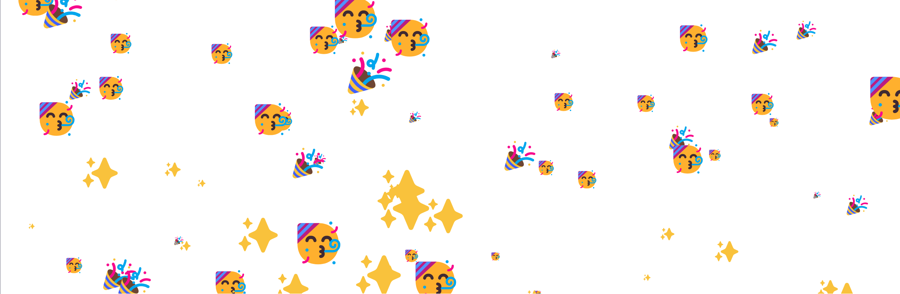

## Svelte框架介绍
velte 是一种全新的构建用户界面的方法。传统框架如 React 和 Vue 在浏览器中需要做大量的工作，而 Svelte 将这些工作放到构建应用程序的编译阶段来处理。

与使用虚拟（virtual）DOM 差异对比不同。Svelte 编写的代码在应用程序的状态更改时就能像做外科手术一样更新 DOM。
- 减少代码量  
重复利用所掌握的编程语言：HTML、CSS、Javascript，构建的组件无需依赖模板文件。
- 无虚拟DOM  
Svelte将代码编译成体积小、不依赖框架的普通js代码，让应用程序无论启动或者运行都变得非常迅速。
- 真正的反应能力  
无需复杂的状态管理库，Svelte为JavaScript自身添加反应能力。


- Svelte组件建立在HTML之上，然后只需添加数据即可。
- css默认限定在组件作用域内，不再有样式冲突或者优先级的问题。还可以使用CSS-in-JS库。
- 通过给局部变量赋值就能触发高效、细粒度的更新。剩余的事情交给编译器处理。
- 使用一个内置于框架中的、强大的、性能卓越的动画引擎来构建漂亮的UI。
```js
<script>
  //引入组件直接使用
	import Nested from './Nested.svelte';
  // 内置高性能的动画引擎
  import { quintOut } from 'svelte/easing';
  // 内置常用动画
	import { fade, draw, fly } from 'svelte/transition';
  // 引入生命周期函数
  import { 
    onMount,
    onDestroy,
    beforeUpdate,
    afterUpdate,
    tick,
    setContext,
    getContext,
    createEventDispatcher
  } from 'svelte';
	import { expand } from './custom-transitions.js';
	import { inner, outer } from './shape.js';

  // 直接声明变量、直接修改变量、直接在模板内使用变量
	let visible = true;
  let count = 0;
  let canvasElement;
  let pkg = {name:'zhangjinxi',age:23};

  $: doubled = count * 2; //类似vue computed计算属性

  $: console.log(`the count is ${count}`); // 类似watcher
  $: {
    console.log(`the count is ${count}`);
    alert(`I SAID THE COUNT IS ${count}`);
  }
  $: if (count >= 10) {
    alert(`count is dangerously high!`);
    count = 9;
  }

  // 定义函数
	function handleClick() {
		count += 1;
	}

  // 声明周期函数
  onMount(async () => {
		const res = await fetch(`https://jsonplaceholder.typicode.com/photos?_limit=20`);
		photos = await res.json();
	});
</script>

<style>
  {/* 这里直接编写css代码，页面结构有点类似Vue */}
	p {
		color: purple;
		font-family: 'Comic Sans MS', cursive;
		font-size: 2em;
	}
</style>

<p>使用“{doubled}”花括号包含引入的变量、函数和表达式，可以直接调用函数</p>

<p>使用@html直接渲染HTML元素而不是文本{@html '<div></div>'}</p>

<button on:click|once={handleClick}>
	绑定click事件触发器，并添加修饰符，和vue相同： 
  {count} {count === 1 ? 'time' : 'times'}
</button>
<div on:mousemove="{e => m = { x: e.clientX, y: e.clientY }}">
	也可以内联事件 {m.x} x {m.y}
</div>
// 使用组件，并给组件添加属性props。组件内直接通过定义这个变量的方式
// 获取这个props。例如：let answer;
<Nested answer={42} {...pkg}/>

// bind:this 类似vue中的ref，可以获取dom对象的引用
<canvas bind:this={canvasElement}></canvas>

// 条件判断
{#if visible}
	<svg xmlns="http://www.w3.org/2000/svg" viewBox="0 0 103 124">
		<g out:fade="{{duration: 200}}" opacity=0.2>
			<path
				in:expand="{{duration: 400, delay: 1000, easing: quintOut}}"
				style="stroke: #ff3e00; fill: #ff3e00; stroke-width: 50;"
				d={outer}
			/>
			<path
				in:draw="{{duration: 1000}}"
				style="stroke:#ff3e00; stroke-width: 1.5"
				d={inner}
			/>
		</g>
	</svg>
{:else if 5 > x}
  <label>
    {/* on:用来绑定事件。bind:用来绑定值 bind:group绑定多个值（代表一个分组） */}
    <input type="checkbox" bind:checked={visible}>
  </label>
{:else}
	<div class="centered" out:fly="{{y: -20, duration: 800}}">
    {/* 遍历和列表渲染 字符串SVELTE解析为数组 i作为key标识*/}
		{#each 'SVELTE' as char, i (i)}
			<span
				in:fade="{{delay: 1000 + i * 150, duration: 800}}"
			>{char}</span>
		{/each}  
	</div>
{/if}

<link href="https://fonts.googleapis.com/css?family=Overpass:100,400" rel="stylesheet">

{/* 处理异步数据的需求 */}
{#await promise}
	<p>...waiting</p>
{:then number}
	<p>The number is {number}</p>
{:catch error}
	<p style="color: red">{error.message}</p>
{/await}
 {/* promise 总是返回错误，则可以忽略 catch 块 */}
{#await promise then value}
	<p>the value is {value}</p>
{/await}

{/* 支持 contenteditable="true"属性的标签，可以使用 textContent 与 innerHTML 属性的绑定： */}
<div
	contenteditable="true"
	bind:innerHTML={html}
></div>
```
## 客户端 component API
客户端 component 使用 generate: 'dom' (或 generate 选项不指定)编译的component是JavaScript类。
```js
const component = new Component(options)

import App from './App.svelte';

const app = new App({
	target: document.body,
	props: {
		answer: 42
	}
});

//以编程方式在实例上设置 prop
app.$set(props)

//返回一个函数，该函数在调用时将删除事件侦听器。
app.$on(event, callback)

//从DOM中删除component并触发所有 onDestroy 处理程序
app.$destroy()
```

## 反应性能力
由于 Svelte 的反应性是由赋值语句触发的，因此使用数组的诸如 push 和 splice 之类的方法就不会触发自动更新。解决该问题的一种方法是添加一个多余的赋值语句：
```js
function addNumber() {
	numbers.push(numbers.length + 1);
	numbers = numbers;//添加赋值语句，触发响应式
}

//赋值给数组和对象的 属性（properties） （例如，obj.foo += 1 或 array[i] = x）与对值本身进行赋值的方式相同。
numbers[numbers.length] = numbers.length + 1;
```
## 事件调度
与 DOM 事件不同， 组件事件不会 冒泡（bubble） ，如果你想要在某个深层嵌套的组件上监听事件，则中间组件必须 转发（forward） 该事件

为此，组件内必须创建一个相同事件并在外部进行分配。createEventDispatcher 必须在首次实例化组件时调用它，—组件本身不支持如 setTimeout 之类的事件回调。 定义一个dispatch进行连接，进而把组件实例化。
```js
<script>
  import Inner from './Inner.svelte';
	import { createEventDispatcher } from 'svelte';

	const dispatch = createEventDispatcher();

  // 监听Inner组件内的message事件
	function forward() {
		dispatch('message', {
			text: 'Hello!'
		});
	}
</script>

<Inner on:message={forward}/>
{/* 简写属性 on:message。 message 没有赋予特定的值得情况下意味着转发所有massage事件： */}
<Inner on:message/>
```
## store

```js
import { writable,readable, derived} from 'svelte/store';

//定义不可写入的store值。传入初始值。第二个参数和writable相同
export const time = readable(new Date(), function start(set) {
	const interval = setInterval(() => {
		set(new Date());
	}, 1000);
	return function stop() {
		clearInterval(interval);
	};
});

// 定义可以写入的store值
export const count = writable(0,function start(set){
     //set更改store值的函数
    //在subscriber数从0变为1（但不是从1变为2）时将调用该函数
  return function stop(){
    // 在subscriber数从1变为0时调用的函数
    //或者当subscriber被unsubscribes时调用stop
  }
});
const unsubscribe = count.subscribe(value => {
  // 订阅count的变化
});

// 函数参数的返回值，设置为store的新值
count.update(n => n + 1);

// 设置count值为0
count.set(0);

// 添加$前缀在dom中使用，不能在声明此变量了
<h1>The count is {$count}</h1>

// 源于一个或多个其他 store的store，只要这些依赖项发生变更，就会执行回调
derived(a, callback: (a: any) => any)
derived(
  [a, ...b], 
  callback: ([a: any, ...b: any[]], set: (value: any) => void) => void | () => void, initial_value: any)

const doubled = derived(time, ($time,set) => $time * 2);
const summed = derived([a, b], ([$a, $b]) => $a + $b);
const delayed = derived([a, b], ([$a, $b], set) => {
	setTimeout(() => set($a + $b), 1000);
});
// 只要一个对象正确的使用 subscribe ，它就是可以称之为store。因此，使用特定语法来创建自定义 stores变得非常容易。
function createCount() {
	const { subscribe, set, update } = writable(0);

	return {
		subscribe,
		increment: () => update(n => n + 1),
		decrement: () => update(n => n - 1),
		reset: () => set(0)
	};
}
```
## 运动
svelte/motion模块导出两个函数： tweened 和 spring。用于创建writable（可写）store，其值会在set 和 update之后更新，而不是立即更新。
```js
<script>
	import { tweened,spring } from 'svelte/motion';
	import { cubicOut } from 'svelte/easing';

  {/* Tweened（补间） store 值会在固定时间内更新，可选参数： */}
	const store = tweened(0, {
		duration: 400,
    duration(form,to){
      return milliseconds
    },
		easing: cubicOut,
    delay:1000,
    interpolate(from,to){
      return t=>value
    }
	});
{/* spring（弹性） store通过stiffness和 damping参数逐步变更到目标值，而tweenedstore在改变一个固定时间变更其值。store在由它们现有速度决定的持续时间长短，从而实现更自然的运动效果。可选选项： */}
  let coords = spring({ x: 50, y: 50 });
	let size = spring(10);
  let coords = spring({ x: 50, y: 50 }, {
    stiffness: 0.1,//灵敏度
    damping: 0.25,//惯性
    precision:0.01// 控制上面两个参数的运动幅度大小
  });
</script>
```

## 过渡
- `fade` 淡入淡出 参数： delay duration
- `blur` 模糊处理 参数：delay、duration、easing、opacity、amount
- `fly`  移动 delay、duration、easing、x、y、opacity
- `slide` 滑动 delay duration easing
- `scale` 缩放 delay duration easing start opacity
- `draw` 对SVG标签进行路径绘制动画 delay speed duration easing 
- `crossfade`
```js
<script>
	import { fade,fly,slide,scale,draw,blur,crossfade} from 'svelte/transition';
	let visible = true;
</script>

<p transition:fade>Fades in and out</p>
<p transition:fly="{{ y: 200, duration: 2000 }}">
	Flies in and out
</p>
  // transition 属性可以替换为 in 或out 属性，分别对应过渡效果的入和出，可以指定其中一个，或者指定两个
<p in:fly="{{ y: 200, duration: 2000 }}" out:fade>
	Flies in, fades out
</p>

// svelte/transition 模块含有一些内置的过渡效果，但是创建自己的过渡效果也是非常容易
function fade(node, {
	delay = 0,
	duration = 400
}) {
	const o = +getComputedStyle(node).opacity;
	return {
		delay,
		duration,
    easing(p){
      return t
    },
    tick(t,u){
      return {}
    },
		css: (t,u)=> `opacity: ${t * o}`
	};
}

// 过渡事件
<p
	transition:fly="{{ y: 200, duration: 2000 }}"
	on:introstart="{() => status = 'intro started'}"
	on:outrostart="{() => status = 'outro started'}"
	on:introend="{() => status = 'intro ended'}"
	on:outroend="{() => status = 'outro ended'}"
>
	Flies in and out
</p>

//过 局部（local）过渡
<div transition:slide|local>
	{item}
</div>

//crossfade函数创建一对称名为 send 和receive. 当一个标签被 'sent'时， 它会寻找一个被'received'的标签，并赋予一个过渡效果，反之同理。如果没有对应的接收方，过渡效果将会设置为fallback 
const [send, receive] = crossfade({
  duration: d => Math.sqrt(d * 200),
  fallback(node, params) {
    const style = getComputedStyle(node);
    const transform = style.transform === 'none' ? '' : style.transform;

    return {
      duration: 600,
      easing: quintOut,
      css: t => `
        transform: ${transform} scale(${t});
        opacity: ${t}
      `
    };
  }
});

<label
	in:receive="{{key: todo.id}}"
	out:send="{{key: todo.id}}"
>

<label
	class="done"
	in:receive="{{key: todo.id}}"
	out:send="{{key: todo.id}}"
>
```
## 动画
- flip 函数计算标签的开始和结束位置并在它们之间进行动画效果，并翻转x 和 y的值，
```js

animate:name={params}
animation = (node: HTMLElement, { from: DOMRect, to: DOMRect } , params: any) => {
	delay?: number,
	duration?: number,
	easing?: (t: number) => number,
	css?: (t: number, u: number) => string,
	tick?: (t: number, u: number) => void
}
DOMRect {
	bottom: number,
	height: number,
	​​left: number,
	right: number,
	​top: number,
	width: number,
	x: number,
	y: number
}

// 自定义动画
<script>
	import { cubicOut } from 'svelte/easing';
	function whizz(node, { from, to }, params) {
		const dx = from.left - to.left;
		const dy = from.top - to.top;
		const d = Math.sqrt(dx * dx + dy * dy);
		return {
      delay: 0,
      duration: Math.sqrt(d) * 120,
      easing: cubicOut,
      tick: (t, u) =>
        Object.assign(node.style, {
          color: t > 0.5 ? 'Pink' : 'Blue'
        });
	};
	}
</script>

{#each list as item, index (item)}
	<div animate:whizz>{item}</div>
{/each}


import { flip } from 'svelte/animate';
// todo实现平滑切换效果：完美。。。
<label
	in:receive="{{key: todo.id}}"
	out:send="{{key: todo.id}}"
	animate:flip
>
<label
	in:receive="{{key: todo.id}}"
	out:send="{{key: todo.id}}"
	animate:flip="{{duration: 200}}"
>
```
## easing 
Easing 函数可指定根据时间变化的速率，在使用Svelte的内置transition和animation以及tweened和spring程序时非常有用。 svelte/easing 包含31个导出命名，, 一个linear（线性）缓动使用in， out 和 inOut轻松生成10种不同的缓动函数：

## Actions
pannable.js:
```js
// action本身是个函数，接受node节点对象
export function pannable(node,...args) {
	let x;
	let y;

	function handleMousedown(event) {
		x = event.clientX;
		y = event.clientY;
    
    // 当触发mousedown事件时，触发dom上的panstart事件
		node.dispatchEvent(new CustomEvent('panstart', {
			detail: { x, y }
		}));

    // 并监听mousemove和mouseup事件
		window.addEventListener('mousemove', handleMousemove);
		window.addEventListener('mouseup', handleMouseup);
	}

	function handleMousemove(event) {
		const dx = event.clientX - x;
		const dy = event.clientY - y;
		x = event.clientX;
		y = event.clientY;

		node.dispatchEvent(new CustomEvent('panmove', {
			detail: { x, y, dx, dy }
		}));
	}

	function handleMouseup(event) {
		x = event.clientX;
		y = event.clientY;

		node.dispatchEvent(new CustomEvent('panend', {
			detail: { x, y }
		}));

		window.removeEventListener('mousemove', handleMousemove);
		window.removeEventListener('mouseup', handleMouseup);
	}

	node.addEventListener('mousedown', handleMousedown);

	return {
		destroy() {
      // 销毁时触发
			node.removeEventListener('mousedown', handleMousedown);
		},
    update(newDuration){
      // 参数改变时触发该方法
    }
	};
}
```
app.svelte
```js
<script>
	import { spring } from 'svelte/motion';
  import { pannable } from './pannable.js';

	const coords = spring({ x: 0, y: 0 }, {
		stiffness: 0.2,
		damping: 0.4
	});

	function handlePanStart() {
		coords.stiffness = coords.damping = 1;
	}

	function handlePanMove(event) {
		coords.update($coords => ({
			x: $coords.x + event.detail.dx,
			y: $coords.y + event.detail.dy
		}));
	}

	function handlePanEnd(event) {
		coords.stiffness = 0.2;
		coords.damping = 0.4;
		coords.set({ x: 0, y: 0 });
	}
</script>

<style>
	.box {
		--width: 100px;
		--height: 100px;
		position: absolute;
		width: var(--width);
		height: var(--height);
		left: calc(50% - var(--width) / 2);
		top: calc(50% - var(--height) / 2);
		border-radius: 4px;
		background-color: #ff3e00;
		cursor: move;
	}
</style>

// 通过use使用action，action里可以拿到并操作dom，还可以传递参数
<div class="box"
	use:pannable={{duration:1000,delay:1000}}
	on:panstart={handlePanStart}
	on:panmove={handlePanMove}
	on:panend={handlePanEnd}
	style="transform:
		translate({$coords.x}px,{$coords.y}px)
		rotate({$coords.x * 0.2}deg)"
></div>
```
## Classes
```js
<button
	class="{current === 'foo' ? 'selected' : ''}"
  class:selected="{current === 'foo'}"
  class:big={big}
  class:big // 简写
	on:click="{() => current = 'foo'}"
>foo</button>
```
## 组件
像vue一样，支持slot插槽，命名插槽，插槽默认值

```js
// 定义组件
<slot name="address">
  <span class="missing">具名插槽address的默认内容</span>
</slot>
<slot>默认default插槽的默认内容</slot>

// 获取父组件传递的comments插槽内容
{#if $$slots.comments}
	<div class="discussion">
		<h3>Comments</h3>
		<slot name="comments" item={var}>具名插槽传递数据给父组件</slot>
	</div>
{/if}

// 作用域插槽。hovering传递给父组件
<slot hovering={hovering}></slot>

// 使用组件。let来获取子组件传递的内容。也可以通过slot获取
<ContactCard let:hovering={hovering}>
  {#if hovering}
    <p>I am being hovered upon.</p>
  {:else}
    <p>Hover over me!</p>
  {/if}
	<span slot="address">具名插槽address</span>
	<span slot="comments" let:item={var}>获取具名插槽传递来的数据</span>
</ContactCard>
```
## 上下文
```js
// 父级组件，通过setContext暴露上下文给子级组件
import { onMount, setContext } from 'svelte';
import { mapbox, key } from './mapbox.js';

setContext(key, {
	getMap: () => map
});


// 子级组件通过getContext获取上下文传递的数据
import { getContext } from 'svelte';
import { mapbox, key } from './mapbox.js';

const { getMap } = getContext(key);
const map = getMap();
```
## 特殊标签
`<svelte:self>`标签允许递归自己。例如：目录
`<svelte:component>` 和vue的component组件一样
```js
{#if file.type === 'folder'}
	<svelte:self {...file}/>
{:else}
	<File {...file}/>
{/if}

<svelte:component this={selected.component}/>

//通过 <svelte:window>标签给window 对象添加事件监听：
<svelte:window on:keydown={handleKeydown} bind:innerWidth:200/>

//<svelte:body>标签允许你添加事件监听document.body
<svelte:body
	on:mouseenter={handleMouseenter}
	on:mouseleave={handleMouseleave}
/>

//<svelte:head> 允许你在页面的 <head> 标签内插入内容
<svelte:head>
	<link rel="stylesheet" href="tutorial/dark-theme.css">
</svelte:head>

{/* <svelte:options>标签允许你指定编译器选项 */}
<svelte:options immutable={true}/>
<svelte:options immutable/> // 简写

// 实例之上的代码，可以控制组件的多个实例对象
<script context="module">
	let current;
</script>

<script context="module">
	const elements = new Set();
</script>

<script>
	import { onMount } from 'svelte';

	export let src;
	export let title;
	export let composer;
	export let performer;

	let audio;
	let paused = true;

	onMount(() => {
		elements.add(audio);
		return () => elements.delete(audio);
	});
  // 只有一个音乐组件处于播放中，会暂停其他实例播放
	function stopOthers() {
		elements.forEach(element => {
			if (element !== audio) element.pause();
		});
	}
</script>

<style>
	article { margin: 0 0 1em 0; max-width: 800px }
	h2, p { margin: 0 0 0.3em 0; }
	audio { width: 100%; margin: 0.5em 0 1em 0; }
	.playing { color: #ff3e00; }
</style>

<article class:playing={!paused}>
	<h2>{title}</h2>
	<p><strong>{composer}</strong> / performed by {performer}</p>

	<audio
		bind:this={audio}
		bind:paused
		on:play={stopOthers}
		controls
		{src}
	></audio>
</article>
```
## 调试
```txt
// 调试user
{@debug user}
<h1>Hello {user.firstname}!</h1>
```
祝贺动画：
```js
<script>
	import { onMount } from 'svelte';

	let characters = ['🥳', '🎉', '✨'];

	let confetti = new Array(100).fill()
		.map((_, i) => {
			return {
				character: characters[i % characters.length],
				x: Math.random() * 100,
				y: -20 - Math.random() * 100,
				r: 0.1 + Math.random() * 1
			};
		})
		.sort((a, b) => a.r - b.r);

	onMount(() => {
		let frame;

		function loop() {
			frame = requestAnimationFrame(loop);

			confetti = confetti.map(emoji => {
				emoji.y += 0.7 * emoji.r;
				if (emoji.y > 120) emoji.y = -20;
				return emoji;
			});
		}

		loop();

		return () => cancelAnimationFrame(frame);
	});
</script>

<style>
	:global(body) {
		overflow: hidden;
	}

	span {
		position: absolute;
		font-size: 5vw;
	}
</style>

{#each confetti as c}
	<span style="left: {c.x}%; top: {c.y}%; transform: scale({c.r})">{c.character}</span>
{/each}
```

参考：https://www.svelte.cn/

Svelte5:https://svelte.dev/docs/svelte/getting-started