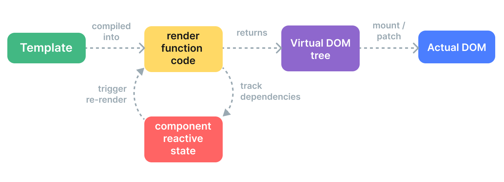

## Vue3 语法示例

使用 `<script setup>` 的单文件组件中

```vue
<template>
  <!-- <MyComponent @some-event="callback" /> -->

  <!-- 在模板里，$emit触发父组件传来的方法 -->
  <button @click="$emit('someEvent', param1, ...params)">Click Me</button>
</template>

<script setup lang="ts">
// 从vue中引入所需资源
import {
  createApp,
  ref,
  shallowRef,
  triggerRef,
  reactive ,
  shallowReactive,
  watch,
  watchEffect,
  watchEffectPost ,
  onMounted,
  onUnmounted,
  computed,
  provide,
  inject,
  onRenderTracked,
  onRenderTriggered,
  } from "vue";

// 实例化一个app
const app = createApp(...)
app.config.errorHandler = (err, instance, info) => {
  // 向追踪服务报告错误
}
app.unmount()
/**
 * 定义原始数据类型响应式数据
 */
const x = ref(0)
const y = ref(0)

/**
 * 定义引用数据类型响应式数据
 */
const obj = reactive({name:'zhangjinxi'})

//模拟实现reactive：使用了Proxy
function reactive(obj) {
  return new Proxy(obj, {
    get(target, key) {
      track(target, key)
      return target[key]
    },
    set(target, key, value) {
      target[key] = value
      trigger(target, key)
    }
  })
}
//模拟实现ref：依然使用getter 和 setter
function ref(value) {
  const refObject = {
    get value() {
      track(refObject, 'value')
      return value
    },
    set value(newValue) {
      value = newValue
      trigger(refObject, 'value')
    }
  }
  return refObject
}

// 一个副作用运行之前被设置为活跃副作用，始终只有一个活跃
let activeEffect
function track(target, key) {
  if (activeEffect) {
    // 获取||新增当前属性的依赖收集器Set，并添加正在运行的副作用
    const effects = getSubscribersForProperty(target, key)
    effects.add(activeEffect)
  }
}

function trigger(target, key) {
  const effects = getSubscribersForProperty(target, key)
  // 属性变动时，执行所有副作用
  effects.forEach((effect) => effect())
}

function whenDepsChange(update) {
  const effect = () => {
    // effect执行时把自己设置为当前活跃的副作用
    activeEffect = effect
    update()
    activeEffect = null
  }
  effect()
}

/**
 * 定义普通函数，更新响应式数据
 */
function update(event) {
  x.value = event.pageX
  y.value = event.pageY
  obj.name = '张进喜'
}

/**
 * 生命周期函数
 */
onMounted(() => window.addEventListener('mousemove', update))
onUnmounted(() => window.removeEventListener('mousemove', update))

/**
 * 接收父组件传来的props参数
 */
const props = defineProps(["title", "likes"]);
// 对象形式+解构+默认值
const { title = "hello" } = defineProps({
  // （给出 `null` 和 `undefined` 值则会跳过任何类型检查）
  title: String,
  likes: Number,
  // 多种可能的类型，也可以是自定义类型，例如：Person
  propB: [
    String,
    Number,
    Boolean,
    Array,
    Object,
    Date,
    Function,
    Stymbol,
    Error,
  ],
  // 必传+可为 null 的字符串+默认值
  propD: {
    type: [String, null],
    default: 100,
    required: true,
  },

  propF: {
    type: Object,
    // 对象或数组的默认值，必须从一个工厂函数返回。
    // 该函数接收组件所接收到的原始 prop 作为参数。
    default(rawProps) {
      return { message: "hello" };
    },
  },
  // 自定义类型校验函数， 在 3.4+ 中完整的 props 作为第二个参数传入
  propG: {
    validator(value, props) {
      return ["success", "warning", "danger"].includes(value);
    },
  },
  // 函数类型的默认值
  propH: {
    type: Function,
    // 不像对象或数组的默认，这不是工厂函数。是用来作为默认值的函数
    default() {
      return "Default function";
    },
  },
});
// ts时使用泛型
const props = defineProps<{title?: string;likes?: number;}>();

/** 调用父组件传来的函数
 * 显式地通过 defineEmits() 宏来声明它要触发的函数
 * 模板中通过$emit触发
 */
const emit = defineEmits(["inFocus", "submit"]);
const emit = defineEmits({
  click: null,// 没有校验
  submit(payload: { email: string, password: string }) {
    // 通过返回值判断验证是否通过
    return email && password
  }
})
const emit = defineEmits<{
  (e: 'change', id: number): void
  (e: 'update', value: string): void
}>()

emit("submit",{ email, password }); //触发父组件传来的事件


// 计算属性
const computedObj = computed(() => {
  return x.value*2
})
const computedObj = computed({
  get(){},
  set(){}
},{
  onTrack(e) {
    // 当 x.value 被追踪为依赖时触发
    debugger
  },
  onTrigger(e) {
    // 当 x.value 被更改时触发
    debugger
  }
})


/** 添加watch侦听器，
 * @params 参数要为响应式数据：ref,reactive,get(),[]。
 * @callback
 * @options
 * @return unwatch() 取消侦听的函数
 */
watch(
  () => title,
  (newValue, oldValue, onCleanup) => {
    // 监控title变动
    onCleanup(() => {
      // 清理逻辑
    });
  },
  {
    deep: true,
    immediate: true,
    //post:dom更新之后执行回调=watchPostEffect()
    //sync:Vue 进行任何更新之前触发=watchSyncEffect()
    flush: "sync" | "post",
    once: true,
    onTrack(e) {
      debugger
    },
    onTrigger(e) {
      debugger
    }
  }
);
// 自动添加依赖项的watch
const unwatch = watchEffect(onCleanup => {
  // 在 3.5 之前只运行一次
  // 在 3.5+ 中在 "title" prop 变化时重新执行
  console.log(props.title);
  onCleanup(() => {
    // 清理逻辑
  });
});
// 取消监听
unwatch();

/** 使用defineModel定义v-model，实现双向数据绑定。本质上：
 * 一个名为 modelValue 的 prop，本地 ref 的值与其同步；
 * 一个名为 update:modelValue 的事件，当本地 ref 的值发生变更时触发。
 * @first 接受v-model参数 title
 */
const [model,modifiers] = defineModel('title',{
  default:0,
  required: true,
  //get\set读取或设置值时会接收到当前的值，返回新值
  set(value) {
    if (modifiers.capitalize) {
      return value.charAt(0).toUpperCase() + value.slice(1)
    }
    return value
  }
})
// <Parent v-model:title.capitalize="value" />
<input
    :value="modelValue"
    @input="emit('update:modelValue', $event.target.value)"
  />

/**
 * 单个根节点，透传的 attribute 会自动被添加到根元素上
 *  根元素上的class和style会自动合并，事件都会触发
 * 多个根节点的组件没有自动 attribute 透传行为
 * 需要显示的绑定 $attrs，否则会发出警告
 */
defineOptions({
  inheritAttrs: false
})
<button class="btn" v-bind="$attrs">dom中访问$attrs</button>
// js中访问attrs
const attrs = useAttrs()

/** 依赖注入provide 、 inject
 *  提供的响应式状态使后代组件可以由此和提供者建立响应式的联系
 */
provide(/* 注入名 */ 'message', /* 值 */ 'hello!')
const count = ref(0)
provide('key', count)
//通过inject注入，获取父级组件通过provide提供的数据
// 第三个参数表示默认值应该被当作一个工厂函数。
const value = inject('key', () => new ExpensiveClass(), true)
const message = inject('message','这是默认值')

/** 异步组件 defineAsyncComponent 方法接收一个返回 Promise 的加载函数
 *
 */
const AsyncComp = defineAsyncComponent(() => {
  return new Promise((resolve, reject) => {
    resolve(/* 从服务器获取组件 */)
  })
})
//异步操作不可避免地会涉及到加载和错误状态
const AsyncComp = defineAsyncComponent({
  // 加载函数
  loader: () => import('./Foo.vue'),

  // 加载异步组件时使用的组件
  loadingComponent: LoadingComponent,
  // 展示加载组件前的延迟时间，默认为 200ms
  delay: 200,

  // 加载失败后展示的组件
  errorComponent: ErrorComponent,
  // 如果提供了一个 timeout 时间限制，并超时了
  // 也会显示这里配置的报错组件，默认值是：Infinity
  timeout: 3000,
  //ssr有效。通过 requestIdleCallback 进行惰性激活：
  hydrate: hydrateOnIdle(/* 传递可选的最大超时 */),
  //通过 IntersectionObserver 在元素变为可见时进行激活。
  hydrate: hydrateOnVisible({ rootMargin: '100px' }),
  //当指定的媒体查询匹配时进行激活。
  hydrate: hydrateOnMediaQuery('(max-width:500px)'),
  //当组件元素上触发指定事件时进行激活
  hydrate: hydrateOnInteraction('click'|['wheel', 'mouseover'])
})

//ES 模块动态导入也会返回一个 Promise。可以配合使用
const AsyncComp = defineAsyncComponent(() =>
  import('./components/MyComponent.vue')
)

/** 自定义指令，以v开头：
 * 可以定义为函数，会在mounted 和 updated时调用
 */
const vFocus = {
    // 在绑定元素的 attribute 前或事件监听器应用前调用
  created(el, binding, vnode) {
    // el:指令绑定到的元素。这可以用于直接操作 DOM。
    // binding:指定对象。value oldValue arg modifiers instance dir
    //vnode:绑定元素的底层 VNode
    //preVnode:之前的渲染中指令所绑定元素的 VNode.仅在 beforeUpdate 和 updated 钩子中可用。
  },
  // 在元素被插入到 DOM 前调用
  beforeMount(el, binding, vnode) {},
  // 在绑定元素的父组件
  // 及他自己的所有子节点都挂载完成后调用
  mounted(el, binding, vnode) {el.focus()},
  // 绑定元素的父组件更新前调用
  beforeUpdate(el, binding, vnode, prevVnode) {},
  // 在绑定元素的父组件
  // 及他自己的所有子节点都更新后调用
  updated(el, binding, vnode, prevVnode) {},
  // 绑定元素的父组件卸载前调用
  beforeUnmount(el, binding, vnode) {},
  // 绑定元素的父组件卸载后调用
  unmounted(el, binding, vnode) {}
}
 <input v-focus:arg.modifiers='value' /> // 在模板中启用 v-focus
</script>
```

没有使用 `<script setup>` 的组件中

```js
export default {
  props: ["foo"],
  props: { title: String, likes: Number },
  emits: ["inFocus", "submit"],
  setup(props, ctx) {
    ctx.emit("submit");
    // 透传 attribute 被暴露为 ctx.attrs
    console.log(ctx.attrs);
  },
};
```

## hooks 组合式函数

用来取代 mixins ，因为 mixins 有三个主要的短板：

- 不清晰的数据来源：当使用了多个 mixin 时，实例上的数据属性来自哪个 mixin 变得不清晰，这使追溯实现和理解组件行为变得困难。这也是我们推荐在组合式函数中使用 ref + 解构模式的理由：让属性的来源在消费组件时一目了然。

- 命名空间冲突：多个来自不同作者的 mixin 可能会注册相同的属性名，造成命名冲突。若使用组合式函数，你可以通过在解构变量时对变量进行重命名来避免相同的键名。

- 隐式的跨 mixin 交流：多个 mixin 需要依赖共享的属性名来进行相互作用，这使得它们隐性地耦合在一起。而一个组合式函数的返回值可以作为另一个组合式函数的参数被传入，像普通函数那样。

组合式函数和自定义 React hooks 非常相似。组合式 API 的一部分灵感正来自于 React hooks，Vue 的组合式函数也的确在逻辑组合能力上与 React hooks 相近。然而，Vue 的组合式函数是基于 Vue 细粒度的响应性系统，这和 React hooks 的执行模型有本质上的不同。React Hooks 在组件每次更新时都会重新调用。这就产生了一些即使是经验丰富的 React 开发者也会感到困惑的问题。这也带来了一些性能问题，并且相当影响开发体验。例如：

- Hooks 有严格的调用顺序，并不可以写在条件分支中。

- React 组件中定义的变量会被一个钩子函数闭包捕获，若开发者传递了错误的依赖数组，它会变得“过期”。这导致了 React 开发者非常依赖 ESLint 规则以确保传递了正确的依赖，然而，这些规则往往不够智能，保持正确的代价过高，在一些边缘情况时会遇到令人头疼的、不必要的报错信息。

- 昂贵的计算需要使用 useMemo，这也需要传入正确的依赖数组。

- 在默认情况下，传递给子组件的事件处理函数会导致子组件进行不必要的更新。子组件默认更新，并需要显式的调用 useCallback 作优化。这个优化同样需要正确的依赖数组，并且几乎在任何时候都需要。忽视这一点会导致默认情况下对应用进行过度渲染，并可能在不知不觉中导致性能问题。

- 要解决变量闭包导致的问题，再结合并发功能，使得很难推理出一段钩子代码是什么时候运行的，并且很不好处理需要在多次渲染间保持引用 (通过 useRef) 的可变状态。

相比起来，Vue 的组合式 API：

- 仅调用 setup() 或 `<script setup>` 的代码一次。这使得代码更符合日常 JavaScript 的直觉，不需要担心闭包变量的问题。组合式 API 也并不限制调用顺序，还可以有条件地进行调用。

- Vue 的响应性系统运行时会自动收集计算属性和侦听器的依赖，因此无需手动声明依赖。

- 无需手动缓存回调函数来避免不必要的组件更新。Vue 细粒度的响应性系统能够确保在绝大部分情况下组件仅执行必要的更新。对 Vue 开发者来说几乎不怎么需要对子组件更新进行手动优化。

定义组合式函数 hooks

```js mouse.js
import { ref, onMounted, onUnmounted } from "vue";

// 按照惯例，组合式函数名以“use”开头
export function useMouse() {
  // 被组合式函数封装和管理的状态
  const x = ref(0);
  const y = ref(0);

  // 组合式函数可以随时更改其状态。
  function update(event) {
    x.value = event.pageX;
    y.value = event.pageY;
  }

  // 一个组合式函数也可以挂靠在所属组件的生命周期上
  // 来启动和卸载副作用
  onMounted(() => window.addEventListener("mousemove", update));
  onUnmounted(() => window.removeEventListener("mousemove", update));

  // 通过返回值暴露所管理的状态
  return { x, y };
}
```

使用组合式函数

```vue
<script setup>
import { useMouse } from "./mouse.js";

const { x, y } = useMouse();
</script>

<template>Mouse position is at: {{ x }}, {{ y }}</template>
```

## 过渡

组件过渡过程中添加不同的类，可以控制过渡效果。默认类名 v 开头。


```vue
<!-- 更改过渡的名字v变为fade -->
<Transition
  name="fade"
  mode="out-in"
  :css="true"
  :duration="{ enter: 500, leave: 800 }">
  <component :is="activeComponent"></component>
</Transition>

<!-- 过渡过程中挂上钩子函数 -->
<Transition
  @before-enter="onBeforeEnter"
  @enter="onEnter"
  @after-enter="onAfterEnter"
  @enter-cancelled="onEnterCancelled"
  @before-leave="onBeforeLeave"
  @leave="onLeave"
  @after-leave="onAfterLeave"
  @leave-cancelled="onLeaveCancelled">
</Transition>

<!-- 过渡组，控制多个元素的进入和离开效果 -->
<TransitionGroup name="list" tag="ul">
  <li v-for="item in items" :key="item">
    {{ item }}
  </li>
</TransitionGroup>

<script setup>
// 在元素被插入到 DOM 之前被调用
// 用这个来设置元素的 "enter-from" 状态
function onBeforeEnter(el) {}

// 在元素被插入到 DOM 之后的下一帧被调用
// 用这个来开始进入动画
function onEnter(el, done) {
  // 调用回调函数 done 表示过渡结束
  // 如果与 CSS 结合使用，则这个回调是可选参数
  done();
}

// 当进入过渡完成时调用。
function onAfterEnter(el) {}

// 当进入过渡在完成之前被取消时调用
function onEnterCancelled(el) {}

// 在 leave 钩子之前调用
// 大多数时候，你应该只会用到 leave 钩子
function onBeforeLeave(el) {}

// 在离开过渡开始时调用
// 用这个来开始离开动画
function onLeave(el, done) {
  // 调用回调函数 done 表示过渡结束
  // 如果与 CSS 结合使用，则这个回调是可选参数
  done();
}

// 在离开过渡完成、
// 且元素已从 DOM 中移除时调用
function onAfterLeave(el) {}

// 仅在 v-show 过渡中可用
function onLeaveCancelled(el) {}
</script>

<style>
.fade-move, /* 过渡组中，对移动中的元素应用的过渡 */
.fade-enter-active,
.fade-leave-active {
  transition: opacity 0.5s ease;
  /* 确保将离开的元素从布局流中删除
  以便能够正确地计算移动的动画。 */
  position: absolute;
}

.fade-enter-from,
.fade-leave-to {
  opacity: 0;
  animation: bounce-in 0.5s reverse;
}
@keyframes bounce-in {
  0% {
    transform: scale(0);
  }
  50% {
    transform: scale(1.25);
  }
  100% {
    transform: scale(1);
  }
}
</style>
```

## SSR 服务端渲染

Vue.js 是一个用于构建客户端应用的框架。默认情况下，Vue 组件的职责是在浏览器中生成和操作 DOM。然而，Vue 也支持将组件在服务端直接渲染成 HTML 字符串，作为服务端响应返回给浏览器，最后在浏览器端将静态的 HTML“激活”(hydrate) 为能够交互的客户端应用。

与客户端的单页应用 (SPA) 相比，SSR 的优势主要在于：

- 更快的首屏加载。

  - 服务端渲染的 HTML 无需等到所有的 JavaScript 都下载并执行完成之后才显示。
  - 数据获取过程在首次访问时在服务端完成，相比于从客户端获取，有更快的数据库连接。

- 统一的心智模型：你可以使用相同的语言以及相同的声明式、面向组件的心智模型来开发整个应用，而不需要在后端模板系统和前端框架之间来回切换。

- 更好的 SEO：搜索引擎爬虫可以直接看到完全渲染的页面。

使用 SSR 时还有一些权衡之处需要考量：

- 开发中的限制。浏览器端特定的代码只能在某些生命周期钩子中使用；一些外部库可能需要特殊处理才能在服务端渲染的应用中运行。

- 更多的与构建配置和部署相关的要求。服务端渲染的应用需要一个能让 Node.js 服务器运行的环境，不像完全静态的 SPA 那样可以部署在任意的静态文件服务器上。

- 更高的服务端负载。在 Node.js 中渲染一个完整的应用要比仅仅托管静态文件更加占用 CPU 资源，提前为服务器负载做好准备，并采用合理的缓存策略。

是否使用 SSR 主要取决于首屏加载速度对应用的重要程度。

### SSR vs SSG​

静态站点生成 (Static-Site Generation，缩写为 SSG)，也被称为预渲染，是另一种流行的构建快速网站的技术。如果用服务端渲染一个页面所需的数据对每个用户来说都是相同的，那么我们可以只渲染一次，提前在构建过程中完成，而不是每次请求进来都重新渲染页面。预渲染的页面生成后作为静态 HTML 文件被服务器托管。

SSG 保留了和 SSR 应用相同的性能表现：它带来了优秀的首屏加载性能。同时，它比 SSR 应用的花销更小，也更容易部署，因为它输出的是静态 HTML 和资源文件。这里的关键词是静态：SSG 仅可以用于提供静态数据的页面，即数据在构建期间就是已知的，并且在多次请求之间不能被改变。每当数据变化时，都需要重新部署。

如果你调研 SSR 只是为了优化为数不多的营销页面的 SEO (例如 /、/about 和 /contact 等)，那么你可能需要 SSG 而不是 SSR。SSG 也非常适合构建基于内容的网站，比如文档站点或者博客。事实上，你现在正在阅读的这个网站就是使用 VitePress 静态生成的，它是一个由 Vue 驱动的静态站点生成器。

### 代码实现

**通用代码**：app.js (在服务器和客户端之间共享)

```js
import { createSSRApp } from "vue";

export function createApp() {
  return createSSRApp({
    data: () => ({ count: 1 }),
    template: `<button @click="count++">{{ count }}</button>`,
  });
}
```

**服务端生成并返回完整 HTML**：server.js 服务端执行通用代码：

```js
import express from "express";
import { createSSRApp } from "vue";
import { renderToString } from "vue/server-renderer";
import { createApp } from "./app.js";

//使用express node框架生成服务器server
const server = express();
//托管客户端文件
server.use(express.static("."));
//服务端监听路由，并执行回调
server.get("/", (req, res) => {
  //服务端生成vue SSR实例
  const app = createApp();
  //renderToString获取Vue SSR实例生成的dom。<button>1</button>
  renderToString(app).then(html => {
    res.send(`
    <!DOCTYPE html>
    <html>
      <head>
        <title>Vue SSR Example</title>
        <!--加载并执行客户端文件，新增的Vue SSR实例增加交互-->
        <script type="module" src="/client.js"></script>
      </head>
      <body>
      <!--把生成的内容加入到挂载点中，一并返回给客户端，利于SEO-->
      <!--执行客户端代码生成新的Vue SSR实例，挂载到#app上，增加交互效果-->
        <div id="app">${html}</div>
      </body>
    </html>
    `);
  });
});

// 监听3000端口
server.listen(3000, () => {
  console.log("ready");
});
```

**客户端激活**：服务端返回的 HTML 在客户端是完全静态的，因为没有在浏览器中加载和执行 Vue 代码。

为了使客户端的应用可交互，Vue 需要执行一个激活步骤。在激活过程中，Vue 会创建一个与服务端完全相同的应用实例，然后将每个组件与它应该控制的 DOM 节点相匹配，并添加 DOM 事件监听器。

client.js 客户端入口导入通用代码，创建应用并执行挂载：

```js
import { createApp } from "./app.js";
// 创建和服务端完全一样的实例，并挂载到HTML中的#app节点上
createApp().mount("#app");
```

### 通用解决方案

面的例子到一个生产就绪的 SSR 应用还需要很多工作

- 支持 Vue 单文件组件且满足其他构建步骤要求。事实上，我们需要为同一个应用执行两次构建过程：一次用于客户端，一次用于服务器。

- 在服务器请求处理函数中，确保返回的 HTML 包含正确的客户端资源链接和最优的资源加载提示 (如 prefetch 和 preload)。我们可能还需要在 SSR 和 SSG 模式之间切换，甚至在同一个应用中混合使用这两种模式。

- 以一种通用的方式管理路由、数据获取和状态存储。

完整的实现会非常复杂，并且取决于你选择使用的构建工具链。因此，我们强烈建议你使用一种更通用的、更集成化的解决方案，帮你抽象掉那些复杂的东西。下面推荐几个 Vue 生态中的 SSR 解决方案。

- Nuxt 是一个构建于 Vue 生态系统之上的全栈框架，它为编写 Vue SSR 应用提供了丝滑的开发体验。更棒的是，你还可以把它当作一个静态站点生成器来用！我们强烈建议你试一试。

- Quasar 是一个基于 Vue 的完整解决方案，它可以让你用同一套代码库构建不同目标的应用，如 SPA、SSR、PWA、移动端应用、桌面端应用以及浏览器插件。除此之外，它还提供了一整套 Material Design 风格的组件库。

## 渲染机制
- 编译：Vue 模板被编译为渲染函数：即用来返回虚拟 DOM 树的函数。这一步骤可以通过构建步骤提前完成，也可以通过使用运行时编译器即时完成。

- 挂载：运行时渲染器调用渲染函数，遍历返回的虚拟 DOM 树，并基于它创建实际的 DOM 节点。这一步会作为响应式副作用执行，因此它会追踪其中所用到的所有响应式依赖。

- 更新：当一个依赖发生变化后，副作用会重新运行，这时候会创建一个更新后的虚拟 DOM 树。运行时渲染器遍历这棵新树，将它与旧树进行比较，然后将必要的更新应用到真实 DOM 上去。

### 带编译时信息的虚拟 DOM
在 Vue 中，框架同时控制着编译器和运行时，可以为紧密耦合的模板渲染器应用许多编译时优化。编译器可以静态分析模板并在生成的代码中留下标记，使得运行时尽可能地走捷径。与此同时，我们仍旧保留了边界情况时用户想要使用底层渲染函数的能力。我们称这种混合解决方案为带编译时信息的虚拟 DOM。
- 静态提升：Vue 编译器自动地会提升静态部分的 vnode 创建函数到这个模板的渲染函数之外，并在每次渲染时都使用这份相同的 vnode，并完全跳过对它们的差异比对。此外，当有足够多连续的静态元素时，它们还会再被压缩为一个“静态 vnode”，其中包含的是这些节点相应的纯 HTML 字符串。这些静态节点会直接通过 innerHTML 来挂载。同时还会在初次挂载后缓存相应的 DOM 节点。如果这部分内容在应用中其他地方被重用，那么将会使用原生的 cloneNode() 方法来克隆新的 DOM 节点，这会非常高效
- 动态标记类型
```js
<!-- 仅含 class 绑定 -->
<div :class="{ active }"></div>

<!-- 仅含 id 和 value 绑定 -->
<input :id="id" :value="value">

<!-- 仅含文本子节点 -->
<div>{{ dynamic }}</div>

/** 在为这些元素生成渲染函数时，Vue 在 vnode 创建调用中
 * 直接编码了每个元素所需的更新类型
 *  最后这个参数 2 就是一个更新类型标记 (patch flag)。
 * 一个元素可以有多个更新类型标记，会被合并成一个数字
 */
createElementVNode("div", {
  class: _normalizeClass({ active: _ctx.active })
}, null, 2 /* CLASS */)

// 运行时渲染器也将会使用位运算来检查这些标记，确定相应的更新操作：
if (vnode.patchFlag & PatchFlags.CLASS /* 2 */) {
  // 更新节点的 CSS class
}
```
- 树结构打平：每一个块都会追踪其所有带更新类型标记的后代节点 (不只是直接子节点)。编译的结果会被打平为一个数组，仅包含所有动态的后代节点。当这个组件需要重渲染时，只需要遍历这个打平的树而非整棵树，大大减少diff时需要遍历的节点数量。模板中任何的静态部分都会被高效地略过。

### Vnodes
Vue 提供了一个 h() 函数用于创建 vnodes
```js
import { h } from 'vue'

// 除了类型必填以外，其他的参数都是可选的
h('div')
h('div', { id: 'foo' })

// attribute 和 property 都能在 prop 中书写
// Vue 会自动将它们分配到正确的位置
h('div', { class: 'bar', innerHTML: 'hello' })

// 像 `.prop` 和 `.attr` 这样的的属性修饰符
// 可以分别通过 `.` 和 `^` 前缀来添加
h('div', { '.name': 'some-name', '^width': '100' })

// 类与样式可以像在模板中一样
// 用数组或对象的形式书写
h('div', { class: [foo, { bar }], style: { color: 'red' } })

// 事件监听器应以 onXxx 的形式书写
h('div', { onClick: () => {} })

// children 可以是一个字符串
h('div', { id: 'foo' }, 'hello')

// 没有 props 时可以省略不写
h('div', 'hello')
h('div', [h('span', 'hello')])

// children 数组可以同时包含 vnodes 与字符串
h('div', ['hello', h('span', 'hello')])

h('input', {
  onClickCapture() {
    /* 捕捉模式中的监听器 */
  },
  onKeyupOnce() {
    /* 只触发一次 */
  },
  onMouseoverOnceCapture() {
    /* 单次 + 捕捉 */
  },
// 对于事件和按键修饰符，可以使用 withModifiers 函数：
  onClick: withModifiers(() => {}, ['self'])
})

// 渲染插槽slot。vue3插槽改为函数的形式了
h('div', slots.default({text:props.message}))

const vnode = h(
  'div', // type
  { id: 'foo', class: 'bar' }, // props
  [
    /* children */
  ]
)
vnode.type // 'div'
vnode.props // { id: 'foo',class: 'bar' }
vnode.children // []
vnode.key // null
```
### JSX / TSX
JSX 是 JavaScript 的一个类似 XML 的扩展，使用起来比渲染函数方便多了。有了它，我们可以用以下的方式来书写代码：
```js
const vnode = <div id={dynamicId}>hello, {userName}</div>

//以下三者等价：模板语法
<div>
  <div v-if="ok">yes</div>
  <span v-else>no</span>
</div>
<ul>
  <li v-for="{ id, text } in items" :key="id">
    {{ text }}
  </li>
</ul>

//渲染函数
h('div', [ok.value ? h('div', 'yes') : h('span', 'no')])
h(
  'ul',
  items.value.map(({ id, text }) => {
    return h('li', { key: id }, text)
  })
)

// JSX语法
<div>{ok.value ? <div>yes</div> : <span>no</span>}</div>
<ul>
  {items.value.map(({ id, text }) => {
    return <li key={id}>{text}</li>
  })}
</ul>
```
Vue 的类型定义也提供了 TSX 语法的类型推导支持。当使用 TSX 语法时，确保在 tsconfig.json 中配置了 "jsx": "preserve"，这样的 TypeScript 就能保证 Vue JSX 语法转换过程中的完整性。

与 React JSX 语法的一些明显区别包括：

- 可以使用 HTML attributes 比如 class 和 for 作为 props - 不需要使用 className 或 htmlFor。
- 传递子元素给组件 (比如 slots) 的方式不同。

### 函数式组件
函数式组件是一种定义自身没有任何状态的组件的方式。它们很像纯函数：接收 props，返回 vnodes。函数式组件在渲染过程中不会创建组件实例 (也就是说，没有 this)，也不会触发常规的组件生命周期钩子。

我们用一个普通的函数而不是一个选项对象来创建函数式组件。该函数实际上就是该组件的渲染函数。

函数式组件的签名与 setup() 钩子相同：
```js
function MyComponent(props, { slots, emit, attrs }) {
  // ...
}

MyComponent.props = ['value']
MyComponent.emits = ['click']
MyComponent.inheritAttrs = false
```