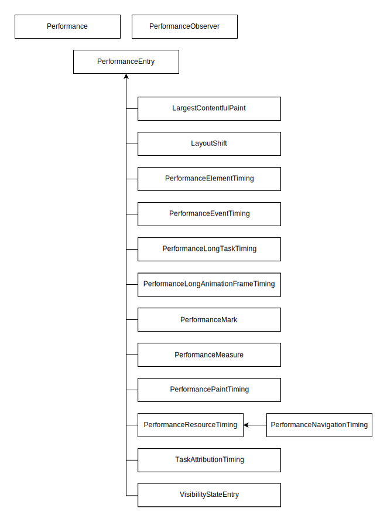

# Performance

## Performance 简介

Performance API 是一组用于衡量 web 应用性能的标准。衡量和分析各种性能指标对于确保 web 应用的速度非常重要。Performance API 提供了重要的内置指标，并能够将你自己的测量结果添加到浏览器的性能时间线（performance timeline）中。性能时间线使用高精度的时间戳，且可以在开发者工具中显示。你还可以将相关数据发送到用于分析的端点，以根据时间记录性能指标。

每一个性能指标都使用一个性能条目（PerformanceEntry）表示。性能条目有名称（name）、持续时间（duration）、开始时间（startTime）和类型（type）。每一个性能指标都继承了 PerformanceEntry 接口，并对其进行限定。

大部分性能条目都在不需要任何额外操作的情况下进行记录，并可以通过 Performance.getEntries() 或（最好）通过 PerformanceObserver 访问。例如，PerformanceEventTiming 条目用于记录花费的时间超过设定阈值的事件。而 Performance API 也允许你使用 PerformanceMark 和 PerformanceMeasure 接口定义和记录自定义事件。

Performance 主接口在 Window 和 Worker 全局作用域下都可用，并允许你增加自定义性能条目、清除性能条目，以及查询性能条目。

PerformanceObserver 接口允许你监听记录的不同类型的性能条目。

Performance 属性和方法：

- `eventCounts` PerformanceEventTiming 支持事件的 Map 结构的对象，但没有 set\delete\clear 方法。
- `now()` 从性能测量时刻开始经过的毫秒数
- `mark()` 根据给出 name 值，在浏览器的性能输入缓冲区中创建一个相关的 timestamp
- `measure()` 在浏览器的指定 start mark 和 end mark 间的性能输入缓冲区中创建一个指定的 timestamp
- `clearMarks()` 将给定的 mark 从浏览器的性能输入缓冲区中移除。
- `clearMeasures()` 将给定的 measure 从浏览器的性能输入缓冲区中移除。
- `clearResourceTiming()` 从浏览器的性能数据缓冲区中移除所有 entryType 是 "resource" 的 performance entries。
- `getEntries()` 基于给定的 filter 返回一个 PerformanceEntry 对象的列表。
- `getEntriesByName()` 基于给定的 name 和 entry type 返回一个 PerformanceEntry 对象的列表。
- `getEntriesByType()` 基于给定的 entry type 返回一个 PerformanceEntry 对象的列表
- `setResourceTimingBufferSize()` 将浏览器的资源 timing 缓冲区的大小设置为 "resource" type performance entry 对象的指定数量
- `toJSON()` 返回 Performance 对象的 JSON 对象
- `resourcetimingbufferfull事件` 在浏览器的资源计时缓冲区已满时触发。

```js
entries = window.performance.getEntriesByName(name, type);

function use_PerformanceEntry_methods() {
  log("PerformanceEntry tests ...");

  if (performance.mark === undefined) {
    log("... performance.mark Not supported");
    return;
  }

  // Create some performance entries via the mark() method
  performance.mark("Begin");
  do_work(50000);
  performance.mark("End");
  performance.mark("Begin");
  do_work(100000);
  performance.mark("End");
  do_work(200000);
  performance.mark("End");

  // Use getEntries() to iterate through the each entry
  var p = performance.getEntries();

  // Use getEntries(name, entryType) to get specific entries
  p = performance.getEntries({ name: "Begin", entryType: "mark" });

  // Use getEntriesByType() to get all "mark" entries
  p = performance.getEntriesByType("mark");

  // Use getEntriesByName() to get all "mark" entries named "Begin"
  p = performance.getEntriesByName("Begin", "mark");
}
```

## PerformanceObserver

监测性能度量事件，在浏览器的性能时间轴记录新的 performance entry 的时候将会被通知。

属性和方法：

- `supportedEntryTypes` 静态属性，返回支持的 entryTypes 列表
- `disconnect()` 阻止性能观察者接收任何 性能条目 事件。
- `observe(options)` 观察传入的参数中指定的性能条目类型的集合。当记录一个指定类型的性能条目时，性能监测对象的回调函数将会被调用。
  - entryTypes 数组
- `takeRecodes()` 返回当前存储在性能观察器中的性能条目列表，并将其清空

```js
PerformanceObserver.supportedEntryTypes;

// returns ["element", "event", "first-input", "largest-contentful-paint", "layout-shift", "long-animation-frame", "longtask", "mark", "measure", "navigation", "paint", "resource", "visibility-state"] in the main thread in Chrome 129
// returns ["mark", "measure", "resource"] in a worker thread in Chrome 129

if (PerformanceObserver.supportedEntryTypes.includes("resource")) {
  // 支持resource entrytype的逻辑
}

/**
 * @callback(list,obj) 当通过 observe() 方法注册的 条目类型 的 性能条目事件 被记录下来时，调用该观察者回调
 *  list PerformanceObserverEntryList对象，实例属性有
 *    getEntries()
 *    getEntriesByName()
 *    getEntriesByType()
 *  obj 观察者对象。
 * @return 新的 PerformanceObserver 对象
 */
var observer = new PerformanceObserver(callback);

var observer = new PerformanceObserver(function (list, observer) {
  var entries = list.getEntries();
  for (var i = 0; i < entries.length; i++) {
    // 处理逻辑
  }
  //停止记录性能条目
  observer.disconnect();
});
observer.observe({ entryTypes: ["mark", "frame", "measure"] });

var records = observer.takeRecords();
console.log(records[0].name);
console.log(records[0].startTime);
console.log(records[0].duration);

// Disable additional performance events
observer.disconnect();
```

## PerformanceEntry

PerformanceEntry 对象代表了 performance 时间列表中的单个 metric 数据。每一个 performance entry 都可以在应用运行过程中通过手动构建 mark 或者 measure (例如调用 mark() 方法) 生成。此外，Performance entries 在资源加载的时候，也会被动生成（例如图片、script、css 等资源加载）

Performance 对象暴露给了 Window 和 Worker. 同时该对象扩展了几个其他对象的属性，包括 PerformanceMark, PerformanceMeasure, PerformanceFrameTiming, PerformanceNavigationTiming 以及 PerformanceResourceTiming.

PerformanceEntry 属性和方法有：

- `name` performance entry 的名字
- `entryType` entryType 类型
  - `frame`
  - `navigation`
  - `resource`
  - `mark`
  - `measure`
  - `paint`
  - `frame`
- `startTime` 为 metric 上报时的时间
- `duration` 该事件的耗时
- `toJSON()` 返回 PerformanceEntry 对象的 JSON 格式数据

### VisibilityStateEntry

VisibilityStateEntry 接口提供页面可见性状态更改的时间，即当选项卡从前台更改为后台时，反之亦然。

这可用于精确定位性能时间轴上的可见性变化，并将其与其他性能条目（如 “first-contentful-paint”）进行交叉引用

```js
  const fcpEntry = performance.getEntriesByName("first-contentful-paint")[0];
  const visibilityStateEntries =
    performance.getEntriesByType("visibility-state")[0];
  console.log(visibilityStateEntries)

  // 输出：
  {
    //返回 或 。"visible""hidden"
    "name": "visible",
    "entryType": "visibility-state",
    //回可见性状态发生更改时的时间戳。
    "startTime": 0,
    // 返回0
    "duration": 0
}
```

## PerformanceResourceTiming

通过 Resource Timing API 可以获取和分析应用资源加载的详细网络计时数据，应用程序可以使用时间度量标准来确定加载特定资源所需要的时间，比如 XMLHttpRequest、`<SVG>`、图片，或者脚本。

Resource Timing API 为网络事件（如重定向的开始和结束事件、DNS 查找的开始和结束事件、请求开始、响应开始和结束时间等）生成有高分辨率时间戳（high-resolution timestamp）的资源加载时间线，并提供了资源大小和资源类型。
PerformanceResourceTiming 接口只统计 performance entries 中 entryType 为 resource 类型的 PerformanceEntry。应用程序可以获得用于加载资源的各个阶段的时间戳:

- `startTime` 它在资源加载过程开始之前立即返回时间
- `fetchStart` 跟踪和重定向处理（如果适用），并在 DNS 查找之前进行
- `connectStart` 开始连接到服务器
- `secureConnectStart` https 开始连接到服务器
- `connectEnd` 连接建立完成的时间戳
- `requestStart` 在浏览器开始向服务器请求资源时
- `responseSart` 资源请求首包返回时
- `responseEnd` 资源全部接收完成时
-

```js
  const performanceResourceTimingEntry = performance.getEntriesByType('resource')[0];
console.log(performanceResourceTimingEntry);
    // PerformanceResourceTiming {
    //   connectEnd: 138.11499997973442
    //   connectStart: 138.11499997973442
    //   decodedBodySize: 33808
    //   domainLookupEnd: 138.11499997973442
    //   domainLookupStart: 138.11499997973442
    //   duration: 0
    //   encodedBodySize: 33808
    //   entryType: "resource"
    //   fetchStart: 138.11499997973442
    //   initiatorType: "link"
    //   name: "https://static.foo.com/bar.png",
    //   nextHopProtocol: "h2"
    //   redirectEnd: 0
    //   redirectStart: 0
    //   requestStart: 138.11499997973442
    //   responseEnd: 138.11499997973442
    //   responseStart: 138.11499997973442
    //   secureConnectionStart: 0
    //   serverTiming: []
    //   startTime: 138.11499997973442
    //   transferSize: 0
    //   workerStart: 0
    // }
console.log(performanceResourceTimingEntry.responseEnd – performanceResourceTimingEntry.requestStart);
    // 493.9600000507198
```

## PerformanceLongTaskTiming

告诉我们哪些任务执行耗费了 50 毫秒或更多时间

```js
var observer = new PerformanceObserver(function (list) {
  var perfEntries = list.getEntries();
  // var perfEntries = list.getEntriesByName();
  // var perfEntries = list.getEntriesByType();
  for (var i = 0; i < perfEntries.length; i++) {
    console.log(perfEntries);
  }
});

observer.observe({ entryTypes: ["longtask"] });
```

## PerformanceLongAnimationFrameTiming

长时间动画帧（或 LoAF）是指渲染更新延迟超过 50 毫秒的情况。良好的响应性意味着页面对交互的反应速度很快。这涉及及时绘制用户所需的所有更新，并避免任何可能阻止这些更新的操作。长时间动画帧 (LoAFs) 会影响网站的用户体验。它们会导致用户界面 (UI) 更新缓慢，从而导致控件看似无响应，动画效果和滚动出现卡顿（或不流畅），进而导致用户感到沮丧。 长时间动画帧 API 允许开发人员获取有关长时间动画帧的信息，并更好地了解其根本原因。

为了获取有关 LoAF 的信息并确定问题所在，可以使用标准的 PerformanceObserver 观察具有 "long-animation-frame" 的 entryType 的性能时间轴条目。也可以使用诸如 Performance.getEntriesByType() 之类的方法查询以前的长时间动画帧。

> 但是要注意，"long-animation-frame" 条目类型的最大缓冲区大小为 200，超过此大小后，新的条目将被丢弃，因此建议使用 PerformanceObserver 方法。

```js
const loafs = performance.getEntriesByType("long-animation-frame");

// 长时间动画帧 API 特性检测
if (PerformanceObserver.supportedEntryTypes.includes("long-animation-frame")) {
  // 报告超过特定阈值&包含交互的 LoAF
  const REPORTING_THRESHOLD_MS = 150;
  const observer = new PerformanceObserver((list) => {
    for (const entry of list.getEntries()) {
      if (entry.duration > && entry.firstUIEventTimestamp > 0) {
        // Example here logs to console; real code could send to analytics endpoint
        console.log(entry);
      }
    }
  });

  observer.observe({ type: "long-animation-frame", buffered: true });
}
// 下是一个包含单个脚本的完整 "long-animation-frame" 性能条目示例的 JSON 表示形式
{
  // 表示主线程被阻止响应高优先级任务（例如用户输入）的总时间（毫秒）。它是通过获取 LoAF 中所有 duration 大于 50ms 的 长时间任务，从每个任务中减去 50ms，然后将结果相加计算得出的。
  "blockingDuration": 0,
  "duration": 60,
  "entryType": "long-animation-frame",
  // 表示当前动画帧期间排队的第一个 UI 事件（例如鼠标或键盘事件）的时间。
  "firstUIEventTimestamp": 11801.099999999627,
  "name": "long-animation-frame",
  // 表示渲染周期的开始时间，包括 Window.requestAnimationFrame() 回调、样式和布局计算、ResizeObserver 回调和 IntersectionObserver 回调。
  "renderStart": 11858.800000000745,
  // PerformanceScriptTiming对象：提供有关导致 LoAF 的脚本的信息的属性
  "scripts": [
    {
      "duration": 45,
      "entryType": "script",
      // 表示脚本编译完成并开始执行的时间。
      "executionStart": 11803.199999999255,
      //脚本处理强制布局/样式所花费的总时间（毫秒）
      "forcedStyleAndLayoutDuration": 0,
      // 字符串值，表示脚本是如何调用的
      "invoker": "DOMWindow.onclick",
      // 入口点类型
      "invokerType": "event-listener",
      "name": "script",
      // 脚本在“暂停”同步操作（例如，Window.alert() 调用或同步 XMLHttpRequest）上花费的总时间（毫秒）。
      "pauseDuration": 0,
      // 脚本 URL
      "sourceURL": "https://web.dev/js/index-ffde4443.js",
      // 函数名称
      "sourceFunctionName": "myClickHandler",
      // 脚本字符位置
      "sourceCharPosition": 17796,
      "startTime": 11803.199999999255,
      // 对它的 Window 对象的引用
      "window": [Window object],
      //执行此脚本的容器（即顶层文档或 <iframe>）与顶层文档的关系
      "windowAttribution": "self"
    }
  ],
  // startTime
  "startTime": 11802.400000000373,
  // 当前动画帧中样式和布局计算所花费时间的开始时间。
  "styleAndLayoutStart": 11858.800000000745
}
```

| 计时                 | 计算                                                                   |
| -------------------- | ---------------------------------------------------------------------- |
| 开始时间             | startTime                                                              |
| 结束时间             | startTime + duration                                                   |
| 工作时长             | renderStart ? renderStart - startTime : duration                       |
| 渲染时长             | renderStart ? (startTime + duration) - renderStart: 0                  |
| 渲染：预布局时长     | styleAndLayoutStart ? styleAndLayoutStart - renderStart : 0            |
| 渲染：样式和布局时长 | styleAndLayoutStart ? (startTime + duration) - styleAndLayoutStart : 0 |

## PerformanceNavigationTiming

PerformanceNavigationTiming 提供了用于存储和检索有关浏览器文档事件的指标的方法和属性。例如，此接口可用于确定加载或卸载文档需要多少时间。

性能时间线中只包含当前文档，因此性能时间线中只有一个 PerformanceNavigationTiming 对象。它继承了 PerformanceResourceTiming 和 PerformanceEntry 的所有属性和方法。

```js
{
    "name": "https://developer.mozilla.org/zh-CN/docs/Web/API/PerformanceEntry",
    "entryType": "navigation",
    "startTime": 0,
    "duration": 734.1999999284744,
    "initiatorType": "navigation",
    "deliveryType": "",
    "nextHopProtocol": "h2",
    "renderBlockingStatus": "non-blocking",
    "workerStart": 0,
    "redirectStart": 0,
    "redirectEnd": 0,
    "fetchStart": 8.699999928474426,
    "domainLookupStart": 8.699999928474426,
    "domainLookupEnd": 8.699999928474426,
    "connectStart": 8.699999928474426,
    "secureConnectionStart": 8.699999928474426,
    "connectEnd": 8.699999928474426,
    "requestStart": 20,
    "responseStart": 248.59999990463257,
    "firstInterimResponseStart": 0,
    "responseEnd": 258.6999999284744,
    "transferSize": 14524,
    "encodedBodySize": 14224,
    "decodedBodySize": 56569,
    "responseStatus": 200,
    "serverTiming": [],
    // 当前文档的 unload 事件处理程序开始的时间。
    "unloadEventStart": 0,
    // 当前文档的 unload 事件处理程序结束的时间
    "unloadEventEnd": 0,
    // 用户代理将文档的 readyState 设置为 "interactive" 的时间。
    "domInteractive": 428.89999997615814,
    // 当前文档的 DOMContentLoaded 事件处理器开始的时间。
    "domContentLoadedEventStart": 522.8999999761581,
    // 当前文档的 DOMContentLoaded 事件处理器结束的时间。
    "domContentLoadedEventEnd": 523.3999999761581,
    // 用户代理将文档的 readyState 设置为 "complete" 的时间。
    "domComplete": 733.6999999284744,
    // 当前文档的 load 事件处理器开始的时间。
    "loadEventStart": 734,
    // 当前文档的 load 事件处理器结束的时间。
    "loadEventEnd": 734.1999999284744,
    // 导航类型的字符串，取值为："navigate"、"reload"、"back_forward" 或 "prerender"。
    "type": "navigate",
    //表示在当前浏览上下文中上次非重定向导航以来的重定向次数的数字。
    "redirectCount": 0,
    "activationStart": 0,
    "criticalCHRestart": 0,
    "notRestoredReasons": null
}
```

## PerformanceMark & PerformanceMeasure

mark() 方法在浏览器的性能缓冲区中使用给定名称添加一个 timestamp(时间戳) 。

measure() 方法在浏览器性能记录缓存中创建了一个名为时间戳的记录来记录两个特殊标志位（通常称为开始标志和结束标志）。被命名的时间戳称为一次测量（measure）。

应用定义的时间戳可以通过 Performance 接口的一个 getEntries\*() 方法 (getEntries(), getEntriesByName() 或者 getEntriesByType()) 检索到。

```js
mark(name)
mark(name, markOptions)

measure(measureName)
measure(measureName, startMark)
measure(measureName, startMark, endMark)
measure(measureName, measureOptions)
measure(measureName, measureOptions, endMark)
// 以一个标志开始。
performance.mark("mySetTimeout-start");

// 等待一些时间。
setTimeout(function () {
  // 标志时间的结束。
  performance.mark("mySetTimeout-end");

  // 测量两个不同的标志。
  performance.measure("mySetTimeout", "mySetTimeout-start", "mySetTimeout-end");

  // 获取所有的测量输出。
  // 在这个例子中只有一个。
  var measures = performance.getEntriesByName("mySetTimeout");
  var measure = measures[0];
  console.log("setTimeout milliseconds:", measure);

  // 清除存储的标志位
  performance.clearMarks();
  performance.clearMeasures();
}, 1000);
// 输出结果
{
    "name": "mySetTimeout",
    "entryType": "measure",
    "startTime": 231319.39999997616,
    "duration": 1004.3999999761581
}
```

## PerformancePaintTiming

Paint Timing API 提供的 PerformancePaintTiming 是一个提供页面在构建过程中的“绘制”（也称“渲染”）时间点信息的接口。“绘制”是指将渲染树转换为页面上像素的过程。

应用可以为名为“paint”的 performance entry 类型 注册一个 PerformanceObserver，然后观察者可以获取绘制相关的事件发生的时间。以此来帮你找出那些花费太多时间去绘制的区域，而后提升用户体验。

- First paint （FP）（第一次绘制 （FP）：渲染任何内容的时间。请注意，第一次绘制的标记是可选的，并非所有用户代理都会报告它。
- First-contentful-paint 首次内容绘制 （FCP）：呈现 DOM 文本或图像内容的第一位的时间。
- largest-contentful-paint 最大内容绘制 （LCP）：提供视区中可见的最大图像或文本块的渲染时间，从页面首次开始加载时开始记录。

首次绘制和首次内容绘制：

```js
function showPaintTimings() {
  if (window.performance) {
    let performance = window.performance;
    // 返回 "first-paint" 或"first-contentful-paint".
    let performanceEntries = performance.getEntriesByType("paint");
    performanceEntries.forEach((performanceEntry, i, entries) => {
      console.log(performanceEntry);
    });
  } else {
    console.log("Performance timing isn't supported.");
  }
}

// 输出信息：
[
  {
    name: "first-paint",
    entryType: "paint",
    startTime: 785.3999999761581,
    duration: 0,
  },
  {
    name: "first-contentful-paint",
    entryType: "paint",
    startTime: 785.3999999761581,
    duration: 0,
  },
];
```

最大内容绘制：LargestContentfulPaint

```js
const observer = new PerformanceObserver((list) => {
  const entries = list.getEntries();
  const lastEntry = entries[entries.length - 1]; // Use the latest LCP candidate
  console.log("LCP:", lastEntry.startTime);
  console.log(lastEntry);
});
observer.observe({ type: "largest-contentful-paint", buffered: true });

// 输出结果：
{
    "name": "",
    //当前最大的内容绘制的元素
    "element": [p],
    "entryType": "largest-contentful-paint",
    "startTime": 704.8999999761581,
    "duration": 0,
    //以面积 （宽度 * 高度） 返回的元素的固有大小。
    "size": 53969,
    //元素呈现到屏幕的时间。如果元素是加载的跨域图像，要公开跨域渲染时间信息，需要设置 Timing-Allow-Origin HTTP 响应标头
    "renderTime": 704.8999999761581,
    //加载元素的时间。
    "loadTime": 0,
    "firstAnimatedFrameTime": 0,
    //元素的 ID。当没有 id 时，此属性返回空字符串。
    "id": "",
    //如果元素是图像，则为图像的请求 URL。
    "url": ""
}
```

## PerformanceEventTiming

Event Timing API 的界面提供了对用户交互触发的某些事件类型的延迟的见解。PerformanceEventTiming。此 API 通过为某些事件类型提供事件时间戳和持续时间，实现对慢速事件的可见性。例如，您可以监视用户操作与其事件处理程序启动之间的时间，或者事件处理程序运行所花费的时间。

此 API 对于测量首次输入延迟 （FID） 特别有用：从用户首次与您的应用程序交互到浏览器实际能够响应该交互的时间。

通常，通过创建 PerformanceObserver 实例，然后调用其 observe（） 方法，传入 type 选项的值 或 作为值来处理对象。

事件计时 API 公开了以下事件类型：
|事件类型|包含的事件|
|------|----------|
|点击事件|auxclick click dbclick contentmenu|
|合成事件|compositionstart compositionupdate compositionend|
|拖放事件|dragstart dratend dragenter dragover dragleave drop|
|输入事件|beforeinput input|
|键盘事件|keypress keydown keyup|
|鼠标事件|mousedown mouseup mouseout mouseenter mouseover mouseleave|
|指针事件|pointerover pointerenter pointerdown pointerup pointercancel pointerout pointerleave gotpointercapture lostpointercapture|
|触摸事件|touchstart touchend touchcancel|

> 请注意，以下事件不包括在列表中，因为它们是连续事件，此时无法获得有意义的事件计数或性能指标：mousemove、pointermove、pointerrawupdate、touchmove、wheel、drag。

```js
const observer = new PerformanceObserver((list) => {
  list.getEntries().forEach((entry) => {
    const duration = entry.duration;

    // 输入延迟时间：从用户交互到事件处理器响应之前
    const delay = entry.processingStart - entry.startTime;

    // 事件处理程序运行所花费的时间（同步任务）
    const eventHandlerTime = entry.processingEnd - entry.processingStart;
    console.log(`Total duration: ${duration}`);
    console.log(`Event delay: ${delay}`);
    console.log(`Event handler duration: ${eventHandlerTime}`);
    console.log(entry);
  });
});

// Register the observer for events
observer.observe({ type: "event", buffered: true });

//输出entry
{
    // 返回关联事件的类型。
    "name": "pointerover",
    // 返回 （对于长事件） 或 （对于第一次用户交互）。"event""first-input"
    "entryType": "event",
    "startTime": 428.7999999523163,
    "duration": 296,
    //返回唯一标识触发关联事件的用户交互的 ID
    "interactionId": 0,
    //它表示事件调度开始的时间
    "processingStart": 443.60000002384186,
    //表示事件调度结束的时间
    "processingEnd": 443.60000002384186,
    //返回关联事件的 cancelable 属性。
    "cancelable": true,
    // 返回关联事件的最后一个目标（如果未删除）
    "target":[body]
}
```

## PerformanceServerTiming

PerformanceServerTiming 接口显示与 Server-Timing HTTP 标头中的响应一起发送的服务器指标。

此接口仅限于同一源，但您可以使用 Timing-Allow-Origin 标头指定允许访问服务器指标的域。请注意，此接口仅在某些浏览器的安全上下文 （HTTPS） 中可用。

> 功能仅在安全上下文 （HTTPS） 中可用，此功能在 Web Worker 中可用。

给定一个发送 Server-Timing 标头的服务器，例如一个 Node.js 服务器，如下所示：

```js
const http = require("http");

function requestHandler(request, response) {
  const headers = {
    "Server-Timing": `
      cache;desc="Cache Read";dur=23.2,
      db;dur=53,
      app;dur=47.2
    `.replace(/\n/g, ""),
  };
  response.writeHead(200, headers);
  response.write("");
  return setTimeout(() => {
    response.end();
  }, 1000);
}

http.createServer(requestHandler).listen(3000).on("error", console.error);
```

使用 PerformanceObserver 的示例，当新条目和性能条目记录在浏览器的性能时间线中时，它会通知它们。使用该选项可访问创建观察者之前的条目。

```js
const observer = new PerformanceObserver(list => {
  list.getEntries().forEach(entry => {
    entry.serverTiming.forEach(serverEntry => {
      console.log(
        `${serverEntry.name} (${serverEntry.description}) duration: ${serverEntry.duration}`
      );
      // Logs "cache (Cache Read) duration: 23.2"
      // Logs "db () duration: 53"
      // Logs "app () duration: 47.2"
    });
  });
});

["navigation", "resource"].forEach(type =>
  observer.observe({ type, buffered: true })
);

// 使用 Performance.getEntriesByType（）
for (const entryType of ["navigation", "resource"]) {
  for (const { name: url, serverTiming } of performance.getEntriesByType(
    entryType
  )) {
    if (serverTiming) {
      for (const { name, description, duration } of serverTiming) {
        console.log(`${name} (${description}) duration: ${duration}`);
        // Logs "cache (Cache Read) duration: 23.2"
        // Logs "db () duration: 53"
        // Logs "app () duration: 47.2"
      }
    }
  }
}
```

## LayoutShift 布局偏移

当视区中可见的任何元素在两个帧之间更改其位置时，就会发生布局偏移。这些元素被描述为不稳定，表明缺乏视觉稳定性。

Layout Instability API 提供了一种衡量和报告这些布局偏移的方法。所有用于调试布局偏移的工具（包括浏览器的开发人员工具中的工具）都使用此 API。该 API 还可用于观察和调试布局偏移，方法是将信息记录到控制台，将数据发送到服务器终端节点或网页分析。

LayoutShift 接口（属于性能 API）可用于测量单个布局偏移，然后用于计算网页的 CLS 分数。累计布局偏移（CLS）是一种由 Google 设计为核心 Web 要素之一的网站的可用性指标。它可以衡量用户遇到意外布局偏移的程度。这里元素的意外偏移指不是由用户操作（如点按按钮或动画的一部分）引起的偏移。布局偏移可能是由于未给定 width 和 height 属性的 ` 或 <video>` 元素引起的，因此浏览器在加载它们之前不知道它们将占用多少空间。

```js
const observer = new PerformanceObserver((list) => {
  for (const entry of list.getEntries()) {
    // Count layout shifts without recent user input only
    if (!entry.hadRecentInput) {
      console.log("LayoutShift value:", entry.value);
      if (entry.sources) {
        for (const { node, currentRect, previousRect } of entry.sources)
          console.log("LayoutShift source:", node, {
            currentRect,
            previousRect,
          });
      }
    }
    console.log(entry)
  }
});

observer.observe({ type: "layout-shift", buffered: true });

// 输出LayoutShift信息
{
    //总是返回 。"layout-shift"
    "name": "",
    //总是返回 。"layout-shift"
    "entryType": "layout-shift",
    // 表示布局偏移开始的时间。
    "startTime": 4850.199999928474,
    //始终返回（持续时间的概念不适用于布局偏移）。0
    "duration": 0,
    //返回布局偏移分数，计算方式为影响分数（移动的视区分数）乘以距离分数（作为视区分数移动的距离）
    "value": 0.006128273357090461,
    //如果 lastInputTime 小于 500 毫秒，则返回。true
    "hadRecentInput": false,
    //返回最近排除输入的时间（用户输入会将此条目排除为 CLS 分数的贡献者），或者如果未发生排除输入。0
    "lastInputTime": 2673.6999999284744,
    //返回一个 LayoutShiftAttribution 对象数组，其中包含有关已移动元素的信息。
    "sources": [
        {
            "previousRect": {
                "x": 1305,
                "y": 1802,
                "width": 1300,
                "height": 24,
                "top": 1802,
                "right": 2605,
                "bottom": 1826,
                "left": 1305
            },
            "currentRect": {
                "x": 1305,
                "y": 1802,
                "width": 1300,
                "height": 24,
                "top": 1802,
                "right": 2605,
                "bottom": 1826,
                "left": 1305
            }
        }
    ]
}
```
