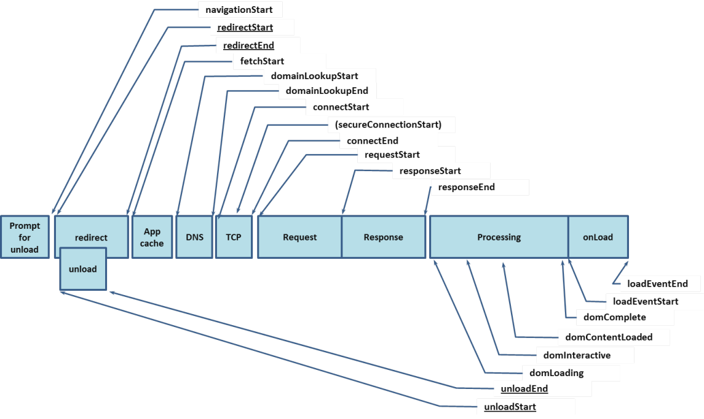

# Performance API 开发指南

Performance API 是一组用于衡量 Web 应用性能的标准。本文档详细介绍了 Performance API 的各种接口和功能，帮助开发者构建高性能的 Web 应用。

## 目录导航

1. [概述与基础概念](#1-概述与基础概念)
2. [Performance 主接口](#2-performance-主接口)
3. [PerformanceObserver 监听器](#3-performanceobserver-监听器)
4. [PerformanceEntry 条目对象](#4-performanceentry-条目对象)
5. [PerformanceResourceTiming 资源时序](#5-performanceresourcetiming-资源时序)
6. [PerformancePaintTiming 绘制时序](#6-performancepainttiming-绘制时序)
7. [PerformanceEventTiming 事件时序](#7-performanceeventtiming-事件时序)
8. [PerformanceServerTiming 服务器时序](#8-performanceservertiming-服务器时序)
9. [LayoutShift 布局偏移](#9-layoutshift-布局偏移)

## 1. 概述与基础概念

### 1.1 什么是 Performance API

Performance API 是一组用于衡量 Web 应用性能的标准。它提供了重要的内置指标，并能够将自定义的测量结果添加到浏览器的性能时间线（Performance Timeline）中。

### 1.2 性能时间线结构



每一个性能指标都使用一个性能条目（PerformanceEntry）表示。性能条目有以下核心属性：

- **name**：性能条目的名称
- **duration**：持续时间
- **startTime**：开始时间
- **type**：条目类型

### 1.3 Performance API 架构


Performance 主接口在 Window 和 Worker 全局作用域下都可用，允许开发者：

- 添加自定义性能条目
- 清除性能条目
- 查询性能条目
- 监听性能事件

## 2. Performance 主接口

### 2.1 属性和方法概览

| 属性/方法 | 类型 | 描述 |
|----------|------|------|
| `eventCounts` | 属性 | PerformanceEventTiming 支持事件的 Map 结构对象 |
| `now()` | 方法 | 返回从性能测量时刻开始经过的毫秒数 |
| `mark()` | 方法 | 在性能缓冲区中创建标记 |
| `measure()` | 方法 | 在指定标记间创建测量 |
| `clearMarks()` | 方法 | 清除指定标记 |
| `clearMeasures()` | 方法 | 清除指定测量 |
| `clearResourceTiming()` | 方法 | 清除资源时序条目 |
| `getEntries()` | 方法 | 获取所有性能条目 |
| `getEntriesByName()` | 方法 | 根据名称获取条目 |
| `getEntriesByType()` | 方法 | 根据类型获取条目 |
| `setResourceTimingBufferSize()` | 方法 | 设置资源时序缓冲区大小 |
| `toJSON()` | 方法 | 返回 JSON 表示 |

### 2.2 基本使用示例

```javascript
/**
 * 性能条目操作示例
 */
function usePerformanceEntryMethods() {
  console.log("PerformanceEntry tests ...");

  if (performance.mark === undefined) {
    console.log("... performance.mark Not supported");
    return;
  }

  // 创建性能标记
  performance.mark("Begin");
  doWork(50000);
  performance.mark("End");
  
  performance.mark("Begin");
  doWork(100000);
  performance.mark("End");
  
  doWork(200000);
  performance.mark("End");

  // 使用 getEntries() 遍历每个条目
  const entries = performance.getEntries();
  console.log("All entries:", entries);

  // 获取特定条目
  const specificEntries = performance.getEntries({ 
    name: "Begin", 
    entryType: "mark" 
  });
  console.log("Specific entries:", specificEntries);

  // 按类型获取条目
  const markEntries = performance.getEntriesByType("mark");
  console.log("Mark entries:", markEntries);

  // 按名称获取条目
  const beginEntries = performance.getEntriesByName("Begin", "mark");
  console.log("Begin entries:", beginEntries);
}

/**
 * 模拟工作负载
 */
function doWork(iterations) {
  for (let i = 0; i < iterations; i++) {
    // 模拟工作
  }
}
```

### 2.3 获取性能条目

```javascript
/**
 * 获取性能条目的不同方式
 */
const entries = window.performance.getEntriesByName(name, type);

// 获取所有条目
const allEntries = performance.getEntries();

// 获取特定类型的条目
const resourceEntries = performance.getEntriesByType("resource");

// 获取特定名称的条目
const specificEntries = performance.getEntriesByName("example", "mark");
```

## 3. PerformanceObserver 监听器

### 3.1 基本概念

PerformanceObserver 用于监测性能度量事件，在浏览器的性能时间轴记录新的 Performance Entry 时会被通知。

### 3.2 属性和方法

| 属性/方法 | 类型 | 描述 |
|----------|------|------|
| `supportedEntryTypes` | 静态属性 | 返回支持的 entryTypes 列表 |
| `disconnect()` | 方法 | 停止接收性能条目事件 |
| `observe(options)` | 方法 | 开始观察指定类型的性能条目 |
| `takeRecords()` | 方法 | 获取并清空当前存储的性能条目 |

### 3.3 支持的条目类型

```javascript
// 检查支持的条目类型
console.log(PerformanceObserver.supportedEntryTypes);

// 主线程中 Chrome 129 的返回值示例：
// ["element", "event", "first-input", "largest-contentful-paint", 
//  "layout-shift", "long-animation-frame", "longtask", "mark", 
//  "measure", "navigation", "paint", "resource", "visibility-state"]

// Worker 线程中 Chrome 129 的返回值示例：
// ["mark", "measure", "resource"]

// 检查是否支持特定类型
if (PerformanceObserver.supportedEntryTypes.includes("resource")) {
  // 支持 resource entryType 的逻辑
  console.log("Resource timing is supported");
}
```

### 3.4 创建和使用观察者

```javascript
/**
 * 创建性能观察者
 * @param {Function} callback - 回调函数
 * @param {Object} list - PerformanceObserverEntryList 对象
 * @param {Object} observer - 观察者对象
 */
const observer = new PerformanceObserver(function(list, observer) {
  const entries = list.getEntries();
  
  for (let i = 0; i < entries.length; i++) {
    const entry = entries[i];
    console.log(`Entry: ${entry.name}, Duration: ${entry.duration}`);
  }
  
  // 停止记录性能条目
  observer.disconnect();
});

// 开始观察
observer.observe({ entryTypes: ["mark", "measure", "navigation"] });

// 获取记录的条目
const records = observer.takeRecords();
if (records.length > 0) {
  console.log("First record name:", records[0].name);
  console.log("First record start time:", records[0].startTime);
  console.log("First record duration:", records[0].duration);
}

// 停止观察
observer.disconnect();
```

## 4. PerformanceEntry 条目对象

### 4.1 基本概念

PerformanceEntry 对象代表了性能时间列表中的单个度量数据。每个性能条目都可以通过手动构建标记或测量生成，也可以在资源加载时被动生成。

### 4.2 核心属性

| 属性 | 类型 | 描述 |
|------|------|------|
| `name` | String | 性能条目的名称 |
| `entryType` | String | 条目类型 |
| `startTime` | Number | 度量开始时间 |
| `duration` | Number | 事件持续时间 |

### 4.3 条目类型

- `frame` - 帧时序
- `navigation` - 导航时序
- `resource` - 资源时序
- `mark` - 标记
- `measure` - 测量
- `paint` - 绘制时序
- `event` - 事件时序

### 4.4 VisibilityStateEntry 可见性状态条目

```javascript
/**
 * 监听页面可见性状态变化
 */
const fcpEntry = performance.getEntriesByName("first-contentful-paint")[0];
const visibilityStateEntries = performance.getEntriesByType("visibility-state")[0];

console.log("Visibility state entry:", visibilityStateEntries);

// 输出示例：
// {
//   "name": "visible",           // 返回 "visible" 或 "hidden"
//   "entryType": "visibility-state",
//   "startTime": 0,             // 可见性状态发生更改时的时间戳
//   "duration": 0               // 总是返回 0
// }
```

## 5. PerformanceResourceTiming 资源时序

### 5.1 概述

Resource Timing API 提供了获取和分析应用资源加载详细网络时序数据的能力。它为网络事件生成高分辨率时间戳，提供资源加载时间线。

### 5.2 时序阶段

```javascript
/**
 * 资源时序的各个阶段
 */
const resourceTiming = performance.getEntriesByType('resource')[0];

console.log("Resource timing details:", {
  // 资源加载开始时间
  startTime: resourceTiming.startTime,
  
  // 获取开始时间（包含重定向和DNS查找）
  fetchStart: resourceTiming.fetchStart,
  
  // 域名查找开始时间
  domainLookupStart: resourceTiming.domainLookupStart,
  domainLookupEnd: resourceTiming.domainLookupEnd,
  
  // 连接开始和结束时间
  connectStart: resourceTiming.connectStart,
  connectEnd: resourceTiming.connectEnd,
  
  // HTTPS 连接开始时间
  secureConnectionStart: resourceTiming.secureConnectionStart,
  
  // 请求开始时间
  requestStart: resourceTiming.requestStart,
  
  // 响应开始和结束时间
  responseStart: resourceTiming.responseStart,
  responseEnd: resourceTiming.responseEnd,
  
  // 资源大小信息
  decodedBodySize: resourceTiming.decodedBodySize,
  encodedBodySize: resourceTiming.encodedBodySize,
  transferSize: resourceTiming.transferSize
});
```

### 5.3 资源时序示例

```javascript
/**
 * 获取资源时序信息
 */
const performanceResourceTimingEntry = performance.getEntriesByType('resource')[0];
console.log(performanceResourceTimingEntry);

// 输出示例：
// {
//   connectEnd: 138.11499997973442,
//   connectStart: 138.11499997973442,
//   decodedBodySize: 33808,
//   domainLookupEnd: 138.11499997973442,
//   domainLookupStart: 138.11499997973442,
//   duration: 0,
//   encodedBodySize: 33808,
//   entryType: "resource",
//   fetchStart: 138.11499997973442,
//   initiatorType: "link",
//   name: "https://static.example.com/image.png",
//   nextHopProtocol: "h2",
//   redirectEnd: 0,
//   redirectStart: 0,
//   requestStart: 138.11499997973442,
//   responseEnd: 138.11499997973442,
//   responseStart: 138.11499997973442,
//   secureConnectionStart: 0,
//   serverTiming: [],
//   startTime: 138.11499997973442,
//   transferSize: 0,
//   workerStart: 0
// }
```

## 6. PerformancePaintTiming 绘制时序

### 6.1 概述

Paint Timing API 提供页面在构建过程中的"绘制"时间点信息。绘制是指将渲染树转换为页面像素的过程。

### 6.2 绘制类型

- **First Paint (FP)**：首次绘制任何内容的时间
- **First Contentful Paint (FCP)**：首次绘制 DOM 文本或图像内容的时间
- **Largest Contentful Paint (LCP)**：最大内容绘制时间

### 6.3 首次绘制和首次内容绘制

```javascript
/**
 * 获取绘制时序信息
 */
function showPaintTimings() {
  if (window.performance) {
    const performance = window.performance;
    
    // 获取绘制相关的性能条目
    const performanceEntries = performance.getEntriesByType("paint");
    
    performanceEntries.forEach((entry, index) => {
      console.log(`Paint entry ${index}:`, entry);
    });
  } else {
    console.log("Performance timing isn't supported.");
  }
}

// 调用函数
showPaintTimings();

// 输出示例：
// [
//   {
//     name: "first-paint",
//     entryType: "paint",
//     startTime: 785.3999999761581,
//     duration: 0
//   },
//   {
//     name: "first-contentful-paint",
//     entryType: "paint",
//     startTime: 785.3999999761581,
//     duration: 0
//   }
// ]
```

### 6.4 最大内容绘制（LCP）

```javascript
/**
 * 监听最大内容绘制事件
 */
const lcpObserver = new PerformanceObserver((list) => {
  const entries = list.getEntries();
  const lastEntry = entries[entries.length - 1]; // 使用最新的 LCP 候选
  
  console.log("LCP:", lastEntry.startTime);
  console.log("LCP details:", lastEntry);
});

lcpObserver.observe({ 
  type: "largest-contentful-paint", 
  buffered: true 
});

// 输出示例：
// {
//   "name": "",
//   "element": [object HTMLElement],     // 当前最大内容绘制的元素
//   "entryType": "largest-contentful-paint",
//   "startTime": 704.8999999761581,
//   "duration": 0,
//   "size": 53969,                       // 元素固有大小（宽度 * 高度）
//   "renderTime": 704.8999999761581,     // 元素渲染到屏幕的时间
//   "loadTime": 0,                       // 元素加载时间
//   "firstAnimatedFrameTime": 0,
//   "id": "",                            // 元素的 ID
//   "url": ""                            // 如果是图像，则为图像 URL
// }
```

## 7. PerformanceEventTiming 事件时序

### 7.1 概述

Event Timing API 提供了对用户交互触发的某些事件类型延迟的深入了解。此 API 对于测量首次输入延迟（FID）特别有用。

### 7.2 支持的事件类型

| 事件类型 | 包含的事件 |
|----------|------------|
| 点击事件 | auxclick, click, dblclick, contextmenu |
| 合成事件 | compositionstart, compositionupdate, compositionend |
| 拖放事件 | dragstart, dragend, dragenter, dragover, dragleave, drop |
| 输入事件 | beforeinput, input |
| 键盘事件 | keypress, keydown, keyup |
| 鼠标事件 | mousedown, mouseup, mouseout, mouseenter, mouseover, mouseleave |
| 指针事件 | pointerover, pointerenter, pointerdown, pointerup, pointercancel, pointerout, pointerleave, gotpointercapture, lostpointercapture |
| 触摸事件 | touchstart, touchend, touchcancel |

> 注意：以下连续事件不包括在列表中：mousemove、pointermove、pointerrawupdate、touchmove、wheel、drag

### 7.3 事件时序监听

```javascript
/**
 * 监听事件时序
 */
const eventObserver = new PerformanceObserver((list) => {
  list.getEntries().forEach((entry) => {
    // 总持续时间
    const duration = entry.duration;
    
    // 输入延迟时间：从用户交互到事件处理器响应之前
    const delay = entry.processingStart - entry.startTime;
    
    // 事件处理程序运行时间（同步任务）
    const eventHandlerTime = entry.processingEnd - entry.processingStart;
    
    console.log(`Event: ${entry.name}`);
    console.log(`Total duration: ${duration}ms`);
    console.log(`Input delay: ${delay}ms`);
    console.log(`Event handler duration: ${eventHandlerTime}ms`);
    console.log("Full entry:", entry);
  });
});

// 注册事件观察者
eventObserver.observe({ type: "event", buffered: true });

// 输出条目示例：
// {
//   "name": "pointerover",               // 关联事件的类型
//   "entryType": "event",                // 条目类型
//   "startTime": 428.7999999523163,
//   "duration": 296,
//   "interactionId": 0,                  // 用户交互的唯一标识符
//   "processingStart": 443.60000002384186,  // 事件调度开始时间
//   "processingEnd": 443.60000002384186,    // 事件调度结束时间
//   "cancelable": true,                  // 事件的 cancelable 属性
//   "target": [object HTMLElement]       // 事件的最后目标
// }
```

## 8. PerformanceServerTiming 服务器时序

### 8.1 概述

PerformanceServerTiming 接口显示与 Server-Timing HTTP 标头中响应一起发送的服务器指标。

> 注意：此功能仅在安全上下文（HTTPS）中可用，并且在 Web Worker 中也可用。

### 8.2 服务器端设置

```javascript
/**
 * Node.js 服务器示例
 */
const http = require("http");

function requestHandler(request, response) {
  const headers = {
    "Server-Timing": `
      cache;desc="Cache Read";dur=23.2,
      db;dur=53,
      app;dur=47.2
    `.replace(/\n/g, ""),
  };
  
  response.writeHead(200, headers);
  response.write("");
  
  return setTimeout(() => {
    response.end();
  }, 1000);
}

http.createServer(requestHandler).listen(3000).on("error", console.error);
```

### 8.3 客户端监听

```javascript
/**
 * 使用 PerformanceObserver 监听服务器时序
 */
const serverTimingObserver = new PerformanceObserver(list => {
  list.getEntries().forEach(entry => {
    entry.serverTiming.forEach(serverEntry => {
      console.log(
        `${serverEntry.name} (${serverEntry.description}) duration: ${serverEntry.duration}ms`
      );
    });
  });
});

["navigation", "resource"].forEach(type =>
  serverTimingObserver.observe({ type, buffered: true })
);

// 输出示例：
// cache (Cache Read) duration: 23.2ms
// db () duration: 53ms
// app () duration: 47.2ms
```

### 8.4 使用 getEntriesByType 获取服务器时序

```javascript
/**
 * 使用 Performance.getEntriesByType() 获取服务器时序
 */
for (const entryType of ["navigation", "resource"]) {
  const entries = performance.getEntriesByType(entryType);
  
  for (const { name: url, serverTiming } of entries) {
    if (serverTiming && serverTiming.length > 0) {
      console.log(`URL: ${url}`);
      
      for (const { name, description, duration } of serverTiming) {
        console.log(`  ${name} (${description}) duration: ${duration}ms`);
      }
    }
  }
}
```

## 9. LayoutShift 布局偏移

### 9.1 概述

Layout Shift 是指视区中可见元素在两个帧之间更改位置的现象。Layout Instability API 提供了测量和报告布局偏移的方法，用于计算累积布局偏移（CLS）分数。

### 9.2 布局偏移的原因

布局偏移通常由以下原因引起：
- 未指定 `width` 和 `height` 属性的 `` 或 `<video>` 元素
- 动态插入的内容
- 字体加载导致的文本重排
- 广告或其他第三方内容的加载

### 9.3 监听布局偏移

```javascript
/**
 * 监听布局偏移事件
 */
const layoutShiftObserver = new PerformanceObserver((list) => {
  for (const entry of list.getEntries()) {
    // 只统计非用户输入引起的布局偏移
    if (!entry.hadRecentInput) {
      console.log("LayoutShift value:", entry.value);
      
      // 检查偏移源
      if (entry.sources) {
        for (const { node, currentRect, previousRect } of entry.sources) {
          console.log("LayoutShift source:", node, {
            currentRect,
            previousRect,
          });
        }
      }
    }
    
    console.log("Full layout shift entry:", entry);
  }
});

layoutShiftObserver.observe({ type: "layout-shift", buffered: true });
```

### 9.4 布局偏移条目属性

```javascript
// 输出 LayoutShift 条目示例：
// {
//   "name": "",                          // 总是空字符串
//   "entryType": "layout-shift",         // 总是 "layout-shift"
//   "startTime": 1234.5,                 // 偏移发生的时间
//   "duration": 0,                       // 总是 0
//   "value": 0.025,                      // 偏移分数
//   "hadRecentInput": false,             // 是否由用户输入引起
//   "lastInputTime": 0,                  // 最后一次用户输入时间
//   "sources": [                         // 偏移源信息
//     {
//       "node": [object HTMLElement],    // 发生偏移的元素
//       "currentRect": {...},            // 当前位置
//       "previousRect": {...}            // 之前位置
//     }
//   ]
// }
```

### 9.5 计算累积布局偏移（CLS）

```javascript
/**
 * 计算累积布局偏移分数
 */
let cumulativeLayoutShift = 0;

const clsObserver = new PerformanceObserver((list) => {
  for (const entry of list.getEntries()) {
    if (!entry.hadRecentInput) {
      cumulativeLayoutShift += entry.value;
    }
  }
  
  console.log("Current CLS score:", cumulativeLayoutShift);
});

clsObserver.observe({ type: "layout-shift", buffered: true });

// 在页面卸载时报告最终的 CLS 分数
window.addEventListener('beforeunload', () => {
  console.log("Final CLS score:", cumulativeLayoutShift);
});
```

## 10. 性能优化最佳实践

### 10.1 使用 Performance API 进行性能监控

```javascript
/**
 * 综合性能监控实现
 */
class PerformanceMonitor {
  constructor() {
    this.metrics = new Map();
    this.initObservers();
  }
  
  initObservers() {
    // 监听核心 Web 指标
    this.observeWebVitals();
    
    // 监听资源加载
    this.observeResourceTiming();
    
    // 监听用户交互
    this.observeUserInteraction();
  }
  
  observeWebVitals() {
    // LCP 监听
    new PerformanceObserver((list) => {
      const entries = list.getEntries();
      const lastEntry = entries[entries.length - 1];
      this.metrics.set('LCP', lastEntry.startTime);
    }).observe({ type: 'largest-contentful-paint', buffered: true });
    
    // FID 监听
    new PerformanceObserver((list) => {
      const entries = list.getEntries();
      entries.forEach(entry => {
        if (entry.name === 'first-input') {
          const delay = entry.processingStart - entry.startTime;
          this.metrics.set('FID', delay);
        }
      });
    }).observe({ type: 'first-input', buffered: true });
    
    // CLS 监听
    let cumulativeLayoutShift = 0;
    new PerformanceObserver((list) => {
      list.getEntries().forEach(entry => {
        if (!entry.hadRecentInput) {
          cumulativeLayoutShift += entry.value;
        }
      });
      this.metrics.set('CLS', cumulativeLayoutShift);
    }).observe({ type: 'layout-shift', buffered: true });
  }
  
  observeResourceTiming() {
    new PerformanceObserver((list) => {
      list.getEntries().forEach(entry => {
        if (entry.duration > 100) {
          console.warn(`Slow resource: ${entry.name} took ${entry.duration}ms`);
        }
      });
    }).observe({ type: 'resource', buffered: true });
  }
  
  observeUserInteraction() {
    new PerformanceObserver((list) => {
      list.getEntries().forEach(entry => {
        const delay = entry.processingStart - entry.startTime;
        if (delay > 100) {
          console.warn(`Slow interaction: ${entry.name} had ${delay}ms delay`);
        }
      });
    }).observe({ type: 'event', buffered: true });
  }
  
  getMetrics() {
    return Object.fromEntries(this.metrics);
  }
  
  report() {
    const metrics = this.getMetrics();
    console.log('Performance Metrics:', metrics);
    
    // 发送到分析服务
    // this.sendToAnalytics(metrics);
  }
}

// 使用示例
const monitor = new PerformanceMonitor();

// 在页面加载完成后报告指标
window.addEventListener('load', () => {
  setTimeout(() => {
    monitor.report();
  }, 1000);
});
```

### 10.2 自定义性能测量

```javascript
/**
 * 自定义性能测量工具
 */
class PerformanceMeasurer {
  static measure(name, fn) {
    const startMark = `${name}-start`;
    const endMark = `${name}-end`;
    const measureName = `${name}-measure`;
    
    performance.mark(startMark);
    
    const result = fn();
    
    performance.mark(endMark);
    performance.measure(measureName, startMark, endMark);
    
    const measure = performance.getEntriesByName(measureName)[0];
    console.log(`${name} took ${measure.duration}ms`);
    
    // 清理标记
    performance.clearMarks(startMark);
    performance.clearMarks(endMark);
    performance.clearMeasures(measureName);
    
    return result;
  }
  
  static async measureAsync(name, asyncFn) {
    const startMark = `${name}-start`;
    const endMark = `${name}-end`;
    const measureName = `${name}-measure`;
    
    performance.mark(startMark);
    
    const result = await asyncFn();
    
    performance.mark(endMark);
    performance.measure(measureName, startMark, endMark);
    
    const measure = performance.getEntriesByName(measureName)[0];
    console.log(`${name} took ${measure.duration}ms`);
    
    // 清理标记
    performance.clearMarks(startMark);
    performance.clearMarks(endMark);
    performance.clearMeasures(measureName);
    
    return result;
  }
}

// 使用示例
const result = PerformanceMeasurer.measure('data-processing', () => {
  // 同步操作
  return processData();
});

const asyncResult = await PerformanceMeasurer.measureAsync('api-call', async () => {
  // 异步操作
  return await fetch('/api/data');
});
```

---

## 总结

Performance API 为 Web 应用提供了全面的性能监控和分析能力。通过合理使用这些 API，开发者可以：

1. **实时监控关键性能指标**：如 LCP、FID、CLS 等 Web Vitals
2. **分析资源加载性能**：识别慢速资源和网络瓶颈
3. **优化用户交互体验**：减少输入延迟和响应时间
4. **检测和修复布局偏移**：提升页面稳定性
5. **实现自定义性能测量**：满足特定业务需求

掌握 Performance API 是构建高性能 Web 应用的重要技能，建议开发者在项目中积极应用这些技术来持续优化用户体验。
