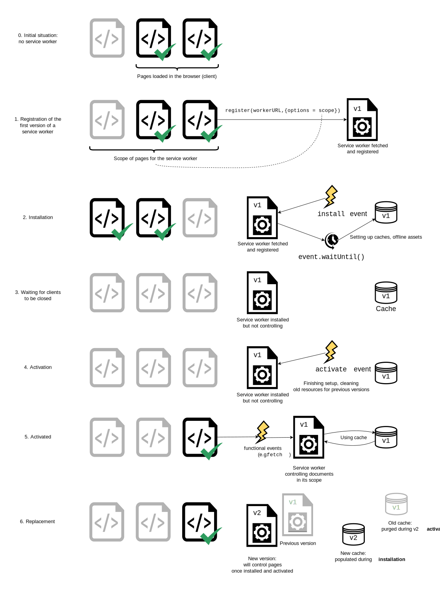

# ServiceWorker

::: tip
Service worker 本质上充当 Web 应用程序、浏览器与网络（可用时）之间的代理服务器。这个 API 旨在创建有效的离线体验，它会拦截网络请求并根据网络是否可用来采取适当的动作、更新来自服务器的资源。它还提供入口以推送通知和访问后台同步 API。
:::

## ServiceWorker 简介

Service worker 是一个注册在指定源和路径下的事件驱动 worker。它采用 JavaScript 文件的形式，控制关联的页面或者网站，拦截并修改访问和资源请求，细粒度地缓存资源。你可以完全控制应用在特定情形（最常见的情形是网络不可用）下的表现。

Service worker 运行在 worker 上下文：因此它无法访问 DOM，相对于驱动应用的主 JavaScript 线程，它运行在其他线程中，所以不会造成阻塞。它被设计为完全异步；因此，同步 XHR 和 Web Storage 不能在 service worker 中使用。

出于安全考量，Service worker 只能由 HTTPS 承载，毕竟修改网络请求的能力暴露给中间人会非常危险，如果允许访问这些强大的 API，此类攻击将会变得很严重。

## 基本步骤

1. 获取 service worker 代码，然后使用 serviceWorkerContainer.register() 来注册。如果成功，service worker 将在 ServiceWorkerGlobalScope 中执行；这本质上是一种特殊的上下文，在主脚本执行线程之外运行，没有访问 DOM 的权限。Service Worker 现在已为处理事件做好准备。
2. 安装完成。install 事件始终是发送给 service worker 的第一个事件（这可用于启动填充 IndexedDB 和缓存站点资源的过程）。在此步骤期间，应用程序正在为离线可用做准备。
3. 当 install 程序处理完成时，service worker 被视为已安装。此时，service worker 的先前版本可能处于激活的状态并控制着打开的页面。由于我们不希望同一 service worker 的两个不同版本同时运行，因此新版本尚未激活。
4. 一旦 service worker 的旧版本控制的页面都已关闭，就可以安全地停用旧版本，并且新安装的 service worker 将收到 activate 事件。activate 的主要用途是去清理 service worker 之前版本使用的资源。新的 service worker 可以调用 skipWaiting() 要求立即激活，而无需要求打开的页面关闭。然后，新的 service worker 将立即收到 activate 事件，并将接管任何打开的页面。
5. 激活后，service worker 将立即控制页面，但是只会控制那些在 register() 成功后打开的页面。换句话说，文档必须重新加载才能真正的受到控制，因为文档在有或者没有 service worker 的情况下开始存在，并在其生命周期内维护它。为了覆盖次默认行为并在页面打开的情况下，service worker 可以调用 clients.claim() 方法。
6. 每当获取新版本的 service worker 时，都会再次发生此循环，并在新版本的激活期间清理上一个版本的残留。



在主线程中注册 serviceWorker:

```js
const registerServiceWorker = async () => {
  if ("serviceWorker" in navigator) {
    try {
      // navigator.serviceWorker：ServiceWorkerContainer对象
      // registration:ServiceWorkerRegistration对象
      const registration = await navigator.serviceWorker.register("/sw.js", {
        scope: "/",
      });
      // 获取不同状态的service worker
      if (registration.installing) {
        console.log("正在安装 Service worker");
      } else if (registration.waiting) {
        console.log("已安装 Service worker installed");
      } else if (registration.active) {
        console.log("激活 Service worker");
      }
    } catch (error) {
      console.error(`注册失败：${error}`);
    }
  }
};
registerServiceWorker();
```

安装和激活 serviceWorker:

```js
/**
 * cache:存储网络响应发来的资源，并且根据它们的请求来生成 key
 */
const addResourcesToCache = async resources => {
  // caches:当前上下文相关联的 CacheStorage 对象
  const cache = await caches.open("v1");

  // cache:v1版本的缓存资源，保存request/response的键值对。批量添加
  await cache.addAll(resources);
};

const putInCache = async (request, response) => {
  const cache = await caches.open("v1");
  // 更新缓存资源
  await cache.put(request, response);
};

const cacheFirst = async ({ request, preloadResponsePromise, fallbackUrl }) => {
  // 首先，尝试从缓存中获取资源
  const responseFromCache = await caches.match(request);
  if (responseFromCache) {
    return responseFromCache;
  }

  // 接下来，尝试使用预加载的响应
  const preloadResponse = await preloadResponsePromise;
  if (preloadResponse) {
    // 缓存预加载的资源
    putInCache(request, preloadResponse.clone());
    return preloadResponse;
  }

  // 然后尝试从网络中获取资源
  try {
    const responseFromNetwork = await fetch(request);
    // 缓存fetch的资源
    putInCache(request, responseFromNetwork.clone());
    return responseFromNetwork;
  } catch (error) {
    // 返回默认的失败页面
    const fallbackResponse = await caches.match(fallbackUrl);
    if (fallbackResponse) {
      return fallbackResponse;
    }
    // 没办法了，只好返回一个自构建的 Response 对象
    return new Response("Network error happened", {
      status: 408,
      headers: { "Content-Type": "text/plain" },
    });
  }
};

// 启用导航预加载
const enableNavigationPreload = async () => {
  if (self.registration.navigationPreload) {
    await self.registration.navigationPreload.enable();
  }
};

// 启动预加载
self.addEventListener("activate", event => {
  event.waitUntil(enableNavigationPreload());
});

self.addEventListener("install", event => {
  // event：InstallEvent继承自ExtendableEvent对象
  // event.activeWorker:返回当前处于激活状态，控制页面的ServiceWorker
  // waitUntil，延长事件生存周期。会阻塞流程，直到执行完毕才会完成install
  event.waitUntil(
    addResourcesToCache([
      "/",
      "/index.html",
      "/style.css",
      "/app.js",
      "/image-list.js",
      "/star-wars-logo.jpg",
      "/gallery/bountyHunters.jpg",
      "/gallery/myLittleVader.jpg",
      "/gallery/snowTroopers.jpg",
    ])
  );
});
// 拦截fetch请求
// self：ServiceWorkerGlobalScope对象
// event：FetchEvent对象
self.addEventListener("fetch", event => {
  event.respondWith(
    cacheFirst({
      request: event.request,
      preloadResponsePromise: event.preloadResponse,
      fallbackUrl: "/gallery/myLittleVader.jpg",
    })
  );
});
```

## 更新 serviceWorker

如果你的 service worker 已经被安装，但是刷新页面时有一个新版本的可用，新版的 service worker 会在后台安装，但是仍然不会被激活。当不再有任何已加载的页面在使用旧版的 service worker 的时候，新版本才会激活。一旦再也没有这样的已加载的页面，新的 service worker 就会被激活。可以通过使用 Clients.claim() 绕过这一点。

新版的 service worker 里的 install 事件监听器改成下面这样（注意新的版本号）：

```js
// 更新使用新的缓存
const addResourcesToCache = async resources => {
  const cache = await caches.open("v2");
  await cache.addAll(resources);
};

self.addEventListener("install", event => {
  event.waitUntil(
    addResourcesToCache([
      "/",
      "/index.html",
      "/style.css",
      "/app.js",
      "/image-list.js",
      // …包含新版本需要的其他资源…
    ])
  );
});

// 更新后，删除旧的缓存
const deleteCache = async key => {
  await caches.delete(key);
};

const deleteOldCaches = async () => {
  const cacheKeepList = ["v2"];
  const keyList = await caches.keys();
  const cachesToDelete = keyList.filter(key => !cacheKeepList.includes(key));
  await Promise.all(cachesToDelete.map(deleteCache));
};

self.addEventListener("activate", event => {
  event.waitUntil(deleteOldCaches());
});
```

## ServiceWorkerContainer

表示 service worker 作为网络系统中的整体单元，包括注册、注销和更新 service worker 以及访问 service worker 的状态和它们的注册状态的功能。

更重要的是，它暴露了用于注册 service worker 的 ServiceWorkerContainer.register() 方法，和用于确定当前页面是否受到主动控制的 ServiceWorkerContainer.controller 属性。

- `controller` 如果 ServiceWorker 对象的状态是 activating 或 activated（与 ServiceWorkerRegistration.active 返回相同的对象），则返回 ServiceWorker 对象。在强制刷新请求（Shift + refresh）或者没有激活的 worker 的时候，该属性返回 null。
- `ready` 提供了一种延迟代码执行直到 service worker 被激活的方法。它返回一个从不会拒绝的 Promise，并且一直等到与当前页面相关联的 ServiceWorkerRegistration 有一个 ServiceWorkerRegistration.active worker。一旦满足该条件，它将用 ServiceWorkerRegistration 兑现。
- `register()` 用给定的 scriptURL 创建或者更新 ServiceWorkerRegistration
- `getRegistration()` 得到一个 ServiceWorkerRegistration 对象，它的作用域范围与提供的文档匹配。该方法返回一个兑现为 ServiceWorkerRegistration 或 undefined 的 Promise。
- `getRegistrations()` 返回数组中与 ServiceWorkerContainer 关联的所有 ServiceWorkerRegistration 对象。该方法返回一个兑现为 ServiceWorkerRegistration 的数组的 Promise。
- `startMessage()` 显式启动从 service worker 分发到其控制页面下的消息流（例如，通过 Client.postMessage() 发送）。这可用于更早地对发送的消息做出反应，甚至在该页面的内容加载完成之前。
- `controllerchange` 事件 当文档关联的 ServiceWorkerRegistration 获得新激活的 worker 时触发。

```js
if ("serviceWorker" in navigator) {
  // 使用默认域注册service worker
  navigator.serviceWorker
    .register("/sw.js")
    .then(registration => {
      console.log("Service worker registration succeeded:", registration);
    })
    .catch(error => {
      console.error(`Service worker registration failed: ${error}`);
    });

  if (navigator.serviceWorker.controller) {
    console.log(
      "This page is currently controlled by:",
      navigator.serviceWorker.controller
    );
  }

  // 延迟代码执行直到 service worker 被激活
  navigator.serviceWorker.ready.then(registration => {
    console.log(`A service worker is active: ${registration.active}`);
  });

  //当文档关联的 ServiceWorkerRegistration 获得新激活的 worker 时触发。
  navigator.serviceWorker.oncontrollerchange = () => {
    console.log(
      "This page is now controlled by",
      navigator.serviceWorker.controller
    );
  };
} else {
  console.log("Service workers are not supported.");
}
```

## ServiceWorkerRegistration

控制一个或者多个同源共享的页面

- `installing`
- `active` 返回 activating 或者 activated 状态的 serviceWorder。
- `waiting`
- `backgroundFetch` 返回 BackgroundFetchManager 对象，控制后台 fetch 操作。
- `cookies` 返回 CookieStoreManager 接口，允许订阅和解除订阅 cookie change 事件。
- `index` 返回 ContentIndex 接口，用于管理离线查看的索引内容。
- `navigationPreload` 返回关联的 NavigationPreloadManager 对象
- `paymentManager`
- `periodisSync`
- `pushManager` 返回 PushManager 接口，管理 push 订阅器。
- `scope` 返回定义 service worker 范围的 URL 字符串。
- `sync` 返回 SyncManager 接口，管理后台同步进程
- `updateViaCache`
- `getNotifications()`
- `showNotification()`
- `register()` 注册 service worker
- `unregister()` 解除注册 service worker
- `update()` 检查 service worker 更新的版本，不经过查询 caches。
- `onupdatefound` 新的 serviceWorker 安装时触发

## ServiceWorkerGlobalScope

代表 service worker 的全局执行上下文 self。ServiceWorker 的状态在结束/重启的循环中不是一直保持不变的，所以每个事件处理器应该设定一个默认的全局状态。

一旦成功地注册了 service worker，为了节省内存和处理器，状态空闲时被终止。激活状态的 service worker 为了响应事件可以自动重启。

> 在 service worker 中，同步请求是被禁止的 - 只有异步请求，如方法 fetch() 才被允许。

- `clients` 包含关联 serviceWorder 的 Clients 对象
- `registration` 包含 ServiceWorderRegistration 对象
- `caches` 包含关联的 serviceWorker 的 CacheStorage 对象
- `skipWaiting()` 允许当前 serviceWorker registration 由 waiting 过渡到 active 状态。
- `fetch()` 获取资源

事件有：

- `activate` 一个新的 ServiceWorkerRegistration.active worker
- `fetch` 调用 fetch()
- `install` 一个新的 ServiceWorkerRegistration.installing worker
- `contentdelete` 从内容索引中删除项时发生
- `message` 被控制页面使用 MessagePort.postMessage() 发送消息过来时
- `notificationclick` 点击 notification 消息时
- `notificationclose`
- `sync` 从客户端页面盗用 SyncManager.register()时
- `periodicsync`
- `push` 当收到服务器推送通知时发生
- `pushsubscriptionchange` 当推送订阅已失效或即将失效时发生

## Cache

Cache 接口为缓存的 Request / Response 对象对提供存储机制。

一个域可以有多个命名 Cache 对象。除非明确地更新缓存，否则缓存将不会被更新；除非删除，否则缓存数据不会过期。使用 CacheStorage.open(cacheName) 打开一个 Cache 对象，再使用 Cache 对象的方法去处理缓存。

你需要定期地清理缓存条目，因为每个浏览器都硬性限制了一个域下缓存数据的大小。缓存配额使用估算值，可以使用 StorageEstimate API 获得。浏览器尽其所能去管理磁盘空间，但它有可能删除一个域下的缓存数据。浏览器要么自动删除特定域的全部缓存，要么全部保留。确保按名称安装版本缓存，并仅从可以安全操作的脚本版本中使用缓存。

> Cache.put, Cache.add 和 Cache.addAll 只能在 GET 请求下使用。

- `Cache.match(request,options)` 跟 Cache 对象匹配的第一个已经缓存的请求。
- `Cache.matchAll(request,options)` 跟 Cache 对象匹配的所有请求组成的数组。
- `Cache.add(request)` 抓取这个 URL，检索并把返回的 response 对象添加到给定的 Cache 对象。这在功能上等同于调用 fetch(), 然后使用 Cache.put() 将 response 添加到 cache 中。
- `Cache.addAll(requests)` 抓取一个 URL 数组，检索并把返回的 response 对象添加到给定的 Cache 对象。
- `Cache.put(request,response)` 同时抓取一个请求及其响应，并将其添加到给定的 cache。
- `Cache.delete(request,options)` 搜索 key 值为 request 的 Cache 条目。如果找到，则删除该 Cache 条目，并且返回一个 resolve 为 true 的 Promise 对象；如果未找到，则返回一个 resolve 为 false 的 Promise 对象。
- `Cache.keys(request,options) `Cache 对象 key 值组成的数组。

## CacheStorage

表示 Cache 对象的存储。它提供了一个 ServiceWorker 、其他类型 worker 或者 window 范围内可以访问到的所有命名 cache 的主目录，并维护一份字符串名称到相应 Cache 对象的映射。

> 可以通过窗口的 Window.caches 属性或 worker 的 WorkerGlobalScope.caches 属性访问 CacheStorage。

- `Caches.match(request)` 检查给定的 Request 是否是 CacheStorage 对象跟踪的任何 Cache 对象的键，并返回一个 resolve 为该匹配的 Promise .
- `Caches.has(cacheName)` 如果存在与 cacheName 匹配的 Cache 对象，则返回一个 resolve 为 true 的 Promise .
- `Caches.open(cacheName)` 返回一个 Promise ，resolve 为匹配 cacheName （如果不存在则创建一个新的 cache）的 Cache 对象
- `Caches.delete(cacheName)` 查找匹配 cacheName 的 Cache 对象，如果找到，则删除 Cache 对象并返回一个 resolve 为 true 的 Promise 。如果没有找到 Cache 对象，则返回 false.
- `Caches.keys()` 返回一个 Promise ，它将使用一个包含与 CacheStorage 追踪的所有命名 Cache 对象对应字符串的数组来 resolve. 使用该方法迭代所有 Cache 对象的列表。

## Client

Client 接口表示一个可执行的上下文，如 Worker 或 SharedWorker。Window 客户端由更具体的 WindowClient 表示。你可以从 Clients.matchAll() 和 Clients.get() 等方法获取 Client/WindowClient 对象。

- `id` 一个字符串，表示客户端的通用唯一标识。
- `type` 表示客户端类型的字符串。可能是 "window"、"worker" 或 "sharedworker"。
- `url` 表示客户端 URL 的字符串。
- `postMessage()` 向客户端发送一条消息。

## Clients

提供对 Client 对象的访问。通过在 service worker 中使用 self.clients 访问它。

- `get(id)` 返回一个匹配给定 id 的 Client 的 Promise .
- `matchAll(options)` 返回一个 Client 对象数组的 Promise . options 参数允许你控制返回的 clients 类型。
- `openWindow()` 打开给定 URL 的新浏览器窗口，并返回新 WindowClient 的 Promise .
- `claim()` 允许一个激活的 service worker 将自己设置为其 scope 内所有 clients 的 controller

下面示例显示一个已有的聊天窗口，或者当用户点击通知时创建新的窗口

```js
addEventListener("notificationclick", event => {
  event.waitUntil(
    (async function () {
      const allClients = await clients.matchAll({
        includeUncontrolled: true,
      });

      let chatClient;

      // 如果存在聊天窗口，使其聚焦
      for (const client of allClients) {
        const url = new URL(client.url);
        if (url.pathname == "/chat/") {
          client.focus();
          chatClient = client;
          break;
        }
      }

      // 没有聊天窗口，打开一个新窗口作为聊天窗口
      if (!chatClient) {
        chatClient = await clients.openWindow("/chat/");
      }

      chatClient.postMessage("New chat messages!");
    })()
  );
});
```

## FetchEvent

在 service worker 全局作用域中触发 fetch 事件的事件类型。包括 request 和接收方如何处理响应。

- `clientId` 发起 fetch 的同源客户端的 id。
- `preloadResponse` 如果该 fetch 没有导航或者 navigation preload 未启用，则是 undefined。
- `replacesClientId` 页面导航期间正被替换的客户端的 id。
- `resultingClientId` 页面导航期间用于替换的客户端的 id。
- `request` 浏览器想要发送的 Request。
- `respondWith()` 阻止浏览器的默认 fetch 操作，并且由你自己提供一个响应（可以是一个 promise）
- `waitUntil()` 延长事件的生命周期。用于通知浏览器延长超出响应回复时间的任务，例如流和缓存。

```js
self.addEventListener("fetch", event => {
  // fetch请求方式不能是get
  if (event.request.method !== "GET") return;

  event.respondWith(
    (async () => {
      const cache = await caches.open("dynamic-v1");
      const cachedResponse = await cache.match(event.request);

      if (cachedResponse) {
        return cachedResponse;
      }
      // 没有匹配到缓存，则发起fetch请求
      return fetch(event.request);
    })()
  );
});
```

## Background Fetch API

提供了一种管理可能需要较长时间的下载（例如电影、音频文件和软件）的方法。

当 web 应用程序需要用户下载大文件时，通常会面临一个问题，即用户需要保持与页面的连接才能完成下载。如果他们失去连接、关闭标签页或离开页面，下载就会停止。

Background Fetch API 解决了这个问题。它为 Web 开发人员创建了一种告诉浏览器在后台执行某些 fetch 的方法，例如当用户点击按钮下载视频文件时。浏览器以用户可见的方式执行 fetch，向用户显示进度并提供取消下载的方法。一旦下载完成，浏览器就会打开 service worker，此时你的应用程序可以根据需要对响应执行某些操作。

如果用户在离线状态下开始下载的过程，Background Fetch API 将启用 fetch 操作。一旦用户重新连接，它就会开始。如果用户离线，进程将暂停，直到用户再次联网。

```js
// 先在 worker 内检查浏览器是否支持。
if ("BackgroundFetchManager" in self) {
  self.addEventListener("backgroundfetchabort", callback);
  self.addEventListener("backgroundfetchclick", callback);
  self.addEventListener("backgroundfetchfail", callback);
  self.addEventListener("backgroundfetchsuccess", callback);
}
```

使用 Background Fetch 需要注册 service worker

```js
navigator.serviceWorker.ready.then(async serviceWorkerRegistration => {
  const BackgroundFetchRegistration =
    await serviceWorkerRegistration.backgroundFetch.fetch(
      "my-fetch",
      ["/ep-5.mp3", "ep-5-artwork.jpg"],
      {
        title: "Episode 5: Interesting things.",
        icons: [
          {
            sizes: "300x300",
            src: "/ep-5-icon.png",
            type: "image/png",
          },
        ],
        downloadTotal: 60 * 1024 * 1024,
      }
    );
});
```

## Background Synchronization API

使 Web 应用程序能够推迟任务，以便一旦用户拥有稳定的网络连接，它们就可以在 Service Worker 中运行。

如果设备离线，Background Synchronization API 允许 Web 应用程序将服务器同步工作交给 Service Worker 延迟处理。其用途可能包括在应用程序使用期间无法发送请求的情况下在后台发送请求。

例如，电子邮件客户端应用程序可以允许其用户在任意时间撰写和发送消息，即使设备没有网络连接也是如此。应用程序前端仅需注册一个同步请求，并且当网络条件再次允许时，Service Worker 会收到警报并处理同步。

SyncManager 接口允许通过 ServiceWorkerRegistration.sync 使用。使用唯一的标识符来设置同步事件的“名称”, 然后可以在 ServiceWorker 脚本中监听。一旦收到事件，你可以运行任何可用的功能，比如向服务器发送请求。

- `ServiceWorkerRegistration.sync` 返回 SyncManager 的引用，用于注册在设备具有网络连接后运行的任务
- `self.sync`事件：一旦网络可用，会立刻触发 sync 的处理器执行工作。
  > 此 API 依赖于 Service Worker，因此此 API 提供的功能仅在安全上下文（HTTPS）中可用。

```js
navigator.serviceWorker.ready.then(async registration => {
  // 在浏览器的上下文注册后台同步任务：
  await registration.sync.register("sync-messages");

  // 检查是否注册了给定标签的后台同步任务。
  registration.sync.getTags().then(tags => {
    if (tags.includes("sync-messages")) {
      console.log("已注册同步消息");
    }
  });
});
```

在 Service Worker 中响应后台同步事件

```js
// 设备具有网络连接后触发此同步任务
self.addEventListener("sync", event => {
  if (event.tag === "sync-messages") {
    event.waitUntil(sendOutboxMessages());
  }
});
```
