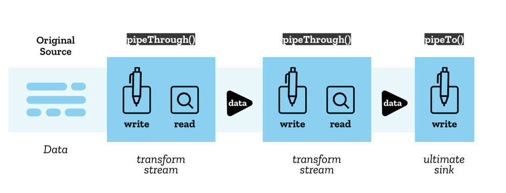

# Stream API 开发指南

Stream API 为 Web 平台提供了强大的流数据处理能力，允许 JavaScript 以高效的方式处理来自网络或其他源的数据流。本文档详细介绍了 Stream API 的各个组件和使用方法。

## 目录导航

1. [概述与基础概念](#1-概述与基础概念)
2. [ReadableStream 可读流](#2-readablestream-可读流)
3. [WritableStream 可写流](#3-writablestream-可写流)
4. [管道传输机制](#4-管道传输机制)
5. [TransformStream 转换流](#5-transformstream-转换流)
6. [可读字节流](#6-可读字节流)
7. [实际应用示例](#7-实际应用示例)
8. [最佳实践与优化](#8-最佳实践与优化)

## 1. 概述与基础概念

### 1.1 什么是 Stream API

Stream API 为 Web 平台提供了一组十分有用的工具，提供了一系列对象以允许 JavaScript 访问来自网络的数据流，并根据开发人员的需要对其进行处理。

### 1.2 核心组件

Stream API 主要包含以下核心组件：

- **ReadableStream**：可读流，表示数据源
- **WritableStream**：可写流，表示数据目标
- **TransformStream**：转换流，用于数据转换
- **管道机制**：连接不同流的传输机制

### 1.3 应用场景

- 大文件上传/下载的流式处理
- 实时数据处理和转换
- 视频/音频流处理
- 网络数据的分块传输
- 内存优化的数据处理

## 2. ReadableStream 可读流

### 2.1 基本概念

可读流是一个数据源，在 JavaScript 中用 `ReadableStream` 对象表示。数据从底层源（underlying source）流出，底层源表示一个你希望从中获取数据的资源。

### 2.2 底层源类型

#### Push Source（推送源）
- **特点**：主动推送数据，需要时可以开始、暂停或取消
- **示例**：视频流、TCP/WebSocket、实时数据源
- **控制**：可以自行控制数据流的开始、暂停和取消

#### Pull Source（拉取源）  
- **特点**：需要显式请求数据
- **示例**：通过 Fetch 或 XHR 请求访问的文件
- **控制**：需要主动请求数据

### 2.3 数据分块（Chunks）

数据被按序读入到许多小的片段，这些片段被称作**分块（chunk）**：

- 分块可以是单个字节
- 也可以是更大的数据类型（如类型化数组）
- 单个流的分块可以有不同的大小和类型

### 2.4 流的类型

> **注意**：有两种不同类型的可读流

#### 传统可读流
- 标准的流处理方式
- 通过内部队列传递数据

#### 字节流（Byte Stream）
- 传统流的扩展版本
- 支持 BYOB Reader（"带上你自己的缓冲区"）
- 可以直接将流读入开发者提供的缓冲区
- 最大限度减少数据复制

### 2.5 核心方法

| 方法 | 描述 | 用途 |
|------|------|------|
| `pipeThrough()` | 通过转换流传输数据 | 将数据转换成另一种格式 |
| `pipeTo()` | 传输到可写流 | 作为管道传输的终点 |
| `getReader()` | 获取读取器 | 读取流数据 |
| `tee()` | 创建流副本 | 将流分为两个独立的流 |

### 2.6 可读流架构图


### 2.7 创建可读流

```javascript
/**
 * 创建自定义可读流
 * @param {Object} underlyingSource - 底层源配置
 * @param {Object} queuingStrategy - 队列策略
 */
const customStream = new ReadableStream({
  /**
   * 流初始化时调用
   * @param {ReadableStreamDefaultController} controller - 流控制器
   */
  start(controller) {
    console.log('可读流已初始化');
    // 初始化逻辑
  },

  /**
   * 当流的内部队列未满时重复调用
   * @param {ReadableStreamDefaultController} controller - 流控制器
   */
  pull(controller) {
    // 生成数据并添加到流中
    const data = generateData();
    if (data) {
      controller.enqueue(data);
    } else {
      controller.close();
    }
  },

  /**
   * 流被取消时调用
   * @param {any} reason - 取消原因
   */
  cancel(reason) {
    console.log('流被取消:', reason);
    // 清理资源
  }
}, {
  // 队列策略：控制流的缓冲行为
  highWaterMark: 3,  // 队列最大长度
  size: () => 1      // 每个分块的大小计算函数
});

/**
 * 模拟数据生成
 */
function generateData() {
  // 模拟数据生成逻辑
  return Math.random() > 0.1 ? `data-${Date.now()}` : null;
}
```

### 2.8 读取流数据

```javascript
/**
 * 读取可读流数据
 * @param {ReadableStream} stream - 要读取的流
 */
async function readStream(stream) {
  const reader = stream.getReader();
  
  try {
    while (true) {
      const { done, value } = await reader.read();
      
      if (done) {
        console.log('流读取完毕');
        break;
      }
      
      console.log('接收到数据:', value);
      // 处理接收到的数据
      processChunk(value);
    }
  } catch (error) {
    console.error('读取流时出错:', error);
  } finally {
    reader.releaseLock();
  }
}

/**
 * 处理数据分块
 * @param {any} chunk - 数据分块
 */
function processChunk(chunk) {
  // 处理接收到的数据分块
  console.log('处理数据分块:', chunk);
}
```

## 3. WritableStream 可写流

### 3.1 基本概念

可写流（Writable Stream）是一个可以写入数据的数据终点，在 JavaScript 中以 `WritableStream` 对象表示。这是 JavaScript 层面对底层接收器（underlying sink）的抽象。

### 3.2 写入机制

#### 数据写入过程
- 数据由 **writer** 写入流中
- 每次只写入一个分块
- 分块类型可以多样化
- Writer + 相关代码 = **生产者（Producer）**

#### 锁定机制
- Writer 创建并开始写入时，流被**锁定**
- 同一时刻只能有一个 Writer 写入
- 切换 Writer 前必须先释放当前 Writer

### 3.3 核心概念

| 概念 | 描述 |
|------|------|
| Underlying Sink | 底层接收器，实际处理数据的地方 |
| Writer | 写入器，负责将数据写入流 |
| Producer | 生产者，Writer + 数据生成逻辑 |
| Locked State | 锁定状态，确保数据写入的原子性 |

### 3.4 创建可写流

```javascript
/**
 * 创建自定义可写流示例
 */
function createWritableStream() {
  const decoder = new TextDecoder("utf-8");
  let result = "";

  const writableStream = new WritableStream({
    /**
     * 写入数据处理函数
     * @param {any} chunk - 要写入的数据分块
     * @param {WritableStreamDefaultController} controller - 写入控制器
     * @returns {Promise<void>}
     */
    write(chunk, controller) {
      return new Promise((resolve, reject) => {
        try {
          // 处理数据分块
          const buffer = new ArrayBuffer(1);
          const view = new Uint8Array(buffer);
          view[0] = chunk;
          
          // 解码数据
          const decoded = decoder.decode(view, { stream: true });
          result += decoded;
          
          console.log('写入数据:', decoded);
          resolve();
        } catch (error) {
          reject(error);
        }
      });
    },

    /**
     * 流关闭时调用
     */
    close() {
      console.log('可写流已关闭');
      console.log('最终结果:', result);
    },

    /**
     * 流异常终止时调用
     * @param {any} reason - 终止原因
     */
    abort(reason) {
      console.error("流异常终止:", reason);
    }
  }, 
  // 队列策略：控制写入缓冲
  new CountQueuingStrategy({ highWaterMark: 1 })
  );

  return writableStream;
}
```

### 3.5 向流写入数据

```javascript
/**
 * 向可写流发送消息
 * @param {string} message - 要发送的消息
 * @param {WritableStream} writableStream - 目标可写流
 */
async function sendMessage(message, writableStream) {
  // 获取默认写入器
  const writer = writableStream.getWriter();
  const encoder = new TextEncoder();
  
  try {
    // 编码消息为字节数组
    const encoded = encoder.encode(message, { stream: true });
    
    // 逐个写入数据分块
    for (const chunk of encoded) {
      // 等待写入器准备就绪
      await writer.ready;
      
      // 写入数据分块
      await writer.write(chunk);
      console.log('写入分块:', chunk);
    }
    
    // 等待所有数据写入完成
    await writer.ready;
    
    // 关闭写入流
    await writer.close();
    console.log('写入完成，流已关闭');
    
  } catch (error) {
    console.error('写入过程出错:', error);
    
    // 异常情况下终止流
    await writer.abort(error);
  } finally {
    // 释放写入器锁定
    writer.releaseLock();
  }
}

// 使用示例
const writableStream = createWritableStream();
sendMessage("Hello, Stream API!", writableStream);
```

### 3.6 高级写入示例

```javascript
/**
 * 高级可写流实现：支持批量写入和错误恢复
 */
class AdvancedWritableStream {
  constructor(options = {}) {
    this.batchSize = options.batchSize || 10;
    this.retryAttempts = options.retryAttempts || 3;
    this.buffer = [];
    
    this.stream = new WritableStream({
      write: this.handleWrite.bind(this),
      close: this.handleClose.bind(this),
      abort: this.handleAbort.bind(this)
    });
  }

  /**
   * 处理写入操作
   */
  async handleWrite(chunk, controller) {
    this.buffer.push(chunk);
    
    // 当缓冲区达到批量大小时进行批量处理
    if (this.buffer.length >= this.batchSize) {
      await this.processBatch();
    }
  }

  /**
   * 批量处理数据
   */
  async processBatch() {
    const batch = this.buffer.splice(0, this.batchSize);
    
    for (let attempt = 1; attempt <= this.retryAttempts; attempt++) {
      try {
        await this.processBatchData(batch);
        console.log(`批量处理成功: ${batch.length} 个项目`);
        return;
      } catch (error) {
        console.warn(`批量处理失败 (尝试 ${attempt}/${this.retryAttempts}):`, error);
        
        if (attempt === this.retryAttempts) {
          throw error;
        }
        
        // 等待后重试
        await this.delay(1000 * attempt);
      }
    }
  }

  /**
   * 实际处理批量数据
   */
  async processBatchData(batch) {
    // 模拟批量数据处理
    return new Promise((resolve, reject) => {
      setTimeout(() => {
        if (Math.random() > 0.1) {
          resolve();
        } else {
          reject(new Error('模拟处理失败'));
        }
      }, 100);
    });
  }

  /**
   * 流关闭处理
   */
  async handleClose() {
    // 处理剩余缓冲区数据
    if (this.buffer.length > 0) {
      await this.processBatch();
    }
    console.log('高级可写流已关闭');
  }

  /**
   * 流异常终止处理
   */
  handleAbort(reason) {
    console.error('高级可写流异常终止:', reason);
    this.buffer = [];
  }

  /**
   * 延迟工具函数
   */
  delay(ms) {
    return new Promise(resolve => setTimeout(resolve, ms));
  }

  /**
   * 获取可写流
   */
  getStream() {
    return this.stream;
  }
}

// 使用示例
const advancedStream = new AdvancedWritableStream({
  batchSize: 5,
  retryAttempts: 3
});

const writer = advancedStream.getStream().getWriter();

// 写入多个数据项
for (let i = 0; i < 20; i++) {
  writer.write(`数据项-${i}`);
}

writer.close();
```

## 5. TransformStream 转换流

### 5.1 基本概念

TransformStream 接口表示链式管道传输中转换流的具体实现。它可以传递给 `ReadableStream.pipeThrough()` 方法，以便将流数据从一种格式转换成另一种。

### 5.2 应用场景

- **编解码**：视频帧编码/解码、音频格式转换
- **数据压缩**：压缩/解压缩数据流
- **格式转换**：XML 转 JSON、CSV 转对象等
- **数据清洗**：过滤、验证、格式化数据

### 5.3 核心属性

| 属性 | 类型 | 描述 |
|------|------|------|
| `readable` | ReadableStream | 转换流的可读端 |
| `writable` | WritableStream | 转换流的可写端 |

### 5.4 转换流特性

- 如果没有提供转换算法，数据通过管道时不会被修改
- TransformStream 是一个**可转移对象**
- 支持背压控制和错误处理

### 5.5 创建转换流

```javascript
/**
 * 通用数据类型转换流
 * 将各种数据类型转换为 Uint8Array
 */
class UniversalTransformStream {
  constructor() {
    this.textEncoder = new TextEncoder();
    
    const transformConfig = {
      start: this.handleStart.bind(this),
      transform: this.handleTransform.bind(this),
      flush: this.handleFlush.bind(this)
    };
    
    this.stream = new TransformStream(transformConfig);
  }
  
  /**
   * 转换流初始化
   */
  handleStart(controller) {
    console.log('转换流已初始化');
  }
  
  /**
   * 数据转换处理
   * @param {any} chunk - 输入数据分块
   * @param {TransformStreamDefaultController} controller - 转换控制器
   */
  async handleTransform(chunk, controller) {
    try {
      const processedChunk = await this.processChunk(chunk, controller);
      if (processedChunk !== undefined) {
        controller.enqueue(processedChunk);
      }
    } catch (error) {
      controller.error(error);
    }
  }
  
  /**
   * 处理不同类型的数据分块
   */
  async processChunk(chunk, controller) {
    // 等待异步数据
    chunk = await chunk;
    
    switch (typeof chunk) {
      case "object":
        return this.handleObjectChunk(chunk, controller);
        
      case "symbol":
        controller.error("Cannot send a symbol as a chunk part");
        return;
        
      case "undefined":
        controller.error("Cannot send undefined as a chunk part");
        return;
        
      default:
        // 字符串、数字等基本类型
        return this.textEncoder.encode(String(chunk));
    }
  }
  
  /**
   * 处理对象类型数据
   */
  handleObjectChunk(chunk, controller) {
    // null 值终止转换
    if (chunk === null) {
      controller.terminate();
      return;
    }
    
    // ArrayBuffer 视图类型
    if (ArrayBuffer.isView(chunk)) {
      return new Uint8Array(chunk.buffer, chunk.byteOffset, chunk.byteLength);
    }
    
    // 数字数组
    if (Array.isArray(chunk) && chunk.every(value => typeof value === "number")) {
      return new Uint8Array(chunk);
    }
    
    // 具有 valueOf 方法的对象
    if (typeof chunk.valueOf === "function" && chunk.valueOf() !== chunk) {
      return this.processChunk(chunk.valueOf(), controller);
    }
    
    // 具有 toJSON 方法的对象
    if ("toJSON" in chunk) {
      return this.processChunk(JSON.stringify(chunk), controller);
    }
    
    // 默认序列化为 JSON
    return this.textEncoder.encode(JSON.stringify(chunk));
  }
  
  /**
   * 转换完成时的清理工作
   */
  handleFlush() {
    console.log('转换流处理完毕');
  }
  
  /**
   * 获取转换流
   */
  getStream() {
    return this.stream;
  }
}

// 使用示例
const transformer = new UniversalTransformStream();
const transformStream = transformer.getStream();
```

## 6. 可读字节流

### 6.1 基本概念

可读字节流是可读流的特殊类型，专门用于处理字节数据。与普通可读流不同，字节流支持**零拷贝传输**，可以显著提高处理大量数据时的性能。

### 6.2 零拷贝传输优势

#### 普通可读流
- 数据始终通过内部队列传递给使用者
- 需要进行数据复制操作
- 适合一般数据处理场景

#### 可读字节流
- 内部队列为空时，底层源可直接写入使用者
- 实现高效的零拷贝传输
- 避免不必要的数据复制，提高性能

### 6.3 适用场景

- **大文件处理**：处理可能非常大的数据块
- **任意大小数据**：数据块大小不固定的场景
- **性能敏感应用**：需要最大化传输效率的场景
- **流媒体处理**：音视频等二进制数据流

### 6.4 创建可读字节流

```javascript
/**
 * 创建可读字节流
 */
function createReadableByteStream() {
  const readableByteStream = new ReadableStream({
    type: "bytes",  // 指定为字节流类型
    
    /**
     * 流初始化
     * @param {ReadableByteStreamController} controller - 字节流控制器
     */
    start(controller) {
      console.log('可读字节流已初始化');
      console.log('BYOB Request 支持:', controller.byobRequest !== undefined);
    },
    
    /**
     * 拉取数据
     * @param {ReadableByteStreamController} controller - 字节流控制器
     */
    pull(controller) {
      // 检查是否有待处理的 BYOB 请求
      if (controller.byobRequest) {
        // 有 BYOB 请求时，直接写入请求的缓冲区（零拷贝）
        const view = controller.byobRequest.view;
        
        // 生成数据并写入缓冲区
        for (let i = 0; i < view.byteLength; i++) {
          view.setUint8(i, Math.floor(Math.random() * 256));
        }
        
        // 响应 BYOB 请求
        controller.byobRequest.respond(view.byteLength);
      } else {
        // 没有 BYOB 请求时，创建新的数据块
        const chunk = new Uint8Array(1024);
        for (let i = 0; i < chunk.length; i++) {
          chunk[i] = Math.floor(Math.random() * 256);
        }
        controller.enqueue(chunk);
      }
    },
    
    /**
     * 流取消
     */
    cancel(reason) {
      console.log('可读字节流已取消:', reason);
    }
  });
  
  return readableByteStream;
}

// 使用示例：BYOB Reader 读取字节流
async function readWithBYOBReader(stream) {
  const reader = stream.getReader({ mode: "byob" });
  
  try {
    let totalBytes = 0;
    
    while (true) {
      const buffer = new ArrayBuffer(1024);
      const view = new Uint8Array(buffer);
      
      const { done, value } = await reader.read(view);
      
      if (done) {
        console.log(`BYOB 读取完成，总计: ${totalBytes} 字节`);
        break;
      }
      
      totalBytes += value.byteLength;
      console.log(`BYOB 读取: ${value.byteLength} 字节`);
    }
  } catch (error) {
    console.error('BYOB 读取错误:', error);
  } finally {
    reader.releaseLock();
  }
}
```

## 7. 实际应用示例

### 7.1 文件上传流处理

```javascript
/**
 * 大文件分块上传示例
 */
class ChunkedFileUploader {
  constructor(options = {}) {
    this.chunkSize = options.chunkSize || 1024 * 1024; // 1MB
    this.retryAttempts = options.retryAttempts || 3;
  }
  
  /**
   * 上传文件
   * @param {File} file - 要上传的文件
   * @param {string} uploadUrl - 上传接口地址
   */
  async uploadFile(file, uploadUrl) {
    console.log(`开始上传文件: ${file.name}, 大小: ${file.size} 字节`);
    
    const fileStream = this.createFileStream(file);
    const uploadSink = this.createUploadSink(uploadUrl);
    
    try {
      await fileStream.pipeTo(uploadSink);
      console.log('文件上传完成');
    } catch (error) {
      console.error('文件上传失败:', error);
      throw error;
    }
  }
  
  /**
   * 创建文件读取流
   */
  createFileStream(file) {
    let offset = 0;
    
    return new ReadableStream({
      async pull(controller) {
        if (offset >= file.size) {
          controller.close();
          return;
        }
        
        const chunk = file.slice(offset, offset + this.chunkSize);
        const arrayBuffer = await chunk.arrayBuffer();
        
        controller.enqueue({
          data: new Uint8Array(arrayBuffer),
          offset: offset,
          size: arrayBuffer.byteLength,
          isLast: offset + arrayBuffer.byteLength >= file.size
        });
        
        offset += arrayBuffer.byteLength;
      }
    });
  }
  
  /**
   * 创建上传写入流
   */
  createUploadSink(uploadUrl) {
    return new WritableStream({
      write: async (chunk) => {
        await this.uploadChunk(chunk, uploadUrl);
      }
    });
  }
  
  /**
   * 上传单个分块
   */
  async uploadChunk(chunk, uploadUrl) {
    for (let attempt = 1; attempt <= this.retryAttempts; attempt++) {
      try {
        const formData = new FormData();
        formData.append('chunk', new Blob([chunk.data]));
        formData.append('offset', chunk.offset);
        formData.append('size', chunk.size);
        formData.append('isLast', chunk.isLast);
        
        const response = await fetch(uploadUrl, {
          method: 'POST',
          body: formData
        });
        
        if (!response.ok) {
          throw new Error(`上传失败: ${response.statusText}`);
        }
        
        console.log(`分块上传成功: ${chunk.offset}-${chunk.offset + chunk.size}`);
        return;
        
      } catch (error) {
        console.warn(`分块上传失败 (尝试 ${attempt}/${this.retryAttempts}):`, error);
        
        if (attempt === this.retryAttempts) {
          throw error;
        }
        
        await this.delay(1000 * attempt);
      }
    }
  }
  
  delay(ms) {
    return new Promise(resolve => setTimeout(resolve, ms));
  }
}

// 使用示例
const uploader = new ChunkedFileUploader({
  chunkSize: 2 * 1024 * 1024, // 2MB 分块
  retryAttempts: 3
});
```

## 8. 最佳实践与优化

### 8.1 性能优化策略

#### 选择合适的流类型
- **普通流**：适用于一般数据处理
- **字节流**：适用于大量二进制数据处理
- **转换流**：适用于需要数据转换的场景

#### 缓冲区管理
```javascript
// 合理设置 highWaterMark
const optimizedStream = new ReadableStream({
  // 流逻辑
}, {
  highWaterMark: 16,  // 根据数据大小调整
  size: (chunk) => chunk.byteLength || 1
});
```

#### 背压处理
```javascript
// 正确处理背压
const writer = writableStream.getWriter();

async function writeWithBackpressure(data) {
  await writer.ready;  // 等待写入器准备就绪
  return writer.write(data);
}
```

### 8.2 错误处理最佳实践

```javascript
/**
 * 健壮的流错误处理示例
 */
class RobustStreamProcessor {
  async processStream(sourceStream) {
    const abortController = new AbortController();
    
    try {
      const transformStream = new TransformStream({
        transform: this.safeTransform.bind(this)
      });
      
      const writableStream = new WritableStream({
        write: this.safeWrite.bind(this)
      });
      
      // 设置超时保护
      const timeout = setTimeout(() => {
        abortController.abort('处理超时');
      }, 30000);
      
      await sourceStream
        .pipeThrough(transformStream, { signal: abortController.signal })
        .pipeTo(writableStream, { signal: abortController.signal });
        
      clearTimeout(timeout);
      console.log('流处理成功完成');
      
    } catch (error) {
      console.error('流处理错误:', error);
      this.cleanup();
      
      // 根据错误类型决定是否重试
      if (this.shouldRetry(error)) {
        console.log('准备重试...');
        await this.delay(1000);
        return this.processStream(sourceStream);
      }
      
      throw error;
    }
  }
  
  safeTransform(chunk, controller) {
    try {
      controller.enqueue(chunk);
    } catch (error) {
      console.warn('转换错误，跳过分块:', error);
    }
  }
  
  safeWrite(chunk) {
    try {
      return Promise.resolve();
    } catch (error) {
      console.error('写入错误:', error);
      throw error;
    }
  }
  
  shouldRetry(error) {
    return error.name === 'NetworkError' || 
           error.message.includes('timeout');
  }
  
  cleanup() {
    console.log('清理资源...');
  }
  
  delay(ms) {
    return new Promise(resolve => setTimeout(resolve, ms));
  }
}
```

### 8.3 流监控与调试

```javascript
/**
 * 流处理监控器
 */
class StreamMonitor {
  constructor(streamName) {
    this.streamName = streamName;
    this.metrics = {
      chunksProcessed: 0,
      bytesProcessed: 0,
      startTime: Date.now()
    };
  }
  
  createMonitoringTransform() {
    return new TransformStream({
      transform: (chunk, controller) => {
        this.recordChunk(chunk);
        controller.enqueue(chunk);
      },
      
      flush: () => {
        this.logFinalMetrics();
      }
    });
  }
  
  recordChunk(chunk) {
    this.metrics.chunksProcessed++;
    this.metrics.bytesProcessed += this.getChunkSize(chunk);
    
    if (this.metrics.chunksProcessed % 100 === 0) {
      this.logProgress();
    }
  }
  
  getChunkSize(chunk) {
    if (chunk instanceof ArrayBuffer) {
      return chunk.byteLength;
    }
    if (typeof chunk === 'string') {
      return chunk.length * 2;
    }
    return 1024;
  }
  
  logProgress() {
    const elapsed = Date.now() - this.metrics.startTime;
    console.log(`[${this.streamName}] 进度: ${this.metrics.chunksProcessed} 块, ` +
                `${this.formatBytes(this.metrics.bytesProcessed)}, ` +
                `用时: ${elapsed}ms`);
  }
  
  logFinalMetrics() {
    const totalTime = Date.now() - this.metrics.startTime;
    console.log(`=== ${this.streamName} 处理完成 ===`);
    console.log(`总时间: ${totalTime}ms`);
    console.log(`处理块数: ${this.metrics.chunksProcessed}`);
    console.log(`处理字节: ${this.formatBytes(this.metrics.bytesProcessed)}`);
  }
  
  formatBytes(bytes) {
    const units = ['B', 'KB', 'MB', 'GB'];
    let size = bytes;
    let unitIndex = 0;
    
    while (size >= 1024 && unitIndex < units.length - 1) {
      size /= 1024;
      unitIndex++;
    }
    
    return `${size.toFixed(2)} ${units[unitIndex]}`;
  }
}

// 使用示例
const monitor = new StreamMonitor('文件处理');

sourceStream
  .pipeThrough(monitor.createMonitoringTransform())
  .pipeThrough(processingTransform)
  .pipeTo(outputStream);
```

通过以上全面的 Stream API 开发指南，您可以充分利用现代浏览器提供的强大流处理能力，构建高效、可扩展的 Web 应用程序。记住在实际应用中根据具体需求选择合适的流类型和处理策略，并始终关注性能优化和错误处理。

## 4. 管道传输机制

### 4.1 管道传输概述

Stream API 使用**链式管道（Pipe Chain）**的结构将流传输到另一个流。管道传输提供了一种优雅的方式来连接和转换数据流。

### 4.2 管道传输方法

#### pipeThrough()
- **功能**：通过转换流传输数据
- **用途**：在传输过程中转换数据格式
- **应用**：编解码、压缩解压缩、数据格式转换

#### pipeTo()
- **功能**：传输到可写流
- **用途**：作为管道传输的终点
- **应用**：数据最终输出和持久化

### 4.3 管道传输架构

- **原始源（Original Source）**：管道传输的起点
- **最终接收器（Ultimate Sink）**：管道传输的终点
- **转换流**：中间的数据处理环节



### 4.4 基础管道传输示例

```javascript
/**
 * 基础管道传输示例：从网络加载图片并分块处理
 */
async function basicPipeExample() {
  let intervalId;
  
  try {
    const response = await fetch("./tortoise.png");
    
    // 创建自定义可读流，控制数据传输速度
    const controlledStream = new ReadableStream({
      start(controller) {
        const reader = response.body.getReader();
        
        intervalId = setInterval(async () => {
          try {
            const { done, value } = await reader.read();
            
            if (done) {
              clearInterval(intervalId);
              controller.close();
              console.log('数据读取完毕');
              
              // 演示流的分支：创建两个独立的流
              const [stream1, stream2] = controlledStream.tee();
              processStream(stream1, '流-1');
              processStream(stream2, '流-2');
              return;
            }
            
            // 将数据分块添加到自定义流中
            controller.enqueue(value);
            console.log('数据分块已添加:', value.byteLength, '字节');
            
          } catch (error) {
            controller.error(error);
          }
        }, 1000); // 每秒处理一个分块
      },

      cancel() {
        if (intervalId) {
          clearInterval(intervalId);
        }
        console.log('流已取消');
      }
    });

    // 将流转换为图片显示
    const imageBlob = await new Response(controlledStream).blob();
    const imageUrl = URL.createObjectURL(imageBlob);
    
    const image = new Image();
    image.src = imageUrl;
    image.onload = () => {
      document.body.appendChild(image);
      URL.revokeObjectURL(imageUrl);
    };

  } catch (error) {
    console.error('管道传输错误:', error);
  }
}

/**
 * 处理流数据的通用函数
 * @param {ReadableStream} stream - 要处理的流
 * @param {string} streamName - 流的名称标识
 */
async function processStream(stream, streamName) {
  const reader = stream.getReader();
  let totalBytes = 0;
  
  try {
    while (true) {
      const { done, value } = await reader.read();
      
      if (done) {
        console.log(`${streamName} 处理完成，总计: ${totalBytes} 字节`);
        break;
      }
      
      totalBytes += value.byteLength;
      console.log(`${streamName} 处理分块: ${value.byteLength} 字节`);
    }
  } catch (error) {
    console.error(`${streamName} 处理错误:`, error);
  } finally {
    reader.releaseLock();
  }
}
```
