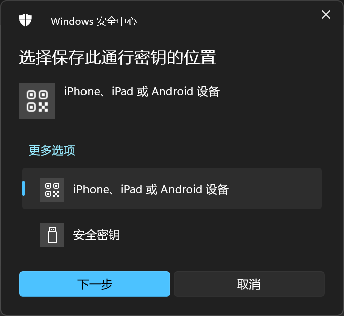
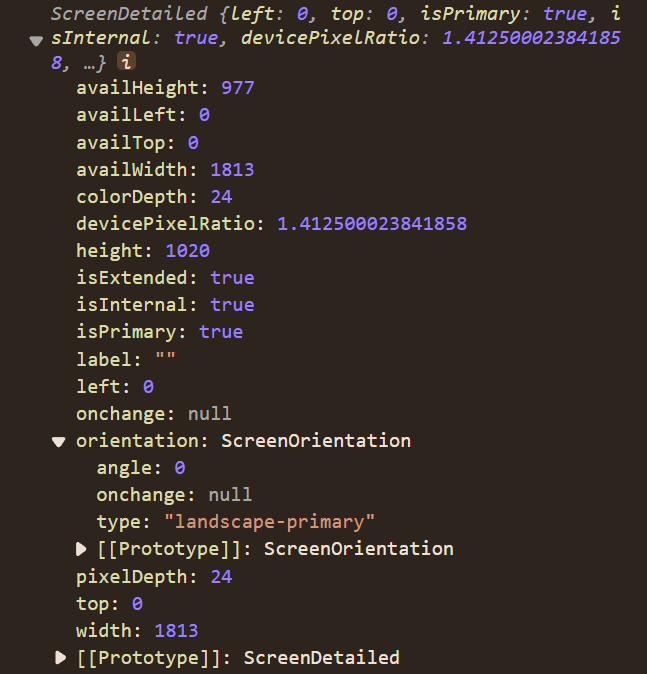

# Web API 开发完整指南

本指南涵盖了现代 Web 开发中常用的各种浏览器 API，帮助开发者构建功能丰富的 Web 应用程序。每个 API 都包含详细的功能介绍、使用方法和实际代码示例。

## 目录

1. [通信与消息传递 API](#1-通信与消息传递-api)
2. [CSS 相关 API](#2-css-相关-api)
3. [数据压缩与编码 API](#3-数据压缩与编码-api)
4. [用户交互与输入 API](#4-用户交互与输入-api)
5. [编辑与文本处理 API](#5-编辑与文本处理-api)
6. [显示与用户界面 API](#6-显示与用户界面-api)
7. [媒体与多媒体 API](#7-媒体与多媒体-api)
8. [安全与认证 API](#8-安全与认证-api)
9. [网络与存储 API](#9-网络与存储-api)
10. [图形与渲染 API](#10-图形与渲染-api)
11. [系统与设备 API](#11-系统与设备-api)
12. [总结与参考](#12-总结与参考)

---

## 1. 通信与消息传递 API

### 1.1 Broadcast Channel API

#### 功能介绍

Broadcast Channel API 允许浏览上下文（即 window、tab、frame 或 iframe）与同源的 worker 之间进行基本通信。可跨上下文通信。它可用于检测同一来源内其他标签页中的用户操作，例如用户登录或退出时。

#### 基本用法

发送到通道的数据使用结构化克隆算法进行序列化，这意味着你可以安全地发送各种各样的数据对象，而无需自己对其进行序列化。

#### 代码示例

```javascript
// 连接至广播频道
const bc = new BroadcastChannel("channelName");

// 发送简单消息
bc.postMessage("这是一条测试消息。");

// 监听消息
bc.onmessage = event => {
  console.log(event, bc.name === "channelName");
};

bc.addEventListener("message", event => {
  console.log("收到消息:", event.data);
});

// 监听错误
bc.onmessageerror = event => {
  console.log("消息错误:", event);
};

// 断开频道
bc.close();
```

### 1.2 Channel Messaging API

#### 功能介绍

Channel Messaging API 允许两个运行在同一个文档的不同浏览上下文（比如两个 iframe，或者文档主体和一个 iframe，使用 SharedWorker 的两个文档，或者两个 worker）中的独立脚本直接进行通讯，在每端使用一个端口（port）通过双向频道（channel）或管道（pipe）向彼此传递消息。

#### 基本用法

调用 window.postMessage 方法将端口传递到另一个浏览器上下文。当这些可传递的对象被传递后，它们就从之前所属的上下文中消失了。比如一个端口，一旦被发送，在原本的上下文中就再也不可用了。

#### 代码示例

```javascript
// 创建消息频道
const channel = new MessageChannel();
const port1 = channel.port1;

// 在 port1 监听 port2 的消息
port1.addEventListener("message", function (e) {
  console.log("从port2接收到数据：", e.data);
  // 通过port1向port2发送消息
  port1.postMessage("你好，port2");
  // 断开端口连接
  port1.close();
});

// 开始发送该端口中的消息队列
port1.start();

// 将port2发送给iframe
const iframe = document.querySelector("iframe");
iframe.contentWindow.postMessage("init", "*", [channel.port2]);

// iframe端接收端口
iframe.contentWindow.onmessage = function (event) {
  if (event.data === "init") {
    const port2 = event.ports[0];
    
    // 接收从port1发来的消息
    port2.onmessage = function (e) {
      console.log("从port1接收到消息：", e.data);
      // 通过port2向port1发送消息
      port2.postMessage("这是port2的回复");
    };
  }
};
```

---

## 2. CSS 相关 API

### 2.1 CSS Custom Highlight API

#### 功能介绍

CSS 自定义高亮 API 提供了一种方法，可以通过使用 JavaScript 创建范围并使用 CSS 定义样式来设置文档中任意文本范围的样式。

在网页上设置文本范围样式非常有用。例如，文本编辑类的 Web 应用程序会突出显示拼写或语法错误，代码编辑器会突出显示语法错误。

CSS 自定义高亮 API 通过提供一种创建任意 Range 对象并设置其样式的方法（而不是局限于浏览器定义的范围），扩展了其他高亮伪元素的概念，例如 ::selection、::spelling-error、::grammar-error 和 ::target-text。

使用 CSS 自定义高亮 API，你可以通过编程方式创建文本范围并高亮显示它们，而不会影响页面中的 DOM 结构。

使用 CSS 自定义高亮 API 设置网页上文本范围的样式有四个步骤：

- 创建 Range 对象。
- 为这些范围创建 Highlight 对象。
- 使用 HighlightRegistry 进行注册。
- 使用 ::highlight() 伪元素定义高亮样式。

```js
// 第一步：创建Range对象
const parentNode = document.getElementById("foo");

const range1 = new Range();
range1.setStart(parentNode, 10);
range1.setEnd(parentNode, 20);

const range2 = new Range();
range2.setStart(parentNode, 40);
range2.setEnd(parentNode, 60);
// 为Range对象创建高亮Highlight对象
const highlight = new Highlight(range1, range2);
// 注册高亮。CSS.highlights：类 Map 对象用于使用自定义标识符注册高亮显示。
CSS.highlights.set("user-1-highlight", user1Highlight);
// 定义注册的高亮样式
::highlight(user-1-highlight) {
  background-color: yellow;
  color: black;
}

// 从注册表中删除一个高亮显示。
CSS.highlights.delete("user-1-highlight");

// 清除注册表。
CSS.highlights.clear();

```

### 2.2 CSS Font Loading API

#### 功能介绍

CSS 字体加载 API 为你提供了动态加载字体资源的事件和接口。

#### 基本用法

在 CSS 中你可以使用 @font-face 规则下载字体，并使用 font-family 属性将字体应用于元素。但是，下载字体流程由客户端控制，大多数客户端仅会在首次需要该字体时才获取、加载该字体，这可能会导致明显的延迟。

CSS 字体加载 API 提供了控制和跟踪字体加载过程的能力，并允许你将其添加到 Document 或 Worker 的字体集中。将字体添加到 Document 或 Worker 的字体集中会让客户端在需要时自动获取、加载字体。字体可以在其被加入字体集之前或之后被加载，但是你必须先将字体添加到字体集，再将其用于绘图。

#### 代码示例

```js
// 定义字体
// 定义字体
const font = new FontFace("myfont", "url(myfont.woff)", {
  style: "italic",
  weight: "400",
  stretch: "condensed",
});

// 把字体添加到 document.fonts（FontFaceSet）中
document.fonts.add(font);
// 加载字体
font.load();
// 或者fontsSet加载字体
document.fonts.load("36px FontFamily Oxygen").then(
  fonts => {
    console.log(fonts);
  },
  err => {
    console.error(err);
  }
);

document.fonts.addEventListener("loading", event => {
  console.log(event.fontfaces);
});
document.fonts.addEventListener("loadingerror", event => {
  console.log(event.fontfaces);
});
document.fonts.addEventListener("loadingdone", event => {
  event.fontfaces.forEach(font => {
    console.log(font.family);
  });
});
document.fonts.ready.then(function () {
  for (const fontFace of document.fonts.values()) {
    for (const property in fontFace) {
      console.log(fontFace[property]);
    }
  }
});
```

### 2.3 CSS Properties and Values API

#### 功能介绍

允许开发者显式地定义它们的 CSS 自定义属性，允许设置属性类型检查、默认值以及是否可继承其值。

#### 代码示例

```javascript
// 以下代码在 JavaScript 中使用 CSS.registerProperty 输入一个 CSS 自定义属性，--my-color，将其作为一个颜色，然后为其设置一个默认值，并且不允许继承它的值。
window.CSS.registerProperty({
  name: "--my-color",
  syntax: "<color>",
  inherits: false,
  initialValue: "#c0ffee",
});

// 可以在 CSS 中使用 @property at-rule 进行相同的注册：
@property --my-color {
  syntax: "<color>";
  inherits: false;
  initial-value: #c0ffee;
}
```

### 2.4 CSS Typed Object Model API

#### 功能介绍

CSS 值公开为类型化的 JavaScript 对象，以允许其执行操作。通过提供对象功能（而不是 CSSOM 字符串操作）、提供对 CSS 值的类型、方法和对象模型的访问，使 CSS 操作更具逻辑性和性能。

#### 代码示例

```js
:root {
  --mainColor: hsl(198 43% 42%);
  --black: hsl(0 0% 16%);
  --white: hsl(0 0% 97%);
  --unit: 1.2rem;
}

// Get the element
const myElement = document.querySelector("a");

// Retrieve all computed styles with computedStyleMap()
const defaultComputedStyles = myElement.computedStyleMap();

for (const [prop, val] of defaultComputedStyles) {
 defaultComputedStyles.get(prop).value //100
 defaultComputedStyles.get(prop).unit //px percent undefined
}
 let unit = defaultComputedStyles.get("--unit");
 console.log(unit); // CSSUnparsedValue {0: " 1.2rem", length: 1}
console.log(unit[0]); // " 1.2rem"
const parsedUnit = CSSNumericValue.parse(unit);
console.log(parsedUnit); // CSSUnitValue {value: 1.2, unit: "rem"}
console.log(parsedUnit.unit); // "rem"
console.log(parsedUnit.value); // 1.2

const btnWidth = allComputedStyles.get("width");
console.log(btnWidth); // CSSMathSum
console.log(btnWidth.values); // CSSNumericArray {0: CSSUnitValue, 1: CSSUnitValue, length: 2}
console.log(btnWidth.operator); // 'sum'

const transform = allComputedStyles.get("transform");
console.log(transform); // CSSTransformValue {0: CSSScale, 1: CSSTranslate, length: 2, is2D: true}
console.log(transform.length); // 1
console.log(transform[0]); // CSSScale {x: CSSUnitValue, y: CSSUnitValue, z: CSSUnitValue, is2D: true}
console.log(transform[0].x); // CSSUnitValue {value: 0.95, unit: "number"}
console.log(transform[0].y); // CSSUnitValue {value: 0.95, unit: "number"}
console.log(transform[0].z); // CSSUnitValue {value: 1, unit: "number"}
console.log(transform.is2D); // true

const bgImage = allComputedStyles.get("background-image");
console.log(bgImage); // CSSImageValue
console.log(bgImage.toString()); // url("magic-wand.png")
```

### 2.5 CSS Object Model (CSSOM)

#### 功能介绍

CSS 对象模型是一组允许用 JavaScript 操纵 CSS 的 API。它很像 DOM，但针对的是 CSS 而不是 HTML。它允许用户动态地读取和修改 CSS 样式。

#### 基本特点

CSS 的值是没有类型的，也就是使用 String 对象来表示。

#### 代码示例

```javascript
var stylesheet = document.styleSheets[1];
stylesheet.cssRules[0].style.backgroundColor = "blue";
document.getElementById("d").style.color = "orange";
el.setAttribute("style", "background-color:darkblue;");
```

## 3. 数据压缩与编码 API

### 3.1 Compression Stream API

#### 功能介绍

Compression Stream API 提供了一种 JavaScript API，使用 gzip 或者默认格式压缩和解压缩数据流。

#### 基本特点

内置的压缩库意味着 JavaScript 应用不再需要包含其它压缩库，这使得应用程序的下载大小更小。

#### API 属性

**CompressionStream 属性：**
- `readable` 返回由此对象控制的 ReadableStream 实例
- `writable` 返回由此对象控制的 WritableStream 实例

**DecompressionStream 属性：**
- `readable` 返回由此对象控制的 ReadableStream 实例
- `writable` 返回由此对象控制的 WritableStream 实例

#### 代码示例

```javascript
// 使用 gzip 对流进行压缩。
const compressedReadableStream = inputReadableStream.pipeThrough(
  new CompressionStream("gzip")
);

//函数使用 gzip 解压缩 blob。
async function DecompressBlob(blob) {
  const decompressedStream = blob
    .stream()
    .pipeThrough(new DecompressionStream("gzip"));
  return await new Response(decompressedStream).blob();
}
```

### 3.2 Encoding & TextEncoderStream API

#### 功能介绍

TextEncoder 提供了一种机制来处理各种字符编码文本，包括传统的非 UTF-8 编码。

#### API 接口

- **TextEncoderStream**: 将一个字符串流转换为 UTF-8 编码的字节，它与 TextEncoder 的流形式等价
- **TextDecoderStream**: 将二进制编码（如 UTF-8 等）的文本流转换为字符串流，它与 TextDecoder 的流形式等价

API 提供了四个接口：TextDecoder、TextEncoder、TextDecoderStream 和 TextEncoderStream。

#### API 属性

**TextEncoderStream 属性：**
- `encoding` 总是返回"utf-8"
- `readable` 返回此对象控制的 ReadableStream 实例
- `writable` 返回此对象控制的 WritableStream 实例

#### 代码示例

```javascript
/**TextDecoder 和 TextDecoderStream
 * @urfLabel 一个字符串，默认是 "utf-8"。可以是任意有效的编码。
 * @options 一个布尔值，表示在解码无效数据时,是否必须抛出 TypeError。默认是 false
 *  fatal
 */
new TextDecoder();
new TextDecoder(utfLabel);
new TextDecoder(utfLabel, options);

let u8arr = new Uint8Array([240, 160, 174, 183]);
console.log(utf8decoder.decode(u8arr));

// 进行编码
const encoder = new TextEncoder();
const array = encoder.encode("€"); // Uint8Array(3) [226, 130, 172]
// 进行解码
const decoder = new TextDecoder();
const str = decoder.decode(array); // String "€"

//创建了一个 TextEncoderStream 将字符串流转换为 UTF-8 编码的二进制数据
const body = textStream.pipeThrough(new TextEncoderStream());
fetch("/dest", {
  method: "POST",
  body,
  headers: { "Content-Type": "text/plain; charset=UTF-8" },
});

//从一个 fetch() 中获取并解码二进制数据转为字符串流
const response = await fetch("https://example.com");
const stream = response.body.pipeThrough(new TextDecoderStream());
```

## 4. 用户交互与输入 API

### 4.1 EyeDropper API

#### 功能介绍

EyeDropper 接口表示一个拾色器工具的实例，用户可以打开并使用它从屏幕上选择颜色。

#### 代码示例

```javascript
// HTML 结构
// <button id="start-button">打开拾色器</button> <span id="result"></span>

document.getElementById("start-button").addEventListener("click", () => {
  const resultElement = document.getElementById("result");

  if (!window.EyeDropper) {
    resultElement.textContent = "你的浏览器不支持 EyeDropper API";
    return;
  }

  const eyeDropper = new EyeDropper();
  const abortController = new AbortController();

  eyeDropper
    .open({ signal: abortController.signal })
    .then((result) => {
      resultElement.textContent = result.sRGBHex;
      resultElement.style.backgroundColor = result.sRGBHex;
    })
    .catch((e) => {
      resultElement.textContent = e;
    });
    // 中止拾色器模式
    setTimeout(() => {
      abortController.abort();
    }, 2000);
});
```

### 4.2 Contact Picker API

#### 功能介绍

Contact Picker API 允许用户从他们的联系人列表中选择条目，并与网站或应用程序共享所选条目的有限详细信息。

#### 代码示例

```js
//异步函数使用该方法检查支持的属性。getProperties()
async function checkProperties() {
  const supportedProperties = await navigator.contacts.getProperties();
  if (supportedProperties.includes("name")) {
    // run code for name support
  }
  if (supportedProperties.includes("email")) {
    // run code for email support
  }
  if (supportedProperties.includes("tel")) {
    // run code for telephone number support
  }
  if (supportedProperties.includes("address")) {
    // run code for address support
  }
  if (supportedProperties.includes("icon")) {
    // run code for avatar support
  }
}

//设置要为每个联系人检索的属性数组，并设置一个 options 对象以允许选择多个联系人。
const props = ["name", "email", "tel", "address", "icon"];
const opts = { multiple: true };

async function getContacts() {
  try {
    //该方法向用户显示联系人选取器界面并处理所选结果
    const contacts = await navigator.contacts.select(props, opts);
    handleResults(contacts);
  } catch (ex) {
    // Handle any errors here.
  }
}
```

### 4.3 Content Index API

#### 功能介绍

Content Index API 是 Service Worker 的扩展，它允许开发人员在当前 Service Worker 的范围内添加已缓存页面的 URL 和元数据。然后，浏览器可以使用这些条目向用户显示离线阅读。作为开发人员，您还可以在应用程序中显示这些条目。

#### 基本特点

索引条目不会自动过期。最好提供一个用于清除条目的界面，或定期删除较旧的条目。

#### 代码示例

```js
// 要添加索引的内容
const item = {
  id: "post-1",
  url: "/posts/amet.html",
  title: "Amet consectetur adipisicing",
  description:
    "Repellat et quia iste possimus ducimus aliquid a aut eaque nostrum.",
  icons: [
    {
      src: "/media/dark.png",
      sizes: "128x128",
      type: "image/png",
    },
  ],
  category: "article",
};

// our asynchronous function to add indexed content
async function registerContent(data) {
  const registration = await navigator.serviceWorker.ready;

  // 特性检测： Content Index
  if (!registration.index) {
    return;
  }

  // 注册 content
  try {
    await registration.index.add(data);
  } catch (e) {
    console.log("Failed to register content: ", e.message);
  }
}

// our content
const item = {
  id: "post-1",
  url: "/posts/amet.html",
  title: "Amet consectetur adipisicing",
  description:
    "Repellat et quia iste possimus ducimus aliquid a aut eaque nostrum.",
  icons: [
    {
      src: "/media/dark.png",
      sizes: "128x128",
      type: "image/png",
    },
  ],
  category: "article",
};

// our asynchronous function to add indexed content
async function registerContent(data) {
  const registration = await navigator.serviceWorker.ready;

  // feature detect Content Index
  if (!registration.index) {
    return;
  }

  // register content
  try {
    await registration.index.add(data);
  } catch (e) {
    console.log("Failed to register content: ", e.message);
  }

  // 获取所有索引条目
  const entries = await registration.index.getAll();
  for (const entry of entries) {
    console.log(entry.title, entry.url);
  }

  //取消注册的索引内容
  await registration.index.delete(article.id);
}

// service worker中访问
self.registration.index.add(item);

self.registration.index.delete(item.id);

const contentIndexItems = self.registration.index.getAll();
// contentdelete 事件仅在由于与浏览器的内置用户界面交互而发生删除时触发。调用 ContentIndex.delete（） 方法时，不会触发该函数。
self.addEventListener("contentdelete", event => {
  console.log(event.id);
  // logs content index id, which can then be used to determine what content to delete from your cache
});
```


### 4.4 指针锁定 API

#### 功能介绍

通过它可以访问原始的鼠标运动，把鼠标事件的目标锁定到一个单独的元素，这就消除了鼠标在一个单独的方向上到底可以移动多远这方面的限制，并从视图中删去光标。

> 指针锁定让你即使光标超出浏览器或屏幕的边界也能访问鼠标事件。

#### 基本特点

指针锁定和指针捕获有关。指针捕获在鼠标被拖曳时可以向一个目标元素持续传递有关事件，但是当鼠标按钮被放开时就会停止。指针锁定和指针捕获在以下方面有所不同：

- 它是持久性的。指针锁定不释放鼠标，直到作出一个显式的 API 调用或是用户使用一个专门的释放手势
- 它不局限于浏览器或者屏幕边界
- 它持续发送事件，而不管鼠标按钮状态如何
- 它隐藏光标

#### 代码示例

```javascript
function requestPointerLockWithUnadjustedMovement() {
  // 元素设置指针锁定，不启用鼠标加速
  const promise = myTargetElement.requestPointerLock({
    unadjustedMovement: true,
  });

  if (!promise) {
    console.log("不支持禁用鼠标加速");
    return;
  }

  return promise
    .then(() => console.log("指针被锁定"))
    .catch(error => {
      if (error.name === "NotSupportedError") {
        // 有些平台可能不支持未调整的移动。你可以重新请求常规指针锁定。
        return myTargetElement.requestPointerLock();
      }
    });
}

//当指针锁定状态改变时，在 document 上触发。不包含任何额外数据的简单事件。还有pointerlockerror事件
document.addEventListener("pointerlockchange", lockChangeAlert, false);

function lockChangeAlert(event) {
  // 判断当前指针锁定的元素
  if (document.pointerLockElement === canvas) {
    console.log("指针锁定状态现已锁定");
    // 退出锁定
    document.exitPointerLock();
  } else {
    console.log("指针锁定状态现已解锁");
  }
}
```
## 5. 编辑与文本处理 API

### 5.1 EditContext API

#### 功能介绍

EditContext API 可用于在 Web 上构建支持高级文本输入体验的富文本编辑器，例如输入法编辑器 （IME） 排版、表情符号选取器或任何其他特定于平台的编辑相关 UI 图面。

#### 基本用法

若要使元素在 Web 上可编辑，大多数情况下，请使用 `<input>` 元素、`<textarea>` 元素或 `contenteditable` 属性。但是，使用 EditContext API，您可以在不使用属性的情况下使其他类型的元素可编辑。

#### 代码示例

```js
<div id="html-editor" spellcheck="false"></div>;

// 要变成可编辑的元素
const editorEl = document.getElementById("html-editor");

// 创建EditContext对象
const editContext = new EditContext({
  text: "<html>\n  <body id=foo>\n    <h1 id='header'>Cool Title</h1>\n    <p class=\"wow\">hello<br/>How are you? test</p>\n  </body>\n</html>",
});
//内容改变时触发
editContext.addEventListener("textupdate", e => {});
// 更新内容
editContext.updateText(2, 20, "\n");

// 赋值给元素的editContext属性
editorEl.editContext = editContext;

// 更新控制边界
const editorBounds = editorEl.getBoundingClientRect();

// Update the control bounds of the EditContext instance.
editContext.updateControlBounds(editorBounds);

//EditContext.updateSelection（） 和 EditContext.updateSelectionBounds（） 方法更新 EditContext 选择状态和选择边界。EditContext.updateCharacterBounds（） 方法更新字符边界。
```


- `readable` 返回此对象控制的 ReadableStream 实例。
- `writable` 返回此对象控制的 WritableStream 实例。

```js
/**TextDecoder 和 TextDecoderStream
 * @urfLabel 一个字符串，默认是 "utf-8"。可以是任意有效的编码。
 * @options 一个布尔值，表示在解码无效数据时,是否必须抛出 TypeError。默认是 false
 *  fatal
 */
new TextDecoder();
new TextDecoder(utfLabel);
new TextDecoder(utfLabel, options);

let u8arr = new Uint8Array([240, 160, 174, 183]);
console.log(utf8decoder.decode(u8arr));

// 进行编码
const encoder = new TextEncoder();
const array = encoder.encode("€"); // Uint8Array(3) [226, 130, 172]
// 进行解码
const decoder = new TextDecoder();
const str = decoder.decode(array); // String "€"

//创建了一个 TextEncoderStream 将字符串流转换为 UTF-8 编码的二进制数据
const body = textStream.pipeThrough(new TextEncoderStream());
fetch("/dest", {
  method: "POST",
  body,
  headers: { "Content-Type": "text/plain; charset=UTF-8" },
});

//从一个 fetch() 中获取并解码二进制数据转为字符串流
const response = await fetch("https://example.com");
const stream = response.body.pipeThrough(new TextDecoderStream());
```


## 6. 显示与用户界面 API

### 6.1 全屏 API

#### 功能介绍

全屏 API（Fullscreen API）通过添加方法使特定的 Element（及其后代）以全屏模式呈现，并在不再需要时退出全屏模式。这使得使用用户的整个屏幕（在退出全屏模式之前去除所有浏览器用户界面元素和其他应用程序）来展示所需内容（例如在线游戏）成为可能。

#### 基本特点

全屏 API 向 Document 和 Element 接口添加了方法，以允许打开和关闭全屏模式。

#### 代码示例

```js
function toggleFullScreen() {
  //是否存在已经全屏的元素
  if (!document.fullscreenElement) {
    // 使元素全屏显示
    document.documentElement.requestFullscreen();
  } else if (document.exitFullscreen) {
    // 退出全屏
    document.exitFullscreen();
  }
}
// 是否支持全屏
document.fullscreenEnable;
// 监控全屏改变事件
document.addEventListener("fullscreenchange", function (event) {
  console.log(event);
});
// 不能切换全屏模式时触发
document.addEventListener("fullscreenerror", function (event) {
  console.log(event);
});
```

### 6.2 HTML 拖放 API

#### 功能介绍

HTML 拖放（Drag and Drop）接口使应用程序能够在浏览器中使用拖放功能。例如，用户可使用鼠标选择可拖拽（draggable）元素，将元素拖拽到可放置（droppable）元素，并释放鼠标按钮以放置这些元素。拖拽操作期间，会有一个可拖拽元素的半透明快照跟随着鼠标指针。

#### 相关事件

**被拖放元素的事件：**
- `drag`
- `dragstart`
- `dragend`

**放置元素的事件：**
- `dragenter`
- `dragover`
- `dragleave`
- `drop`

#### DataTransfer 属性和方法

- `effectAllowed` 提供所有可用的操作类型。必须是 none, copy, copyLink, copyMove, link, linkMove, move, all or uninitialized 之一
- `dropEffect` 获取当前选定的拖放操作类型或者设置的为一个新的类型。值必须为 none, copy, link 或 move
- `files` 包含数据传输中可用的所有本地文件的列表
- `items` 包含所有拖动数据列表的 DataTransferItemList 对象
  - `kind` 拖拽项的种类，string 或是 file
  - `type` 拖拽项的类型，一般是一个 MIME 类型
  - `getAsFile()` 拖拽项的 File 对象（当拖拽项不是一个文件时返回 null）
  - `getAsString()` 使用拖拽项的字符串作为参数执行指定回调函数
- `types` 一个提供 dragstart 事件中设置的格式的 strings 数组
- `getData()`
- `setData()`
- `clearData()`
- `setDragImage`
- `addElement()`

#### 代码示例

```js
<p id="p1" draggable="true">
  This element is draggable.
</p>;
<p
  id="target"
  ondrop="drop_handler(event)"
  ondragover="dragover_handler(event)">
  Drop Zone
</p>;
window.addEventListener("DOMContentLoaded", () => {
  const element = document.getElementById("p1");
  element.addEventListener("dragstart", function (ev) {
    // 获取支持的类型，例如：text/plain
    event.dataTransfer.types;
    // 添加拖拽数据
    ev.dataTransfer.setData("text/plain", ev.target.innerText);
    ev.dataTransfer.setData("text/html", ev.target.outerHTML);
    // 储存id在application/my-app
    ev.dataTransfer.setData("application/my-app", ev.target.id);
    ev.dataTransfer.setData(
      "text/uri-list",
      ev.target.ownerDocument.location.href
    );
    var img = new Image();
    img.src = "example.gif";
    ev.dataTransfer.setDragImage(img, 10, 10);
    //拖放操作中用户给予的反馈 copy,move,link,none,copyMove,copyLink,linkMove,all
    ev.dataTransfer.effectAllowed = "copy";
  });
});

// 放置区元素事件
function dragover_handler(ev) {
  //每个处理程序调用 preventDefault() 来阻止对这个事件的其他处理过程（如触点事件或指针事件）
  ev.preventDefault();
  // none,copy,move,link
  ev.dataTransfer.dropEffect = "move";
}
function drop_handler(ev) {
  ev.preventDefault();
  // 根据前面储存的id获取数据，放置到放置区
  var data = ev.dataTransfer.getData("application/my-app");
  ev.target.appendChild(document.getElementById(data));
  // 删除数据
  event.dataTransfer.clearData("text/uri-list");
}
```

### 6.3 空闲检测 API

#### 功能介绍

空闲检测 API 提供了一种方法来检测用户的空闲状态、活动、空闲和锁定，具体来说，无需从脚本轮询即可收到空闲状态更改的通知。

#### 代码示例

```js
const controller = new AbortController();
const signal = controller.signal;

startButton.addEventListener("click", async () => {
  // 是否授予源访问其 Idle 状态的权限
  if ((await IdleDetector.requestPermission()) !== "granted") {
    console.error("Idle detection permission denied.");
    return;
  }

  try {
    const idleDetector = new IdleDetector();
    // userState 和 screenState值发生更改时调用。
    idleDetector.addEventListener("change", () => {
      // 用户是否与屏幕或设备进行了交互active,idle
      const userState = idleDetector.userState;
      //指示屏幕是否被锁定locked,unlocked
      const screenState = idleDetector.screenState;
      console.log(`Idle change: ${userState}, ${screenState}.`);
    });
    // 开始侦听 用户 IDLE 状态的更改
    await idleDetector.start({
      threshold: 60_000,
      signal,
    });
    console.log("IdleDetector is active.");
  } catch (err) {
    // Deal with initialization errors like permission denied,
    // running outside of top-level frame, etc.
    console.error(err.name, err.message);
  }
});

stopButton.addEventListener("click", () => {
  controller.abort();
  console.log("IdleDetector is stopped.");
});
```

### 6.4 弹出框 API

#### 功能介绍

Popover API 为开发人员提供了一种标准、一致、灵活的机制，用于在其他页面内容之上显示弹出框内容。Popover 内容可以使用 HTML 属性以声明方式控制，也可以通过 JavaScript 进行控制。

#### 代码示例

HTML 控制：

```html
<button popovertarget="mypopover" popovertargetaction="show">
  show popover。默认是toggle，
</button>
<button popovertarget="mypopover" popovertargetaction="hide">
  hide popove
</button>
<div id="mypopover" popover>Popover content</div>
```

JavaScript 控制：

```javascript
let popover = document.getElementById("mypopover");
popover.hidePopover();
popover.showPopover();
popover.togglePopover();
popover.popover === "auto" || "mannul";
popover.addEventListener("beforetoggle", function (event) {
  console.log("showing 和 hidden 之间变化之前触发");
});
popover.addEventListener("toggle", function (event) {
  console.log("showing 和 hidden 之间变化之后触发");
});
```

## 7. 媒体与多媒体 API

### 7.1 MediaStream 图像捕获 API

#### 功能介绍

MediaStream Image Capture API 是用于从摄影设备捕获图像或视频的 API。除了捕获数据之外，它还允许您检索有关设备功能的信息，例如图像大小、红眼消除、是否有闪光灯以及它们当前设置的内容。相反，API 允许在设备允许的约束范围内配置功能。

#### 代码示例

```javascript
// 通过调用 MediaDevices.getUserMedia（） 获取对设备的引用
navigator.mediaDevices.getUserMedia({ video: true }).then(mediaStream => {
  // 隔离媒体流的视觉部分，获取第一项
  const track = mediaStream.getVideoTracks()[0];
  //用于从通过有效的 MediaStreamTrack 引用的摄影设备捕获图像。
  let imageCapture = new ImageCapture(track);
  //获取实时视频的快照
  imageCapture
    .grabFrame()
    .then(imageBitmap => {
      const canvas = document.querySelector("#grabFrameCanvas");
      drawCanvas(canvas, imageBitmap);
    })
    .catch(error => console.error(error));
  //使用视频捕获进行单次曝光
  imageCapture
    .takePhoto()
    .then(blob => createImageBitmap(blob))
    .then(imageBitmap => {
      const canvas = document.querySelector("#takePhotoCanvas");
      drawCanvas(canvas, imageBitmap);
    })
    .catch(error => console.error(error));

  let zoom = document.querySelector("#zoom");
  //捕获映像之获取设备功能
  const capabilities = track.getCapabilities();
  // Check whether zoom is supported or not.
  if (!capabilities.zoom) {
    return;
  }
  // 配置设备功能
  track.applyConstraints({ advanced: [{ zoom: zoom.value }] });
});
```

### 7.2 媒体功能 API

#### 功能介绍

媒体功能 API 允许开发人员确定设备的解码和编码能力，公开媒体是否受支持、播放是否应流畅且节能等信息，并提供有关播放的实时反馈，以更好地启用自适应流式处理，并访问显示属性信息。

#### 基本特点

媒体功能 API 提供了比 `MediaRecorder.isTypeSupported()` 或 `HTMLMediaElement.canPlayType()` 更强大的功能，后者仅解决一般浏览器支持问题，而不解决性能问题。该 API 还提供了访问显示属性信息的功能，例如支持的色域、动态范围功能以及有关播放的实时反馈。

要测试对视频或音频内容进行编码和解码的支持、流畅度和能效，请使用 MediaCapabilities 接口的 `encodingInfo()` 和 `decodingInfo()` 方法。

#### 代码示例

```javascript
if ("mediaCapabilities" in navigator) {
  const audioFileConfiguration = {
    type: "file",
    audio: {
      contentType: "audio/mp3",
      channels: 2,
      bitrate: 132700,
      samplerate: 5200,
    },
  };

  navigator.mediaCapabilities
    .decodingInfo(audioFileConfiguration)
    .then(result => {
      console.log(
        `This configuration is ${result.supported ? "" : "not "}supported,`
      );
      console.log(`${result.smooth ? "" : "not "}smooth, and`);
      console.log(`${result.powerEfficient ? "" : "not "}power efficient.`);
    })
    .catch(() => {
      console.log(`decodingInfo error: ${contentType}`);
    });
}
```

### 7.3 媒体捕捉与媒体流 API

#### 功能介绍

媒体捕捉与媒体流 API（Media Capture and Streams API），通常被称为媒体流 API（Media Streams API、MediaStream API），是与 WebRTC 相关的 API，提供对音频或视频数据流的支持。

#### 基本特点

它提供了用于处理媒体流及其组成轨道的接口和方法、与数据格式相关的约束、异步使用数据时成功和错误的回调以及在处理期间触发的事件。

一个 MediaStream 包含零个或多个代表各种声音和视频轨道的 MediaStreamTrack 对象。每一个 MediaStreamTrack 可能有一个或多个通道。这个通道代表着媒体流的最小单元，比如一个音频信号对应着一个对应的扬声器，像是在立体声道中的左声道或右声道。

MediaStream 对象有着单一的输入和输出。由 getUserMedia() 创建的 MediaStream 对象是在本地借助用户相机和麦克风的源输入。非本地的 MediaStream 可能代表一个媒体元素（如 `<video> 或 <audio>`），或是一个通过 WebRTC RTCPeerConnection API 获得的源自网络的媒体流，又或是一个使用 Web 音频 API 的 MediaStreamAudioDestinationNode 创建的媒体流。

#### 代码示例

```javascript
"use strict";

// Put variables in global scope to make them available to the browser console.
var video = document.querySelector("video");
var constraints = (window.constraints = {
  audio: false,
  video: true,
});
var errorElement = document.querySelector("#errorMsg");

navigator.mediaDevices
  .getUserMedia(constraints)
  .then(function (stream) {
    var videoTracks = stream.getVideoTracks();
    console.log("Got stream with constraints:", constraints);
    console.log("Using video device: " + videoTracks[0].label);
    stream.onended = function () {
      console.log("Stream ended");
    };
    window.stream = stream; // make variable available to browser console
    video.srcObject = stream;
  })
  .catch(function (error) {
    if (error.name === "ConstraintNotSatisfiedError") {
      errorMsg(
        "The resolution " +
          constraints.video.width.exact +
          "x" +
          constraints.video.width.exact +
          " px is not supported by your device."
      );
    } else if (error.name === "PermissionDeniedError") {
      errorMsg(
        "Permissions have not been granted to use your camera and " +
          "microphone, you need to allow the page access to your devices in " +
          "order for the demo to work."
      );
    }
    errorMsg("getUserMedia error: " + error.name, error);
  });

function errorMsg(msg, error) {
  errorElement.innerHTML += "<p>" + msg + "</p>";
  if (typeof error !== "undefined") {
    console.error(error);
  }
}
```

### 7.4 媒体会话 API

#### 功能介绍

媒体会话 API 提供了一种自定义媒体通知的方法。它通过提供元数据供 Web 应用程序正在播放的媒体的用户代理显示来实现此目的。

#### 基本特点

它还提供了操作处理程序，浏览器可以使用这些操作处理程序来访问平台媒体键，例如键盘、耳机、遥控器上的硬件键，以及移动设备的通知区域和锁屏界面上的软件键。因此，您可以通过设备无缝控制 Web 提供的媒体，即使不查看网页也是如此。

#### 代码示例

```javascript
playButton.addEventListener("pointerup", event => {
  const audio = document.querySelector("audio");

  // User interacted with the page. Let's play audio!
  audio
    .play()
    .then(() => {
      if ("mediaSession" in navigator) {
        navigator.mediaSession.metadata = new MediaMetadata({
          title: "Unforgettable",
          artist: "Nat King Cole",
          album: "The Ultimate Collection (Remastered)",
          artwork: [
            {
              src: "https://dummyimage.com/96x96",
              sizes: "96x96",
              type: "image/png",
            },
            {
              src: "https://dummyimage.com/128x128",
              sizes: "128x128",
              type: "image/png",
            },
            {
              src: "https://dummyimage.com/192x192",
              sizes: "192x192",
              type: "image/png",
            },
            {
              src: "https://dummyimage.com/256x256",
              sizes: "256x256",
              type: "image/png",
            },
          ],
        });

        navigator.mediaSession.setActionHandler("play", () => {
          /* Code excerpted. */
        });
        navigator.mediaSession.setActionHandler("pause", () => {
          /* Code excerpted. */
        });
        navigator.mediaSession.setActionHandler("seekforward", () => {
          /* Code excerpted. */
        });
        navigator.mediaSession.setActionHandler("previoustrack", () => {
          /* Code excerpted. */
        });
        navigator.mediaSession.setActionHandler("nexttrack", () => {
          /* Code excerpted. */
        });

        //要将媒体会话的当前状态设置为 playing
        navigator.mediaSession.playbackState = "playing";
      }
    })
    .catch(error => {
      console.error(error);
    });
});
```

### 7.5 MediaStream Recording API

#### 功能介绍

媒体流（音/视频）录制 API 让记录音频流或视频流信息更加容易。当使用 `navigator.mediaDevices.getUserMedia()` 时，它提供了一种简单的方式从用户的输入设备中记录信息，并且可以马上在 Web 应用中查看记录的信息。

#### 基本用法

使用 `getUserMedia()` 来捕获我们想要的媒体流。我们使用 MediaRecorder API 来记录信息流，并将每个记录的片段输出到生成的 `<audio>` 元素的源中，以便可以回放。

#### 代码示例

```javascript
if (navigator.mediaDevices && navigator.mediaDevices.getUserMedia) {
  var audio = document.createElement("audio");
  let body = document.getElementsByTagName("body")[0];
  body.appendChild(audio);
  // 使用getUserMedia，仅抓取音频流
  navigator.mediaDevices
    .getUserMedia({ audio: true })
    .then(function (stream) {
      // 创建媒体记录器实例，并直接传递该媒体流
      var mediaRecorder = new MediaRecorder(stream);
      //0s后开始录音：调用MediaRecorder.start()
      setTimeout(() => {
        mediaRecorder.start();
        console.log("recording状态", mediaRecorder.state);
      }, 0);
      // 收集录制的数据
      var chunks = [];
      mediaRecorder.ondataavailable = function (e) {
        chunks.push(e.data);
      };
      // 5s后结束录制
      setTimeout(function () {
        mediaRecorder.stop();
        console.log("inactive状态", mediaRecorder.state);
      }, 5000);
      // 录音停止时，使用抓取到的blob数据，赋给audio.src
      mediaRecorder.onstop = function (e) {
        var blob = new Blob(chunks, { type: "audio/ogg; codecs=opus" });
        chunks = [];
        var audioURL = window.URL.createObjectURL(blob);
        audio.src = audioURL;
      };
    })
    .catch(function (err) {
      console.log("The following getUserMedia error occured: " + err);
    });
} else {
  console.log("getUserMedia not supported on your browser!");
}
```

### 7.6 页面可见性 API

#### 功能介绍

页面可见性 API 提供了一些事件，你可以通过查看这些事件来了解文档何时变为可见或隐藏，还提供了一些功能来查看页面的当前可见性状态。

#### 基本特点

通过让页面在文档不可见时避免执行不必要的任务，这对于节省资源和提高性能特别有用。

#### 代码示例

```javascript
const audio = document.querySelector("audio");
document.addEventListener("visibilitychange", () => {
  // visible hidden
  if (document.visibilityState === "visible") {
    audio.pause();
  } else {
    audio.play();
  }
});
```

### 7.7 画中画 API

#### 功能介绍

画中画 API（Picture-in-Picture API）允许网站总是在其他窗口之上创建一个浮动的视频，以便用户在其他内容站点或者设备上的应用程序交互时可以继续播放媒体。

#### 基本特点

> 文档画中画 API 扩展了画中画 API，使其能够将任意 HTML 内容（而不仅仅是视频）呈现在始终置顶的窗口中。

#### 代码示例

```javascript
function togglePictureInPicture() {
  // 已经存在画中画元素
  if (document.pictureInPictureElement) {
    // 退出画中画模式
    document.exitPictureInPicture();
  } else {
    // 支持画中画模式
    if (document.pictureInPictureEnabled) {
      // 启动画中画
      let PictureInPictureWindow = video.requestPictureInPicture();

      PictureInPictureWindow.onresize = function (event) {
        console.log(
          PictureInPictureWindow.width,
          PictureInPictureWindow.height
        );
      };
    }
  }
}
document.addEventListener("enterpictureinpicture", function (event) {
  console.log("进入画中画模式时触发");
});
document.addEventListener("leavepictureinpicture", function (event) {
  console.log("离开画中画模式时触发");
});
```

### 7.8 屏幕捕捉 API

#### 功能介绍

屏幕捕捉 API 引入了对现有媒体捕捉和流 API 的补充，以便让用户选择一个屏幕或屏幕的一部分（如一个窗口）在 MediaStream 中进行捕捉。然后，该流可以被录制或与其他人共享。

#### 基本特点

屏幕捕捉 API 相对简单易用。其唯一的方法是 `getDisplayMedia()`，它的任务是要求用户选择一个屏幕或屏幕的一部分以 MediaStream 的形式捕捉。

#### 代码示例

```javascript
async function startCapture(displayMediaOptions) {
  let captureStream = null;

  try {
    captureStream = await navigator.mediaDevices.getDisplayMedia(displayMediaOptions);
  } catch (err) {
    console.error("Error: " + err);
  }
  return captureStream;
}

startCapture().then(stream => {
  const video = document.querySelector("video");
  video.srcObject = stream;
  video.addEventListener("loadedmetadata", () => {
    video.play();
  });
});
```

### 7.9 Web Audio API

#### 功能介绍

Web Audio API 提供了一个强大且功能齐全的系统来控制网络上的音频，允许开发人员选择音频源，向音频添加效果，创建音频可视化，应用空间效果（如平移）等等。

#### 基本特点

Web Audio API 使用户能够在音频上下文中进行音频操作，具有模块化路由的特色。在音频节点中执行基本的音频操作，这些音频节点连接在一起形成音频路由图。在单个上下文中支持多个音频源，尽管它们具有不同的通道布局。

#### 代码示例

```javascript
const audioContext = new (window.AudioContext || window.webkitAudioContext)();
const oscillator = audioContext.createOscillator();
const gainNode = audioContext.createGain();

oscillator.connect(gainNode);
gainNode.connect(audioContext.destination);

oscillator.frequency.value = 440;
gainNode.gain.value = 0.3;

oscillator.start();
oscillator.stop(audioContext.currentTime + 1);
```

## 8. 安全与认证 API

### 8.1 Web Authentication API

Web Authentication API 继承自 Credential Management API ，使用公钥密码学使得验证更强壮，不需要 SMS 文本就能实现无密码验证和安全的双因素验证。这里指定使用 PublicKeyCredential。

使用非对称加密替代密码或 SMS 短信在网站上注册、登录、second-factor authentication（双因素验证）。解决了 phishing（钓鱼）、data breaches（数据破坏）、SMS 文本攻击、其他双因素验证等重大安全问题，同时显著提高了易用性（因为用户不必管理许多越来越复杂的密码）。

Web Authentication API 有两个对应于注册和登录的基本方法：

- navigator.credentials.create() - 当使用 publicKey 选项时，创建一个新的凭据，无论是用于注册新账号还是将新的非对称密钥凭据与已有的账号关联。
- navigator.credentials.get() - 当使用 publicKey 选项时，使用一组现有的凭据进行身份验证服务，无论是用于用户登录还是双因素验证中的一步。

WebAuthn 注册流程:

- 应用程序请求注册 - 应用程序发出注册请求。

- 服务器发送挑战（至少 16 字节的随机 buffer）、用户信息和依赖方信息 - 从服务器接收到的参数将传递给 create()，返回兑现为包含 AuthenticatorAttestationResponse 的 PublicKeyCredential 的 Promise。

- 浏览器向认证器调用 authenticatorMakeCredential()

- 认证器创建新的密钥对和证明 - 在进行下一步之前，认证器通常会以某种形式要求用户确认，如输入 PIN，使用指纹，进行虹膜扫描等，以证明用户在场并同意注册

- 认证器将数据返回浏览器 - 新的公钥、全局唯一的凭证 ID 和其他的证明数据会被返回到浏览器，成为 attestationObject。

- 浏览器生成最终的数据并发送到服务器

- 服务器验证数据并完成注册

  - 验证接收到的挑战与发送的挑战相同
  - 确保 origin 与预期的一致
  - 使用对应认证器型号的证书链验证 clientDataHash 的签名和证明

  服务器将会把新的公钥与用户帐户相关联以供将来用户希望使用公钥进行身份验证时使用。

```js
// 用作create()的参数，向认证器注册凭据
var createCredentialDefaultArgs = {
  publicKey: {
    rp: { name: "Acme" },
    user: {
      id: new Uint8Array(16),
      name: "john.p.smith@example.com",
      displayName: "John P. Smith",
    },

    pubKeyCredParams: [{ type: "public-key", alg: -7 }],
    attestation: "direct",
    timeout: 60000,
    // 从服务端返回的challenge信息，至少16位的buffer
    challenge: new Uint8Array([
      0x8c, 0x0a, 0x26, 0xff, 0x22, 0x91, 0xc1, 0xe9, 0xb9, 0x4e, 0x2e, 0x17,
      0x1a, 0x98, 0x6a, 0x73, 0x71, 0x9d, 0x43, 0x48, 0xd5, 0xa7, 0x6a, 0x15,
      0x7e, 0x38, 0x94, 0x52, 0x77, 0x97, 0x0f, 0xef,
    ]).buffer,
  },
};

// 构建登录凭据，用于get()参数，进行身份验证服务
var getCredentialDefaultArgs = {
  publicKey: {
    timeout: 60000,
    // 把create()返回的PublicKeyCredential的id，添加进来
    // allowCredentials: [newCredential],
    challenge: new Uint8Array([
      0x79, 0x50, 0x68, 0x71, 0xda, 0xee, 0xee, 0xb9, 0x94, 0xc3, 0xc2, 0x15,
      0x67, 0x65, 0x26, 0x22, 0xe3, 0xf3, 0xab, 0x3b, 0x78, 0x2e, 0xd5, 0x6f,
      0x81, 0x26, 0xe2, 0xa6, 0x01, 0x7d, 0x74, 0x50,
    ]).buffer,
  },
};

// 注册凭据：认证器通常会以某种形式要求用户确认，如输入 PIN，使用指纹，进行虹膜扫描等，以证明用户在场并同意注册
navigator.credentials
  .create(createCredentialDefaultArgs)
  .then(PublicKeyCredential => {
    //此时应该把认证器返回的PublicKeyCredential发送到服务器，由服务器验证数据并完成注册

    // 保存认证器返回的凭据，用于下次登录使用该凭据登录
    var idList = [
      {
        id: PublicKeyCredential.rawId,
        transports: ["usb", "nfc", "ble"],
        type: "public-key",
      },
    ];
    getCredentialDefaultArgs.publicKey.allowCredentials = idList;
  })
  .then(assertion => {
    console.log("ASSERTION", assertion);
  })
  .catch(err => {
    console.log("ERROR", err);
  });

// 使用一组现有的凭据进行身份验证服务
return navigator.credentials.get(getCredentialDefaultArgs);
```

生成凭据之前，询问凭据保存的位置：

选择保存到移动设备上，需要打开蓝牙：

需要移动设备扫码保存：


### 8.2 PasswordCredential

Credential Management API 的一种，用户浏览器保存用户和密码，免于下次输入操作。Credential 有以下几类：

- PublicKeyCredential 非对称密钥凭据，用于 web authentication 登录
- PasswordCredential 浏览器保存账号密码
- IdentityCredential 联合身份验证产生的用户身份凭证
- FederatedCredential 联合凭证
- OTPCredential 验证码凭据

```js
//FederatedCredential联合认证
const cred = new FederatedCredential({
  id: "2323",
  name: "jixii",
  provider: "https://account.google.com",
});

// Store it
navigator.credentials.store(cred).then(() => {
  // Do something else.
});

let obj = {
  id: "zhang",
  name: "zhangjinxi",
  password: "zhangjinxi",
  origin: "https://developer.mozilla.org/",
  iconURL:
    "https://www.baidu.com/link?url=V_IZ3q1Pnw9qtN2o_WWw5u5XOMLTyrAYrAx4t6pH46P-xCAgSULCbEM_EKNAbD7bTBepxOLr0HNK_4MX7cEDhLz1Ftl2LhxD_PDgzxJHiYoQW7m19zFy-4ohY_UTfgldTiBpZjwcsPyPusfNRFJWR-LtthKCWFNPNQhipZCPX67mYsHJCuDuxVgjUwemaj8sTcbINa4eObyTRcx6r7nTy2QTbLpuB3iTV_e5qsmC-tjOGGIo0YegBFPVkhaRlTwgMdtsS4ESsNFTn-_O4q2xuRoeBSc8FOD0KMuPpHb2z8w5ttdUIde6V-zJcXFQipLG-QS7wifTZcqmLaN7MDXmi7r1vQQOKT_ak0QvIKNRtGyVrS_nEOjxizcmq3sNCWeWLzwT6QGSGQLy4-68hFMrA5I2QBMy_Oa2r9r82qikov6qLn3-hKYr_WttM-Zur6h9SCeTZsclzg8-bvyDTxRDykosfp3hCQmz0rJDEK2bHiK4Z6NR2OTZuKnV8h_HfmThU4RFsf9VGyg9eBxFwwW0VAg1Rq0qhvfNhTmAa3WXXr0G3kyYDRz_Ji5LpIJncbeT61tIgX76GwPS74uhHmO9LZGbJj7-mXlbJvOm3DnnK78a_n62pI_sOUUIvQ9fYE-uIlWkxG5lkcB8rrDC42S2C_&wd=&eqid=c54dbb4b000abb4a00000005672daad2",
};
const creds = new PasswordCredential(obj);
// Store the credentials.
navigator.credentials.store(creds).then(creds => {
  // Do something with the credentials if you need to.
  console.log(111, creds);
});
```


### 8.3 WebOTP

WebOTP API 为 Web 应用程序提供了简化的用户体验，以便在将电话号码用作登录因素时验证该电话号码是否属于用户。WebOTP 是凭据管理 API 的扩展。

验证通过两个步骤完成：

- 应用程序客户端请求一次性密码 （OTP），该密码是从应用程序服务器发送的特殊格式的 SMS 消息中获取的。
- JavaScript 用于将 OTP 输入到应用程序客户端的验证表单中，并将其提交回服务器以验证它是否与 SMS 中最初发送的内容匹配。

WebOTP API 是如何工作的？

- 在需要验证电话号码时，应用程序客户端将要求用户在表单中输入他们的电话号码，然后将其提交给应用程序服务器。
- 然后，应用程序客户端使用指定类型的选项调用 navigator.credentials.get（）。这会触发来自底层系统的 OTP 请求，其来源将从应用程序服务器接收的特殊格式的 SMS 消息（包含 OTP 和应用程序的域）。该调用是基于 Promise 的，并等待收到 SMS 消息。otptransport"sms"get()
- App 服务器将短信发送到指定的电话号码。这必须在步骤 2 发生后立即完成。
- 当设备上收到短信时，如果它包含应用程序的域，浏览器将询问用户是否同意检索/使用 OTP。例如，Chrome 会显示一个对话框，询问他们是否允许从 SMS 中检索 OTP;其他浏览器可能会以不同的方式处理它。如果他们同意，则调用将使用包含 OTP 的 OTPCredential 对象完成。get()
- 然后，您可以按照任何您想要的方式使用 OTP。典型的用法是将其设置为应用程序客户端上验证表单的值，然后提交表单，从而使该过程尽可能无缝。
- 然后，应用服务器将验证发回给它的 OTP 是否与最初在 SMS 中发送的 OTP 匹配，如果匹配，则完成该过程（例如，让用户登录）。

```js
//典型的 SMS 消息如下所示：
Your verification code is 123456.

@www.example.com #123456

//在此示例中，当 SMS 消息到达并且用户授予权限时，将返回一个 OTPCredential 对象以及 OTP。然后，此密码将预先填充到验证表单字段中，并提交表单。
<input type="text" autocomplete="one-time-code" inputmode="numeric" />

// 特性检测
if ("OTPCredential" in window) {
  window.addEventListener("DOMContentLoaded", (e) => {
    const input = document.querySelector('input[autocomplete="one-time-code"]');
    if (!input) return;
    // 控制器用于手动提交表单时，终止OTP请求。也可以超时终止
    const ac = new AbortController();
    const form = input.closest("form");
    if (form) {
      form.addEventListener("submit", (e) => {
        ac.abort();
      });
    }
    // 通过get方法请求OTP
    navigator.credentials
      .get({
        otp: { transport: ["sms"] },
        signal: ac.signal,
      })
      .then((otp) => {
        // 获取到otp后，放进input输入框内，然后自动提交表单
        input.value = otp.code;
        if (form) form.submit();
      })
      .catch((err) => {
        console.error(err);
      });
  });
}
```

## 9. 网络与存储 API

### 9.1 Web Locks API

Web Locks API 允许在一个标签页或 worker 中运行的脚本异步获取锁，在执行工作时保持锁，最后释放锁。持有锁时，在同一源中执行的其他脚本都无法获取相同的锁，这允许在多个标签页或 worker 中运行的 Web 应用程序协调工作和资源的使用。

```js
let abort = new AbortController();
// 请求锁
navigator.locks.request(
  "my_resource",
  {
    mode: "exclusive", // 独占模式
    ifAvailable: null, //指定后如果不等待就无法立即授予锁定
    steal: "name", //如果指定，则将释放任何持有的同名锁，并且请求将被授予，抢占任何排队的请求。
    signal: abort.signal, //可以传入一个 AbortSignal，允许中止锁定请求。这可用于实现请求超时
  },
  async lock => {
    // 锁已被获取。
    await do_something(lock.name);
    await do_something_else(lock.mode);
    // 现在锁将被释放。
  }
);
```

### 9.2 Notifications API

Notifications API 允许网页控制向最终用户显示系统通知——这些都在顶层浏览上下文窗口之外，因此即使用户已经切换标签页或移动到不同的应用程序也可以显示。该 API 被设计成与不同平台上的现有通知系统兼容。

- `Notification.permission`表示当前显示通知的权限
  - `denied`
  - `granted`
  - `default` 用户选择是未知的，因此浏览器的行为类似于值是 denied
- `Notification.maxActions` 设备和用户代理支持的最大的操作数量。
- `actions` options 参数中指定的通知的操作的数组
- `badge` 返回一个包含图像 URL 的字符串，在没有足够的空间来显示通知本身（例如 Android 通知栏）时表示通知。在 Android 设备上，徽章应适应高达 4 倍分辨率（约 96 x 96 像素）的设备，并且图像将自动屏蔽。
- `body`
- `data` 通知数据的结构化克隆。
- `dir`
- `lang`
- `icon`
- `image`
- `renotify` 新通知取代旧通知后，是否应该通知用户
- `requireInteraction` 通知应该保持活动状态，直到用户点击或者关掉它，而不是自动关闭
- `silent` 是否应该静音
- `tag` options 参数中指定的通知的 ID
- `timestamp` 指定通知创建或者应用时（过去、现在或者未来）的时间。
- `title`
- `vibrate` 为拥有振动硬件的终端设备指定振动模式。
- `close()`
- `click事件`
- `close事件`
- `show事件`
- `error事件`

```js
let notificatonOptions = {
  actions: [],
  badge: "/image/tuzi.png",
  body: "一个表示通知正文的字符串，显示在标题下方，默认值是一个空字符串。",
  data: {
    description:
      "任意你想要与通知关联的数据。它可以是任何可结构化克隆的数据类型。默认值为 null。",
  },
  dir: "auto",
  icon: "/image/xiong.jpg",
  image: "/image/mogu.jpg",
  renotify: true,
  requireInteraction: true,
  silent: false,
  tag: "这是一个tag",
  vibrate: [200, 300, 400, 300, 200],
};
function notifyMe() {
  // 检查浏览器是否支持通知
  if (!("Notification" in window)) {
    alert("当前浏览器不支持桌面通知");
  } else if (Notification.permission === "granted") {
    // 检查是否已授予通知权限；如果是的话，创建一个通知
    const notification = new Notification("你好！");
    // …
  } else if (Notification.permission !== "denied") {
    // 我们需要征求用户的许可
    Notification.requestPermission().then(permission => {
      // 如果用户接受，我们就创建一个通知
      if (permission === "granted") {
        const notification = new Notification("你好！", notificatonOptions);

        notification.onclose = function (event) {
          console.log(
            "notification已经关闭了",
            event.notification,
            event.action
          );
        };
      }
    });
  }
}
notifyMe();

// serviceWorker中使用notification
self.addEventListener("notificationclick", event => {
  console.log(`通知被点击：${event.notification.tag}`);
  event.notification.close();

  // 这会检查当前标签页是否已打开并聚焦
  event.waitUntil(
    clients
      .matchAll({
        type: "window",
      })
      .then(clientList => {
        for (const client of clientList) {
          if (client.url === "/" && "focus" in client) return client.focus();
        }
        if (clients.openWindow) return clients.openWindow("/");
      })
  );
});
```

### 9.3 Web 定期后台同步 API

#### 功能介绍

允许 Web 应用程序定期提醒其 Service Worker 进行任何更新。用途可能包括在设备连接到 Wi-Fi 时获取最新内容，或允许对应用程序进行后台更新。

#### 基本特点

调用 API 时设置最小时间间隔；但是，用户代理还可能考虑影响 Service Worker 何时接收事件的其他因素。例如，以前的网站参与或连接到已知网络。

PeriodicSyncManager 接口可通过 ServiceWorkerRegistration.periodicSync 获得。设置唯一标记标识符以"命名"同步事件，然后可以在 ServiceWorker 脚本中侦听该事件。收到事件后，您可以运行任何可用的功能，例如更新缓存或获取新资源。

由于此 API 依赖于 Service Worker，因此此 API 提供的功能仅在安全上下文中可用。

#### 代码示例

```javascript
// 异步函数以至少一天的间隔从浏览上下文注册定期后台同步：
async function registerPeriodicNewsCheck() {
  const registration = await navigator.serviceWorker.ready;
  try {
    await registration.periodicSync.register("get-latest-news", {
      minInterval: 24 * 60 * 60 * 1000,
    });

    //通过标签验证后台定期同步
    registration.periodicSync.getTags().then(tags => {
      if (tags.includes("get-latest-news")) {
        console.log("已经注册get-latest-news事件");

        // 删除定期后台同步任务
        registration.periodicSync.unregister("get-latest-news");
      }
    });
  } catch {
    console.log("Periodic Sync could not be registered!");
  }
}

//在 Service Worker 中侦听定期后台同步
self.addEventListener("periodicsync", event => {
  if (event.tag === "get-latest-news") {
    event.waitUntil(fetchAndCacheLatestNews());
  }
});
```

## 10. 图形与渲染 API

### 10.1 WebCodecs API

#### 功能介绍

WebCodecs API 为 web 开发者提供了对视频流的单个帧和音频数据块的底层访问能力。这对于那些需要完全控制媒体处理方式的 web 应用程序非常有用。例如，视频或音频编辑器，以及视频会议。

#### 基本特点

WebCodecs API 提供了对浏览器中已存在的编解码器的访问能力。它可以访问原始视频帧、音频数据块、图像解码器、音频和视频的编码器及解码器。

#### 代码示例

在下面这个例子中，获取从 MediaStreamTrackProcessor 中返回的帧，然后对他们进行编码。

```js
let frame_counter = 0;
const track = stream.getVideoTracks()[0];
const media_processor = new MediaStreamTrackProcessor(track);
const reader = media_processor.readable.getReader();
while (true) {
  const result = await reader.read();
  if (result.done) break;
  let frame = result.value;
  if (encoder.encodeQueueSize > 2) {
    // Too many frames in flight, encoder is overwhelmed
    // let's drop this frame.
    frame.close();
  } else {
    frame_counter++;
    const insert_keyframe = frame_counter % 150 === 0;
    encoder.encode(frame, { keyFrame: insert_keyframe });
    frame.close();
  }
}
```

### 10.2 WebGL API

#### 功能介绍

WebGL（Web 图形库）是一种可在任何兼容的 Web 浏览器中无需使用插件即可渲染高性能交互式 3D 和 2D 图形的 JavaScript API。WebGL 通过引入一个与 OpenGL ES 2.0 高度一致的 API 来做到这一点，该 API 可以在 HTML `<canvas>` 元素中使用。

#### 基本特点

这种一致性使 API 可以利用用户设备提供的硬件图形加速。WebGL 2 API 引入了对 OpenGL ES 3.0 特性集的广泛支持；它通过 WebGL2RenderingContext 接口提供。three.js 是一个开源、功能齐全的 3D WebGL 库。

#### 代码示例

```js
<body onload="main()">
  <canvas id="glcanvas" width="640" height="480">
    你的浏览器似乎不支持或者禁用了 HTML5 <code>&lt;canvas&gt;</code> 元素。
  </canvas>
</body>;

// 从这里开始
function main() {
  const canvas = document.querySelector("#glcanvas");
  // 初始化 WebGL 上下文
  const gl = canvas.getContext("webgl");

  // 确认 WebGL 支持性
  if (!gl) {
    alert("无法初始化 WebGL，你的浏览器、操作系统或硬件等可能不支持 WebGL。");
    return;
  }

  // 使用完全不透明的黑色清除所有图像
  gl.clearColor(0.0, 0.0, 0.0, 1.0);
  // 用上面指定的颜色清除缓冲区
  gl.clear(gl.COLOR_BUFFER_BIT);
}
```

## 11. 系统与设备 API

### 11.1 窗口管理 API

#### 功能介绍

窗口管理 API 允许您获取有关连接到设备的显示器的详细信息，并更轻松地将窗口放置在特定屏幕上，从而为更有效的多屏幕应用程序铺平道路。

#### 基本特点

它允许您查询您的显示是否扩展了多个屏幕，并分别获取每个屏幕上的信息：然后可以根据需要将窗口放置在每个屏幕上。它还提供事件处理程序，允许您响应可用屏幕中的更改，提供新的全屏功能，以选择要将哪个屏幕置于全屏模式（如果有），以及用于控制对 API 的访问的权限功能。

#### API 使用方法

- **Window.getScreenDetails()** 方法的用法。如果被阻止，它的 Promise 将拒绝并出现异常 NotAllowedError
- **Window.screen.isExtended** 属性。如果被阻止，它将始终返回 false

#### ScreenDetails 对象属性

- `screens` 一个 ScreenDetailed 对象的数组，每个对象都包含有关系统可用的单独屏幕的详细信息
- `currentScreen` 单个 ScreenDetailed 对象，包含有关当前浏览器窗口显示的屏幕的详细信息

#### 代码示例

```js
// 特性检测
if ("getScreenDetails" in window) {
  window.getScreenDetails().then(screenDetails => {
    // screenDetails.addEventListener("screenschange", () => {
      for (const screen of screenDetails.screens) {
        console.log(11,screen)
        // 每个窗口占据屏幕全部可用空间
        const windowFeatures = `left=${screen.availLeft},top=${screen.availTop},width=${screen.availWidth},height=${screen.availHeight}`;
        // 每个屏幕打开一个百度窗口
        window.open(
          "//www.baidu.com",
          "_blank", // needed for it to open in a new window
          windowFeatures
        );
      }
    // });
  });
}
```
ScreenDetailed对象属性和方法：



### 11.2 优先任务调度 API

#### 功能介绍

Prioritized Task Scheduling API 提供了一种标准化方法来确定属于应用程序的所有任务的优先级，无论它们是在网站开发人员的代码中还是在第三方库和框架中定义。

#### 基本特点

该 API 基于承诺，支持设置和更改任务优先级、延迟将任务添加到计划程序、中止任务以及监控优先级更改和中止事件的功能。

#### 代码示例

```javascript
// 调度具有不同优先级的任务
const scheduler = navigator.scheduling || window.scheduler;

// 高优先级任务
scheduler.postTask(() => {
  console.log("高优先级任务");
}, { priority: 'user-blocking' });

// 中优先级任务
scheduler.postTask(() => {
  console.log("中优先级任务");
}, { priority: 'user-visible' });

// 低优先级任务
scheduler.postTask(() => {
  console.log("低优先级任务");
}, { priority: 'background' });

// 可以中止的任务
const controller = new AbortController();
scheduler.postTask(() => {
  console.log("可中止任务");
}, { 
  priority: 'user-visible',
  signal: controller.signal 
});

// 中止任务
controller.abort();
```

## 12. 总结与参考

本指南涵盖了现代 Web 开发中最重要的浏览器 API，这些 API 为开发者提供了强大的功能来构建丰富的 Web 应用程序。通过合理使用这些 API，您可以：

### 12.1 API 使用建议

- **优雅降级**：始终进行特性检测，为不支持的浏览器提供备用方案
- **性能考量**：合理使用 API，避免过度消耗设备资源
- **用户体验**：在请求敏感权限前，向用户说明原因和好处
- **安全性**：遵循最佳安全实践，特别是在处理用户数据时

### 12.2 学习建议

1. **分类学习**：根据实际需求，重点掌握相关类别的 API
2. **实践应用**：通过小项目练习各种 API 的使用
3. **兼容性检查**：使用 Can I Use 等工具检查 API 兼容性
4. **持续关注**：Web API 持续发展，建议关注最新标准

### 12.3 参考资源

- [MDN Web API 文档](https://developer.mozilla.org/en-US/docs/Web/API)
- [W3C 规范](https://www.w3.org/TR/)
- [Can I Use](https://caniuse.com/)
- [Web.dev](https://web.dev/)

通过本指南，您应该对现代 Web API 有了全面的了解。建议根据项目需求深入学习特定的 API，并在实际开发中逐步应用这些强大的功能。