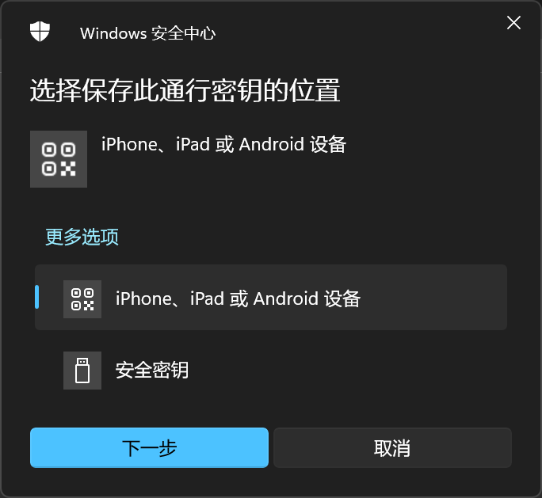
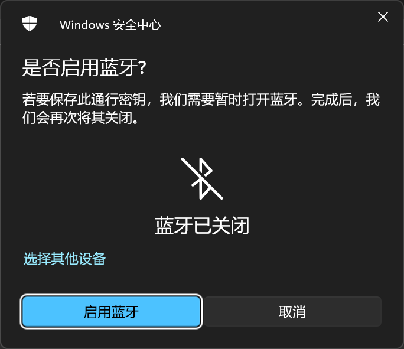
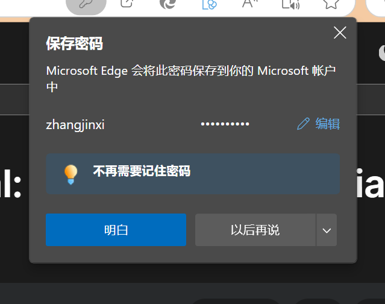
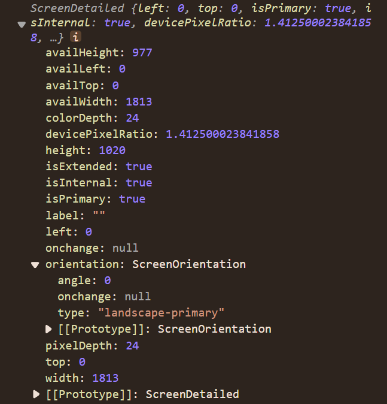

## View Transitions API

View Transitions API 提供了一种机制，可以在更新 DOM 内容的同时，轻松地创建不同 DOM 状态之间的动画过渡。旧页面视图的 opacity 从 1 过渡到 0，而新视图从 0 过渡到 1，这就是默认的交叉淡入淡出效果。同时还可以在单个步骤中更新 DOM 内容。

```js
function updateView(event) {
  // 处理在 <a> 或  上触发事件的差异
  const target = event.target;

  const displayNewImage = () => {
    const mainSrc = `${target.src.split("_th.jpg")[0]}.jpg`;
    galleryImg.src = mainSrc;
    galleryCaption.textContent = target.alt;
  };

  // 浏览器不支持 View Transitions 时的回退方案：
  if (!document.startViewTransition) {
    displayNewImage();
    return;
  }

  // 开始一次视图过渡：返回一个 ViewTransition 实例，该实例包含了多个 Promise, 允许你在到达视图过渡过程的不同阶段时运行代码。
  const transition = document.startViewTransition(() => displayNewImage());

  transition.updateCallbackDone().then(()=>{
    // 回调函数成功运行时，该promise兑现
  })

  transition.ready().then(()=>{
    // 当过渡动画即将运行时，该promise兑现
     // js自定义新视图的根元素动画
    document.documentElement.animate(
      {
        clipPath: [
          `circle(0 at ${x}px ${y}px)`,
          `circle(${endRadius}px at ${x}px ${y}px)`,
        ],
      },
      {
        duration: 500,
        easing: "ease-in",
        // 指定要附加动画的伪元素
        pseudoElement: "::view-transition-new(root)",
      },
    );
  })

  transition.finished().then(()=>{
    // 过渡动画结束时，该promise兑现
  })

  // 跳过视图过渡动画，仅更新 DOM
transition.skipTransition();
}

// 运动过程中，生成对应伪元素树
::view-transition
└─ ::view-transition-group(root)
   └─ ::view-transition-image-pair(root)
      ├─ ::view-transition-old(root)
      └─ ::view-transition-new(root)
```

为不同的元素使用不同的过渡效果：

> view-transition-name 的值可以是除 none 之外的任何值——none 值表示该元素不参与视图过渡。必须是唯一的。

```js
//自定义动画的元素添加CSS属性
figcaption {
  view-transition-name: figure-caption;
}

// 使用自定义动画
::view-transition-old(figure-caption) {
  animation: 0.25s linear both shrink-x;
}

::view-transition-new(figure-caption) {
  animation: 0.25s 0.25s linear both grow-x;
}

// 调整动画速度：
::view-transition-old(root),
::view-transition-new(root) {
  animation-duration: 0.5s;
}

//应用此 CSS 后，伪元素树现在如下所示：
::view-transition
├─ ::view-transition-group(root)
│ └─ ::view-transition-image-pair(root)
│     ├─ ::view-transition-old(root)
│     └─ ::view-transition-new(root)
└─ ::view-transition-group(figure-caption)
  └─ ::view-transition-image-pair(figure-caption)
      ├─ ::view-transition-old(figure-caption)
      └─ ::view-transition-new(figure-caption)
```

## Web Animations API

Web Animations API 允许同步和定时更改网页的呈现，即 DOM 元素的动画。它通过组合两个模型来实现：时序模型和动画模型。

css 动画：

```css
#alice {
  animation: aliceTumbling infinite 3s linear;
}

@keyframes aliceTumbling {
  0% {
    color: #000;
    transform: rotate(0) translate3D(-50%, -50%, 0);
  }
  30% {
    color: #431236;
  }
  100% {
    color: #000;
    transform: rotate(360deg) translate3D(-50%, -50%, 0);
  }
}
```

转为 js 动画：

> 与 CSS 不同，Web 动画 API 不需要明确地告知每个键出现的动画的百分比。它将根据你给出的按键数量自动将动画划分为相等的部分

```js
var Animation = new Animation(Keyframes, document.timeline);

let element = document.getElementById("alice");
let animation = element.animate(
  [
    { transform: "rotate(0) translate3D(-50%, -50%, 0)", color: "#000" },
    { color: "#431236", offset: 0.3 },
    { transform: "rotate(360deg) translate3D(-50%, -50%, 0)", color: "#000" },
  ],
  {
    duration: 3000,
    iterations: Infinity,
    // 自定义
  }
);

/**
 * @playbackRate 返回或设置动画的播放速率。
 * @effect 获取或设置与此动画相关联的KeyframeEffect
 *  getTiming()
 *  updateTiming()
 *  getComputedTiming()
 *    activeDuration
 *  timing 获取或设置与此动画相关联的timeline。
 *    duration
 * @currentTime 动画的当前时间值（以毫秒为单位），无论是正在运行还是已暂停
 * @id 获取或设置用于标识动画的字符串。
 * @playState 返回描述动画播放状态的枚举值。
 * @ready 返回此动画的当前就绪状态。
 * @finished 返回此动画的当前完成的状态。
 * @startTime 获取或设置动画播放应开始的预定时间
 */
animation.pause();
animation.play();
//反向播放动画。相当于设置动画播放速度（Animation.playbackRate）为负值，并播放。
animation.reverse();
animation.finish();
animation.cancel();

animation.onfinish = event => {
  // 监听动画完成
};
animation.oncancel = event => {
  // 监听动画取消
};

element.getAnimations();
```

## Web Audio API

Web Audio API 提供了在 Web 上控制音频的一个非常有效通用的系统，允许开发者来自选音频源，对音频添加特效，使音频可视化，添加空间效果（如平移），等等。

```js
参考：https://developer.mozilla.org/zh-CN/docs/Web/API/Web_Audio_API
```

## Web Authentication API

Web Authentication API 继承自 Credential Management API ，使用公钥密码学使得验证更强壮，不需要 SMS 文本就能实现无密码验证和安全的双因素验证。这里指定使用 PublicKeyCredential。

使用非对称加密替代密码或 SMS 短信在网站上注册、登录、second-factor authentication（双因素验证）。解决了 phishing（钓鱼）、data breaches（数据破坏）、SMS 文本攻击、其他双因素验证等重大安全问题，同时显著提高了易用性（因为用户不必管理许多越来越复杂的密码）。

Web Authentication API 有两个对应于注册和登录的基本方法：

- navigator.credentials.create() - 当使用 publicKey 选项时，创建一个新的凭据，无论是用于注册新账号还是将新的非对称密钥凭据与已有的账号关联。
- navigator.credentials.get() - 当使用 publicKey 选项时，使用一组现有的凭据进行身份验证服务，无论是用于用户登录还是双因素验证中的一步。

WebAuthn 注册流程:

- 应用程序请求注册 - 应用程序发出注册请求。

- 服务器发送挑战（至少 16 字节的随机 buffer）、用户信息和依赖方信息 - 从服务器接收到的参数将传递给 create()，返回兑现为包含 AuthenticatorAttestationResponse 的 PublicKeyCredential 的 Promise。

- 浏览器向认证器调用 authenticatorMakeCredential()

- 认证器创建新的密钥对和证明 - 在进行下一步之前，认证器通常会以某种形式要求用户确认，如输入 PIN，使用指纹，进行虹膜扫描等，以证明用户在场并同意注册

- 认证器将数据返回浏览器 - 新的公钥、全局唯一的凭证 ID 和其他的证明数据会被返回到浏览器，成为 attestationObject。

- 浏览器生成最终的数据并发送到服务器

- 服务器验证数据并完成注册

  - 验证接收到的挑战与发送的挑战相同
  - 确保 origin 与预期的一致
  - 使用对应认证器型号的证书链验证 clientDataHash 的签名和证明

  服务器将会把新的公钥与用户帐户相关联以供将来用户希望使用公钥进行身份验证时使用。

```js
// 用作create()的参数，向认证器注册凭据
var createCredentialDefaultArgs = {
  publicKey: {
    rp: { name: "Acme" },
    user: {
      id: new Uint8Array(16),
      name: "john.p.smith@example.com",
      displayName: "John P. Smith",
    },

    pubKeyCredParams: [{ type: "public-key", alg: -7 }],
    attestation: "direct",
    timeout: 60000,
    // 从服务端返回的challenge信息，至少16位的buffer
    challenge: new Uint8Array([
      0x8c, 0x0a, 0x26, 0xff, 0x22, 0x91, 0xc1, 0xe9, 0xb9, 0x4e, 0x2e, 0x17,
      0x1a, 0x98, 0x6a, 0x73, 0x71, 0x9d, 0x43, 0x48, 0xd5, 0xa7, 0x6a, 0x15,
      0x7e, 0x38, 0x94, 0x52, 0x77, 0x97, 0x0f, 0xef,
    ]).buffer,
  },
};

// 构建登录凭据，用于get()参数，进行身份验证服务
var getCredentialDefaultArgs = {
  publicKey: {
    timeout: 60000,
    // 把create()返回的PublicKeyCredential的id，添加进来
    // allowCredentials: [newCredential],
    challenge: new Uint8Array([
      0x79, 0x50, 0x68, 0x71, 0xda, 0xee, 0xee, 0xb9, 0x94, 0xc3, 0xc2, 0x15,
      0x67, 0x65, 0x26, 0x22, 0xe3, 0xf3, 0xab, 0x3b, 0x78, 0x2e, 0xd5, 0x6f,
      0x81, 0x26, 0xe2, 0xa6, 0x01, 0x7d, 0x74, 0x50,
    ]).buffer,
  },
};

// 注册凭据：认证器通常会以某种形式要求用户确认，如输入 PIN，使用指纹，进行虹膜扫描等，以证明用户在场并同意注册
navigator.credentials
  .create(createCredentialDefaultArgs)
  .then(PublicKeyCredential => {
    //此时应该把认证器返回的PublicKeyCredential发送到服务器，由服务器验证数据并完成注册

    // 保存认证器返回的凭据，用于下次登录使用该凭据登录
    var idList = [
      {
        id: PublicKeyCredential.rawId,
        transports: ["usb", "nfc", "ble"],
        type: "public-key",
      },
    ];
    getCredentialDefaultArgs.publicKey.allowCredentials = idList;
  })
  .then(assertion => {
    console.log("ASSERTION", assertion);
  })
  .catch(err => {
    console.log("ERROR", err);
  });

// 使用一组现有的凭据进行身份验证服务
return navigator.credentials.get(getCredentialDefaultArgs);
```

生成凭据之前，询问凭据保存的位置：

选择保存到移动设备上，需要打开蓝牙：

需要移动设备扫码保存：


## PasswordCredential

Credential Management API 的一种，用户浏览器保存用户和密码，免于下次输入操作。Credential 有以下几类：

- PublicKeyCredential 非对称密钥凭据，用于 web authentication 登录
- PasswordCredential 浏览器保存账号密码
- IdentityCredential 联合身份验证产生的用户身份凭证
- FederatedCredential 联合凭证
- OTPCredential 验证码凭据

```js
//FederatedCredential联合认证
const cred = new FederatedCredential({
  id: "2323",
  name: "jixii",
  provider: "https://account.google.com",
});

// Store it
navigator.credentials.store(cred).then(() => {
  // Do something else.
});

let obj = {
  id: "zhang",
  name: "zhangjinxi",
  password: "zhangjinxi",
  origin: "https://developer.mozilla.org/",
  iconURL:
    "https://www.baidu.com/link?url=V_IZ3q1Pnw9qtN2o_WWw5u5XOMLTyrAYrAx4t6pH46P-xCAgSULCbEM_EKNAbD7bTBepxOLr0HNK_4MX7cEDhLz1Ftl2LhxD_PDgzxJHiYoQW7m19zFy-4ohY_UTfgldTiBpZjwcsPyPusfNRFJWR-LtthKCWFNPNQhipZCPX67mYsHJCuDuxVgjUwemaj8sTcbINa4eObyTRcx6r7nTy2QTbLpuB3iTV_e5qsmC-tjOGGIo0YegBFPVkhaRlTwgMdtsS4ESsNFTn-_O4q2xuRoeBSc8FOD0KMuPpHb2z8w5ttdUIde6V-zJcXFQipLG-QS7wifTZcqmLaN7MDXmi7r1vQQOKT_ak0QvIKNRtGyVrS_nEOjxizcmq3sNCWeWLzwT6QGSGQLy4-68hFMrA5I2QBMy_Oa2r9r82qikov6qLn3-hKYr_WttM-Zur6h9SCeTZsclzg8-bvyDTxRDykosfp3hCQmz0rJDEK2bHiK4Z6NR2OTZuKnV8h_HfmThU4RFsf9VGyg9eBxFwwW0VAg1Rq0qhvfNhTmAa3WXXr0G3kyYDRz_Ji5LpIJncbeT61tIgX76GwPS74uhHmO9LZGbJj7-mXlbJvOm3DnnK78a_n62pI_sOUUIvQ9fYE-uIlWkxG5lkcB8rrDC42S2C_&wd=&eqid=c54dbb4b000abb4a00000005672daad2",
};
const creds = new PasswordCredential(obj);
// Store the credentials.
navigator.credentials.store(creds).then(creds => {
  // Do something with the credentials if you need to.
  console.log(111, creds);
});
```



## WebOTP

WebOTP API 为 Web 应用程序提供了简化的用户体验，以便在将电话号码用作登录因素时验证该电话号码是否属于用户。WebOTP 是凭据管理 API 的扩展。

验证通过两个步骤完成：

- 应用程序客户端请求一次性密码 （OTP），该密码是从应用程序服务器发送的特殊格式的 SMS 消息中获取的。
- JavaScript 用于将 OTP 输入到应用程序客户端的验证表单中，并将其提交回服务器以验证它是否与 SMS 中最初发送的内容匹配。

WebOTP API 是如何工作的？

- 在需要验证电话号码时，应用程序客户端将要求用户在表单中输入他们的电话号码，然后将其提交给应用程序服务器。
- 然后，应用程序客户端使用指定类型的选项调用 navigator.credentials.get（）。这会触发来自底层系统的 OTP 请求，其来源将从应用程序服务器接收的特殊格式的 SMS 消息（包含 OTP 和应用程序的域）。该调用是基于 Promise 的，并等待收到 SMS 消息。otptransport"sms"get()
- App 服务器将短信发送到指定的电话号码。这必须在步骤 2 发生后立即完成。
- 当设备上收到短信时，如果它包含应用程序的域，浏览器将询问用户是否同意检索/使用 OTP。例如，Chrome 会显示一个对话框，询问他们是否允许从 SMS 中检索 OTP;其他浏览器可能会以不同的方式处理它。如果他们同意，则调用将使用包含 OTP 的 OTPCredential 对象完成。get()
- 然后，您可以按照任何您想要的方式使用 OTP。典型的用法是将其设置为应用程序客户端上验证表单的值，然后提交表单，从而使该过程尽可能无缝。
- 然后，应用服务器将验证发回给它的 OTP 是否与最初在 SMS 中发送的 OTP 匹配，如果匹配，则完成该过程（例如，让用户登录）。

```js
//典型的 SMS 消息如下所示：
Your verification code is 123456.

@www.example.com #123456

//在此示例中，当 SMS 消息到达并且用户授予权限时，将返回一个 OTPCredential 对象以及 OTP。然后，此密码将预先填充到验证表单字段中，并提交表单。
<input type="text" autocomplete="one-time-code" inputmode="numeric" />

// 特性检测
if ("OTPCredential" in window) {
  window.addEventListener("DOMContentLoaded", (e) => {
    const input = document.querySelector('input[autocomplete="one-time-code"]');
    if (!input) return;
    // 控制器用于手动提交表单时，终止OTP请求。也可以超时终止
    const ac = new AbortController();
    const form = input.closest("form");
    if (form) {
      form.addEventListener("submit", (e) => {
        ac.abort();
      });
    }
    // 通过get方法请求OTP
    navigator.credentials
      .get({
        otp: { transport: ["sms"] },
        signal: ac.signal,
      })
      .then((otp) => {
        // 获取到otp后，放进input输入框内，然后自动提交表单
        input.value = otp.code;
        if (form) form.submit();
      })
      .catch((err) => {
        console.error(err);
      });
  });
}
```

## Web Locks API

Web Locks API 允许在一个标签页或 worker 中运行的脚本异步获取锁，在执行工作时保持锁，最后释放锁。持有锁时，在同一源中执行的其他脚本都无法获取相同的锁，这允许在多个标签页或 worker 中运行的 Web 应用程序协调工作和资源的使用。

```js
let abort = new AbortController();
// 请求锁
navigator.locks.request(
  "my_resource",
  {
    mode: "exclusive", // 独占模式
    ifAvailable: null, //指定后如果不等待就无法立即授予锁定
    steal: "name", //如果指定，则将释放任何持有的同名锁，并且请求将被授予，抢占任何排队的请求。
    signal: abort.signal, //可以传入一个 AbortSignal，允许中止锁定请求。这可用于实现请求超时
  },
  async lock => {
    // 锁已被获取。
    await do_something(lock.name);
    await do_something_else(lock.mode);
    // 现在锁将被释放。
  }
);
```

## Notifications API

Notifications API 允许网页控制向最终用户显示系统通知——这些都在顶层浏览上下文窗口之外，因此即使用户已经切换标签页或移动到不同的应用程序也可以显示。该 API 被设计成与不同平台上的现有通知系统兼容。

- `Notification.permission`表示当前显示通知的权限
  - `denied`
  - `granted`
  - `default` 用户选择是未知的，因此浏览器的行为类似于值是 denied
- `Notification.maxActions` 设备和用户代理支持的最大的操作数量。
- `actions` options 参数中指定的通知的操作的数组
- `badge` 返回一个包含图像 URL 的字符串，在没有足够的空间来显示通知本身（例如 Android 通知栏）时表示通知。在 Android 设备上，徽章应适应高达 4 倍分辨率（约 96 x 96 像素）的设备，并且图像将自动屏蔽。
- `body`
- `data` 通知数据的结构化克隆。
- `dir`
- `lang`
- `icon`
- `image`
- `renotify` 新通知取代旧通知后，是否应该通知用户
- `requireInteraction` 通知应该保持活动状态，直到用户点击或者关掉它，而不是自动关闭
- `silent` 是否应该静音
- `tag` options 参数中指定的通知的 ID
- `timestamp` 指定通知创建或者应用时（过去、现在或者未来）的时间。
- `title`
- `vibrate` 为拥有振动硬件的终端设备指定振动模式。
- `close()`
- `click事件`
- `close事件`
- `show事件`
- `error事件`

```js
let notificatonOptions = {
  actions: [],
  badge: "/image/tuzi.png",
  body: "一个表示通知正文的字符串，显示在标题下方，默认值是一个空字符串。",
  data: {
    description:
      "任意你想要与通知关联的数据。它可以是任何可结构化克隆的数据类型。默认值为 null。",
  },
  dir: "auto",
  icon: "/image/xiong.jpg",
  image: "/image/mogu.jpg",
  renotify: true,
  requireInteraction: true,
  silent: false,
  tag: "这是一个tag",
  vibrate: [200, 300, 400, 300, 200],
};
function notifyMe() {
  // 检查浏览器是否支持通知
  if (!("Notification" in window)) {
    alert("当前浏览器不支持桌面通知");
  } else if (Notification.permission === "granted") {
    // 检查是否已授予通知权限；如果是的话，创建一个通知
    const notification = new Notification("你好！");
    // …
  } else if (Notification.permission !== "denied") {
    // 我们需要征求用户的许可
    Notification.requestPermission().then(permission => {
      // 如果用户接受，我们就创建一个通知
      if (permission === "granted") {
        const notification = new Notification("你好！", notificatonOptions);

        notification.onclose = function (event) {
          console.log(
            "notification已经关闭了",
            event.notification,
            event.action
          );
        };
      }
    });
  }
}
notifyMe();

// serviceWorker中使用notification
self.addEventListener("notificationclick", event => {
  console.log(`通知被点击：${event.notification.tag}`);
  event.notification.close();

  // 这会检查当前标签页是否已打开并聚焦
  event.waitUntil(
    clients
      .matchAll({
        type: "window",
      })
      .then(clientList => {
        for (const client of clientList) {
          if (client.url === "/" && "focus" in client) return client.focus();
        }
        if (clients.openWindow) return clients.openWindow("/");
      })
  );
});
```

## WebCodecs API

WebCodecs API 为 web 开发者提供了对视频流的单个帧和音频数据块的底层访问能力。这对于那些需要完全控制媒体处理方式的 web 应用程序非常有用。例如，视频或音频编辑器，以及视频会议。

WebCodecs API 提供了对浏览器中已存在的编解码器的访问能力。它可以访问原始视频帧、音频数据块、图像解码器、音频和视频的编码器及解码器

在下面这个例子中，获取从 MediaStreamTrackProcessor 中返回的帧，然后对他们进行编码。在文章使用 WebCodec 处理视频查看完整示例并了解更多细节。

```js
let frame_counter = 0;
const track = stream.getVideoTracks()[0];
const media_processor = new MediaStreamTrackProcessor(track);
const reader = media_processor.readable.getReader();
while (true) {
  const result = await reader.read();
  if (result.done) break;
  let frame = result.value;
  if (encoder.encodeQueueSize > 2) {
    // Too many frames in flight, encoder is overwhelmed
    // let's drop this frame.
    frame.close();
  } else {
    frame_counter++;
    const insert_keyframe = frame_counter % 150 === 0;
    encoder.encode(frame, { keyFrame: insert_keyframe });
    frame.close();
  }
}
```

## WebGL

WebGL（Web 图形库）是一种可在任何兼容的 Web 浏览器中无需使用插件即可渲染高性能交互式 3D 和 2D 图形的 JavaScript API。WebGL 通过引入一个与 OpenGL ES 2.0 高度一致的 API 来做到这一点，该 API 可以在 HTML `<canvas> `元素中使用。这种一致性使 API 可以利用用户设备提供的硬件图形加速。WebGL 2 API 引入了对 OpenGL ES 3.0 特性集的广泛支持；它通过 WebGL2RenderingContext 接口提供。
three.js 是一个开源、功能齐全的 3D WebGL 库。

```js
<body onload="main()">
  <canvas id="glcanvas" width="640" height="480">
    你的浏览器似乎不支持或者禁用了 HTML5 <code>&lt;canvas&gt;</code> 元素。
  </canvas>
</body>;

// 从这里开始
function main() {
  const canvas = document.querySelector("#glcanvas");
  // 初始化 WebGL 上下文
  const gl = canvas.getContext("webgl");

  // 确认 WebGL 支持性
  if (!gl) {
    alert("无法初始化 WebGL，你的浏览器、操作系统或硬件等可能不支持 WebGL。");
    return;
  }

  // 使用完全不透明的黑色清除所有图像
  gl.clearColor(0.0, 0.0, 0.0, 1.0);
  // 用上面指定的颜色清除缓冲区
  gl.clear(gl.COLOR_BUFFER_BIT);
}
```

## 窗口管理 API

窗口管理 API 允许您获取有关连接到设备的显示器的详细信息，并更轻松地将窗口放置在特定屏幕上，从而为更有效的多屏幕应用程序铺平道路。

它允许您查询您的显示是否扩展了多个屏幕，并分别获取每个屏幕上的信息：然后可以根据需要将窗口放置在每个屏幕上。它还提供事件处理程序，允许您响应可用屏幕中的更改，提供新的全屏功能，以选择要将哪个屏幕置于全屏模式（如果有），以及用于控制对 API 的访问的权限功能。

- Window.getScreenDetails（） 方法的用法。如果被阻止，它的 Promise 将拒绝并出现异常。NotAllowedError
- 查询 Window.screen.isExtended 属性。如果被阻止，它将始终返回 。false
  ScreenDetails 对象属性和方法:
- `screens` 一个 ScreenDetailed 对象的数组，每个对象都包含有关系统可用的单独屏幕的详细信息
- `currentScreen` 单个 ScreenDetailed 对象，包含有关当前浏览器窗口显示的屏幕的详细信息

```js
// 特性检测
if ("getScreenDetails" in window) {
  window.getScreenDetails().then(screenDetails => {
    // screenDetails.addEventListener("screenschange", () => {
      for (const screen of screenDetails.screens) {
        console.log(11,screen)
        // 每个窗口占据屏幕全部可用空间
        const windowFeatures = `left=${screen.availLeft},top=${screen.availTop},width=${screen.availWidth},height=${screen.availHeight}`;
        // 每个屏幕打开一个百度窗口
        window.open(
          "//www.baidu.com",
          "_blank", // needed for it to open in a new window
          windowFeatures
        );
      }
    // });
  });
}
```
ScreenDetailed对象属性和方法：

