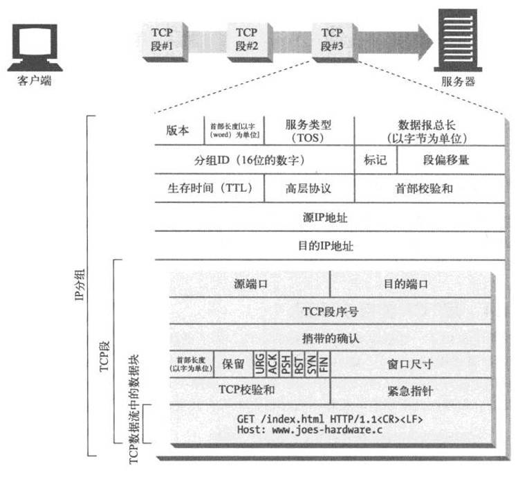

## 建立连接


HTTP 要传送一条报文时，会以流的形式将报文数据的内容通过一条打开的 TCP 连接按序传输。TCP 收到数据流之后，会将数据流分成小数据块，通过因特网进行传输

在任意时刻计算机都可以有几条 TCP 连接处于打开状态。TCP 是通过端口号来保持所有这些连接的正确运行


## HTTP 短连接

HTTP 最早期的模型和 HTTP/1.0 的默认模型，是短连接。每一个 HTTP 请求都由它自己独立的连接完成；这意味着发起每一个 HTTP 请求之前都会有一次 TCP 握手，而且是连续不断的。

TCP 协议握手本身就是耗费时间的，所以 TCP 可以保持更多的热连接来适应负载。短连接破坏了 TCP 具备的能力，并且新的冷连接降低了其性能。

这是 HTTP/1.0 的默认模型（如果没有指定 Connection 协议头，或者是值被设置为 close）。而在 HTTP/1.1 中，只有当 Connection 被设置为 close 时才会用到这个模型。

## HTTP 长连接

短连接有两个比较大的问题：创建新连接耗费的时间尤为明显，另外 TCP 连接的性能只有在该连接被使用一段时间后（热连接）才能得到改善。为了缓解这些问题，长连接的概念便被设计出来了，甚至在 HTTP/1.1 之前。或者，这被称之为一个 keep-alive 连接。

一个长连接会保持一段时间，重复用于发送一系列请求，节省了新建 TCP 连接握手的时间，还可以利用 TCP 的性能增强能力。当然这个连接也不会一直保留着：连接在空闲一段时间后会被关闭（服务器可以使用 Keep-Alive 协议头来指定一个最小的连接保持时间）。

长连接也还是有缺点的；就算是在空闲状态，它还是会消耗服务器资源，而且在重负载时，还有可能遭受 DoS 攻击。这种场景下，可以使用非长连接，即尽快关闭那些空闲的连接，也能对性能有所提升。

HTTP/1.0 里默认并不使用长连接。把 Connection 设置成 close 以外的其他参数都可以让其保持长连接，通常会设置为 retry-after。

在 HTTP/1.1 里，默认就是长连接的，不再需要标头


## HTTP 流水线

默认情况下，HTTP 请求是按顺序发出的。下一个请求只有在当前请求收到响应过后才会被发出。由于会受到网络延迟和带宽的限制，在下一个请求被发送到服务器之前，可能需要等待很长时间。

流水线是在同一条长连接上发出连续的请求，而不用等待应答返回。这样可以避免连接延迟。理论上讲，性能还会因为两个 HTTP 请求有可能被打包到一个 TCP 消息包中而得到提升。就算 HTTP 请求不断的继续，尺寸会增加，但设置 TCP 的最大分段大小（MSS）选项，仍然足够包含一系列简单的请求。

并不是所有类型的 HTTP 请求都能用到流水线：只有幂等方式，比如 GET、HEAD、PUT 和 DELETE 能够被安全地重试。如果有故障发生时，流水线的内容要能被轻易的重试。

他们的区别：


## HTTP/1.1 协议升级机制

客户端使用 Upgrade 标头字段请求服务器，以降序优先的顺序切换到其中列出的一个协议。

因为 Upgrade 是一个逐跳（Hop-by-hop）标头，它还需要在 Connection 标头字段中列出。这意味着包含 Upgrade 的典型请求类似于：

```http
GET /index.html HTTP/1.1
Host: www.example.com
Connection: upgrade
Upgrade: example/1, foo/2
```

根据之前的请求的协议，可能需要其他标头信息，例如：从 HTTP/1.1 升级到 WebSocket 允许配置有关 WebSocket 连接的标头详细信息，以及在连接时提供一定程度的安全性

如果服务器决定升级这次连接，就会返回一个 101 Switching Protocols 响应状态码，和一个要切换到的协议的标头字段 Upgrade。如果服务器没有（或者不能）升级这次连接，它会忽略客户端发送的 Upgrade 标头字段，返回一个常规的响应：例如一个 200 OK

在发送 101 状态码之后，服务器可以使用新协议，并根据需要执行任何额外的特定于协议的握手。实际上，一旦这次升级完成了，连接就变成了双向管道。并且可以通过新协议完成启动升级的请求。

## HTTP/1.1——标准化的协议

HTTP/1.1 消除了大量歧义内容并引入了多项改进：

- 连接可以复用，节省了多次打开 TCP 连接加载网页文档资源的时间。
- 增加管线化技术，允许在第一个应答被完全发送之前就发送第二个请求，以降低通信延迟。
- 支持响应分块。
- 引入额外的缓存控制机制。
- 引入内容协商机制，包括语言、编码、类型等。并允许客户端和服务器之间约定以最合适的内容进行交换。
- 凭借 Host 标头，能够使不同域名配置在同一个 IP 地址的服务器上。

```http
GET /zh-CN/docs/Glossary/CORS-safelisted_request_header HTTP/1.1
Host: developer.mozilla.org
User-Agent: Mozilla/5.0 (Macintosh; Intel Mac OS X 10.9; rv:50.0) Gecko/20100101 Firefox/50.0
Accept: text/html,application/xhtml+xml,application/xml;q=0.9,*/*;q=0.8
Accept-Language: zh-CN,zh;q=0.9
Accept-Encoding: gzip, deflate, br
Referer: https://developer.mozilla.org/zh-CN/docs/Glossary/CORS-safelisted_request_header

200 OK
Connection: Keep-Alive
Content-Encoding: gzip
Content-Type: text/html; charset=utf-8
Date: Wed, 20 Jul 2016 10:55:30 GMT
Etag: "547fa7e369ef56031dd3bff2ace9fc0832eb251a"
Keep-Alive: timeout=5, max=1000
Last-Modified: Tue, 19 Jul 2016 00:59:33 GMT
Server: Apache
Transfer-Encoding: chunked
Vary: Cookie, Accept-Encoding

(content)


GET /static/img/header-background.png HTTP/1.1
Host: developer.mozilla.org
User-Agent: Mozilla/5.0 (Macintosh; Intel Mac OS X 10.9; rv:50.0) Gecko/20100101 Firefox/50.0
Accept: */*
Accept-Language: zh-CN,zh;q=0.5
Accept-Encoding: gzip, deflate, br
Referer: https://developer.mozilla.org/zh-CN/docs/Glossary/CORS-safelisted_request_header

200 OK
Age: 9578461
Cache-Control: public, max-age=315360000
Connection: keep-alive
Content-Length: 3077
Content-Type: image/png
Date: Thu, 31 Mar 2016 13:34:46 GMT
Last-Modified: Wed, 21 Oct 2015 18:27:50 GMT
Server: Apache

(image content of 3077 bytes)
```

## HTTP/2——为了更优异的表现

这些年来，网页愈渐变得的复杂，甚至演变成了独有的应用，可见媒体的播放量，增进交互的脚本大小也增加了许多：更多的数据通过 HTTP 请求被传输。HTTP/1.1 链接需要请求以正确的顺序发送，理论上可以用一些并行的链接（尤其是 5 到 8 个），带来的成本和复杂性堪忧。比如，HTTP 管线化（pipelining）就成为了 Web 开发的负担。为此，在 2010 年早期，谷歌通过实践了一个实验性的 SPDY 协议。这种在客户端和服务器端交换数据的替代方案引起了在浏览器和服务器上工作的开发人员的兴趣。明确了响应数量的增加和解决复杂的数据传输，SPDY 成为了 HTTP/2 协议的基础。

HTTP/2 在 HTTP/1.1 有几处基本的不同：

- HTTP/2 是二进制协议而不是文本协议。不再可读，也不可无障碍的手动创建，改善的优化技术现在可被实施。
- 这是一个多路复用协议。并行的请求能在同一个链接中处理，移除了 HTTP/1.x 中顺序和阻塞的约束。
- 压缩了标头。因为标头在一系列请求中常常是相似的，其移除了重复和传输重复数据的成本。
- 其允许服务器在客户端缓存中填充数据，通过一个叫服务器推送的机制来提前请求。

## HTTP/3——基于 QUIC 的 HTTP

HTTP/3 有着与 HTTP 早期版本的相同语义，但在传输层部分使用 QUIC 而不是 TCP

QUIC 旨在为 HTTP 连接设计更低的延迟。类似于 HTTP/2，它是一个多路复用协议，但是 HTTP/2 通过单个 TCP 连接运行，所以在 TCP 层处理的数据包丢失检测和重传可以阻止所有流。QUIC 通过 UDP 运行多个流，并为每个流独立实现数据包丢失检测和重传，因此如果发生错误，只有该数据包中包含数据的流才会被阻止。

## HTTP 认证


