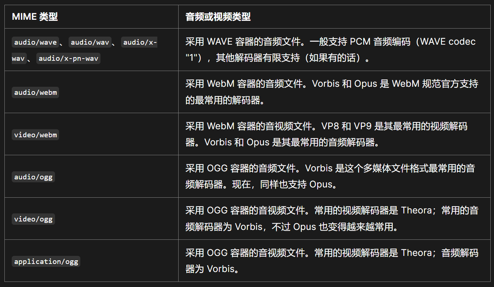

## MIME 类型

媒体类型（也通常称为多用途互联网邮件扩展或 MIME 类型）是一种标准，用来表示文档、文件或一组数据的性质和格式。

::: tip
浏览器通常使用 MIME 类型而不是文件扩展名来决定如何处理 URL，因此 Web 服务器在 Content-Type 响应标头中添加正确的 MIME 类型非常重要。如果配置不正确，浏览器可能会曲解文件内容，网站将无法正常工作，并且下载的文件也可能被错误处理。  
:::

## MIME 类型的结构

- 类型代表数据类型所属的大致分类，例如 video 或 text。
- 子类型标识了 MIME 类型所代表的指定类型的确切数据类型。以 text 类型为例，它的子类型包括：plain（纯文本）、html（HTML 源代码）、calender（iCalendar/.ics 文件）。
- 可选的参数，能够提供额外的信息：

```http
type/subtype;parameter=value
```

例如，对于主类型为 text 的任何 MIME 类型，可以添加可选的 charset 参数，以指定数据中的字符所使用的字符集。如果没有指定 charset，默认值为 ASCII（US-ASCII），除非被用户代理的设置覆盖。要指定 UTF-8 文本文件，则使用 MIME 类型 text/plain;charset=UTF-8。  
MIME 类型对大小写不敏感，但是传统写法都是小写。参数值可以是大小写敏感的。

## 主类型分类

- **独立类型**：代表单一文件或媒介，比如一段文字、一个音乐文件、一个视频文件等。
  - `application`不明确属于其他类型之一的任何二进制数据；要么是将以某种方式执行或解释的数据，要么是需要借助某个或某类特定应用程序来使用的二进制数据。通用二进制数据（或真实类型未知的二进制数据）是 application/octet-stream。其他常用的示例包含 application/pdf、application/pkcs8 和 application/zip。`没有明确子类型或子类型未知的二进制文件，应使用 application/octet-stream。`
  - `text`纯文本数据，包括任何人类可读内容、源代码或文本数据——如逗号分隔值（comma-separated value，即 CSV）格式的数据。示例包含：text/plain、text/csv 和 text/html。`对于那些没有明确子类型的文本文档，应使用 text/plain`。
  - `font`字体/字型数据。常见的示例如 font/woff、font/ttf 和 font/otf
  - `image`图像或图形数据，包括位图和矢量静态图像，以及静态图像格式的动画版本，如 GIF 动画或 APNG。常见的例子有 image/jpeg、image/png 和 image/svg+xml。
  - `model`三维物体或场景的模型数据。示例包含 model/3mf 和 model/vrml
  - `audio`音频或音乐数据。常见的示例如 audio/mpeg、audio/vorbis
  - `video`视频数据或文件，例如 MP4 电影（video/mp4）
- **多部分类型**：代表由多个部件组合成的文档，其中每个部分都可能有各自的 MIME 类型；此外，也可以代表多个文件被封装在单次事务中一同发送。多部分 MIME 类型的一个例子是，在电子邮件中附加多个文件。
  > HTTP 不会特殊处理多部分文档：信息会被传输到浏览器（如果浏览器不知道如何显示文档，很可能会显示一个“另存为”窗口）。除了几个例外，在 HTML 表单的 POST 方法中使用的 multipart/form-data，以及用来发送部分文档，与 206 Partial Content 一同使用的 multipart/byteranges。
  - `message`封装其他信息的信息。例如，这可以用来表示将转发信息作为其数据一部分的电子邮件，或将超大信息分块发送，就像发送多条信息一样。例如，message/rfc822（用于转发或回复信息的引用）和 message/partial（允许将大段信息自动拆分成小段，由收件人重新组装）
  - `multipart`由多个组件组成的数据，这些组件可能各自具有不同的 MIME 类型。例如，multipart/form-data（用于使用 FormData API 生成的数据）和 multipart/byteranges（当获取到的数据仅为部分内容时——如使用 Range 标头传输的内容——与返回的 HTTP 响应 206 “Partial Content”组合使用）

## Web 相关 MIME 类型

1. `application/octet-stream`  
   这是二进制文件的默认值。由于这意味着未知的二进制文件，浏览器一般不会自动执行或询问执行。浏览器将这些文件视为 Content-Disposition 标头被设置为 attachment 一样，并弹出“另存为”对话框。
2. `text/plain`  
   这是文本文件的默认值。即使它其实意味着未知的文本文件，但浏览器认为是可以直接展示的。
3. `text/css`  
   在网页中要被解析为 CSS 的任何 CSS 文件必须指定 MIME 为 text/css。通常，如果服务器不识别 CSS 文件的 .css 后缀，则可能将它们以 MIME 为 text/plain 或 application/octet-stream 来发送给浏览器：在这种情况下，大多数浏览器不将其识别为 CSS 文件而直接忽略。
4. `text/html`  
   所有的 HTML 内容都应该使用这种类型。XHTML 的其他 MIME 类型（如 application/xml+html）现在基本不再使用。
5. `text/javascript`  
   JavaScript 内容应始终使用 MIME 类型 text/javascript 提供。其他 MIME 类型对 JavaScript 无效，使用除 text/javascript 以外的任何 MIME 类型都可能导致脚本无法加载或运行。
6. `multipart/form-data`  
   用于 HTML 表单从浏览器发送信息给服务器。作为多部分文档格式，它由边界线（一个由双横滑线 -- 开始的字符串）划分出的不同部分组成。每一部分有自己的实体，以及自己的 HTTP 请求头，Content-Disposition 和 Content-Type 用于文件上传字段。

```http
Content-Type: multipart/form-data; boundary=aBoundaryString
(other headers associated with the multipart document as a whole)

--aBoundaryString
Content-Disposition: form-data; name="myFile"; filename="img.jpg"
Content-Type: image/jpeg

(data)
--aBoundaryString
Content-Disposition: form-data; name="myField"

(data)
--aBoundaryString
(more subparts)
--aBoundaryString--
```

7. `multipart/byteranges`  
   用于把部分的响应报文发送回浏览器。当状态码 206 Partial Content 被发出后，这个 MIME 类型用于指出这个文件由若干部分组成，每一个都有其请求范围。就像其他多部分类型一样，Content-Type 使用 boundary 来制定分界线。每一个不同的部分都有 Content-Type 这样的 HTTP 标头来说明文件的实际类型，以及 Content-Range 来说明其范围。

```http
HTTP/1.1 206 Partial Content
Accept-Ranges: bytes
Content-Type: multipart/byteranges; boundary=3d6b6a416f9b5
Content-Length: 385

--3d6b6a416f9b5
Content-Type: text/html
Content-Range: bytes 100-200/1270

eta http-equiv="Content-type" content="text/html; charset=utf-8" />
    <meta name="viewport" content
--3d6b6a416f9b5
Content-Type: text/html
Content-Range: bytes 300-400/1270

-color: #f0f0f2;
        margin: 0;
        padding: 0;
        font-family: "Open Sans", "Helvetica
--3d6b6a416f9b5--
```

8. `图片类型`  
   MIME 类型为 image 的文件包含图像数据。子类型指定数据所代表的具体图像文件格式。以下是常用的图像类型，可在网页中安全使用：

   - image/apng：动画便携式网络图形（APNG）
   - image/avif：AV1 图像文件格式（AVIF）
   - image/gif：图形交换格式（GIF）
   - image/jpeg：联合图像专家小组图片（JPEG）
   - image/png：便携式网络图形（PNG）
   - image/svg+xml：可缩放矢量图形（SVG）
   - image/webp：Web 图像格式（WEBP）

9. `音视频类型`  
   音频和视频文件的 MIME 类型，通常指的是其容器格式（或者说文件类型）。添加可选的 codec 参数到 MIME 类型中，能进一步指出要使用的编解码器和编码媒体时曾用到的选项，如编解码器配置文件、级别或其他此类信息。
   

## MIME 嗅探

在缺失 MIME 类型或客户端认为文件设置了错误的 MIME 类型时，浏览器可能会通过查看资源来进行 MIME 嗅探。服务器可以通过发送 X-Content-Type-Options 标头来阻止 MIME 嗅探。嗅探类型：

- **使用文件扩展名**。特别是在 Microsoft Windows 系统上。并非所有的操作系统都认为这些后缀是有意义的（特别是 Linux 和 Mac OS），并且像外部 MIME 类型一样，不能保证它们是正确的。
- **魔数（magic number）**。不同类型的文件的语法通过查看结构来允许文件类型推断。例如，每个 GIF 文件以 47 49 46 38 39 十六进制值（GIF89）开头，每个 PNG 文件以 89 50 4E 47（.PNG）开头。并非所有类型的文件都有魔数，所以这也不是 100％ 可靠的方式。
