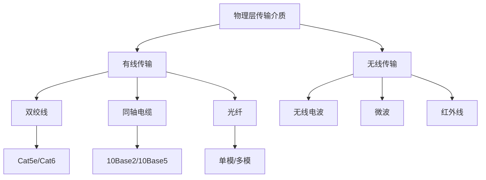
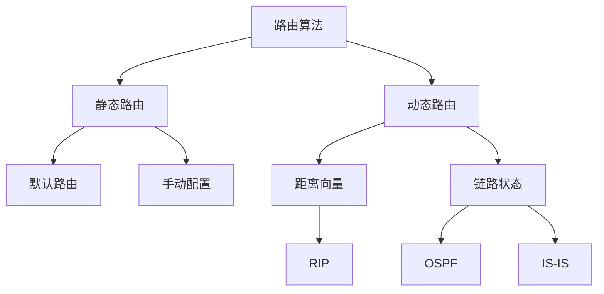
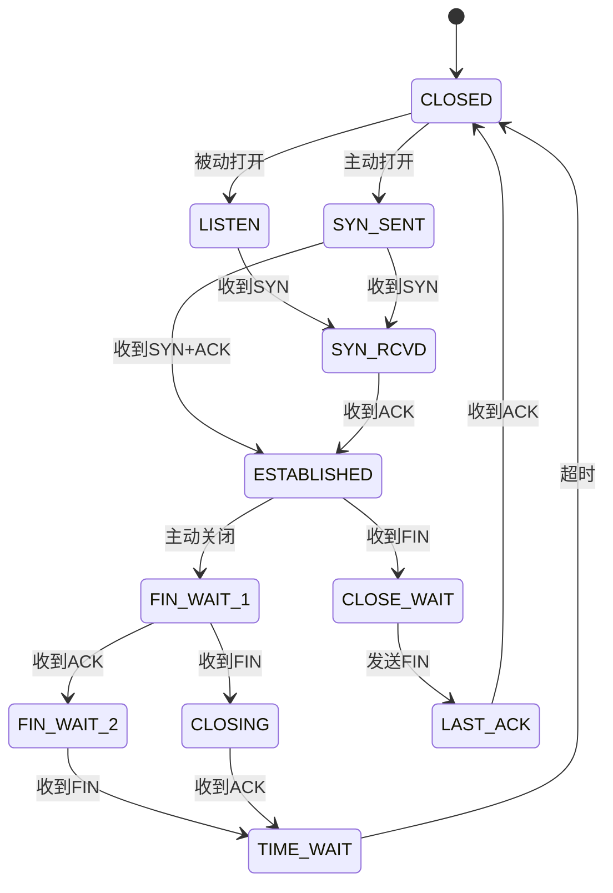
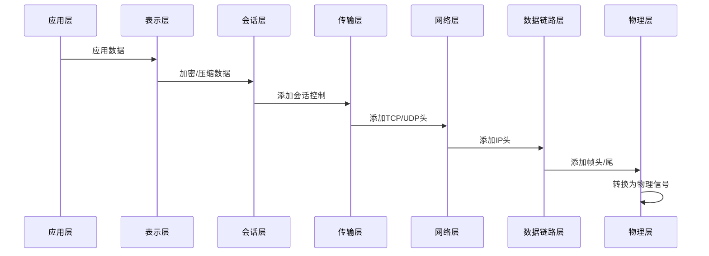
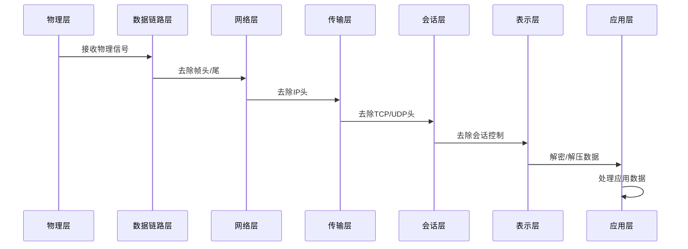

# 🌐 OSI 网络七层模型

> OSI（Open Systems Interconnection）开放式系统互联参考模型是计算机网络通信的基础理论框架。它将复杂的网络通信过程分解为七个独立的层次，每层负责特定的功能，为理解和设计网络协议提供了标准化的参考。

## 🏗️ OSI 模型概述

### 📊 七层架构

<div align="center">
  
</div>

### 🔄 分层处理原理

| 层次 | 名称 | 功能 | 关键协议 | 数据单位 |
|------|------|------|----------|----------|
| **第7层** | 应用层 | 🌐 网络服务与用户界面 | HTTP, HTTPS, FTP, SMTP | 数据 |
| **第6层** | 表示层 | 🔄 数据格式转换与加密 | SSL/TLS, JPEG, MPEG | 数据 |
| **第5层** | 会话层 | 🔗 会话管理与控制 | NetBIOS, RPC, SQL | 数据 |
| **第4层** | 传输层 | 🚚 端到端数据传输 | TCP, UDP | 段(Segment) |
| **第3层** | 网络层 | 🗺️ 路由选择与寻址 | IP, ICMP, ARP | 包(Packet) |
| **第2层** | 数据链路层 | 🔗 帧同步与错误检测 | Ethernet, PPP, Wi-Fi | 帧(Frame) |
| **第1层** | 物理层 | ⚡ 物理信号传输 | 电缆, 光纤, 无线 | 比特(Bit) |

## 🎯 各层详细功能

### 1️⃣ 物理层 (Physical Layer)

#### 🔧 核心功能
- **信号转换**：将数字信号转换为物理信号
- **传输媒介**：定义传输介质的特性
- **接口规范**：规定物理接口的标准

#### 📡 传输介质



#### 🔌 常用接口标准

| 接口类型 | 描述 | 传输速率 | 应用场景 |
|----------|------|----------|----------|
| **RJ45** | 以太网接口 | 10M-10G | 局域网连接 |
| **光纤接口** | 光信号传输 | 1G-100G | 长距离高速传输 |
| **USB** | 通用串行总线 | 480M-10G | 设备连接 |
| **Wi-Fi** | 无线局域网 | 54M-1.2G | 无线连接 |

### 2️⃣ 数据链路层 (Data Link Layer)

#### 🔗 主要职责
- **帧封装**：将网络层数据封装成帧
- **错误检测**：通过校验和检测传输错误
- **流量控制**：控制数据传输速率
- **媒体访问控制**：管理共享介质的访问

#### 🎯 关键协议

```typescript
// 以太网帧结构
interface EthernetFrame {
  preamble: string;        // 前导码 (7字节)
  startFrameDelimiter: string; // 帧开始符 (1字节)
  destinationMAC: string;  // 目标MAC地址 (6字节)
  sourceMAC: string;       // 源MAC地址 (6字节)
  etherType: number;       // 协议类型 (2字节)
  payload: Buffer;         // 数据载荷 (46-1500字节)
  frameCheckSequence: number; // 帧校验序列 (4字节)
}
```

### 3️⃣ 网络层 (Network Layer)

#### 🗺️ 核心功能
- **路由选择**：确定数据包传输路径
- **逻辑寻址**：使用IP地址标识设备
- **数据包转发**：在网络间转发数据包
- **拥塞控制**：处理网络拥塞问题

#### 📋 IP地址分类

| 类别 | 地址范围 | 子网掩码 | 主机数量 | 用途 |
|------|----------|----------|----------|------|
| **A类** | 1.0.0.0 - 126.255.255.255 | 255.0.0.0 | 16,777,214 | 大型网络 |
| **B类** | 128.0.0.0 - 191.255.255.255 | 255.255.0.0 | 65,534 | 中型网络 |
| **C类** | 192.0.0.0 - 223.255.255.255 | 255.255.255.0 | 254 | 小型网络 |
| **D类** | 224.0.0.0 - 239.255.255.255 | - | - | 组播地址 |
| **E类** | 240.0.0.0 - 255.255.255.255 | - | - | 实验用途 |

#### 🛣️ 路由算法



### 4️⃣ 传输层 (Transport Layer)

#### 🚚 主要功能
- **端到端通信**：提供可靠的数据传输服务
- **数据分段**：将大数据分割成小段传输
- **流量控制**：避免发送方过快发送数据
- **错误恢复**：检测并重传丢失的数据

#### 🔄 TCP vs UDP 对比

| 特性 | TCP | UDP |
|------|-----|-----|
| **连接性** | 面向连接 | 无连接 |
| **可靠性** | 可靠传输 | 不可靠传输 |
| **速度** | 较慢 | 较快 |
| **开销** | 较大 | 较小 |
| **应用场景** | 网页浏览、文件传输 | 视频直播、游戏 |

#### 📊 TCP 状态转换



### 5️⃣ 会话层 (Session Layer)

#### 🔗 核心职责
- **会话建立**：建立两个应用程序之间的会话
- **会话管理**：管理数据交换的过程
- **会话终止**：正确终止会话连接
- **同步控制**：在数据流中插入检查点

#### 🎯 会话控制

```typescript
// 会话管理示例
class SessionManager {
  private sessions: Map<string, Session> = new Map();
  
  createSession(sessionId: string, participants: string[]): Session {
    const session = new Session(sessionId, participants);
    this.sessions.set(sessionId, session);
    return session;
  }
  
  getSession(sessionId: string): Session | null {
    return this.sessions.get(sessionId) || null;
  }
  
  closeSession(sessionId: string): void {
    const session = this.sessions.get(sessionId);
    if (session) {
      session.close();
      this.sessions.delete(sessionId);
    }
  }
}
```

### 6️⃣ 表示层 (Presentation Layer)

#### 🔄 主要功能
- **数据格式转换**：处理不同系统间的数据格式差异
- **数据加密解密**：保护数据传输安全
- **数据压缩**：减少传输的数据量
- **字符集转换**：处理不同字符编码

#### 🔐 加密算法

| 算法类型 | 代表算法 | 特点 | 应用场景 |
|----------|----------|------|----------|
| **对称加密** | AES, DES | 🔑 单一密钥 | 数据加密 |
| **非对称加密** | RSA, ECC | 🔑 公私钥对 | 数字签名、密钥交换 |
| **哈希算法** | SHA-256, MD5 | 🔒 单向不可逆 | 数据完整性校验 |

### 7️⃣ 应用层 (Application Layer)

#### 🌐 服务类型
- **网络服务**：为用户提供网络应用程序接口
- **文件服务**：文件传输和共享
- **邮件服务**：电子邮件传输
- **远程访问**：远程登录和管理

#### 📡 常用协议

| 协议 | 端口 | 功能 | 应用 |
|------|------|------|------|
| **HTTP** | 80 | 🌐 网页传输 | Web浏览 |
| **HTTPS** | 443 | 🔐 安全网页传输 | 安全Web浏览 |
| **FTP** | 21 | 📁 文件传输 | 文件上传下载 |
| **SMTP** | 25 | 📧 邮件发送 | 邮件传输 |
| **POP3** | 110 | 📬 邮件接收 | 邮件下载 |
| **IMAP** | 143 | 📮 邮件管理 | 邮件同步 |
| **DNS** | 53 | 🔍 域名解析 | 域名转IP |
| **SSH** | 22 | 🔐 安全远程登录 | 远程管理 |

## 🔄 数据传输流程

### 📤 数据发送过程



### 📥 数据接收过程



## 🎯 实际应用场景

### 🌐 Web 访问过程

```typescript
// Web访问的OSI模型应用
class WebAccessExample {
  async accessWebsite(url: string): Promise<void> {
    // 第7层：应用层 - HTTP请求
    const httpRequest = new HTTPRequest('GET', url);
    
    // 第6层：表示层 - 数据编码
    const encodedData = this.encodeData(httpRequest);
    
    // 第5层：会话层 - 建立会话
    const session = await this.establishSession();
    
    // 第4层：传输层 - TCP连接
    const tcpConnection = await this.establishTCP();
    
    // 第3层：网络层 - IP路由
    const ipPacket = this.createIPPacket(encodedData);
    
    // 第2层：数据链路层 - 以太网帧
    const ethernetFrame = this.createEthernetFrame(ipPacket);
    
    // 第1层：物理层 - 发送信号
    await this.sendPhysicalSignal(ethernetFrame);
  }
}
```

### 📧 邮件传输过程

| 阶段 | 涉及层次 | 协议 | 作用 |
|------|----------|------|------|
| **邮件编写** | 应用层 | SMTP | 📝 创建邮件内容 |
| **内容编码** | 表示层 | MIME | 🔄 编码附件和特殊字符 |
| **会话管理** | 会话层 | SMTP | 🔗 建立邮件服务器会话 |
| **可靠传输** | 传输层 | TCP | 🚚 确保邮件完整传输 |
| **路由选择** | 网络层 | IP | 🗺️ 路由到目标服务器 |
| **帧封装** | 数据链路层 | Ethernet | 🔗 局域网内传输 |
| **信号传输** | 物理层 | 网线/Wi-Fi | ⚡ 物理信号传输 |

## 🎯 最佳实践

### 🏆 设计原则

| 原则 | 描述 | 优势 |
|------|------|------|
| **分层独立** | 每层独立完成特定功能 | 🔧 易于维护和扩展 |
| **接口标准** | 层间接口标准化 | 🔄 便于协议替换 |
| **透明性** | 上层无需关心下层实现 | 🎯 简化应用开发 |
| **可扩展性** | 支持新协议和技术 | 🚀 适应技术发展 |

### 🔧 故障排除

```bash
# 网络故障排除的OSI层次方法

# 1. 物理层检查
ping -c 4 127.0.0.1  # 检查本地网络栈

# 2. 数据链路层检查
arp -a  # 查看ARP表

# 3. 网络层检查
ping -c 4 8.8.8.8  # 检查网络连通性
traceroute 8.8.8.8  # 追踪路由路径

# 4. 传输层检查
netstat -an  # 查看端口状态
telnet example.com 80  # 检查端口连通性

# 5. 会话层检查
ss -tuln  # 查看套接字状态

# 6. 表示层检查
openssl s_client -connect example.com:443  # 检查SSL/TLS

# 7. 应用层检查
curl -I http://example.com  # 检查HTTP响应
```

## 📚 相关资源

### 🔗 标准文档
- [ISO/IEC 7498-1](https://www.iso.org/standard/20269.html) - OSI基本参考模型
- [RFC 1122](https://tools.ietf.org/html/rfc1122) - Internet主机通信协议
- [RFC 1123](https://tools.ietf.org/html/rfc1123) - Internet主机应用和支持协议

### 🛠️ 学习工具
- [Wireshark](https://www.wireshark.org/) - 网络协议分析器
- [Packet Tracer](https://www.netacad.com/courses/packet-tracer) - 网络仿真工具
- [GNS3](https://www.gns3.com/) - 网络仿真平台

### 📖 参考资料
- [TCP/IP详解](https://book.douban.com/subject/1088054/) - 经典网络教材
- [计算机网络：自顶向下方法](https://book.douban.com/subject/26176870/) - 现代网络教材
- [网络协议分析与应用](https://book.douban.com/subject/26694622/) - 实践指南

---

::: tip 💡 小贴士
理解OSI模型的关键在于掌握每一层的职责和层间关系。虽然实际的TCP/IP协议栈与OSI模型略有不同，但OSI模型为理解网络通信原理提供了优秀的理论框架。
:::

::: warning ⚠️ 注意
在实际网络故障排除中，建议采用自底向上的方法，从物理层开始逐层检查，这样能够更有效地定位问题根源。
:::
