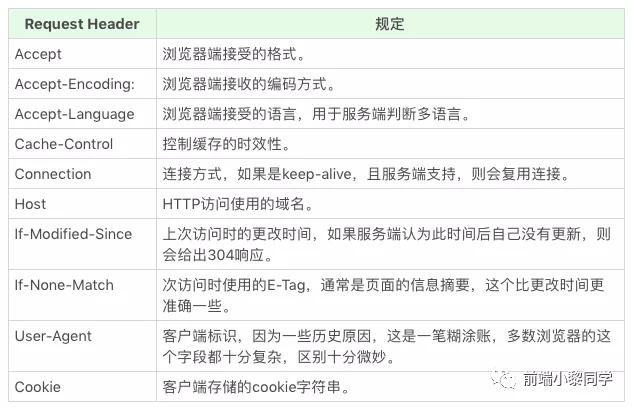

## CORS 简介

跨源资源共享（CORS）是一种基于 HTTP 头的机制，该机制通过允许服务器标示除了它自己以外的其他源（域、协议或端口），使得浏览器允许这些源访问加载自己的资源。跨源资源共享还通过一种机制来检查服务器是否会允许要发送的真实请求，该机制通过浏览器发起一个到服务器托管的跨源资源的“预检”请求。在预检中，浏览器发送的头中标示有 HTTP 方法和真实请求中会用到的头。

## 简单请求

简单请求不会触发 CORS 预检请求，若请求满足所有下述条件，则该请求可视为简单请求：

- 使用下列方法之一：
  - GET
  - HEAD
  - POST
- 对 CORS 安全的标头字段集合：
  - Accept
  - Accept-Language
  - Content-Language
  - Content-Type（需要注意额外的限制）
  - Range（只允许简单的范围标头值 如 bytes=256- 或 bytes=127-255）
- Content-Type 标头所指定的媒体类型的值仅限于下列三者之一：
  - text/plain
  - application/x-www-form-urlencoded
  - multipart/form-data
- 如果请求是使用 XMLHttpRequest 对象发出的，则 upload 属性上没有注册任何事件监听器
- 请求中没有使用 ReadableStream 对象。


## 预检请求

与简单请求不同，“需预检的请求”要求必须首先使用 OPTIONS 方法发起一个预检请求到服务器，以获知服务器是否允许该实际请求。"预检请求“的使用，可以避免跨域请求对服务器的用户数据产生未预期的影响。首先发起 options 请求目的：

- 用来向服务器询问该请求是否有访问权限
- 服务器支持的请求方式以及支持的请求头部

## 附带身份凭证的请求

XMLHttpRequest 或 Fetch 与 CORS 的一个有趣的特性是，可以基于 HTTP cookies 和 HTTP 认证信息发送身份凭证。一般而言，对于跨源 XMLHttpRequest 或 Fetch 请求，浏览器不会发送身份凭证信息。如果要发送凭证信息，需要设置 XMLHttpRequest 对象的某个特殊标志位，或在构造 Request 对象时设置。

> CORS 预检请求不能包含凭据。预检请求的响应必须指定 Access-Control-Allow-Credentials: true 来表明可以携带凭据进行实际的请求。

```js
const url = "https://bar.other/resources/credentialed-content/";

const request = new Request(url, { credentials: "include" });

const fetchPromise = fetch(request);
fetchPromise.then(response => console.log(response));
```


将 credentials 选项设置为 "include"，此时浏览器会拒绝任何不带 Access-Control-Allow-Credentials: true 标头的响应，且不会把响应提供给调用的网页内容。

## CORS 请求标头字段

- `Origin`:预检请求或实际跨源请求的源站。
- `Access-Control-Request-Method`:预检请求将实际请求所使用的 HTTP 方法告诉服务器
- `Access-Control-Request-Headers`:预检请求将实际请求所携带的标头字段（通过 setRequestHeader() 等设置的）告诉服务器。这个浏览器端标头将由互补的服务器端标头 Access-Control-Allow-Headers 回答。

## CORS 响应标头字段

- `Access-Control-Allow-Origin`:告诉浏览器允许该源访问资源。或者，对于不需要携带身份凭证的请求，服务器可以指定该字段的值为通配符“\*”，表示允许来自任意源的请求。
- `Access-Control-Allow-Methods`:指定了访问资源时允许使用的请求方法，用于预检请求的响应
- `Access-Control-Allow-Headers`:用于预检请求的响应。其指明了实际请求中允许携带的标头字段。这个标头是服务器端对浏览器端 Access-Control-Request-Headers 标头的响应。
- `Access-Control-Allow-Credentials`:当浏览器的 credentials 设置为 true 时是否允许浏览器读取 response 的内容。当用在预检请求的响应中时，它指定了实际的请求是否可以使用 credentials
- `Access-Control-Max-Age`:指定了 preflight 请求的结果能够被缓存多久

## Access-Control-Expose-Headers

在跨源访问时，XMLHttpRequest 对象的 getResponseHeader() 方法只能拿到一些最基本的响应头:

- Cache-Control
- Content-Language
- Content-Type
- Expires
- Last-Modified
- Pragma

CORS 规范将这些头称为 `简单响应头`，如果要访问其他头，则需要服务器设置 Access-Control-Expose-Headers 响应报头，用于指示哪些报头可以公开，暴露多个字段需要用逗号分隔开。接着前端就能拿到里面的自定义响应头了。

```js
// 响应头设置，向前端暴露name，age两个个字段
Access-Control-Expose-Headers:name,age;
name:zhangjinxi;
age:23;

// 在客户端就可以通过XMLHttpRequest对象的getResponseHeader('zhangjinxi')方法，获取到暴露的响应头字段的值
XHR.getResponseHeader('name'); // zhangjinxi
XHR.getResponseHeader('age'); // 23
```

## 常见请求头



## 常见响应头


## COEP 跨域嵌入策略

跨域嵌入策略（Cross-Origin-Embedder-Policy, COEP）。限制嵌入的跨域资源的网站的能力。例如，不能访问强大功能如 SharedArrayBuffer 和通过 Performance.now() API 的不受限计时器，因为这些功能可能被利用来推断跨域资源的敏感信息。如果一个网站需要访问这些功能，它必须向浏览器表示其只打算与不含证明信息的资源（credentialless）或明确允许其他来源访问的资源（通过 Cross-Origin-Resource-Policy 头）交互。

## CORP 跨域资源策略

跨域资源策略是由 Cross-Origin-Resource-Policy HTTP 标头，控制允许哪些源可以访问当前资源。

CORP 是默认同源策略之外的附加保护层。跨域资源策略是对跨域读取阻止 （CORB） 的补充，CORB 是一种默认情况下防止某些跨域读取的机制。

> 该策略仅对 no-CORS 请求有效。由于此策略是通过响应标头表示的，因此不会阻止实际请求，而是浏览器通过剥离响应正文来防止结果泄露。

```http
Cross-Origin-Resource-Policy: same-site | same-origin | cross-origin
```

- `same-site` 只有来自同一站点的请求才能读取资源。
- `same-origin` 只有来自同一来源（即 scheme + host + port）的请求才能读取资源。
- `cross-origin` 来自任何源（同站点和跨站点）的请求都可以读取资源。这在使用 COEP 时很有用

在文档上使用 Cross-Origin-Embedder-Policy HTTP 响应标头时，可用于要求子资源与文档同源，或者附带 Cross-Origin-Resource-Policy HTTP 响应标头，以表明它们可以嵌入

## COOP 跨域打开策略

跨域打开策略（Cross-Origin-Opener-Policy, COOP），有助于控制其他网页如何打开和引用受保护页面。

- unsafe-none 明确禁用，这也是缺少头时的默认行为。
- same-origin 值允许来自同源页面的引用，
- same-origin-allow-popups 还允许窗口或标签页的引用。

类似于跨域嵌入策略，COOP 必须配置为 same-origin 才能解锁强大功能如 SharedArrayBuffer 和 Performance.now()。
