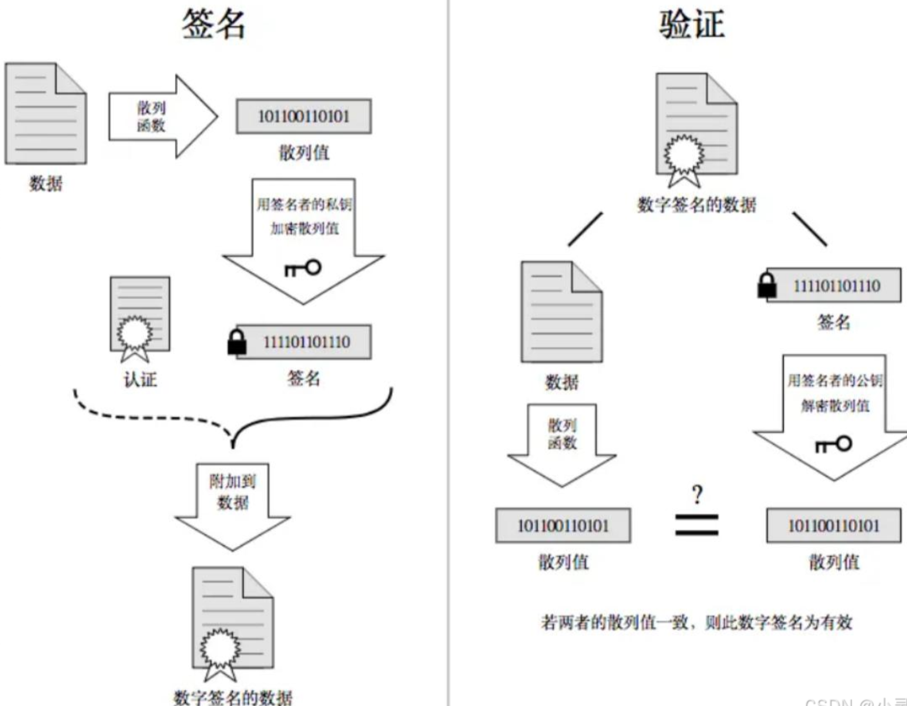

## HTTPS 简介

HTTPS 全称为 Hyper Text Tranfer Protocol Secure，HTTPS 协议也是一个应用层协议，是在 HTTP 协议的基础上引入了一个加密层。

传统的 HTTP 协议，数据是以明文的形式在网络上传输，默认 80 端口。HTTPS 通过使用安全套接字层（SSL，Secure Sockets Layer）或传输层安全（TLS，Transport Layer Security）协议对 HTTP 进行加密，从而在数据传输过程中提供加密和认证保护，默认 443 端口。其作用主要有三个：

- 身份校验：使用非对称加密(一般 RSA)，保证数据到达用户期望的目的地。
- 数据完整性：使用 hash 摘要算法（SHA MD5），及时发现被第三方篡改的传输内容。
- 数据保密性：使用对称加密（DES），保证数据内容在传输的过程中不会被第三方查看

## TLS 传输层安全

HTTPS 使用传输层安全（Transport Layer Security, TLS）来保护客户端和服务器之间的连接。

TLS 诞生了多个新版本。目前最新版本是 TLS1.3，已经成为首选版本。与 TLS1.2 相比，TLS1.3 废弃了一些在 1.2 中包含但被发现存在缺陷的加密协议，并且强制实施前向保密（Perfect Forward Secrecy）。这意味着它在网络上得到了高度支持。前向保密是一项特性，确保即使使用中的密钥泄露，也无法用来解密未来或过去通过连接发送的消息。主要浏览器厂商早已不再支持旧版本的 TLS。基础协议为 HTTP/3 的 QUIC（快速 UDP 互联网连接）也使用 TLS，提供了与 TLS1.3 类似的安全保证。

在客户端和服务器能够通信之前，他们必须达成一致使用的加密算法，也就是加密套件。Galois/Counter Mode（GCM）加密套件，被认为是最安全的选择，因为它们不易受到填充攻击。在 GCM 模式下使用 128-bit 密钥，是安全的密钥长度。TLS1.3 仅支持 GCM 及其他现代块加密模式，这也简化了其加密套件排序。

## 常见加密方式

1. 对称加密

加密和解密所用的密钥是相同的

- 常见对称加密算法：DES、3DES、AES、TDEA、Blowfish、RC2 等
- 特点：算法公开、计算量⼩、加密速度快、加密效率⾼

2. 非对称加密

需要两个密钥来进行加密和解密

- 常见非对称加密算法：RSA，DSA，ECDSA
- 特点：算法强度复杂、安全性依赖于算法与密钥，速度较慢。

3. hash 数据摘要

数据摘要（数据指纹），其基本原理是利用单向散列函数（Hash 函数）对数据进行运算，生成一串固定长度的数字摘要（散列值）。

- 特征：并不是一种加密机制，具有不可逆性，即无法从摘要推导出原始数据。
- 应用：验证数据的完整性，确保数据在传输或存储过程中没有被修改。
- 常见算法：有 MD5、SHA1、SHA256、SHA512 等。

4. 数据签名

用于验证数据的完整性和真实性

- 发送者使用私钥对数据摘要进行加密，形成签名，接收者使用发送者的公钥对签名进行解密和验证。
- 不仅验证数据的完整性，还验证发送者的身份，确保数据的真实性和不可否认性。

5. 数字证书

中间人可能拦截请求，伪造服务端生成的公钥，从而获取传输的数据。根本原因是浏览器无法确认收到的公钥是不是网站自己的。如何确认公钥没被伪造，需要 CA 权威认证机构。其颁发的数字证书就是“身份证”，可以理解成是一个结构化的字符串, 里面包含了以下信息:

- 证书发布机构：权威认证
- 证书有效期：验证是否过期
- 证书所有者：保证证书无法被掉包
- 适用域名：保证证书无法被掉包
- 服务端公钥：用于客户端加密生成的对称密钥
- 签名：保证证书没有被篡改
- 数据：生成摘要，和从签名解密出的摘要对比，判断是否篡改

生成数字证书流程：

- 服务端携带数据和生成的公钥，向 CA 机构申请数字证书
- CA 对数据进行 hash 生成数据摘要
- CA 用自己的私钥对数据摘要加密，生成签名。
- 数据+签名组成数字证书，返回给服务端

浏览器使用内置的 CA 认证机构和对应的公钥。对数字证书里的签名解密出数据摘要，使用 CA 同样的算法对数据进行 hash 也得到一份数据摘要，对比如果完全一致说明内容没有被篡改，保证了数字证书有效性。

然后浏览器从数字证书里拿到服务端公钥，用来对生成的对称密钥加密，然后交给服务端，由服务端私钥解密出对称密钥。后续都使用该对称密钥加解密。

## HTTPS 原理

1. 客户端将它所支持的算法列表和一个用作产生密钥的随机数发送给服务器
2. 服务器从算法列表中选择一种加密算法，并将它和一份包含服务器公用密钥的证书发送给客户端；该证书还包含了用于认证目的的服务器标识，服务器同时还提供了一个用作产生密钥的随机数
3. 客户端对服务器的证书进行验证，并抽取服务器的公钥；再产生一个 pre_master_secret 随机密码串，并使用服务器的公用密钥对其进行加密，并将加密后的信息发送给服务器
4. 客户端与服务器端根据 pre_master_secret 以及客户端与服务器的随机数值独立计算出加密和 MAC 密钥
5. 客户端将所有握手消息的 MAC 值发送给服务器
6. 服务器将所有握手消息的 MAC 值发送给客户端

## 如何保持会话

服务器会为每个浏览器（或客户端软件）维护一个 session ID，在 TLS 握手阶段传给浏览器，浏览器生成好密钥传给服务器后，服务器会把该密钥存到相应的 session ID 下，之后浏览器每次请求都会携带 session ID，服务器会根据 session ID 找到相应的密钥并进行解密加密操作，这样就不必要每次重新制作、传输密钥了！

## HSTS 严格传输安全

HTTP 严格传输安全（HSTS）是一种响应头，服务器可以使用它来通知浏览器只应通过 HTTPS 访问该域托管的页面，而不是先通过 HTTP 访问再进行重定向。
通过在头值中添加指令来与浏览器通信。max-age 指令是必需的，它向浏览器指示应继续仅通过 HTTPS 访问页面的时间（以秒为单位）
