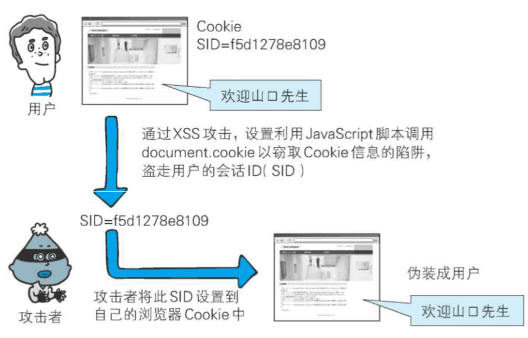
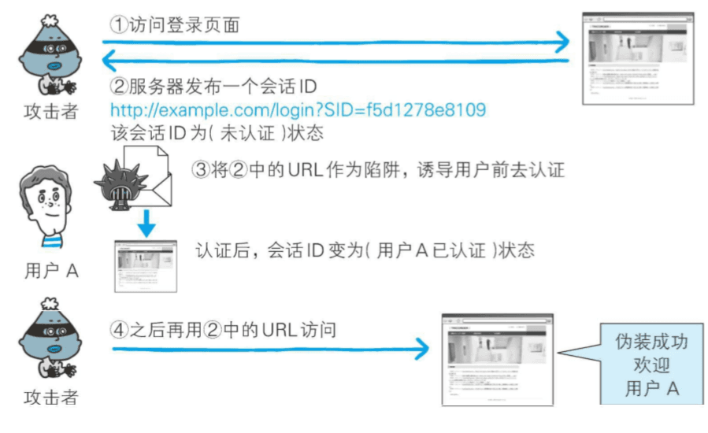
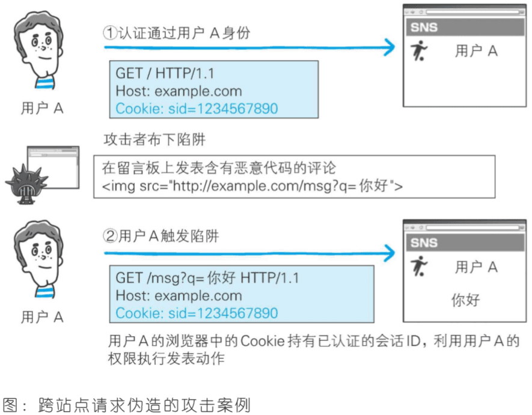
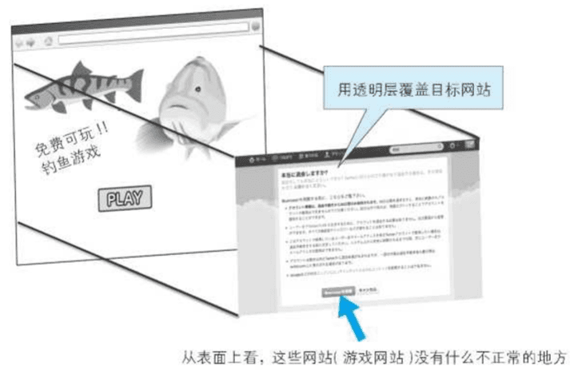
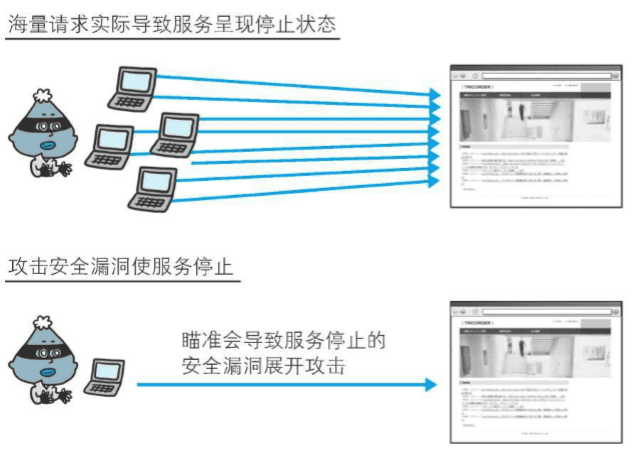

# 常见安全问题

## XSS 跨站脚本

XSS（Cross Site Scripting）跨站脚本攻击，是一种代码注入攻击。攻击者通过利用网页开发时留下的漏洞，通过巧妙的方法注入恶意指令代码到网页，使用户加载并执行攻击者恶意制造的网页程序。这些恶意网页程序通常是 JavaScript，也可以是 Java、VBScript、ActiveX、Flash 或者甚至是普通的 HTML。攻击成功后，攻击者可能得到包括但不限于更高的权限（如执行一些操作）、私密网页内容、会话和 cookie 等各种内容。

### 攻击类型

1. 反射型：攻击者通过特定手法，诱使用户去访问一个包含恶意代码的 URL，当受害者点击 URL 的时候，恶意代码会直接在受害者浏览器执行。此类 XSS 攻击通常出现在网站的搜索栏、用户登录口等地方，常用来窃取客户端 Cookies 或进行钓鱼欺骗。
2. DOM 型： 客户端的脚本程序可以动态地检查和修改页面内容，而不依赖于服务器端的数据。例如客户端从 URL 或者用户输入中提取的数据，可能包含了恶意的 JavaScript 脚本，而这些脚本没有经过过滤或者转码。需要特别注意以下的用户输入源 document.URL、location.hash、location.search、document.referrer 等。
3. 储存型：通过用户输入个人信息或者发表文章、网站留言、评论、博客日志等交互处，将恶意代码存储于服务器端，当其他用户再次访问页面时执行恶意代码。存储型 XSS 是持久化的 XSS 攻击方式，危害会更大。

### 防御手段

1. 设置 CSP 内容安全策略

通过一系列指令告诉客户端只允许加载和执行指令集中限定的内容，类似白名单机制，不满足限定条件的资源和内容将被客户端阻断或不被执行。可以通过两种方式设置 CSP，一种是 meta 标签，一种是设置 HTTP 响应头

```Http
 Content-Security-Policy: default-src 'self'   只允许加载本站资源
 Content-security-Policy: img-src https://   只允许加载https协议图片
 Content-security-Policy:child-src 'none'  不允许加载任何来源框架

 //该页面只允许当前源和https://apis.example.com 这 2 个源的脚本加载和执行
<meta http-equiv="Content-Security-Policy" content="script-src 'self' https://apis.example.com">
```

2. 过滤和转义特殊字符

大部分的论坛或者博客平台，注册账号都会允许用户填写个人信息，包括昵称、邮箱和个性签名等，此类文本信息属于非富文本类型，最常见的方法就是对尖括号标签转义成实体字符存储

```js
const htmlEncode = function (handleString) {
  return handleString.replace(/&/g, "&amp;").replace(/</g, "&lt;").replace(/>/g, "&gt;").replace(/ /g, "&nbsp;").replace(/\'/g, "&#39;").replace(/\"/g, "&quot;");
};
```

3. 标签白名单

大部分的富文本编辑器原理，都是提供一个具备 contenteditable 属性的 dom 元素，让用户对一段富文本进行编辑，其本质是对一段 html 进行处理，新增或删除样式等，最后通过回传富文本框中 html 的方式提供给开发者，意味着我们要允许用户填充一段 html 于我们的页面中。而获取到的 html 字符串我们不能直接进行简单的标签替换，否则会导致原有的样式丢失。需要服务器端针对 html 的标签白名单过滤。

通过限定白名单，仅允许常见的文本展示标签以及图片 img 标签进入白名单，这部分会再过滤后被保留，并且标签内的 class 和 style 属性也会被保留；其他属性和诸如 script、iframe 等标签都会被直接过滤掉。

```js
// nodejs中常用的库主要是xss和xss-filter
import * as xss from "xss";
function handleXss(content) {
  // 设置HTML过滤器的白名单
  const options = {
    whiteList: {
      p: ["class", "style"],
      em: ["class", "style"],
      strong: ["class", "style"],
      br: ["class", "style"],
      u: ["class", "style"],
      s: ["class", "style"],
      blockquote: ["class", "style"],
      li: ["class", "style"],
      ol: ["class", "style"],
      ul: ["class", "style"],
      h1: ["class", "style"],
      h2: ["class", "style"],
      h3: ["class", "style"],
      h4: ["class", "style"],
      h5: ["class", "style"],
      h6: ["class", "style"],
      span: ["class", "style"],
      div: ["class", "style"],
      img: ["src", "class", "style", "width"],
    },
  };
  // 自定义规则
  const myxss = new xss.FilterXSS(options);
  return myxss.process(content);
}
```

4. 使用 POST 代替 GET：因为 GET 请求会将数据放在 URL 中，容易被恶意用户利用来执行 XSS 攻击。而 POST 请求则将数据放在请求体中，更安全。
5. 使用 HTTPOnly 标记来限制 cookie 的访问，防止 cookie 被盗用。

```js
response.addHeader("Set-Cookie", "uid=12;path=/; HttpOnly");

cookies.set(name, value, {
  httpOnly: true, // 默认为 true
});
```

## 会话劫持

会话劫持(Session Hijack)是指攻击者通过某种手段拿到了用户的会话 ID，并非法使用此会话 ID 伪装成用户，达到攻击的目的。

通过窃听或 XSS 攻击盗取会话 ID：


会话固定攻击(Session Fixation)攻击会强制用户使用攻击者指定的会话 ID：


### 防御手段

1. 强制用户在访问网站时，必须先登录，并严格限制用户访问范围
2. 强制用户在访问网站时，必须先通过 HTTPS 协议：
3. 避免使用 session cookie：
4. 使用 cookie 的 SameSite 和 httpOnly 属性
5. 使用随机的会话 ID：
6. 使用 CSRF 令牌：token

## CSRF 跨站请求伪造

跨站请求伪造（英语：Cross-site request forgery），也被称为 one-click attack 或者 session riding，通常缩写为 CSRF 或者 XSRF， 是一种挟制用户在当前已登录的 Web 应用程序上执行非本意的操作的攻击方法。如:攻击者诱导受害者进入第三方网站，在第三方网站中，向被攻击网站发送跨站请求。利用受害者在被攻击网站已经获取的注册凭证，绕过后台的用户验证，达到冒充用户对被攻击的网站执行某项操作的目的。


- 攻击一般发起在第三方网站，而不是被攻击的网站。被攻击的网站无法防止攻击发生。

- 攻击利用受害者在被攻击网站的登录凭证，冒充受害者提交操作；而不是直接窃取数据。

- 整个过程攻击者并不能获取到受害者的登录凭证，仅仅是“冒用”。

- 跨站请求可以用各种方式：图片 URL、超链接、CORS、Form 提交等等。部分请求方式可以直接嵌入在第三方论坛、文章中，难以进行追踪。

### 防御手段

1. 同源检测：阻止不同域的访问

检查 HTTP Referer 头以确认请求来源的域名合法性，但要注意 Referer 是可以被篡改的，因此仅作为辅助手段。

要求特定 HTTP 头部（如 X-Requested-With）来检查请求是否源自可信源。

2. token 验证

请求参数中携带 token，攻击者只是利用了登录状态，并不知道 token 是什么，无法拼接参数。服务端验证 token 有效性。

3. cookie 双重验证：请求参数携带 cookie
4. 实现完善的会话管理，包括使用安全的 Session ID 存储机制，并设置合理的过期时间。

5. 手机验证码：需要用户亲自验证，终极解决方案。

## 点击劫持

点击劫持是一种通过在 Web 页面中透明覆盖一个可点击的按钮或链接，以欺骗用户点击，从而进行一些恶意操作的攻击。

攻击原理：

- 攻击者构建了一个非常有吸引力的网页
- 将被攻击的页面放置在当前页面的 iframe 中
- 使用样式将 iframe 叠加到非常有吸引力内容的上方
- 将 iframe 设置为 100%透明
- 用户在不知情的情况下点击按钮，触发执行一些其他命令。

### 防御手段

1. X-frame-options 是一个 HTTP 响应头，控制页面是否可以嵌入其他源页面中。

- SAMEORIGIN，允许页面仅被同源网页嵌入
- DENY，完全阻止页面的嵌入。
- ALLOW-FRO，表示页面可以在指定来源的 iframe 中展示

```js
response.setHeaders("X-FRAME-OPTIONS", "DENY");
```

2. 使用 JavaScript 来防止页面被透明覆盖。

```js
//判断当前页面是否被嵌入到 iframe 中。
if (top.location != self.location) {
  top.location = window.location;
}
```

3. 使用 CSP 来限制页面的加载，避免恶意脚本的注入

## HTTP 首部注入攻击

HTTP 首部注入攻击是一种利用 HTTP 请求头中包含恶意字符来绕过服务器验证的攻击。攻击者可以利用 HTTP 请求头中的恶意字符，例如空格、制表符、换行符等，来绕过服务器的验证，从而执行恶意的操作：

- 设置任何 Cookie 信息；
- 重定向至任意 URL；
- 显示任意的主体(HTTP 响应截断攻击)

```bash
# 根据用户输入或者选择获取id
Location: http://example.com/?cat=[id]

# 用户输入信息为：%0D%0A代表HTTP报文中的换行符
101%0D%0ASet-Cookie:+SID=123456789

# 被解析为：导致设置了Cookie信息
Location:http://example.com/?cat=101
Set-Cookie:SID=123456789
```

### 防御手段

1. 使用白名单，只允许指定的字符。
2. 使用正则表达式匹配，只允许指定的字符。
3. 对用户输入进行转义和过滤。
4. 使用参数化查询，参数化查询可以防止注入。

## OS 命令注入

os 命令注入和 sql 注入差不多，只不过 SQL 注入是针对数据库的，而 OS 命令注入是针对操作系统的，OS 命令注入攻击者指通过 web 应用,执行非法的操作系统命令达到攻击的目的，只要在你让那个调用 Shell 函数的地方就有存在被攻击的风险，倘若调用 shell 时存在疏漏，就可以执行插入非法命令。

```js
const { exec } = require("child_process");

// 代表恶意指令
const params = `https://github.com/xx/xx.git && rm -fr /* &&`;

// 执行命令后，会删除文件
exec(`git clone ${params} /some/path`);
```

### 防御手段

- 不要相信用户输入的任何内容。需要做过滤和转义操作，禁止输入不符合规范的代码。
- 不要动态拼接命令，使用参数化查询

## Dos 攻击

Dos 攻击是一种利用网络资源的一种恶意攻击，攻击者通过发送大量的请求，导致服务器资源耗尽，使其无法响应正常的请求。



### 防御手段

1. 防御式编程：在代码中添加一些防御性代码，比如检查参数是否合法、是否为空、是否越界等，防止出现异常。
2. 限制客户端请求次数：限制客户端在特定时间内的请求次数，防止客户端发起大量的请求，导致服务器资源耗尽。

## 项目中如何预防安全问题

- 强化安全意识：在项目启动阶段，就需要强调安全问题的重要性，强化所有项目成员的安全意识。让每个人都明白自己在保障项目安全方面的责任，并积极参与到安全工作中来。
- 建立安全管理制度：制定一套完善的安全管理制度，明确各项安全管理要求和标准。包括安全培训制度、安全操作规程、安全检查制度等，确保每个环节都得到有效管理。

- 实施安全性设计：从设计阶段开始，就需要注意安全性设计。遵循安全性设计原则和标准，考虑可能出现的攻击和漏洞，采取相应的防范措施。同时，需要加强数据加密、访问控制、权限管理等关键环节的安全性设计。
- 加强代码审查：建立代码审查机制，确保代码质量和安全性。通过定期的代码审查，可以发现并纠正潜在的安全漏洞和错误。同时，需要关注最新的安全漏洞和补丁，及时修复和升级系统。
- 实施安全培训：对项目成员进行安全培训，提高他们的安全意识和技能。培训内容包括安全基础知识、安全漏洞防范、应急响应等。定期组织安全培训和演练，增强项目成员的安全意识和应对能力。
- 建立安全测试机制：在项目开发过程中，建立安全测试机制。包括安全性测试、可靠性测试、性能测试等。通过模拟各种攻击场景和漏洞利用方式，发现并修复潜在的安全问题。同时，需要关注最新的漏洞利用方式和攻击手段，及时调整测试策略。
- 做好数据保护：保护项目中的敏感数据是预防安全问题的关键之一。采取加密、访问控制、数据备份等措施，确保数据的机密性和完整性。同时，需要关注数据的安全审计和监控，及时发现并应对数据安全事件。
- 定期审查和更新：定期审查和更新项目的安全策略和流程，以适应新的安全威胁和业务需求。同时，需要关注最新的安全漏洞和补丁，及时修复和升级系统。
