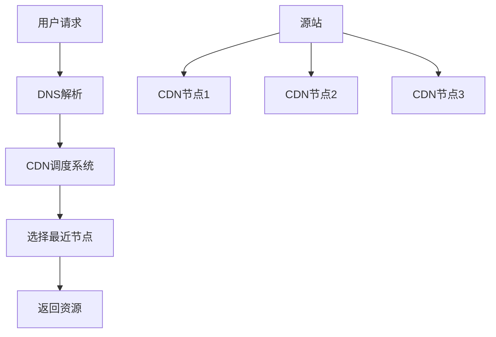

# ⚡ 前端性能优化完整指南

前端性能优化是提升用户体验的关键环节。本文介绍前端性能优化的七大核心手段，帮助开发者构建高性能的Web应用。

::: tip 📚 本章内容
系统学习前端性能优化策略，掌握网络、资源、渲染、构建等各个层面的优化技巧。
:::

## 🎯 性能优化概览

### 📊 七大优化手段

| 优化方向 | 核心目标 | 主要技术 | 性能提升 |
|----------|----------|----------|----------|
| **网络连接优化** | 减少连接时间 | CDN、DNS预解析、HTTP/2 | 20-40% |
| **请求数量减少** | 降低请求频次 | 合并请求、缓存策略 | 30-50% |
| **资源大小压缩** | 减小传输体积 | Gzip、图片压缩、代码压缩 | 40-70% |
| **资源加载优化** | 提升加载效率 | 懒加载、预加载、异步加载 | 25-45% |
| **渲染性能优化** | 减少重绘回流 | DOM优化、CSS优化 | 15-30% |
| **API性能优化** | 使用高效API | 现代浏览器API | 10-25% |
| **构建打包优化** | 优化产物结构 | Tree-shaking、代码分割 | 30-60% |

## 🌐 网络连接优化

网络连接优化是性能优化的第一步，通过减少网络延迟和提高连接效率来改善用户体验。

### 📡 CDN 内容分发网络

**CDN（Content Delivery Network）** 是内容分发网络，通过在全球部署边缘节点，让用户就近访问资源。

#### 🎯 CDN 工作原理



#### ✨ CDN 优势

| 优势 | 说明 | 性能提升 |
|------|------|----------|
| **就近访问** | 用户从最近的节点获取资源 | 减少延迟 50-80% |
| **负载分散** | 分散源站压力 | 提高可用性 |
| **带宽优化** | 减少跨地域传输 | 节省带宽成本 |
| **缓存加速** | 边缘节点缓存热点资源 | 加快响应速度 |

### 🔍 DNS 预解析和预连接

DNS 解析是访问网站的第一步，优化 DNS 解析可以显著提升页面加载速度。

#### 📊 DNS 解析流程

```
浏览器缓存 → 系统缓存 → 路由器缓存 → ISP DNS缓存 → 根域名服务器 → 顶级域名服务器 → 主域名服务器
```

#### 🚀 预解析技术

```html
<!-- DNS 预解析 - 提前解析域名 -->
<link rel="dns-prefetch" href="https://cdn.example.com">
<link rel="dns-prefetch" href="https://api.example.com">

<!-- 预连接 - 建立完整连接 -->
<link rel="preconnect" href="https://fonts.googleapis.com">
<link rel="preconnect" href="https://www.google-analytics.com">

<!-- 预加载 - 提前下载资源 -->
<link rel="preload" href="/critical.css" as="style">
<link rel="preload" href="/hero-image.jpg" as="image">

<!-- 预获取 - 空闲时下载 -->
<link rel="prefetch" href="/next-page.js">
```

#### 📋 预连接策略对比

| 技术 | 作用 | 适用场景 | 性能影响 |
|------|------|----------|----------|
| `dns-prefetch` | 仅DNS解析 | 外部域名资源 | 低开销，高收益 |
| `preconnect` | DNS+TCP+TLS | 关键第三方资源 | 中等开销，显著收益 |
| `preload` | 下载资源 | 当前页面关键资源 | 高优先级 |
| `prefetch` | 预取资源 | 下个页面可能用到 | 低优先级 |

### 🔄 并行连接优化

#### 📊 HTTP/1.1 连接限制

```javascript
// HTTP/1.1 各浏览器的域名并发限制
const browserLimits = {
  Chrome: 6,
  Firefox: 6,
  Safari: 6,
  Edge: 6,
  IE11: 8
}

// 使用多个子域名增加并发数
const domains = [
  'static1.example.com',
  'static2.example.com', 
  'static3.example.com',
  'static4.example.com'
]
```

#### ⚡ HTTP/2 多路复用

```html
<!-- HTTP/2 下单个连接即可处理多个请求 -->
<link rel="stylesheet" href="/css/main.css">
<link rel="stylesheet" href="/css/theme.css">
<script src="/js/vendor.js"></script>
<script src="/js/app.js"></script>
<!-- 以上请求在 HTTP/2 下可通过单个连接并行传输 -->
```

### 🔗 持久连接

#### 🛠️ Keep-Alive 配置

```javascript
// 服务器端配置 Keep-Alive
app.use((req, res, next) => {
  res.setHeader('Connection', 'keep-alive')
  res.setHeader('Keep-Alive', 'timeout=5, max=1000')
  next()
})
```

#### 📊 连接类型对比

| 连接类型 | 特点 | 适用场景 | 性能表现 |
|----------|------|----------|----------|
| **短连接** | 请求完成后立即关闭 | 简单请求 | 连接开销大 |
| **长连接** | 保持连接复用 | 频繁请求 | 减少握手开销 |
| **管道化** | 批量发送请求 | HTTP/2 环境 | 最优性能 |

### 🎯 实施建议

#### ✅ 最佳实践

1. **CDN 部署策略**
   ```javascript
   // 静态资源使用 CDN
   const cdnConfig = {
     images: 'https://img-cdn.example.com',
     scripts: 'https://js-cdn.example.com', 
     styles: 'https://css-cdn.example.com'
   }
   ```

2. **DNS 优化策略**
   ```html
   <!-- 在 <head> 中尽早添加预解析 -->
   <link rel="dns-prefetch" href="//cdn.example.com">
   <link rel="dns-prefetch" href="//api.example.com">
   ```

3. **连接数优化**
   ```javascript
   // 合理使用域名分片（HTTP/1.1）
   const getResourceUrl = (type, filename) => {
     const domainIndex = hash(filename) % 4
     return `https://static${domainIndex}.example.com/${type}/${filename}`
   }
   ```

#### ❌ 避免的问题

- 过度使用 `preconnect`（限制在 4-6 个关键域名）
- 在 HTTP/2 环境下仍使用域名分片
- 忽视 DNS 缓存策略的配置

## 减少请求数量

1.  合并请求：将多个请求合并成一个请求，可以减少请求数量和请求深度，但合并请求也会增加请求时间，所以需要权衡。对于页面加载所必须的资源可以合并，比如 CSS 和 JS 文件，对于非必须的资源，比如图片，可以分批加载，比如在页面加载完之后再加载图片。
2.  图片处理：将图片的内容以 Base64 格式内嵌到 HTML 中，可以减少 HTTP 请求数量。但是，由于 Base64 编码用 8 位字符表示信息中的 6 个位，所以编码后大小大约比原始值扩大了 33%。推荐使用字体图标来代替图片
3.  减少重定向：尽量避免使用重定向，当页面发生了重定向，就会延迟整个 HTML 文档的传输。在 HTML 文档到达之前，页面中不会呈现任何东西，也没有任何组件会被下载，降低了用户体验。减少 HTTP 重定向的数量，可以减少请求数量。比如使用 301 重定向代替 302 重定向，301 重定向会缓存，而 302 重定向不会缓存。
4.  使用缓存：缓存可以减少请求数量，但是需要服务器支持，而且缓存的资源需要更新，否则用户可能看到旧版本的资源。使用 cach-control 或 expires 这类强缓存时，缓存不过期的情况下，不向服务器发送请求。强缓存过期时，会使用 last-modified 或 etag 这类协商缓存，向服务器发送请求，如果资源没有变化，则服务器返回 304 响应，浏览器继续从本地缓存加载资源；如果资源更新了，则服务器将更新后的资源发送到浏览器，并返回 200 响应
5.  避免使用空的 src 和 href：a 标签设置空的 href，会重定向到当前的页面地址，form 设置空的 method，会提交表单到当前的页面地址

## 减小资源大小

1、HTML 压缩

HTML 代码压缩就是压缩在文本文件中有意义，但是在 HTML 中不显示的字符，包括空格，制表符，换行符等

2、CSS 压缩

CSS 压缩包括无效代码删除与 CSS 语义合并

3、JS 压缩与混乱

JS 压缩与混乱包括无效字符及注释的删除、代码语义的缩减和优化、降低代码可读性，实现代码保护

4、图片压缩

针对真实图片情况，舍弃一些相对无关紧要的色彩信息。在安卓下可以使用 webp 格式的图片，它具有更优的图像数据压缩算法，能带来更小的图片体积，同等画面质量下，体积比 jpg、png 少了 25%以上，而且同时具备了无损和有损的压缩模式、Alpha 透明以及动画的特性

5、使用 gzip 压缩

HTTP 协议上的 GZIP 编码是一种用来改进 WEB 应用程序性能的技术。大流量的 WEB 站点常常使用 GZIP 压缩技术来让用户感受更快的速度。这一般是指 WWW 服务器中安装的一个功能，当有人来访问这个服务器中的网站时，服务器中的这个功能就将网页内容压缩后传输到来访的电脑浏览器中显示出来。一般对纯文本内容可压缩到原大小的 40%

## 优化资源加载

1. 资源加载位置：通过优化资源加载位置，更改资源加载时机，使尽可能快地展示出页面内容，尽可能快地使功能可用。

   - CSS 文件放在 head 中，先外链，后本页

   - JS 文件放在 body 底部，先外链，后本页

   - 处理页面、处理页面布局的 JS 文件放在 head 中，如 babel-polyfill.js 文件、flexible.js 文件

   - body 中间尽量不写 style 标签和 script 标签

2. 资源加载时机

- 预加载：在页面加载时，将资源提前加载到浏览器缓存中，当需要使用时，直接从缓存中读取，从而减少请求时间。
- 预获取：在用户点击时，将资源提前加载到浏览器缓存中，当需要使用时，直接从缓存中读取，从而减少请求时间。
- 预渲染：在用户点击时，将资源提前渲染到浏览器中，当需要使用时，直接从内存中读取，从而减少请求时间。
- 懒加载：延迟加载不影响当前页面的资源，等进入视口或者网络空闲时在加载资源，提升用户体验。
- 异步 script 标签：
  - defer: 异步加载，在 HTML 解析完成后执行。
  - async: 异步加载，加载完成后立即执行
  - 动态 script 脚本，通过动态创建 script 标签，将资源加载到浏览器中
- 模块按需加载：按需加载，是一种很好的优化网页或应用的方式。这种方式实际上是先把代码在一些逻辑断点处分离开，然后在一些代码块中完成某些操作后，立即引用或即将引用另外一些新的代码块。这样加快了应用的初始加载速度，减轻了它的总体体积，因为某些代码块可能永远不会被加载。
  - 符合 ECMAScript 提案 的 import() 语法
  - webpack 特定的 require.ensure
- 使用 link 标签代替 CSS @import：CSS 的@import 会阻塞页面的解析，所以不建议使用。

## 减少回流和重绘

**样式设置**

1、避免使用层级较深的选择器，或其他一些复杂的选择器，以提高 CSS 渲染效率

2、避免使用 CSS 表达式，CSS 表达式是动态设置 CSS 属性的强大但危险方法，它的问题就在于计算频率很快。不仅仅是在页面显示和缩放时，就是在页面滚动、乃至移动鼠标时都会要重新计算一次

3、元素适当地定义高度或最小高度，否则元素的动态内容载入时，会出现页面元素的晃动或位置，造成回流

4、给图片设置尺寸。如果图片不设置尺寸，首次载入时，占据空间会从 0 到完全出现，上下左右都可能位移，发生回流

5、不要使用 table 布局，因为一个小改动可能会造成整个 table 重新布局。而且 table 渲染通常要 3 倍于同等元素时间

6、能够使用 CSS 实现的效果，尽量使用 CSS 而不使用 JS 实现

**渲染层**

1、此外，将需要多次重绘的元素独立为 render layer 渲染层，如设置 absolute，可以减少重绘范围

2、对于一些进行动画的元素，使用硬件渲染，从而避免重绘和回流

**DOM 优化**

1、缓存 DOM

由于查询 DOM 比较耗时，在同一个节点无需多次查询的情况下，可以缓存 DOM

```html
const div = document.getElementById('div')
```

2、减少 DOM 深度及 DOM 数量

HTML 中标签元素越多，标签的层级越深，浏览器解析 DOM 并绘制到浏览器中所花的时间就越长，所以应尽可能保持 DOM 元素简洁和层级较少。

3、批量操作 DOM

由于 DOM 操作比较耗时，且可能会造成回流，因此要避免频繁操作 DOM，可以批量操作 DOM，先用字符串拼接完毕，再用 innerHTML 更新 DOM

4、批量操作 CSS 样式

通过切换 class 或者使用元素的 style.csstext 属性去批量操作元素样式

5、在内存中操作 DOM

使用 DocumentFragment 对象，让 DOM 操作发生在内存中，而不是页面上

6、DOM 元素离线更新

对 DOM 进行相关操作时，例如：appendChild 等都可以使用 Document Fragment 对象进行离线操作，带元素“组装”完成后再一次插入页面，或者使用 display:none 对元素隐藏，在元素“消失”后进行相关操作

7、DOM 读写分离

浏览器具有惰性渲染机制，连接多次修改 DOM 可能只触发浏览器的一次渲染。而如果修改 DOM 后，立即读取 DOM。为了保证读取到正确的 DOM 值，会触发浏览器的一次渲染。因此，修改 DOM 的操作要与访问 DOM 分开进行

8、事件代理

事件代理是指将事件监听器注册在父级元素上，由于子元素的事件会通过事件冒泡的方式向上传播到父节点，因此，可以由父节点的监听函数统一处理多个子元素的事件

利用事件代理，可以减少内存使用，提高性能及降低代码复杂度

9、防抖和节流

使用函数节流（throttle）或函数去抖（debounce），限制某一个方法的频繁触发

10、及时清理环境

及时消除对象引用，清除定时器，清除事件监听器，创建最小作用域变量，可以及时回收内存

## 性能更好的 API

1. 用对选择器

选择器的性能排序如下所示，尽量选择性能更好的选择器

```txt
复制代码
id选择器（#myid）
类选择器（.myclassname）
标签选择器（div,h1,p）
相邻选择器（h1+p）
子选择器（ul > li）
后代选择器（li a）
通配符选择器（*）
属性选择器（a[rel="external"]）
伪类选择器（a:hover,li:nth-child）
```

2. requestAnimationFrame 来替代 setTimeout 和 setInterval

希望在每一帧刚开始的时候对页面进行更改，目前只有使用 requestAnimationFrame 能够保证这一点。使用 setTimeout 或者 setInterval 来触发更新页面的函数，该函数可能在一帧的中间或者结束的时间点上调用，进而导致该帧后面需要进行的事情没有完成，引发丢帧

3. 使用 IntersectionObserver 来实现图片可视区域的懒加载

传统的做法中，需要使用 scroll 事件，并调用 getBoundingClientRect 方法，来实现可视区域的判断，即使使用了函数节流，也会造成页面回流。使用 IntersectionObserver，则没有上述问题

4. 使用 web worker

客户端 javascript 一个基本的特性是单线程：比如，浏览器无法同时运行两个事件处理程序，它也无法在一个事件处理程序运行的时候触发一个计时器。Web Worker 是 HTML5 提供的一个 javascript 多线程解决方案，可以将一些大计算量的代码交由 web Worker 运行，从而避免阻塞用户界面，在执行复杂计算和数据处理时，这个 API 非常有用

## 构建优化

1. 打包公共代码

将公共模块拆出来，最终合成的文件能够在最开始的时候加载一次，便存到缓存中供后续使用。这会带来速度上的提升，因为浏览器会迅速将公共的代码从缓存中取出来，而不是每次访问一个新页面时，再去加载一个更大的文件

webpack 4 将移除 CommonsChunkPlugin, 取而代之的是两个新的配置项 optimization.splitChunks 和 optimization.runtimeChunk。通过设置 optimization.splitChunks.chunks: "all" 来启动默认的代码分割配置项

2. 异步加载 & 按需加载

异步加载使用符合 ECMAScript 提案 的 import() 语法。第二种，则是使用 webpack 特定的 require.ensure

对包进行按需加载，减小打包体积。

3. 剔除无用代码

tree shaking 是一个术语，通常用于描述移除 JavaScript 上下文中的未引用代码(dead-code)。它依赖于 ES2015 模块系统中的静态结构特性，例如 import 和 export。这个术语和概念实际上是兴起于 ES2015 模块打包工具 rollup

JS 的 tree shaking 主要通过 uglifyjs 插件来完成，CSS 的 tree shaking 主要通过 purify CSS 来实现的

4. 长缓存优化

- 将 hash 替换为 contenthash 当内容不变时，缓存依然有效

- 使用 Name 而不是 id：每个 module.id 会基于默认的解析顺序(resolve order)进行增量。也就是说，当解析顺序发生变化，ID 也会随之改变。使用两个插件解决这个问题。
  - NamedModulesPlugin，将使用模块的路径，而不是数字标识符。虽然此插件有助于在开发过程中输出结果的可读性，然而执行时间会长一些。
  - HashedModuleIdsPlugin，推荐用于生产环境构建

5. 公用代码内联

使用 html-webpack-inline-chunk-plugin 插件将 mainfest.js 内联到 html 文件中

6. 减少文件体积

- 压缩代码：使用 webpack-bundle-analyzer 插件，分析出哪些模块占用体积最大的，然后进行代码压缩，使用 terser-webpack-plugin 插件压缩代码
- 压缩图片：使用 image-webpack-loader 插件
- 减少请求数量：使用 dll 技术，将一些公共的代码提取出来，打包成单独的动态链接库，使用 dll-plugin 插件

- 减少文件体积：使用 gzip 压缩，使用 compression-webpack-plugin 插件
- 减少文件体积：使用 babel-plugin-transform-remove-console 插件，移除 console.log 等调试代码
- 减少文件体积：使用 babel-plugin-transform-react-remove-prop-types 插件，移除无用的 propTypes 代码
- 减少文件体积：使用 babel-plugin-transform-react-constant-elements 插件，将常量元素提取出来，避免每次都重新创建
- 减少文件体积：使用 babel-plugin-transform-react-inline-elements 插件，将常量元素提取出来，避免每次都重新创建
- 减少文件体积：使用 babel-plugin-dynamic-import-node 插件，将动态导入代码转换为静态导入代码，减少文件体积
