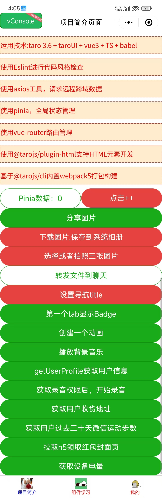

## taro API
- `Pinia`状态管理
- `useRouter()` = Taro.getCurrentInstance.router获取当前路由器
- `@tarojs/plugin-html`支持使用HTML元素进行开发
- `NutUI` 京东风格的移动端组件库
- `Taro.showShareImageMenu({path:imageUrl})` 显示分享图片弹窗
- `Taro.authorize({scope:"scope.writePhotosAlbum"})` 获取写入相册授权
- `Taro.authorize({scope:"scope.record"})` 获取录音权限
- `Taro.authorize({scope:"scope.address"})` 获取用户地址权限
- `Taro.getSetting({success})` 查询用户授权状态

交互：
- `Taro.showToast({title,icon,duration})` 显示提示toast
- `Taro.hideToast(option)` 隐藏消息提示框
- `Taro.showModal(option)` 显示模态对话框
- `Taro.showLoading(option)` 显示 loading 提示框。需主动调用 Taro.hideLoading 才能关闭提示框
- `Taro.hideLoading(option)` 隐藏 loading 提示框
- `Taro.showActionSheet(option)` 显示操作菜单
- `Taro.enableAlertBeforeUnload(option)` 
- `Taro.disableAlertBeforeUnload(option)` 关闭小程序页面返回询问对话框

操作：
- `Taro.saveImageToPhotoAlbum({filePath,success,fail})` 保存图片到相册
- `Taro.chooseImage({count,success,fail})` 选择图片或者拍照
- `Taro.getUserProfile({desc,success,fail})` 获取用户信息
- `Taro.chooseAddress({title,icon,duration})` 选择用户地址
- `Taro.getWeRunData({success})` 获取微信运动信息
- `Taro.getBatteryInfo({success})` 获取设备电量信息
- `Taro.showRedPackage({url,success,fail})` 拉取h5领取红包封面页
- `Taro.startRecord()` 开始录音
- `Taro.playBackgroundAudio({title,coverImgUrl,dataUrl})` 播放背景音乐
- `Taro.setNavigationBarTitle({title})` 设置导航栏标题
- `Taro.setTabBarBadge({text,index})` 设置标签栏徽章
- `Taro.createAnimation({delay,duration,timingFunction,transformOrigin})` 创建动画

转发：
- `Taro.shareFileMessage({filePath,fileName,success})` 分享文件到聊天
- `Taro.showShareMenu(option)` 显示当前页面的转发按钮
- `Taro.shareVideoMessage(option)` 转发视频到聊天
- `Taro.onCopyUrl(callback)` 监听用户点击右上角菜单的「复制链接」按钮时触发的事件
- `Taro.hideShareMenu(option)` 隐藏当前页面的转发按钮
- `Taro.getShareInfo(option)` 获取转发详细信息

系统、设备、页面：
- `Taro.getCurrentInstance()` 获取当前页面实例
- `Taro.getEnv()` 获取当前环境值，具体值如Taro.ENV_TYPE
- `Taro.request(url)` 发起请求
- `Taro.eventCenter` 全局消息中心 Taro.eventCenter 以供使用，它是 Taro.Events 的实例
- `全局消息中心 Taro.eventCenter 以供使用，它是 Taro.Events 的实例` 尺寸转换
- `Taro.initPxTransform(config)` 尺寸转换初始化
- `Taro.getAppInfo()` 小程序获取和 Taro 相关的 App 信息
- `Taro.getRenderer()` 获取当前页面渲染引擎类型"webview" | "skyline"
- `Taro.getTabBar(page)` 获取自定义 TabBar 对应的 React 或 Vue 组件实例
- `Taro.interceptorify(promiseifyApi)` 包裹 promiseify api 的洋葱圈模型
- `Taro.getApp(opts)` 获取到小程序全局唯一的 App 实例。
- `Taro.getCurrentPages()` 获取当前页面栈。
- `Taro.canIUse(schema)` 判断小程序的 API，回调，参数，组件等是否在当前版本可用。
```js
Taro.canIUse('openBluetoothAdapter')
Taro.canIUse('getSystemInfoSync.return.screenWidth')
Taro.canIUse('getSystemInfo.success.screenWidth')
Taro.canIUse('showToast.object.image')
Taro.canIUse('onCompassChange.callback.direction')
Taro.canIUse('request.object.method.GET')
Taro.canIUse('live-player')
Taro.canIUse('text.selectable')
Taro.canIUse('button.open-type.contact')
```
- `Taro.canIUseWebp()` 判断能否使用 WebP 格式
- `Taro.base64ToArrayBuffer(base64)` 将 Base64 字符串转成 ArrayBuffer 数据。
- `Taro.arrayBufferToBase64(buffer)` 将 ArrayBuffer 数据转成 Base64 字符串。
系统能力：
- `Taro.openSystemBluetoothSetting(option)` 跳转系统蓝牙设置页
- `Taro.openAppAuthorizeSetting(option)` 跳转系统微信授权管理页
- `Taro.getWindowInfo()` 获取窗口信息
- `Taro.getSystemSetting()` 获取设备设置
- `Taro.getSystemInfo(res)` 获取系统信息，支持 Promise 化使用。
- `Taro.getSkylineInfo(option)` 获取当前运行环境对于 Skyline 渲染引擎 的支持情况
- `Taro.getDeviceInfo()` 获取设备基础信息
- `Taro.getAppBaseInfo()` 获取微信APP基础信息
- `Taro.getAppAuthorizeSetting()` 获取微信APP授权设置
- `Taro.updateWeChatApp(option)` 更新客户端版本。当判断用户小程序所在客户端版本过低时，可使用该接口跳转到更新微信页面。
- `Taro.getUpdateManager()` 获取全局唯一的版本更新管理器，用于管理小程序更新。 关于小程序的更新机制，可以查看运行机制文档。

支付：
- `Taro.requestPayment(option)` 发起微信支付
- `Taro.requestOrderPayment(option)` 创建自定义版交易组件订单，并发起支付
- `Taro.faceVerifyForPay(option)` 支付各个安全场景验证人脸

储存：
- `Taro.setStorage(option)` 将数据存储在本地缓存中指定的 key 中。会覆盖掉原来该 key 对应的内容。除非用户主动删除或因存储空间原因被系统清理，否则数据都一直可用。单个 key 允许存储的最大数据长度为 1MB，所有数据存储上限为 10MB。
- `Taro.getStorage(option)` 从本地缓存中异步获取指定 key 的内容
- `Taro.removeStorage(option)` 从本地缓存中移除指定 key
- `Taro.clearStorage(option)` 清理本地数据缓存
- .......
```vue
<template>
  <scroll-view :scrollY="true">
    <list-view>
      <view class="navigate"
        >运用技术:taro 3.6 + taroUI + vue3 + TS + babel
      </view>
      <view class="navigate">使用Eslint进行代码风格检查</view>
      <view class="navigate">使用axios工具，请求远程跨域数据</view>
      <view class="navigate">使用pinia，全局状态管理</view>
      <view class="navigate">使用vue-router路由管理</view>
      <view class="navigate">使用@tarojs/plugin-html支持HTML元素开发</view>
      <view class="navigate">基于@tarojs/cli内置webpack5打包构建</view>
      <view class="navigate">NutUI 京东风格的轻量级移动端组件库</view>
    </list-view>
    <nut-button>这是@nutui/nutui-taro 4.2.3版本的nut-button组件</nut-button>
    <nut-cell
      title="展示弹出层"
      sub-title="副标题描述"
      desc="描述文字"
      is-link
      @click="show = true"></nut-cell>
    <nut-popup :style="{ padding: '30px 50px' }" v-model:visible="show"
      >正文
    </nut-popup>
    <grid-view
      type="aligned"
      :main-axis-gap="1"
      :cross-axis-count="2"
      :cross-axis-gap="1"
      :max-cross-axis-extent="0">
      <button type="primary" :plain="true">
        Pinia数据：{{ counter.count }}
      </button>
      <button type="warn" size="default" @tap="onAdd">点击++</button>
    </grid-view>
    <button :class="styles.test" type="primary" @tap="tapHandle">
      分享图片
    </button>
    <button type="warn" @tap="tapDownload">下载图片,保存到系统相册</button>
    <button type="warn" @tap="chooseImage">选择或者拍照三张图片</button>
    <button type="primary" :plain="true" @tap="tapSendFile">
      转发文件到聊天
    </button>
    <button type="warn" @tap="setTitle">设置导航title</button>
    <button type="primary" @tap="setTabBarBadge">第一个tab显示Badge</button>
    <!-- <button type="primary" plain @tap="animation">创建一个动画</button> -->
    <button type="primary" @tap="playBackgroundAudio">播放背景音乐</button>
    <button type="primary" @tap="getUserProfile">
      getUserProfile获取用户信息
    </button>
    <button type="primary" @tap="authorizeForMiniProgram">
      获取录音权限后，开始录音
    </button>
    <button type="primary" @tap="chooseAddress">获取用户收货地址</button>
    <button type="primary" @tap="getWeRunData">
      获取用户过去三十天微信运动步数
    </button>
    <button type="primary" @tap="showRedPackage">拉取h5领取红包封面页</button>
    <button type="primary" @tap="getBatteryInfo">获取设备电量</button>
    <stick-section>StickySection</stick-section>
    <stick-header>StickyHeader</stick-header>
  </scroll-view>
</template>

<script setup>
// Taro 内置的一些 Composition API，可以从 @tarojs/taro 包中引入使用。
import Taro, {
  useDidShow,
  useRouter,
  useLoad,
  useReady,
  useDidHide,
  useUnload,
  usePullDownRefresh,
  useReachBottom,
  usePageScroll,
  useResize,
  useShareAppMessage,
  useTabItemTap,
  useShareTimeline,
  useAddToFavorites,
  useSaveExitState,
} from "@tarojs/taro";
import { ref } from "vue";
import "./index.scss";
import { useCounterStore } from "@/store/index";
import styles from "@/assets/style/test.module.scss";
console.log("styles", styles);
const counter = useCounterStore();
const onAdd = () => counter.count++;
const router = useRouter(); // = Taro.getCurrentInstance.router
const title = ref(0);
const show = ref(false);
const env = process.env.NODE_ENV;
const name = process.env.TARO_APP_NAME;
const type = process.env.TARO_ENV;
useDidShow(() => console.log("onShow"));
useLoad(() => console.log("onLoad"));
useReady(() => {
  // 使用 Taro.createSelectorQuery API 可以获取到节点的尺寸、定位等与渲染有关的信息,初次渲染时，在小程序触发 onReady 后，才能获取小程序的渲染层节点
  Taro.createSelectorQuery()
    .select("#target")
    .boundingClientRect()
    .exec(res => console.log("createSelectorQuery", res));
  // 在小程序平台，每个 CustomWrapper 实例对应一个原生自定义组件。小程序规定，如果要获取自定义组件内的节点,或者当组件的嵌套层级超过 baseLevel（默认 16 层）时，必须调用 .in 方法，其中 scope 是对应的自定义组件实例：Taro.createSelectorQuery().in(document.getElementById('target').ctx)。
});
useDidHide(() => console.log("onHide"));
useUnload(() => console.log("onUnload"));
const tapDownload = function () {
  // 没有授权的话，弹窗请示授权
  Taro.authorize({
    scope: "scope.writePhotosAlbum",
    success: function () {
      Taro.showToast({
        title: "已经得到授权，正在保存中",
        icon: "success",
        duration: 3000,
      });
      Taro.saveImageToPhotosAlbum({
        filePath: "../../assets/img/1.jpg", // 下载url
        // filePath: "https://photo.16pic.com/00/26/49/16pic_2649388_b.jpg", // 不能使用网络图片
        success(res) {
          console.log("图片下载成功");
        },
        fail: console.error,
      });
    },
  });
};
const chooseImage = function () {
  Taro.chooseImage({
    count: 3, // 下载url
    success(res) {
      console.log("图片下载成功");
    },
    fail: console.error,
  });
};
const tapHandle = function () {
  Taro.showShareImageMenu({
    path: "../../assets/img/1.jpg",
  });
};
const getUserProfile = function () {
  Taro.getUserProfile({
    desc: "获取个人信息用于页面展示效果",
    success(res) {
      console.log("获取个人信息成功", res);
      Taro.showToast({
        title: `获取个人信息:${res.rawData}`,
        icon: "success",
        duration: 3000,
      });
    },
  });
};
const chooseAddress = function () {
  // Taro.requirePrivacyAuthorize({success(res){console.log('requirePrivacyAuthorize',res);}})
  // 没有授权的话，弹窗请示授权
  Taro.authorize({
    scope: "scope.address",
    success: function () {
      // 用户已经同意小程序使用录音功能，后续调用 Taro.startRecord 接口不会弹窗询问
      Taro.showToast({
        title: "已经得到地址权限。",
        icon: "success",
        duration: 3000,
      });
      Taro.chooseAddress({
        success(res) {
          console.log("获取用户收货地址成功", res);
        },
      });
    },
  });
};
const getWeRunData = function () {
  Taro.getWeRunData({
    success(res) {
      console.log("获取用户过去三十天微信运动步数成功", res);
      Taro.showToast({
        title: res,
        icon: "success",
        duration: 3000,
      });
    },
  });
};
const getBatteryInfo = function () {
  Taro.getBatteryInfo({
    success(res) {
      console.log("获取设备电量成功", res);
      Taro.showToast({
        title: `电量是${res.level}`,
        icon: "success",
        duration: 3000,
      });
    },
  });
};
const showRedPackage = function () {
  Taro.showRedPackage({
    url: "https://photo.16pic.com/00/26/49/16pic_2649388_b.jpg",
    success(res) {
      console.log("拉取h5领取红包封面页", res);
    },
    fail(res) {
      console.log("拉取h5领取红包封面页失败", res);
    },
  });
};
const authorizeForMiniProgram = function () {
  Taro.getSetting({
    // // 可以通过 Taro.getSetting 先查询一下用户是否授权了 "scope.record" 这个 scope
    success: function (res) {
      console.log("Taro.getSetting success", res);
      if (!res.authSetting["scope.record"]) {
        // 没有授权的话，弹窗请示授权
        Taro.authorize({
          scope: "scope.record",
          success: function () {
            // 用户已经同意小程序使用录音功能，后续调用 Taro.startRecord 接口不会弹窗询问
            Taro.showToast({
              title: "已经得到录音权限，正在录音中。。。。",
              icon: "success",
              duration: 3000,
            });
            Taro.startRecord();
          },
        });
      } else {
        Taro.showToast({
          title: "已经得到录音权限，正在录音中。。。。",
          icon: "success",
          duration: 3000,
        });
        Taro.startRecord();
      }
    },
  });
};
const playBackgroundAudio = function () {
  Taro.playBackgroundAudio({
    title: "这是背景音乐标题",
    coverImgUrl: "https://photo.16pic.com/00/26/49/16pic_2649388_b.jpg",
    dataUrl: "https://music.163.com/song/media/outer/url?id=95475.mp3",
  });
};
const setTitle = function () {
  Taro.setNavigationBarTitle({
    title: `这是新的title ${title.value++}`,
  });
};
const setTabBarBadge = function () {
  Taro.setTabBarBadge({
    text: "Badge",
    index: 0,
  });
};
const animation = function () {
  const animationInstance = Taro.createAnimation({
    transformOrigin: "50% 50%",
    duration: 3000,
    timingFunction: "ease",
    delay: 0,
  });
  animationInstance
    .width(200)
    .height(200)
    .backgroundColor("#777777")
    .matrix3d(11, 22, 33, 44, 11, 22, 33, 44, 11, 22, 33, 44, 11, 22, 33, 44)
    .export();
};

const tapSendFile = function () {
  Taro.shareFileMessage({
    // filePath: "../../assets/img/1.jpg",
    filePath: "https://photo.16pic.com/00/26/49/16pic_2649388_b.jpg",
    fileName: "这是文件名",
    success() {
      console.log("分享图片成功");
    },
  });
};

usePullDownRefresh(() => console.log("usePullDownRefresh"));
</script>
```
