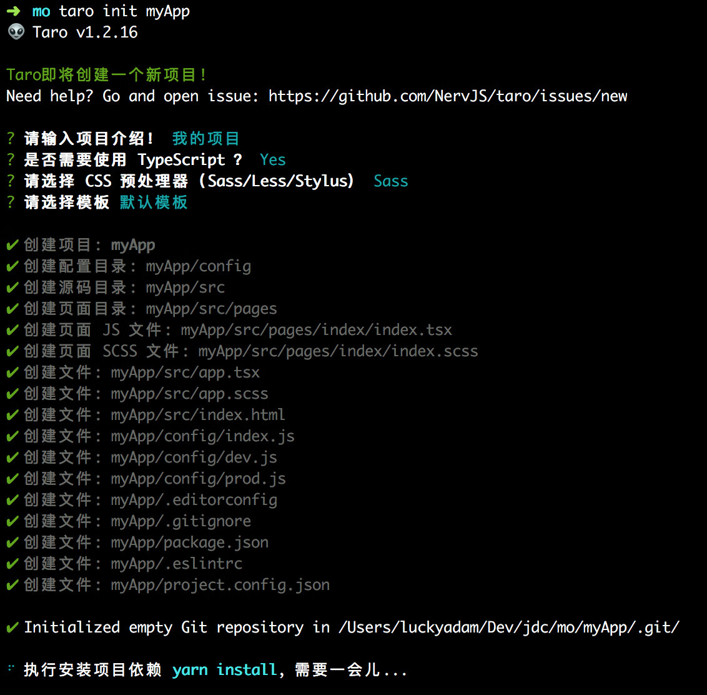

## Taro介绍
Taro 是一个开放式跨端跨框架解决方案，支持使用 React/Vue/Nerv 等框架来开发 微信 / 京东 / 百度 / 支付宝 / 字节跳动 / QQ / 飞书 小程序 / H5 / RN 等应用。

现如今市面上端的形态多种多样，Web、React Native、微信小程序等各种端大行其道。当业务要求同时在不同的端都要求有所表现的时候，针对不同的端去编写多套代码的成本显然非常高，这时候只编写一套代码就能够适配到多端的能力就显得极为需要。

目前官方支持转换的平台如下：
- H5
- React Native
- 微信小程序
- 京东小程序
- 百度智能小程序
- 支付宝小程序
- 抖音小程序
- QQ 小程序
- 钉钉小程序
- 企业微信小程序
- 支付宝 IOT 小程序
- 飞书小程序

支持的开发框架：
- React
- Vue
- Vue3
- Preact
- Svelte
- Nerv

vue为例子：
```vue
<template>
  <view class="index">
    <text>{{msg}}</text>
  </view>
</template>

<script>
  export default {
    data() {
      return {
        msg: 'Hello World！',
      }
    },
    created() {},
    onShow() {},
    onHide() {},
  }
</script>
```
一款基于 Taro 框架开发的多端 UI 组件库 Taro UI：
- 一套组件可以在多端适配运行（ReactNative 端暂不支持）
- 提供友好的 API，可灵活的使用组件

## 安装和使用
Taro 项目基于 node，请确保已具备较新的 node 环境（>=16.20.0），推荐使用 node 版本管理工具 nvm 来管理 node，这样不仅可以很方便地切换 node 版本，而且全局安装时候也不用加 sudo 了。

```bash
# 使用 pnpm 安装 CLI
pnpm install -g @tarojs/cli

#可以使用 npm info 查看 Taro 版本信息
npm info @tarojs/cli

#使用命令创建模板项目：
taro init myApp

# 进入项目根目录
cd myApp

# 使用 npm 安装依赖
npm install


#开发和编译：微信为例
# yarn
$ yarn dev:weapp
$ yarn build:weapp

# npm script
$ npm run dev:weapp
$ npm run build:weapp

# 仅限全局安装
$ taro build --type weapp --watch
$ taro build --type weapp

# npx 用户也可以使用
$ npx taro build --type weapp --watch
$ npx taro build --type weapp

# watch 同时开启压缩
$ set NODE_ENV=production && taro build --type weapp --watch # CMD
$ NODE_ENV=production taro build --type weapp --watch # Bash

#环境和依赖检测
taro info

#查看taro所有帮助和命令
taro --help
 
#诊断项目中存在的问题
taro docker

#快速创建页面
taro create <pageName>

# CLI配置：查看用法
$ taro config --help
# 设置配置项<key>的值为<value>
$ taro config set <key> <value>
# 读取配置项<key>
$ taro config get <key>
# 删除配置项<key>
$ taro config delete <key>
# 打印所有配置项
$ taro config list [--json]

#全局插件配置
# 查看用法
$ taro global-config --help
# 添加全局插件
$ taro global-config add-plugin [pluginName]
# 删除全局插件
$ taro global-config remove-plugin [pluginName]
# 添加全局插件集
$ taro global-config add-preset [presetName]
# 删除全局插件集
$ taro global-config remove-preset [presetName]
# 重置 .taro-global-config 文件夹
$ taro global-config reset
```

## 编译运行
使用 Taro 的 build 命令可以把 Taro 代码编译成不同端的代码，然后在对应的开发工具中查看效果。

Taro 编译分为 dev 和 build 模式：

- dev 模式（增加 --watch 参数） 将会监听文件修改。
- build 模式（去掉 --watch 参数） 将不会监听文件修改，并会对代码进行压缩打包。

dev 模式生成的文件较大，设置环境变量 NODE_ENV 为 production 可以开启压缩，方便预览，但编译速度会下降。
## 目录结构

```bash
├── dist                        编译结果目录
|
├── config                      项目编译配置目录
|   ├── index.js                默认配置
|   ├── dev.js                  开发环境配置
|   └── prod.js                 生产环境配置
|
├── src                         源码目录
|   ├── pages                   页面文件目录
|   |   └── index               index 页面目录
|   |       ├── index.js        index 页面逻辑
|   |       ├── index.css       index 页面样式
|   |       └── index.config.js index 页面配置
|   |
|   ├── app.js                  项目入口文件
|   ├── app.css                 项目总通用样式
|   └── app.config.js           项目入口配置
|
├── project.config.json         微信小程序项目配置 project.config.json
├── project.tt.json             抖音小程序项目配置 project.tt.json
├── project.swan.json           百度小程序项目配置 project.swan.json
├── project.qq.json             QQ 小程序项目配置 project.qq.json
|
├── babel.config.js             Babel 配置
├── tsconfig.json               TypeScript 配置
├── .eslintrc                   ESLint 配置
|
└── package.json
```