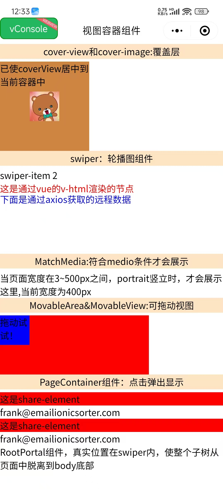

## 视图容器组件
- `CoverImage` 覆盖在原生组件之上的图片视图。可覆盖的原生组件同cover-view，支持嵌套在cover-view里。
- `CoverView` 覆盖在原生组件之上的文本视图。可覆盖的原生组件包括 map、video、canvas、camera、live-player、live-pusher 只支持嵌套 cover-view、cover-image，可在 cover-view 中使用 button。
- `CustomWrapper` custom-wrapper 自定义组件包裹器 当数据更新层级较深时，可用此组件将需要更新的区域包裹起来，这样更新层级将大大减少
- `MatchMedia` media query 匹配检测节点。可以指定一组 media query 规则，满足时，这个节点才会被展示。 通过这个节点可以实现“页面宽高在某个范围时才展示某个区域”这样的效果。
- `MovableArea` movable-view 的可移动区域
- `MovebleView` 可移动的视图容器，在页面中可以拖拽滑动。movable-view 必须在 movable-area 组件中，并且必须是直接子节点，否则不能移动。
- `NativeSlot` 编译的原生组件支持使用 slot 插槽
- `PageContainer` 页面容器

- `RootPortal` root-portal 使整个子树从页面中脱离出来，类似于在 CSS 中使用 fixed position 的效果。主要用于制作弹窗、弹出层等。
- `ScrollView` 可滚动视图区域。使用竖向滚动时，需要给scroll-view一个固定高度，通过 WXSS 设置 height。组件属性的长度单位默认为 px
- `Slot` slot 插槽
- `Swiper` 滑块视图容器。其中只可放置 swiper-item 组件，否则会导致未定义的行为。
- `SwiperItem` 仅可放置在 swiper 组件中，宽高自动设置为100%
- `View` 视图容器
```vue
<template>
  <view class="viewContainer">
      <view class="title">cover-view和cover-image:覆盖层</view>
      <cover-view
        :scrollY="true"
        :scrollWithAnimation="true"
        :scrollAnimationDuration="3000"
        @tap="play">
        <cover-image
          fixedTop="0"
          fixedLeft="20"
          src="@/assets/img/1.jpg"
          @tap="onImageTap" />
      </cover-view>
      <view class="title">swiper：轮播图组件</view>
      <swiper
        :autoplay="true"
        :interval="3000"
        indicator-color="red"
        indicatorActiveColor="blue"
        adjustHeight="highest"
        vertical
        circular
        indicatorDots
        @tap="handleTap">
        <swiper-item>
          <view>下面是RootPortal组件:穿越到root底部</view>
          <root-portal :enable="true">
            RootPortal组件，真实位置在swiper内，使整个子树从页面中脱离到body底部
          </root-portal>
        </swiper-item>
        <swiper-item>
          <view v-html="html"></view>
          <view class="text" v-for="item in list.value" :key="item.bar">
            <text>通过axios获取的远程数据:星级：{{ item.bar }}星</text>
          </view>
        </swiper-item>
      </swiper>
      <match-media
        orientation="portrait"
        style="width: 400px"
        min-width="3"
        max-width="500">
        MatchMedia:符合media条件才会展示.当页面宽度在3~500px之间，portrait竖立时，才会展示这里,当前宽度为400px
      </match-media>
      <view class="title">MovableArea&MovableView:可拖动视图</view>
      <movable-area
        :scale-area="true"
        style="height: 200rpx; width: 500rpx; background: red">
        <movable-view
          direction="all"
          :scale="true"
          :animation="true"
          :inertia="true"
          :out-of-bounds="true"
          style="height: 100rpx; width: 100rpx; background: blue"
          @change="moveViewChange"
          >拖动试试！
        </movable-view>
      </movable-area>
    <view class="item">
      <view class="title" @tap="pageShowToggle">
        PageContainer组件：点击弹出显示
      </view>
      <view
        class="share"
        v-for="(item, index) in contacts"
        :key="item.id"
        @tap="e => tabShare(e, index)">
        <share-element
          :duration="3000"
          :transform="currentIndex === index"
          mapkey="transform"
          style="background-color: red">
          这是share-element
        </share-element>
        <view>{{ item.email }}</view>
      </view>
      <page-container
        :show="pageShow"
        :duration="3000"
        :z-index="10"
        :overlay="true"
        position="center"
        :round="true"
        :closeOnSlideDown="false"
        @clickOverlay="clickOverlay">
        <share-element
          :duration="3000"
          transform
          mapkey="transform"
          style="background-color: red">
          这是share-element
        </share-element>
        小程序如果在页面内进行复杂的界面设计（如在页面内弹出半屏的弹窗、在页面内加载一个全屏的子页面等），
        用户进行返回操作会直接离开当前页面，不符合用户预期，预期应为关闭当前弹出的组件。
        为此提供“假页”容器组件，效果类似于popup弹出层，页面内存在该容器时，当用户进行返回操作，关闭该容器不关闭页面。
        返回操作包括三种情形，右滑手势、安卓物理返回键和调用navigateBack 接口。
      </page-container>
    </view>
  </view>
</template>

<script>
import { ref, reactive } from "vue";
import "./index.scss";
import { getName } from "@/api/api";
import Taro, { useReady } from "@tarojs/taro";
export default {
  setup() {
    const contacts = [
      {
        id: 1,
        name: "Frank",
        img: "frank.png",
        phone: "0101 123456",
        mobile: "0770 123456",
        email: "frank@emailionicsorter.com",
      },
      {
        id: 2,
        name: "Susan",
        img: "susan.png",
        phone: "0101 123456",
        mobile: "0770 123456",
        email: "frank@emailionicsorter.com",
      },
    ];
    const html = ref(`<h3 id="htmlId" style="color: red">这是通过vue的v-html渲染的节点</h3>`);
    let list = reactive({});
    let pageShow = ref(null);
    let currentIndex = ref(0);

    const play = function (e) {console.log("play", e)};
    const onImageTap = function (e) {console.log("onImageTap")};
    const moveViewChange = function (e) {console.log("moveViewChange", e)};
    const clickOverlay = function (e) {};
    const handleTap = function (e) {};
    const pageShowToggle = function (e) {
      pageShow.value = false;
      setTimeout(() => {
        pageShow.value = true;
      }, 3000);
    };
    const tabShare = (e, index) => {
      currentIndex.value = index;
      pageShowToggle();
    };
    useReady(() => {
      Taro.nextTick(() => {
        getName().then(value => {
          list.value = value.array;
          console.log("getName", list.value);
        });
      });
    });
    return {
      play,
      onImageTap,
      html,
      pageShow,
      list,
      currentIndex,
      contacts,
      moveViewChange,
      pageShowToggle,
      clickOverlay,
      tabShare,
      handleTap,
    };
  },
};
</script>
```
