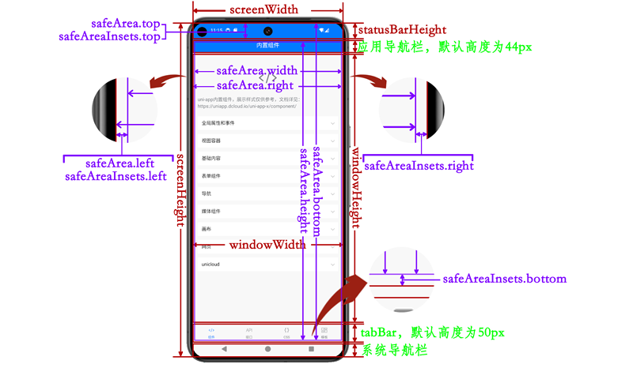

## 全局api
- getApp() 函数用于获取当前应用实例，可通过应用实例调用 App.uvue methods 中定义的方法
- getCurrentPages() 获取当前页面栈实例
  - getPageStyle()
  - setPageStyle()
  - getParentPage()
  - getDialogPages()
  - getElementById()
- requestAnimationFrame(callback)
- cancelAnimationFrame(taskId)
## 基础
- 条件渲染和环境变量
```js
<template>
  <!-- #ifdef APP -->
  <text>操作日志</text><button size="mini" @click="log=''">清空日志</button>
  <text style="margin: 2px; padding: 2px; border: 1px solid #000000;">{{ log }}</text>
  <scroll-view style="flex: 1;">
  <!-- #endif -->
    <!-- #ifdef APP -->
    <button class="btnstyle" type="primary" @tap="geAbsPath(sandboxPath)"
      id="btn-path">应用外置沙盒目录uni.env.SANDBOX_PATH</button>
    <button class="btnstyle" type="primary" @tap="geAbsPath(cachePath)" id="btn-path">缓存文件目录uni.env.CACHE_PATH</button>
    <button class="btnstyle" type="primary" @tap="geAbsPath(userPath)"
      id="btn-path">用户文件目录uni.env.USER_DATA_PATH</button>
    <button class="btnstyle" type="primary" @tap="geAbsPath(internalSandboxPath)"
      id="btn-path">应用内置沙盒目录uni.env.ANDROID_INTERNAL_SANDBOX_PATH</button>
    <!-- #endif -->
  <!-- #ifdef APP -->
  </scroll-view>
  <!-- #endif -->
</template>

<script>
  export default {
    data() {
      return {
        log: "",
        userPath: uni.env.USER_DATA_PATH,
        sandboxPath: uni.env.SANDBOX_PATH,
        cachePath: uni.env.CACHE_PATH,
        internalSandboxPath: uni.env.ANDROID_INTERNAL_SANDBOX_PATH,
      }
    },
    onLoad() {},
    methods: {
      geAbsPath(path ?: any) {
        // #ifdef APP-ANDROID
        this.log += UTSAndroid.convert2AbsFullPath(path as string) + '\n'
        // #endif
      }
    }
  }
</script>

<style>
  .btnstyle {
    margin: 4px;
  }
</style>
```
- 事件总线  
发布订阅模式
```js
// 绑定事件和事件监听器
uni.$on(eventName,callback)

// 卸载事件和监听器
uni.$off(eventName,callback)

// 只执行一次的事件监听器
uni.$once(eventName,callback)

// 派发事件监听器，并传递参数
uni.$emit(eventName,args?)

//将 Base64 字符串转成 ArrayBuffer 对象
uni.base64ToArrayBuffer(base64)

//将 ArrayBuffer 对象转成 Base64 字符串
uni.arrayBufferToBase64(arrayBuffer)

// 发起请求
uni.request(options)

// 添加拦截器
uni.addInterceptor(name,interceptor)

// 删除拦截器
uni.removeInterceptor(name,interceptor)

/**
 * 目前仅以下接口支持拦截器：navigateTo、redirectTo、reLaunch、switchTab、navigateBack、loadFontFace、pageScrollTo、startPullDownRefresh、setNavigationBarColor、setNavigationBarTitle、setTabBarBadge、removeTabBarBadge、setTabBarItem、setTabBarStyle、hideTabBar、showTabBar、showTabBarRedDot、hideTabBarRedDot
如需拦截request，可在插件市场搜索拦截器插件
 */

// 定义路由拦截器
const navigateToInterceptor = {
  invoke: function (options : NavigateToOptions) {
    console.log('拦截 navigateTo 接口传入参数为：', options)
    const url = './page2'
    uni.showToast({
      title: `重定向到页面:${url}`
    })
    options.url = url
  },
  success: function (res : NavigateToSuccess) {
    console.log('拦截 navigateTo 接口 success 返回参数为：', res)
  },
  fail: function (err : NavigateToFail) {
    console.log('拦截 navigateTo 接口 fail 返回参数为：', err)
  },
  complete: function (res : NavigateToComplete) {
    console.log('拦截 navigateTo 接口 complete 返回参数为：', res)
  }
} as AddInterceptorOptions
// 添加路由拦截器
addInterceptor() {
      uni.addInterceptor('navigateTo', navigateToInterceptor)
      uni.showToast({
        title: '页面跳转/切换tabbar已拦截'
      })
      this.msg = "，路由被劫持到测试页面2"
    },
    //移除路由拦截器
removeInterceptor() {
  uni.removeInterceptor('navigateTo', navigateToInterceptor)
  uni.showToast({
    title: '拦截器已移除'
  })
  this.msg = "会跳转到测试页面1"
},

//获取首次启动时的参数。返回值与App.onLaunch的回调参数一致{path,appScheme,appLink}
uni.getLaunchOptionsSync()

//获取本次启动时的参数。返回值与App.onShow的回调参数一致{path,appScheme,appLink}
uni.getEnterOptionsSync()

// 退出当前应用
uni.exit(options?)


// 获取服务提供商信息同一个功能的不同的SDK，都被称为该功能的 provider，即供应商。比如对于支付模块，有 支付宝 和 微信 这2个 provider 供应商
uni.getProviderSync()

//返回一个Performance对象实例
uni.getPerformance()

//获取用户是否同意了隐私协议
uni.getPrivacySetting()

//重置隐私协议状态。适用于隐私协议变更，需要重新同意的场景
uni.resetPrivacyAuthorization()

// 监听和取消监听用户是否同意隐私协议
uni.onPrivacyAuthorizationChange()
uni.offPrivacyAuthorizationChange()
```
## 页面和路由
```js
/** 保留当前页面，跳转到应用内的某个页面
 * url
 * animationType 窗口显示的动画类型
 * events 页面间通信接口，用于监听被打开页面发送到当前页面的数据
 * success
 * fial
 * complete
 */
uni.navigateTo(options)

// 关闭当前页面，跳转到应用内的某个页面
uni.redirectTo(options)

// 关闭所有页面，打开到应用内的某个页面
uni.reLaunch(options)

//跳转到 tabBar 页面，并关闭其他所有非 tabBar 页面
uni.switchTab(options)

//关闭当前页面，返回上一页面或多级页面
uni.navigateBack(options?)

/** 打开模态弹窗页面
 * url
 * animationType
 * animationDuration
 * disableEscBack
 * parentPage
 * success
 * fail
 * complete
 * @return 当前模态框实例
 */
uni.openDialogPage(options)

uni.setNavigationBarColor({frontColor,backgroundColor})

uni.setNavigationBarTitle({title})

uni.showTabBar({animation}?)

uni.hideTabBar({animation}?)

//显示 tabBar 某一项的右上角的红点
uni.showTabBarRedDot({index})

//隐藏 tabBar 某一项的右上角的红点
uni.hideTabBarRedDot({index})

// 为 tabBar 某一项的右上角添加文本
uni.setTabBarBadge({index,text})

//移除 tabBar 某一项右上角的文本
uni.removeTabBarBadge({index})

//动态设置 tabBar 的整体样式
uni.setTabBarStyle({
  color,
  selectedColor,
  backgroundColor,
  backgroundImage,
  backgroundRepeat,
  borderStyle
  })

//动态设置 tabBar 某一项的内容
uni.setTabBarItem({
  index,
  text,
  iconPath,
  selectedIconPath,
  pagePath,
  iconfont,
  visible
  })

//开始下拉刷新
uni.startPullDownRefresh(options?)
uni.stopPullDownRefresh()

uni.pageScrollTo({scrollTop,offsetTop,selector,duration})

// 监听中间按钮的点击事件
uni.onTabBarMidButtonTap(options)

// 返回一个SelectorQuery对象实例。createSelectorQuery是小程序的API，因小程序未开放DOM，且视图层和逻辑层分离，于是提供了一个异步的API，可以在逻辑层有限的获取一些DOM能力。
uni.createSelectorQuery(selector)
```
## 界面
```js
//创建并返回一个 IntersectionObserver 对象实例
uni.createIntersectionObserver(component, options)

// 从底部向上弹出操作菜单
uni.showActionSheet({title,alertText,itemList,itemColor,popover})

// 显示模态弹窗，可以只有一个确定按钮，也可以同时有确定和取消按钮。类似于一个API整合了 html 中：alert、confirm
uni.showModal({title,content,showCancel,cancelText,cancelColor,confirmText,confirmColor,editable,placeholderText})

//显示 loading 提示框, 需主动调用 uni.hideLoading 才能关闭提示框
uni.showLoading({title,mask})
uni.hideLoading()

//显示消息提示框
uni.showToast({title,icon,image,mask,duration,position})
uni.hideToast()

//动态加载网络字体
uni.loadFontFace(options)

//将rpx单位值转换成px
uni.rpx2px(number)

//设置应用主题.根据theme.json，设置pages.json的亮/暗主题,触发uni.onAppThemeChange，开发者和组件作者均可监听这个事件，自行响应将页面设置为对应的亮/暗风格
uni.setAppTheme({theme:light|dark|auto})

uni.getLocale() // 获取当前设置的语言

uni.setLocale(locale) // 设置当前语言

//开启监听应用主题变化
uni.onAppThemeChange(callback)

//开启监听系统主题变化
uni.onOsThemeChange(callback)

// 监听语言改变事件
uni.onLocaleChange(callback) 
```
## 网络
```js
let task = uni.request({
  url,
  method,
  data,
  header,
  timeout,
  withCredentials,
  firstIpv4
  })

task.abort() // 中断网络请求

//将本地资源上传到开发者服务器
let task = uni.uploadFile({
  url,
  name,
  filePath,
  files,
  header,
  formData,
  timeout
  })

task.onProgressUpdate(callback)

task.abort()

//下载文件资源到本地，客户端直接发起一个 HTTP GET 请求，返回文件的本地临时路径
let task = uni.downloadFile({url,header,filePath,timeout})
task.onProgressUpdate(callback)
task.abort()

// 获取网络类型
uni.getNetworkType(options)

//创建一个 WebSocket 连接
let socket = uni.connectSocket({url,header,protocols})

socket.onOpen(callback)
socket.onClose(callback)
socket.onEror(callback)
socket.onMessage(callback)

//通过 WebSocket 连接发送数据
socket.send({data})

//关闭 WebSocket 连接
socket.close({code,reason})

//监听WebSocket连接打开事件
uni.onSocketOpen(options)
```
## 设备

```js
// 获取系统信息
uni.getSystemInfo(options)

// 获取设备信息
uni.getDeviceInfo(options?)

// 获取窗口信息
uni.getWindowInfo()

// 获取APP基础信息
uni.getAppBaseInfo(options?)

// 获取APP授权设置
uni.getAppAuthorizeSetting()

// 获取系统设置
uni.getSystemSetting()

// 获取电池电量信息
uni.getBatteryInfo(options)

// 安装APK。安装Apk最常见的场景是App的升级，更推荐使用uni的App升级中心
uni.installApk(options)

// 打电话
uni.makePhoneCall({phoneNumber})

// 剪切板
uni.getClipboardData(options)
uni.setClipboardData({data,showToast})

// wifi,初始化Wi-Fi模块
uni.startWifi(option)
// 关闭 Wi-Fi 模块
uni.stopWifi(option)

// 截屏事件.开启截屏监听
uni.onUserCaptureScreen(callback?)
uni.offUserCaptureScreen(callback?)
// 设置防截屏
uni.setUserCaptureScreen({enable})

// 内存,开启监听内存警告
uni.onMemoryWarning(UTSCallback)
//取消监听内存不足告警事件
uni.offMemoryWarning(callback?)

// 监听权限申请.创建一个监听权限申请的对象
let listener = uni.createRequestPermissionListener()
//监听申请系统权限
listener.onRequest(callback)
//监听弹出系统权限授权框
listener.onConfirm(callback)
// 监听权限申请完成
listener.onComplete(callback)
//取消所有监听
listener.stop()

// 扫码
uni.scanCode({onlyFromCamera,scanType}?)
```

## 媒体

```js
// 从本地相册选择图片或使用相机拍照
uni.chooseImage({
  pageOrientation,
  albumMode,
  count,
  sizeType,
  sourceType,
  extension,
  crop
  })

//预览图片
uni.previewImage({
  current,
  url,
  showmenu,
  indicator:'default'|'number'|'none',
  loop:false,
})

//保存图片到系统相册
uni.saveImageToPhotosAlbum({filePath})

// 获取图片信息
uni.getImageInfo({src})

// 压缩图片
uni.compressImage({
  src,
  quality,
  rotate,
  compressedHeight,
  compressedWidth,
})

//拍摄视频或从手机相册中选视频，返回视频的临时文件路径
uni.chooseVideo({
  pageOrientation,
  albumMode,
  sourceType,
  compressed,
  maxDuration,
  camera,
  extension
})

//保存视频到系统相册
uni.saveVideoToPhotosAlbum({filePath})

//获取视频详细信息
uni.getVideoInfo({src})

//压缩视频
uni.compressVideo({
  src,
  bitrate,
  quality,
  fps,
  resolution
})

//音频：使用完后，必须调用destory方法将资源进行释放
let innerAudioContext = uni.createInnerAudioContext()
innerAudioContext.puase()
innerAudioContext.stop()
innerAudioContext.play()
innerAudioContext.seek(position:number)
innerAudioContext.destroy()
innerAudioContext.onCanplay(callback)
```
## 画布

```js
//把当前画布指定区域的内容导出生成指定大小的图片
uni.canvasToTempFilePath({
  x,y,width,height,
  destWidth,destHeight,
  canvasId,
  fileType,
  quality,
}, componentInstance)

//异步获取页面上指定id的canvas组件的上下文对象CanvasContext。
let canvas = uni.createCanvasContextAsync({id,component})
let context= canvas.getContext(type:'2d')
context.toBlob(callback, type?: string, quality?: number): void
context.toDataURL(): string
context.createImage(): Image

//canvas元素的绘图2D渲染上下文, 它用于绘制形状、文本、图像和其他对象
uni.CanvasRenderingContext2D
```
## 位置

```js
//获取当前的地理位置、速度
uni.getLocation({
  provider,
  type,
  altitude,
  geocode,
  highAccuracyExpireTime,
  isHighAccuracy
})

//使用地图查看位置
uni.openLocation({
  latitude,
  longitude,
  scale,
  name,
  address
})

//调用本API会打开一个新窗体，在地图中选择一个位置，在success回调中返回选择的位置名称和坐标.本功能依赖地图组件。App和Web需在manifest.json中正确配置地图模块以及相关的key信息。依赖三方地图SDK
uni.chooseLocation({
  latitude,
  longitude,
  keyword,
  payload
})
```
## 数据储存
app、小程序、web，均提供了方便的key-value模式的本地数据存储，通过键值对的方式存取数据。

uni-app的Storage在不同端的实现不同：

H5端为localStorage，浏览器限制5M大小，是缓存概念，可能会被清理
App端为原生storage，无大小限制，不是缓存，是持久化的
各个小程序端为其自带的storage api，数据存储生命周期跟小程序本身一致，即除用户主动删除或超过一定时间被自动清理，否则数据都一直可用
```js
uni.setStorage({key,data})
uni.setStorageSync(key, data)

uni.getStorage({key})
uni.getStorageSync(key)

//异步获取当前 storage 的相关信息。
uni.getStorageInfo(options)
uni.getStorageInfoSync()

uni.removeStorage({key})
uni.removeStorageSync(key)

uni.clearStorage(option?)
uni.clearStorageSync()
```
## 文件系统

```js
// 获取文件管理器
let fileSystemManager = uni.getFileSystemManager()

fileSystemManager.readFile({
  encoding:'base64'|'utf-8',
  filePath
})
fileSystemManager.readFileSync(filePath : string, encoding ?: string) : any;

fileSystemManager.writeFile({
  encoding:'base64'|'utf-8'|'ascii',
  filePath,
  data
})
fileSystemManager.writeFileSync(filePath : string, data : any, encoding ?: string) : void;

// 读文件
fileSystemManager.read({
  arrayBuffer,
  fd,
  length,
  offset,
  position
})
// 同步读文件
fileSystemManager.readSync(option : ReadSyncOption) : ReadResult;

// 删除文件
fileSystemManager.unlink({
  filePath
})
// 同步删除文件
fileSystemManager.unlinkSync(filePath : string) : void;

// 创建目录
fileSystemManager.mkdir({
  dirPath,
  recursive
})
// 同步删除文件
fileSystemManager.mkdirSync(dirPath : string, recursive : boolean) : void;

// 读取目录内文件列表
fileSystemManager.readdir({
  dirPath,
})
// 读取目录内文件列表
fileSystemManager.readdirSync(dirPath : string) : string[] | null;

// 删除目录
fileSystemManager.rmdir({
  dirPath,
  recursive
})
// 同步删除文件
fileSystemManager.rmdirSync(dirPath : string, recursive : boolean) : void;

// 判断文件是否存在
fileSystemManager.access(options : AccessOptions) : void;

// 判断文件是否存在
fileSystemManager.accessSync(path : string) : void;

// 重名命文件
fileSystemManager.rename(options : {
  oldPath,newPath
}) : void;

// 重名命文件
fileSystemManager.renameSync(oldPath : string, newPath : string) : void;

// 复制文件
fileSystemManager.copyFile(options : {srcPath,destPath}) : void;

// 复制文件
fileSystemManager.copyFileSync(srcPath : string, destPath : string) : void;

// 获取该本地临时文件 或 本地缓存文件 信息
fileSystemManager.getFileInfo(options : {filePath,digestAlgorithm}) : void;

// 获取文件 Stats 对象
fileSystemManager.stat(options : {path,recursive}) : void;

// 获取文件 Stats 对象
fileSystemManager.statSync(path : string, recursive : boolean) : FileStats[];

// 在文件结尾追加内容
fileSystemManager.appendFile(options : {filePath,encoding,data}) : void;

// 在文件结尾追加内容
fileSystemManager.appendFileSync(filePath : string, data : any, encoding ?: string) : void;
```
## 登录与认证
App一键登陆，封装了个推的一键登陆sdk，其内部再次封装了中国三大电信运营商提供的sdk。通过运营商提供的服务，可以在手机sim卡信号正常的情况下，通过云端接口获取到当前用户的手机号。

使用一键登陆可以点一下直接以当前手机号登录。不再需要短信验证码，而且费用比短信验证码便宜。

App一键登陆的优势：

对比短信验证码登录
- 对开发者而言每条短信费用更贵、短信模板审核慢、短信发送成功可能几十秒；
- 对用户而言，输入手机号耗时、等待耗时、输入验证码耗时，等待体验差。  

对比微信登录
- 中国法律要求开发者了解客户的真实信息。与其微信登录后再次要求用户输入短信验证码，不如直接一键登陆。
- 在iOS上，一旦使用微信登录，就必须同时加入Apple登录。Apple登录的用户无法再次有效触达，只能再次要求用户输入短信验证码绑定手机号，体验非常差。不如直接一键登陆。使用一键登陆时Appstore不会要求必须同时使用Apple登录。
```js
// 获取一键登录管理对象
let manager = uni.getUniverifyManager()

// 预登录
manager.preLogin(options : PreLoginOptions) : void

// 登录
manager.login(options : {
  scopes:'auth_base'|'auth_user'|'auth_zhima',
  timeout,
  univerifyStyle:{
    fullScreen,
    backgroundColor,
    backgroundImage,
    icon:{path,width,height},
    phoneNum:{color,fontSize},
    slogan:{color,fontSize},
    authButton:{width,height,textColor,title,borderRadius},
    privacyTerms:{textColor,termsColor,prefix,suffix,fontSize},
    privacyItems:{url,title},
    buttons:{iconWidth,list:[{provider,iconPath}]},
  },
  onlyAuthorize:false
}) : void

// 关闭登录页
manager.close() : void

// 预登录是否有效
manager.isPreLoginValid() : boolean
```
## 支付
uni.requestPayment是一个统一各平台的客户端支付API，客户端均使用本API调用支付。

本API运行在各端时，会自动转换为各端的原生支付调用API。

注意支付不仅仅需要客户端的开发，还需要服务端开发。虽然客户端API统一了，但各平台的支付申请开通、配置回填仍然需要看各个平台本身的支付文档。

比如微信有App支付的申请入口和使用流程，对应到uni-app，在App端要申请微信的App支付。

如果服务端使用uniCloud，那么官方提供了uniPay云端统一支付服务，把App、微信小程序、支付宝小程序里的服务端支付开发进行了统一的封装。

前端统一的uni.requestPayment和云端统一的uniPay搭配，可以极大提升支付业务的开发效率
```js
uni.requestPayment({
  provider,
  orderInfo
})

//微信支付 App 支付请求参数字符串
{
 "appid":"wxd569c7238830733b",
 "noncestr":"6N47VnR42bqIm4xq",
 "package":"Sign=WXPay",
 "partnerid":"1230636401",
 "prepayid":"wx26174750316675ac54b89c224eb3250000",
 "timestamp":1711446470,
 "sign":"EE987459B9CFF6462462147130110D31"
}

<template>
  <page-head title="发起支付"></page-head>
  <template v-if="providerList.length > 0">
    <button style="margin-top: 20px;" type="primary" v-for="(item,index) in providerList" :key="index"
      @click="requestPayment(item)">{{item.name}}</button>
  </template>
</template>

<script>
  export type PayItem = { id : string, name : string, provider ?: UniProvider }
  export default {
    data() {
      return {
        btnText: "支付宝支付",
        btnType: "primary",
        orderInfo: "",
        errorCode: 0,
        errorMsg: "",
        complete: false,
        providerList: [] as PayItem[]
      }
    },
    onLoad: function () {
      let provider = uni.getProviderSync({
        service: "payment",
      } as GetProviderSyncOptions)
      console.log(provider)
      provider.providerObjects.forEach((value : UniProvider) => {
        switch (value.id) {
          case 'alipay':
            var aliPayProvider = value as UniPaymentAlipayProvider
            console.log('alipay', aliPayProvider)
            this.providerList.push({
              name: aliPayProvider.description,
              id: aliPayProvider.id,
              provider: aliPayProvider
            } as PayItem);
            break;
          case 'wxpay':
            var wxPayProvider = value as UniPaymentWxpayProvider
            console.log('wxpay', wxPayProvider)
            this.providerList.push({
              name: wxPayProvider.description,
              id: wxPayProvider.id,
              provider: wxPayProvider
            } as PayItem);
            break;
          default:
            break;
        }
      })
    },
    methods: {
      requestPayment(e : PayItem) {
        const provider = e.id
        if (provider == "alipay") {
          this.payAli(provider)
        } else if (provider == "wxpay") {
          // #ifdef APP-ANDROID
          if (e.provider != null && e.provider instanceof UniPaymentWxpayProvider && !((e.provider as UniPaymentWxpayProvider).isWeChatInstalled)) {
            uni.showToast({
              title: "微信没有安装",
              icon: 'error'
            })
          } else {
            this.payWX(provider)
          }
          // #endif
          // #ifdef APP-IOS
          if (e.provider != null && ((e.provider as UniPaymentWxpayProvider).isWeChatInstalled == undefined || ((e.provider as UniPaymentWxpayProvider).isWeChatInstalled != null && (e.provider as UniPaymentWxpayProvider).isWeChatInstalled == false))) {
            uni.showToast({
              title: "微信没有安装",
              icon: 'error'
            })
          } else {
            this.payWX(provider)
          }
          // #endif
        }
      },
      payAli(id:string) {
        uni.showLoading({
          title: "请求中..."
        })
        uni.request({
          url: 'https://demo.dcloud.net.cn/payment/alipay/?total=0.01',
          method: 'GET',
          timeout: 6000,
          success: (res) => {
            this.orderInfo = JSON.stringify(res.data);
            console.log("====" + this.orderInfo)
            uni.hideLoading()
            uni.requestPayment({
              provider: id,
              orderInfo: res.data as string,
              fail: (res) => {
                console.log(JSON.stringify(res))
                this.errorCode = res.errCode
                uni.showToast({
                  icon: 'error',
                  title: 'errorCode:' + this.errorCode
                });
              },
              success: (res) => {
                console.log(JSON.stringify(res))
                uni.showToast({
                  icon: 'success',
                  title: '支付成功'
                });
              }
            })
          },
          fail: (e) => {
            console.log(e)
            uni.hideLoading()
          },
        });
      },
      payWX(id:string) {
        uni.showLoading({
          title: "请求中..."
        })
        let url = 'https://demo.dcloud.net.cn/payment/wxpayv3.__UNI__uniappx/?total=0.01'
        const res = uni.getAppBaseInfo();
        let packageName : string | null

        // #ifdef APP-ANDROID
        packageName = res.packageName
        // #endif

        // #ifdef APP-IOS
        packageName = res.bundleId
        // #endif

        if (packageName == 'io.dcloud.hellouniappx') {//hello uniappx
          url = 'https://demo.dcloud.net.cn/payment/wxpayv3.__UNI__HelloUniAppX/?total=0.01'
        }
        uni.request({
          url: url,
          method: 'GET',
          timeout: 6000,
          header: {
            "Content-Type": "application/json"
          } as UTSJSONObject,
          success: (res) => {
            console.log(res.data)
            uni.hideLoading()
            uni.requestPayment({
              provider: id,
              orderInfo: JSON.stringify(res.data),
              fail: (res) => {
                console.log(JSON.stringify(res))
                this.errorCode = res.errCode
                uni.showToast({
                  duration: 5000,
                  icon: 'error',
                  title: 'errorCode:' + this.errorCode,
                });
              },
              success: (res) => {
                console.log(JSON.stringify(res))
                uni.showToast({
                  duration: 5000,
                  icon: 'success',
                  title: '支付成功'
                });
              }
            })
          },
          fail: (res) => {
            uni.hideLoading()
          },
        });
      },

      //自动化测试使用
      jest_pay() {
        uni.requestPayment({
          provider: "alipay",
          orderInfo: this.orderInfo,
          fail: (res : RequestPaymentFail) => {
            this.errorCode = res.errCode
            this.complete = true
          },
          success: (res : RequestPaymentSuccess) => {
            console.log(JSON.stringify(res))
            this.complete = true
          }
        } as RequestPaymentOptions)
      }
    }
  }
</script>
```
## 分享

```js
//使用系统分享。仅支持本地路径
uni.shareWithSystem({
  type:'text'|'image'|'video'|'audio'|'file',
  summary:'分享的文字内容',
  href, // 分享连接
  imageUrl, // 分享单个图片
  imagePaths,
  videoPaths,
  audioPaths,
  filePaths,
})

const path1 : string = "/static/test-audio/ForElise.mp3";
const path2 : string = "/static/test-audio/ForElise.mp3";

uni.shareWithSystem({
  audioPaths: [path1, path2],
  type:'audio',
  success(res) {
    console.log('Shared-----success')
  },
  fail(res) {
    uni.showToast({
      icon: "error",
      title: "errorCode=" + res.errCode,
      content:res.errMsg
    })
  },
  complete(res) {}
})
```
## 推送
uni-push是DCloud与合作伙伴个推共同推出的统一推送服务。用于从服务器端推送消息到客户端。

它包括在线推送、离线推送，聚合了Apple、华为、小米、OPPO、VIVO、魅族、荣耀(3.99+)、Google等多个手机厂商的推送通道。

若不使用服务器推送，仅想创建手机通知栏本地消息，也需要使用本模块的API。
```js
//获取客户端唯一的推送标识
uni.getPushClientId(options)

//启动监听推送消息事件
uni.onPushMessage(callback)

//关闭推送消息监听事件，iOS端调用会关闭所有监听
uni.offPushMessage(callback)

//创建本地通知栏消息
uni.createPushMessage({
  cover,
  delay,
  icon,
  sound,
  title,
  content,
  payload,//消息承载的数据，可根据业务逻辑自定义数据格式，在点击通知消息时onPushMessage回调中会返回此字段的数据
  when,
  channelId,//渠道id，Android特有字段，创建通知渠道请使用getPushChannelManager获取PushChannelManager对象，调用setPushChannel方法配置渠道。
  category //通知类别，Android特有字段
})

//获取通知渠道管理器，Android 8系统以上才可以设置通知渠道
let manager = uni.getPushChannelManager()

//设置推送渠道
manager.setPushChannel({
  soundName, //添加的声音文件
  channelId,
  channelDesc,
  enableLights,//呼吸灯闪烁
  enableVibration,//是否震动
  impotance,//通知的重要性级别 2、3、4
  lockscreenVisibility //锁屏可见性
})

//获取当前应用注册的所有的通知渠道
manager.getAllChannels(): Array<string>;

//设置应用图标上显示的角标数字
uni.setAppBadgeNumber(num, {title,content}?)
```
## 统计

```js
//uni统计自定义上报方法。需下载插件：uni-stat
uni.report({
  name, // 自定义事件名
  options, // 额外参数
})

// 参数支持对象
uni.report({
  name:'购买',
  options:{
  id:'1000',
  name:'上衣',
  price:'998',
  msg:'购买成功'
  }
})
```
## 组件上下文对象

```js
//创建 web-view 组件的上下文对象，用于操作 web-view 的行为。
let context = uni.createWebviewContext(webviewId, component?)

//获取id为wx1的web-view组件的context
let context = uni.createWebviewContext("wv1", this) 

//也可以直接使用DOM API操作。UniWebViewElement比webviewContext有更多属性和方法
let context = uni.getElementById("wv1") as UniWebViewElement

//后退到 web-view 组件网页加载历史的上一页
context.back()

context.forward()

context.reload()
//停止加载 web-view 组件当前网页，该方法不能阻止已经加载的 html 文档，但是能够阻止未完成的图片及延迟加载的资源
context.stop()

// 在网页中执行指定的js脚本，在 uvue 页面中可通过此方法向 web-view 组件加载的页面发送数据
context.evalJS('alert("nihoa")')

//创建并返回 video 上下文 videoContext 对象
let video = uni.createVideoContext(videoId, component?)

video.play()
video.pause()
video.seek(position:number) //跳转到指定位置

video.stop()
//设置倍速播放
video.playbackRate(rate : number) : void;
// 进入全屏
video.requestFullScreen(direction ?: RequestFullScreenOptions | null) : void;
// 退出全屏
video.exitFullScreen() : void;

video.sendDanmu({text,color,time}) //发送弹幕

//创建并返回 map 上下文 mapContext 对象
let map  = uni.createMapContext({mapId,component})

//获取当前地图中心的经纬度，返回的是 gcj02 坐标系，可以用于 uni.openLocation
map.getCenterLocation(options : MapContextGetCenterLocationOptions) : void;

//将地图中心移动到当前定位点，需要配合map组件的show-location使用
map.moveToLocation(options : MapContextMoveToLocationOptions) : void;

//平移marker，带动画
map.translateMarker(options : MapContextTranslateMarkerOptions) : void;

//缩放视野展示所有经纬度
map.includePoints(options : MapContextIncludePointsOptions) : void;

//添加 marker
map.addMarkers(options : MapContextAddMarkersOptions) : void;
```
## uniCloud
uniCloud是基于serverless的云开发服务，它大幅降低开发者的开发成本和运维成本。

```js
type UniCloudInitOptions = {
  provider, //服务商，目前支持 aliyun、tencent、alipay
  spaceName, //服务空间名
  spaceId, //服务空间id
  clientSecret, //阿里云clientSecret
  endpoint, //阿里云endpoint
  spaceAddId, //支付宝云spaceAppId
  accessKey,//支付宝云accessKey
  secretKey,//支付宝云secretKey
  wsEndpoint//支付宝云 WebSocket Endpoint
}

// 云函数fn代码
'use strict';
exports.main = async (event, context) => {
  return {
    errCode: 0,
    errMsg: '',
    detail: 'call function detail'
  };
};

// 客户端代码
type CallFunctionResult = {
  errCode : number,
  errMsg : string,
  detail : string
}
uniCloud.callFunction<CallFunctionResult>(
  {
    name: 'fn',
    data: { a: 1 } as UTSJSONObject,
  } as UniCloudCallFunctionOptions
).then(function (res) {
  const result = res.result // result的类型为CallFunctionResult
  const detail = result.detail // 可直接使用.detail访问
  console.log(detail)
}).catch(function (err : any | null) {
  console.error(err)
})
  
//引用云对象：语法
let cloudObject = importObject(objectName, {
  customUI:false, //是否移除自动展示的ui
  loadingOptions:{title,mask},
  errorOptions:{type:'toast'|'modal',retry:true}
}?)
  
// 云对象todo代码
'use strict';
module.exports = {
  async add(title, content) {
    return {
      errCode: 0,
      errMsg: '',
      detail: `Todo added, title: ${title}, content: ${content}`
    }
  },
}


// 客户端代码
type CallObjectResult = {
  errCode : number
  errMsg : string
  detail : string
}
const todo = uniCloud.importObject('todo')
todo.add<CallObjectResult>('todo title', 'todo content').then((res) => {
  // res类型为CallObjectResult，可直接通过.detail访问其中detail属性
  const detail = res.detail 
}).catch((err : any | null) => {
  console.error(err)
})

// 是客户端访问云数据库的API，即clientDB
let database = uniCloud.databaseForJQL()

let collection = database.collection(...args: Array<any>): Collection

collection.where(condition: any): UniCloudDBFilter;
collection.doc(docId: string): UniCloudDBFilter

let query = collection.field(filed: string): UniCloudDBQuery
query.get(arg?: UTSJSONObject | null): Promise<UniCloudDBGetResult>;
query.count(): Promise<UniCloudDBCountResult>
query.get(arg?: UTSJSONObject | null): Promise<UniCloudDBGetResult>;
query.getTemp(): UTSJSONObject
query.field(filed: string): UniCloudDBQuery
query.skip(num: number): UniCloudDBQuery;
query.limit(num: number): UniCloudDBQuery
query.orderBy(order: string): UniCloudDBQuery;
query.groupBy(field: string): UniCloudDBQuery
query.groupField(field: string): UniCloudDBQuery
query.distinct(field: string): UniCloudDBQuery;
query.geoNear(options: UTSJSONObject): UniCloudDBQuery
query.doc(docId: string): UniCloudDBFilter
query.aggregate(): UniCloudDBFilter
query.foreignKey(foreignKey: string): UniCloudDBFilter
query.add(data: UTSJSONObject): Promise<UniCloudDBAddResult>
query.get(arg?: UTSJSONObject | null): Promise<UniCloudDBGetResult>
query.count(): Promise<UniCloudDBCountResult>
```
