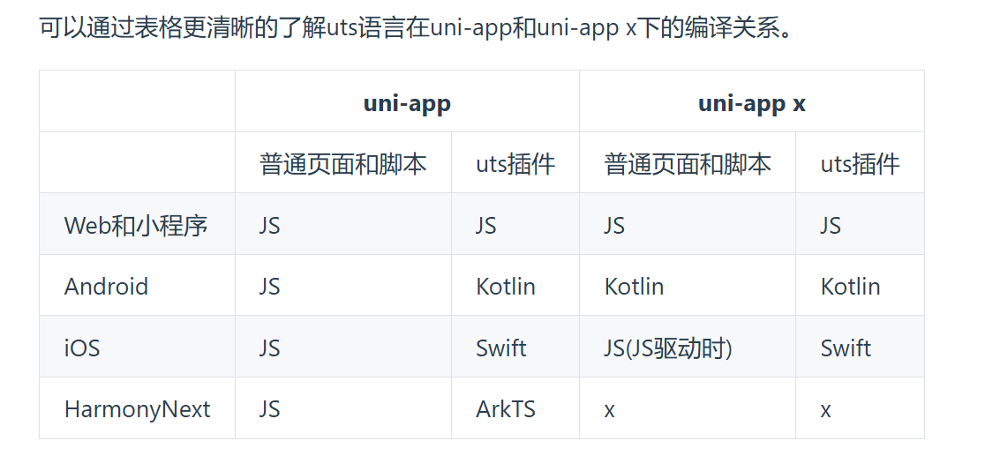
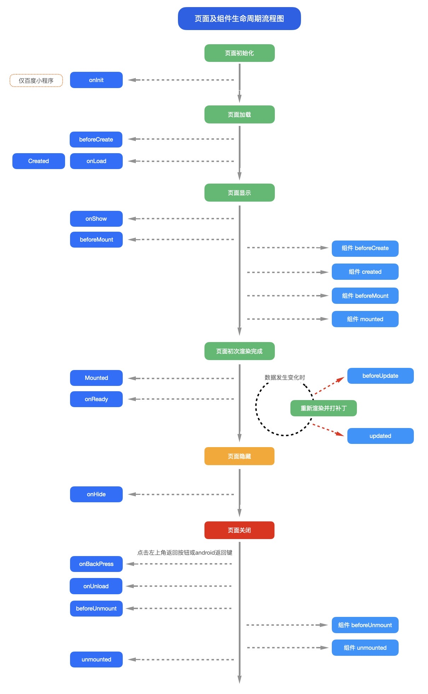

## uni-app简介
uni-app 是一个使用 Vue.js 开发所有前端应用的框架，开发者编写一套代码，可发布到iOS、Android、Web（响应式）、以及各种小程序（微信/支付宝/百度/头条/飞书/QQ/快手/钉钉/淘宝）、快应用等多个平台。

## uni-app x简介
uni-app x，是下一代 uni-app，是一个跨平台应用开发引擎。

uni-app x 是一个庞大的工程，它包括uts语言、uvue渲染引擎、uni的组件和API、以及扩展机制。

uts是一门类ts的、跨平台的、新语言。

uts在iOS平台编译为swift、在Android平台编译为kotlin、在Web和小程序平台编译为js、在鸿蒙next平台上编译为ArkTS。

在Android平台，uni-app x 的工程被整体编译为kotlin代码，本质上是换了vue写法的原生kotlin应用，在性能上与原生kotlin一致。
## uts语言
开发者在 uni-app x 中，需使用 uts 而不是js。尤其是 Android端不自带js引擎，无法运行js代码。

uts 全称 uni type script，是一门跨平台的、高性能的、强类型的现代编程语言。它在不同平台，会被编译为不同平台的native语言，如：

- web/小程序平台，编译为JavaScript
- Android平台，编译为Kotlin
- iOS平台，编译Swift
- 鸿蒙next平台，编译为arkts

`uts 采用了与 ts 基本一致的语法规范，支持绝大部分 ES6 API。`但为了跨端，uts进行了一些约束和特定平台的增补。过去在js引擎下运行支持的语法，大部分在uts的处理下也可以平滑的在kotlin和swift中使用。但有一些无法抹平，需要使用条件编译。

和uni-app的条件编译类似，uts也支持条件编译。写在条件编译里的，可以调用平台特有的扩展语法

uts不支持js的一些功能和特性
- 不支持undefined。任何变量被定义后，都需要赋值
- 函数声明方式不支持作为值传递
- 函数表达式方式不支持默认参数
- 不存在（变量、函数等）声明提升，需要先声明，后使用，不可以访问未声
- 所有 vue 公开的 API 都是不需要 import 的, uni-app x 会自动引入。明的变量或函数（包括自身


UTS 的类型有：

- 基础类型：boolean、number、string、any、null，都是小写。前3个typeof返回类型名称，null的typeof是object，any的typeof是运行时值的类型。
- 对象类型：Date、Array、Map、Set、UTSJSONObject，首字母大写。typeof返回"object"，判断准确类型需使用 instanceof
- 使用 type 来自定义类型
- 特殊类型：function、class、error。
- 平台专有类型：BigInt、Int、Float、Double、NSString、kotlin.Array...

除了特殊类型，其他类型都可以在变量后面通过:加类型名称来给这个变量声明类型。
## uvue渲染引擎
uts替代的是js，而uvue替代的就是html和css。或者如果你了解flutter的话，也可以理解为uts类似dart，而uvue类似flutter。

uvue是一套基于uts的、兼容vue语法的、跨平台的、原生渲染引擎。uvue支持的是vue3语法，支持组合式API和选项式API。

- Android版于3.99上线
- Web版于4.0上线
- iOS版于4.11上线
- uvue渲染引擎包括uts版的vue框架（组件、数据绑定...）、跨平台基础ui、css引擎。

有了uvue，开发者就可以使用vue语法、css来快速编写页面，编译为不同平台的、高性能的纯原生界面。`页面与组件均符合vue的单文件组件规范，只不过页面需要在pages.json中注册且多了一批生命周期和API。`
```js
<template>
	<view class="content">
		<button @click="buttonClick">{{title}}</button>
	</view>
</template>

//lang lang 仅支持uts，不管script的lang属性写成什么，都按uts编译。注意在iOS的js引擎驱动的uvue页面里，uts会被编译为js。
// setup setup属性声明代表script里的代码为组合式写法，如果没有setup属性则为选项式写法
<script setup>
  let title = ref("Hello world") //定义一个响应式变量。类似于选项式的定义data
	const buttonClick = () => { //方法不再需要写在method下面
	  console.log("按钮被点了")
	}
  let instance = getCurrentPages() //获取当前页面实例
  let app = getApp() //获取当前uniapp实例
	onReady(() => {
		console.log("页面onReady触发页面生命周期，编写页面加载后的逻辑") 
	})
</script>

<script>
	//这里只能写uts
	export default {
		data() {
			const date = new Date() //自动推导类型为Date
			const v = 1; //自动推导为number
			return {
				buttonEnable: false, //自动推导为boolean
				s1 : "hello", // 根据字面量推导为string
				n1 : 0 as number, // 这里其实可以根据字面量自动推导，as number写不写都行
				n2, // 不合法，必须指定类型。真实运行时请删掉本行
				n3 as number, // 不合法，uts不支持undefined，必须初始化。真实运行时请删掉本行
				n4 : null as number | null // 合法。定义为可为null的数字，初始值是null，但在使用n4前必须为其赋值数字
				year: date.getFullYear() as number, // 在data里，目前无法通过变量类型推导data项的类型，需使用 as 显式声明
				t: ``, // 模板字面量，推导为 string
				o: { id: 1, name:"DCloud" }, // 对象字面量，推导为 UTSJSONObject，注意：访问 data 中定义的UTSJSONObject属性时，需要使用索引访问，如 this.o["id"]
				an: [1, 2], // 数组字面量，如果元素均为纯数字字面量，则推导为 Array<number>
				as: ['1', '2', `3`], // 数组字面量，如果元素均为纯字符串或模板字符串字面量，则推导为 Array<string>
				ab: [true, false], // 数组字面量，如果元素均为boolean字面量，则推导为 Array<boolean>
				ao: [{ id: 1 }, { id: 2 }], // 数组字面量，如果元素均为对象字面量，则推导为 Array<UTSJSONObject>
				am: [[1, 2], [2, 3], [3, 4]], // 数组字面量，支持嵌套推导，推导为 Array<Array<number>>
				aa: [1, '2'], // 数组字面量，如果元素类型不一致，则推导为 Array<any|null>
				u: { name: 'DCloud' } as User, // 类型断言，如果主动指定了类型，则不做自动推导，使用指定的类型，注意：自定义type，需要定义在 export default 外部或通过其他文件导入
				au: [{ name: 'DCloud' }] as User[], // 类型断言，支持数组类型断言
				v: v, // 非字面量类型，目前未指定类型断言，推导为 any | null，建议此情况，均通过as手动指定类型
		},
		onLoad(event : OnLoadOptions) { // 类型非必填，可自动推导
    this.post_id = event["post_id"] ?? "";
    },
		methods: {
			buttonClick: function () {
				uni.showModal({
					"showCancel": false,
					"content": "点了按钮"
				})
        // 发起跳转，并传入post_id参数
        uni.navigateTo({
          url: '/pages/template/list-news/detail/detail?post_id=' + post_id
        })
			}
		}
	}
</script>
//由于 uts 可以直接调用 Android 和 iOS 的 api，所以 OS 和三方sdk的能力都可以在uts中调用。如下：
<script>
	import Build from 'android.os.Build';
	export default {
		onLoad() {
			console.log(Build.MODEL); //调用原生对象，返回手机型号
			console.log(uni.getSystemInfoSync().deviceModel); //调用uni API，返回手机型号。与上一行返回值相同
		}
	}
</script>

<script lang="uts">
  import { state, setLifeCycleNum } from '@/store/index.uts'

  let firstBackTime = 0
  export default {
    onLaunch: function () {
      // 自动化测试
      setLifeCycleNum(state.lifeCycleNum + 1000)
      console.log('App Launch')

      // 页面性能分析
      const performance = uni.getPerformance()
      const observer1: PerformanceObserver = performance.createObserver(
         (entryList: PerformanceObserverEntryList) => {
           console.log('observer1:entryList.getEntries()' +JSON.stringify(entryList.getEntries()))
         }
       )
       observer1.observe({
         entryTypes: ['render', 'navigation'],
       } as PerformanceObserverOptions)
    },
    onShow: function () {
      // 自动化测试
      setLifeCycleNum(state.lifeCycleNum + 100)
      console.log('App Show')
    },
    onHide: function () {
      // 自动化测试
      setLifeCycleNum(state.lifeCycleNum - 100)
      console.log('App Hide')
    },
    onLastPageBackPress: function () {
      // 自动化测试
      setLifeCycleNum(state.lifeCycleNum - 1000)
      console.log('App LastPageBackPress')
      if (firstBackTime == 0) {
        uni.showToast({
          title: '再按一次退出应用',
          position: 'bottom',
        })
        firstBackTime = Date.now()
        setTimeout(() => {
          firstBackTime = 0
        }, 2000)
      } else if (Date.now() - firstBackTime < 2000) {
        firstBackTime = Date.now()
        uni.exit()
      }
    },
    onExit() {
      console.log('App Exit')
    },
    onReachBottom() {
      console.log('可在pages.json里定义具体页面底部的触发距离onReachBottomDistance， 比如设为50，那么滚动页面到距离底部50px时，就会触发onReachBottom事件')
    },
    onPageScroll({scrollTo:number}) {
      console.log('App 页面在垂直方向已滚动的距离（单位 px）')
    },
    onResize({deviceOrientation,size}) {
      console.log('App Exit')
    },
    onBackPress() {
      console.log('- backbutton 顶部导航栏左边的返回按钮或 Android 实体返回键 navigateBack 返回 API，即 uni.navigateBack()')
    },
    onTabItemTap({index,pagePath,text}) {
      console.log('App Exit')
    },
    onNavigationBarButtonTap({index}) {
      console.log('App Exit')
    },
    onNavigationBarSearchInputChanged() {
      console.log('App Exit')
    },
    onNavigationBarSearchInputConfirmed() {
      console.log('App Exit')
    },

    methods: {
      increasetLifeCycleNum() {
        setLifeCycleNum(state.lifeCycleNum + 100)
        console.log('App increasetLifeCycleNum')
      }
    }
  }
</script>

//style的写法与web的css基本相同。但在App端，由于并非webview渲染，支持的css有限.一个页面/组件允许有多个style标签。style通过lang属性，可以支持less、scss、stylus等css预处理语言

<style>
  @import "./common/uni.css";
	.content {
		width: 750rpx;
		background-color: white;
	}
</style>
```
## 项目结构
```txt
┌─uniCloud              云空间目录，支付宝小程序云为uniCloud-alipay，阿里云为uniCloud-aliyun，腾讯云为uniCloud-tcb
│─components            符合vue组件规范的uni-app x组件目录
│  └─comp-a.vue         可复用的a组件
├─utssdk                存放uts文件
├─pages                 业务页面文件存放的目录
│  ├─index
│  │  └─index.uvue      index页面
│  └─list
│     └─list.uvue       list页面
├─static                存放应用引用的本地静态资源（如图片、字体、音视频等）的目录，注意：静态资源都应存放于此目录 
├─uni_modules           存放uni_module
├─platforms             存放各平台专用页面的目录
├─nativeResources       App端原生资源目录
│  ├─android            Android原生资源目录
|  └─ios                iOS原生资源目录
├─hybrid                App端存放web-view组件使用的本地html文件的目录
├─wxcomponents          微信小程序平台wxml组件专用目录
├─unpackage             非工程代码，一般存放运行或发行的编译结果、App自定义基座。默认应配置git忽略
├─main.uts              Vue初始化入口文件
├─App.uvue              应用配置，用来配置App全局样式以及监听 详见
├─pages.json            配置页面路由、导航条、选项卡等页面类信息
├─manifest.json         配置应用名称、appid、logo、版本等打包信息
├─AndroidManifest.xml   Android原生应用清单文件
├─Info.plist            iOS原生应用配置文件
└─uni.scss              内置的常用样式变量
```
## 生命周期图

