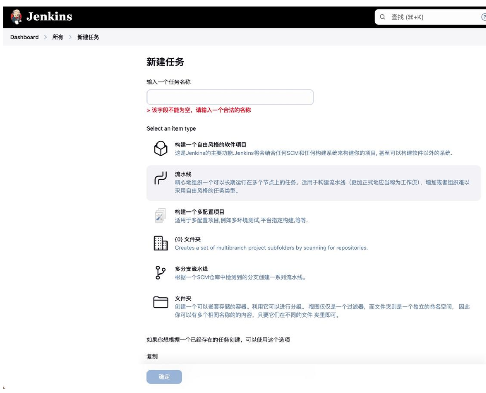
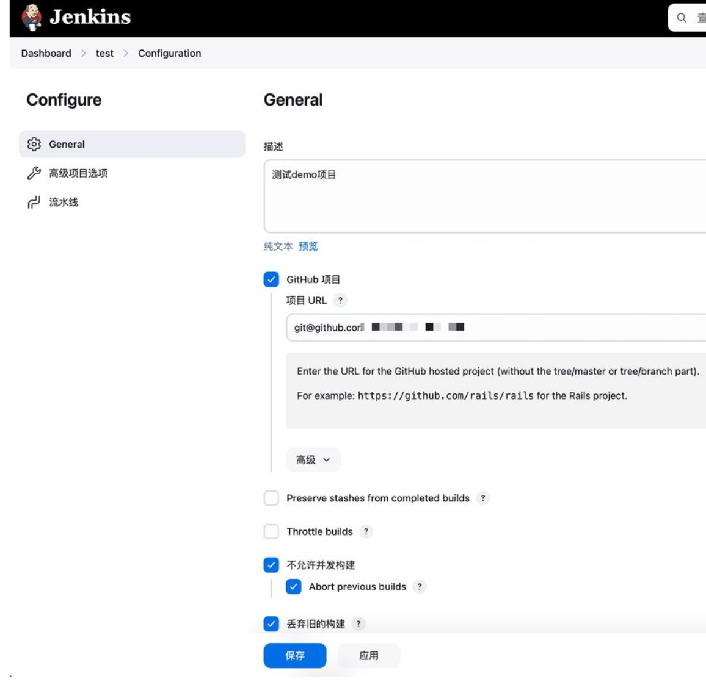
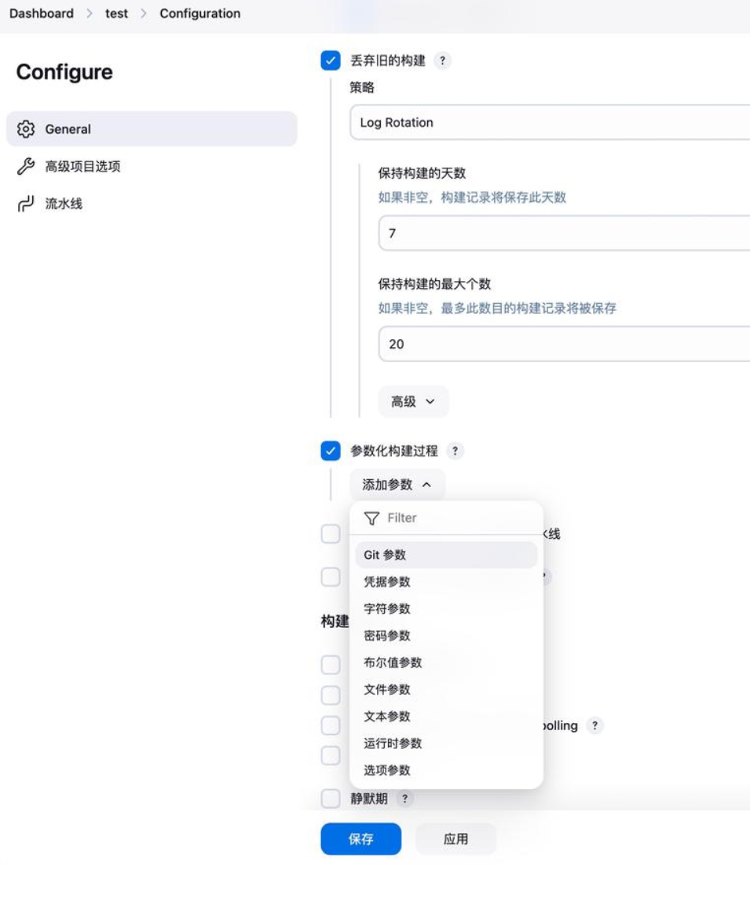
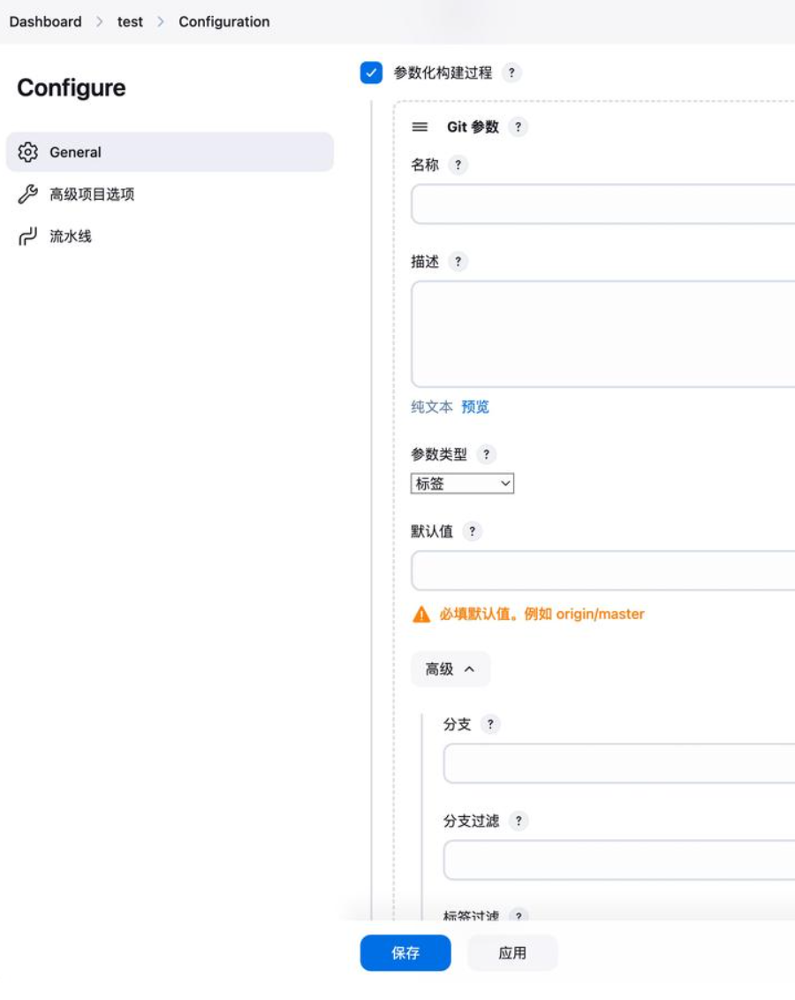
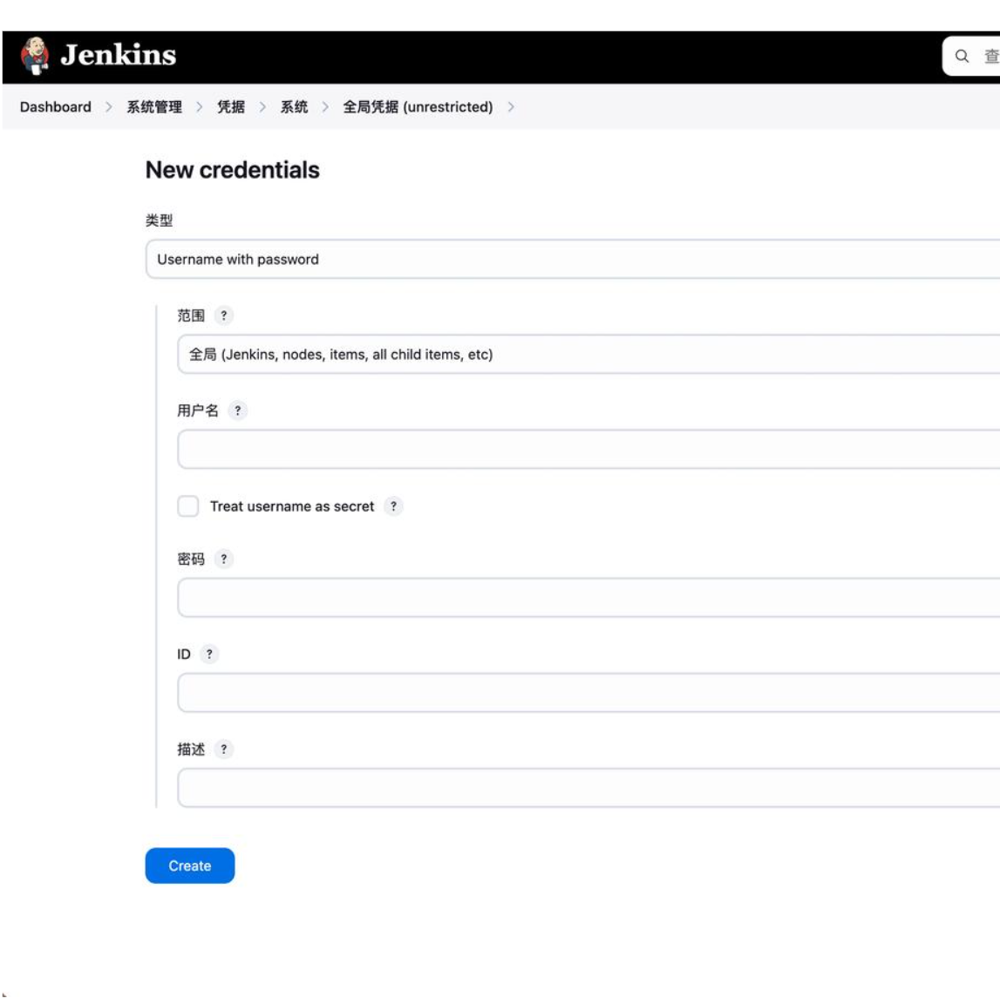
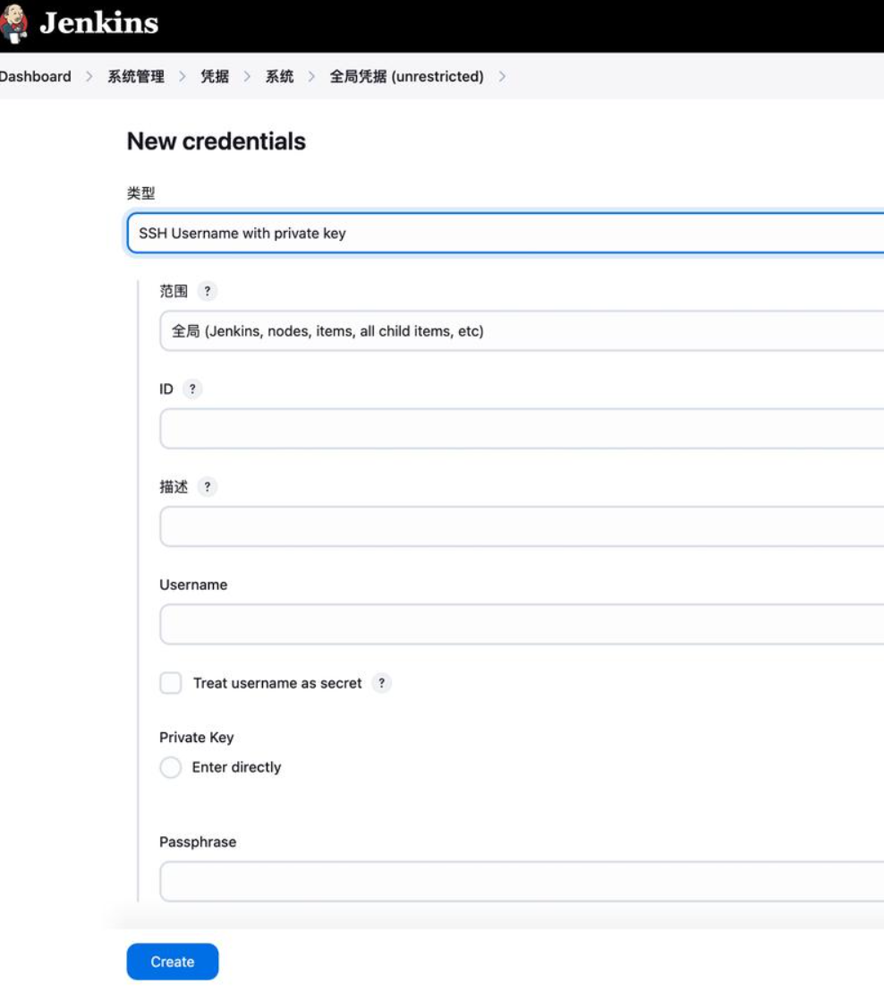
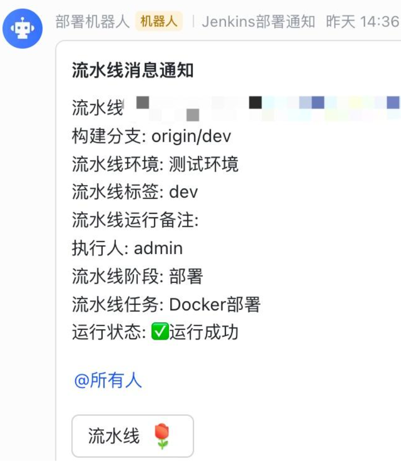

## Jenkins介绍
随着互联网应用越来越多，系统规模也越来越大，DevOps、CI/CD等概念也被重视起来，持续交付/持续集成/自动化部署等理念也被越来越多的团队接受。

而Jenkins，是目前比较流行的用于自动编译/部署软件项目的系统。
- CI持续集成：指开发人员频繁的将代码更改合并到主代码库中。每次提交后，自动化工具会执行构建和测试，以确保新代码安全性。
- CD持续交付：旨在通过自动化构建、测试、部署过程，使软件在任何时间点都可以安全地发布到生产环境中。

## Jenkins配置

Jenkins 配置可以通过 Web 界面进行。以下是配置 Jenkins 的基本步骤：

1. 安装 Jenkins：

在 Linux 上，可以使用包管理器安装，如 apt-get install jenkins (Debian/Ubuntu) 或 yum install jenkins (CentOS/RedHat)。

在 Windows 上，下载并运行安装程序。

2. 访问 Jenkins 网址：

   通常是 `http://localhost:8080`。

3. 进行初始化配置：

    - 安装推荐的插件。

    - 创建第一个管理员用户。

    - 设置 Jenkins 的 URL。

4. 配置 Jenkins 实例：

   - 可以通过 Jenkins 的 Web 界面进行配置，点击系统管理 -> 系统设置。

   - 配置全局工具设置，如 JDK、Maven 和 Git。

5. 创建或配置作业（Job）：

   - 点击新建任务，输入任务名称，选择任务类型（如 Freestyle project、Maven project）。

   - 配置源代码管理（如 Git）、构建触发器、构建环境和构建操作。
     - 下载代码
     - 编译代码
     - 远程部署程序
     - 配置任务自动触发

6. 保存并运行作业：

点击构建 now 来运行作业。

7. 监控构建结果：

在作业页面可以查看构建历史和详细信息。

8. 高级配置：

可以通过 Jenkins 脚本控制台进行高级配置，或编辑作业配置文件 config.xml

## 创建新任务
在Jenkins中新建任务是一个相对直观的过程，它主要依赖于Jenkins的Web界面，而不是通过编写代码来完成的。首先，您需要使用有效的用户名和密码登录到Jenkins的Web界面。访问您Jenkins服务器的URL，然后输入您的登录凭据。  

1. 新建Item   
登录后，在Jenkins的主页面上，您会看到一个侧边栏，其中包含了各种操作选项。在这个侧边栏中，找到并点击“新建任务”（在某些Jenkins版本中可能是“New Job”）按钮。

2. 输入任务名称  
在弹出的“新建任务”或“New Job”界面中，您需要首先输入任务的名称。这个名称应该是有意义的，以便于您和团队成员识别。
3.  选择任务类型。Pipeline、freestyle project   
接下来，您需要从“选择一个项目类型”下拉菜单中选择适合您需求的任务类型。Jenkins提供了多种任务类型，如“Freestyle project”（自由风格项目）、“Pipeline”（流水线）、“Maven project”（Maven项目）等。根据您的项目需求选择合适的类型。
4. 选择自由式项目：freestyle project
5. 配置任务详细参数   

  选择任务类型后，您将进入该类型任务的配置页面。在这里，您需要根据您的项目需求配置各种参数。以下是一些常见的配置项：
  
  - ‌源码管理‌：配置如何获取源代码，比如使用Git、SVN等版本控制系统。如果安装了 Git Parameter 插件 就会有 Git参数选项。
  
  然后我们选择Git参数，需要填写Git仓库的URL、分支名称、凭据等。:
  
  - ‌构建触发器‌：配置触发构建的条件，比如定时构建、Git push后自动构建等。
  - 构建步骤‌：定义构建过程中需要执行的命令或操作。这可以包括运行脚本、执行Maven命令、调用其他构建工具等。

  - ‌构建后操作‌：定义构建完成后需要执行的操作，如发送通知、部署应用等。
  - 在流水线中输入Groovy语法  
  
```sh
  pipeline {
    agent any
    environment {
        // 自动设置的环境变量
        BUILD_URL = "${env.BUILD_URL}"
        JOB_NAME = "${env.JOB_NAME}"
    }
    parameters {
        gitParameter name: 'branch', type: 'PT_BRANCH', defaultValue: 'dev', description: 'Select the branch to build', useRepository: 'git@github.com:****/' 
    }
    stages {
        stage('Checkout') {
            steps {
                echo "检出用户选择的分支 ${params.branch}"
                checkout scmGit(branches: [[name: params.branch]], extensions: [], userRemoteConfigs: [[url: 'git@github.com:****/']])
            }
        }
        
        stage('Build') {
            steps {
                script {
                    // 定义变量
                    def DOCKER_REGISTRY = 'registry.cn-hangzhou.aliyuncs.com'
                    def DOCKER_IMAGE_NAME = 'registry.cn-hangzhou.aliyuncs.com/****/****'
                    def DOCKER_TAG = 'dev-latest'

                    withCredentials([usernamePassword(credentialsId: '****', usernameVariable: 'DOCKER_USERNAME', passwordVariable: 'DOCKER_PASSWORD')]) {
                        echo "登陆 Docker 镜像仓库..."
                        sh('echo $DOCKER_PASSWORD | docker login -u $DOCKER_USERNAME --password-stdin ' + DOCKER_REGISTRY)
                        
                        sh """
                        echo "使用 Docker 构建镜像..."
                        docker build -t ${DOCKER_IMAGE_NAME}:${DOCKER_TAG} .

                        echo "推送镜像到阿里云镜像仓库..."
                        docker push ${DOCKER_IMAGE_NAME}:${DOCKER_TAG}
                        
                        echo "删除本地镜像..."
                        docker rmi -f ${DOCKER_IMAGE_NAME}:${DOCKER_TAG}
                        """
                    }
                }
            }
        }

        stage('Deploy') {
            steps {
                script {
                    sshagent (credentials: ['****']) {
                        echo "登录远程服务器部署"
                        sh 'ssh -o StrictHostKeyChecking=no -l root 远程服务器IP "sh deploy.sh"'
                    }
                }
            }
        }
    }
    post {
        success {
            script {
                echo 'Build succeeded!'
                def userName = currentBuild.getBuildCauses()[-1].userName
                println "Build User: ${userName}"
                sh "sh /var/deploy/deploy_webhooks.sh ${JOB_NAME} ${BUILD_URL} '${userName}' '${params.branch}' success"
            }
        }
        failure {
            script {
                echo 'Build failed!'
                def userName = currentBuild.getBuildCauses()[-1].userName
                println "Build User: ${userName}"
                sh "sh /var/deploy/deploy_webhooks.sh ${JOB_NAME} ${BUILD_URL} '${userName}' '${params.branch}' failure"
            }
        }
    }
}
```
1. 保存并应用配置  
配置完所有必要的参数后，滚动到页面底部，找到“保存”或“应用”按钮（具体名称可能因Jenkins版本而异），并点击它。这将保存您的配置，并创建新的Jenkins任务。

由于这个过程主要是通过Jenkins的Web界面来完成的，而不是通过编写代码，因此不需要包含代码片段来佐证回答。不过，根据您的项目需求，在配置过程中可能需要编写脚本或命令，这些脚本或命令将作为构建步骤的一部分被Jenkins执行。但这些脚本或命令的编写和配置是在Jenkins的Web界面中完成的，而不是在外部环境中编写的。

## 创建凭据
1. 用户账户密码类型凭据  
可用于访问远程git仓库，或者推送到docker

2. SSH类型凭据
可用于把打包后的代码推送到远程服务器部署

## 配置流水线
Jenkins 流水线 (或简单的带有大写"P"的"Pipeline") 是一套插件，它支持实现和集成 continuous delivery pipelines 到Jenkins。是用户定义的一个CD流水线模型 。

下面的流程图是一个 CD 场景的示例，在Jenkins中很容易对该场景进行建模:

对Jenkins 流水线的定义被写在一个文本文件中 (成为 Jenkinsfile)，该文件可以被提交到项目的源代码的控制仓库。 [2] 这是"流水线即代码"的基础; 将CD 流水线作为应用程序的一部分，像其他代码一样进行版本化和审查。 创建 `Jenkinsfile`并提交它到源代码控制中提供了一些即时的好处:

Jenkinsfile配置文件
```sh
##流水线的代码定义了整个的构建过程, 他通常包括构建, 测试和交付应用程序的阶段 。
pipeline {
    #agent 指令告诉Jenkins在哪里以及如何执行Pipeline或者Pipeline子集
    agent {
      image 'node:6-alpine' 
      args '-p 3000:3000' 
    }

    #使用环境变量
    environment {
        DISABLE_AUTH = 'true'
        DB_ENGINE    = 'sqlite'
    }
    #要执行的任务集合
    stages {
        #stage 块定义了在整个流水线的执行任务
        stage('build') {
            #定义一个单一的任务,
            steps {
                sh 'npm --version'
            }
            steps {
                sh 'npm install"'
                sh '''
                    echo "Multiline shell steps works too"
                    ls -lah
                '''
            }
        }
        stage('Deploy') {
          steps {
              # 重复执行 flakey-deploy.sh 脚本3次
              retry(3) {
                  #执行部署操作：sh脚本
                  sh './flakey-deploy.sh'
              }
              # 等待最多三分钟
              timeout(time: 3, unit: 'MINUTES') {
                  sh './health-check.sh'
              }
          }
        }
    }
    #当 Pipeline 运行完成时做一些清理工作或者基于 Pipeline 的运行结果执行不同的操作
    post {
      always {
          echo 'This will always run'
          #记录打包结果
          archiveArtifacts artifacts: 'build/libs/**/*.jar', fingerprint: true
          junit 'build/reports/**/*.xml'
      }
      success {
          echo 'This will run only if successful'
      }
      failure {
          echo 'This will run only if failed'
          #失败时邮件通知
          mail to: 'team@example.com',
          subject: "Failed Pipeline: ${currentBuild.fullDisplayName}",
          body: "Something is wrong with ${env.BUILD_URL}"
          #聊天机器人通知
          hipchatSend message: "Attention @here ${env.JOB_NAME} #${env.BUILD_NUMBER} has failed.",
                    color: 'RED'
      }
      unstable {
          echo 'This will run only if the run was marked as unstable'
      }
      changed {
          echo 'This will run only if the state of the Pipeline has changed'
          echo 'For example, if the Pipeline was previously failing but is now successful'
      }
  }
}

// Jenkins 构建任务配置示例
 
// 定义一个自由风格的构建任务
freeStyleJob('Example_Job') {
    // 设置任务的配置参数
    parameters {
        stringParam('BRANCH_NAME', 'master', 'The branch to build')
    }
 
    // 设置源代码管理
    scm {
        git {
            remote {
                url('https://github.com/your-repo.git')
                credentials('your-credentials')
            }
            branch('${BRANCH_NAME}')
        }
    }
 
    // 设置触发器
    triggers {
        pollSCM('H/5 * * * *') // 每5分钟检查一次源代码变更
    }
 
    // 设置构建环境
    wrappers {
        timeout(time: 30, unit: 'MINUTES') // 构建超时30分钟
    }
 
    // 设置构建操作
    steps {
        shell('''
            echo "Building the project..."
            mvn clean install
        ''')
    }
 
    // 设置构建后操作
    post build {
        always {
            // 始终执行的步骤
        }
        success {
            // 构建成功时执行的步骤
        }
        unstable {
            // 构建不稳定时执行的步骤
        }
        failure {
            // 构建失败时执行的步骤
        }
    }
}
```

## 项目构建结果通知脚本
一个是登录远程服务器后发布项目的脚本 (deploy.sh)

一个是项目构建结果通知脚本 (deploy_webhooks.sh)
```sh
#!/bin/bash

# 检查是否至少有一个参数
if [ $# -lt 1 ]; then
  echo "Usage: $0 jobname [url] [username] [branch] [jobstatus]"
  exit 1
fi

# 获取第一个参数
jobname="$1"

# 获取第二个参数（如果存在）
url="${2:-default_value}"

# 获取第三个参数（如果存在）
username="${3:-admin}"

# 获取第四个参数（如果存在）
branch="${4:-master}"

# 获取第五个参数（如果存在），默认为success
jobstatus="${5:-success}"

# 确保jobstatus非空
if [ -z "$jobstatus" ]; then
  jobstatus="success"
fi

echo $jobstatus

# 根据jobstatus的值设置jobstatusstr
if [ "$jobstatus" = "success" ]; then
    jobstatusstr="✅运行成功"
else
    jobstatusstr="❌运行失败"  # 修正赋值操作符
fi

# 或者使用以下方式，将JSON字符串放在一个变量中，然后引用这个变量
json_data='{
    "msg_type": "interactive",
    "card": {
        "elements": [
            {
                "tag": "div",
                "text": {
                    "content": "流水线: '${jobname}'('${url}') \n构建分支: '${branch}'\n流水线环境: 测试环境\n流水线标签: dev\n流水线运行备注:\n执行人: '${username}'\n流水线阶段: 部署\n流水线任务: Docker部署\n运行状态: '${jobstatusstr}'",
                    "tag": "lark_md"
                }
            },
            {
                "tag": "div",
                "text": {
                    "content": "<at id=all></at>",
                    "tag": "lark_md"
                }
            },
            {
                "actions": [
                    {
                        "tag": "button",
                        "text": {
                            "content": "流水线 :玫瑰:",
                            "tag": "lark_md"
                        },
                        "url": "'${url}'",
                        "type": "default",
                        "value": {}
                    }
                ],
                "tag": "action"
            }
        ],
        "header": {
            "title": {
                "content": "流水线消息通知",
                "tag": "plain_text"
            }
        }
    }
}'

curl -X POST -H "Content-Type: application/json" -d "$json_data" https://open.feishu.cn/open-apis/bot/v2/hook/*******

```
