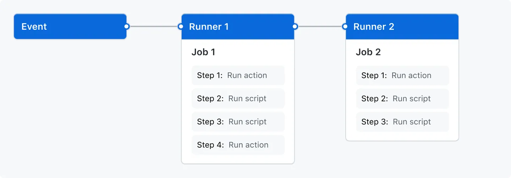

# 🚀 GitHub Actions CI/CD 完全指南

> GitHub Actions 是一个持续集成和持续交付（CI/CD）平台，允许您自动化构建、测试和部署管道，是现代软件开发不可或缺的工具。

## 🎯 GitHub Actions 简介

GitHub Actions 是一个持续集成和持续交付（CI/CD）平台，允许您自动化构建、测试和部署管道。您可以创建工作流程来构建和测试对存储库的每个拉取请求，或将合并的拉取请求部署到生产环境。

### ✨ 核心特性

| 特性 | 描述 | 优势 |
|------|------|------|
| **多平台支持** | Linux、Windows、macOS 虚拟机 | 🌐 跨平台兼容性 |
| **事件驱动** | 基于仓库事件触发工作流程 | ⚡ 自动化响应 |
| **灵活扩展** | 支持自定义 Actions 和第三方 Actions | 🔧 高度可定制 |
| **并行执行** | 支持作业并行和串行执行 | 🚀 提升执行效率 |

GitHub Actions 不仅仅是 DevOps，还允许您在存储库中发生其他事件时运行工作流程。例如，您可以运行工作流程，以便在有人在您的仓库中创建新议题时自动添加相应的标签。

GitHub 提供 Linux、Windows 和 macOS 虚拟机来运行您的工作流程，或者您可以在自己的数据中心或云基础设施中托管自己的自托管运行器。

## 🔧 核心概念

### 📋 Workflows（工作流）

可以将 GitHub Actions 工作流程配置为在存储库中发生事件时触发。您的工作流程包含一个或多个可以按顺序或并行运行的作业。每个作业都将在其自己的虚拟机运行程序或容器内运行，并且具有一个或多个步骤，这些步骤可以运行您定义的脚本或运行操作。



工作流程在存储库的 `.github/workflows` 目录中定义。存储库可以有多个工作流，每个工作流可以执行一组不同的任务，例如：

- 🔨 构建和测试拉取请求
- 🚀 每次创建版本时部署应用程序  
- 🏷️ 每当打开新 Issue 时添加标签

::: tip 💡 工作流程复用
可以在另一个工作流程中引用工作流程，实现代码复用和模块化管理。
:::

## Workflows工作流
可以将 GitHub Actions 工作流程配置为在存储库中发生事件时触发。您的工作流程包含一个或多个可以按顺序或并行运行的作业。每个作业都将在其自己的虚拟机运行程序或容器内运行，并且具有一个或多个步骤，这些步骤可以运行您定义的脚本或运行操作，这是一个可重用的扩展，可以简化您的工作流程。

工作流程在存储库的目录中定义。存储库可以有多个工作流，每个工作流可以执行一组不同的任务，例如：.github/workflows

- 构建和测试拉取请求。
- 每次创建版本时部署应用程序。
- 每当打开新 Issue 时添加标签。

可以在另一个工作流程中引用工作流程
### Events事件
事件是存储库中触发工作流程运行的特定活动。例如，当有人创建拉取请求、打开议题或将提交推送到仓库时，活动可能源自 GitHub。您还可以通过发布到 REST API 或手动触发工作流程按计划运行。
### Jobs工作
job是工作流程中在同一runner运行器上执行的一组steps。每个step要么是要执行的 shell 脚本，要么是要运行的 action。step按顺序执行，并且彼此依赖。由于每个step都在同一 Runner 上执行，因此您可以将数据从一个step共享到另一个step。例如，您可以有一个构建应用程序的step，后跟一个测试已构建的应用程序的step。

您可以配置job与其他job的依赖关系;默认情况下，job没有依赖项，并且并行运行。当一个job依赖于另一个job时，它会等待依赖job完成，然后再运行。
### Actions 操作
action是 GitHub Actions 平台的自定义应用程序，用于执行复杂但经常重复的任务。使用action有助于减少您在工作流程文件中编写的重复代码量。action可以从 GitHub 中提取 Git 存储库，为您的构建环境设置正确的工具链，或设置对云提供商的身份验证。

您可以编写自己的action，也可以在 GitHub Marketplace 中找到要在工作流程workflows中使用的action
### Runners 运行器
运行器runner是在触发工作流程时运行工作流程的服务器。每个运行器一次可以运行一个job。 GitHub 提供 Ubuntu Linux、Microsoft Windows 和 macOS 运行程序来运行您的工作流程。每个工作流程运行都在新置备的全新虚拟机中执行。

```sh
# 构建 VitePress 站点并将其部署到 GitHub Pages 的示例工作流程
name: Deploy VitePress site to Pages

on:
  # 在针对 `main` 分支的推送上运行。如果你
  # 使用 `master` 分支作为默认分支，请将其更改为 `master`
  push:
    branches: master
    # branches: [main]

  # 允许你从 Actions 选项卡手动运行此工作流程
  workflow_dispatch:

# 设置 GITHUB_TOKEN 的权限，以允许部署到 GitHub Pages
permissions:
  contents: read
  pages: write
  id-token: write

# 只允许同时进行一次部署，跳过正在运行和最新队列之间的运行队列
# 但是，不要取消正在进行的运行，因为我们希望允许这些生产部署完成
concurrency:
  group: pages
  cancel-in-progress: false

jobs:
  # 构建工作
  build:
    #运行器runner：是在触发工作流程时运行工作流程的服务器
    runs-on: ubuntu-latest 

    #step要么是要执行的 shell 脚本，要么是要运行的 action
    steps:
      - name: Checkout
        uses: actions/checkout@v4 #要运行的action
        with:
          fetch-depth: 0 # 如果未启用 lastUpdated，则不需要
      # - uses: pnpm/action-setup@v3 # 如果使用 pnpm，请取消注释
      # - uses: oven-sh/setup-bun@v1 # 如果使用 Bun，请取消注释

      - name: Setup Node
        uses: actions/setup-node@v4
        with:
          node-version: 20
          cache: npm # 或 pnpm / yarn

      - name: Setup Pages
        uses: actions/configure-pages@v4

        # 安装依赖。或 pnpm install / yarn install
      - name: Install dependencies
        run: yarn install 

        # 运行构建命令
      - name: Build with VitePress
        run: yarn build 

        # 上传构建产物
      - name: Upload artifact
        uses: actions/upload-pages-artifact@v3
        with:
          path: docs/.vitepress/dist

  # 部署工作
  deploy:
    environment:
      name: github-pages
      url: ${{ steps.deployment.outputs.page_url }}
    needs: build
    runs-on: ubuntu-latest
    name: Deploy
    steps:
      #部署到GitHub Pages
      - name: Deploy to GitHub Pages
        id: deployment
        uses: actions/deploy-pages@v4
```