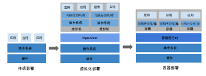
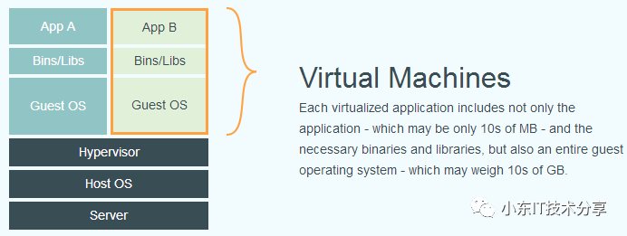
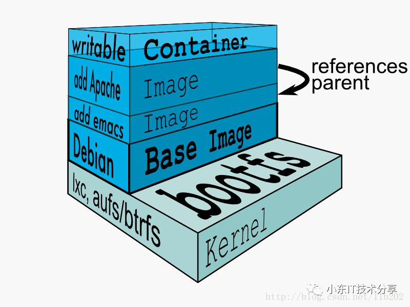
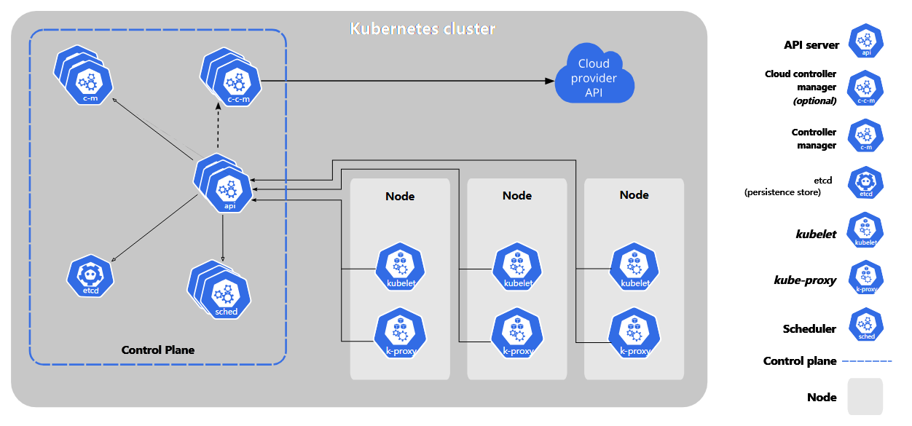

# 🐳 Docker 容器化技术完全指南

> Docker 是一种新兴的虚拟化技术，通过容器化的方式实现应用程序的打包、分发和运行，相比传统虚拟化具有众多优势。

## 🎯 Docker 简介



作为一种新兴的虚拟化方式，Docker 跟传统的虚拟化方式相比具有众多的优势。

### ✨ 核心优势

| 优势 | 描述 | 效果 |
|------|------|------|
| **高效资源利用** | 无需硬件虚拟和完整操作系统开销 | 💾 更高的系统资源利用率 |
| **快速启动** | 直接运行于宿主内核 | ⚡ 秒级甚至毫秒级启动时间 |
| **环境一致性** | 提供除内核外完整的运行时环境 | 🔒 确保开发、测试、生产环境一致 |
| **持续交付** | 通过镜像实现持续集成和部署 | 🚀 简化 DevOps 流程 |
| **轻松迁移** | 确保执行环境一致性 | 🌐 跨平台无缝迁移 |
| **易于维护** | 分层存储和镜像技术 | 🔧 简化应用维护和扩展 |

::: tip 💡 Docker vs 传统虚拟化
Docker 和传统虚拟化方式的不同：
- **容器**: 在操作系统层面实现虚拟化，直接复用本地主机操作系统
- **传统虚拟机**: 在硬件层面实现虚拟化
- **Docker 优势**: 启动速度快、占用体积小
:::



## Docker 镜像

镜像是构建 Docker 的基石。用户基于镜像来运行自己的容器。镜像也是 Docker 生命周期中的"构建"部分。镜像是基于联合文件系统的一种层式结构，由一系列指令一步一步构建出来。例如：

添加一个文件;
执行一个命令;
打开一个窗口

也可以将镜像当作容器的"源代码"。镜像体积很小，非常"便携"，易于分享、存储和更新。

镜像是一个只读的容器模板，含有启动 docker 容器所需的文件系统结构及内容 Docker 以镜像和在镜像基础上构建的容器为基础，以容器开发、测试、发布的单元将应用相关的所有组件和环境进行封装，避免了应用在不同平台间迁移所带来的依赖问题，确保了应用在生产环境的各阶段达到高度一致的实际效果。

镜像可以被创建、启动、关闭、重启以及销毁。Docker 的镜像机制是有层次感的，一个镜像可以放到另一个镜像的顶部。位于下端的为父镜像，以此类推；最底部的镜像可称为基础镜像。

镜像采用分层构建，每个镜像由一系列的镜像层组成, 当需要修改容器内的某个文件时，只对处于最上方的读写层进行变动，不覆盖下面已有文件系统的内容。当提交这个修改过的容器文件系统为一个新的镜像时，保存的内容仅为最上层读写文件系统中被更新过的文件。



## 容器

Docker 可以帮助你构建和部署容器，你只需要把自己的应用程序或者服务打包放进容器即可。容器是基于镜像启动起来的，容器中可以运行一个或多个进程。我们可以认为，镜像是 Docker 生命周期中的构建或者打包阶段，而容器则是启动或者执行阶段。容器基于镜像启动，一旦容器启动完成后，我们就可以登录到容器中安装自己需要的软件或者服务。

所以 Docker 容器就是：

一个镜像格式;
一些列标准操作;
一个执行环境

Docker 借鉴了标准集装箱的概念。标准集装箱将货物运往世界各地，Docker 将这个模型运用到自己的设计中，唯一不同的是：集装箱运输货物，而 Docker 运输软件。

## Registry（仓库）

Docker 用 Registry 来保存用户构建的镜像。Registry 分为公共和私有两种。Docker 公司运营公共的 Registry 叫做 Docker Hub。用户可以在 Docker Hub 注册账号，分享并保存自己的镜像（说明：在 Docker Hub 下载镜像巨慢，可以自己构建私有的 Registry）。

用户也可以在 Docker Hub 上保存自己的私有镜像。https://hub.docker.com/

## Docker 命令

查看 docker 常用命令。

也可以安装 docker 程序，用图形界面管理 docker

```js
/**
 * 容器生命周期管理
 */
run - 创建并启动一个新的容器。
start/stop/restart - 这些命令主要用于启动、停止和重启容器。
kill - 立即终止一个或多个正在运行的容器
rm - 于删除一个或多个已经停止的容器。
pause/unpause - 暂停和恢复容器中的所有进程。
create - 创建一个新的容器，但不会启动它。
exec - 在运行中的容器内执行一个新的命令。
rename - 重命名容器。
/**
 * 容器操作
 */
ps - 列出 Docker 容器
inspect - 获取 Docker 对象（容器、镜像、卷、网络等）的详细信息。
top - 显示指定容器中的正在运行的进程。
attach - 允许用户附加到正在运行的容器并与其交互。
events - 获取 Docker 守护进程生成的事件。
logs - 获取和查看容器的日志输出。
wait - 允许用户等待容器停止并获取其退出代码。
export - 将容器的文件系统导出为 tar 归档文件。
port - 显示容器的端口映射信息。
stats - 实时显示 Docker 容器的资源使用情况。
/**
 * 容器的root文件系统（rootfs）命令
 */
commit - 允许用户将容器的当前状态保存为新的 Docker 镜像。
cp - 用于在容器和宿主机之间复制文件或目录。
diff - 显示 Docker 容器文件系统的变更。
/**
 * 镜像仓库
 */
login/logout - 管理 Docker 客户端与 Docker 注册表的身份验证。
pull - 从 Docker 注册表（例如 Docker Hub）中拉取（下载）镜像到本地。
push - 将本地构建的 Docker 镜像推送（上传）到 Docker 注册表（如 Docker Hub 或私有注册表）。
search - 用于在 Docker Hub 或其他注册表中搜索镜像。
/**
 * 本地镜像管理
 */
images - 列出本地的 Docker 镜像。
rmi - 删除不再需要的镜像。
tag - 创建本地镜像的别名（tag）。
build - 从 Dockerfile 构建 Docker 镜像。
history - 查看指定镜像的历史层信息。
save - 将一个或多个 Docker 镜像保存到一个 tar 归档文件中。
load - 从由 docker save 命令生成的 tar 文件中加载 Docker 镜像。
import - 从一个 tar 文件或 URL 导入容器快照，从而创建一个新的 Docker 镜像。
/**
 * info|version
 */
info - 显示 Docker 的系统级信息，包括当前的镜像和容器数量。
version - 显示 Docker 客户端和服务端的版本信息。
Docker Compose
docker compose run - 启动一个新容器并运行一个特定的应用程序。
docker compose rm - 启动一个新容器并删除一个特定的应用程序。
docker compose ps - 从 docker compose 检查 docker 容器状态。
docker compose build - 构建 docker compose 文件。
docker compose up - 运行 docker compose 文件。
docker compose ls - 列出 docker compose 服务。
docker compose start - 启动 docker compose 文件创建的容器。
docker compose restart - 重启 docker compose 文件创建的容器。
/**
 * 网络命令
 */
docker network ls: 列出所有网络。
docker network create <network>: 创建一个新的网络。
docker network rm <network>: 删除指定的网络。
docker network connect <network> <container>: 连接容器到网络。
docker network disconnect <network> <container>: 断开容器与网络的连接。

/**
 * volume卷命令
 */
docker volume ls: 列出所有卷。
docker volume create <volume>: 创建一个新的卷。
docker volume rm <volume>: 删除指定的卷。
docker volume inspect <volume>: 显示卷的详细信息。

```

## Dockerfile 配置文件
Dockerfile 是一个用来构建镜像的文本文件，文本内容包含一条条构建镜像所需的指令和说明。Dockerfile 基本结构：基础镜像、镜像元信息、镜像操作指令、容器启动时执行命令。流程：

1、docker从基础镜像运行一个容器

2、执行一条指令并对容器做出修改

3、执行类似 docker commit 的操作提交一个新的镜像层

4、Docker再基于刚提交的镜像运行一个新容器

5、执行dockerfile中的下一条指令直到所有指令都执行完成！

```docker
# 运行时作为父镜像
FROM node:lts-alpine

#启动时的默认命令
ENTRYPOINT ["executable", "param1", "param2"] 

# 定义环境变量 =可设置多个
ENV NODE_ENV=production
ENV NAME World

# 设置工作目录
WORKDIR /usr/src/app

# 将当前目录内容复制到容器./目录
COPY ["package.json", "package-lock.json*", "npm-shrinkwrap.json*", "./"]

# 运行命令，安装依赖，删除node_modules文件夹
RUN npm install --production --silent && mv node_modules ../

#将所有内容复制到容器中
COPY . .

# 暴露端口3000端口供外部访问
EXPOSE 3000

# 修改目录权限
RUN chown -R node /usr/src/app

#设置启动容器的用户，可以是用户名或UID
USER node

#镜像指定标签
LABEL key=value

#指定作者
MAINTAINER zhangjinxi@qq.com

# 在容器启动时运行
CMD ["npm", "start"]

#卷映射到本地
VOLUME /var/log /var/db
```

## .dockerignore 文件

```txt
**/.classpath
**/.dockerignore
**/.env
**/.git
**/.gitignore
**/.project
**/.settings
**/.toolstarget
**/.vs
**/.vscode
**/*.*proj.user
**/*.dbmdl
**/*.jfm
**/charts
**/docker-compose*
**/compose*
**/Dockerfile*
**/node_modules
**/npm-debug.log
**/obj
**/secrets.dev.yaml
**/values.dev.yaml
LICENSE
README.md
```

## compose.yaml

用于启动多个容器

```yaml
# 定义应用启动两个服务 "todo-app" and "todo-database"
# todo-app 由app文件下的Dockerfile文件构建
# todo-database 使用Docker Hub官方镜像MongoDB

services:
  todo-app:
    build:
      context: ./app
    depends_on:
      - todo-database
    environment:
      NODE_ENV: production
    ports:
      - 3000:3000
      # - 35729:35729
    develop:
      watch:
        - path: ./app/package.json
          action: rebuild
        - path: ./app
          target: /app
          action: sync
  todo-database:
    image: mongo:6
    volumes:
      - database:/data/db
    ports:
      - 27017:27017
volumes:
  database:
```
## Kubernetes

容器是打包和运行应用程序的好方式。在生产环境中， 你需要管理运行着应用程序的容器，并确保服务不会下线。 例如，如果一个容器发生故障，则你需要启动另一个容器。 如果此行为交由给系统处理，是不是会更容易一些？

这就是 Kubernetes 要来做的事情！ Kubernetes 为你提供了一个可弹性运行分布式系统的框架。 Kubernetes 会满足你的扩展要求、故障转移你的应用、提供部署模式等。 例如，Kubernetes 可以轻松管理系统的 Canary (金丝雀) 部署。

Kubernetes 是一个可移植、可扩展的开源平台，用于管理容器化的工作负载和服务，方便进行声明式配置和自动化。Kubernetes 拥有一个庞大且快速增长的生态系统，其服务、支持和工具的使用范围广泛。

Kubernetes是Google开源的一个容器编排引擎，它支持自动化部署、大规模可伸缩、应用容器化管理。在生产环境中部署一个应用程序时，通常要部署该应用的多个实例以便对应用请求进行负载均衡。

在Kubernetes中，我们可以创建多个容器，每个容器里面运行一个应用实例，然后通过内置的负载均衡策略，实现对这一组应用实例的管理、发现、访问，而这些细节都不需要运维人员去进行复杂的手工配置和处理。

- 服务发现和负载均衡：Kubernetes 可以使用 DNS 名称或自己的 IP 地址来暴露容器。 如果进入容器的流量很大， Kubernetes 可以负载均衡并分配网络流量，从而使部署稳定。
- 存储编排：Kubernetes 允许你自动挂载你选择的存储系统，例如本地存储、公共云提供商等。
- 自动部署和回滚：可以使用 Kubernetes 描述已部署容器的所需状态， 它可以以受控的速率将实际状态更改为期望状态。 例如，你可以自动化 Kubernetes 来为你的部署创建新容器， 删除现有容器并将它们的所有资源用于新容器。
- 自动完成装箱计算：你为 Kubernetes 提供许多节点组成的集群，在这个集群上运行容器化的任务。 你告诉 Kubernetes 每个容器需要多少 CPU 和内存 (RAM)。 Kubernetes 可以将这些容器按实际情况调度到你的节点上，以最佳方式利用你的资源。
- 自我修复：Kubernetes 将重新启动失败的容器、替换容器、杀死不响应用户定义的运行状况检查的容器， 并且在准备好服务之前不将其通告给客户端。
- 密钥与配置管理：Kubernetes 允许你存储和管理敏感信息，例如密码、OAuth 令牌和 SSH 密钥。 你可以在不重建容器镜像的情况下部署和更新密钥和应用程序配置，也无需在堆栈配置中暴露密钥。
- 批处理执行：Kubernetes 还可以管理你的批处理和 CI（持续集成）工作负载，如有需要，可以替换失败的容器。
- 水平扩缩：使用简单的命令、用户界面或根据 CPU 使用率自动对你的应用进行扩缩。
- IPv4/IPv6 双栈 ： 为 Pod（容器组）和 Service（服务）分配 IPv4 和 IPv6 地址。
- 为可扩展性设计： 在不改变上游源代码的情况下为你的 Kubernetes 集群添加功能
- 