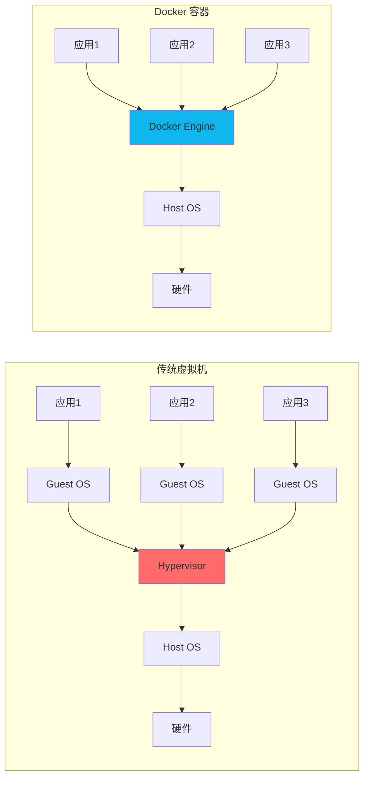
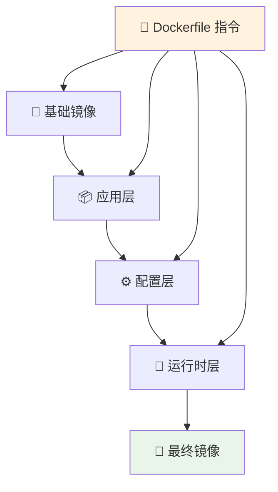
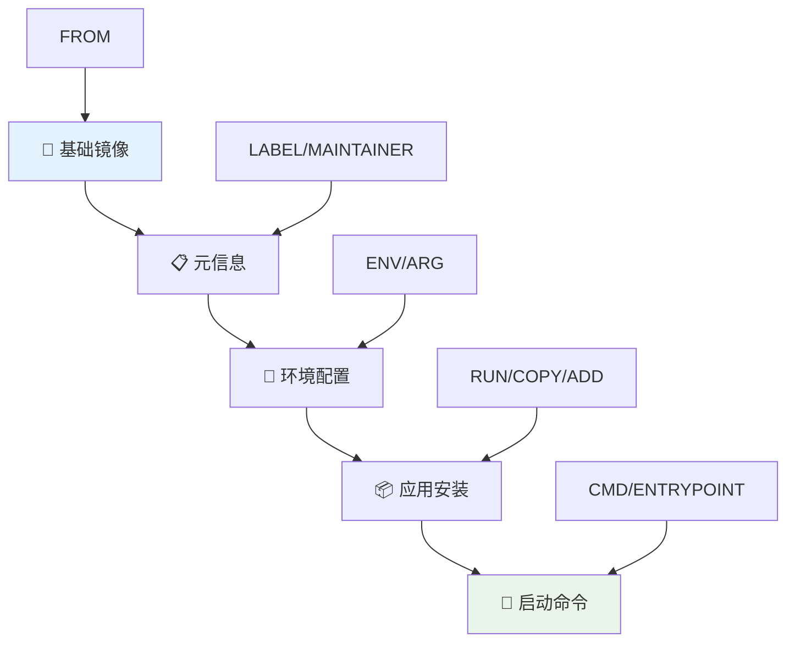
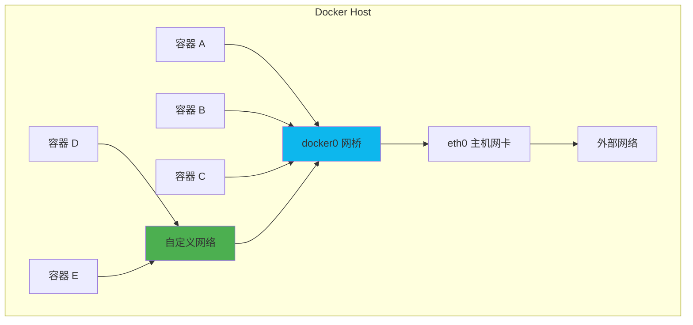
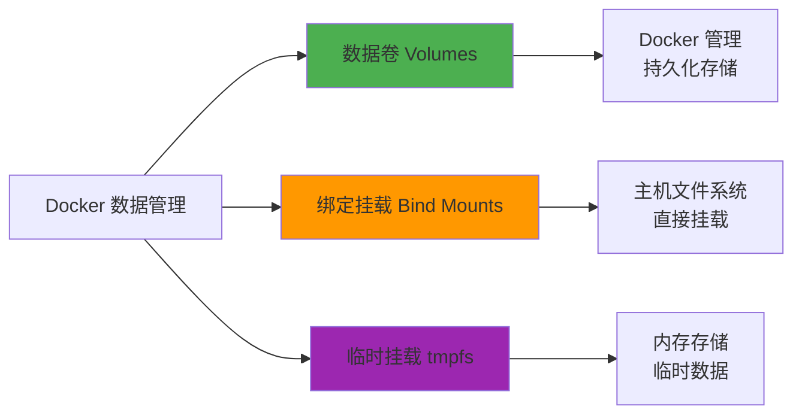

# 🐳 Docker 容器化技术完全指南

> 💡 **Docker** 是一种新兴的虚拟化技术，通过容器化的方式实现应用程序的打包、分发和运行，相比传统虚拟化具有众多优势。

## 📖 目录导航

- [🎯 Docker 简介](#🎯-docker-简介)
- [🏗️ 核心概念](#🏗️-核心概念)
- [📦 镜像管理](#📦-镜像管理)
- [🚀 容器操作](#🚀-容器操作)
- [📝 Dockerfile 实践](#📝-dockerfile-实践)
- [🌐 网络配置](#🌐-网络配置)
- [💾 数据管理](#💾-数据管理)
- [🔧 Docker Compose](#🔧-docker-compose)
- [⚡ 性能优化](#⚡-性能优化)
- [🌟 最佳实践](#🌟-最佳实践)

---

## 🎯 Docker 简介


作为一种新兴的虚拟化方式，Docker 跟传统的虚拟化方式相比具有众多的优势。

### ✨ 核心优势

| 优势 | 描述 | 效果 | 应用场景 |
|------|------|------|----------|
| **⚡ 高效资源利用** | 无需硬件虚拟和完整操作系统开销 | 💾 更高的系统资源利用率 | 高密度部署 |
| **🚀 快速启动** | 直接运行于宿主内核 | ⏱️ 秒级甚至毫秒级启动时间 | 微服务架构 |
| **🔒 环境一致性** | 提供除内核外完整的运行时环境 | 🎯 确保开发、测试、生产环境一致 | DevOps 流程 |
| **📦 持续交付** | 通过镜像实现持续集成和部署 | 🚀 简化 DevOps 流程 | CI/CD 管道 |
| **🌐 轻松迁移** | 确保执行环境一致性 | 🔄 跨平台无缝迁移 | 云原生应用 |
| **🔧 易于维护** | 分层存储和镜像技术 | 📈 简化应用维护和扩展 | 容器编排 |

### 🏗️ 架构对比



::: tip 💡 Docker vs 传统虚拟化
Docker 和传统虚拟化方式的不同：
- **容器**: 在操作系统层面实现虚拟化，直接复用本地主机操作系统
- **传统虚拟机**: 在硬件层面实现虚拟化
- **Docker 优势**: 启动速度快、占用体积小
:::


---

## 🏗️ 核心概念

### 📦 Docker 镜像

镜像是构建 Docker 的基石。用户基于镜像来运行自己的容器。镜像也是 Docker 生命周期中的"构建"部分。镜像是基于联合文件系统的一种层式结构，由一系列指令一步一步构建出来。



#### 🔑 镜像特性

- **📋 只读模板**: 含有启动 Docker 容器所需的文件系统结构及内容
- **🏗️ 分层构建**: 采用分层构建，每个镜像由一系列的镜像层组成
- **⚡ 高效存储**: 通过联合文件系统实现存储优化
- **🔄 版本控制**: 支持版本管理和回滚


### 🚀 Docker 容器

Docker 可以帮助你构建和部署容器，你只需要把自己的应用程序或者服务打包放进容器即可。容器是基于镜像启动起来的，容器中可以运行一个或多个进程。

#### 📋 容器特征

```javascript
/**
 * 容器组成要素
 */
const dockerContainer = {
  // 🖼️ 镜像格式 - 基于镜像创建
  imageFormat: "OCI (Open Container Initiative)",
  
  // 🔧 标准操作 - 统一的容器操作接口
  standardOperations: [
    "create", "start", "stop", "restart", 
    "pause", "unpause", "rm"
  ],
  
  // ⚡ 执行环境 - 隔离的运行环境
  executionEnvironment: {
    namespace: "进程隔离",
    cgroups: "资源限制",
    filesystem: "联合文件系统"
  }
};
```

### 🏪 Docker Registry（仓库）

Docker 用 Registry 来保存用户构建的镜像。Registry 分为公共和私有两种。

| 仓库类型 | 描述 | 地址 | 特点 |
|----------|------|------|------|
| **🌐 Docker Hub** | 官方公共仓库 | https://hub.docker.com/ | 免费、丰富的镜像 |
| **🏢 私有仓库** | 企业内部仓库 | 自定义 | 安全、可控 |
| **☁️ 云仓库** | 云服务商提供 | 各云平台 | 集成度高 |

---

## 📦 镜像管理

### 🔍 镜像操作命令

::: code-group

```bash [基础操作]
# 🔍 镜像查询
docker images                    # 列出本地镜像
docker search nginx              # 搜索镜像
docker image ls                  # 列出镜像（新语法）

# 📥 镜像拉取
docker pull nginx                # 拉取最新版本
docker pull nginx:1.20          # 拉取指定版本
docker pull nginx:alpine        # 拉取指定标签

# 🗑️ 镜像删除
docker rmi nginx                 # 删除镜像
docker rmi $(docker images -q)  # 删除所有镜像
docker image prune              # 清理无用镜像
```

```bash [高级操作]
# 🏷️ 镜像标签
docker tag nginx my-nginx       # 创建标签
docker tag nginx:latest nginx:v1.0

# 📤 镜像推送
docker push my-nginx            # 推送到仓库

# 💾 镜像导入导出
docker save nginx > nginx.tar   # 导出镜像
docker load < nginx.tar         # 导入镜像
docker export container > app.tar  # 导出容器

# 📋 镜像信息
docker inspect nginx            # 查看镜像详细信息
docker history nginx            # 查看镜像历史
```

```bash [构建操作]
# 🔨 镜像构建
docker build -t my-app .        # 从 Dockerfile 构建
docker build -t my-app:v1.0 .   # 构建并打标签
docker build --no-cache .       # 无缓存构建

# 🔍 构建调试
docker build --progress=plain .  # 显示详细构建信息
docker build --target dev .     # 构建到指定阶段
```

:::

### 📊 镜像分层机制

```dockerfile
# 每个指令都会创建一个新的镜像层
FROM ubuntu:20.04           # 层 1: 基础镜像
RUN apt-get update           # 层 2: 更新包列表
RUN apt-get install -y curl # 层 3: 安装 curl
COPY app.js /app/           # 层 4: 复制文件
CMD ["node", "/app/app.js"] # 层 5: 设置启动命令
```

---

## 🚀 容器操作

### 🔄 容器生命周期管理

::: code-group

```bash [基础生命周期]
# 🚀 创建和启动
docker run nginx                    # 创建并启动容器
docker run -d nginx                 # 后台运行
docker run --name web nginx         # 指定容器名称
docker run -p 80:80 nginx          # 端口映射

# ⏸️ 暂停和恢复
docker pause web                    # 暂停容器
docker unpause web                  # 恢复容器

# 🔄 启动和停止
docker start web                    # 启动容器
docker stop web                     # 停止容器
docker restart web                  # 重启容器

# 🗑️ 删除
docker rm web                       # 删除容器
docker rm -f web                    # 强制删除运行中的容器
```

```bash [高级操作]
# 📝 容器信息
docker ps                          # 查看运行中的容器
docker ps -a                       # 查看所有容器
docker logs web                    # 查看容器日志
docker logs -f web                 # 实时查看日志
docker inspect web                 # 查看容器详细信息

# 🔧 容器交互
docker exec -it web bash           # 进入容器
docker exec web ls /app            # 在容器中执行命令
docker attach web                  # 附加到容器

# 📊 资源监控
docker stats                       # 查看容器资源使用
docker top web                     # 查看容器进程
```

```bash [文件操作]
# 📂 文件复制
docker cp file.txt web:/app/       # 复制文件到容器
docker cp web:/app/log.txt ./      # 从容器复制文件

# 💾 数据卷
docker run -v /host:/container nginx  # 挂载目录
docker run -v mydata:/data nginx      # 使用命名卷
```

:::

### 🔧 容器运行参数

| 参数 | 描述 | 示例 | 用途 |
|------|------|------|------|
| **-d** | 后台运行 | `docker run -d nginx` | 守护进程模式 |
| **-p** | 端口映射 | `docker run -p 80:80 nginx` | 网络访问 |
| **-v** | 数据卷挂载 | `docker run -v /data:/app nginx` | 数据持久化 |
| **-e** | 环境变量 | `docker run -e NODE_ENV=prod app` | 配置传递 |
| **--name** | 容器名称 | `docker run --name web nginx` | 便于管理 |
| **--network** | 网络配置 | `docker run --network mynet nginx` | 网络隔离 |

---

## 📝 Dockerfile 实践

### 🏗️ Dockerfile 基础结构

Dockerfile 是一个用来构建镜像的文本文件，文本内容包含一条条构建镜像所需的指令和说明。



### 📋 Dockerfile 指令详解

::: code-group

```dockerfile [基础指令]
# 🎯 基础镜像
FROM node:18-alpine

# 📝 元信息
LABEL maintainer="developer@example.com"
LABEL version="1.0"
LABEL description="Node.js应用容器"

# 🔧 环境变量
ENV NODE_ENV=production
ENV PORT=3000
ENV APP_ROOT=/usr/src/app

# 👤 用户设置
USER node

# 📁 工作目录
WORKDIR $APP_ROOT
```

```dockerfile [文件操作]
# 📂 复制文件
COPY package*.json ./
COPY src/ ./src/
COPY public/ ./public/

# 📥 添加文件（支持URL和自动解压）
ADD https://github.com/user/repo/archive/main.tar.gz /tmp/
ADD config.tar.gz /etc/

# 🏃 运行命令
RUN npm ci --only=production \
    && npm cache clean --force \
    && rm -rf /tmp/*

# 📊 健康检查
HEALTHCHECK --interval=30s --timeout=3s --start-period=5s --retries=3 \
    CMD curl -f http://localhost:$PORT/health || exit 1
```

```dockerfile [运行配置]
# 🌐 暴露端口
EXPOSE $PORT

# 📦 数据卷
VOLUME ["/data", "/logs"]

# 🚀 启动命令
CMD ["npm", "start"]

# 🎯 入口点（不可被docker run覆盖）
ENTRYPOINT ["docker-entrypoint.sh"]

# 🔧 信号处理
STOPSIGNAL SIGTERM

# 👤 切换用户
USER node
```

:::

### 🚀 完整 Dockerfile 示例

```dockerfile
# 多阶段构建示例
# 🏗️ 构建阶段
FROM node:18-alpine AS builder

# 📝 设置元信息
LABEL stage=builder
LABEL description="Node.js 应用构建阶段"

# 🔧 设置工作目录
WORKDIR /usr/src/app

# 📂 复制依赖文件
COPY package*.json ./

# 📦 安装所有依赖（包括开发依赖）
RUN npm ci

# 📁 复制源代码
COPY . .

# 🏗️ 构建应用
RUN npm run build

# 🚀 生产阶段
FROM node:18-alpine AS production

# 📝 设置元信息
LABEL maintainer="developer@example.com"
LABEL version="1.0.0"
LABEL description="Node.js 生产环境容器"

# 🔧 设置环境变量
ENV NODE_ENV=production
ENV PORT=3000
ENV APP_ROOT=/usr/src/app

# 👥 创建应用用户
RUN addgroup -g 1001 -S nodejs \
    && adduser -S nextjs -u 1001

# 📁 设置工作目录
WORKDIR $APP_ROOT

# 📂 从构建阶段复制文件
COPY --from=builder --chown=nextjs:nodejs /usr/src/app/dist ./dist
COPY --from=builder --chown=nextjs:nodejs /usr/src/app/package*.json ./

# 📦 安装生产依赖
RUN npm ci --only=production \
    && npm cache clean --force

# 👤 切换到非root用户
USER nextjs

# 🌐 暴露端口
EXPOSE $PORT

# 📊 健康检查
HEALTHCHECK --interval=30s --timeout=10s --start-period=5s --retries=3 \
    CMD curl -f http://localhost:$PORT/health || exit 1

# 🚀 启动应用
CMD ["npm", "start"]
```

### 🎯 构建优化技巧

1. **📋 .dockerignore 文件**
   ```gitignore
   # 构建上下文忽略文件
   node_modules
   npm-debug.log
   .git
   .gitignore
   README.md
   .env
   coverage
   .nyc_output
   .DS_Store
   ```

2. **🏗️ 多阶段构建**
   ```dockerfile
   # 减少最终镜像大小
   FROM node:18 AS build
   # 构建步骤...
   
   FROM node:18-alpine AS runtime
   COPY --from=build /app/dist ./dist
   ```

3. **📦 合并 RUN 指令**
   ```dockerfile
   # ✅ 好的做法
   RUN apt-get update \
       && apt-get install -y curl \
       && apt-get clean \
       && rm -rf /var/lib/apt/lists/*
   
   # ❌ 不好的做法
   RUN apt-get update
   RUN apt-get install -y curl
   RUN apt-get clean
   ```

---

## 🌐 网络配置

### 🔗 Docker 网络类型

| 网络类型 | 描述 | 使用场景 | 特点 |
|----------|------|----------|------|
| **bridge** | 桥接网络（默认） | 单机容器通信 | 🔒 网络隔离 |
| **host** | 主机网络 | 性能要求高 | ⚡ 直接使用主机网络 |
| **none** | 无网络 | 安全隔离 | 🚫 完全隔离 |
| **overlay** | 覆盖网络 | 多主机通信 | 🌐 跨主机连接 |

### 🔧 网络命令操作

::: code-group

```bash [网络管理]
# 📋 查看网络
docker network ls               # 列出所有网络
docker network inspect bridge  # 查看网络详情

# 🔧 创建网络
docker network create mynet              # 创建桥接网络
docker network create --driver bridge mynet
docker network create --subnet=172.20.0.0/16 mynet

# 🗑️ 删除网络
docker network rm mynet        # 删除网络
docker network prune          # 清理未使用的网络
```

```bash [容器网络]
# 🌐 容器连接网络
docker run --network mynet nginx        # 在指定网络运行
docker network connect mynet container  # 连接容器到网络
docker network disconnect mynet container # 断开网络连接

# 🔍 网络诊断
docker exec container ping another      # 容器间连通性测试
docker exec container nslookup service  # DNS 解析测试
```

:::

### 📊 网络架构图



---

## 💾 数据管理

### 📁 数据卷类型



### 🔧 数据卷操作

::: code-group

```bash [数据卷管理]
# 📋 查看数据卷
docker volume ls                # 列出所有数据卷
docker volume inspect mydata   # 查看数据卷详情

# 🔧 创建数据卷
docker volume create mydata           # 创建命名数据卷
docker volume create --driver local mydata

# 🗑️ 删除数据卷
docker volume rm mydata        # 删除数据卷
docker volume prune           # 清理未使用的数据卷
```

```bash [挂载方式]
# 📦 命名数据卷
docker run -v mydata:/data nginx

# 📁 绑定挂载
docker run -v /host/path:/container/path nginx
docker run --mount type=bind,source=/host,target=/app nginx

# 💾 临时挂载
docker run --tmpfs /tmp nginx
docker run --mount type=tmpfs,destination=/tmp nginx
```

:::

### 📊 数据卷最佳实践

1. **🎯 选择合适的挂载类型**
   ```bash
   # ✅ 数据持久化 - 使用命名卷
   docker run -v db_data:/var/lib/mysql mysql
   
   # ✅ 开发调试 - 使用绑定挂载
   docker run -v $(pwd):/app node
   
   # ✅ 临时数据 - 使用 tmpfs
   docker run --tmpfs /tmp app
   ```

2. **🔒 权限管理**
   ```dockerfile
   # 在 Dockerfile 中设置正确的权限
   RUN chown -R app:app /data
   VOLUME ["/data"]
   USER app
   ```

---

## 🔧 Docker Compose

### 📝 Compose 基础

Docker Compose 是一个用于定义和运行多容器 Docker 应用程序的工具。

```yaml
# docker-compose.yml 示例
version: '3.8'

services:
  # 🌐 Web 服务
  web:
    build: .
    ports:
      - "80:3000"
    environment:
      - NODE_ENV=production
    depends_on:
      - db
      - redis
    volumes:
      - ./logs:/app/logs
    networks:
      - app-network

  # 🗄️ 数据库服务
  db:
    image: postgres:13
    environment:
      POSTGRES_DB: myapp
      POSTGRES_USER: user
      POSTGRES_PASSWORD: password
    volumes:
      - db_data:/var/lib/postgresql/data
    networks:
      - app-network

  # 🚀 缓存服务
  redis:
    image: redis:6-alpine
    networks:
      - app-network

volumes:
  db_data:

networks:
  app-network:
    driver: bridge
```

### 🚀 Compose 命令

::: code-group

```bash [基础操作]
# 🚀 启动服务
docker-compose up                # 前台启动
docker-compose up -d             # 后台启动
docker-compose up --build        # 重新构建后启动

# ⏹️ 停止服务
docker-compose down              # 停止并删除容器
docker-compose down -v           # 同时删除数据卷
docker-compose stop              # 仅停止服务
```

```bash [服务管理]
# 🔧 服务操作
docker-compose ps               # 查看服务状态
docker-compose logs web         # 查看服务日志
docker-compose exec web bash    # 进入服务容器

# 🔄 服务控制
docker-compose restart web      # 重启服务
docker-compose scale web=3      # 扩展服务实例
```

:::

---

## ⚡ 性能优化

### 🚀 镜像优化

1. **📦 选择合适的基础镜像**
   ```dockerfile
   # ✅ 使用 Alpine 镜像减少体积
   FROM node:18-alpine
   
   # ✅ 多阶段构建
   FROM node:18 AS build
   # 构建步骤...
   FROM node:18-alpine AS runtime
   ```

2. **🗂️ 优化构建缓存**
   ```dockerfile
   # ✅ 先复制依赖文件，利用缓存
   COPY package*.json ./
   RUN npm ci
   COPY . .
   ```

3. **🧹 清理构建垃圾**
   ```dockerfile
   RUN apt-get update \
       && apt-get install -y curl \
       && apt-get clean \
       && rm -rf /var/lib/apt/lists/*
   ```

### 📊 性能监控

```bash
# 📈 资源监控
docker stats                    # 实时资源使用
docker system df                # 磁盘使用情况
docker system events            # 系统事件

# 🔍 性能分析
docker exec container top       # 进程信息
docker logs --tail 100 container # 日志分析
```

---

## 🌟 最佳实践

### 🏗️ 镜像构建最佳实践

1. **📋 使用 .dockerignore**
   ```gitignore
   node_modules
   .git
   .env
   coverage
   *.log
   ```

2. **🎯 最小化镜像层数**
   ```dockerfile
   # ✅ 合并相关命令
   RUN apt-get update && \
       apt-get install -y curl && \
       apt-get clean
   ```

3. **🔒 安全实践**
   ```dockerfile
   # ✅ 使用非 root 用户
   RUN adduser --disabled-password --gecos '' appuser
   USER appuser
   
   # ✅ 最小权限原则
   COPY --chown=appuser:appuser . /app
   ```

### 🚀 运行时最佳实践

1. **📊 资源限制**
   ```bash
   # 限制 CPU 和内存使用
   docker run --cpus="1.5" --memory="512m" nginx
   ```

2. **📋 健康检查**
   ```dockerfile
   HEALTHCHECK --interval=30s --timeout=10s \
     CMD curl -f http://localhost/health || exit 1
   ```

3. **📝 日志管理**
   ```bash
   # 配置日志驱动
   docker run --log-driver=json-file --log-opt max-size=10m nginx
   ```

### 🔧 开发流程最佳实践

1. **🔄 开发环境配置**
   ```yaml
   # docker-compose.dev.yml
   version: '3.8'
   services:
     web:
       build: .
       volumes:
         - .:/app
         - /app/node_modules
       environment:
         - NODE_ENV=development
   ```

2. **🚀 CI/CD 集成**
   ```yaml
   # GitHub Actions 示例
   - name: Build Docker image
     run: docker build -t my-app:${{ github.sha }} .
   
   - name: Push to registry
     run: docker push my-app:${{ github.sha }}
   ```

---

::: tip 🎯 总结

Docker 作为现代容器化技术的标杆，为应用部署和管理带来了革命性的变化：

### 🚀 核心价值
- **⚡ 高效部署**: 秒级启动，资源占用少
- **🔒 环境一致**: 开发、测试、生产环境完全一致
- **📦 便捷分发**: 通过镜像实现应用的标准化分发
- **🌐 易于扩展**: 支持水平扩展和微服务架构
- **🔧 简化运维**: 统一的容器管理接口

### 💡 应用场景
- **🏗️ 微服务架构**: 服务拆分和独立部署
- **🚀 CI/CD 流程**: 持续集成和持续部署
- **☁️ 云原生应用**: 容器编排和服务网格
- **🔧 开发环境**: 统一开发环境配置
- **📊 应用迁移**: 传统应用容器化改造

掌握 Docker 将极大提升你的开发效率和运维能力！🎉

:::

::: warning 📋 注意事项
- 容器不是虚拟机，理解其轻量级特性
- 数据持久化需要合理使用数据卷
- 生产环境需要考虑安全性和资源限制
- 学习容器编排工具（如 Kubernetes）
- 注意镜像大小和构建效率
:::

---

> 🌟 **容器化未来，高效开发** - Docker 让应用部署变得简单而强大！
