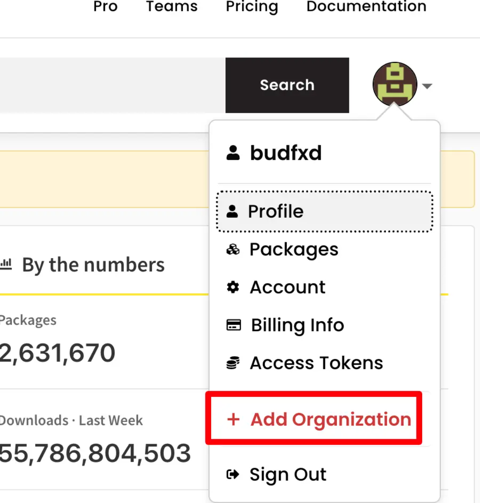

# 🏗️ Lerna Monorepo 管理工具完全指南

> Lerna 是一个快速、领先的构建系统，用于管理和发布来自同一源码仓库（Monorepos）的多个 JavaScript/TypeScript 软件包。

## 🎯 Lerna 简介

Lerna 是一个快速、领先的构建系统，用于管理和发布来自同一源码仓库（Monorepos）的多个 JavaScript/TypeScript 软件包。

### ✨ 核心优势

Lerna 解决了 JavaScript/TypeScript 单一源码仓库（monorepos）的两大问题：

| 功能 | 描述 | 优势 |
|------|------|------|
| **高效执行** | 针对任意数量的项目运行命令 | ⚡ 以最高效的方式、正确的顺序运行 |
| **发布管理** | 管理从版本控制到 NPM 发布的完整流程 | 🚀 支持多种工作流程 |
| **任务调度** | 基于 Nx 任务运行程序 | 🔄 免费获得缓存和分布式运行 |

::: info 📖 版本特性
从 v6+ 版本开始，Lerna 将任务调度工作委托给经过实战检验、业界领先的 Nx 任务运行程序，这意味着 `lerna run` 可以免费获得缓存和命令分布式运行所带来的好处！

**参考文档**: [Lerna 官方文档](https://www.lernajs.cn/docs/getting-started)
:::

### 🏗️ 项目结构

新版本的 Lerna 统一改为使用包管理器（如：npm/yarn/pnpm）来管理依赖。

Lerna 仓库文件结构如下：`packages` 目录为子项目储存目录

```txt
my-lerna-repo/
  package.json
  packages/
    package-1/
      package.json
    package-2/
      package.json
```

## Lerna 使用

```bash
# 全局安装lerna
npm install lerna -g

# 创建一个空目录
mkdir ./lerna-demo
# 进入到新创建的目录
cd ./lerna-demo

# 初始化 lerna 新的源码仓库（使用 --dryRun 参数来预览更改）
npx lerna init --dryRun


# 在已有的源码仓库中初始化 lerna 时，它需要知道应该在哪些软件包上运行
# --packages 参数，手动指定一组匹配模式来指定需要管理的软件包：
# 指定一个匹配模式：init后生成一个可正常使用的 git 仓库，包括 npm workspaces 功能
npx lerna init --packages="packages/*"
# 指定多个匹配模式
npx lerna init --packages="foo/*" --packages="bar/*"

# 在packages目录下创建child子项目，package name最好加上范围，类似@vue/cli
lerna create child

# 使用list命令可以查看被lerna管理的子项目
lerna list
lerna ls

# v7版本之前，是可以使用这个命令可以为项目安装依赖。
lerna add lodash

# 之后版本使用包管理器安装 -w 给某个子项目安装依赖
# v8版本后，所有依赖都放在最外层，避免node_modules的巨型体积问题
npm install lodash -w packages/child
# 子项目中相互依赖的包：子项目util依赖子项目child
npm install @lerna-demo/child -w packages/util

# 清空所有项目的依赖
lerna clear
# 清空child和util的依赖
lerna clean --scope @lerna-demo/child --scope @lerna-demo/util

# exec执行终端命令：上下文正是packages目录下管理的子项目，并非是根目录。
# 查看core和util所有文件，
lerna exec ls
# 查看某子项目：
lerna exec --scope [pkgName] -- [stream]

# 执行npm script :执行所有子项目dev命令
lerna run dev
# 执行child子项目的build命令
lerna run build --scope @lerna-demo/child


# 查看版本差异：前提是需要有commit记录
lerna diff

# 更新项目版本号
lerna version

# publish命令会将项目发布到npm中：自定执行lerna version 并打一个tag
lerna publish

# 打印本地环境的调试信息
lerna info
# 生成任务运行器配置的交互式提示符
lerna add-caching
# 列出自上一个带标签的版本以来已更改的本地包
lerna changed
# 运行自动迁移以修复知识库的状态
lerna repair
# 每当包或其依赖项更改时，运行命令
lerna watch
# 将包导入到带有提交历史记录的monorepo中
lerna import
```

以范围的方式发布包，需要提前建立好组织

