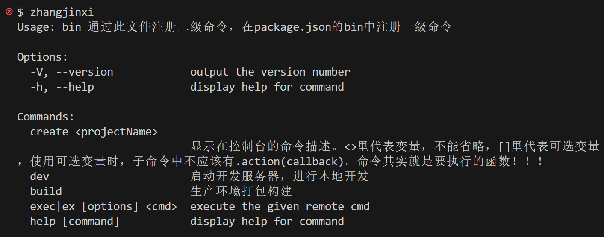
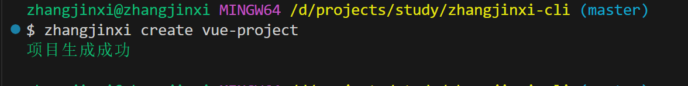
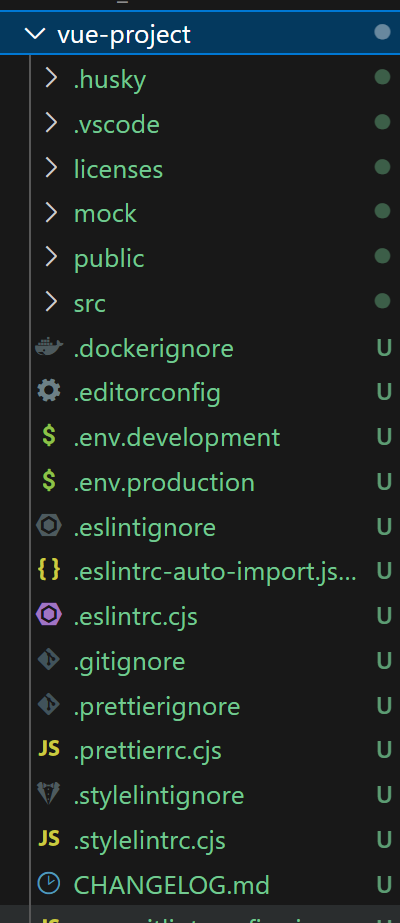

# 🏗️ 前端脚手架开发完全指南

> 脚手架是快速搭建项目的重要工具，通过系统化的开发流程，可以构建出功能完善、易于维护的前端脚手架工具。

## 🎯 脚手架开发流程

### 📦 引入相关模块

脚手架开发需要以下核心模块：

| 模块 | 功能 | 用途 |
|------|------|------|
| **commander** | 注册命令 | 🎮 构建命令行界面 |
| **download-git-repo** | 获取远程 git 仓库资源 | 📥 下载项目模板 |
| **child_process** | Node.js 子进程模块 | ⚙️ 执行 npm install 等命令 |
| **ora** | 控制台显示 loading | ⏳ 提供加载动画效果 |
| **semver** | 判断版本是否符合预期 | 📊 版本号管理 |
| **chalk** | 美化控制台输入 | 🎨 显示不同颜色文本 |

### 🔧 安装依赖

```bash
# 安装核心依赖
npm install commander --save
npm install download-git-repo --save
npm install chalk --save
npm install ora --save
npm install semver --save
```

### ⚠️ download-git-repo 踩坑指南

::: warning 🚨 常见错误及解决方案

**1. Error: 'git clone' failed with status 128**

**解决方案**: 地址要保证使用的是 HTTPS 模式，地址加前缀：
```bash
direct:https://github.com/username/XXX.git
```

**2. Error: 'git checkout' failed with status 1**

**解决方案**: 保证你拥有 master 分支（不指定分支的情况）。如果只有 main 分支，需要指定分支：
```bash
direct:https://github.com/username/XXX.git#main
```

**3. 国内码云访问问题**

- **码云**: 需要开启 `clone: true`，否则 403 错误
- **GitHub**: 需要 `clone: false`，否则 118 错误

```bash
direct:https://gitee.com/myPrettyCode/vue3-element-admin.git#master
```
:::

## 注册一级命令

把注册命令的文件`/bin/index.js`，在 package.json 文件里应 bin 属性里注册

`zhangjinxi` 即一级命令，控制台执行命令： `zhangjinxi create app-project`

```json
{
  "name": "zhangjinxi-cli",
  "version": "1.0.1",
  "description": "通过package.json中的bin字段，注册zhangjinxi总命令",
  "main": "./bin/index.js",
  "bin": {
    "zhangjinxi": "./bin/index.js"
  }
}
```

## 注册二级命令

使用 `command('rmdir <dir> [otherDirs...]')`方法注册命令

```js
const commander = require("commander");
const version = require("./package").version;
// 引入命令操作方法
const { create, dev, prod } = require("./commands");

/** 引入commander包
 * @version(version,'-V --version [myVar]', '选项描述信息') 用来显示
 * 版本号，不明确指出会隐式调用。可以使用version(version)简写形式
 * @command(<command> [options],description) 注册命令
 * @description(description) 命令描述
 * @usage() 显示命令的用途
 * @option('-m --myarg [myVar]', '选项描述信息') 显示命令选项
 * @action(callback) 执行命令的函数
 * @parse(process.argv) 解析控制台输入的参数
 */
commander
  .version(version)
  .usage(`通过此文件注册二级命令，在package.json的bin中注册一级命令`);

// 注册create命令
commander
  .command("create <projectName>")
  .description(
    "显示在控制台的命令描述。<>里代表变量，不能省略，[]里代表可选变量，使用可选变量时，子命令中不应该有.action(callback)。命令其实就是要执行的函数！！！"
  )
  .action(create);

// 注册dev命令
commander
  .command("dev")
  .description("启动开发服务器，进行本地开发")
  .action(dev);

// 注册build命令
commander.command("build").description("生产环境打包构建").action(prod);

// 注册 exec <cmd> 命令
program
  .command("exec <cmd>")
  .alias("ex")
  .description("execute the given remote cmd")
  .option("-e, --exec_mode <mode>", "Which exec mode to use")
  .option("-c, --cheese [type]", "指定类型：cheese [marble]", "marble")
  .action(function (cmd, options) {
    console.log('exec "%s" using %s mode', cmd, options.exec_mode);
  })
  // 监控输入--help的事件回调
  .on("--help", function () {
    console.log("");
    console.log("Examples:");
    console.log("");
    console.log("  $ deploy exec sequential");
    console.log("  $ deploy exec async");
  });

// 解析控制台输入的参数
commander.parse(process.argv);

//通过侦听command和option事件来执行自定义操作。
commander.on("option:cheese", function () {
  console.log("option:cheese:this.cheese- %s", this.cheese);
});

// error on unknown commands
commander.on("command:*", function () {
  console.error(
    "Invalid command: %s\nSee --help for a list of available commands.",
    commander.args.join(" ")
  );
  process.exit(1);
});
```

## 执行命令的操作

```js
#!/usr/bin/env node

const path = require("path");
const fs = require("fs");
const child_process = require("child_process");
const download = require("download-git-repo");
const ora = require("ora");
const webpack = require("webpack");
const WebpackDevServer = require("webpack-dev-server");
const { errorLog, successLog, underlineLog } = require("./utils");
const webpackConfig = require("./config/webpack.dev.config");
const webpackConfigProd = require("./config/webpack.prod.config");

// 执行prod命令：生产模式下打包构建
const prod = function prod() {
  webpack(webpackConfigProd, (err, stats) => {
    if (err) {
      errorLog(err);
      process.exit(1);
    }
    const compiler = webpack(webpackConfigProd);
    // 执行编译器run方法，开始项目打包构建
    compiler.run((err, stats) => {
      if (err) {
        errorLog(err);
        process.exit(1);
      }
      process.stdout.write(
        stats.toString({
          colors: true,
          modules: false,
          children: false,
          chunks: false,
          chunkModules: false,
        })
      );

      if (stats.hasErrors()) {
        errorLog("  Build failed with errors.\n");
        process.exit(1);
      }
      successLog("Build completed.");
    });
  });
};

// 执行dev命令：启动服务器，进行本地开发
const dev = function dev() {
  const compiler = webpack(webpackConfig);
  // 启动开发服务器
  const server = new WebpackDevServer(compiler, {
    contentBase: webpackConfig.devServer.contentBase,
    publicPath: webpackConfig.devServer.publicPath,
  });
  server.listen(webpackConfig.devServer.port, err => {
    if (err) {
      errorLog(err);
      process.exit(1);
    }
    console.log(
      `\nApp is running: ${underlineLog(
        `http://localhost:${webpackConfig.devServer.port}/`
      )}`
    );
  });
};

// 下载项目模板
const templateUrl =
  "direct:https://gitee.com/myPrettyCode/vue3-element-admin.git#master";
function downloadTemplate(appName) {
  return new Promise((resolve, reject) => {
    const spinner = ora("开始生成项目").start();

    /** download(repository, destination, options, callback) clone远程仓库到本地目录
     * @repository 这是你要下载的Git仓库的URL。它可以是GitHub、GitLab
     * 或Bitbucket等平台上的仓库地址。其他仓库需要用direct+url：
     * direct:https://gitee.com/myPrettyCode/vue3-element-admin.git#master
     * @destination 这是你想要下载并解压仓库内容的目标目录路径
     * @options
     *    clone 默认为true，表示使用git clone命令来下载仓库。设置为false时，
     * 会使用git archive命令，这可能会更快，但不包括.git目录。
     *    depth 如果clone为true，可以设置depth选项以进行浅克隆，即只获取最近的几次提交。
     *    progress 如果设置为true，则在下载过程中显示进度条。
     *    recursive 如果为true，则下载子模块。
     * @callback 在下载过程结束后被调用
     */
    download(templateUrl, `./${appName}`, { clone: true }, err => {
      spinner.stop();
      if (err) {
        return reject(err);
      }
      successLog("项目生成成功");
      resolve();
    });
  });
}

// 修改项目package.json中的name
function editPackageName(appName) {
  return new Promise((resolve, reject) => {
    const packageJsonPath = path.resolve(
      process.cwd(),
      `${appName}/package.json`
    );
    const packageJson = require(packageJsonPath);
    packageJson.name = appName;
    fs.writeFile(packageJsonPath, JSON.stringify(packageJson), err => {
      if (err) {
        return reject(err);
      }
      resolve();
    });
  });
}

// 下载依赖包
function installPackages(appName) {
  const appPath = path.resolve(process.cwd(), appName);
  return new Promise((resolve, reject) => {
    const spinner = ora("安装依赖包");
    spinner.start();
    // 使用child_process子进程，在新项目目录下执行，npm install命令
    child_process.exec("npm install", { cwd: appPath }, err => {
      spinner.stop();
      if (err) {
        return reject(err);
      }
      successLog("依赖包安装成功");
      console.log(`cd ${appName}`);
      console.log(`npm run start`);
      resolve();
    });
  });
}

const create = async function create(appName) {
  try {
    await downloadTemplate(appName); // 下载模板文件
    await editPackageName(appName); // 修改项目package.json项目名
    // await installPackages(appName); // 安装项目依赖
  } catch (err) {
    errorLog(err);
    process.exit(1);
  }
};

module.exports = {
  create,
  dev,
  prod,
};
```

演示：
查看命令：



生成模板文件：

