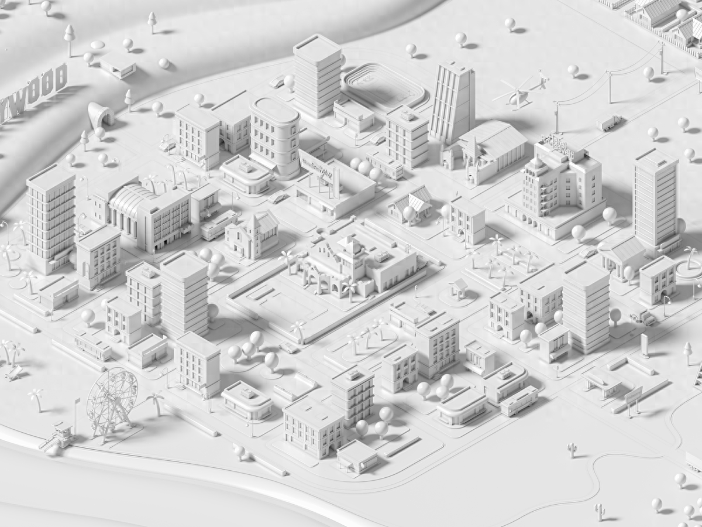
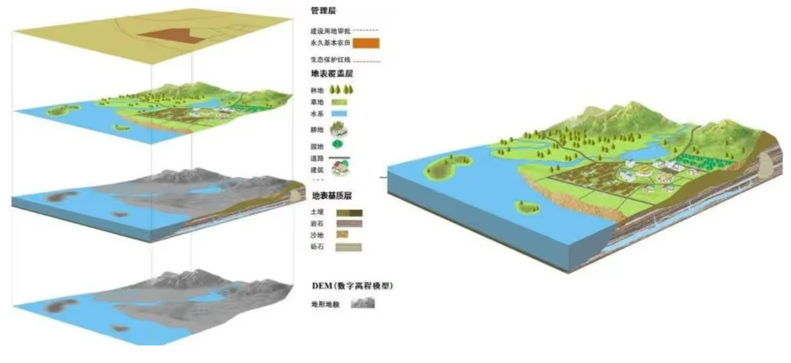
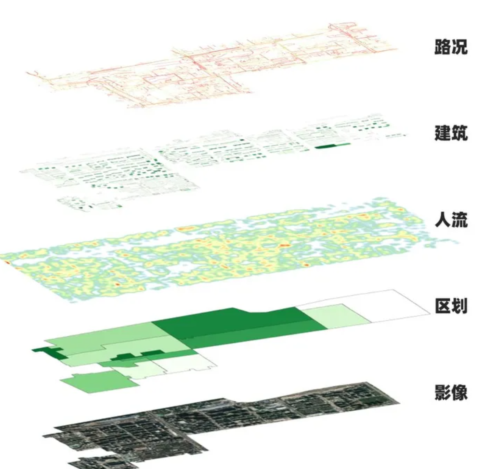
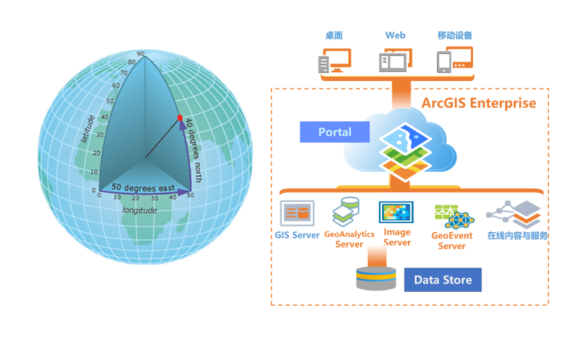
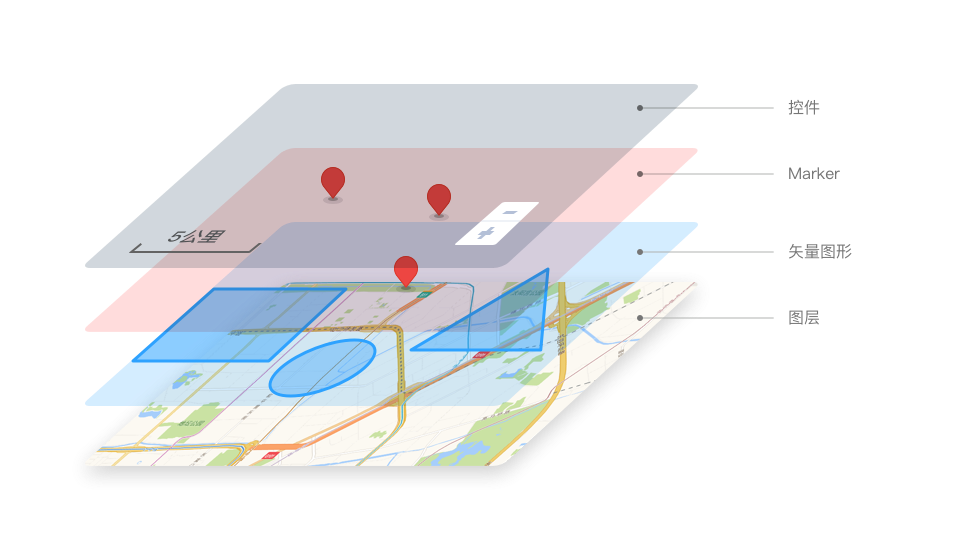
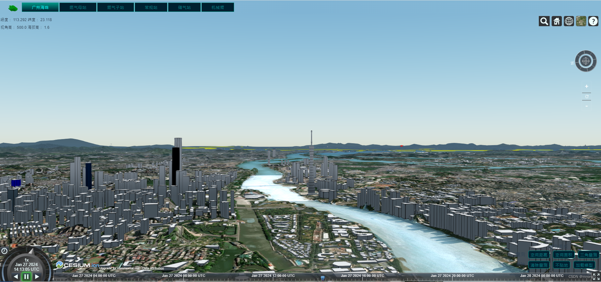

## Cesium 简介

Cesium 是一个基于 JavaScript 开发的 WebGL 三维地球和地图可视化库。它利用了现代 Web 技术，如 HTML5、WebGL 和 WebAssembly，来提供跨平台和跨浏览器的三维地理空间数据可视化，用于创建高性能的三维地球和地理可视化应用程序。它基于 WebGL 技术，可以在现代的 Web 浏览器上实现实时的、交互式的地球和地理数据可视化。

主要特点：

- 高性能：Cesium.js 使用 WebGL 来绘制图形，利用 GPU 加速，可以在现代的计算机和移动设备上实现高性能的地球渲染和数据可视化。
- 丰富的地理数据支持：Cesium.js 支持多种地理数据格式，包括地形数据、矢量数据、影像数据等，可以实现各种地理数据的加载、渲染和交互。
- 强大的可视化功能：Cesium.js 提供了丰富的可视化功能，包括地形渲染、矢量数据渲染、影像贴图、点线面符号化、动画效果等，开发者可以根据需求自定义和扩展可视化效果。

- 交互和导航控制：Cesium.js 提供了丰富的交互和导航控制功能，包括缩放、旋转、平移、倾斜等操作，可以让用户自由浏览和探索地球模型。
- 插件和扩展支持：Cesium.js 支持插件和扩展机制，开发者可以通过扩展来增加新的功能和效果，或者利用现有的插件来快速实现特定的需求。
- 跨平台、跨浏览器：无需额外插件，即可在多种操作系统和浏览器上运行。
- 多数据格式支持：除了常见的 GIS 数据格式外，CesiumJS 还支持 3D Tiles 格式，这是一种用于高效传输和渲染大规模三维模型的新标准，非常适合展示城市级别的三维场景。
- 开放源代码：作为一款开源软件，CesiumJS 的源代码完全公开，这不仅意味着开发者可以自由地使用它来构建商业项目，还可以根据需要对其进行修改和扩展。



Cesium.js 提供了丰富的功能和工具，使开发者能够轻松地构建各种类型的地理应用，包括地理信息系统（GIS）、地球科学、航空航天、军事模拟等。

- 地理信息系统（GIS）应用：Cesium.js 可以用于构建各种类型的 GIS 应用，包括地图浏览、地理数据可视化、地理分析等。它支持加载和渲染各种地理数据，如矢量数据、影像数据、地形数据等，可以实现地理数据的展示、查询、分析和编辑等功能。
- 地球科学研究：Cesium.js 可以用于地球科学领域的可视化和模拟研究。它支持加载和渲染地球表面的地形数据，可以实现地球模型的渲染和交互，帮助研究人员进行地质、气候、地震等方面的研究和分析。
- 航空航天应用：Cesium.js 可以用于航空航天领域的可视化和模拟应用。它支持加载和渲染航空航天数据，如卫星轨道数据、航线数据等，可以实现卫星和飞机的模拟和轨迹可视化，帮助研究人员和工程师进行航空航天相关的研究和设计。
- 军事模拟和训练：Cesium.js 可以用于军事模拟和训练应用。它支持加载和渲染军事数据，如地图数据、军事设施数据等，可以实现战场模拟和战术训练，帮助军事人员进行军事战略和战术的研究和演练。
- 虚拟现实和增强现实应用：Cesium.js 可以与虚拟现实（VR）和增强现实（AR）技术结合使用，实现沉浸式和交互式的地理可视化应用。通过 Cesium.js，开发者可以将地球模型和地理数据以 3D 形式呈现在虚拟现实设备或增强现实设备上，提供更加沉浸和真实的地理体验。

- 交通管理：用于模拟交通流量，进行交通规划和分析。
- 城市规划：辅助进行城市设计，展示城市规划的三维效果。
- 城市管理：帮助城市管理者进行城市监控和应急响应规划。
- 地形仿真：在军事和地质研究中模拟地形环境，进行战术训练和地质分析。
- 3D 地球可视化：Cesium 可以在 Web 浏览器中显示高度真实感的 3D 地球场景，包括地形、地表纹理、3D 建筑、水域等。
- 漫游和导航：Cesium 提供了多种漫游和导航方式，包括平移、旋转、缩放、倾斜、飞行、路径导航等。
- 地形和影像数据：Cesium 支持多种地形和影像数据格式，包括 GeoTIFF、Terrain（STK）、OpenStreetMap 等。
- 3D 建筑模型：Cesium 可以在地球上显示高精度的 3D 建筑模型，包括自动提取的模型和手工建模的模型。
- 3D Tiles：Cesium 支持 3D Tiles 技术，可以高效地加载和显示大规模的 3D 地球数据，包括城市、建筑、地形等。
- CZML：Cesium 支持 CZML（Cesium Language）数据格式，可以用来描述和显示动态的地球场景，比如航班轨迹、气象数据、卫星运行轨迹等。
- 实时位置追踪：Cesium 可以实时追踪地球上任意对象的位置和状态，比如船只、飞机、汽车等，支持多种位置追踪方式，包括 GPS、卫星通信等。
- 地下和空中场景：Cesium 支持地下和空中场景的显示，可以在地球表面下和空中显示更加复杂的场景。
- 天文数据：Cesium 支持显示天文数据，包括星图、卫星轨道、恒星位置等。
- 集成其他 GIS 工具：Cesium 可以与其他 GIS 工具集成，比如 ArcGIS、QGIS 等。

## 地图构成

麦克哈格认为分层地图应该按照时间先后排序，最原始的环境组成部分（例如岩石层）是第一层，接着往上叠加其他的图层（例如水、土壤、植被等）。











## Cesium.js 的使用

安装和配置：

```bash
#安装依赖
npm install cesium

# vite-plugin-cesium Vite插件
pnpm i cesium@1.99 vite-plugin-cesium

# 引入构建插件 :vite.config.js
import cesium from 'vite-plugin-cesium'
#添加到Vite插件列表里
{  plugins: [    vue(),    cesium()  ]}
```

项目中使用：

```js
//引入依赖
import Cesium from "cesium";

//定义要挂在的容器
<div id="cesiumContainer"></div>;

//指定要渲染的HTML元素，创建Cesium Viewer，用于渲染地球模型和地理数据
var viewer = new Cesium.Viewer("cesiumContainer", {
  // 使用世界地形
  terrainProvider: Cesium.createWorldTerrain({ requestWaterMask: true }),
  // 自定义地形图：url:地形数据的路径
  terrainProvider: Cesium.CesiumTerrainProvider({
    url: "path/to/terrainData",
  }),
  baseLayerPicker: false,
  // 使用二维地图的场景模式 设置terrainProvider : null,
  sceneMode: Cesium.SceneMode.SCENE2D,
});

// 将Viewer的初始视图设置在特定的位置
// 可以根据需要添加更多的功能，例如添加实体、图层、注记等
viewer.camera.setView({
  destination: Cesium.Cartesian3.fromDegrees(-75.175, 39.95, 20000000.0), // 纬度, 经度, 高度
});

// 加载和显示地理空间数据：load 方法加载 GeoJSON 文件
Cesium.GeoJsonDataSource.load("path/to/your/geojson/file.geojson").then(
  function (dataSource) {
    // 数据源添加到视图中
    viewer.dataSources.add(dataSource);
    // 自动调整视图以聚焦于加载的数据
    viewer.zoomTo(dataSource);
  }
);

// 在二维地图上添加图层
var imageryLayer = new Cesium.ImageryLayer(
  new Cesium.UrlTemplateImageryProvider({
    url: "https://your-tile-server-url/{z}/{x}/{y}.png",
  })
);
viewer.imageryLayers.add(imageryLayer);

// 要添加标记，可以使用 Cesium.Entity 类：
var entity = new Cesium.Entity({
  position: Cesium.Cartesian3.fromDegrees(-75.59777, 40.03883),
  point: { pixelSize: 10, color: Cesium.Color.RED },
  billboard: {
    image: "path/to/image.png", //标记的图片路径
    scale: 1.0,
  },
});
viewer.entities.add(entity);
```
