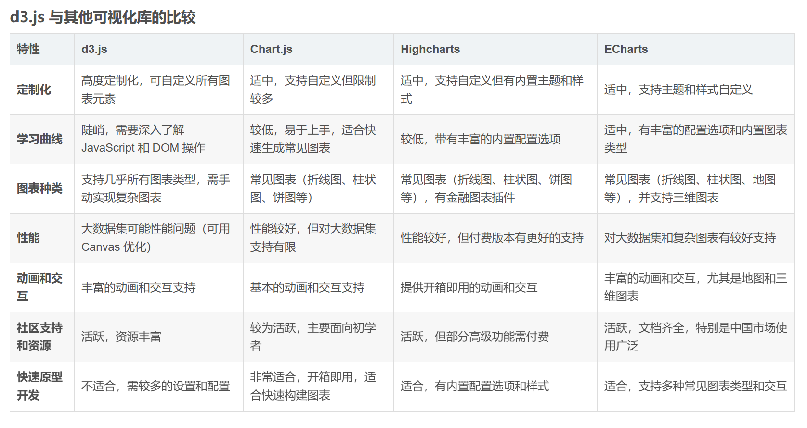
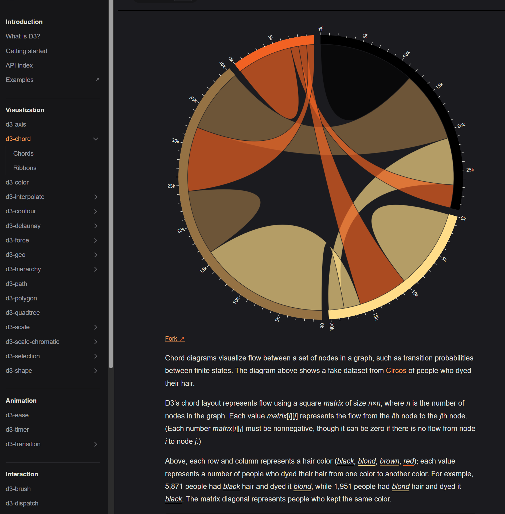

## D3简介
D3.js（Data-Driven Documents）是一个基于Web标准（HTML、SVG和CSS）的JavaScript库，它提供了将数据绑定到文档的元素上，并通过这些元素进行数据可视化的能力。D3.js的核心是SVG（可缩放矢量图形），它允许开发者创建高质量的矢量图形。特点：

- 数据绑定：D3.js允许将数据绑定到DOM元素上，这使得数据与视觉元素保持同步。

- 动态DOM更新：D3.js能够根据数据的变化动态地更新DOM结构，无需重新加载页面。

- 丰富的可视化元素：D3.js支持多种图表类型，如条形图、散点图、饼图、树状图等。

- 交互性：D3.js支持多种交互功能，如缩放、拖动、点击事件等。

参考：https://d3js.org/what-is-d3
## 语法
可以像jQuery一样，链式调用。

1. 选择元素
   1. select(selector) 选择匹配的第一个元素
   2. selectAll(selector) 选择所有匹配元素
2. 数据绑定
   1. datum(value) 选择集中的每一个元素绑定相同的数据value
   2. data([value]) 选择集中的每一个元素分别绑定数组 value 中的一项。
3. 比例尺。由三要素组成
   1. domain([0,10000]) 定义域
   2. range([0,100]) 值域
   3. 对应法则
4. 坐标轴。坐标轴是绘制图表经常用到组件，比如柱形图、折线图、散点图、气泡图等。坐标轴要与比例尺一起使用
   1. axisBottom(scale) 刻度在轴线的下方，必然是X轴
   2. axisRight(scale) 刻度在轴线的右侧，必然是Y轴
   3. axisTop(scale)
   4. axiaLeft(scale)
5. 转换：允许元素在添加、更新或移除时进行平滑的过渡
   1. transition()
   2. duration(432)
6. 地图投影projections:支持多种地图投影，可以用于将地理坐标转换为二维坐标。
   1. geo.mercator() 投影
   2. center([0,32]) 设置中心点
   3. translate([23,343]) 投影的平移
   4. scale(150) 缩放比例
```js
//选择 body 标签，添加 svg 元素，设置 svg 元素的宽度和高度为 500
let svg = d3.select('body')
.append('svg')
.attr('width',500)
.attr('height',500)

//线性比例尺： scaleLinear() 
let scaleX = d3.scaleLinear(domain,range)
.domain([0,10000]) //比例尺值域
.range([0,100]) // 比例尺刻度范围
.invert(value) //给定范围中的值，返回域中相应的值
.rangeRound(range)
.clamp(clamp)
.unknown(value)
.interpolate(interpolate)
.ticks(count)
.tickFormat(count,specifier)
.nice(count)
.copy()

let scaleY = d3.scaleLinear().domain([0,10000]).range([0,100])

// 定义坐标轴 ticks参数将传递给scale.ticks & scale.tickFormat
let axisX = d3.axisBottom(scaleX)
.scale(scale) // scale和tick都用于设置比例尺
.ticks(...args)
.tickArguments(arguments)
.tickValues(values)
.tickFormat(format)
.tickSize(size)
.tickSizeInner(size)
.tickSizeOuter(size)
.tickPaddiing(padding).
.offset(offset)
let axisY = d3.axisRigth(scaleY)

// 定义颜色
let c = d3.color("steelblue")
.opacity //获取&设置透明度
.rgb() // 格式化输入rgb
.copy(values) // 添加并复制颜色值
.brighter(k) //格式化输入颜色值
.displayable(1)
.formatHex()

// 颜色插值混合
d3.interpolateLab("steelblue", "brown")(0.5); // "rgb(142, 92, 109)"
const i = d3.interpolate({colors: ["red", "blue"]}, {colors: ["white", "black"]});


//svg添加坐标轴
svg.append('g').attr('class','axisX').call(axisX).attr('transform','translate(50,230)')
svg.append('g').attr('class','axisY').call(axisY).attr('transform',"translate(50,0)")

// 转换
circles.transition()
  .duration(750)
  .attr("cx", function(d) { return d * 10 + 50; });

// 地图投影
var projection = d3.geo.mercator()
    .center([0, 30]) // 设置中心点
    .translate([width / 2, height / 2]) // 设置投影的平移
    .scale(150); // 设置缩放比例
var path = d3.geo.path().projection(projection);

// 交互 支持与用户交互，如点击、悬停等事件。
svg.selectAll("circle")
  .on("mouseover", function() {
    // 鼠标悬停时的操作
  })
  .on("click", function() {
    // 点击时的操作
  });

//提供了多种布局算法，如树状图、力导向图、饼图等。
var tree = d3.layout.tree()
    .size([height, width - 150]);

var diagonal = d3.svg.diagonal()
    .source(function(d) { return d.source; })
    .target(function(d) { return d.target; });

//提供了丰富的插值函数，用于在动画中平滑地过渡属性值
circles.transition()
  .attr("r", function(d) { return d * 10; })
  .attr("fill", d3.interpolate("red", "blue")); // 在红色和蓝色之间插值
```
## 创建柱形图
```html
<!DOCTYPE html>
<html>
<head>
    <script src="https://d3js.org/d3.v6.min.js"></script>
</head>
<body>
<script>
    // 准备数据
    var data = [120, 200, 150, 80, 70, 110, 130];
 
    // 设置图表的尺寸
    var margin = { top: 20, right: 20, bottom: 30, left: 40 };
    var width = 600 - margin.left - margin.right;
    var height = 300 - margin.top - margin.bottom;
 
    // 创建SVG容器
    var svg = d3.select('body')
        .append('svg')
        .attr('width', width + margin.left + margin.right)
        .attr('height', height + margin.top + margin.bottom)
        .append('g')
        .attr('transform', 'translate(' + margin.left + ',' + margin.top + ')');
 
    // 缩放和比例
    var x = d3.scaleBand()
        .domain(d3.range(data.length))
        .rangeRound([0, width])
        .padding(0.1);
 
    var y = d3.scaleLinear()
        .domain([0, d3.max(data)])
        .rangeRound([height, 0]);
 
    // 绘制条形
    svg.selectAll('.bar')
        .data(data)
        .enter()
        .append('rect')
        .attr('class', 'bar')
        .attr('x', function(d, i) { return x(i); })
        .attr('y', function(d) { return y(d); })
        .attr('width', x.bandwidth())
        .attr('height', function(d) { return height - y(d); });
 
    // 添加轴
    svg.append('g')
        .attr('class', 'axis')
        .attr('transform', 'translate(0,' + height + ')')
        .call(d3.axisBottom(x));
 
    svg.append('g')
        .attr('class', 'axis')
        .call(d3.axisLeft(y).ticks(null, 's'))
        .append('text')
        .attr('x', -2)
        .attr('y', y(y.ticks().pop()) + 0.5f)
        .attr('dy', '0.32em')
        .attr('fill', '#000')
        .attr('font-weight', 'bold')
        .attr('text-anchor', 'start')
        .text('Value');
</script>
</body>
</html>
```
## 比较

chord 图表的布局示例：
