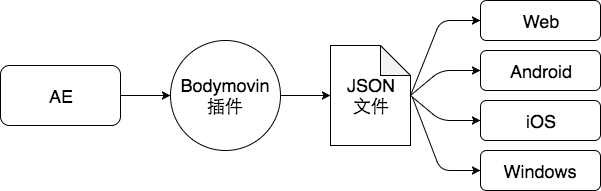
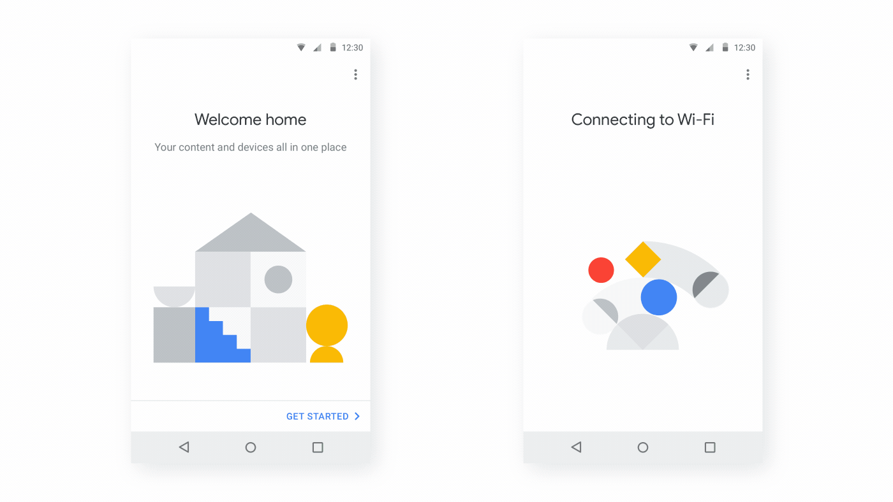

## Lottie 简介

Lottie 是一个适用于 Android、iOS、Web 和 Windows 的库，它使用 Bodymovin 解析导出为 JSON 的 Adobe After Effects 动画，并在移动设备和 Web 上本地呈现它们！



设计师用 AE 把动画效果做出来，再用 Bodymovin 导出相应地 json 文件给到前端，前端使用 Lottie 库就可以实现动画效果，无需费力地手动重新创建。功能简单且强大。为什么选择 Lottie：

- GIF 的大小是 bodymovin JSON 的两倍多，并且以固定大小呈现，无法放大以匹配大型高密度屏幕。
- Png 甚至比 gif 更糟糕，因为它们的文件大小通常是 bodymovin JSON 大小的 30-50 倍，而且也无法放大。
- 动画矢量可绘制对象（仅限 Android）。性能更高，因为它运行在 RenderThread 而不是主线程上。仅支持 Lottie 功能的子集。无法手动设置进度。不支持文本或动态颜色。无法以编程方式或通过 Internet 加载。




```bash
# 安装依赖
npm install lottie-web

# vue版本依赖
npm install --save vue-lottie
```

使用 Lottie：

```js
// 使用lottie容器
<div id='lottie'></div>

// 使用声明式：lottie.loadAnimation() 加载 .lottie 容器
<div
 style="width:1067px;height:600px"
 class="lottie"
 data-animation-path="animation/"
 data-anim-loop="true"
 data-name="ninja"></div>

// 使用vue-lottie
<Lottie :options="{animationData}" :height="400" :width="400" v-on:animCreated="handleAnimation"/>

import Lottie from 'vue-lottie';
import * as animationData from './assets/pinjump.json';

function handleAnimation(anim) {
  anim.play();
  anim.stop();
}

import lottie from 'lottie-web'

// 返回可以使用 play、pause、setSpeed 等控制的动画实例。
var anim = lottie.loadAnimation({
  // 要渲染动画的 DOM 元素，Required
  container: document.getElementById('lottie'),
  // 包含导出的动画数据的 Object。
  animationData,
  // 动画对象的相对路径。（animationData 和 path 是互斥的）
  path: 'data.json',
  // 'svg' / 'canvas' / 'html' 来设置渲染器 Required
  renderer: 'svg/canvas/html',
  rendererSettings: {
    // 使用现有的画布进行绘制
    context: canvasContext,
    scaleMode: 'noScale',
    clearCanvas: false,
    // svg可用：在需要时加载dom元素。加快大量元素的初始化速度。
    progressiveLoad: false,
    // svg可用：当透明度为0时隐藏元素
    hideOnTransparent: true
  },
  loop: true, // Optional
  // 准备好后立即开始播放
  autoplay: true,
  // 动画名称以供将来参考
  name: "Hello World",
})

// 声明式属性
anim.isStopped:boolean //停止动画
anim.isPaused:boolean //暂停动画
anim.eventListeners?: readonly EventListener[] //监听事件数组
anim.speed?: number //速度
anim.direction?: number //方向
anim.style?: CSSProperties //css属性
anim.width?: number | string //动画宽度
anim.height?: number | string //动画高度


// 实例方法
anim.play()
anim.stop()
anim.pause()

//在 url 没有符号的 safari 中遇到掩码问题时
anim.setLocationHref(locationHref)
anim.setSpeed(speed) // 一个参数:速度 （1 为正常速度）
// 一个参数:方向 （1 是法线方向）
anim.setDirection(direction)

// 用于定义 first param 的时间或帧
anim.goToAndStop(value， isFrame)
// 用于定义 first param 的时间或帧
anim.goToAndPlay(value， isFrame)

//第一个参数是单个数组或多个数组，每个数组有两个值（fromFrame，toFrame），第二个参数是布尔值，用于立即强制新段落
anim.playSegments(segments， forceFlag)
//如果为 false，则遵循原始的 AE fps。如果为 true，它将尽可能多地更新。默认为 true
anim.setSubframe(flag)
anim.destroy()

// 事件
anim.addEventListener('complete',()=>{/**完成时 */})
anim.addEventListener('loopComplete',()=>{/**当前循环完成 */})
anim.addEventListener('enterFrame',()=>{/**进入页面触发 */})
anim.addEventListener('loaded_images',()=>{/**图片加载完毕 */})
anim.addEventListener('config_ready',()=>{/**初始配置完成后 */})
anim.addEventListener('data_ready',()=>{/**当动画的所有部分都已加载时 */})
anim.addEventListener('DOMLoaded',()=>{/**当元素已添加到 DOM 时*/})
anim.addEventListener('segmentStart',()=>{/**动画片段初始*/})
anim.addEventListener('destroy',()=>{/** 销毁时*/})

// Lottie 静态方法：
lottie.play([animationName])
lottie.stop([animationName])

lottie.setSpeed(speed)
lottie.setDirection(direction)

lottie.searchAnimations() //查找类为 “lottie” 的元素
lottie.loadAnimation() //返回要单独控制的 Animation 实例。
lottie.destroy()// 销毁和释放资源。DOM 元素将被清空。
lottie.resize([animationName]) // 对动画尺寸进行重新加载

//必须具有指向 data.json url 的 “data-animation-path” 属性
lottie.registerAnimation()

//默认为 'high'，设置 'high'、'medium'、'low'
lottie.setQuality()
```
