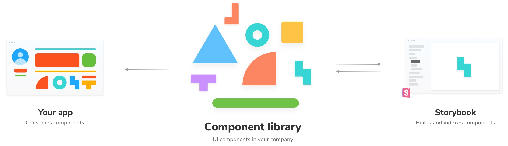
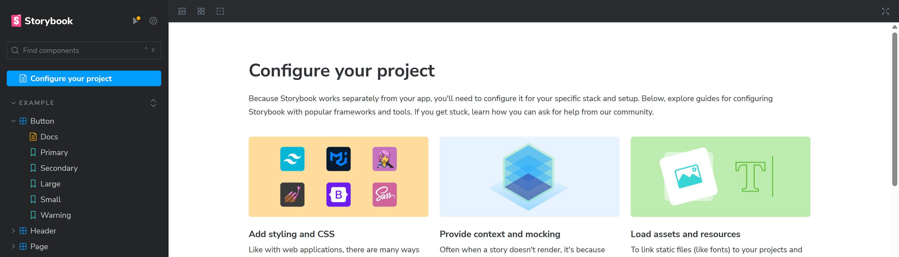

## Storybook 简介

使用 Storybook 进行可视化组件测试是非常简单和友好的。

- 易于编写测试：Storybook 采用与典型网络应用程序相同的方式渲染组件，从而简化了编写测试和用例（称为 "故事"）的过程。这种方法允许使用类似 Playwright 的 Jest 语法对每个组件进行直接、孤立的测试，同时提供组件行为的实时可视化。

- 组件文档：组件的输入和输出属性都有详细的文档说明，而且可以通过 Storybook 用户界面方便地进行修改。任何修改都会立即生效，组件会根据其属性输入进行渲染。

- 实时交互：由于属性可以修改、组件可以渲染和交互，我们还可以查看组件触发的所有事件（输出）。

- 调试（Debugging）：使用 Interactions 选项卡中提供的前后箭头，一步步进行测试非常简单。我们还提供了正常的浏览器开发工具用于调试。
- 模拟（Mocking）API：你可以选择让 API 调用以正常方式执行，也可以对其进行模拟。
- 无头执行（Headless execution）：在开发和调试过程中，所有这些测试都可以在浏览器上运行，这非常方便，但你很可能希望在 CI 管道中通过命令行运行测试。@storybook/test-runner （https://github.com/storybookjs/test-runner）库提供所需的一切。

- 并行运行（Parallel runs）：Storybook 的测试运行库开箱即支持并行化。

- 测试覆盖率：如果在运行测试时使用--coverage 标志，Storybook 的测试运行库会为测试生成 lcov 报告。然后，我们使用 istanbul-merge （https://github.com/ljharb/istanbul-merge）将此报告与其他测试覆盖率报告合并，以提供统一的报告。

- 控制台日志：Storybook 的测试运行库会在终端显示所有浏览器控制台日志。这有助于调试可能只在管道中失败的测试。



## 使用 storybook

启动命令:

```bash
#安装基于vue3+vite版本的storybook
npm install --save-dev @storybook/vue3-vite
npm install --save-dev @storybook/vue3

#初始化storybook项目
npx storybook@latest init

#更新storybook版本
npx storybook@latest upgrade

#启动storybook命令
npm run storybook
```

就会在浏览器加载出一个页面，类似这种:



## 创建`.storybook/main.js`文件

```ts
import type { StorybookConfig } from "@storybook/vue3-vite";

const config: StorybookConfig = {
  framework: {
    name: "@storybook/vue3-vite",
    // frameword 的builder配置项
    options: {
      docgen: {
        // 组件数据来源
        plugin: "vue-docgen-api" | "vue-component-meta",
        // 覆盖默认ts配置
        tsconfig: "tsconfig.app.json",
      },
    },
  },
  stories: ["../src/components/**/*.stories.js"],
  staticDirs: ["../public"],
  addons: [
    "@storybook/addon-links",
    "@storybook/addon-essentials",
    "@storybook/addon-interactions",
  ],
  core: {
    builder: "@storybook/builder-webpack5",
  },
  features: {
    interactionsDebugger: true,
  },
};

export default config;
```

## 扩展 Vue 应用

新增`.storybook/preview.js|ts`文件：

```js
import { setup } from "@storybook/vue3";
import "../src/index.css";
setup(app => {
  app.use(MyPlugin);
  app.component("my-component", MyComponent);
  app.mixin({
    // My mixin
  });
});

// 控制 Storybook 功能和插件的行为：配置 actions （模拟回调）如何被处理
export const parameters = {
  actions: { argTypesRegex: "^on[A-Z].*" },
  controls: {
    matchers: {
      color: /(background|color)$/i,
      date: /Date$/,
    },
  },
};
```

## 创建 vue 组件

src/components/Task.vue:

```vue
<template>
  <div :class="classes">
    <label
      :for="'checked' + task.id"
      :aria-label="'archiveTask-' + task.id"
      class="checkbox">
      <input
        type="checkbox"
        :checked="isChecked"
        disabled
        :name="'checked' + task.id"
        :id="'archiveTask-' + task.id" />
      <span class="checkbox-custom" @click="archiveTask" />
    </label>
    <label :for="'title-' + task.id" :aria-label="task.title" class="title">
      <input
        type="text"
        readonly
        :value="task.title"
        :id="'title-' + task.id"
        name="title"
        placeholder="Input title" />
    </label>
    <button
      v-if="!isChecked"
      class="pin-button"
      @click="pinTask"
      :id="'pinTask-' + task.id"
      :aria-label="'pinTask-' + task.id">
      <span class="icon-star" />
    </button>
  </div>
</template>

<script>
import { reactive, computed } from "vue";

export default {
  // eslint-disable-next-line vue/multi-word-component-names
  name: "Task",
  props: {
    task: {
      type: Object,
      required: true,
      default: () => ({ id: "", state: "", title: "" }),
      validator: task => ["id", "state", "title"].every(key => key in task),
    },
  },
  emits: ["archive-task", "pin-task"],

  setup(props, { emit }) {
    props = reactive(props);
    return {
      classes: computed(() => ({
        "list-item TASK_INBOX": props.task.state === "TASK_INBOX",
        "list-item TASK_PINNED": props.task.state === "TASK_PINNED",
        "list-item TASK_ARCHIVED": props.task.state === "TASK_ARCHIVED",
      })),
      /**
       * Computed property for checking the state of the task
       */
      isChecked: computed(() => props.task.state === "TASK_ARCHIVED"),
      /**
       * Event handler for archiving tasks
       */
      archiveTask() {
        emit("archive-task", props.task.id);
      },
      /**
       * Event handler for pinning tasks
       */
      pinTask() {
        emit("pin-task", props.task.id);
      },
    };
  },
};
</script>
```

## 创建组件对应 story

src/components/Task.stories.js

```js
// 引入需要测试的组件
import Task from "./Task.vue";
import fetch from "node-fetch";
import { action } from "@storybook/addon-actions";

//告诉 Storybook 我们正在文档化的组件
export default {
  component: Task, // 组件本身
  //👇story 本身需要但是不用在 Storybook 应用中渲染的信息
  excludeStories: /.*Data$/,
  //title对应了页面上左侧的菜单，会根据/自动分级
  title: "Task",
  //👇 在每个 story 中具体说明 args 的行为
  argTypes: {
    onPinTask: {},
    onArchiveTask: {},
  },
};

// 创建 Storybook UI 的 actions 面板被点击时显示的回调
export const actionsData = {
  onPinTask: action("pin-task"),
  onArchiveTask: action("archive-task"),
};
// args 在不重启 Storybook 的前提下实时编辑组件
const Template = args => ({
  components: { Task },
  setup() {
    return { args, ...actionsData };
  },
  template: '<Task v-bind="args" />',
});

// Story :根据给定的状态返回已渲染元素的函数---就像是函数式组件。
export const Default = Template.bind({});
Default.args = {
  task: {
    id: "1",
    title: "Test Task",
    state: "TASK_INBOX",
  },
};

export const Pinned = Template.bind({});
Pinned.args = {
  task: {
    ...Default.args.task,
    state: "TASK_PINNED",
  },
};

export const Archived = Template.bind({});
Archived.args = {
  task: {
    ...Default.args.task,
    state: "TASK_ARCHIVED",
  },
};

//补充story：也可以是个对象，useLabel则会作为页面上的菜单名称显示出来
export const useLabel = {
  // 组件props
  args: {
    label: "天下无贼",
    textColor: "red",
    onClick: fn(),
  },
  argTypes: {
    textColor: { control: "color" },
  },
  // 通过storybook提供的loader来加载远程数据
  loaders: [
    async () => ({
      todo: await (
        await fetch("https://jsonplaceholder.typicode.com/todos/1")
      ).json(),
    }),
  ],
  // storybook提供了对组件进行单元测试的方法，即:play属性
  play: async function ({ canvasElement }) {
    const canvas = within(canvasElement);
    // 选取到textContent为"default:card"的div,这里指的是组件本身
    const labelDiv = canvas.getByText("default:card", {
      selector: "div",
    });
    // 用expect断言测试是否有对应的style
    await expect(labelDiv).toHaveStyle({ color: "rgb(255, 0, 0)" });
  },
  // 在meta data中可以添加decorator来嵌套组件
  decorators: [
    Story => (
      <div style={{ border: "1px solid red" }}>
        <Story />
      </div>
    ),
  ],
};
```

<iframe width="100%" height="500" src="storybook.mp4" title="markdown video player" frameborder="0" allow="accelerometer; autoplay; clipboard-write; encrypted-media; gyroscope; picture-in-picture" allowfullscreen></iframe>

## 合成组件 TaskList

上面 Task 组件的父组件 TaskList 组件：src/components/TaskList.vue

```vue
<template>
  <div class="list-items">
    <template v-if="loading"> loading </template>
    <template v-else-if="isEmpty"> empty </template>
    <template v-else>
      <Task
        v-for="task in tasks"
        :key="task.id"
        :task="task"
        @archive-task="onArchiveTask"
        @pin-task="onPinTask" />
    </template>
  </div>
</template>

<script>
import Task from "./Task";
import { reactive, computed } from "vue";

export default {
  name: "TaskList",
  components: { Task },
  props: {
    tasks: { type: Array, required: true, default: () => [] },
    loading: { type: Boolean, default: false },
  },
  emits: ["archive-task", "pin-task"],

  setup(props, { emit }) {
    props = reactive(props);
    return {
      isEmpty: computed(() => props.tasks.length === 0),
      /**
       * Event handler for archiving tasks
       */
      onArchiveTask(taskId) {
        emit("archive-task", taskId);
      },
      /**
       * Event handler for pinning tasks
       */
      onPinTask(taskId) {
        emit("pin-task", taskId);
      },
    };
  },
};
</script>
```

## TaskList 的测试状态

src/components/TaskList.stories.js

```js
import { app } from "@storybook/vue3";
import { createPinia } from "pinia";
app.use(createPinia());

import TaskList from "./TaskList.vue";

import * as TaskStories from "./Task.stories";

export default {
  component: TaskList,
  title: "TaskList",
  //Decorators - 装饰器 提供了一种任意包装 story 的方法
  decorators: [
    () => ({ template: '<div style="margin: 3em;"><story/></div>' }),
  ],
  argTypes: {
    onPinTask: {},
    onArchiveTask: {},
  },
};

const Template = args => ({
  components: { TaskList },
  setup() {
    return { args, ...TaskStories.actionsData };
  },
  template: '<TaskList v-bind="args" />',
});

export const Default = Template.bind({});
Default.args = {
  // Shaping the stories through args composition.
  // The data was inherited from the Default story in task.stories.js.
  tasks: [
    { ...TaskStories.Default.args.task, id: "1", title: "Task 1" },
    { ...TaskStories.Default.args.task, id: "2", title: "Task 2" },
    { ...TaskStories.Default.args.task, id: "3", title: "Task 3" },
    { ...TaskStories.Default.args.task, id: "4", title: "Task 4" },
    { ...TaskStories.Default.args.task, id: "5", title: "Task 5" },
    { ...TaskStories.Default.args.task, id: "6", title: "Task 6" },
  ],
};

export const WithPinnedTasks = Template.bind({});
WithPinnedTasks.args = {
  // Shaping the stories through args composition.
  // Inherited data coming from the Default story.
  tasks: [
    ...Default.args.tasks.slice(0, 5),
    { id: "6", title: "Task 6 (pinned)", state: "TASK_PINNED" },
  ],
};

export const Loading = Template.bind({});
Loading.args = {
  tasks: [],
  loading: true,
};

export const Empty = Template.bind({});
Empty.args = {
  // Shaping the stories through args composition.
  // Inherited data coming from the Loading story.
  ...Loading.args,
  loading: false,
};
```

参考：https://storybook.js.org/tutorials/intro-to-storybook/vue/zh-CN/data/
