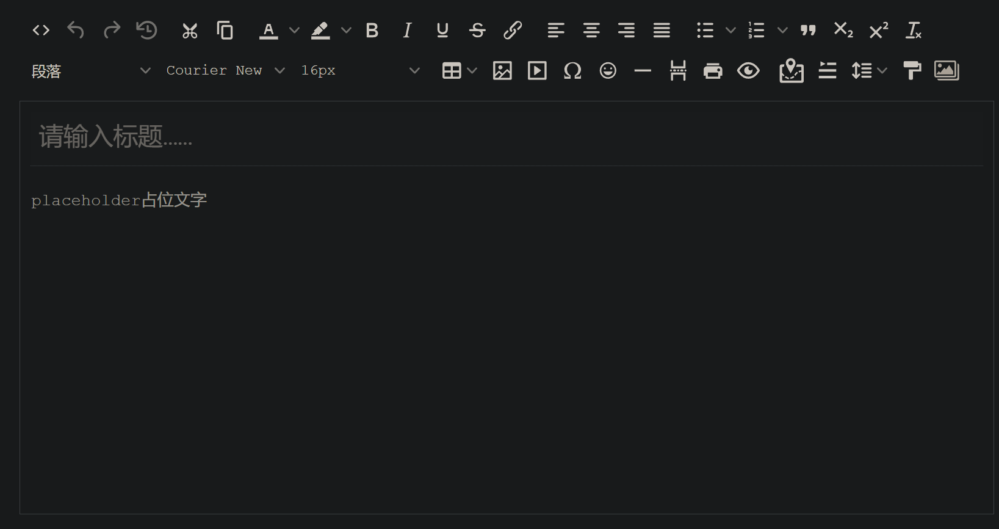
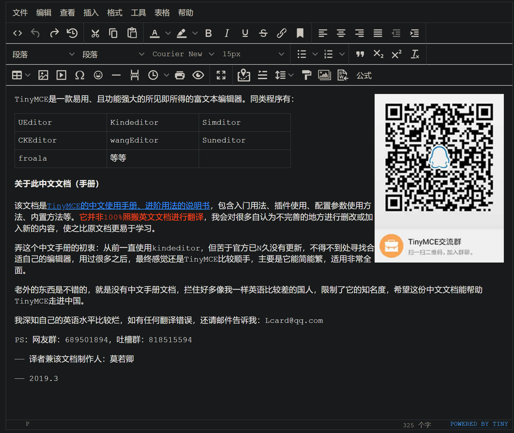
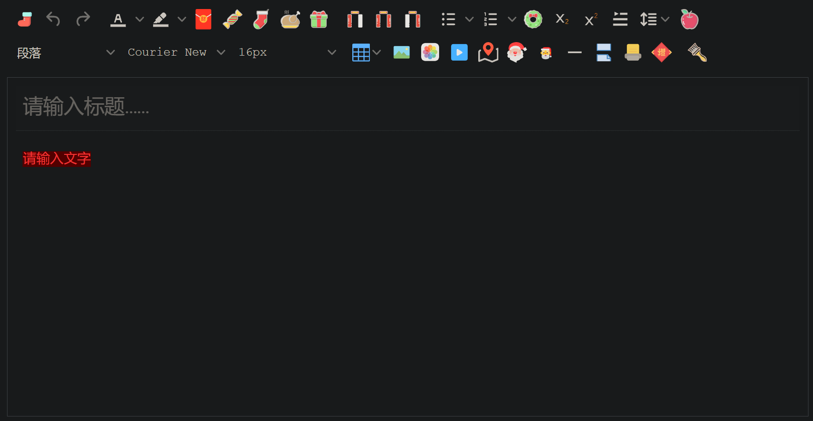

## TinyMCE简介
TinyMCE是一款易用、且功能强大的所见即所得的富文本编辑器。同类程序有：UEditor、Kindeditor、Simditor、CKEditor、wangEditor、Suneditor、froala等等。配置项非常多，参考：http://tinymce.ax-z.cn/

TinyMCE的优势：

- 开源可商用，基于LGPL2.1
- 插件丰富，自带插件基本涵盖日常所需功能
- 接口丰富，可扩展性强，有能力可以无限拓展功能
- 界面好看，符合现代审美
- 提供经典、内联、沉浸无干扰三种模式
- 对标准支持优秀（自v5开始）
- 多语言支持，官网可下载几十种语言。

## 内联模式
内联模式最大的好处，是内容完全继承自外层定义的样式，真正实现了"所见即所得"。但要注意，请小心使用杀伤力比较大的自定义CSS，因为这样可能会覆盖TinyMCE控件的CSS，导致编辑器显示异常

```js
tinymce.init({
    selector: '#tinydemo', //容器，可使用css选择器
    language:'zh_CN', //调用放在langs文件夹内的语言包
    toolbar: false, //隐藏工具栏
    menubar: false, //隐藏菜单栏
    inline: true, //开启内联模式
    plugins: [ 'quickbars','link','table' ], //选择需加载的插件
    //选中时出现的快捷工具，与插件有依赖关系
    quickbars_selection_toolbar: 'bold italic forecolor | link blockquote quickimage',
});
```
## 经典模式
下方是几乎开启全部功能的经典模式：

```js
tinymce.init({
    selector: '#tinydemo2',
    width:600,
    height:800,
    min_height: 400,
    //skin:'oxide-dark', 设置皮肤
    language:'zh_CN',
    //显示隐藏状态栏
    statusbar: false,
    //指定哪些一级菜单显示，或调整菜单顺序。
    menubar: 'file edit insert view format table tools help',
    //指定菜单栏及下拉菜单上放置的项目
    menu: {
        file: {title: '文件', items: 'newdocument'},
        edit: {title: '编辑', items: 'undo redo | cut copy paste pastetext | selectall'},
        insert: {title: '插入', items: 'link media | template hr'},
        view: {title: '查看', items: 'visualaid'},
        format: {title: '格式', items: 'bold italic underline strikethrough superscript subscript | formats | removeformat'},
        table: {title: '表格', items: 'inserttable tableprops deletetable | cell row column'},
        tools: {title: '工具', items: 'spellchecker code'}
    },
    // 当tinymce检测到当前环境为移动设备时，该参数允许你配置在移动设备生效配置参数
     mobile: {
        plugins: [ 'autosave', 'lists', 'autolink' ],
        toolbar: [ 'undo', 'bold', 'italic', 'styleselect' ]
    },
    // 自定义图标baseURL/icons/custom/icons.js
    icons_url: '/icons/custom/icons.js', // load icon pack
    icons: 'custom', 
    // 插件配置
    plugins: 'print preview searchreplace autolink directionality visualblocks visualchars fullscreen image link media template code codesample table charmap hr pagebreak nonbreaking anchor insertdatetime advlist lists wordcount imagetools textpattern help emoticons autosave bdmap indent2em autoresize formatpainter axupimgs',
    // 工具栏配置
    toolbar: 'code undo redo restoredraft | cut copy paste pastetext | forecolor backcolor bold italic underline strikethrough link anchor | alignleft aligncenter alignright alignjustify outdent indent | \
    styleselect formatselect fontselect fontsizeselect | bullist numlist | blockquote subscript superscript removeformat | \
    table image media charmap emoticons hr pagebreak insertdatetime print preview | fullscreen | bdmap indent2em lineheight formatpainter axupimgs',
    /*content_css: [ //可设置编辑区内容展示的css，谨慎使用
        '/static/reset.css',
        '/static/ax.css',
        '/static/css.css',
    ],*/
    fontsize_formats: '12px 14px 16px 18px 24px 36px 48px 56px 72px',
    font_formats: '微软雅黑=Microsoft YaHei,Helvetica Neue,PingFang SC,sans-serif;苹果苹方=PingFang SC,Microsoft YaHei,sans-serif;宋体=simsun,serif;仿宋体=FangSong,serif;黑体=SimHei,sans-serif;Arial=arial,helvetica,sans-serif;Arial Black=arial black,avant garde;Book Antiqua=book antiqua,palatino;',
    link_list: [
        { title: '预置链接1', value: 'http://www.tinymce.com' },
        { title: '预置链接2', value: 'http://tinymce.ax-z.cn' }
    ],
    image_list: [
        { title: '预置图片1', value: 'https://www.tiny.cloud/images/glyph-tinymce@2x.png' },
        { title: '预置图片2', value: 'https://www.baidu.com/img/bd_logo1.png' }
    ],
    image_class_list: [
    { title: 'None', value: '' },
    { title: 'Some class', value: 'class-name' }
    ],
    importcss_append: true,
    //自定义文件选择器的回调内容
    file_picker_callback: function (callback, value, meta) {
        if (meta.filetype === 'file') {
          callback('https://www.baidu.com/img/bd_logo1.png', { text: 'My text' });
        }
        if (meta.filetype === 'image') {
          callback('https://www.baidu.com/img/bd_logo1.png', { alt: 'My alt text' });
        }
        if (meta.filetype === 'media') {
          callback('movie.mp4', { source2: 'alt.ogg', poster: 'https://www.baidu.com/img/bd_logo1.png' });
        }
    },
    //给相对路径指定它所相对的基本路径
    images_upload_base_path: '/demo',
    //指定一个接受上传文件的后端处理程序地址
    images_upload_url: '/demo/upimg.php',
    //自定义图片上传逻辑
    images_upload_handler: function (blobInfo, succFun, failFun) {
        var xhr, formData;
        var file = blobInfo.blob();//转化为易于理解的file对象
        xhr = new XMLHttpRequest();
        xhr.withCredentials = false;
        xhr.open('POST', '/demo/upimg.php');
        xhr.onload = function() {
            var json;
            if (xhr.status != 200) {
                failFun('HTTP Error: ' + xhr.status);
                return;
            }
            json = JSON.parse(xhr.responseText);
            if (!json || typeof json.location != 'string') {
                failFun('Invalid JSON: ' + xhr.responseText);
                return;
            }
            succFun(json.location);
        };
        formData = new FormData();
        formData.append('file', file, file.name );//此处与源文档不一样
        xhr.send(formData);
    },
    toolbar_sticky: true,
    autosave_ask_before_unload: false,
});
```
## 自定义UI


## 使用方法

```html
<!-- 引入脚本-->
<script src='tinymce.min.js'></script>

<!--定义TinyMEC容器节点-->
<form method="post">
    <textarea id="mytextarea">
      当form提交时，TinyMCE会将内容塞进textarea，你可以通过正常的post方法获取到编辑器中的内容，行为与普通textarea完全一致。
    </textarea>
</form>

<!--将TinyMCE初始化为页面的一部分-->
<script>
tinymce.init({
  selector: '#mytextarea'
});
</script>
```