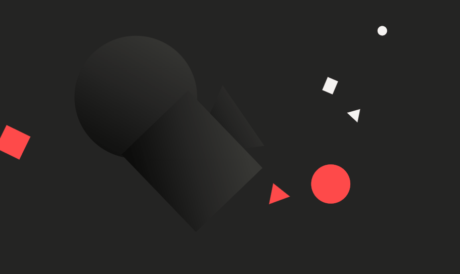
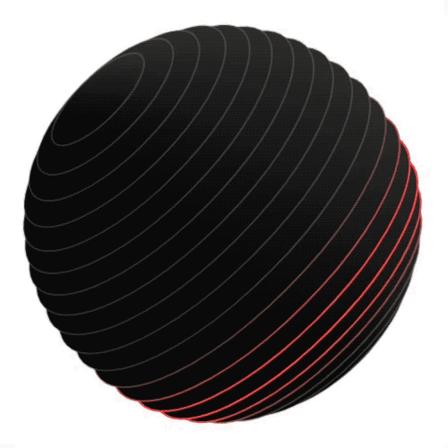

## Anime.js 简介

一个轻量级的 JavaScript 动画库，使用简单且功能强大的 API。





Anime.js 的核心功能包括：

- CSS 属性动画：支持对 CSS 属性进行动画处理，如颜色、位置、大小等。
- SVG 动画：能够对 SVG 元素进行动画处理，支持路径动画、形状变换等。
- DOM 属性动画：可以对 DOM 元素的属性进行动画处理，如文本内容、类名等。
- JavaScript 对象动画：支持对 JavaScript 对象的属性进行动画处理，适用于更复杂的动画需求。
- 时间轴控制：提供时间轴功能，允许用户创建复杂的动画序列，并进行精细的控制。
- 回调和Promise：支持动画运动过程的回调函数，以及基于Promise的动画控制。
```html
<!-- 安装依赖包 V4版本 -->
$ npm install animejs --save

<!-- 或者引入js包 -->
<script src="anime.min.js"></script>
```

## Anime.js 使用

```js
<div class="selector">anime 动画节点</div>
<div class="selector">anime 动画节点</div>

// V4版本支持按需引入
import {
  animate,
  createTimer,
  createTimeline,
  engine,
  eases,
  spring,
  defaults,
  stagger,
  utils,
  svg,
} from "animejs";

const { x, y, angle } = svg.createMotionPath('path');

// 支持 CSS 选择器、DOM 元素、JavaScript 对象等。
animate(".selector", {
  // 对分配给目标的 CSS 变量进行动画处理
  "--radius": "20px",
  // 动画化多种属性，包括 CSS 属性、SVG 属性、DOM 属性等。
  // 对象语法创建动画几乎就像用简单的英语描述动作一样
  translateX: stagger('1rem', { reversed: true }),
  // 4rem, 3rem, 2rem, 1rem, 0rem
  translateY: { to: 50, duration: 800, ease: "outExpo" },

  translateX: x,
  translateY: y,
  rotate: angle,
  rotate: "1turn",

  // 使用关键帧
  opacity: [
    {from: 0, to: 0.5,duration: 300,ease: "inQuad",},
    {to: 1,duration: 300,ease: "outQuad",},
  ],
  backgroundColor: "#FFF",
  // 画线
  strokeDashoffset: [
    // drawLine:定义线条绘制动画方向
    { to: svg.drawLine('in') },
    { to: svg.drawLine('out') },
  ],

  // 设置动画的持续时间、延迟、方向等参数。
  alternate: true,
  reversed: true,
  ease: "outQuad",
  ease: spring(1, 10, .5, 0),
  // 每秒帧数 （fps）
  frameRate:60,
  // 加快或减慢速度
  playbackRate,
  duration: 1500,
  // 开始之前的延迟时间（以毫秒为单位）
  beginDelay:200,
  delay: function (el, i) {
    return i * 250;
  },
  endDelay: 1000,
  loop: true,

  // 动画是否可以重叠，默认replace：正在运行的动画被剪切，新的动画接管。
  composition: 'replace'|'none'|'add',
  // 允许自定义函数，以便在渲染之前修改动画的数值
  modifier: utils.round(2),
  modifier: v => v % 10

  // 回调函数和 Promise，方便某时刻执行其他操作。
  onBegin: () => {},
  onUpdate: () => {},
  onRender: () => {},
  onLoop: () => {},
  onComplete: function (anim) {
    console.log("Animation completed");
  },

  // 在两个形状之间进行变形，即使它们具有不同的点数:
  points: svg.morphTo(shapeTarget, precision);
});

var easingNames = [
  // in
  'easeInQuad',
  'easeInCubic',
  'easeInQuart',
  'easeInQuint',
  'easeInSine',
  'easeInExpo',
  'easeInCirc',
  'easeInBack',
  'easeInBounce',
// out
  'easeOutQuad',
  'easeOutCubic',
  'easeOutQuart',
  'easeOutQuint',
  'easeOutSine',
  'easeOutExpo',
  'easeOutCirc',
  'easeOutBack',
  'easeOutBounce',
//  inOut
  'easeInOutQuad',
  'easeInOutCubic',
  'easeInOutQuart',
  'easeInOutQuint',
  'easeInOutSine',
  'easeInOutExpo',
  'easeInOutCirc',
  'easeInOutBack',
  'easeInOutBounce',
// OutIn
  'easeOutInQuad',
  'easeOutInCubic',
  'easeOutInQuart',
  'easeOutInQuint',
  'easeOutInSine',
  'easeOutInExpo',
  'easeOutInCirc',
  'easeOutInBack',
  'easeOutInBounce',
]

// 定时器
const mainLoop = createTimer({
  frameRate: 60,
  onUpdate: () => {
    // do something on every frame at 60 fps
  }
});

mainLoop.cancel(); // 完全取消动画并释放内存。
// 取消动画并还原它所做的所有更改，甚至删除内联样式。
mainLoop.revert();

mainLoop.pause(); // Pause the timer
mainLoop.play(); // Play the timer
mainLoop.restart();
mainLoop.reverse();

// 可以定义默认的子项播放参数，同时还可以配置时间轴的播放。
const tl = createTimeline({
  defaults: {
    ease: 'inOutQuad',
    duration: 800
  },
  loop: 2 // 时间线循环两次
});

tl.add('#target', {
  translateX: 100,
  loop: 3, // 每个时间线循环中，循环三次
  alternate: true
})
.add({ duration: 100, onUpdate: () => {} }, '-=200')
.add(() => { /* 使用函数形式 */ }, '-=200')
.set('#target', { translateX: 0 })

// V4 引入了指定时间轴子项时间位置的新方法：
// '<='：在最后一个子动画的结尾处
// '<-=100'：最后一个孩子结束前 100ms
// '<=+100'：最后一个孩子结束后 100ms
// '<<'：在最后一个子项的开头
// '<<-=100'：最后一个孩子开始前 100ms
// '<<+=100'：最后一个孩子开始后 100ms
// 'LABEL_NAME-=100'：标签时间位置前 100ms
// 'LABEL_NAME+=100'：标签时间位置后 100 毫秒

tl.play();
tl.pause();
tl.restart();
tl.seek(timeStamp);

// 实用函数utils模块：utils.get（目标、属性、单位）
const widthInEm = utils.get('#target', 'width', 'em'); // '5em'
const widthNumber = utils.get('#target', 'width', false); // 80

utils.set('#set .demo .square', {
  width: 80, // Will set the value in px
  height: '1rem', // Specify unit
  translateX: stagger('3rem', { start: 5, reversed: true, ease: 'in' }),
  color: 'var(--hex-red)', // Non-numeric values allowed
});

// 指定要从中删除目标的 Animation 或 Timeline
utils.remove(targets, Animation | Timeline);

// 删除 Animation 或 Timeline 添加的所有内联样式。
utils.cleanInlineStyles(Animation | Timeline);

// 启用功能promisify： utils.promisify()
utils.promisify(animate(target, { prop: x })).then(doSomething);

// 指定返回值的小数位数。
utils.random(0, 100); // 45
utils.random(0, 100, 2); // 45.39

// 选取随机项
utils.randomPick(Array | NodeList | String);

utils.round(value, decimalLength);
utils.clamp(value, min, max);

// 将Number 捕捉到最接近的指定增量。
utils.snap(value, increment);

// 在定义的 min 和 max 范围之间包装
utils.wrap(value, min, max);

// 将Number 从一个范围映射到另一个范围。
utils.map(value, fromLow, fromHigh, toLow, toHigh);

// 根据给定的进度在两个数字之间进行插值。
utils.interpolate(start, end, progress);

// 将值四舍五入到指定的十进制长度，并在需要时用零填充。
utils.roundPad(value, decimalLength);

// 从一开始就用字符串填充，直到它达到给定的长度。
utils.padStart(value, totalLength, padString);
utils.padEnd(value, totalLength, padString);

// 在两个值之间执行线性插值。
utils.lerp(start, end, amount);


// engine是 Anime.js 的核心。它控制所有 Timers、Animation 和 Timelines 的播放。

// 阻止animation .js使用其内置循环
engine.useDefaultMainLoop = false;
// 防止引擎在隐藏浏览器选项卡时自动暂停
engine.pauseWhenHidden = false
// 获取并设置动画的全局帧速率
engine.frameRate
// 控制所有正在运行的动画的全局播放速率
engine.playbackRate
// 通过停止内置 main 循环来暂停所有正在运行的动画
engine.suspend()
// 恢复内置主循环，并相应地调整所有暂停动画的当前时间
engine.resume()

const render = () => {
  engine.tick(); // 手动推进Anime.js engine引擎
  renderer.render(scene, camera); // Render the Three.js scene
};

// Invoke Three.js built-in animation loop
renderer.setAnimationLoop(render); 

// 通过覆盖defaults对象的属性来修改默认参数
defaults.playbackRate = 1;
defaults.frameRate = 120;
defaults.loop = 0;
defaults.reversed = false;
defaults.alternate = false;
defaults.autoplay = true;
defaults.beginDelay = 0;
defaults.duration = 1000;
defaults.delay = 0;
defaults.endDelay = 0;
defaults.ease = 'outQuad';
defaults.composition = 0;
defaults.modifier = v => v;
defaults.onBegin = () => {};
defaults.onUpdate = () => {};
defaults.onRender = () => {};
defaults.onLoop = () => {};
defaults.onComplete = () => {};
```

参考：https://github.com/juliangarnier/anime/wiki/What's-new-in-Anime.js-V4
