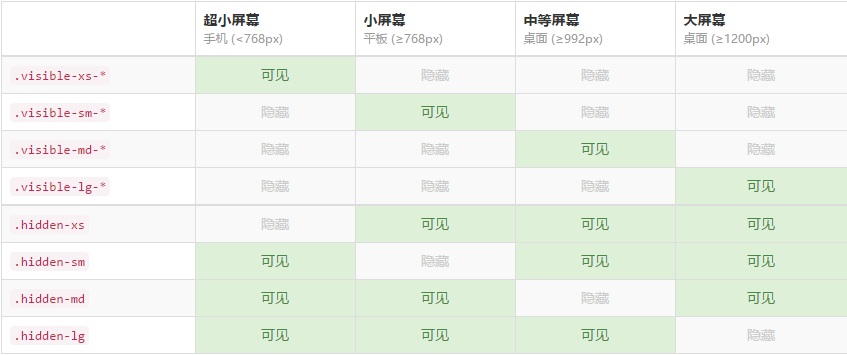
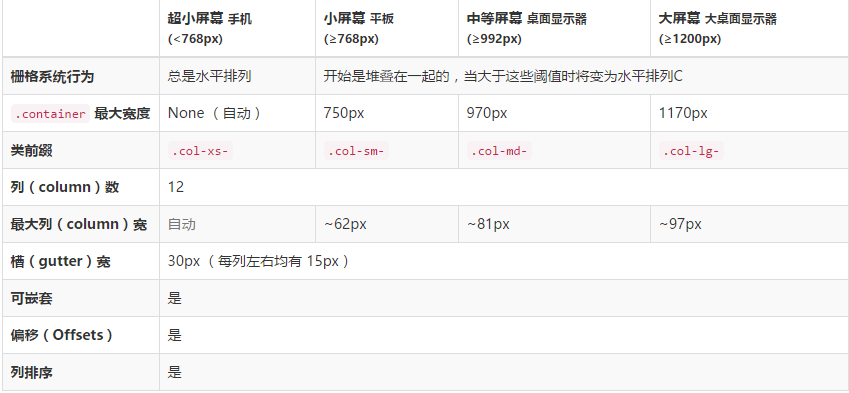

# 🎨 Bootstrap 前端框架完全指南

> Bootstrap 是简单、灵活的用于搭建 WEB 页面的 HTML、CSS、JavaScript 的工具集，是最受欢迎的响应式前端框架。

## 🎯 Bootstrap 简介

Bootstrap 基于 HTML5 和 CSS3，具有漂亮的设计、友好的学习曲线、卓越的兼容性，还有 12 列响应式栅格结构，丰富的组件等等。按照官网的宣传来说，Bootstrap 是最受欢迎的 HTML、CSS 和 JS 框架，用于开发响应式布局、移动设备优先的 WEB 项目。

### ✨ 核心特性

| 特性 | 描述 | 优势 |
|------|------|------|
| **响应式设计** | 移动设备优先的响应式栅格系统 | 📱 适配各种屏幕尺寸 |
| **丰富组件** | 预构建的 UI 组件和插件 | 🧩 快速构建界面 |
| **易于定制** | 可通过 LESS/Sass 变量定制 | 🎨 灵活的样式控制 |
| **跨浏览器兼容** | 支持现代浏览器和 IE8+ | 🌐 广泛的兼容性 |

## 简介

Bootstrap 源码包含了预先编译的 CSS、JavaScript 和图标字体文件，并且还有 LESS、JavaScript 和文档的源码。主要文件组织结构如下：

```bash
bootstrap/
├── less/  # css 源文件
├── js/  # js 源文件
├── fonts/  # 字体文件
├── dist/  # 预编译的资源文件
│   ├── css/ # 预编译的 css 文件
│   ├── js/  # 预编译的 js 文件
│   └── fonts/  # 预编译的字体文件
└── docs/  # 文档
    └── examples/  # 示例代码
```

基本模板:

```html
<!DOCTYPE html>
<html lang="zh-CN">
  <head>
    <!-- utf-8编码-->
    <meta charset="utf-8" />
    <!-- 在IE运行最新的渲染模式-->
    <meta http-equiv="X-UA-Compatible" content="IE=edge" />
    <!--视口viewport设置-->
    <meta name="viewport" content="width=device-width, initial-scale=1" />
    <!-- 上述3个meta标签*必须*放在最前面，任何其他内容都*必须*跟随其后！ -->
    <title>Bootstrap 101 Template</title>
    <!-- 引入Bootstrap -->
    <link href="css/bootstrap.min.css" rel="stylesheet" />
    <!-- 在IE8-浏览器中，支持HTML5新标签和媒体查询@media-->
    <!--[if lt IE 9]>
      <script src="https://cdn.bootcss.com/html5shiv/3.7.3/html5shiv.min.js"></script>
      <script src="https://cdn.bootcss.com/respond.js/1.4.2/respond.min.js"></script>
    <![endif]-->
  </head>
  <body>
    <h1>你好，世界！</h1>
    <!-- 先引入jQurey，再引入bootstrap插件 -->
    <script src="js/jquery.min.js"></script>
    <script src="js/bootstrap.min.js"></script>
  </body>
</html>
```

## 排版

Bootstrap 对默认的 HTML 元素进行了 CSS 样式定义，使得各种基本结构套用出来的 HTML 页面更加美观

### 文本

1. .h1 到 .h6 类，为的是给内联（inline）属性的文本赋予标题的样式
2. .lead 类，用于突出显示文本
3. .small 用于设置小号字体
4. .mark 类，用于突出显示文本
5. .pre-scrollable 类，用于创建一个带有滚动条的预格式化文本
6. .text-left、.text-center 和 .text-right、.text-justify、.text-nowrap 类，用于设置文本对齐方式
7. .text-muted、.text-primary、.text-success、.text-info、.text-warning 和 .text-danger 类，用于设置文本颜色
8. .text-lowercase、.text-uppercase 和 .text-capitalize 类，用于设置文本的大小写
9. .initialism 类，用于创建首字母缩略词
10. .blockquote 类，用于创建引用
11. .blockquote-reverse 类，用于创建右对齐引用
12. .help-block 类，用于创建帮助文本
13. .text-nowrap 和 .text-truncate 类，用于设置文本溢出
14. .text-hide 类，用于隐藏文本

### 列表

13. .list-group 类，用于创建列表组
14. .list-group-item 类，用于创建列表组项
15. .list-group-item-success、.list-group-item-info、.list-group-item-warning 和 .list-group-item-danger 类，用于设置列表组项颜色
16. .list-group-item-heading 和 .list-group-item-text 类，用于创建列表组项标题和内容
17. .list-unstyled 类，用于移除列表的默认样式
18. .list-inline 类，用于把列表转换为行内项目

### 背景

19. `.bg-* `类，用于设置背景颜色
20. .success、.info、.warning 和 .danger 类，用于设置背景颜色
21. .active 和 .disabled 类，设置激活和禁用状态样式

### 显示和隐藏

25. .invisible 和 `.visible-*` 类，用于显示或隐藏元素
26. .show 和 .hidden 类，用于显示或隐藏元素

27. `.visible-*` 和 `.hidden-*` 类，根据视口宽度显示或隐藏元素
28. .visible-print-block 和 .hidden-print 类，用于在打印时显示或隐藏元素
29. .print-only 和 .screen-only 类，用于打印时显示或隐藏元素
30. .print-only-block 和 .screen-only-block 类，用于打印时显示或隐藏元素

31. 

### 布局

34. .inline-block 类，用于使元素内联块级元素
35. .center-block 类，用于使元素水平居中
36. .pull-right 和 .pull-left 类，用于设置元素的浮动方向
37. .clearfix 类，用于清除浮动
38. .container 和 .container-fluid 类，用于创建一个容器
39. .container-fluid-xs、.container-fluid-sm、.container-fluid-md、.container-fluid-lg 和 .container-fluid-xl 类，用于创建不同视口下的容器
40. .container-fluid-xs-_、.container-fluid-sm-_、.container-fluid-md-_、.container-fluid-lg-_ 和 .container-fluid-xl-\* 类，用于创建不同视口下的容器

### 栅格系统

42. `.row` 和 `.col-*` 类，用于创建栅格系统
43. .row-eq-\* 类，用于创建等高栅格系统
44. .row-no-gutters 类，用于创建无间隔的栅格系统
45. .row-no-gutters-xs、.row-no-gutters-sm、.row-no-gutters-md、.row-no-gutters-lg 和 .row-no-gutters-xl 类，用于创建不同视口下的无间隔栅格系统
46. .row-no-gutters-xs-_、.row-no-gutters-sm-_、.row-no-gutters-md-_、.row-no-gutters-lg-_ 和 .row-no-gutters-xl-\* 类，用于创建不同视口下的无间隔栅格系统
47. .row-no-gutters-xs-reverse、.row-no-gutters-sm-reverse、.row-no-gutters-md-reverse、.row-no-gutters-lg-reverse 和 .row-no-gutters-xl-reverse 类，用于创建不同视口下的无间隔栅格系统
48. .row-no-gutters-reverse 类，用于创建反方向的栅格系统
49. .col-xs-_、.col-sm-_、.col-md-_、.col-lg-_ 和 .col-xl-\* 类，用于创建栅格系统
50. .col-xs-offset-_、.col-sm-offset-_、.col-md-offset-_、.col-lg-offset-_ 和 .col-xl-offset-\* 类，用于创建栅格系统偏移
51. .col-xs-pull-_、.col-sm-pull-_、.col-md-pull-_、.col-lg-pull-_ 和 .col-xl-pull-\* 类，用于创建栅格系统偏移
52. .col-xs-push-_、.col-sm-push-_、.col-md-push-_、.col-lg-push-_ 和 .col-xl-push-\* 类，用于创建栅格系统偏移



### 警告框

37. .alert 类，用于创建警告框
38. `.alert-*` 类，用于设置警告框颜色
39. .alert-dismissible 类，用于创建可关闭的警告框
40. .alert-link 类，给 alert 链接提供高亮显示
41.
42. .progress 类，用于创建进度条
43. .progress-striped 类，用于创建条纹进度条。添加.active 动态条纹
44. .progress-bar 类，用于创建进度条栏
45. .progress-bar-striped 类，用于创建条纹进度条 添加.active 动态条纹
46. `.progress-bar-* `类，用于设置进度条颜色

### 表格和分页

47. .table.responsive 类，用于创建响应式表格
48. .table 类，用于创建表格
49. .table-striped、.table-bordered、.table-hover、.table-condensed 和 .table-responsive 类，用于创建表格样式
50. .pagination 类，用于创建分页
51. .pagination-lg 和 .pagination-sm 类，用于创建大和小的分页

### 面板

52. .panel-group 类，用于创建面板组
53. .panel 类，用于创建面板
54. .panel-heading、.panel-body 和 .panel-footer 类，用于创建面板内容
55. .panel-default、.panel-primary、.panel-success、.panel-info、.panel-warning 和 .panel-danger 类，用于创建面板

### 标签和徽章

58. .label 类，用于创建标签
59. .label-default、.label-primary、.label-success、.label-info、.label-warning 和 .label-danger 类，用于设置标签颜色
60. .badge 类，用于创建徽章
61. .badge-default、.badge-primary、.badge-success、.badge-info、.badge-warning 和 .badge-danger 类，用于设置徽章颜色

### 媒体对象

62. .media
63. .media 类，用于创建单个媒体对象容器
64. .media-left、.media-right 和 .media-body 类，用于创建媒体对象
65. .media-heading 类，用于创建媒体对象的标题
66. .media-middle .media-bottom 类，定义媒体对象位置
67. .page-header 类，页头标题
68. .jumbotron 类，巨幕：用于创建一个较大的容器
69. .thumbnail 类，用于创建缩略图

### 按钮

67. .btn 类，用于创建按钮
68. .btn-group 类，用于创建按钮组
69. .btn-group-vertical 类，用于创建垂直排列的按钮组
70. .btn-group-justified 类，用于创建 justified 按钮组
71. .btn-group-lg 和 .btn-group-sm 类，用于创建大和小的按钮组
72. .btn-block 类，用于创建块级按钮
73. .btn-toolbar 类，用于创建工具栏
74. .btn-link 类，用于创建链接按钮
75. .btn-xs、.btn-sm、.btn-lg 和 .btn-block 类，用于创建大、小和块级按钮
76. .btn-default、.btn-primary、.btn-success、.btn-info、.btn-warning 和 .btn-danger 类，用于设置按钮颜色

77. .close 类，用于创建关闭按钮
78. .caret 类，用于创建下拉箭头

### 表单

79. .form-horizontal 类，用于创建水平排列的表单元素组
80. .form-inline 类，用于创建内联排列的表单元素组

81. .form-group 类，用于创建表单元素组
82. .form-group-lg 和 .form-group-sm 类，用于创建大和小的表单元素组
83. .control-label 类，用于创建表单标签
84. .control-group 类，用于创建表单组
85. .form-control 类，用于创建表单元素
86. .form-control-static 类，用于创建静态表单元素:纯文本和 label 元素放置于同一行
87. .control-list-inline 类，用于创建表单内联列表
88. .input-group 类，用于创建输入框组
89. .input-group-addon 和 .input-group-btn 类，用于创建输入框组
90. .input-group-lg 和 .input-group-sm 类，用于创建大和小的输入框组
91. .input-group-addon-lg 和 .input-group-btn-sm 类，用于创建大后缀和前缀
92. .input-group-addon-sm 和 .input-group-btn-sm 类，用于创建小后缀和前缀
93. .input-lg 和 .input-sm 类，用于创建大和小的表单元素
94. .input-block-level 类，用于创建块级输入框
95. .input-append 和 .input-prepend 类，用于创建输入框后缀和前缀
96. .input-append-lg 和 .input-prepend-lg 类，用于创建大后缀和前缀
97. .radio 和 .checkbox 类，用于创建单选框和复选框
98. .radio-inline 和 .checkbox-inline 类，用于创建行内单选框和复选框
99. .help-inline 和 .help-block 类，用于创建帮助文本
100.  .help-inline-lg 和 .help-block-lg 类，用于创建大和块级帮助文本
101.  .has-success、.has-warning、.has-error 和 .has-feedback 类，用于创建带有反馈图标的表单元素
102.  .has-success-lg、.has-warning-lg、.has-error-lg 和 .has-feedback-lg 类，用于创建大反馈图标
103.  .has-success-sm、.has-warning-sm、.has-error-sm 和 .has-feedback-sm 类，用于创建小反馈图标

### 响应式元素

1.  .img-responsive 类，用于创建响应式图片
2.  .img-rounded 和 .img-circle 和 .img-thumbnail 类，用于创建圆角、圆形和缩略图的图片
3.  .img-polaroid 类，用于创建带有阴影和边框的图片
4.  .img-circle 类，用于创建圆形图片
5.  .img-bordered 类，用于创建带边框的图片
6.  .img-responsive-fluid 类，用于创建响应式流体图片
7.  .img-responsive-width 类，用于创建响应式宽度的图片
8.  .img-responsive-height 类，用于创建响应式高度的图片
9.  .img-responsive-center 类，用于创建响应式居中的图片
10. .img-responsive-block 类，用于创建响应式块级元素
11. .img-responsive-inline 类，用于创建响应式内联元素

12. .img-responsive-list 类，用于创建响应式列表
13. .img-responsive-list-item 类，用于创建响应式列表项
14. .img-responsive-list-inline 类，用于创建响应式内联列表
15. .img-responsive-table 类，用于创建响应式表格
16. .img-responsive-form 类，用于创建响应式表单元素
17. .img-responsive-input-group 类，用于创建响应式输入框组
18. .img-responsive-btn 类，用于创建响应式按钮
19. .img-responsive-close 类，用于创建响应式关闭按钮
20. .img-responsive-label 类，用于创建响应式标签
21. .img-responsive-media 类，用于创建响应式媒体对象
22. .img-responsive-media-object 类，用于创建响应式媒体对象
23. .img-responsive-media-object-list 类，用于创建响应式媒体对象列表
24. .img-responsive-media-object-list-inline 类，用于创建响应式媒体对象列表内联
25. .img-responsive-media-object-list-group 类，用于创建响应式媒体对象列表组
26. .img-responsive-media-object-list-group-item 类，用于创建响应式媒体对象列表组项
27. .img-responsive-media-object-list-group-item-heading 类，用于创建响应式媒体对象列表组项标题
28. .img-responsive-media-object-list-group-item-text 类，用于创建响应式媒体对象列表组项文本

## 组件

必须调用 Bootstrap 框架提供的 bootstrap.js 文件。因为 Bootstrap 的组件交互效果都是依赖于 jQuery 库写的插件，所以在使用 bootstrap.js 之前一定要先加载 jquery.js 才会产生效果

```html
<!DOCTYPE html>
<html lang="en">
  <head>
    <meta charset="UTF-8" />
    <title>Document</title>
    <link
      href="https://cdn.bootcss.com/bootstrap/3.3.7/css/bootstrap.min.css"
      rel="stylesheet" />
  </head>
  <body>
    <!-- 字体图标 -->
    <span class="glyphicon glyphicon-search"></span>
    <span class="glyphicon glyphicon-ok"></span>
    <span class="glyphicon glyphicon-remove"></span>
    <span class="glyphicon glyphicon-plus"></span>
    <span class="glyphicon glyphicon-cloud"></span>
    <span class="glyphicon glyphicon-heart"></span>
    <!-- 下拉菜单  .dropup 类，可以让菜单向上弹出-->
    <div class="dropdown">
      <button
        class="btn btn-default dropdown-toggle"
        type="button"
        id="dropdownMenu1"
        data-toggle="dropdown"
        aria-haspopup="true"
        aria-expanded="true">
        Dropdown
        <span class="caret"></span>
      </button>
      <ul class="dropdown-menu" aria-labelledby="dropdownMenu1">
        <li role="presentation" class="dropdown-header">第一部分菜单头部</li>
        <li><a href="#">Action</a></li>
        <li><a href="#">Another action</a></li>
        <li role="separator" class="divider"></li>
        <li role="presentation" class="dropdown-header">第二部分菜单头部</li>
        <li><a href="#">Something else here</a></li>
      </ul>
    </div>

    <!-- 按钮组 -->
    <div class="btn-group btn-group-lg btn-group-justified">
      <button type="button" class="btn btn-default">
        <span class="glyphicon glyphicon-step-backward"></span>
      </button>
      <button type="button" class="btn btn-default">
        <span class="glyphicon glyphicon-fast-backward"></span>
      </button>
      <button type="button" class="btn btn-default">
        <span class="glyphicon glyphicon-backward"></span>
      </button>
      <button type="button" class="btn btn-primary">
        <span class="glyphicon glyphicon-play"></span>
      </button>
      <button type="button" class="btn btn-secondary">
        <span class="glyphicon glyphicon-pause"></span>
      </button>
      <button type="button" class="btn btn-default">
        <span class="glyphicon glyphicon-stop"></span>
      </button>
      <button type="button" class="btn btn-default">
        <span class="glyphicon glyphicon-forward "></span>
      </button>
      <button type="button" class="btn btn-default">
        <span class="glyphicon glyphicon-fast-forward"></span>
      </button>
      <button type="button" class="btn btn-default">
        <span class="glyphicon glyphicon-step-forward"></span>
      </button>
    </div>
    <!-- 输入框组 -->
    <div class="input-group .input-group-lg">
      <span class="input-group-addon">$</span>
      <input
        type="text"
        class="form-control"
        aria-label="Amount (to the nearest dollar)" />
      <span class="input-group-addon">.00</span>
      <!-- 按钮式下拉菜单 -->
      <div class="input-group-btn">
        <button
          type="button"
          class="btn btn-default dropdown-toggle"
          data-toggle="dropdown"
          aria-haspopup="true"
          aria-expanded="false">
          Action <span class="caret"></span>
        </button>
        <ul class="dropdown-menu">
          <li><a href="#">Action</a></li>
          <li><a href="#">Another action</a></li>
          <li><a href="#">Something else here</a></li>
          <li role="separator" class="divider"></li>
          <li><a href="#">Separated link</a></li>
        </ul>
      </div>
    </div>

    <!-- 导航条 -->
    <div class="navbar navbar-default" role="navigation">
      <div class="navbar-header">
        <a href="##" class="navbar-brand"
          >部件 logo </a>
      </div>
      <!-- 导航：选项卡 胶囊 垂直方向 自适应 breadcrumb面包屑导航-->
      <ul class="nav nav-tabs nav-pills .nav-stacked nav-justified">
        <li class="active"><a href="##">Home</a></li>
        <li><a href="##">CSS3</a></li>
        <li><a href="##">Sass</a></li>
        <li><a href="##">jQuery</a></li>
        <li class="disabled"><a href="##">Responsive</a></li>
      </ul>
      <!-- 导航搜索框 -->
      <form action="##" class="navbar-form navbar-left" rol="search">
        <div class="form-group">
          <input type="text" class="form-control" placeholder="请输入关键词" />
        </div>
        <button type="submit" class="btn btn-default">搜索</button>
      </form>
      <!-- 导航按钮 -->
      <button type="button" class="btn btn-default navbar-btn">Sign in</button>
      <!-- 导航文本 -->
      <p class="navbar-text">
        Signed in as <a href="#" class="navbar-link">admin</a>
      </p>
    </div>
    <!-- 分页 -->
    <nav aria-label="Page navigation">
      <ul class="pagination pagination-sm">
        <li class="disabled">
          <span aria-label="Previous">
            <span aria-hidden="true">&laquo;</span>
          </span>
        </li>
        <li class="active"><span>1</span></li>
        <li><a href="#">2</a></li>
        <li><a href="#">3</a></li>
        <li><a href="#">4</a></li>
        <li><a href="#">5</a></li>
        <li>
          <a href="#" aria-label="Next">
            <span aria-hidden="true">&raquo;</span>
          </a>
        </li>
      </ul>
    </nav>
    <script src="https://cdn.bootcss.com/jquery/1.12.4/jquery.min.js"></script>
    <script src="https://cdn.bootcss.com/bootstrap/3.3.7/js/bootstrap.min.js"></script>
  </body>
</html>
```

## 插件

因为在 Bootstrap 中的 JavaScript 插件都是依赖于 jQuery 库，所以不论是单独导入还一次性导入之前必须先导入 jQuery 库

Bootstrap 提供 bootstrap.js 文件，包含了 Bootstrap 的所有 JavaScript 插件（压缩版本：bootstrap.min.js）

【也可以单独导入】

为方便单独导入特效文件，Bootstrap 提供了 12 种 JavaScript 插件，他们分别是：

☑ 动画过渡（Transitions）:对应的插件文件“transition.js”

☑ 模态弹窗（Modal）:对应的插件文件“modal.js”

☑ 下拉菜单（Dropdown）：对应的插件文件“dropdown.js”

☑ 滚动侦测（Scrollspy）：对应的插件文件“scrollspy.js”

☑ 选项卡（Tab）：对应的插件文件“tab.js”

☑ 提示框（Tooltips）：对应的插件文件“tooltop.js”

☑ 弹出框（Popover）：对应的插件文件“popover.js”

☑ 警告框（Alert）：对应的插件文件“alert.js”

☑ 按钮（Buttons）：对应的插件文件“button.js”

☑ 折叠/手风琴（Collapse）：对应的插件文件“collapse.js”

☑ 图片轮播 Carousel：对应的插件文件“carousel.js”

☑ 自动定位浮标 Affix：对应的插件文件“affix.js”

```html
<!-- 触发模态弹出窗的元素 -->
<button
  type="button"
  data-toggle="modal"
  data-target="#mymodal"
  class="btn btn-primary">
  点击
</button>
<!-- 模态框 -->
<div id="#mymodal" class="modal show fade">
  <div class="modal-dialog modal-lg">
    <div class="modal-content">
      <div class="modal-header">
        <h4 class="modal-title">模态弹出窗标题</h4>
        <button type="button" class="close" data-dismiss="modal">
          <span aria-hidden="true">&times;</span
          ><span class="sr-only">Close</span>
        </button>
      </div>
      <div class="modal-body">
        <p>模态弹出窗主体内容</p>
      </div>
      <div class="modal-footer">
        <button type="button" class="btn btn-default" data-dismiss="modal">
          关闭
        </button>
        <button type="button" class="btn btn-primary">保存</button>
      </div>
    </div>
    <!-- /.modal-content -->
  </div>
  <!-- /.modal-dialog -->
</div>
<!-- /.modal -->

<!-- 滚动监听 -->
<div
  id="myNavbar"
  class="navbar navbar-default navbar-fixed-top"
  role="navigation">
  <ul class="nav navbar-nav">
    <li><a href="#html" tabindex="-1">HTML</a></li>
    <li><a href="#css" tabindex="-1">CSS</a></li>
    <li><a href="#javascript" tabindex="-1">javascript</a></li>
  </ul>
</div>
<div id="scrollspy" style="height:250px;overflow:auto;position:relative">
  <h4 id="html">Html</h4>
  <p>Html内容</p>
  <br /><br /><br /><br /><br /><br /><br /><br /><br /><br />
  <h4 id="css">CSS</h4>
  <p>CSS内容</p>
  <br /><br /><br /><br /><br /><br /><br /><br /><br /><br />
  <h4 id="javascript">javascript</h4>
  <p>javascript内容</p>
  <br /><br /><br /><br /><br /><br /><br /><br /><br /><br />
</div>

<!-- 选项卡菜单-->
<ul id="myTab" class="nav nav-tabs" role="tablist">
  <li class="active">
    <a href="#bulletin" role="tab" data-toggle="tab">公告</a>
  </li>
  <li><a href="#rule" role="tab" data-toggle="tab">规则</a></li>
</ul>
<!-- 选项卡面板 -->
<div id="myTabContent" class="tab-content">
  <div class="tab-pane active" id="bulletin">公告内容面板</div>
  <div class="tab-pane " id="rule">规则内容面板</div>
  <div class="tab-pane " id="forum">论坛内容面板</div>
</div>
<!-- 提示框 -->
<button
  type="button"
  class="btn btn-default"
  data-toggle="tooltip"
  data-placement="top"
  data-original-title="hover触发"
  data-animation="false"
  data-delay="500"
  data-trigger="hover">
  hover触发 无动画 延迟500ms
</button>

<!-- 弹出框 -->
<button
  type="button"
  class="btn btn-default"
  data-toggle="popover"
  data-placement="bottom"
  data-animation="false"
  data-trigger="hover"
  data-delay="500"
  title="标题"
  data-content="下侧">
  下侧 无动画 hover触发 延迟500ms
</button>
<script>
  $(function () {
    // 触发选项卡菜单
    $("#myTab a").click(function (e) {
      e.preventDefault();
      $(this).tab("show");
    });

    // 滚动监听
    $("#scrollspy").scrollspy({ target: "#myNavbar" });

    // js触发模态框
    $("#myModal").modal({
      backdrop: "static",
      keyboard: false, //用户按ESC键关闭模态弹出窗
      show: false,
      remote: "http://www.baidu.com",
      backdrop: true,
      size: "lg",
    });
    $("#myModal").modal("show");
    $("#myModal").modal("hide");
    $("#myModal").modal("toggle");
    $("#myModal").on("hidden.bs.modal", function (e) {
      console.log("模态框关闭");
    });
    $("#myModal").on("shown.bs.modal", function (e) {
      console.log("模态框打开");
    });

    // 触发提示框
    $('[data-toggle="tooltip"]').tooltip({
      container: "body",
      placement: "bottom",
      trigger: "hover",
      delay: { show: 500, hide: 100 },
      title: "提示框",
      html: true,
      animation: false,
      template:
        '<div class="tooltip" role="tooltip"><div class="tooltip-arrow"></div><div class="tooltip-inner"></div></div>',
      offset: 10,
      viewport: {
        selector: "#myNavbar",
        padding: 10,
        border: 1,
      },
      customClass: "my-tooltip",
    });
    // 触发弹出框
    $('[data-toggle="popover"]').popover({
      title: "我是标题",
      content: "我是内容",
      html: true,
      placement: "bottom",
      trigger: "hover",
      delay: { show: 500, hide: 100 },
      animation: false,
      template:
        '<div class="popover" role="tooltip"><div class="arrow"></div><h3 class="popover-title"></h3><div class="popover-content"></div></div>',
      offset: 10,
    });
  });
</script>
```
