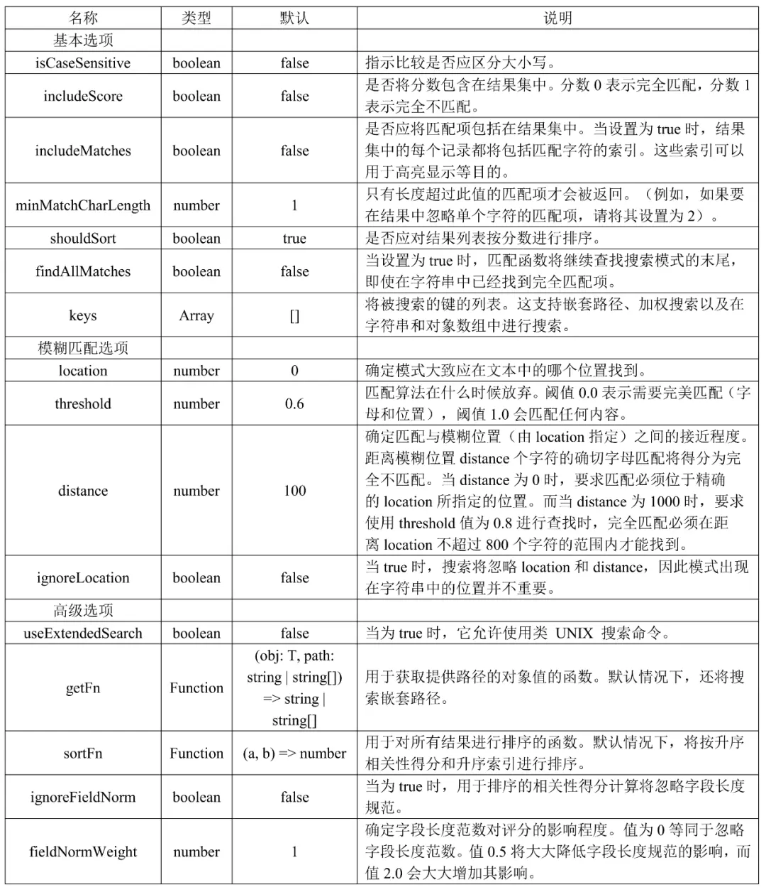
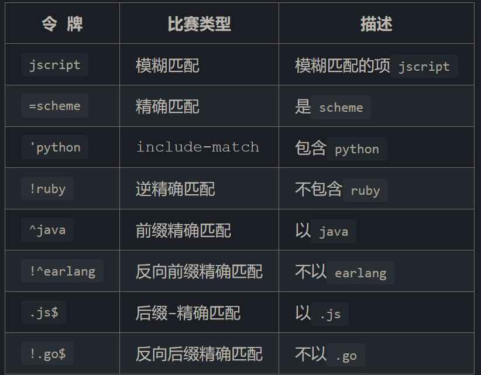

## fuse.js介绍
Fuse.js是一款功能强大且轻量级的JavaScript模糊搜索库，支持OpenAtom OpenHarmony（以下简称“OpenHarmony”）操作系统，它具备模糊搜索和排序等功能。该库高性能、易于使用、高度可配置，支持多种数据类型和多语言搜索，适用于各种场景，如搜索引擎、电子商务网站和数据可视化，可以帮助用户在包含大量数据的环境中快速地找到相关的搜索结果，并支持高度可定制化的搜索选项。

参考：https://www.fusejs.io/
## options选项配置
```js
// 引入依赖包
import fuse from 'fuse.js'

// 创建一个包含书籍信息的列表数组，作为待搜索的数据
var list = [
  {
    "title": "Old Man's War",
    "author": "John Scalzi",
    "tags": ["fiction"]
  },
  {
    "title": "The Lock Artist",
    "author": "Steve",
    "tags": ["thriller"]
  }
]

// 配置搜索选项，包括启用分数计算和指定搜索的键（作者和标签）
var options = {
  // 是否将分数包含在结果集中
  includeScore: true,
  isCaseSensitive:false,
  // 当item是Object时，在 'author' 和 'tags' 数组中进行搜索
  keys: ['author', 'tags'],
  // 是否将匹配的字符包含在结果集中
  includeMatchs:false,
  // 只有长度超过此值的匹配项才会返回
  minMatchCharLength:1,
  //是否按份数进行排序
  shouldSort:true,
  //找到了匹配项后，是否继续查找匹配
  findAllMatches:false,
  //表示返回的搜索结果的最大数量
  limit:100

  // 大于此阈值，才会出现在结果中
  threshold:0.6,
  //模糊位置：确定模式大致应在文本中哪个位置找到
  location:0,
  //模糊距离：确定匹配与模糊位置location之间的接近程度
  distance:100,
  // 是否忽略location和distance
  ignoreLocation:false,

  //是否允许使用UNIX搜索命令
  useExtendedSearch:false,
  //用于获取提供路径的对象值的函数
  getFn:(obj,path:string|string[])=>string|string[],
  //对结果进行排序的函数。默认根据得分，升序排序
  sortFn:(a,b)=>number,
  //用于排序的相关性得分计算，是否忽略字段长度规范
  ignoreFieldNorm:false,
  //确定字段长度规范对评分的影响程度
  fieldNormWeight:1
}
 
// 创建一个 Fuse 搜索实例，将列表和选项传递给它
var fuse = new Fuse(list, options)

// 使用 Fuse 搜索实例执行搜索，查找包含 'tion' 的结果
var result = fuse.search('tion')

// 搜索结果数据结构（result变量内容）示例如下：
[
  {
    "item": {
      "title": "Old Man's War",
      "author": "John Scalzi",
      "tags": ["fiction"]
    },
    "refIndex": 0,
    "score": 0.03
  }
]
```

## 全局配置
通过Fuse.config进行全局配置，可以覆盖所有fuse实例
```js
const options = {
  getFn: (obj, path) => {
    // Use the default `get` function
    const value = Fuse.config.getFn(obj, path)
    // ... do something with `value`
    return value
  }
}
```
## 静态方法

```js
let books = [
  {
    "title": "Old Man's War",
    "author": {
      "firstName": "John",
      "lastName": "Scalzi"
    }
  },
  {
    "title": "The Lock Artist",
    "author": {
      "firstName": "Steve",
      "lastName": "Hamilton"
    }
  }
  /*...*/
]

const options = { keys: ['title', 'author.firstName'] }

// 从列表中预先生成索引，并将其直接传递到 Fuse 实例中。如果列表（相当）大，它会加快实例化速度。
const myIndex = Fuse.createIndex(options.keys, books)

// 序列化并保存索引
fs.writeFile('fuse-index.json', JSON.stringify(myIndex.toJSON()))

const fuseIndex = await require('fuse-index.json')

// 解析序列化的 Fuse 索引。
const myIndex = Fuse.parseIndex(fuseIndex)

const fuse = new Fuse(books, options, myIndex)
```

## 实例方法
```js
let data = [
  {
    "title": "Old Man's War",
    "name": "Old Man's War",
    "author": {
      "first.name": "John",
      "last.name": "Scalzi",
      "age": "61",
      "tags": [
        {
          "value": "American"
        }
      ]
    }
  }
]

const options = {
  useExtendedSearch: true,
  includeScore: true,
  keys: [  // 使用getFn函数 & 加权搜索
    { name: 'title', weight: 0.3,getFn: (book) => book.title },
    { name: 'authorName',weight: 0.7, getFn: (book) => book.author.name }
  ],
  keys: [
    'title','name'
    ['author', 'first.name'],
    ['author', 'last.name'],
    ['author.tags.value'], // 嵌套时，使用.表示法
    ['author','tags','value'],// 也可以使用数组表示法
    'author.age'
  ]
}
/** 搜索整个文档集合，并返回搜索结果列表。
 * pattern string|reg|逻辑查询
 */
fuse.search(/* pattern , options*/)
fuse.search('查询字符串')
fuse.search(/[abc]/)
// 包含 "Man" and "Old",或者 "Artist" 结尾
fuse.search("'Man 'Old | Artist$")
fuse.search({
  $and: [{ name: 'abc' }, { title: 'xyz' }],
  $or: [{ name: 'abc' }, { name: 'def' }]
})
//要处理包含点的键，您可以在构建查询时使用 $path和 $val属性。
fuse.search({
  $and: [
    { $path: ['author', 'first.name'],$val: 'jon'},
    { $path: ['author', 'last.name'],$val: 'scazi'},
    { $or: [{ title: '^lock' },{ title: '!arts' } ]}
  ]
})

//设置/替换整个文档集合。如果未提供索引，则将生成一个索引
const fruits = ['apple', 'orange']
const fuse = new Fuse(fruits)
fuse.setCollection(['banana', 'pear'])

//往集合中添加一个元素
fuse.add('banana')

//类似数组的filter方法
const results = fuse.remove((doc) => {
  return doc === 'banana' || doc === 'pear'
})

//删除指定位置的元素
fuse.removeAt(1)

//往集合中添加一个元素
fuse.add('banana')

//返回生成的 Fuse 索引
const fruits = ['apple', 'orange', 'banana', 'pear']
const fuse = new Fuse(fruits)
fuse.getIndex().size()
```
## 搜索模式
空格充当 AND 运算符，而单个竖线 | 字符充当 OR 运算符。要转义空格，请使用双引号 ="scheme language" 进行精确匹配
